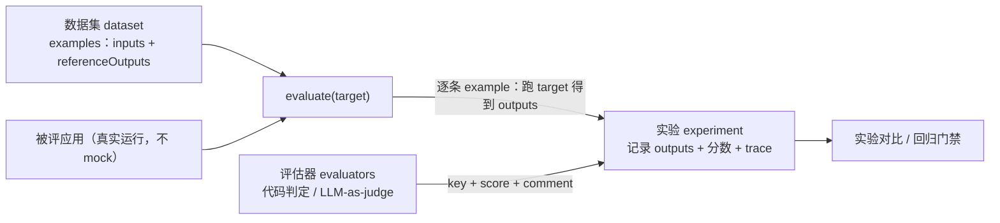

import { Canvas, Controls, Meta } from '@storybook/addon-docs/blocks';
import * as AgentEvals from './agent-evals.stories';

<Meta of={AgentEvals} name="Docs" />

# Agent 评估

评估回答「好不好」，单测回答「对不对」：Agent 的输出非确定、路径有多步，`expect(answer).toBe(...)` 断不了质量。评估把质量变成可重复测量的数字，一共三件事——**数据集**（固定一批考题）、**评估器**（判卷规则）、`evaluate`（跑批成一次实验）。读完你能预测：改了提示词之后怎么知道变好还是变坏、同一个答案在精确匹配和 LLM-judge 手里命运如何、CI 怎么用分数拦住质量回归。



评估循环只有一个方向：考题固定、判卷规则固定，变的只有被评应用——所以两次运行的分数才可比。

| 对象 / 参数 | 是什么 | 默认 / 要点 |
| --- | --- | --- |
| example | 一条考题：`inputs` + `outputs`（期望输出，评估器侧叫 `referenceOutputs`）+ `metadata` | `outputs` 可选，只被评估器使用 |
| dataset | examples 的集合 | 每次增删改 example 自动产生新版本；历史版本只读 |
| `EvaluationResult` | 评估器的一条返回：`key` + `score` / `value` + `comment` | `score` 数值型，`value` 分类型 |
| `evaluate().data` | 数据集名、`Example[]` 或 `listExamples()` 迭代器 | 必填 |
| `evaluate().evaluators` | 逐条 example 运行的评估器数组 | 绑定在数据集 UI 上的评估器会自动触发 |
| `evaluate().numRepetitions` | 每条 example 重复运行次数 | 默认 `1`；非确定性输出可调高看分布 |
| `evaluate().maxConcurrency` | 预测 / 评估的并发上限 | 未设置时由 SDK 决定；大任务务必显式设置防限流 |
| 环境变量 | `LANGSMITH_API_KEY` 必需（[6.1](?path=/docs/langsmith-observability--docs) 已开通） | judge 用 OpenAI 时另需 `OPENAI_API_KEY` |

## 快速上手

从零到第一个实验的最小闭环。判卷用确定性规则，全程不调模型、不花 token；前置条件：Node ≥ 20、`npm install langsmith`、`.env` 里有 `LANGSMITH_API_KEY`。

先创建数据集——用 `Client` 写入 3 条带期望输出的考题：

```ts
// seed-dataset.ts —— npx tsx seed-dataset.ts（import 'dotenv/config' 放最前）
import 'dotenv/config';
import { Client } from 'langsmith';

const client = new Client(); // 认证读 LANGSMITH_API_KEY

const dataset = await client.createDataset('weather-qa', {
  description: 'weather agent 的最小评估集',
});

await client.createExamples({
  datasetId: dataset.id,
  inputs: [
    { question: "What's the weather in San Francisco?" },
    { question: "What's the weather in Tokyo?" },
    { question: "What's the weather in Paris?" },
  ],
  outputs: [
    // 这里的 outputs 在评估时以 referenceOutputs 出现
    { answer: "It's 75 degrees and sunny in San Francisco." },
    { answer: "It's 68 degrees and cloudy in Tokyo." },
    { answer: "It's 61 degrees and rainy in Paris." },
  ],
});
```

再写被评目标与一个评估器，交给 `evaluate` 跑批：

```ts
// run-eval.ts —— npx tsx run-eval.ts
import 'dotenv/config';
import { evaluate } from 'langsmith/evaluation';

const runAgent = async (inputs: { question: string }) => {
  // 换成你的 agent：const result = await agent.invoke({ messages: [...] })
  return { answer: "It's 75 degrees and sunny in San Francisco." };
};

const exactAnswer = ({ outputs, referenceOutputs }: {
  outputs: Record<string, any>;
  referenceOutputs?: Record<string, any>;
}) => ({
  key: 'exact_answer',
  score: outputs.answer === referenceOutputs?.answer,
});

await evaluate(runAgent, {
  data: 'weather-qa', // 上一步创建的数据集名
  evaluators: [exactAnswer],
  experimentPrefix: 'quickstart',
});
```

可观察结果：打开 smith.langchain.com → 左侧 **Datasets** → `weather-qa` → **Experiments** 标签，出现一条 `quickstart` 开头的实验；每条 example 一行，`exact_answer` 列是分数，点开能看到这次运行的完整 trace（trace 即 [6.1](?path=/docs/langsmith-observability--docs) 的 run 树）。第二条考题问 Tokyo、答案却返回了 San Francisco——评估器判 0，这正是单测漏掉、评估抓得住的问题。

## 为什么需要评估

[6.2 测试](?path=/docs/testing--docs)（单元与集成测试）的对象是**功能对错**：mock 掉模型后，断言代码路径按预期走。评估的对象是**输出质量**，两个原因让单测无能为力：

- **输出非确定。** 同一输入两次运行，措辞、语序、单位都可能不同；`toBe` 一写就挂，挂了也不代表答案错了。
- **对错分散在轨迹里。** 多步 Agent 的质量由工具选择、参数、顺序和最终答案共同决定——单点断言看不见「该查政策先查政策」这类过程问题。

官方对 evals 与集成测试的区分：evals 按 reference 或评分标准（rubric）给 Agent 行为打分，因此在你修改 prompt、工具或模型时**能抓住回归**。所以评估的触发时机很固定：每次改提示词、换模型、动工具集之前跑一次，用分数回答「变好还是变坏」。离线评估之外，LangSmith 还支持在线评估（对生产 trace 打分）与人工标注——本课聚焦离线评估这条主线，在线侧的原料（annotation queue、trace 转存）在 6.1 已接入。

## 数据集与 examples

dataset 是 examples 的集合；一条 example 固定三部分：`inputs`（传给被评应用的输入字典）、reference outputs（可选，**只有评估器用它**）、`metadata`（可选，供过滤与视图分组）。给 Agent 建数据集时，官方约定的 schema 是两边都用 `{"messages": [...]}`——输入一条用户消息，期望输出是对应的回复消息序列。

考题从哪来，三条路：

| 来源 | 做法 | 适合 |
| --- | --- | --- |
| 代码创建 | `client.createDataset()` + `client.createExamples()` | 起步集、结构化任务 |
| UI 手工 | Datasets 页新建后逐条添加 | 少量精挑样例 |
| 从 trace 转存 | trace / 实验结果里多选 → **Add to Dataset**（[6.1](?path=/docs/langsmith-observability--docs)） | 真实 badcase，最有价值 |

**版本是数据集的核心机制。** LangSmith 的数据集自动带版本：每次增删改 example 都会产生一个新版本，版本默认由变更时间戳定义，查看历史版本时 examples 只读。这保证旧实验的分数永远对应当时那批考题。给版本打 tag 可以命名里程碑（UI 里 **+ Tag this version**，SDK 用 `updateDatasetTag`），评估时用 `asOf` 取定版本：

```ts
// 给当前版本打上里程碑 tag（asOf 必须是确切版本时间点，"latest" 表示最新）
await client.updateDatasetTag({
  datasetName: 'weather-qa',
  asOf: 'latest',
  tag: 'prod',
});

// CI 里固定考题：asOf 取定版本，数据集后续演进不影响本次可比性
await evaluate(runAgent, {
  data: client.listExamples({ datasetName: 'weather-qa', asOf: 'latest' }),
  evaluators: [exactAnswer],
});
```

`listExamples()` 返回异步迭代器，直接喂给 `evaluate().data`；它还支持 `splits`（train/test 切分）和 `metadata`（按元数据过滤）两种缩小考题范围的方式。数据集大小从十几条开始即可——先覆盖已知 badcase，随迭代从失败 trace 里持续长出来。

## 评估器

评估器接收一条 example 的实际结果并返回 `EvaluationResult`：`key`（指标名）+ `score`（数值）或 `value`（分类）+ 可选 `comment`（判分理由）。LangSmith 把评估器归为几类——人工、代码、LLM-as-judge、成对比较（pairwise）——本课展开代码判定与 LLM-as-judge 两条主线。选型只记一条原则：**能确定判的交给代码，语义判断才交给 judge**。代码判定快、免费、可复现；judge 灵活但非确定、要花 token、要校准。

| 家族 | 判什么 | 确定性 | 典型场景 |
| --- | --- | --- | --- |
| 精确匹配 | 逐字 / 结构相等 | 确定 | 分类标签、结构化输出、SQL |
| 规则包含 / 归一化 | 关键词命中、归一化后相等 | 确定 | 关键字段必须出现 |
| 代码判定 | 任意可编程规则 | 确定 | 单位换算、容差、字段校验 |
| LLM-as-judge | 语义质量（正确性、语气、有用性） | 非确定 | 开放式答案 |
| 轨迹匹配 / 轨迹 judge | 工具调用序列与过程 | 确定 / 非确定 | 过程合规（见下节） |

下面的实例把这套选择落到同一批答案上：预置 5 条考题与两版候选答案（v1 是 baseline，v2 是改了提示词——要求照抄工具输出——之后的版本），exact 与 contains 两列是真实执行的规则判定，LLM-judge 列的分数为预置模拟值（Storybook 内不调用模型）：

<Canvas of={AgentEvals.EvaluatorLab} />
<Controls of={AgentEvals.EvaluatorLab} />

| 读者操作 | 可观察证据 |
| --- | --- |
| 切换「评估器」到 精确匹配 | E2（语义等价、单位不同）与 E5（拼写小错）被判 ✗——精确匹配漏判语义等价，通过率只有 0.2 |
| 切换到 LLM-judge（模拟） | E2 得 0.9、E5 得 1.0——语义层判过；E3 缺城市只拿 0.7，judge 的维度是「正确但不完整」 |
| 切换「版本」到 v2 | E2/E4 修好，E3 温度幻觉（82≠75）跌到 0.3——总均分 0.86 过门禁，但单条倒退被暴露 |
| 观察底部三组 v1→v2 分数条 | 门禁线 0.80 下：exact 两版都被拦截（0.2 / 0.4），contains 与 judge 只放行 v2——换一个门禁评估器，对同一版本的结论就变了 |
| 打开 Show code | 看到该 Canvas 实际执行的 `example.ts`：预置答案集 + 规则判定，judge 分数标注为模拟值 |

这批数据给出两个正文结论的样例：其一，精确匹配对开放式答案是错的尺子——它把语义等价判成错误，逼着团队逐字对齐；其二，门禁评估器的选择决定你看到什么——contains 看不见 E3 错在哪，judge 才给出「温度幻觉」的理由。

### 代码判定

自定义评估器就是一个函数：参数对象里有 `inputs`、`outputs`、`referenceOutputs`（还有 `run` 与 `example`，分别是这次运行的 trace 与考题元数据），返回 `EvaluationResult`，同步异步皆可：

```ts
const temperatureWithinTolerance = ({ outputs, referenceOutputs }: {
  outputs: Record<string, any>;
  referenceOutputs?: Record<string, any>;
}) => {
  // 从答案里抠出温度数字，允许 1 度误差——确定性判定，可复现
  const actual = Number(/-?\d+(\.\d+)?/.exec(outputs.answer)?.[0]);
  const expected = Number(/-?\d+(\.\d+)?/.exec(referenceOutputs?.answer ?? '')?.[0]);
  return {
    key: 'temperature_within_1_degree',
    score: Math.abs(actual - expected) <= 1,
    comment: `actual=${actual}° expected=${expected}°`,
  };
};
```

需要返回多个分数时返回 `{ results: [EvaluationResult, ...] }`。不想从零写的话，开源包 `openevals` 提供预置的确定性评估器：`exactMatch`（精确匹配）、`levenshteinDistance`（编辑距离）、`createEmbeddingSimilarityEvaluator`（语义相似度）和 `createJsonMatchEvaluator`（结构化输出与工具调用参数比对）。Canvas 里的 contains 列就是最简单的规则包含——关键词全命中才算过。

### LLM-as-judge

答案开放式、语义等价要认可、质量是多维度时，规则写不动，交给 judge 模型判卷。`openevals` 的 `createLLMAsJudge` 是标准入口，judge 也用 OpenAI：

```ts
import { createLLMAsJudge, CORRECTNESS_PROMPT } from 'openevals';

// 运行条件：npm install openevals；judge 走 OPENAI_API_KEY
const correctness = createLLMAsJudge({
  prompt: CORRECTNESS_PROMPT,       // 预置判分提示（对照参考答案查正确性）
  model: 'openai:gpt-4o',           // "提供方:模型" 字符串；也可传 judge 实例
});

const result = await correctness({ inputs, outputs, referenceOutputs });
// { key: "correctness", score: ..., comment: "..." }
```

参数要点：`continuous: true` 让分数落在 0-1 连续区间；`choices: [0, 0.5, 1]` 限定档位（与 `continuous` 互斥）——门禁场景推荐档位，分数更稳；`system`、`fewShotExamples`、`feedbackKey`（自定义指标名）按需加。prompt 里用 `{inputs}`、`{outputs}`、`{referenceOutputs}` 占位，评分维度与每档含义写在 prompt 里，输出解析由 `continuous` / `choices` 控制。自定义写法示例：

```ts
const HELPDESK_PROMPT = `You are grading a customer support answer.
[Question]
{inputs}
[Reference answer]
{referenceOutputs}
[Answer to grade]
{outputs}
Grade on three dimensions independently: factual correctness,
whether it directly addresses the question, and professional tone.
Define what "fully / partially / not met" means for each dimension
before assigning a grade.`;

const helpdeskQuality = createLLMAsJudge({
  prompt: HELPDESK_PROMPT,
  model: 'openai:gpt-4o',
  choices: [0, 0.5, 1],
  feedbackKey: 'helpdesk_quality',
});
```

预置 prompt 覆盖常见维度（`CORRECTNESS_PROMPT`、`CONCISENESS_PROMPT`、`HALLUCINATION_PROMPT`、`ANSWER_RELEVANCE_PROMPT`，以及安全类的 `TOXICITY_PROMPT`、`PII_LEAKAGE_PROMPT` 等），按 reference 判的（correctness / hallucination）与免 reference 判的（conciseness / tone）要分清——免 reference 的维度不对照考题答案，只能判答案自身的性质。

judge 分数的本质是「另一个模型的意见」，官方明确要求**仔细复核分数并调优 prompt**，加 few-shot 例子（输入、输出、期望判分的样例）通常能显著改善。两个实务点：judge 自己也是一次模型调用，会进 trace、计 token；judge 判错时点开分数旁的 judge trace，看它实际收到了什么再改 prompt。

## 轨迹级评估

结果级评估看最终答案，轨迹级评估看中间过程——Agent 该调哪个工具、传什么参数、按什么顺序。两类各有盲区：只看结果，「对了但绕路 / 调了不该调的工具」看不见；只看轨迹，工具全对但最终表述错误也放过了。Agent 场景通常结果级打底，对流程敏感的任务加轨迹级。

确定性轨迹匹配用 `agentevals` 的 `createTrajectoryMatchEvaluator`：把实际消息序列（含 `tool_calls` 与 `ToolMessage`）与参考轨迹比对，`trajectoryMatchMode` 四种模式覆盖不同的严格程度：

```ts
import { createTrajectoryMatchEvaluator } from 'agentevals';

// 运行条件：npm install agentevals @langchain/core
const evaluator = createTrajectoryMatchEvaluator({
  trajectoryMatchMode: 'strict', // 消息结构、顺序、工具调用全一致（内容可不同）
});

const result = await evaluator({
  outputs: agentResult.messages,          // 实际轨迹
  referenceOutputs: referenceTrajectory,  // 参考轨迹：HumanMessage / AIMessage(tool_calls) / ToolMessage / AIMessage
});
// { key: "trajectory_strict_match", score: true }
```

| 模式 | 判定 | 适合 |
| --- | --- | --- |
| `strict` | 工具调用与顺序完全一致 | 顺序敏感流程（先查政策再授权） |
| `unordered` | 工具调用一致、顺序不限 | 工具彼此独立 |
| `subset` | 实际调用是参考的子集——**不许调参考外的工具** | 禁用多余工具 |
| `superset` | 实际调用是参考的超集——参考工具至少全调，允许多调 | 完成路径不唯一 |

参数比对的严格度由 `toolArgsMatchMode` 控制（`exact` 默认 / `ignore` / `subset` / `superset`），`toolArgsMatchOverrides` 还能按工具名单独定义相等——例如城市名忽略大小写。

参考轨迹写不动时，轨迹 judge 登场：`createTrajectoryLLMAsJudge` 搭配预置的 `TRAJECTORY_ACCURACY_PROMPT`，不需要参考轨迹也能评「这条路走得对不对」；带参考时换 `TRAJECTORY_ACCURACY_PROMPT_WITH_REFERENCE` 并传 `referenceOutputs`。LangGraph 应用可先用 `extractLangGraphTrajectoryFromThread` 从 thread 提取轨迹（节点步骤序列），再做严格匹配或 judge。

## 运行 evaluate 与实验对比

`evaluate` 是跑批入口：对数据集里每条 example 调一次被评目标，逐条运行评估器，把输出、分数与 trace 归档成一次实验。完整形态：

```ts
import { evaluate } from 'langsmith/evaluation';

await evaluate(
  async (inputs) => {
    const result = await agent.invoke(inputs); // 真实运行 Agent，不 mock
    return { messages: result.messages };
  },
  {
    data: 'weather-qa',
    evaluators: [exactAnswer, temperatureWithinTolerance, correctness],
    experimentPrefix: 'prompt-v2', // 实验名前缀，用于对比时辨认
    maxConcurrency: 4,             // 大任务必设，防限流
    numRepetitions: 1,             // 默认 1；非确定性输出可调高看分布
    metadata: {
      models: ['openai:gpt-4o'],   // 保留键：填充实验表的模型 / 提示 / 工具列
      prompts: ['weather-agent/v2'],
      tools: ['get_weather'],
    },
  },
);
```

并发有两级旋钮：`maxConcurrency` 是预测与评估的总上限，`targetConcurrency` 与 `evaluationConcurrency` 可分别细调。`summaryEvaluators` 则跳过单条维度，直接对整个数据集出汇总分（如全库平均正确率）。

**实验对比是评估的产出。** 每次调用 `evaluate` 生成一条实验记录；对比的方法是只改一个变量（提示词、模型或工具集）再跑一次，然后进 UI：Datasets → 数据集 → **Experiments** 标签，实验表里逐条看分数，按分数排序 / 筛选定位坏例，顶部 **Group by** 按元数据字段（如 `models`）分组看各组的平均反馈分、延迟与 token。`metadata` 里的 `models` / `prompts` / `tools` 是保留键，会自动填进实验表的专用列。评估期间每条 example 自动产出一条 trace，分数可疑时点开就能沿 6.1 的「慢 / 贵 / 错」路径排查。要做成对比较（A/B 谁更好）时另有 `evaluateComparative`，属进阶用法。

## 回归门禁

评估接进 CI 才能拦住回归。`langsmith/vitest`（或 `langsmith/jest`）把测试框架的语义映射到评估：`ls.describe` 对应数据集，`ls.test` 对应 example（`lsParams` 里声明 `inputs` 与 `referenceOutputs`），跑一次测试等于跑一次实验：

```ts
// weather.eval.ts —— npx vitest run weather.eval.ts
import 'dotenv/config';
import * as ls from 'langsmith/vitest';
import { createLLMAsJudge, CORRECTNESS_PROMPT } from 'openevals';

const correctness = createLLMAsJudge({
  prompt: CORRECTNESS_PROMPT,
  model: 'openai:gpt-4o',
  continuous: true, // 连续 0-1 分：阈值断言要用连续分
});

ls.describe('weather-agent 回归门禁', () => {
  ls.test(
    '晴天问答语义正确',
    {
      inputs: { question: "What's the weather in San Francisco?" },
      referenceOutputs: { answer: "It's 75 degrees and sunny in San Francisco." },
    },
    async ({ inputs, referenceOutputs }) => {
      const result = await agent.invoke(inputs);
      ls.logOutputs({ messages: result.messages }); // 记录为该 example 的输出

      const evaluation = await correctness({
        inputs,
        outputs: { messages: result.messages },
        referenceOutputs,
      });
      // 门禁断言：分数不过线，测试失败，PR 被拦下
      expect(evaluation.score).toBeGreaterThanOrEqual(0.8);
    },
  );
});
```

门禁策略四条：

- **断言分数而不是全等。** `toBe(1)` 对非确定输出太脆；先跑 baseline 观察分布，再定阈值（官方同样建议回归断言「不劣于基线」而不是「完美」）。
- **固定考题版本。** 数据集每次变更自动产生新版本，CI 里用 tag + `asOf` 取定版本（见上文），否则考题一变分数就不可比。
- **本地静默。** 设 `LANGSMITH_TEST_TRACKING=false` 后只跑测试逻辑，不在 LangSmith 建数据集与实验——省得日常开发刷出噪音实验。
- **分层运行。** 与 [6.2 测试](?path=/docs/testing--docs)分工：mock 单测秒级、每次提交跑；评估花真实 token，放在 PR 门禁与夜间全量两档。上线前的完整检查清单归[6.4 部署](?path=/docs/deployment--docs)。

## 最佳实践

- 确定性优先：能写成规则的不交给 judge——快、免费、可复现；judge 只留给语义维度。先看看能不能归一化（大小写、单位、空白）再决定上 judge。
- 数据集从真实失败长出来：起步十几条，把 trace 里的 badcase 转存进数据集，每次线上事故后补一条——考题的代表性比数量重要。
- judge 要校准再用：抽查 judge 分数与人工判断的一致率，prompt 里写清维度与档位含义，加 few-shot 例子；judge 分是信号，不是真值。
- 门禁先松后紧：先在非门禁模式跑几轮看分布，再收紧阈值；一条常用的起手线是「均分不低于 baseline 且单条无硬性下限击穿」。
- 版本固定进 CI：数据集演进走「新 tag → 观察分数分布 → 切换门禁版本」的节奏，演进与门禁解耦。
- `key` 命名当 API 设计：`exact_answer`、`temperature_within_1_degree` 一眼可读，实验表按 key 聚合，乱名会让对比表逐渐不可读。

## 常见问题

- judge 两次打分不一致，门禁时过时不过
  正常现象——judge 本身非确定。处理按序：prompt 里把维度与档位写死并加 few-shot；`choices` 档位替代 `continuous` 连续分；`numRepetitions` 跑多次取均值；门禁阈值留出容差（≥0.8 而不是 ≥0.85 贴线）。
- 人工看答案没问题，精确匹配全是 0
  语义等价被漏判：措辞、单位、大小写、标点的任何差异都会判错。先试归一化后的代码判定，开放式答案换 judge——上面的 Canvas 里 E2/E5 就是这个现象的样例。
- `evaluate` 报找不到数据集，或实验不出现在 UI
  按序查：`import 'dotenv/config'` 是否在文件最前（`LANGSMITH_API_KEY` 要真的进了进程环境）；数据集名拼写与 `createDataset` 时一致；UI 里进 Datasets → 对应数据集 → Experiments 标签再看。
- 数据集加了新考题后，门禁忽好忽坏
  没固定版本：每次变更自动产生新版本，CI 每次跑到不同考题上。用 tag + `asOf` 固定，数据集更新走「新 tag → 观察分布 → 切门禁」。
- 评估跑得慢或被限流（429）
  并发过高：`maxConcurrency` 调低（2-4 起步），或用 `targetConcurrency` / `evaluationConcurrency` 分开控制；judge 模型换小一号也直接降时延。
- 评估的 token 账单涨得快
  大头通常是逐条 judge：先筛后判（确定性评估器先拦住明显错例）、精简考题数量、judge 换便宜模型；评估产生的 trace 与 token 成本在 dashboard 里单独可见。

## 总结回顾

摘要：

评估把「Agent 好不好」变成可重复测量的分数：数据集固定考题（example = inputs + referenceOutputs + metadata，每次变更自动产生新版本，tag + `asOf` 固定），评估器判卷（返回 `key + score/value + comment`），`evaluate` 对每条 example 跑真实应用、逐条打分并归档成实验。评估器选型遵循「能确定判的交给代码」：精确匹配 / 包含 / 代码判定确定可复现，开放式语义交给 `createLLMAsJudge`（`continuous` 或 `choices` 定尺度，prompt 写维度、few-shot 校准），过程合规交给 `agentevals` 的轨迹匹配（strict / unordered / subset / superset）与轨迹 judge。实验对比只改一个变量再跑一次，Group by 元数据看分组均分；回归门禁用 `langsmith/vitest` 的 `ls.describe` / `ls.test` 断言分数不过线即拦下 PR，与 mock 单测分层运行。

一句话：

> 测试断言路径对不对，评估给质量打分——把「好不好」变成数据集上的分数，回归才拦得住，而门禁评估器的选择决定了你看得见哪种回归。

知识要点：

- 评估与单测 / 集成测试的分工边界是什么，为什么非确定性输出让 `toBe` 失效？
- example 的三部分结构是什么，referenceOutputs 被谁使用？数据集版本如何产生、如何在 CI 里固定？
- `EvaluationResult` 有哪些字段？数值型与分类型分别用什么字段承载？
- 确定性评估器、代码判定、LLM-as-judge 各自的适用条件是什么，什么时候必须上 judge？
- `createLLMAsJudge` 的 `continuous` 与 `choices` 怎么选？judge 分数为什么必须校准，怎么做？
- 轨迹匹配的四种 `trajectoryMatchMode` 分别判什么？轨迹级与结果级各自的盲区？
- `evaluate` 的 `data` / `evaluators` / `maxConcurrency` / `numRepetitions` / `metadata` 各管什么？实验对比怎么做？
- 回归门禁的测试怎么写，`LANGSMITH_TEST_TRACKING=false` 什么时候用？

## 参考资料

- [LangChain.js 评估（官方，本课主依据）](https://docs.langchain.com/oss/javascript/langchain/test/evals)
- [LangSmith：用 SDK 评估应用（官方）](https://docs.langchain.com/langsmith/evaluate-llm-application)
- [LangSmith 评估概念（官方）](https://docs.langchain.com/langsmith/evaluation-concepts)
- [LangSmith 数据集管理与版本（官方）](https://docs.langchain.com/langsmith/manage-datasets)
- [agentevals（JS SDK README，官方仓库）](https://github.com/langchain-ai/agentevals)
- [openevals（JS SDK README，官方仓库）](https://github.com/langchain-ai/openevals)
