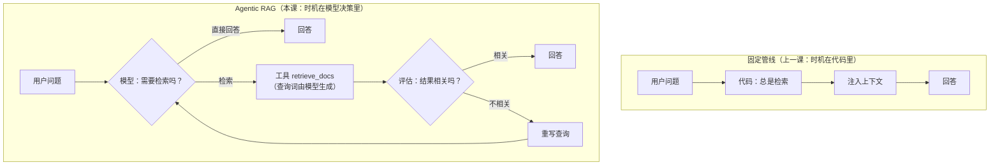

import { Canvas, Controls, Meta } from '@storybook/addon-docs/blocks';
import * as AgenticRag from './agentic-rag.stories';

<Meta of={AgenticRag} name="Docs" />

# Agentic RAG

[RAG](?path=/docs/rag--docs) 一课把「检索 → 注入上下文 → 回答」写成了固定管线：**每次都检索、检索词就是用户原话、检索几轮由代码写死**。本课把这条管线的控制权交给模型：把 retriever 包成工具挂给 Agent，**何时检索、用什么查询、要不要换个说法再检索、去哪个检索源**，都变成模型的决策——证据就在消息流里：检索发生当且仅当模型产出了一条带 `retrieve` 的 `tool_calls`。自由的代价是循环可能不收敛，所以本课一半篇幅在讲怎么把自由框住：评估（grade）、重写（rewrite）与次数上限。读完你应该能预测：把一个闲聊问题和一个知识问题分别丢给这套 Agent，消息流会有什么不同；grade 判 `no` 之后图会走到哪里；以及不设上限时循环会在哪里停下。



本课关键输入与默认值（已在官方文档、教程与本地安装源码中核对）：

| 关键输入 | 默认 / 取值 | 回查要点 |
| --- | --- | --- |
| `createRetrieverTool(retriever, { name, description })` | schema 固定为 `{ query: string }` | 来自 `@langchain/classic/tools/retriever`；返回各文档 `pageContent` 以 `\n\n` 拼接的字符串，无来源标记 |
| `vectorStore.asRetriever()` | `k = 4`，`searchType: 'similarity'` | 传数字即 k，传对象可设 `filter` / `mmr`；写入与相似度检索归[嵌入与向量库](?path=/docs/embeddings-vector-stores--docs) |
| grade 的 `binaryScore` | `'yes'` / `'no'` 字符串 | 用 `withStructuredOutput` 打二元分，用法归[结构化输出](?path=/docs/structured-output--docs) |
| `recursionLimit`（invoke 配置） | `25` | 图循环超步上限，超出抛 `GraphRecursionError`；这是兜底，不是业务护栏 |
| `toolCallLimitMiddleware` | 必须至少设 `threadLimit` / `runLimit` 之一，否则构造抛错；`exitBehavior` 默认 `'continue'` | 超限回传 `` Tool call limit exceeded. Do not … `` 的 ToolMessage，让模型收敛 |
| `ToolNode(tools)` | — | 图里执行工具并回传 `ToolMessage` 的现成节点，`@langchain/langgraph/prebuilt` |

## 快速上手

最小闭环：小语料建库 → 手动用 `tool()` 包 retriever → 挂进 `createAgent` → 用两个问题对照「是否检索」。工程沿用[安装](?path=/docs/installation--docs)一课，额外依赖 `@langchain/classic`（为了 `MemoryVectorStore`）：

```bash
npm i langchain @langchain/openai @langchain/classic dotenv
```

```ts
// agentic-rag-quickstart.ts —— 检索时机交给模型：createAgent + retriever 工具。
// 运行条件：OPENAI_API_KEY 已写入 .env；npx tsx agentic-rag-quickstart.ts。
import 'dotenv/config';
import * as z from 'zod';
import { ChatOpenAI, OpenAIEmbeddings } from '@langchain/openai';
import { MemoryVectorStore } from '@langchain/classic/vectorstores/memory';
import { createAgent, tool } from 'langchain';

// 1. 建库：几条「公司政策」语料（嵌入与建库细节归嵌入与向量库一课）
const vectorStore = await MemoryVectorStore.fromTexts(
  [
    '退货政策：签收后 7 天内可无理由退货，商品需保持完好。',
    '发货时效：现货订单 48 小时内发出，偏远地区顺延 2 天。',
    '会员等级：累计消费满 1000 元升级金卡，享 95 折。',
    '客服时间：工作日 9:00–18:00，周末仅处理紧急工单。',
  ],
  {},
  new OpenAIEmbeddings({ model: 'text-embedding-3-small' }),
);
const retriever = vectorStore.asRetriever(3);

// 2. 包工具：给 retriever 补上模型决策需要的三样——name、description、schema
const retrieveDocs = tool(
  async ({ query }) => {
    const docs = await retriever.invoke(query);
    if (docs.length === 0) return '没有命中任何文档。请换一个更具体的查询，或直接回答不知道。';
    return docs.map((doc) => doc.pageContent).join('\n\n');
  },
  {
    name: 'retrieve_docs',
    description:
      'Search the company policy knowledge base. ' +
      'Use this when the user asks about policies like returns, shipping, ' +
      'membership, or support hours. Do not use this for greetings or chit-chat.',
    schema: z.object({
      query: z.string().describe('Search query to look up in the knowledge base.'),
    }),
  },
);

// 3. 挂进 createAgent：这里没有任何「何时检索」的分支——决策权在模型
const agent = createAgent({
  model: new ChatOpenAI({ model: 'gpt-5.5' }),
  tools: [retrieveDocs],
});

// 4. 对照运行：同样的一轮 invoke，消息流里有没有 ToolMessage 就是检索时机的证据
for (const question of ['你好，你能做什么？', '买完东西多久能收到？']) {
  const result = await agent.invoke({
    messages: [{ role: 'user', content: question }],
  });
  const retrievals = result.messages.filter((m) => m.getType() === 'tool');
  console.log(`「${question}」→ 检索 ${retrievals.length} 次`);
}
// 「你好，你能做什么？」→ 检索 0 次
// 「买完东西多久能收到？」→ 检索 1 次（措辞与次数因模型而异）
```

同一个 Agent、同一份代码，检索次数随问题不同而不同——这就是「检索时机交给模型」。想看模型用了什么检索词，打印检索前那条 `AIMessage` 的 `tool_calls[0].args`：它通常不是用户原话，而是模型自己改写过的查询。

## 何时让模型决策检索

分界只有一个判断点：**「这次要不要检索、用什么词检索」能不能在写代码时确定**。能确定就留在固定管线里；取决于问题内容本身，才需要交给模型。

| 信号 | 选择 | 原因 |
| --- | --- | --- |
| 每个请求都需要同一份上下文（如「我的订单状态」总查订单库） | 固定管线 | 检索时机恒定，让模型再决策一次是白花一次调用 |
| 问题混合闲聊与知识，是否要查库因问题而异 | Agentic | 代码穷举不出所有分支 |
| 用户原话就是好的检索词（关键词明确、无指代） | 固定管线 | 直接把原话送进 retriever 即可 |
| 检索词需要改写（口语化、有指代、中英混杂、多跳问题的中间查询） | Agentic | 模型生成的 `args.query` 天然是改写后的查询 |
| 一次检索必然够用 | 固定管线 | 循环结构没有收益 |
| 可能要「检索 → 发现不够 → 再检索」多轮组合 | Agentic | 循环收敛由模型判断 |
| 只有一个检索源，且不会选错 | 固定管线 | 无路由决策 |
| 多个检索源（FAQ / SQL / 向量），用哪个因问题而异 | Agentic | 多工具按 description 分发 |
| 强确定性、强成本约束、要写固定用例的测试 | 固定管线 | 模型决策不可复现，测试与预算都难做 |

两条工程后果值得先记住：

- **消息流是唯一证据。** 判断一次运行里检索是否发生、发生了几次，看的不是日志里你打了什么，而是 `result.messages` 里有没有 `ToolMessage`、`AIMessage.tool_calls` 里填了什么查询（消息协议归[工具](?path=/docs/tools--docs)一课）。
- **Agentic 的开销是结构性的。** 每轮「决策要不要检索」本身是一次模型调用，评估与重写再加两次——同一个问题，Agentic RAG 的模型调用次数通常是固定管线的 2–4 倍。先固定、后 Agentic，是默认顺序。

## 把 retriever 包成工具

retriever 是 `@langchain/core` 的标准检索接口：`invoke(query: string)` 返回 `Promise<Document[]>`。它不能直接挂进 `tools` 数组——模型决策依赖的 `name`、`description`、`schema` 三样它都没有。包成工具，就是补上这三样。两条路线：官方教程用的 `createRetrieverTool`，或像快速上手那样手动 `tool()` 包装。

### createRetrieverTool

官方 Agentic RAG 教程的用法，一行完成包装：

```ts
import { createRetrieverTool } from '@langchain/classic/tools/retriever';

const retrieverTool = createRetrieverTool(retriever, {
  name: 'retrieve_blog_posts',
  description:
    'Search and return information about Lilian Weng blog posts on reward hacking, ' +
    'hallucination, and diffusion.',
});
```

内置行为都是定死的（已在 `@langchain/classic` 源码中核对）：

- **schema 固定为 `{ query: string }`**，参数描述为 `query to look up in retriever`——不能加参数（比如想传 `top_k`、`filter`，做不到）。
- **返回值固定**：各文档的 `pageContent` 用 `\n\n` 拼接成一个大字符串。没有来源标记、没有 metadata、命中为空时是空字符串。
- 第二个参数除了 `name`、`description`，只接受 `DynamicStructuredTool` 的通用字段（如 `returnDirect`）。

适合「教程式」场景：单一向量库、检索结果直接可用。它的短板都在「返回什么」上——这正好是手动包装的用武之地。

### 手动 tool() 包装

自己写执行函数，就能控制模型看到什么：

```ts
import * as z from 'zod';
import { tool } from 'langchain';

const retrieveDocs = tool(
  async ({ query, scope }) => {
    let docs = await retriever.invoke(query);
    if (scope) {
      // retriever.invoke 只接受字符串；过滤在拿到结果后自己做
      docs = docs.filter((doc) => doc.metadata.section === scope);
    }
    if (docs.length === 0) {
      // 空结果给模型一句可行动的话，而不是空字符串
      return `没有命中任何文档。请换一个更具体的查询，或直接回答不知道。`;
    }
    // 带来源标记的拼接：模型引用时能对得上是哪一段
    return docs
      .map((doc, i) => `[${i + 1}] (${doc.metadata.source ?? 'unknown'})\n${doc.pageContent}`)
      .join('\n\n');
  },
  {
    name: 'retrieve_docs',
    description: 'Search the company knowledge base. Use for policy and product questions.',
    schema: z.object({
      query: z.string().describe('Search query to look up in the knowledge base.'),
      scope: z.string().optional().describe('Optional scope filter, e.g. "policy", "product".'),
    }),
  },
);
```

手动包装换来三个控制点：**返回内容**（截断、加来源标记、空结果提示）、**入参形状**（多加 `scope` 这类检索参数）、**依赖面**（不用装 `@langchain/classic`）。注意 retriever 的 `invoke` 只接受查询字符串（`filter`、`k` 在 `asRetriever()` 构造时给定，见[嵌入与向量库](?path=/docs/embeddings-vector-stores--docs)）；工具参数想影响检索结果，要么多建几个 retriever，要么像上面这样拿到结果后自己过滤。检索结果里有大段只给程序用的数据时，还可以按[工具](?path=/docs/tools--docs)一课的 `responseFormat: 'content_and_artifact'` 把摘要给模型、原文留给程序。

| | `createRetrieverTool` | 手动 `tool()` |
| --- | --- | --- |
| 代码量 | 一行 | 十行左右 |
| schema | 固定 `{ query }` | 自定义（可加 `scope` 等参数） |
| 返回内容 | `pageContent` 以 `\n\n` 拼接 | 完全可控（截断、来源、空结果文案） |
| 依赖 | 需要 `@langchain/classic` | 只要 `langchain` |
| 适合 | 对齐官方教程快速起步 | 生产里几乎总是走到这条路上 |

工具定义的通用写法——description 怎么写「何时用」、错误怎么回传——归[工具](?path=/docs/tools--docs)一课；这里只多强调一条：**检索工具的 description 是「何时检索」的开关**。写成 `Search documents.`，模型对模糊问题就倾向检索或不检索各凭心情；写清领域与边界（`Do not use this for greetings`），闲聊不检索的行为才稳定。

## 检索循环：评估与重写

快速上手的 Agent 有个盲区：**它默认检索结果就是相关的**。命中一堆弱相关文档时，固定管线直接硬答，快速上手的 Agent 也一样硬答——区别只是它先自己决定查了一次。官方 Agentic RAG 教程用 LangGraph 图补上质量环，四个节点加一个条件边函数连成一个循环：

- **`generateQueryOrRespond`**：绑定了检索工具的模型。要么产出 `tool_calls`（决定检索，查询词自己写），要么直接回答（`shouldRetrieve` 条件边送它去 `END`）。
- **`retrieve`**：`new ToolNode(tools)`，执行检索工具并回传 `ToolMessage`。
- **`gradeDocuments`**：挂在 `retrieve` 之后的**条件边**（不是节点）。用 `withStructuredOutput` 让另一个模型实例对「检索结果与问题是否相关」打二元分：`'yes'` 路由去 `generate`，`'no'` 路由去 `rewrite`。
- **`rewrite`**：让模型重看原问题、推理语义意图，产出一个改进的问题，回到 `generateQueryOrRespond`——**由模型带着新问题再次决定检索**，不是绕过决策直接调 retriever。
- **`generate`**：经典 RAG 收尾：用检索到的上下文回答，prompt 里写明「不知道就说不知道」。

```ts
// agentic-rag-graph.ts —— 官方教程形态：检索 → 评估 → 重写循环（节选自完整实现）。
// 运行条件：OPENAI_API_KEY；依赖 @langchain/langgraph @langchain/openai @langchain/classic zod。
import 'dotenv/config';
import * as z from 'zod';
import { ChatOpenAI } from '@langchain/openai';
import { END, START, StateGraph, MessagesAnnotation } from '@langchain/langgraph';
import { ToolNode } from '@langchain/langgraph/prebuilt';
import { AIMessage } from '@langchain/core/messages';
import { ChatPromptTemplate } from '@langchain/core/prompts';
import { createRetrieverTool } from '@langchain/classic/tools/retriever';

// 建库部分同快速上手；retrieverTool 用 createRetrieverTool 或手动包装均可
const retrieverTool = createRetrieverTool(retriever, {
  name: 'retrieve_docs',
  description: 'Search the company policy knowledge base.',
});
const tools = [retrieverTool];

// 决策节点：模型要么回答，要么产出 tool_calls
const model = new ChatOpenAI({ model: 'gpt-5.5', temperature: 0 }).bindTools(tools);
const generateQueryOrRespond = async (state: typeof MessagesAnnotation.State) => {
  return { messages: [await model.invoke(state.messages)] };
};

// 条件边：最后一条消息带 tool_calls 就去检索，否则结束
const shouldRetrieve = (state: typeof MessagesAnnotation.State) => {
  const lastMessage = state.messages.at(-1);
  if (AIMessage.isInstance(lastMessage) && lastMessage.tool_calls?.length) return 'retrieve';
  return END;
};

// 评估：另一个模型实例打二元分（结构化输出归结构化输出一课）
const gradeModel = new ChatOpenAI({ model: 'gpt-5.5', temperature: 0 }).withStructuredOutput(
  z.object({
    binaryScore: z.string().describe("Relevance score 'yes' or 'no'"),
  }),
);
const gradePrompt = ChatPromptTemplate.fromMessages([
  ['system', 'You are a grader assessing relevance of a retrieved document to a user question. \n Answer yes or no.'],
  ['human', 'Retrieved document: \n\n {context} \n\n User question: {question}'],
]);
const gradeDocuments = async (state: typeof MessagesAnnotation.State) => {
  const question = state.messages.at(0)?.content;   // 最初的用户问题
  const context = state.messages.at(-1)?.content;   // 刚回传的 ToolMessage
  const grade = await gradePrompt.pipe(gradeModel).invoke({ question, context });
  return grade.binaryScore === 'yes' ? 'generate' : 'rewrite';
};

// 重写：推理语义意图，产出改进的问题
const rewritePrompt = ChatPromptTemplate.fromMessages([
  ['system', 'Look at the input and try to reason about the underlying semantic intent / meaning.'],
  ['human', ' \n ------- \n {question} \n ------- \n Formulate an improved question:'],
]);
const answerModel = new ChatOpenAI({ model: 'gpt-5.5', temperature: 0 });
const rewrite = async (state: typeof MessagesAnnotation.State) => {
  const question = state.messages.at(0)?.content;
  const response = await rewritePrompt.pipe(answerModel).invoke({ question });
  return { messages: [response] };              // 新问题追加进消息，回到决策节点
};

// 收尾：用检索上下文回答
const generatePrompt = ChatPromptTemplate.fromMessages([
  ['system',
    'You are an assistant for question-answering tasks. ' +
    'Use the following pieces of retrieved context to answer the question. ' +
    'If you do not know the answer, just say that you do not know. ' +
    'Use three sentences maximum and keep the answer concise.'],
  ['human', 'Question: {question} \nContext: {context}'],
]);
const generate = async (state: typeof MessagesAnnotation.State) => {
  const question = state.messages.at(0)?.content;   // 教程实现：回答仍以原问题为准
  const context = state.messages.at(-1)?.content;
  return { messages: [await generatePrompt.pipe(answerModel).invoke({ question, context })] };
};

const graph = new StateGraph(MessagesAnnotation)
  .addNode('generateQueryOrRespond', generateQueryOrRespond)
  .addNode('retrieve', new ToolNode(tools))
  .addNode('rewrite', rewrite)
  .addNode('generate', generate)
  .addConditionalEdges('generateQueryOrRespond', shouldRetrieve)
  .addConditionalEdges('retrieve', gradeDocuments)
  .addEdge(START, 'generateQueryOrRespond')
  .addEdge('rewrite', 'generateQueryOrRespond')
  .addEdge('generate', END)
  .compile();

// 运行并观察每步状态：streamMode 'values' 逐轮吐出整个 messages
const stream = await graph.stream(
  { messages: [{ role: 'user', content: '买完东西多久能收到？' }] },
  { streamMode: 'values' },
);
for (const step of stream) {
  console.log(step.messages.at(-1));  // 每轮只看最新一条：决策 → 检索 → 评估路由 → 回答
}
```

四个容易读错的细节：

- **`gradeDocuments` 是条件边函数**，返回值直接是下游节点名（`'generate'` / `'rewrite'`），`addConditionalEdges('retrieve', gradeDocuments)` 省略了映射表。StateGraph 的节点、边、条件路由语法归[Graph API](?path=/docs/graph-api--docs)一课。
- **重写只改变「下一轮检索用什么词」**。`rewrite` 的产出作为消息回到决策节点，模型用它生成新的 `args.query`；而 `generate` 与 `gradeDocuments` 取的都是 `messages.at(0)`——回答与评分始终针对**用户原问题**。
- **`rewrite` 循环没有业务层数限制**。grade 反复判 `'no'` 时，`rewrite → generateQueryOrRespond → retrieve → grade` 会一直转下去，真正拦住它的是 `recursionLimit`（见[失败模式与护栏](#失败模式与护栏)）。
- **检索词是模型生成的**。第一个 `tool_calls` 的 `args.query` 与用户原话的差距，就是这套架构「免费」获得的查询改写；`rewrite` 节点是显式的第二级改写。

提供方差异不大：`@langchain/google-genai` 的模型同样实现 `bindTools` 与 `withStructuredOutput`，上述图代码原样可用；只有 `tool_call_id` 由提供方生成——手动构造 `ToolMessage` 时永远复用模型返回的原 `id`。

下面的实例把整条循环的轨迹确定性画出来（预置语料与标注，不发起真实模型调用；消息形态对齐 `@langchain/core`，grade 判定与超限文案对齐教程与中间件源码）：

<Canvas of={AgenticRag.Interactive} />
<Controls of={AgenticRag.Interactive} />

| 读者操作 | 可观察证据 |
| --- | --- |
| 切换「轨迹场景」到「闲聊 · 不检索」 | 消息流里没有任何 `tool_calls` 与 `ToolMessage`，模型直接回答 |
| 切换到「一次命中」 | `args.query` 与用户原话不同（模型改写过），grade 判 `yes` 后路由到 generate |
| 切换到「首查不足 · 重写再检索」 | grade 判 `no` 路由到 rewrite，重写块产出新问题后**再次经过决策节点**才检索 |
| 切换到「多检索源路由」 | 同一轮里两个问题分别路由到 `query_orders`（SQL）与 `search_faq`，都没碰向量检索 |
| 切换到「不收敛 · 次数上限」 | 第 3 次调用被 `runLimit: 2` 拦截，ToolMessage 变成 `` Tool call limit exceeded. Do not call 'retrieve_docs' again. ``，模型被迫承认不知道 |
| 拖动「回放步骤」 | 循环逐块推进，能看到 grade 的两个判定块出现在两次检索之后 |

打开 Show code 可看到该 Canvas 实际执行的 `example.ts`：纯 TS 确定性模拟，不依赖 `@langchain/*`。

## 多检索源路由

知识不总在一个向量库里：高频问答在 FAQ 表，订单在 SQL 库，产品文档在向量库。Agentic RAG 的路由不需要新机制——**每个检索源各包成一个工具，模型按 `description` 选择**：

```ts
import * as z from 'zod';
import { ChatOpenAI } from '@langchain/openai';
import { createAgent, tool } from 'langchain';

// 三个检索源，三种形态：检索的逻辑是普通代码，对模型只是三个工具
const searchFaq = tool(
  ({ keyword }) => faqTable.lookup(keyword),        // 命中固定问答对，返回整条 FAQ
  {
    name: 'search_faq',
    description: 'Look up high-frequency Q&A pairs (returns, shipping, membership). ' +
      'Use for common policy questions. Fastest source — try this first for policy questions.',
    schema: z.object({ keyword: z.string().describe('Keyword to look up in the FAQ table.') }),
  },
);

const queryOrders = tool(
  ({ orderId }) => db.query('SELECT status, eta FROM orders WHERE id = $1', [orderId]),
  {
    name: 'query_orders',
    description: 'Query order status and ETA by exact order ID. ' +
      'Use when the user provides a concrete order number.',
    schema: z.object({ orderId: z.string().describe('The exact order ID.') }),
  },
);

const retrieveDocs = tool(/* 同「手动 tool() 包装」一节 */);

const agent = createAgent({
  model: new ChatOpenAI({ model: 'gpt-5.5' }),
  tools: [searchFaq, queryOrders, retrieveDocs],     // 路由决策发生在模型侧
});
```

三条判断：

- **路由的精度取决于 description 的分工**。`try this first for policy questions` 这类优先级提示是合法且有效的；三个工具都写 `Search the knowledge base`，路由就退化成掷骰子。description 的完整写法归[工具](?path=/docs/tools--docs)一课。
- **一条消息可以并行调用多个工具**。「订单什么时候到？退款政策是什么？」这类复合问题，模型可能在一条 `AIMessage` 里同时产出 `query_orders` 和 `search_faq` 两次 `tool_calls`，运行时逐个执行回传。上面的实例「多检索源路由」场景按先后两轮呈现了同样的两次路由；真实运行里这两次调用也可能挤在同一条 `AIMessage` 中。
- **这是单 Agent 多工具，不是多智能体**。一个模型按工具清单分发；当检索源复杂到需要各自的提示、记忆与子工具（比如「SQL Agent」自带写查询、看报错、改查询的循环），就该拆成多个 Agent 由 supervisor 或 handoff 编排，那是[多智能体概览与路由](?path=/docs/multi-agent-overview--docs)一课的领地。

把实例切到「多检索源路由」场景，可以看到模型为一个复合问题先后选了两个不同的检索源。

## 失败模式与护栏

Agentic RAG 的三类高频故障，各有一层对位护栏：

**过度检索：模型什么问题都查一遍。** 闲聊也检索、知识问题换个说法反复查。护栏在定义层：检索工具的 `description` 写清「何时不用」（`Do not use this for greetings`）；使用规则（「先判断是否需要检索」）写进 `systemPrompt`。观察手段：统计 `result.messages` 里 `ToolMessage` 的数量分布。

**循环不收敛：grade 反复判 `no`，或模型反复换词重试。** 两层兜底，作用层次不同：

```ts
// 层 1：图的超步上限（LangGraph 所有图自带）——超出抛 GraphRecursionError
await graph.invoke(input, { recursionLimit: 25 });  // 默认 25，可以显式收紧

// 层 2：工具调用次数上限（createAgent 路线的业务护栏）
import { createAgent, toolCallLimitMiddleware } from 'langchain';
const agent = createAgent({
  model: new ChatOpenAI({ model: 'gpt-5.5' }),
  tools: [retrieveDocs],
  middleware: [
    toolCallLimitMiddleware({
      toolName: 'retrieve_docs',       // 只限制检索工具，别的工具不受影响
      runLimit: 5,                     // 单次 invoke 最多放行 5 次调用
      exitBehavior: 'continue',        // 默认：超限的调用被拦截，回传提示让模型收敛
    }),
  ],
});
```

- `recursionLimit` 是**运行时保险丝**：循环超步直接抛 `GraphRecursionError`，整次调用失败，不产生优雅的最终回复。它防的是进程级失控，不是产品体验。
- `toolCallLimitMiddleware` 是**业务护栏**：必须至少设 `threadLimit` / `runLimit` 之一（否则构造时就抛错，且 `runLimit` 不能大于 `threadLimit`）。`'continue'`（默认）把超限调用替换成一条 `` Tool call limit exceeded. Do not call 'retrieve_docs' again. `` 的 `ToolMessage`（未指定 `toolName` 时是通用文案 `` Do not make additional tool calls. ``），模型读到后通常放弃重试、转向回答或承认不知道；`'error'` 改抛 `ToolCallLimitExceededError`；`'end'` 直接结束并返回说明超限的收尾消息。上面的实例「不收敛」场景演示的就是 `'continue'` 的轨迹。参数细节归[工具](?path=/docs/tools--docs)一课。

**空结果与弱结果硬答（幻觉的检索版）。** 检索命中为空时 `createRetrieverTool` 返回空字符串，模型看不到「没有结果」这个事实。护栏有三处：手动包装时空结果返回可行动的提示文本（见快速上手）；`generate` 的 prompt 写明「不知道就说不知道」（教程原话 `If you do not know the answer, just say that you do not know`）；要更严就把 grade 从二元相关分扩成「足够回答 / 需要补充检索 / 无法回答」三路。

**成本失控：每轮评估都是一次模型调用。** grade 加 rewrite 意味着一次问答最多 4 次模型调用（决策、打分、重写、收尾）。两个惯用收敛：grade 用同一个小参数模型；只对检索轮做评估（直接回答的轮次不过 grade）。

## 最佳实践

- **先固定，后 Agentic**：检索时机能在写代码时确定就不要交给模型。迁移的触发条件见「何时让模型决策检索」的表，而不是「Agentic 更先进」。
- **两条实现路线按控制需求选**：`createAgent` + 检索工具（快速上手形态）够用于「要不要检索、查哪个源」；需要显式的评估、重写与多轮质量环，才升级到 StateGraph（检索循环形态）。后者每条边都要自己维护。
- **查询重写交给模型，不要预处理**：`args.query` 由模型生成已经是内置的改写；再加一层自写的查询改写管线，通常是重复建设。需要更强的改写（多查询扩展、HyDE）再单独引入。
- **护栏按层次上**：description 与 systemPrompt 是事前引导（零成本），grade 是事中评估（每次检索多一次模型调用），次数上限是事后兜底（拦住失控）。三层各管一段，不要只用一层硬扛。
- **控制回给模型的检索体积**：`k` 与拼接格式直接决定每轮上下文消耗；结果大时按 `content_and_artifact` 只回摘要，原文留在 artifact 里给程序（写法见[工具](?path=/docs/tools--docs)一课）。

## 常见问题

- **闲聊问题也触发检索，成本和延迟都上去了。**
  检查检索工具的 `description` 是否写了「何时不用」（如 `Do not use this for greetings or chit-chat`）；再把「先判断是否需要检索」写进 `systemPrompt`。观察手段：过滤 `result.messages` 里的 `ToolMessage` 统计检索率，闲聊集的检索率应接近 0。
- **运行抛 `` GraphRecursionError: Recursion limit of 25 reached without hitting a stop condition. ``**
  循环没有收敛点在转圈。按顺序排查：grade 是否总是判 `'no'`（打印每轮 `binaryScore`）；rewrite 产出的问题是否真的与原问题不同；语料里到底有没有答案——没有答案的问题会永远判 `no`。短期可用 `graph.invoke(input, { recursionLimit: N })` 显式收紧或放宽，但根因通常在评估环或语料。
- **`createRetrieverTool` 返回的文本里模型引用错乱、对不上来源。**
  默认行为是把各文档 `pageContent` 用 `\n\n` 裸拼接，没有分隔标记与 metadata。换成手动 `tool()` 包装，自己控制拼接格式（编号、来源标注、截断）。
- **检索命中为空时模型开始编造答案。**
  空命中回传的是空字符串，模型感知不到「没查到」。手动包装时显式返回一句提示（`没有命中任何文档……`），并确认 `generate` 的 prompt 里有「不知道就说不知道」的约束。
- **想让检索次数超过限制时优雅收尾，而不是抛异常。**
  `createAgent` 路线用 `toolCallLimitMiddleware({ runLimit: 3, exitBehavior: 'continue' })`，超限调用会变成一条提示 ToolMessage，模型读到后自行收敛；StateGraph 路线没有现成中间件，在 `gradeDocuments` 里统计 `state.messages` 中 rewrite 产出的条数，超过阈值就不再返回 `'rewrite'`、直接返回 `'generate'`。
- **检索命中的结果都是弱相关的，模型硬答了一通。**
  这是没上评估环的症状。把快速上手的 `createAgent` 形态升级成「检索循环」形态（grade 判 `no` 就重写再检索），或在检索工具的返回里附上相似度分数让模型自行取舍。

## 总结回顾

摘要：

固定 RAG 管线把检索时机写死在代码里；Agentic RAG 把 retriever 包成工具（`createRetrieverTool` 一行、schema 固定 `{ query }`、返回 `pageContent` 裸拼接，或手动 `tool()` 换来对入参与返回的完全控制），检索时机、查询词、检索源都变成模型决策，证据在消息流的 `tool_calls` 与 `ToolMessage` 里。是否需要这种自由，取决于检索时机能否在写代码时确定。官方教程用 StateGraph 补上质量环：决策节点决定检索与否，`gradeDocuments` 条件边用结构化输出打二元分路由到 `generate` 或 `rewrite`，`rewrite` 产出改进问题回到决策节点形成「检索 → 评估 → 再检索」循环，且回答始终针对用户原问题。多个检索源各包成工具即得路由，与多智能体的边界在于是否拆成多个独立 Agent。自由的三类代价——过度检索、循环不收敛、空结果硬答——分别由 description 与 systemPrompt、`recursionLimit`（默认 25，抛 `GraphRecursionError`）与 `toolCallLimitMiddleware`（`exitBehavior: 'continue'` 回传超限提示让模型收敛）、空结果提示与「不知道就说不知道」约束兜住。

一句话：

> 把检索做成工具，检索时机就从代码分支变成模型的 `tool_calls`；这份自由的账单是不收敛的风险，评估、重写与次数上限是必须配齐的护栏。

知识要点：

- 固定管线与 Agentic RAG 的分界判断是什么？各自适合什么信号？
- 怎么从消息流证据判断一次运行里检索是否发生、用了什么查询词？
- `createRetrieverTool` 的 schema、返回值与局限分别是什么？手动 `tool()` 包装换来哪三个控制点？
- 官方教程的五个节点各做什么？`gradeDocuments` 为什么是条件边而不是节点？
- rewrite 之后控制流回到哪里？最终回答针对的是原问题还是重写后的问题？
- 多检索源路由靠什么机制实现？与多智能体架构的分界在哪？
- `recursionLimit` 与 `toolCallLimitMiddleware` 分别防什么？`exitBehavior` 三种取值各是什么行为？
- 空检索结果为什么会导致编造？在哪三个位置兜住？

## 参考资料

- [Agentic RAG（LangChain.js 官方教程，本课主依据）](https://docs.langchain.com/oss/javascript/langgraph/agentic-rag)
- [Retrievers（LangChain.js 集成文档）](https://docs.langchain.com/oss/javascript/integrations/retrievers/index)
- [langchainjs 仓库（createRetrieverTool 与 formatDocumentsAsString 实现、GraphRecursionError 与默认循环上限）](https://github.com/langchain-ai/langchainjs)
