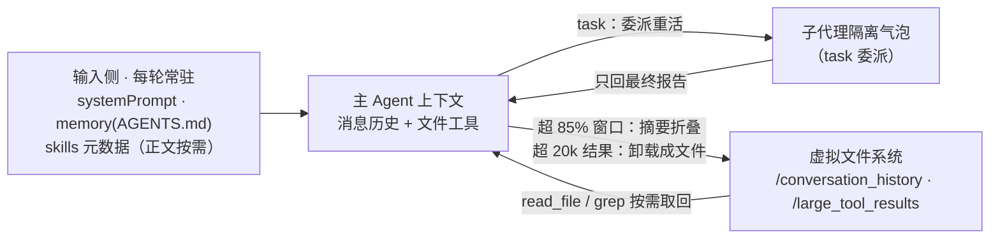

import { Canvas, Controls, Meta } from '@storybook/addon-docs/blocks';
import * as DeepAgentsCapabilities from './deep-agents-capabilities.stories';

<Meta of={DeepAgentsCapabilities} name="Docs" />

# 核心能力

本课讲 Deep Agents 与裸 `createAgent` 拉开差距的部分：`createDeepAgent` 的五类一等配置——`subagents`（重活进隔离气泡）、`skills`（知识命中才进上下文）、`memory`（约定常驻系统提示）、内置的上下文压缩（超限自动摘要与卸载）与 `middleware` 等定制面。`deepAgents()` harness 的安装与最小示例、虚拟文件系统与内置工具盘点归[「上手」](?path=/docs/deep-agents-quickstart--docs)；本课默认你能跑通一个 `createDeepAgent`，专注回答：每个配置改变上下文的哪一种进出方式、默认值是什么、怎么组合。读完你应该能预测：同一个深度任务，开/关某类配置后主上下文的 token 轨迹会变成什么形状。子代理与技能的通用机制（为什么隔离、SKILL.md 怎么写）分别在[「子代理」](?path=/docs/subagents--docs)与[「技能」](?path=/docs/skills--docs)讲过，本课只讲它们在 Deep Agents 里的声明式形态。



| 配置键 | 改变什么 | 默认值 / 关键注意 |
| --- | --- | --- |
| `model` | 模型，字符串 `'provider:model'` 或实例 | **不传时默认 `anthropic:claude-sonnet-4-6`**；OpenAI 主线必须显式传如 `'openai:gpt-4o'`（1.14 源码） |
| `subagents` | 声明式子代理数组 | `[]`；但会自动补一个 general-purpose 子代理（见对应小节） |
| `skills` | 技能目录路径数组 | 不配置则不加载；POSIX 路径、相对 backend 根 |
| `memory` | AGENTS.md 路径数组 | 不配置则无记忆；启动（每线程）加载进系统提示 |
| `middleware` | 追加中间件 | `[]`；追加在 PatchToolCallsMiddleware 之后，与内置件同名时覆盖之 |
| `tools` | 领域工具 | `[]`；与内置文件工具并存；与内置工具重名会抛错 |
| `systemPrompt` | 自定义指令 | 前置于内置基础提示 |
| `backend` | 虚拟文件系统后端 | `StateBackend`（线程内、跨线程不共享） |
| `checkpointer` | 状态持久化 | 不传则无；skills 的线程内缓存与 HITL 审批依赖它，无它时 skills / memory 每次运行重新加载 |
| `permissions` | 文件路径级访问控制 | `[]`（宽松）；按声明顺序先匹配先生效 |
| `contextSchema` | 每次运行的运行时上下文 | 不自动进入模型提示；自动传播到全部子代理 |
| `interruptOn` | 工具调用前人工审批 | 需 checkpointer；细节归[「人机协同」](?path=/docs/human-in-the-loop--docs) |

本课 API 以 deepagents 1.14.x、langchain 1.5.x 核对（含对 1.14.1 发布包类型与源码的直接核对）；fork 子代理需 `deepagents >= 1.13.3`。

## 子代理配置

[「子代理」](?path=/docs/subagents--docs)一课的模式在 LangChain agent 层是手工三步：`createAgent` 造子代理、`tool()` 包装、挂回主 Agent。Deep Agents 把它压成一份声明：`subagents` 数组里的每个对象描述一个子代理，内置 `task` 工具按 `subagent_type` 调度，运行时自动完成包装与上下文过滤。

```ts
// deepagents-subagents.ts —— 声明式子代理：isolated 研究员 + fork 续写员
// 运行条件：npm i deepagents langchain @langchain/openai zod dotenv；
// .env 配置 OPENAI_API_KEY；npx tsx deepagents-subagents.ts。
import 'dotenv/config';
import { z } from 'zod';
import { tool } from 'langchain';
import { createDeepAgent, type SubAgent } from 'deepagents';

// 领域工具：定义一次，按需挂给子代理
const internetSearch = tool(
  async ({ query }) => `（模拟搜索）关于「${query}」的 5 条来源…`,
  {
    name: 'internet_search',
    description: '搜索互联网并返回来源列表。需要联网调研时使用。',
    schema: z.object({ query: z.string().describe('搜索关键词') }),
  },
);

const readDiff = tool(
  async ({ pr }) => `（模拟 diff）PR ${pr} 的变更内容…`,
  {
    name: 'read_diff',
    description: '读取一个 PR 的 diff 内容。',
    schema: z.object({ pr: z.string().describe('PR 编号') }),
  },
);

// isolated（默认）：只见任务描述，独立上下文跑完整循环
const researchSubagent: SubAgent = {
  name: 'research-agent', // task 工具的 subagent_type 取值
  description:
    '调研开放性问题的子代理：联网搜索、交叉验证来源、返回带引用的结论。需要多步检索的重活用我。',
  systemPrompt:
    'You are a great researcher. 最终报告必须包含全部结论与来源，' +
    '控制在 500 词内，不要贴原始搜索结果。',
  tools: [internetSearch], // 省略则继承主 Agent 的 tools
  // model: 'openai:gpt-4o-mini', // 省略则继承主 Agent 模型
};

// fork：不换上下文，续写主 Agent 已开始的调查（deepagents >= 1.13.3）
const commentWriter: SubAgent = {
  name: 'comment-writer',
  description: 'Continues an in-progress PR review and drafts review comments',
  mode: 'fork',
  tools: [readDiff],
};

// createDeepAgent 是同步函数，直接返回编译好的图（上手课已核对）
const agent = createDeepAgent({
  model: 'openai:gpt-4o',
  subagents: [researchSubagent, commentWriter],
  systemPrompt: '你是代码评审协调者。检索类重活交给 research-agent。',
});

const result = await agent.invoke({
  messages: [
    { role: 'user', content: '调研 Deep Agents 的上下文压缩机制，总结要点。' },
  ],
});
console.log(result.messages.at(-1)?.content);
```

声明式子代理默认自带一套中间件栈（FilesystemMiddleware → SummarizationMiddleware → PatchToolCallsMiddleware，声明了 `skills` 再加 SkillsMiddleware）——文件工具和自动压缩在每个子代理里同样生效，你写在 `middleware` 字段里的中间件追加在这套默认栈之后。

### task 工具与两种模式

`subagents` 配置存在的直接效果是主 Agent 多出一支内置 `task` 工具。它的 schema 在 1.14.1 实测为两个字段（官方文档示例里的 `subagentType` 是旧写法）：

```text
// task 工具的输入 schema（1.14.1 源码核对；官方文档示例里的 subagentType 是旧写法）
{
  description: string,   // 任务描述，将作为子代理的唯一输入（isolated 模式）
  subagent_type: string, // 子代理名，可用清单自动写进工具描述
}
```

工具描述由运行时自动组装：每个子代理一行 `- name: description`，fork 子代理额外标注「inherits your full conversation and system prompt」；后跟固定的使用提示——独立任务可在一条消息里并行发起多个 `task` 调用、子代理默认无状态（把全部细节写进 `description`）、报告不直接给用户（主 Agent 要自己转述摘要）、说清是要创建内容、分析还是只调研。`mode` 决定子代理收到什么：

| | `isolated`（默认） | `fork` |
| --- | --- | --- |
| 进入子代理的上下文 | 仅一条 `HumanMessage(description)` | 父级完整对话历史 + 任务描述 |
| 系统提示 | 自己的 `systemPrompt`（不继承主 Agent） | 镜像父级的提示产出中间件（skills、memory、自定义 middleware），`systemPrompt` 变为追加 |
| 再委派 | 可以再调 `task` | 不可以，再次调用会收到拒绝（源码的 `FORK_RECURSION_REFUSAL`） |
| 技能 | 可声明自己的 `skills` | 不能声明，继承父级 skills |
| 适合 | 不依赖前文的专注重活 | 续写主 Agent 已开始的任务（如写评审意见） |

fork 的实现值得看一眼，因为它解释了上面的限制：运行时把父级消息历史的尾部 `task` 调用剥掉，替换为一段延续前导语——大意是「上面的消息是你正在继续的先前对话；你正是刚被调用的那个子代理，别再委派，直接完成任务」——再接上任务描述。所以 fork 复用的是同一个对话，不是新窗口；若 fork 子代理用了与父级不同的 `model`，等价的系统提示要重建，缓存前缀随之失效。

子代理跑完后默认只回传**最后一条 AI 消息**作为工具结果（空则回 `Task completed`）；声明了 `responseFormat` 时改为回传 JSON 序列化的结构化结果（`deepagents >= 1.8.4`，schema 用法同[「结构化输出」](?path=/docs/structured-output--docs)）。观察委派轨迹有两个入口：每个子代理运行都带 `lc_agent_name` 元数据，LangSmith 里按它过滤即可区分（细节归[「LangSmith 追踪」](?path=/docs/langsmith-observability--docs)）；类型化流式里 `run.subagents` 为每个命名子代理提供独立的事件流（`.name` 可收窄类型），上手课的「运行与观察」在此展开为按子代理过滤的消费方式。

### SubAgent 字段

速查核心是一张「继承规则表」——哪些字段继承主 Agent、哪些覆盖、哪些干脆不继承：

| 字段 | 必填 | 默认 / 继承规则 |
| --- | --- | --- |
| `name` | 是 | `task` 的 `subagent_type` 取值；同时成为流式与 LangSmith 的 `lc_agent_name` |
| `description` | 是 | 主 Agent 的选择依据；面向动作写「做什么、何时用」（写法要点归[「子代理」](?path=/docs/subagents--docs)） |
| `systemPrompt` | isolated 下应写 | 不继承主 Agent；省略回落为空提示；fork 下是**追加**不是替换 |
| `mode` | 否 | `"isolated"`（默认）或 `"fork"` |
| `tools` | 否 | **省略则继承主 Agent 的 tools；写了就是整体覆盖**（文件工具来自子代理默认栈，不受此字段影响） |
| `model` | 否 | 省略则继承主 Agent；字符串或模型实例；fork 换模型会破坏缓存前缀 |
| `middleware` | 否 | **不继承**；追加在子代理默认栈之后 |
| `skills` | 否 | **不继承**（只有 general-purpose 继承）；给该子代理挂独立的 SkillsMiddleware |
| `interruptOn` | 否 | 省略则继承主 Agent；需 checkpointer |
| `responseFormat` | 否 | 结构化输出；JSON 序列化后回传父级 |
| `permissions` | 否 | 省略则继承；**写了是整体替换父级权限，不是合并**（权限模型归[「生产化」](?path=/docs/deep-agents-production--docs)） |

两种形态之外还有第三种：`CompiledSubAgent`——把 `createAgent(...)`（或任何编译后的 LangGraph 图）以 `{ name, description, runnable, mode? }` 传入，绕过声明式编译。`runnable` 的 state 必须有 `messages` 键。声明式与预编译形态可以混在同一个 `subagents` 数组里。

### general-purpose 子代理

不配置 `subagents` 时主 Agent 也有一支 `task` 工具，因为 Deep Agents 默认自动添加一个名为 `general-purpose` 的子代理：继承主 Agent 的全部工具、同模型、**继承主 Agent 的 skills**（这是唯一默认继承 skills 的子代理），提示固定为一句「用标准工具完成用户目标」。它兜住了「没声明任何子代理也要能委派重活」的场景。三种改法：

- **替换**：传一个 `name: 'general-purpose'` 的自定义 SubAgent，或展开导出常量 `GENERAL_PURPOSE_SUBAGENT` 改字段；
- **微调**：harness profile 上配 `generalPurposeSubagent: { description?, systemPrompt? }` 只改描述或提示（见「自定义」）；
- **禁用**：`generalPurposeSubagent: { enabled: false }` 且不传任何同步子代理——此时 `task` 工具与 SubAgentMiddleware 整个不挂载。

另有一类**异步子代理**（`AsyncSubAgent`，以 `graphId` 字段识别，走 AsyncSubAgentMiddleware），对应[「子代理」](?path=/docs/subagents--docs)讲过的 start job / check status / get result 三工具后台模式；同步声明式与异步可混在同一个数组，运行时自动分离。

## 技能挂载

SKILL.md 的写法、frontmatter 约束与三级渐进披露机制归[「技能」](?path=/docs/skills--docs)；本课讲 Deep Agents 侧的挂载细节。`skills` 是路径数组，两条规则最容易踩：

- **路径是相对 backend 根的虚拟 POSIX 路径**（正斜杠），不是磁盘路径。两种条目形态可混用：父目录（`['/skills/']`，扫描每个含 `SKILL.md` 的子目录）和直接技能目录（`['/skills/my-skill/']`）。同名技能后列出的覆盖先列出的。
- **技能文件必须先进 backend，再创建 agent**。默认 StateBackend 下文件通过 `invoke` 的 `files` 输入种入，格式是 `content` 行数组加两个时间戳：

```ts
// deepagents-skills.ts —— StateBackend 种入两个技能并挂载
// 运行条件：同上；skills 的线程内缓存依赖 checkpointer。
import 'dotenv/config';
import { MemorySaver } from '@langchain/langgraph';
import { createDeepAgent } from 'deepagents';

// FileData 形态：content 按行拆成数组 + 两个时间戳
function fileData(text: string) {
  return {
    content: text.split('\n'),
    created_at: new Date().toISOString(),
    modified_at: new Date().toISOString(),
  };
}

const salesSkill = `---
name: sales-analytics
description: 编写 sales 库的 SQL 查询。用户问销售额、订单、客户分析时使用。
---
# Sales Analytics
- 收入只计 status = 'completed' 的订单
- 活跃客户 = 近 90 天有下单`;

const inventorySkill = `---
name: inventory-management
description: 编写 inventory 库的 SQL 查询。用户问库存、仓储、重订货时使用。
---
# Inventory
- 需要重订货 = 库存低于商品的 reorder_point`;

const agent = createDeepAgent({
  model: 'openai:gpt-4o',
  skills: ['/skills/'], // 父目录：每个含 SKILL.md 的子目录是一个技能
  checkpointer: new MemorySaver(),
});

const result = await agent.invoke(
  {
    messages: [{ role: 'user', content: '上月各地区完成了多少销售额？' }],
    files: {
      // 技能文件随本次运行种进 StateBackend，路径要落在 skills 扫描范围内
      '/skills/sales-analytics/SKILL.md': fileData(salesSkill),
      '/skills/inventory-management/SKILL.md': fileData(inventorySkill),
    },
  },
  { configurable: { thread_id: 'skills-demo' } },
);
```

换 FilesystemBackend 时改用 `await backend.uploadFiles([['/skills/langgraph-docs/SKILL.md', new TextEncoder().encode(skillContent)]])` 预先写入（或直接把文件放进 `rootDir`）；StoreBackend 同样用 `uploadFiles` 写入 store，常配 CompositeBackend 按 `/skills/` 路径——backend 选型与生产配法归[「生产化」](?path=/docs/deep-agents-production--docs)。

挂载后的行为与[「技能」](?path=/docs/skills--docs)的三级披露一致，实现上是内置 SkillsMiddleware：启动时扫描、解析 frontmatter，把每个技能的 `name` + `description` 注入系统提示（第一级）；技能被触发时模型用内置 `read_file` 读 `SKILL.md` 全文（第二级）；附属文件由模型按正文引用自行读取（第三级）。三个 harness 特有的行为：

- **每线程加载一次并存入 state**。配了 checkpointer 后，线程内改 SKILL.md 不会自动生效；要强制下轮重载，把 state 的 `skillsMetadata` 置为 `null`（必须 `null`，空数组表示「已加载且无技能」；`deepagents >= 1.14.0`）。没配 checkpointer 的本地运行每次都重新加载，看起来像「自动生效」。
- **子代理技能完全隔离**。自定义子代理不继承主 Agent 的 skills（要就自己写 `skills` 字段），general-purpose 继承；fork 子代理不能声明自己的，直接继承父级。
- **体量上限**：单个 `SKILL.md` 超过 10 MB 会在发现阶段被跳过；`name` 上限 64 字符、`description` 上限 1024 字符。技能目录建议设只读权限防误写：`permissions: [{ operations: ['write'], paths: ['/skills/**'], mode: 'deny' }]`。

## 记忆

skills 解决「知识按需进」，memory 解决另一个方向：**约定常驻**。`memory` 接一组 AGENTS.md 路径，MemoryMiddleware 在线程启动时从 backend 读出内容（每线程一次，快照存进 state），之后每次模型调用把内容拼进系统提示尾部。没有渐进披露，所以账算得直接：常驻内容按每次模型调用付费，文件必须保持精简——只放「每轮都相关的约定」（回复风格、项目口径、固定偏好），任务知识做成技能。

### 常驻注入与自我编辑

```ts
// deepagents-memory.ts —— AGENTS.md 常驻注入 + agent 自我编辑
// 运行条件：同上。
import 'dotenv/config';
import { MemorySaver } from '@langchain/langgraph';
import { createDeepAgent } from 'deepagents';

function fileData(text: string) {
  return {
    content: text.split('\n'),
    created_at: new Date().toISOString(),
    modified_at: new Date().toISOString(),
  };
}

const agentsMd = `# 项目约定
## 回复风格
- 中文回复，先给结论再给依据
- 金额一律带千分位
## 口径
- 收入只计 status = 'completed' 的订单`;

const agent = createDeepAgent({
  model: 'openai:gpt-4o',
  memory: ['/memories/AGENTS.md'], // 内容将常驻系统提示
  checkpointer: new MemorySaver(),
  systemPrompt:
    '遵循记忆文件中的约定。用户给出新的长期偏好时，用 edit_file 更新 /memories/AGENTS.md。',
});

// 本线程：注入的是启动快照；agent 用 edit_file 把新偏好写回文件
await agent.invoke(
  {
    messages: [
      { role: 'user', content: '以后所有报表都用 UTC 时区，请记住这一点。' },
    ],
    files: { '/memories/AGENTS.md': fileData(agentsMd) },
  },
  { configurable: { thread_id: 'memory-seed' } },
);
```

「自我编辑」是 Deep Agents 记忆的关键设计：记忆文件就在虚拟文件系统里，agent 用内置 `edit_file` 直接改它，不需要专门的记忆 API。但注入提示的是**线程启动时的快照**——本线程内改文件，改动持久化到 backend，系统提示仍显示旧内容；新线程才会读到新内容。这一点与 skills 的「每线程一次」同源，skills 至少还有 `skillsMetadata: null` 的重置入口，memory 没有公开的等价入口，换新线程是最直接的方式。多文件 `memory: ['/mem/AGENTS.md', '~/preferences.md']` 按顺序加载合并；`addCacheControl`（缓存断点标记）只对 Anthropic 模型自动开启。

### 跨线程与作用域

上面的例子跨不过线程：StateBackend 的文件存在线程自己的 state 里，新线程是空的。要「thread A 学到的偏好 thread B 直接可用」，得把记忆路径路由到跨线程的存储：

```ts
// deepagents-memory-across-threads.ts —— CompositeBackend 把 /memories/ 路由到 Store
// 运行条件：同上；生产把 InMemoryStore 换成持久化 Store（归「长期记忆与 Store」）。
import 'dotenv/config';
import { InMemoryStore, MemorySaver } from '@langchain/langgraph';
import {
  CompositeBackend,
  StateBackend,
  StoreBackend,
  createDeepAgent,
} from 'deepagents';

const backend = new CompositeBackend(new StateBackend(), {
  // /memories/ 前缀的读写落到 Store，其余仍走线程内 state
  '/memories/': new StoreBackend({ namespace: () => ['team-wiki'] }),
});

const agent = createDeepAgent({
  model: 'openai:gpt-4o',
  store: new InMemoryStore(),
  backend,
  memory: ['/memories/AGENTS.md'],
  checkpointer: new MemorySaver(),
  systemPrompt: '用户给出长期偏好时，用 edit_file 更新 /memories/AGENTS.md。',
});

// thread A 写下的偏好落进 Store，跨线程可见
await agent.invoke(
  { messages: [{ role: 'user', content: '记住：报表一律用 UTC 时区。' }] },
  { configurable: { thread_id: 'a' } },
);

// thread B：新线程，系统提示自动带上 A 写下的记忆
const result = await agent.invoke(
  { messages: [{ role: 'user', content: '给我昨天的收入报表。' }] },
  { configurable: { thread_id: 'b' } },
);
```

`namespace` 工厂决定记忆的作用域，这是多租户部署的第一道隔离：

| 作用域 | namespace 写法 | 效果 |
| --- | --- | --- |
| agent 级 | `(rt) => [rt.serverInfo.assistantId]` | 所有用户共享同一份记忆 |
| 用户级 | `(rt) => [rt.serverInfo.user.identity]` | 每用户一份，互不可见（默认推荐） |
| 组织级 | `(rt) => [rt.context.orgId]` | 团队共享，通常配只读权限 |
| 多代理部署 | `(rt) => [rt.serverInfo.assistantId, rt.serverInfo.user.identity]` | 每个代理 × 每个用户一份 |

`rt.serverInfo` 需 `deepagents >= 1.9.0`。并发写同一记忆文件是 last-write-wins：用户级少见，agent / 组织级建议用后台任务串行整合，或按主题拆成多个文件。LangGraph Store 本身的机制归[「长期记忆与 Store」](?path=/docs/long-term-memory--docs)。

## 上下文工程

前面三类配置（子代理、技能、记忆）各有代码入口，这一节讲两个**不需要配置就存在**的机制（自动摘要与大结果卸载）加一个**需要显式开启**的（规划 todos）。它们共同回答：主上下文超限了怎么办。先把三档配置放回同一张图——下面实例用确定性模拟画出同一任务在「裸 createAgent / Deep Agents 默认栈 / 默认栈 + 组合配置」下的主上下文 token 轨迹：

<Canvas of={DeepAgentsCapabilities.Interactive} />
<Controls of={DeepAgentsCapabilities.Interactive} />

| 读者操作 | 可观察证据 |
| --- | --- |
| 保持「长程研究」 | 灰线（裸 Agent）线性爬到 162k 并在第 10 轮标红爆窗；蓝线（默认栈）爬到 121.5k 越过 85% 虚线后折叠为 14.8k，呈锯齿形；绿线（组合配置）每轮委派，12 轮只长到 18k，三档峰值 162k / 121.5k / 18k |
| 切换到「单次大结果」 | 灰线在 30k 上平抬到 35k；蓝线在工具返回处触发 ⤓ 卸载（30k 超过 20k 阈值），曲线落回 0.8k 后缓慢爬升；绿线 task 委派后同样平缓——卸载与委派殊途同归，峰值同为 5k 级 |
| 切换到「领域问答 + 偏好记忆」 | 蓝线与灰线完全重合（默认栈不改变输入上下文）；绿线常驻只有 0.6k（技能清单 + AGENTS.md），命中技能当轮 +1.0k，第二个 thread 自动带上记忆里的偏好 |
| 打开 Show code | 看到该 Canvas 实际执行的 `example.ts`：纯 TS 确定性模拟，不依赖 `@langchain/*` |

这张图是本课核心判断的可观察形态：**运行时上下文（历史、工具结果）靠压缩与隔离兜底，输入上下文（提示常驻）只能靠 skills/memory 配置**——蓝线管得住前两类，管不住第三类。

### 自动摘要

每个 `createDeepAgent` 自动带上增强版 SummarizationMiddleware，无需配置：

- **触发**：模型 profile 可得 `maxInputTokens` 时，上下文达到窗口的 **85%** 触发，摘要后**保留最近 10%** token 作为近期上下文；拿不到 profile 时回退为固定值——**170,000 token 触发、保留 6 条消息**（1.14 源码常量）。
- **双通道折叠**：摘要不是只丢一段 LLM 总结进历史——LLM 生成结构化摘要（会话意图、已产出物、后续步骤）替换旧历史，同时**原始消息全文写入 backend 的 `/conversation_history/{thread_id}.md`**（追加式），模型随时能 read_file / grep 取回，信息可检索但不再占窗口。
- **兜底**：任何一次模型调用抛 `ContextOverflowError`（上下文溢出）时，立即转为「摘要 + 近期消息」再重试这次调用。
- **流式副作用**：摘要那一步的生成 token 会混进消息流，消费时按元数据过滤：

```ts
// 过滤摘要步骤产生的流式 token（其余流式模式归「流式输出」）
for await (const [message, metadata] of await agent.stream(
  { messages: [{ role: 'user', content: '继续昨天的长调研' }] },
  { streamMode: 'messages' },
)) {
  if (metadata?.lcSource === 'summarization') {
    continue; // 跳过摘要中间件自己生成的 token
  }
  process.stdout.write(message.content ?? '');
}
```

### 大结果卸载

摘要管历史总量，卸载管**单次工具调用的肥大输入输出**，同样默认生效：

- **输出侧**：单次工具结果超过 **20,000 token**（FilesystemMiddleware 的 `toolTokenLimitBeforeEvict` 默认值）时，全文卸载到 `/large_tool_results/<tool_call_id>.txt`，工具消息替换为文件路径 + 内容样例。用户消息超过 50,000 token 同理。
- **输入侧**：会话达到窗口 85% 时，较旧的写文件 / 编辑类工具调用的**参数**（含完整文件内容）被截断，替换为指向磁盘文件的引用。
- **取回**：内置 `grep` 的工具描述明确指引「不知道路径时 grep `/large_tool_results/`」；要精确读回用 `read_file` 配 `offset` / `limit` 分页。
- **边界**：内置压缩不处理图像降分辨率或视觉嵌入这类多模态瘦身；要调整 20k / 50k 阈值，用 `createFilesystemMiddleware({ toolTokenLimitBeforeEvict: ... })` 放进 `middleware`——与内置件同名会覆盖默认实例（见下一节）。

### 规划 todos

前两个机制是自动的，规划工具是反的：`write_todos` **默认不开启**。启用写法上手课已经给过——`middleware: [todoListMiddleware()]`（从 `langchain` 包导入，它不属于 deepagents 的默认栈；`createDeepAgent` 的 `stateSchema` 文档里那句「可选的 todo 中间件会增加 `todos`」说的就是它）。挂上后 agent 得到一支 `write_todos` 工具，state 多出 `todos` 键（`{ content, status: 'pending' | 'in_progress' | 'completed' }[]`，随 checkpointer 持久化，`result.todos` 直接读）。两个使用约束内置在提示里：每次调用**整表替换**清单且一轮最多调一次（并行调用会产生优先级歧义）；简单目标直接做别建清单——写清单本身要花 token。fork 子代理继承 `todos` state（fork 的状态排除表不含它），续写任务时清单随之带过去。

## 自定义

前四类配置解决上下文的进出，最后一类改变 harness 本身：中间件栈的组装、模型可见的工具面、随请求传播的运行时上下文。先给完整中间件栈，它是理解一切定制位置的地图。

### 中间件栈

不传任何可选参数时，`createDeepAgent` 组装的完整栈（1.14 源码核对）：

1. SkillsMiddleware（仅配置 `skills`）
2. FilesystemMiddleware（文件工具 + permissions 强制 + 大结果卸载）
3. SubAgentMiddleware（`task` 工具；至少一个同步子代理时）
4. SummarizationMiddleware（自动摘要 + 历史落盘）
5. PatchToolCallsMiddleware（修复悬挂 tool call，对 Gemini 类严格校验的提供方尤其关键）
6. AsyncSubAgentMiddleware（仅配置异步子代理时）
7. **你的 `middleware` 参数在这里追加**（与内置件同名时覆盖该内置件）
8. harness profile 的 extraMiddleware
9. prompt caching（仅 Anthropic / Bedrock 模型，OpenAI 主线无此层）
10. MemoryMiddleware（仅配置 `memory`，放靠后以减少缓存前缀失效）
11. HumanInTheLoopMiddleware（仅配置 `interruptOn`）

「同名覆盖」是调内置行为的正规入口：想改卸载阈值或权限默认值，就自己 `createFilesystemMiddleware({ ... })` 放进 `middleware`。自定义中间件的写法与 agent 层完全一致（归[「中间件」](?path=/docs/middleware--docs)），最常见的是工具调用日志：

```ts
// wrapToolCall 包住每次工具执行：进入前后各打一条日志
import { createMiddleware, todoListMiddleware } from 'langchain';

const logToolCalls = createMiddleware({
  name: 'LogToolCallsMiddleware',
  wrapToolCall: async (request, handler) => {
    console.log('[tool]', request.toolCall.name, request.toolCall.args);
    const result = await handler(request);
    console.log('[tool]', request.toolCall.name, 'done');
    return result;
  },
});

const agent = createDeepAgent({
  model: 'openai:gpt-4o',
  middleware: [todoListMiddleware(), logToolCalls],
});
```

一个官方点名的坑：**不要在中间件里修改初始化后的共享可变状态**。子代理、并行工具调用、多线程会并发穿过同一段代码，`callCount += 1` 这种模块级计数会产生竞态；要跨钩子累计值就写进 graph state（`stateSchema` 定义键，`beforeAgent` 返回增量更新），state 按 thread 隔离，并发下安全。

### 工具面与 harness profile

`tools` 传领域工具，与内置文件工具并存；两个直接约束：自定义工具**与内置工具重名会在构造时抛 `ConfigurationError`**（错误码 `TOOL_NAME_COLLISION`；保留名全集是 8 支文件工具 `ls` / `read_file` / `write_file` / `edit_file` / `delete` / `glob` / `grep` / `execute`、`task`，以及声明异步子代理后的 `start_async_task` 等 5 支——与上手课的盘点一致）；工具描述写清「何时用」、每个参数 `.describe()`（写法归[「工具」](?path=/docs/tools--docs)）。

批量裁剪模型可见工具走 harness profile——profile 按 `provider` 或 `provider:model` 字符串匹配模型：

```ts
// 只读代理：对全部 openai 模型隐藏写与执行类内置工具
import { registerHarnessProfile } from 'deepagents';

registerHarnessProfile('openai', {
  excludedTools: ['write_file', 'edit_file', 'execute'],
  systemPromptSuffix: 'Think step by step before answering.',
});

const readOnlyAgent = createDeepAgent({ model: 'openai:gpt-4o' });
```

profile 的全部可调项：`excludedTools`（从模型可见面移除并在调用边界拒绝——是模型面校准**不是安全边界**，权限控制归 `permissions`）、`toolDescriptionOverrides`（按工具名改写描述）、`baseSystemPrompt` / `systemPromptSuffix`（整体替换 / 追加基础提示）、`generalPurposeSubagent`（GP 子代理的开关与文案，见前）、`excludedMiddleware`（按名移除中间件，但 `FilesystemMiddleware` 与 `SubAgentMiddleware` 是必需骨架，排除会直接抛错）。`createHarnessProfile(...)` 可以不注册直接构造 profile 对象给更底层的组装函数用。

### 运行时上下文

`contextSchema` 用 zod 声明每次运行携带的静态配置（用户 ID、API key、feature flags），`invoke` 第二参传入。它**不自动进入模型提示**——只有工具或中间件读取并注入时模型才可见；并且**自动传播到全部子代理**，这是「每个子代理的工具都知道当前用户是谁」的正规通道：

```ts
// 运行时上下文：工具从 runtime.context 读，不用拼进提示
import { z } from 'zod';
import { tool, type ToolRuntime } from 'langchain';

const contextSchema = z.object({
  userId: z.string(),
  apiKey: z.string(),
});

const fetchUserData = tool(
  async (input, runtime: ToolRuntime<unknown, typeof contextSchema>) => {
    const userId = runtime.context?.userId;
    return `用户 ${userId} 的数据：${input.query}`;
  },
  {
    name: 'fetch_user_data',
    description: '查询当前用户的账户数据',
    schema: z.object({ query: z.string().describe('查询内容') }),
  },
);

const agent = createDeepAgent({
  model: 'openai:gpt-4o',
  tools: [fetchUserData],
  contextSchema,
});

await agent.invoke(
  { messages: [{ role: 'user', content: '查我最近的活动' }] },
  { context: { userId: 'user-123', apiKey: process.env.INTERNAL_API_KEY! } },
);
```

与 `stateSchema` 的分界一句话：`contextSchema` 每次运行传入、不持久化；`stateSchema` 定义随 checkpointer 持久化的自定义 state 键（`todos` 就是这么挂进来的）。主 Agent 的结构化输出用 `responseFormat`，语义与[「结构化输出」](?path=/docs/structured-output--docs)一致。

## 最佳实践

- 按任务形态配能力，别全配：单步小任务上委派、技能、规划都是纯开销；一次大结果选卸载（后续要反复引用原文），要消化改写才委派；长程多轮重活是子代理收益最大的场景（模拟里 12 轮 162k 对 18k）。
- 输入上下文的常驻账单独立于运行时压缩：每轮都相关的约定进 AGENTS.md 并保持精简，任务知识做成技能按需加载；默认栈救不了写满的系统提示。
- 子代理提示固定两条：结果写进最终消息、只回摘要不贴原始输出；大数据让它写进文件（`/data/raw_results.txt`），主 Agent 按需 read_file——这是压缩之外第二层瘦身。
- isolated 为默认，fork 只用于「续写主 Agent 已开始的任务」：它带着缓存与递归限制，当通用委派用会退化。
- 要改内置行为（卸载阈值、权限默认）就传同名中间件覆盖；跨钩子的计数与累计一律进 graph state，不碰模块级可变量。
- 部署前核对作用域：记忆默认用户级 namespace，共享记忆配只读权限，并发写场景用后台整合或按主题拆文件。

## 常见问题

- 配了 checkpointer 后改了 SKILL.md，agent 行为没变化？
  技能每线程加载一次并存入 state，线程内改动不生效。把 state 的 `skillsMetadata` 置为 `null`（必须 `null`，空数组含义不同）强制下轮重载，或换新线程；无 checkpointer 的本地运行每次重载，看起来「自动生效」只是没有缓存。
- 主上下文还是爆了，子代理明明干了活？
  两个方向排查：子代理最终消息是否只回了一句「已完成」（提示里加「结果必须完整」）；单次工具结果是否超 20k 已被卸载——工具消息里出现 `/large_tool_results/` 路径是正常卸载不是丢数据，用 `read_file` 分页取回。
- 自定义子代理里用不了主 Agent 的技能？
  默认就不继承：自定义子代理要写自己的 `skills` 数组，只有 general-purpose 继承主 Agent 技能；fork 子代理不能声明 `skills`（自动继承父级）。
- 第二个线程读不到第一个线程写下的记忆？
  StateBackend 的文件只在线程 state 里，跨线程必须把记忆路径路由到跨线程存储：CompositeBackend + StoreBackend + `store`，`namespace` 工厂决定作用域；线程内注入的是启动快照，本线程的 edit_file 要到新线程才进系统提示。
- 自定义工具名叫 `write_file` 或 `task`，创建 agent 直接抛错？
  内置工具名保留，构造时抛 `ConfigurationError`（TOOL_NAME_COLLISION）。给领域工具换名；要裁掉内置工具用 harness profile 的 `excludedTools`，但注意那是模型面校准不是安全边界。
- 流式输出里混进大段「摘要」文本？
  摘要中间件自己调模型的 token 会进消息流，消费时按 `metadata.lcSource === 'summarization'` 过滤。
- fork 子代理试图再委派别的子代理，收到拒绝？
  设计如此：fork 延续父级对话，运行时对再次 task 调用返回拒绝；需要二级委派就用 isolated 子代理，或在主 Agent 层拆任务。

## 总结回顾

摘要：

Deep Agents 的核心能力是把上下文的进出做成一等配置：`subagents` 用声明式对象（`name`、`description`、`mode`、`tools`、`skills` 等，继承规则各异）替代手工包装，内置 `task` 工具按 `subagent_type` 调度，isolated 只见任务描述、fork 延续父级对话；`skills` 按 backend 虚拟路径挂载、每线程加载一次、子代理间完全隔离；`memory` 把 AGENTS.md 常驻注入系统提示、agent 用 `edit_file` 自我编辑、跨线程靠 CompositeBackend 路由到 Store；自动摘要（85% 窗口触发、历史落盘 `/conversation_history`）与大结果卸载（20k 阈值、卸到 `/large_tool_results`）默认生效，`write_todos` 规划需显式挂 `todoListMiddleware`；定制面在 `middleware` 追加点与同名覆盖、harness profile 的工具裁剪、`contextSchema` 运行时上下文。同一任务下，这三层配置的组合直接决定主上下文轨迹的形状。

一句话：

> Deep Agents 与裸 createAgent 的差距在于把「上下文怎么进、怎么出」做成了配置：重活隔离、知识按需、约定常驻、超限自动折叠——输入侧只能靠 skills/memory 配置，运行时侧默认栈已经替你兜底。

知识要点：

- `subagents` 声明式配置的完整字段表是什么？哪些字段继承主 Agent、哪些覆盖、哪些不继承？
- `task` 工具的 schema 是什么？isolated 与 fork 在上下文、系统提示、再委派、技能上的差异各是什么？
- general-purpose 子代理默认带什么？怎么替换、微调、禁用？
- 技能文件进 backend 的三种方式是什么？「每线程加载一次」怎么重载？子代理的技能继承规则是什么？
- memory 的注入时机与快照语义是什么？跨线程共享要配哪三样东西？namespace 的四个作用域怎么写？
- 自动摘要的触发条件、保留比例、无 profile 回退值是多少？卸载的输入输出阈值与落盘路径是什么？
- `write_todos` 怎么开启？它的两个内置使用约束是什么？
- 完整中间件栈的顺序是什么？自定义 `middleware` 落在哪、同名时发生什么？为什么不能改共享可变状态？
- `excludedTools` 与 `permissions` 的分界是什么？`contextSchema` 与 `stateSchema` 的分界是什么？

## 参考资料

- [Customization（官方：参数总表、中间件栈、contextSchema、共享状态警告）](https://docs.langchain.com/oss/javascript/deepagents/customization)
- [Subagents（官方：SubAgent 字段、fork 机制、general-purpose、流式与 lc_agent_name）](https://docs.langchain.com/oss/javascript/deepagents/subagents)
- [Skills（官方：skills 路径语义、backend 种入、每线程加载与重载、子代理隔离）](https://docs.langchain.com/oss/javascript/deepagents/skills)
- [Memory（官方：AGENTS.md、加载时机、edit_file 编辑、namespace 作用域、并发写）](https://docs.langchain.com/oss/javascript/deepagents/memory)
- [Context engineering（官方：五种上下文类型、摘要默认值、卸载行为、todoListMiddleware、最佳实践）](https://docs.langchain.com/oss/javascript/deepagents/context-engineering)
- [deepagentsjs 仓库（1.14.1 发布包类型与源码：SubAgent/CreateDeepAgentParams 定义、压缩与卸载默认常量、task 工具 schema）](https://github.com/langchain-ai/deepagentsjs)
- [Deep Agents overview（官方：write_todos 与 TodoListMiddleware 的 opt-in 关系）](https://docs.langchain.com/oss/javascript/deepagents/overview)
