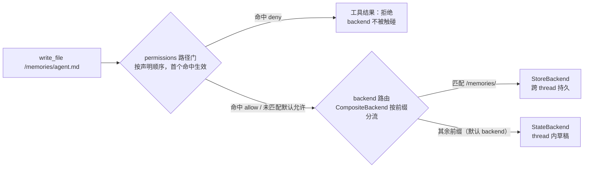
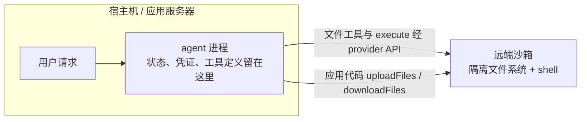

import { Canvas, Controls, Meta } from '@storybook/addon-docs/blocks';
import * as DeepAgentsProduction from './deep-agents-production.stories';

<Meta of={DeepAgentsProduction} name="Docs" />

# 生产化

前两课的 deep agent 已经能写文件、拆任务、按需加载技能与记忆，但它至今运行在一组宽松的默认假设上：文件写进当前 thread 的状态（换个会话就看不见）、文件工具可以碰任何路径（permissions 未声明即全允许）、没有 `execute` 工具（backend 没实现沙箱协议）、一出错整个运行中止（异常冒泡）。这组默认值适合本地试验，不适合上线。本课把 Deep Agents 的生产化拆成四条配置轴——**backend**（文件放哪里、谁能看到、活多久）、**permissions**（文件工具能读写哪些路径）、**沙箱**（`execute` 在哪执行、隔离到什么程度）、**容错**（每类错误由谁修）——最后用一份上线清单把它们组装起来。读完你应该能预测：一次 `write_file` 会先过哪道门、落到哪个存储、活多久；一次 `execute` 在哪里跑、碰不到什么；一类错误会交给哪个中间件。



| 配置轴 | 回答的问题 | 默认值 | 上线动作 |
| --- | --- | --- | --- |
| backend | 文件写到哪、谁能看到、活多久 | `StateBackend`：thread 内草稿 | `CompositeBackend` 组合草稿与持久层；部署禁用 `FilesystemBackend` / `LocalShellBackend` |
| permissions | 文件工具能读写哪些路径 | 未声明 = 全部允许（宽松默认） | 先具体后宽泛的 allow/deny 三明治，deny 兜底 |
| 沙箱 | `execute` 在哪执行 | 未配置 = 没有 `execute` 工具 | sandbox backend + TTL 生命周期 + 凭证不进沙箱 |
| 容错 | 出错时谁来修 | 异常冒泡，运行中止 | 瞬时重试、提供商回退、调用上限、用户可修复中断 |

版本基线：permissions 需要深代理包 `deepagents` 1.9.1 及以上；`read_file` 的二进制支持、`StoreBackend` 读取 `rt.serverInfo` 需要 1.9.0 及以上。示例模型统一用 OpenAI 字符串（`openai:gpt-5.5`）；官方文档示例多写 `google:gemini-3.6-flash` 或 `ChatAnthropic` 实例，换成 `openai:` 前缀字符串等价。

## 快速上手

把默认草稿机升级为最小生产形态，一次配齐三件套：路由清晰的 backend、带兜底的 permissions、防失控的容错中间件。

```ts
// production-agent.ts —— 最小生产形态：Composite 路由 + permissions 三明治 + 容错中间件。
// 运行条件：npm i deepagents @langchain/langgraph langchain dotenv（deepagents>=1.9.1），
// .env 配置 OPENAI_API_KEY，然后 npx tsx production-agent.ts。
// 注意：namespace 工厂读 rt.serverInfo，部署在 LangGraph Server / LangSmith Deployment
// 时由平台填充身份；本地直跑可先退回 rt.executionInfo.threadId。
import 'dotenv/config';
import {
  createDeepAgent,
  CompositeBackend,
  StateBackend,
  StoreBackend,
} from 'deepagents';
import { InMemoryStore } from '@langchain/langgraph';
import { modelRetryMiddleware, modelCallLimitMiddleware } from 'langchain';

const agent = await createDeepAgent({
  model: 'openai:gpt-5.5',
  // 轴一 · 文件去向：默认 State 收草稿与内部数据，/memories/ 前缀路由到跨 thread 的 Store
  backend: new CompositeBackend(new StateBackend(), {
    '/memories/': new StoreBackend({
      namespace: (rt) => [rt.serverInfo.assistantId, rt.serverInfo.user.identity],
    }),
  }),
  // 轴二 · 路径边界：先挡敏感文件，再放行工作区，最后兜底拒绝
  permissions: [
    { operations: ['read', 'write'], paths: ['/workspace/.env', '/workspace/secrets/**'], mode: 'deny' },
    { operations: ['read', 'write'], paths: ['/workspace/**'], mode: 'allow' },
    { operations: ['read', 'write'], paths: ['/**'], mode: 'deny' },
  ],
  // 轴四 · 容错：瞬时错误重试 + 调用上限防预算烧穿（中间件机制归 2.2）
  middleware: [
    modelRetryMiddleware({ maxRetries: 3, backoffFactor: 2.0, initialDelayMs: 1000 }),
    modelCallLimitMiddleware({ runLimit: 50 }),
  ],
  store: new InMemoryStore(), // 本地开发用内存 store；LangSmith Deployment 自动供给
});
```

预期行为：`/workspace/report.md` 之类的写入放行并落在 thread 内；`/workspace/.env` 被拒；`/memories/agent.md` 放行且跨 thread 保留；模型调用失败自动按 1s、2s、4s 退避重试。轴三（沙箱）只在需要 `execute` 时添加，见「沙箱」一节。

## 后端

Deep Agents 的六个内置文件工具（`ls`、`read_file`、`write_file`、`edit_file`、`glob`、`grep`）不直接碰磁盘——它们把操作全部交给 backend。所以「文件系统在哪里」不是环境问题而是配置问题：backend 决定每个文件的两个属性，**作用域**（谁能看到：thread 内、跨 thread、还是宿主机）与**生命周期**（何时消失）。所有 backend 实现同一套协议（V2：`ls` / `read` / `readRaw` / `write` / `edit` / `glob` / `grep`，全部返回带可选 `error` 字段的 Result 对象、不抛异常），因此可以按路径前缀任意组合，也可以自己实现接进云存储。

| backend | 文件落在哪 | 作用域 | `execute` | 适用 |
| --- | --- | --- | --- | --- |
| `StateBackend`（默认） | LangGraph 状态 | thread 内，supervisor 与 subagent 共享 | 无 | 草稿区、大工具输出驱逐 |
| `FilesystemBackend` | 宿主机磁盘 `rootDir` | 进程之外仍在磁盘 | 无 | 本地 CLI / CI；**禁止部署** |
| `LocalShellBackend` | 宿主机磁盘 | 同上 | 有（直接 shell） | 受控本地开发 |
| `StoreBackend` | LangGraph store | 跨 thread（namespace 划分） | 无 | 生产持久层 |
| `ContextHubBackend` | LangSmith Context Hub repo | 跨 thread（带提交历史） | 无 | LangSmith 原生持久化 |
| sandbox backend | 隔离环境 | thread / assistant 作用域 | 有 | 生产代码执行（见「沙箱」） |
| `CompositeBackend` | 按前缀路由到以上成员 | 混合 | 取决于成员 | 组合形态 |

把这组选择放进确定性模拟里观察：同一次 `write_file`，在三种 backend 配置下的去向、作用域与生命周期（路由规则、内部数据去向均为官方规则的示意实现）：

<Canvas of={DeepAgentsProduction.BackendRouting} />
<Controls of={DeepAgentsProduction.BackendRouting} />

| 读者操作 | 可观察证据 |
| --- | --- |
| 配置保持「Composite 路由」，路径切到 `/memories/agent.md` | 路由目标变 StoreBackend，生命周期读数变「持久保留，新 thread 可读」 |
| 同配置路径切到 `/notes/draft.md` 或 `/project/report.md` | 路由回落默认 StateBackend，thread 结束即归档 |
| 路径切到 `/conversation_history/0002.md` | harness 内部数据也写默认 backend——官方建议默认用 State、保持内部数据短暂的原因 |
| 配置切到「State 单一」 | 任何路径都进本 thread 状态：换 thread 就看不见 |
| 配置切到「Filesystem 本地」 | 文件落宿主磁盘，出现部署红线提示；内部数据混进项目目录 |
| 打开 Show code | 看到该 Canvas 实际执行的 `example.ts`：纯 TS 确定性模拟，不依赖 `@langchain/*` |

### StateBackend

不传 `backend` 时的默认值：文件存进 LangGraph 状态，同 thread 内跨轮次经 checkpointer 持久化，跨 thread 不共享。supervisor 与 subagent 共享同一份状态——subagent 写的文件在它执行完后仍留在状态里。它还有两个附带行为：过大的工具输出会被自动驱逐到 `/large_tool_results/` 下的文件，模型再用 `read_file` 分页读回，防止单条结果撑爆上下文；会话历史压缩进 `/conversation_history/`。

```ts
import { createDeepAgent, StateBackend } from 'deepagents';

// 两者等价：缺省就是 StateBackend
const agentA = await createDeepAgent({ model: 'openai:gpt-5.5' });
const agentB = await createDeepAgent({
  model: 'openai:gpt-5.5',
  backend: new StateBackend(),
});
```

边界：`StateBackend` 设计于 graph 内部使用，在 graph 运行之外直接调用它的方法（如 `upload_files`）不会立即生效。它是草稿区，不是持久层——要留档的文件必须路由到别的 backend。

### 本地磁盘：FilesystemBackend 与 LocalShellBackend

`FilesystemBackend` 读写 `rootDir`（必须绝对路径）下的真实文件，适合本地 CLI 与 CI/CD：

```ts
import { createDeepAgent, FilesystemBackend } from 'deepagents';

const agent = await createDeepAgent({
  model: 'openai:gpt-5.5',
  backend: new FilesystemBackend({ rootDir: process.cwd(), virtualMode: true }),
});
```

安全模型必须讲清：`rootDir` 只是工作目录，不是安全边界——默认 `virtualMode: false` 时即使设了 `rootDir` 也毫无防护，模型可以借路径读到 secrets、发起 SSRF 外泄、做出不可逆的修改。`virtualMode: true` 打开路径沙箱（阻止 `..`、`~` 与绝对路径逃逸，symlink 防穿越在可用时生效，`grep` 可用 ripgrep 加速），但它仍然只是路径层的约束。官方明确：Web 服务 / API 场景不要用 `FilesystemBackend`，改用 `StateBackend`、`StoreBackend` 或沙箱；缓解手段是启用 HITL 中间件、隔离 secrets。单用 `FilesystemBackend` 还有一个工程问题：Deep Agents 会把内部数据（`/large_tool_results/`、`/conversation_history/`）也写进 backend，直接用会把内部文件混进你的项目目录——所以官方推荐用 `CompositeBackend` 包装（见下节）。

`LocalShellBackend` 扩展 `FilesystemBackend`，额外提供 `execute` 工具：命令经系统 shell 直接执行，没有隔离。`execute` 支持 `timeout`（默认 120 秒）、`max_output_bytes`（默认 100000）、`env` 与 `inherit_env`；命令以 `rootDir` 为工作目录，但可以访问系统任意路径——`virtualMode: true` 在 shell 可用时没有安全意义。官方定位是「受控开发环境里的本地编码助手」，强烈建议搭配 HITL。

```ts
import { createDeepAgent, LocalShellBackend } from 'deepagents';

const backend = new LocalShellBackend({ workingDirectory: '.' });
const agent = await createDeepAgent({ model: 'openai:gpt-5.5', backend });
```

上线红线（官方原文级别的警告）：这两个 backend 直接访问宿主机，**禁止用于已部署的 agent**。

### 跨 thread 持久：StoreBackend 与 ContextHubBackend

`StoreBackend` 把文件存进 LangGraph `BaseStore`，实现跨 thread 持久。部署到 LangSmith Deployment 时可以省略 `store` 参数（自动供给）；本地开发传 `new InMemoryStore()`。

```ts
import { createDeepAgent, CompositeBackend, StateBackend, StoreBackend } from 'deepagents';
import { InMemoryStore } from '@langchain/langgraph';

const store = new InMemoryStore();
const agent = await createDeepAgent({
  model: 'openai:gpt-5.5',
  backend: new CompositeBackend(new StateBackend(), {
    // namespace 是隔离边界：决定哪些 thread 能看到同一批文件
    '/memories/': new StoreBackend({
      namespace: (rt) => [rt.serverInfo.user.identity],
    }),
  }),
  store,
});
```

`namespace` 工厂是生产化的关键：签名 `(rt) => string[]`，`rt` 提供三类运行时信息——`rt.context`（调用方传入的 context）、`rt.serverInfo`（assistant ID、graph ID、认证用户身份）、`rt.executionInfo`（thread ID、run ID）。常见的三种作用域模式：

| 模式 | 工厂写法 | 效果 |
| --- | --- | --- |
| 每用户 | `(rt) => [rt.serverInfo.user.identity]` | 同一用户跨 assistant 共享文件 |
| 每 assistant | `(rt) => [rt.serverInfo.assistantId]` | 同一 assistant 的所有用户共享 |
| 每 thread | `(rt) => [rt.executionInfo.threadId]` | 退化为 thread 级，跨 thread 不可见 |

约束与版本：namespace 组件只允许字母数字、连字符、下划线、点、`@`、`+`、`:`、`~`，通配符被拒绝（防 glob 注入）；`Runtime` 参数需要 `deepagents` 1.9.1 及以上（更早版本传 `BackendContext`），`serverInfo` / `executionInfo` 需要 1.9.0 及以上。新版本中 `namespace` 将成为必填项——当前不提供时旧行为按 assistant_id 隔离，等于同一 assistant 的**全部用户共享一个键空间**，多用户生产环境必须显式给工厂。滚动部署遇到新旧格式不兼容时，可传 `fileFormat: 'v1'` 兼容旧数据。

`ContextHubBackend` 是另一条跨 thread 路线：文件存为 LangSmith Context Hub 的 repo（可独立 repo，也可链接 skill repo 的 agent repo）。构造传 repo 标识符（`owner/name` 或 `name`），需设置 `LANGSMITH_API_KEY`：

```ts
import { ContextHubBackend } from 'deepagents';

const backend = new ContextHubBackend('my-agent');
```

行为特点：repo 树懒加载并缓存；写与编辑以 Hub 提交落盘（乐观 `parent_commit`，冲突时需要重拉重试）；repo 不存在时首次写入可创建；`upload_files` 只接受 UTF-8 文本，非 UTF-8 以 `invalid_path` 拒绝；agent repo 挂在根路径，链接的 skill repo 出现在 `/skills/` 下。适合想要 LangSmith 原生持久化与提交历史的场景。

记忆机制本身（`AGENTS.md`、`memory` 参数怎么用）归[「核心能力」](?path=/docs/deep-agents-capabilities--docs)（5.2.2）；本课只关心它的存储落点与作用域。

### CompositeBackend

按路径前缀把操作路由到不同 backend，长前缀优先（`/memories/projects/` 可以覆盖 `/memories/`）；`ls` / `glob` / `grep` 会聚合各成员的结果并保留原始前缀，模型感知不到背后有多个存储：

```ts
import { createDeepAgent, CompositeBackend, FilesystemBackend, StateBackend } from 'deepagents';

const agent = await createDeepAgent({
  model: 'openai:gpt-5.5',
  backend: new CompositeBackend(
    // 第一个参数是默认 backend：未被任何前缀命中的路径（含 harness 内部数据）都落到这里
    new StateBackend(),
    {
      '/workspace/': new FilesystemBackend({ rootDir: '/path/to/project', virtualMode: true }),
    },
  ),
});
```

路由行为：`/workspace/plan.md` 走 FilesystemBackend，其余路径（如 `/notes/draft.md`、`/large_tool_results/...`）走默认 StateBackend。官方建议默认 backend 用 `StateBackend`——harness 的内部数据写默认 backend，让它保持 thread 级的短暂生命周期，不污染持久层。

还有一条与沙箱组合的硬限制：默认 backend 是沙箱时，permissions 的路径必须全部限定在已知路由前缀之下，否则构造时直接抛错（原因与写法见「权限」一节）。

### 自定义 backend

`backend` 参数接受任何实现 `AnyBackendProtocol`（V1 或 V2）的对象——S3、数据库、Notion 都可以。V2 协议的七个必需方法：

| 方法 | 签名要点 | 说明 |
| --- | --- | --- |
| `ls` | `(path) => Promise<LsResult>` | 非递归列出；目录路径带尾 `/`、`is_dir: true` |
| `read` | `(filePath, offset?, limit?) => Promise<ReadResult>` | 文本按行分页（默认 offset 0、limit 500）；二进制返回全量 `Uint8Array` + `mimeType`；缺文件返回 `{ error: "File '/x' not found" }` |
| `readRaw` | `(filePath) => Promise<ReadRawResult>` | 原始 `FileData`（含 ISO 8601 时间戳） |
| `write` | `(filePath, content) => Promise<WriteResult>` | create-only：文件已存在返回 error |
| `edit` | `(filePath, oldString, newString, replaceAll?) => Promise<EditResult>` | `oldString` 需唯一，除非 `replaceAll`；成功返回 `occurrences` |
| `glob` | `(pattern, path?) => Promise<GlobResult>` | 匹配路径为 `FileInfo[]`（`path`、`is_dir`、`size`、`modified_at`） |
| `grep` | `(pattern, path?, glob?) => Promise<GrepResult>` | 字面量文本搜索；二进制跳过；失败返回 error 而非抛异常 |

三条协议纪律：所有方法返回结构化 Result 对象（含可选 `error`），不抛异常；可选方法 `uploadFiles` / `downloadFiles` 服务沙箱播种与取回；要支持 `execute` 工具需实现 `SandboxBackendProtocolV2`（扩展 `execute(command)` 与 `readonly id: string`）。官方文档给了 S3 风格的骨架（构造器里 `prefix` 去尾斜杠、`key(path)` 把虚拟路径映射到对象键）和两种加策略的姿势：子类包装（如 `GuardedBackend` 拒绝 deny 前缀下的写编辑）或通用 `PolicyWrapper`（包装任意 backend 做限流、审计、内容检查）。

迁移提示：backend 工厂（`backend: () => new StateBackend()`）自 1.9.0 起弃用，改为直接传实例；V1 协议的方法名（`lsInfo` / `grepRaw` / `globInfo`）已更名为 V2 的 `ls` / `grep` / `glob`，`createDeepAgent` 会经 `adaptBackendProtocol()` 自动适配旧实现，只有直接调用协议方法时才需要手动适配。

## 权限

permissions 是声明式的路径访问控制（需要 `deepagents` 1.9.1 及以上），只作用于六个内置文件工具：`operations: ['read']` 覆盖 `ls` / `read_file` / `glob` / `grep`，`operations: ['write']` 覆盖 `write_file` / `edit_file`。每条规则三个字段：

| 字段 | 类型 | 说明 |
| --- | --- | --- |
| `operations` | `('read' \| 'write')[]` | 这条规则管读还是管写（或都管） |
| `paths` | `string[]` | glob 模式，支持 `**` 递归与 `{a,b}` 交替匹配 |
| `mode` | `'allow' \| 'deny'` | 默认 `'allow'` |

求值语义四条：①按**声明顺序**求值，**首个匹配的规则生效**（first-match）；②无规则匹配时**默认允许**——宽松默认，本模拟带兜底 R4 观察不到它，删掉 R4 后任何路径都会落到这条默认；③路径必须绝对（以 `/` 开头）且不含 `..` 或 `~`，非法路径在 agent 构造时抛错；④deny 生效时工具操作被拒绝，backend 根本不会被触碰。前两条正是下面模拟的主体：

<Canvas of={DeepAgentsProduction.PermissionCheck} />
<Controls of={DeepAgentsProduction.PermissionCheck} />

| 读者操作 | 可观察证据 |
| --- | --- |
| 工具保持 `write_file`，路径在 `/workspace/README.md` | R1 命中（它只声明了 `operations: ['write']`），调用被拒 |
| 同路径切到 `read_file` | R1 因操作不含 read 不命中，落到 R3 放行——`operations` 是独立于路径的过滤维度 |
| 路径切到 `/workspace/report.md` | R1、R2 未命中，R3 allow 放行，结果「已写入」 |
| 路径切到 `/workspace/.env` | R2 deny 生效（`/workspace/secrets/**` 同理由它拦截）；R3 之后的规则显示「不再检查」 |
| 路径切到 `/memories/agent.md` | 兜底 R4 deny：工作区之外的路径全部拒绝 |
| 打开 Show code | 看到该 Canvas 实际执行的 `example.ts`：三明治规则集与逐条求值的示意实现 |

### 规则顺序

顺序是语义的一部分：正确写法是先具体后宽泛——先 deny 敏感文件，再 allow 工作区，最后 deny 兜底。反例是把 `allow /workspace/**` 写在 `deny /workspace/.env` 前面：首个匹配生效意味着模型读写 `.env` 时先命中 allow，那条 deny 永远不会被检查。等价的另一种思路是 deny-all 基线再往上叠更细的 allow 规则，适合白名单心智。

### subagent 的权限

默认**继承**父 agent 的 permissions；在 subagent spec 里设置 `permissions` 会**完全替换**父规则（不是合并）；`permissions: []` 表示显式授予无限制访问；省略该字段则继承。给只读审查员收权：

```ts
await createDeepAgent({
  model: 'openai:gpt-5.5',
  subagents: [
    {
      name: 'auditor',
      description: 'Read-only code reviewer',
      systemPrompt: 'Review the code for issues.',
      permissions: [
        { operations: ['write'], paths: ['/**'], mode: 'deny' },
        { operations: ['read'], paths: ['/workspace/**'], mode: 'allow' },
        { operations: ['read'], paths: ['/**'], mode: 'deny' },
      ],
    },
  ],
});
```

### 两种收权方式

permissions 与 backend policy hooks（上文的子类 / `PolicyWrapper`）各管一段：需要**基于路径**的允许 / 拒绝时用 permissions；需要自定义验证——限流、审计日志、内容检查——或要控制**自定义工具**时用 policy hooks。还要清楚 permissions 的三个不管：不管自定义工具、不管访问文件系统的 MCP 工具、不适用于沙箱 backend——`execute` 能跑任意命令，纯路径限制拦不住它。所以当 `CompositeBackend` 的默认 backend 是沙箱时，官方直接规定 permissions 的路径必须限定在已知路由前缀之内，超出前缀（例如路由只有 `/memories/` 时写 `paths: ['/**']` 或 `/workspace/**`）会在构造时抛错。

## 沙箱

沙箱是一种特殊的 backend：配置它，agent 在六个文件工具之外获得 `execute` 工具，并在隔离环境里运行文件操作——宿主机的本地文件、环境变量、其他进程都碰不到。什么时候需要：编码 agent 要自主跑 shell、git、克隆仓库、起 Docker-in-Docker 测试流水线；数据分析 agent 要装 pandas / numpy、做统计计算、产出文档。官方工具清单里还有一个可选的 `eval` 工具（需 Interpreters 中间件）；本课主线是 `execute`。

provider 选择：LangSmith 提供第一方托管沙箱（UI 或 SDK 直接用，无需第三方账号）；沙箱页另提到 Daytona、E2B、Modal、Runloop、Deno 等第三方，integrations 索引页当前收录 LangSmith、Deno、Daytona、Modal、Leap0 与社区维护的 Kubernetes 沙箱——各 provider 的认证与生命周期细节以对应集成页为准。

```ts
// 沙箱最小示例（官方原示例用 ChatAnthropic 实例，此处按本手册惯例换成 openai: 字符串）
import { createDeepAgent, LangSmithSandbox } from 'deepagents';
import { SandboxClient } from 'langsmith/sandbox';

const client = new SandboxClient();
const lsSandbox = await client.createSandbox();
try {
  const agent = await createDeepAgent({
    model: 'openai:gpt-5.5',
    systemPrompt: 'You are a coding assistant with sandbox access.',
    backend: new LangSmithSandbox({ sandbox: lsSandbox }),
  });
  const result = await agent.invoke({
    messages: [{ role: 'user', content: 'Create a hello world Python script and run it' }],
  });
} finally {
  await client.deleteSandbox(lsSandbox.name);
}
```

### 两种集成架构



| 架构 | 形态 | 得到 | 付出 |
| --- | --- | --- | --- |
| agent in sandbox | agent 整体跑进沙箱，经 WebSocket / HTTP 与外界通信 | 接近本地开发体验，agent 与环境紧耦合 | API key 必须放进沙箱；更新 agent 要重建镜像；需要额外通信设施 |
| sandbox as tool（官方示例采用） | agent 留在宿主机，需要执行时调用沙箱工具 | agent 代码即时可更新；状态与执行分离（key 不入沙箱、沙箱故障不丢状态、可并行多沙箱）；只为执行时间付费 | 每次调用有网络延迟 |

### 生命周期

沙箱在关闭前持续消耗资源、产生费用，作用域有两种：

- **thread-scoped（默认）**：每个会话线程一个沙箱，首次运行创建、同线程复用、线程结束或 TTL 过期销毁。典型实现是 graph factory 按 `thread_id` 命名复用：

```ts
import { LangSmithSandbox } from 'deepagents';
import { SandboxClient } from 'langsmith/sandbox';
import type { LangGraphRunnableConfig } from '@langchain/langgraph';

const client = new SandboxClient();

// graph factory 是 async：沙箱创建 / 查询是 I/O；身份从 config.configurable 读取
export async function agent(config: LangGraphRunnableConfig) {
  const threadId = config.configurable?.thread_id as string;
  const sandboxName = `thread-${threadId}`;
  const existing = (await client.listSandboxes()).filter(
    (sb) => sb.name === sandboxName,
  );
  const lsSandbox = existing[0] ??
    (await client.createSandbox({ name: sandboxName, idleTtlSeconds: 3600 }));
  return createDeepAgent({
    model: 'openai:gpt-5.5',
    backend: new LangSmithSandbox({ sandbox: lsSandbox }),
  });
}
```

- **assistant-scoped**：同一 assistant 的所有线程共用一个沙箱（命名 `assistant-${assistantId}`），文件、装好的包、克隆的仓库跨会话保留。代价是状态持续累积——官方要求配置 TTL、定期用快照重置或实现清理逻辑，防止磁盘与内存无限增长。

### execute 的机制与边界

provider 只需实现一个 `execute()` 方法（运行 shell 命令并返回输出），其余文件操作全部由 `BaseSandbox` 基类生成脚本、经 `execute()` 完成。框架在每次模型调用时检查 backend 是否实现沙箱协议，未实现则把 `execute` 工具过滤掉——这就是「沙箱配置之前没有 execute」的原因。工具返回合并的 stdout / stderr、退出码与截断提示；输出过大时自动存成文件并指示 agent 用 `read_file` 增量读取，防止上下文溢出。

文件访问分两个平面：模型发起的文件工具走沙箱内 `execute()`；**应用代码**则用 `uploadFiles()` / `downloadFiles()`（provider 原生传输 API）播种沙箱与取回产物：

```ts
const encoder = new TextEncoder();
// 运行前播种源码与配置；每项返回 success / error
const responses = await sandbox.uploadFiles([
  ['src/index.js', encoder.encode("console.log('Hello')")],
  ['package.json', encoder.encode('{"name": "my-app"}')],
]);
// 运行后取回产物；结果含 content 或 error
const results = await sandbox.downloadFiles(['src/index.js', 'output.txt']);
```

隔离的边界要说准：沙箱保护**宿主机**，但不防护两类攻击——**上下文注入**（攻击者控制部分输入即可指示 agent 在沙箱内运行任意命令）与**网络外泄**（不阻断网络时，被注入的 agent 可经 HTTP / DNS 把数据送出去；部分 provider 支持 `blockNetwork: true`，如 Modal）。

### 沙箱里的凭证

铁律：**永远不要把 secrets 放进沙箱**——即使短期或窄权限凭证也一样，agent 能访问的攻击者也能访问。安全的做法按优先级：把需要认证的工具定义在沙箱外的宿主环境，agent 按名调用但看不到凭证；用网络代理注入凭证（拦截沙箱外发请求并附加 `Authorization` 头，密钥解析自 workspace secrets，沙箱内不接触原始密钥）。必须注入时的缓解——全部工具调用开 HITL 审批、阻断沙箱网络、最窄范围与最短有效期、监控出站流量——官方明说仍是不可靠的变通，足够精巧的注入可以绕过输出过滤与人工审核。其余实践：行动前审查沙箱输出、不需要网络就阻断、用中间件过滤或脱敏工具输出中的敏感模式、把沙箱产物当不可信输入。

## 容错

核心思想是**错误分类**：不是所有错误都该同等处理——瞬时故障自动重试，模型自己能恢复的错误反馈给模型，用户能修的中断暂停，提供商宕机切备用，失控循环设上限，剩下的意外错误让它冒泡。

| 错误类型 | 谁来修 | 策略 | 中间件 / 功能 |
| --- | --- | --- | --- |
| 瞬时错误（网络、限流） | 系统自动 | 指数退避重试 | `modelRetryMiddleware` / `toolRetryMiddleware` |
| 用户可修复（信息缺失、指令不清） | 人工 | `interrupt()` 暂停收集 | `interruptOn`（HITL，机制归 2.4） |
| 提供商宕机 | 系统自动 | 切换备用模型 | `modelFallbackMiddleware` |
| 失控循环（过度调用） | 系统自动 | 限制每次运行的调用数 | `modelCallLimitMiddleware` / `toolCallLimitMiddleware` |
| 意外错误 | 开发者 | 让异常冒泡，不捕获 | 无 |

这些中间件来自 `langchain` 包，文档示例用 `createAgent` 展示；Deep Agents 构建在同一中间件体系上，经 `createDeepAgent` 的 `middleware` 数组挂载（快速上手的示例即是）：

```ts
import { createAgent, modelRetryMiddleware, toolRetryMiddleware } from 'langchain';

const agent = createAgent({
  model: 'openai:gpt-5.5',
  tools: [searchTool, fetchUrlTool],
  middleware: [
    // 模型层重试：覆盖限流、超时与 5xx
    modelRetryMiddleware({ maxRetries: 3, backoffFactor: 2.0, initialDelayMs: 1000 }),
    // 工具层重试：范围要精确——read_file 失败重试无益，网络搜索超时值得重试
    toolRetryMiddleware({
      maxRetries: 2,
      tools: ['search', 'fetch_url'],
      retryOn: [TimeoutError, TypeError],
    }),
  ],
});
```

退避是可以算出来的确定性算例：`initialDelayMs: 1000`、`backoffFactor: 2.0`、`maxRetries: 3` 时，三次重试分别等待 1s、2s、4s，最坏情况一次模型调用在放弃前累计耗时约 7 秒加上各次尝试本身。把它调小适合交互场景，调大适合后台批处理。

两类互补的「限流」不要混淆：提供商侧限流在初始化模型时配置请求频率；调用上限中间件限制的是 agent 自己的调用次数。`modelFallbackMiddleware('gpt-5.5')` 处理提供商整体宕机；调用上限有两个刻度——`runLimit` 是单次 invoke 内的上限（每轮重置），`threadLimit` 是整个会话的上限（需要 checkpointer，机制归 3.4）：

```ts
import { createAgent, modelCallLimitMiddleware, toolCallLimitMiddleware } from 'langchain';

const agent = createAgent({
  model: 'openai:gpt-5.5',
  middleware: [
    modelCallLimitMiddleware({ runLimit: 50 }),
    toolCallLimitMiddleware({ runLimit: 200 }),
  ],
});
```

不设上限的后果官方写得很直白：混乱的 agent 可能在几分钟内烧穿你的 LLM API 预算。最后两条边界：默认情况下工具执行抛异常会中止整个 agent 运行（想让模型看到错误并自纠错时，`ToolErrorMiddleware` 在 JS SDK 里尚未提供，需要在自定义工具里捕获并返回错误文本）；自己写中间件时同样遵循「不捕获你处理不了的异常」。

## 上线清单

生产化的信息归属总纲是三个作用域：**thread**（单次会话，消息历史与草稿文件默认只在本 thread 内）、**user**（用户级记忆与文件，身份来自 auth 层）、**assistant**（配置好的 agent 实例，记忆与文件可绑定到它）。上线清单就是围绕这三个作用域把前四轴组装起来。

**部署方式。** 首选 Managed Deep Agents（公测中，CLI-first 托管运行时），项目结构与部署归[「Managed Deep Agents」](?path=/docs/managed-deep-agents--docs)（5.2.4）。要自定义应用代码、路由与高级认证时用 LangSmith Deployment：自动提供 threads、runs、store、checkpointer，附带认证、webhooks、cron、可观测性与 MCP / A2A 暴露。部署配置写在 `langgraph.json`：

```json
{
  "dependencies": ["."],
  "graphs": { "agent": "./src/agent.ts:agent" },
  "env": ".env"
}
```

`dependencies` 声明安装包（`["."]` 读取 package.json）；`graphs` 把 `"<id>"` 映射到 `./<file>:<variable>`；`env` 指定构建时注入、运行时可用的环境变量文件。

**每次调用必带两样东西**，彼此独立：

```ts
import { createDeepAgent } from 'deepagents';
import { z } from 'zod';

const contextSchema = z.object({ userId: z.string() });

const agent = await createDeepAgent({
  model: 'openai:gpt-5.5',
  contextSchema,
});

// thread_id：checkpointer 靠它持久化与恢复消息历史，新会话生成新 id
const config = { configurable: { thread_id: crypto.randomUUID() } };
await agent.invoke(
  { messages: [{ role: 'user', content: 'Plan a 3-day trip to Tokyo' }] },
  // context：本次运行的数据（user_id、flags 等），经 runtime.context 读取
  { ...config, context: { userId: 'user-123' } },
);
```

**执行环境。** 复述本课红线：默认 StateBackend 草稿；跨 thread 用 StoreBackend 配 namespace 工厂；`FilesystemBackend` 与 `LocalShellBackend` 直接访问宿主机，禁止用于已部署 agent；需要执行代码就上沙箱并按会话语义选 thread / assistant 作用域。

**多租户与凭证。** 用户身份与访问控制用 LangSmith 自定义认证加 authorization handlers：给资源打归属标签、返回过滤器、返回 HTTP 403 拒绝。团队 RBAC 分 Workspace Admin（全部权限）、Editor（不能删 runs、管成员）、Viewer（只读），Enterprise 支持自定义角色。终端用户凭证走 Agent Auth（托管 OAuth 2.0：首次使用时 interrupt、展示 consent URL、认证后恢复、token 自动刷新）；沙箱凭证走 auth proxy（见「沙箱里的凭证」）；应用自己的共享密钥存 LangSmith workspace secrets。

**记忆作用域。** 官方推荐的默认是 User + Assistant（namespace `(assistant_id, user_id)`，每用户偏好）；Assistant 级适合单 assistant 共享指令；User 级是跨 assistant 的用户画像；Org / 全局级只放只读策略。共享记忆是 prompt injection 向量——org 级策略只应由应用代码写入，并用 permissions 的 deny 规则或 policy hooks 强制。记忆的写法与加载机制归 5.2.2。

**护栏三件套。** permissions（路径边界）+ 容错（本课上一节）+ 数据隐私：

```ts
import { createAgent, piiMiddleware } from 'langchain';

const agent = createAgent({
  model: 'openai:gpt-5.5',
  middleware: [
    piiMiddleware('email', { strategy: 'redact', applyToInput: true }),
    piiMiddleware('credit_card', { strategy: 'mask', applyToInput: true }),
  ],
});
```

策略四种：`redact`（替换为 `[REDACTED_EMAIL]`）、`mask`（如 `****-****-****-1234`）、`hash`（确定性哈希）、`block`（抛错），支持自定义检测器。

**异步与持久化。** JS SDK 的约定是 async 方法加 `a` 前缀（`ainvoke`、`abefore_agent`、`astream`）；用原生 async 工具与中间件钩子，沙箱与 MCP 连接要 await——这也是沙箱示例里 graph factory 写成 async 的原因。LangGraph 持久化每步 checkpoint：中断、超时、人工介入暂停后从最后状态恢复，不重算已完成步骤（机制归 3.4 / 3.5）；LangSmith Deployment 自动配置持久 checkpointer。

**前端与深度。** 用 `useStream` hook 连接部署；深层多 subagent 工作流要调高递归上限：`streamSubgraphs: true` 加 `config: { recursionLimit: 10000 }`。上下文长度的另一个闸门在 backend 一侧：大工具输出自动驱逐成分页文件、`read` 默认 limit 500 行。

**可观测性。** LangSmith Cloud 部署自动把 traces 发到以部署命名的项目；建议配置 LangSmith Engine 监控 trace、检测问题、提出修复。追踪与成本分析的细节归[「LangSmith 追踪」](?path=/docs/langsmith-observability--docs)（6.1）。

上线前逐项核对：

- backend：部署形态不含 `FilesystemBackend` / `LocalShellBackend`；内部数据留默认 State；`StoreBackend` 已给 namespace 工厂。
- permissions：有 deny 兜底；规则先具体后宽泛；subagent 权限显式声明（替换语义）。
- 沙箱：TTL 与作用域已定；凭证不进沙箱；不需要的网络已阻断。
- 容错：重试范围精确到值得重试的工具；`runLimit` / `threadLimit` 已设。
- 调用：每次 invoke 带 `thread_id` 与 `context`；`contextSchema` 已定义。
- 观测：traces 已接入（6.1）。

## 最佳实践

- backend 组合公式：默认 `StateBackend` 收草稿与内部数据，按前缀挂持久层（`StoreBackend` / `ContextHubBackend`），需要执行再挂沙箱——不要用一个 backend 承担三种职责。
- permissions 从 deny-all 基线往上开洞，或用「先具体后宽泛」三明治；非法路径与前缀越界都在构造时抛错，写完先跑一次构造做校验。
- 沙箱凭证零信任：认证工具定义在宿主、代理注入凭证，任何形式的「放 key 进沙箱」都按事故预案对待。
- 沙箱作用域按会话语义选：一次性任务用 thread-scoped + TTL；跨会话积累用 assistant-scoped，并配套快照重置或清理。
- 容错按错误类型配齐，但不滥配：重试限定到瞬时错误与特定工具，意外错误保留冒泡，别把 bug 重试成三倍成本。
- 多用户部署必须给 `StoreBackend` namespace 工厂，否则同一 assistant 的全部用户共享一个键空间。

## 常见问题

- agent 写的文件「消失」了，新 thread 里看不到？
  默认 `StateBackend` 的作用域就是 thread 内：文件随 checkpointer 留在本 thread，跨 thread 不共享。要跨 thread 保留，把对应前缀路由到 `StoreBackend` 或 `ContextHubBackend`（`CompositeBackend` 组合）。
- `.env` 明明写了 deny，模型还是读到了？
  九成是规则顺序：`allow /workspace/**` 写在 `deny /workspace/.env` 前面，首个匹配生效使 deny 永不被检查。调整为先具体后宽泛；构造期能抛错的是非法路径，顺序错误不会抛，只能靠 review 或测试。
- 为什么我的 agent 没有 `execute` 工具？
  框架在每次模型调用前检查 backend 是否实现沙箱协议，未实现就过滤掉 `execute`。要 `execute` 就换 sandbox backend（生产）或 `LocalShellBackend`（仅受控本地开发，禁止部署）。
- subagent 写了父 agent 禁止的路径？
  subagent 设置 `permissions` 是**完全替换**父规则而非合并：漏配等于放开，`permissions: []` 更是显式无限制。要么省略该字段走继承，要么按父级同样严格的标准完整声明。
- 沙箱里装好的包、克隆的仓库，下次会话就没了？
  thread-scoped 沙箱随 thread 结束或 TTL 过期销毁。跨会话保留要 assistant-scoped 沙箱，并接受状态累积的代价：配 TTL、定期快照重置或写清理逻辑。
- `CompositeBackend` 默认 backend 是沙箱时，构造直接抛错？
  permissions 的路径超出了已知路由前缀。沙箱支持任意命令执行，纯路径限制无法阻止 shell 访问文件系统，所以官方规定规则路径必须限定在路由前缀之内（如只有 `/memories/` 路由时写 `/memories/**`，不能写 `/**`）。
- agent 几分钟烧穿了 API 预算？
  没设调用上限的失控循环。加 `modelCallLimitMiddleware({ runLimit })` 与 `toolCallLimitMiddleware({ runLimit })`；需要整会话上限用 `threadLimit`（依赖 checkpointer）。

## 总结回顾

摘要：

本课把生产化立为四条配置轴。backend 决定文件的作用域与生命周期：默认 `StateBackend` 是 thread 内草稿，跨 thread 持久选 `StoreBackend`（namespace 工厂是隔离边界）或 `ContextHubBackend`，本地磁盘的 `FilesystemBackend` / `LocalShellBackend` 禁止部署，`CompositeBackend` 按前缀组合它们并让内部数据留在默认 State；所有 backend 实现同一 Result 协议，因此可以自定义接云存储。permissions 是声明式路径门：read / write 两类操作、glob 路径、allow / deny 三字段，按声明顺序首个命中生效、未匹配默认允许，subagent 侧是替换语义。沙箱是带 `execute` 的 backend：provider 只实现 `execute()`，其余文件操作在其上构建；两种集成架构里官方示例采用 sandbox as tool；它保护宿主机但不防上下文注入与网络外泄，凭证永不进沙箱。容错按错误分类配置：瞬时重试、用户可修中断、提供商回退、失控限流、意外冒泡。上线清单把四轴装进 thread / user / assistant 三个作用域：部署方式、`thread_id` 与 `context`、多租户凭证、护栏三件套与可观测性。

一句话：

> 生产化不是给 agent 加能力，而是把「文件放哪、能碰哪、代码在哪跑、错了谁修」四个默认宽松的假设换成显式收紧的配置——默认形态是 thread 内的草稿机，生产形态是路由清晰、路径受限、执行隔离、失败有主的组合体。

知识要点：

- backend 家族各自的作用域、生命周期与适用场景是什么？内部数据为什么应留在默认 `StateBackend`？
- `StoreBackend` 的 namespace 工厂怎么写？三种常见作用域模式各适合什么？
- permissions 的三字段与求值语义是什么？为什么规则必须先具体后宽泛？subagent 的继承与替换规则是什么？
- permissions 与 backend policy hooks 各管什么？为什么沙箱 backend 下 permissions 有前缀限制？
- 沙箱提供什么、不防护什么？两种集成架构与两种生命周期各自换来什么、付出什么？secrets 铁律是什么？
- 五类错误各由谁修、用什么中间件？`runLimit` 与 `threadLimit` 的区别是什么？
- 上线必带的两个调用参数是什么？部署环境对 backend 的红线是什么？

## 参考资料

- [Backends（官方：backend 家族、协议 V2、Result 类型、迁移与弃用）](https://docs.langchain.com/oss/javascript/deepagents/backends)
- [Permissions（官方：规则结构、求值语义、subagent 与 sandbox 组合限制）](https://docs.langchain.com/oss/javascript/deepagents/permissions)
- [Sandboxes（官方：execute 机制、生命周期、集成架构、隔离边界与凭证处理）](https://docs.langchain.com/oss/javascript/deepagents/sandboxes)
- [Fault tolerance（官方：错误分类表与容错中间件配置）](https://docs.langchain.com/oss/javascript/deepagents/fault-tolerance)
- [Going to production（官方：部署方式、调用要点、多租户、护栏与上线检查）](https://docs.langchain.com/oss/javascript/deepagents/going-to-production)
- [Deep Agents overview（官方：createDeepAgent 调用形态与内置工具清单）](https://docs.langchain.com/oss/javascript/deepagents/overview)
- [Sandbox integrations（官方：沙箱 provider 索引）](https://docs.langchain.com/oss/javascript/integrations/sandboxes)
