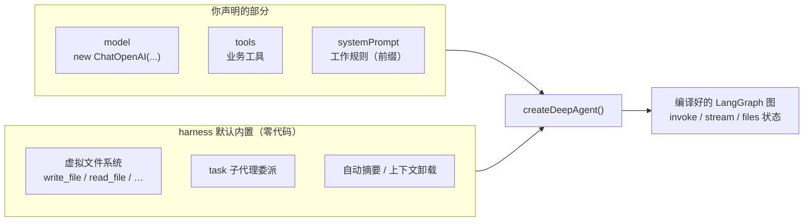

import { Canvas, Controls, Meta } from '@storybook/addon-docs/blocks';
import * as DeepAgentsQuickstart from './deep-agents-quickstart.stories';

<Meta of={DeepAgentsQuickstart} name="Docs" />

# 上手

本课把 Deep Agents 立起来：LangChain 官方的**深度任务 harness**——规划、虚拟文件系统、子代理委派、长期记忆这些深度任务的基础设施不是让你接线，而是内置成默认值。入口是 `deepagents` 包的 `createDeepAgent()`：声明 `model`、`tools`、`systemPrompt` 三要素，得到一个编译好的 LangGraph 图，`invoke` / `stream` 的调用形态与第一课的 `createAgent` 完全一致。读完你应该能预测：把 `createAgent` 换成 `createDeepAgent` 后，同样的输入会在输出里多出什么（从没注册过的 `write_file`、`task` 工具调用，和一个装着产物的 `files` 状态），以及什么任务值得为它们升级。



| 关键输入 | 形式 | 默认与回查要点 |
| --- | --- | --- |
| `model` | `"provider:model"` 字符串或模型实例 | 不传默认 `"anthropic:claude-sonnet-4-6"`；OpenAI 主线传 `new ChatOpenAI(...)` 或 `"openai:..."` |
| `tools` | `tool()` 数组 | 只增不减：内置文件工具照常注册；与内置工具名撞名直接抛 `ConfigurationError` |
| `systemPrompt` | 字符串 | 作为前缀拼接，harness 内置的基础提示（教模型用文件系统和委派）仍然保留 |
| `backend` | backend 实例或工厂 | 默认 `StateBackend`：文件存在图 state 的 `files` 键里，不落磁盘 |
| `middleware` | 中间件数组 | 规划 `write_todos` 在这里显式开启：`todoListMiddleware()` |
| 返回值 | `DeepAgent` 实例 | 编译好的 LangGraph 图，`invoke` / `stream` / `checkpointer` 与 `createAgent` 同构 |

## 快速上手

`deepagents` 是独立 npm 包（不是 `@langchain/deepagents`，也不是 `langchain` 的导出），它把 LangChain 运行时声明为 peer 依赖——npm 7+ 和 pnpm 会自动装上；Yarn 用户必须显式安装（见「常见问题」）。OpenAI 主线的完整安装：

```bash
# 在「安装」一课的工程里执行（已有 zod 可不重复装）；新工程需要 Node ≥ 20
npm install deepagents langchain @langchain/core @langchain/openai zod dotenv
```

把下面的代码存成 `deep-agent-demo.ts`，`.env` 里配好 `OPENAI_API_KEY`，用 `npx tsx deep-agent-demo.ts` 运行：

```ts
// deep-agent-demo.ts —— 最小 Deep Agent：三要素声明 + 一次 invoke
// 运行条件：OPENAI_API_KEY 已写入 .env；npx tsx deep-agent-demo.ts 运行。
import 'dotenv/config';
import * as z from 'zod';
import { ChatOpenAI } from '@langchain/openai';
import { tool } from 'langchain';
import { createDeepAgent } from 'deepagents';

// 1. 业务工具：与第一课的写法完全一致，这是你唯一要写的工具
const fetchDocs = tool(
  ({ topic }: { topic: string }) => `Docs outline of ${topic}: ...`,
  {
    name: 'fetch_docs',
    description: 'Fetch the documentation outline for a given topic',
    schema: z.object({ topic: z.string().describe('Topic to look up') }),
  }
);

// 2. 组装：model + tools + systemPrompt 三要素，与 createAgent 同形。
//    文件系统、task 子代理、自动摘要——harness 默认带上，一行都不用写。
const agent = createDeepAgent({
  model: new ChatOpenAI({ model: 'gpt-4o-mini' }),
  tools: [fetchDocs],
  systemPrompt: 'You are a research assistant.',
});

// 3. 运行与消费：调用形态与 createAgent 一致
const result = await agent.invoke({
  messages: [
    { role: 'user', content: 'Research LangGraph, then write /summary.md' },
  ],
});

console.log(result.messages.at(-1)?.content); // 最终回答
console.log(Object.keys(result.files ?? {})); // 虚拟文件系统里的产物，如 ['/summary.md']
```

与第一课 `weather.ts` 逐行对照，差异只有三处：`import { createDeepAgent } from 'deepagents'`、组装函数换成 `createDeepAgent`、输出多看了一个 `result.files`。组装心智完全复用——这是官方有意的设计：Deep Agents 构建在 LangChain 核心构件（`createAgent` 与中间件）和 LangGraph 之上，而不是另起一套 API。

第一次运行的最直观证据就在输出里：`console.log(result.messages)` 会看到 `write_file`、`task` 这类**你从没注册过的工具**的调用回合——它们是 harness 注入的内置工具，模型像使用你的业务工具一样自主使用它们。展开见「运行与观察」。

## Deep Agents 是什么

官方的定位一句话：**一个自带主张、开箱即用的 agent harness**——与其自己接线提示、工具和上下文管理，你先拿到一个能跑的 agent，再按需定制。README 的自我介绍更直接："The batteries-included agent harness"。它解决的是深度任务的公共工程问题：

- **任务深**：多步骤、有中间产物（笔记、草稿、代码），塞在对话历史里既贵又容易丢；
- **上下文易膨胀**：工具返回的大块结果需要卸载、摘要、按需取回；
- **要委派**：子任务值得放进隔离上下文并行处理（正是 5.1.2 手工做的那三步）。

这些能力在 `createAgent` 上都要自己组装（5.1.2 的 `task` 包装、5.1.4 的 `load_skill` 中间件、「短期记忆」的摘要中间件）；Deep Agents 把它们变成默认值，在生产环境里被 OpenSWE 和 LangSmith Fleet 使用。

### 与 createAgent 的分界

官方给的分界很干脆：需要这些内置能力就用 Deep Agents；**要构建不带这些内置能力的自定义 agent，用 LangChain 的 `createAgent` 或自定义 LangGraph workflow**。把它翻译成升级信号：

| 信号 | 在 createAgent 上的代价 | Deep Agents 的默认答案 |
| --- | --- | --- |
| 任务多步、需要计划与进度追踪 | 自己拼 todo 工具和状态 | `write_todos`（opt-in 一行开启） |
| 中间产物多（笔记、草稿、报告） | 自己设计存储与读取 | 虚拟文件系统 + 7 支文件工具 |
| 工具结果大、上下文容易爆 | 自己接摘要与卸载中间件 | 自动摘要中间件默认启用 |
| 子任务值得隔离并行 | 手工三步包装子代理 | 内置 `task` 工具 + 默认子代理 |
| 要跨线程记住用户偏好 | 自己接 Store 与注入 | `memory` 参数声明式加载 |

反向同样成立：单轮问答、少量工具、无中间产物的场景，`createAgent` 永远更轻——多一层 harness 就多一分提示词与行为的既定性。

顺带定位它与 Claude Agent SDK 的关系（官方对比页）：Deep Agents 模型不限（100+ 提供方）、执行后端可插拔（虚拟文件系统、本地磁盘、远程沙箱）、可 LangSmith 托管也可 `langgraph build` 自托管、内置多租户；Claude Agent SDK 只能 Claude、只在沙箱内运行。细节归 5.2.3/5.2.4。

### 包现状

写本课时（2026-10）以 npm `deepagents@1.14.1` 与官方 JS 文档核对：

- 包名 `deepagents`，MIT，仓库 langchain-ai/deepagentsjs；peer 依赖 `langchain`、`@langchain/core`、`@langchain/langgraph`、`@langchain/langgraph-checkpoint`、`@langchain/langgraph-sdk`、`langsmith`；
- 入口有三个：`deepagents`（Node 默认）、`deepagents/browser`（浏览器，无 Node 专属导出）、`deepagents/node`（显式 Node，同默认入口）；
- 官方示例偏 Anthropic（默认模型就是 claude 系），OpenAI 主线只是换模型来源，其余写法不变——本文全部示例按 OpenAI 写。

## 内置能力

一句话总览：**你在 `tools` 里声明的业务工具之外，harness 默认注册了一批内置工具和中间件**。盘点如下（机制概览，组合用法与配置细节归 5.2.2）：

| 能力 | 载体 | 默认状态 | 深入 |
| --- | --- | --- | --- |
| 虚拟文件系统 | `ls` `read_file` `write_file` `edit_file` `delete` `glob` `grep`（沙箱后端另有 `execute`） | 默认启用 | 本课 + 5.2.2 |
| 子代理委派 | 内置 `task` 工具，默认注册 `general-purpose` 子代理 | 默认启用 | 5.1.2 + 5.2.2 |
| 任务规划 | `write_todos` 工具（`todoListMiddleware`） | opt-in | 5.2.2 |
| 长期记忆 | `memory` 参数，启动时加载 `AGENTS.md` 进系统提示 | 默认关闭 | 5.2.2 |
| 技能 | `skills` 参数，加载 `SKILL.md` 目录按需披露 | 默认关闭 | 5.1.4 + 5.2.2 |
| 自动摘要 | SummarizationMiddleware，长内容压缩卸载 | 默认启用 | 5.2.2 |

两个保护性约束先记下（细节在「API 形态」）：自定义工具与内置工具名冲突会直接抛 `ConfigurationError`；从中间件栈里移除 `FilesystemMiddleware` 或 `SubAgentMiddleware` 会被刻意拒绝——内置能力可以叠加定制，不能拆掉底座。

### 虚拟文件系统

文件系统是 Deep Agents 的**工作记忆**：模型把大块中间产物写进文件、按需取回相关段落，对话窗口里只保留精炼内容。默认后端是 `StateBackend`——文件不在磁盘上，而是存在 LangGraph 图 state 的 `files` 键里（`Record<string, FileData>`，含 `content`、`mimeType`、时间戳），随线程存活；要看真实磁盘或远程沙箱，换 `backend` 参数即可（选型归 5.2.2/5.2.3）。内置的 8 支文件工具：

| 工具 | 做什么 | 典型时机 |
| --- | --- | --- |
| `write_file` | 写文件（新建或整体覆盖） | 把工具返回的大块结果卸载出上下文 |
| `read_file` | 读文件，支持分页；还支持图片、PDF 等多模态内容 | 取回之前写下的相关段落 |
| `edit_file` | 按 old/new 片段做局部修订 | 改草稿的一段，不重写全文 |
| `ls` | 列目录 | 盘点已有产物 |
| `glob` | 按模式匹配文件路径 | 圈定候选文件（如 `src/**/*.ts`） |
| `grep` | 按内容搜索，支持 `max_count` | 在已写文件里定位段落 |
| `delete` | 删除文件（files 状态里置为 `null`） | 清理被替代的中间产物 |
| `execute` | 执行 shell 命令 | **仅沙箱后端**，默认 StateBackend 下不存在 |

这些工具怎么在一次任务里被编排起来？把两个典型剧本放进同一张确定性模拟里观察（工具名与 `files` 状态键对齐 `deepagents` 包的真实形态，不发起真实模型调用）：

<Canvas of={DeepAgentsQuickstart.Interactive} />
<Controls of={DeepAgentsQuickstart.Interactive} />

| 读者操作 | 可观察证据 |
| --- | --- |
| 「调研并写报告」拖动「回放步骤」 1 → 8 | 时间线按 `task` → `write_file` → `grep` → `read_file` → `write_file` → `edit_file` 逐条追加；右侧目录树从空长出 `/research/notes.md`，再长出 `/report/` 下两个文件，`edit_file` 那步给文件打上「●修改」标记 |
| 切到「重构现有模块」 | 编排换成 `glob` → `read_file` → `grep` → `write_file` → `edit_file` → `task` → `delete`：预置的 `/src/utils.ts` 在 `delete` 步从目录树消失，`files` 计数从 2 降回 1 |
| 注意第 1 步与第 8 步 | 委派（`task`）与最终回答都不是文件操作——`task` 的检索在子代理的隔离上下文里完成，只有报告回流；最终回答落在 `messages`，产物留在 `files` |
| 打开 Show code | 看到该 Canvas 实际执行的 `example.ts`：纯 TS 确定性模拟，不依赖 `@langchain/*` |

两个剧本合起来覆盖了 7 支文件工具加 `task`。值得盯着看的不是单支工具，而是**卸载—取回的循环**：`write_file` 把内容搬出上下文，`grep`/`glob` 定位，`read_file` 只取回需要的部分——这是官方 quickstart 描述的工作方式（搜索结果用文件系统工具卸载、按需派生子代理、最后综合成报告）的机制内核。

### task 子代理

`createSubAgentMiddleware` 给 agent 注册了一支内置 `task` 工具：按任务描述派生一个临时子代理，在全新的上下文窗口里自主执行，只把最终结果汇报回来——正是 5.1.2 讲的 subagents 模式，区别只在于**谁来搭**：

| | agent 层（5.1.2） | Deep Agents（本课） |
| --- | --- | --- |
| 子代理来源 | 你 `createAgent` 手工造、`tool()` 手工包 | `subagents` 参数声明式注册 |
| 默认子代理 | 无 | `general-purpose`（isolated 模式）自动注册，除非你自己声明或禁用 |
| 委派工具 | 你写的 `task` 或一 Agent 一工具 | 内置 `task`，描述与提示已调好 |
| 输入模式 | 包装函数里手工透传 | `mode: "isolated" / "fork"` 一等配置 |

不声明任何 `subagents` 时，内置的 `general-purpose` 子代理兜底：模型可以对它委派任何「搜资料、跑校验」类的通用子任务。委派质量、异步子代理、与技能记忆的组合归[「核心能力」](?path=/docs/deep-agents-capabilities--docs)（5.2.2）；上下文隔离的机制与代价在 5.1.2 已经讲透，直接沿用。

### 规划与记忆

两项能力一句话带过，细节归 5.2.2：

- **规划**默认不开启。加一行中间件，模型就获得 `write_todos` 工具（任务清单，状态 `pending` / `in_progress` / `completed`，存在 agent state 里），官方要求 `middleware: [todoListMiddleware()]` 显式启用：

```ts
// 规划是 opt-in：todoListMiddleware 从 langchain 导入（不是 deepagents）
import { ChatOpenAI } from '@langchain/openai';
import { todoListMiddleware } from 'langchain';
import { createDeepAgent } from 'deepagents';

const agent = createDeepAgent({
  model: new ChatOpenAI({ model: 'gpt-4o-mini' }),
  middleware: [todoListMiddleware()], // write_todos 工具 + todos 状态
});
```

- **长期记忆**通过 `memory` 参数声明一组 `AGENTS.md` 路径，启动时整份加载进系统提示、每次请求常驻——与技能的按需披露相反，适合放稳定的工作规则。`skills` 参数则是 5.1.4 讲过的渐进式披露在 harness 层的内置实现。

## 运行与观察

`invoke` 的输入与 `createAgent` 完全一致（`messages` 数组）；输出是最终 state，但比 `createAgent` 多了一个可观察维度：

- **`messages`**：全量消息历史，中间的内置工具回合都在里面。第一次运行值得逐条看的内容——你会发现 `AIMessage(tool_calls)` 里的 `write_file`、`task` 等名字从未出现在你的代码里；
- **`files`**：虚拟文件系统的最终快照。快速上手里 `Object.keys(result.files)` 列出 agent 自己决定写下的文件；`result.files['/summary.md']?.content` 直接取正文（文本文件是 `string`，图片等二进制是 `Uint8Array`）。

排查 Deep Agent 行为时，这两个键就是全部现场：**模型做了什么看 `messages`，留下了什么看 `files`**。

`stream` 也与 `createAgent` 同构——逐个产出执行节点后的全量状态快照，打印「最后一条」即可观察执行进度（基础形态见第一课，多通道细节见「图级流式」）。Deep Agents 在此之上提供类型化的事件流，含 `run.subagents`（嵌套子代理的调用流），细节归 5.2.2。另一个官方推荐的观察面是 LangSmith：设 `LANGSMITH_TRACING=true` 和 `LANGSMITH_API_KEY`，工具调用、子代理委派和 LLM 响应在 trace 里完整可见（归 6.1）。

## API 形态

先纠正一个容易混淆的点：Python 版的入口是 snake_case 的 `deep_agents()`、系统提示参数叫 `instructions`；**JS 版入口是 `createDeepAgent`、参数叫 `systemPrompt`**（沿 `createAgent` 惯例）。`createDeepAgent` 是同步函数，直接返回 `DeepAgent` 实例（`ReactAgent` 的子类型，即编译好的 LangGraph 图）——不需要 `await`，图上可用的 `invoke` / `stream` / `checkpointer` / Studio 调试与 LangGraph 生态全部继承。

参数以 `deepagents@1.14.1` 类型声明核对，按「本课用到 / 归属后续课程」分层：

| 参数 | 一句话用途 | 深入 |
| --- | --- | --- |
| `model` | 模型实例或 `"provider:model"` 字符串 | 5.1.2 之外同「第一个 Agent」 |
| `tools` | 业务工具，与内置工具并存 | 「工具」 |
| `systemPrompt` | 工作规则；**作为前缀拼接**，内置基础提示（教模型用文件系统、委派）保留在后面 | — |
| `backend` | 虚拟文件系统后端，默认 `StateBackend` | 5.2.2 / 5.2.3 |
| `subagents` | 声明式子代理（sync / compiled / async 混排） | 5.2.2 |
| `middleware` | 自定义中间件，追加在标准栈之后；规划在这里 opt-in | 5.2.2 |
| `skills` / `memory` | 技能源路径 / 常驻记忆文件 | 5.1.4 / 5.2.2 |
| `permissions` | 文件系统读写规则（声明序、首条匹配） | 5.2.3 |
| `interruptOn` | 按工具名开人机协同审批（如 `edit_file`） | 「人机协同」+ 5.2.2 |
| `checkpointer` / `store` | 状态持久化 / 跨线程存储 | 「持久化」/「长期记忆」 |
| `stateSchema` / `contextSchema` / `responseFormat` / `name` | 与 `createAgent` 同义 | 「中间件」/「结构化输出」 |

两个刻意约束（都能追溯到源码）：

- **内置工具名保留字。** `tools` 里出现与内置工具同名的工具，`createDeepAgent` 直接抛 `ConfigurationError`（错误码 `TOOL_NAME_COLLISION`）。保留字全集：8 支文件工具、`task`，以及声明异步子代理后才注册的 `start_async_task` 等 5 支异步任务工具。给业务工具起名时避开 `ls`、`grep`、`task` 这类短名。
- **底座不可拆。** 标准中间件栈（Filesystem、SubAgent、Summarization 等）由 `createDeepAgent` 固定组装，移除 `FilesystemMiddleware` 或 `SubAgentMiddleware` 会被刻意拒绝；要收窄内置行为，走 harness profile 的 `excluded_tools` 或工具白名单，不动栈本身（细节归 5.2.2）。

## 最佳实践

- 升级判断用「信号表」而不是跟风：任务有中间产物、上下文易膨胀、要隔离委派，才上 Deep Agents；单轮问答和轻工具循环留在 `createAgent`，少一层既定行为就少一分调试面。
- 业务工具命名先对照内置保留字清单（`write_file`、`grep`、`task` 等），撞名在创建时就失败，越早知道越好。
- 观察一次新任务先看两个状态键：`messages` 里内置工具的调用顺序就是这个 agent 的工作方式，`files` 里的产物是它的中间状态；两者都对，行为就对了。
- OpenAI 主线不必改任何 harness 配置：换 `new ChatOpenAI(...)` 或 `"openai:..."` 即可；官方示例里的 Anthropic 写法（内置搜索工具、提示缓存）只是提供方红利，不是必需品。

## 常见问题

- 输出里出现我从没注册过的 `write_file` / `task` 工具调用，是注入了吗？
  是 harness 的内置工具，这是 Deep Agents 的设计本体。模型把它们与你的业务工具一视同仁地编排；要确认全量清单，`console.log` 一次 `result.messages` 里的 `tool_calls` 即可。
- `result` 里除了 `messages` 还有个 `files`，数据从哪来的？
  默认 `StateBackend` 把虚拟文件系统存在图 state 的 `files` 键：`write_file` 写入、`delete` 置 `null`。它不落磁盘，线程结束即丢；要落盘换 `FilesystemBackend`（5.2.2）。
- 想关掉文件系统或子代理，只要一个「会聊天的 agent」？
  这正是官方分界线的另一侧——那种场景应该用 `createAgent`。Deep Agents 刻意拒绝从栈里移除这两个中间件；确实要收窄，用 profile 的 `excluded_tools`（5.2.2），或回到 `createAgent`。
- agent 不做任务规划，没见过 `write_todos`？
  规划是 opt-in。`middleware: [todoListMiddleware()]` 加上才有（`todoListMiddleware` 从 `langchain` 导入，不在 `deepagents` 里）。
- 不传 `model` 会怎样？
  默认落到 `anthropic:claude-sonnet-4-6`（以 1.14.1 为准），没配 Anthropic key 会直接失败。OpenAI 主线显式传模型，别依赖默认值。
- Yarn 安装后运行报找不到 `langchain` 等模块？
  `deepagents` 把 LangChain 运行时声明为 peer 依赖，npm 7+ / pnpm 自动安装，**Yarn 必须显式添加**：`yarn add @langchain/core @langchain/langgraph @langchain/langgraph-checkpoint @langchain/langgraph-sdk langchain langsmith`。

## 总结回顾

摘要：

本课把 Deep Agents 定位为深度任务 harness：`deepagents` 包的 `createDeepAgent()` 用与 `createAgent` 同形的三要素（`model`、`tools`、`systemPrompt`）声明一个 agent，harness 默认带上虚拟文件系统（`StateBackend` 里的 `files` 状态 + `write_file`/`read_file`/`edit_file`/`ls`/`glob`/`grep`/`delete` 七支工具）、内置 `task` 子代理（默认注册 `general-purpose`）和自动摘要；规划 `write_todos` 与长期记忆、技能是 opt-in。升级信号是中间产物、上下文膨胀和隔离委派，单轮轻任务留在 `createAgent`。运行观察看两个键：`messages` 里的内置工具调用回合与 `files` 里的产物快照；`invoke`/`stream` 与 `createAgent` 同构，返回值是编译好的 LangGraph 图。内置工具名是保留字，底座中间件不可拆。

一句话：

> Deep Agents 把深度任务的基础设施从「自己组装」变成「默认带上」——你声明模型、工具和规则，harness 负责文件系统、委派和上下文，证据就在 `messages` 里那些你从没注册过的工具调用和 `files` 里的产物上。

知识要点：

- Deep Agents 是什么？它构建在哪些 LangChain 构件之上？
- 与 `createAgent` 的官方分界是什么？哪五个信号值得升级？
- JS 侧的包名、入口函数名、系统提示参数名各是什么？与 Python 版差在哪？
- `createDeepAgent` 的最小三要素是什么？返回什么类型的对象？
- 内置的文件系统工具有哪几支？默认后端把文件存在哪里？
- 规划工具叫什么？怎么开启？从哪个包导入？
- 一次 `invoke` 的输出里，除 `messages` 外还能观察到什么？各自回答什么问题？
- 哪些工具名是保留字？撞名会发生什么？哪些内置中间件不允许移除？

## 参考资料

- [Deep Agents overview（官方：harness 定位、内置能力盘点、与 createAgent 分界）](https://docs.langchain.com/oss/javascript/deepagents/overview)
- [Deep Agents quickstart（官方：安装、三要素示例、首次运行的工作原理与观察点）](https://docs.langchain.com/oss/javascript/deepagents/quickstart)
- [Deep Agents vs Claude Agent SDK（官方：后端可插拔性、模型与部署对比）](https://docs.langchain.com/oss/javascript/deepagents/comparison)
- [deepagents（npm 包：peer 依赖、三入口与 README 最小示例；1.14.1 实测核对 createDeepAgent 签名、内置工具清单与默认值）](https://www.npmjs.com/package/deepagents)
