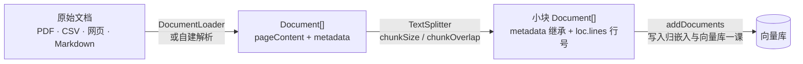

import { Canvas, Controls, Meta } from '@storybook/addon-docs/blocks';
import * as DocumentProcessing from './document-processing.stories';

<Meta of={DocumentProcessing} name="Docs" />

# 文档加载与切分

[嵌入与向量库](?path=/docs/embeddings-vector-stores--docs)一课解决了「向量怎么来、往哪存」；本课解决进入向量库**之前**的两件事：把 PDF、CSV、网页、Markdown 变成统一的 `Document`，再切成适合嵌入的小块。两个环节都不需要 API key——加载是解析文件，切分是纯文本处理。总纲一句话：**加载决定每条记录里有什么（内容与元数据），切分决定每条嵌入的边界与粒度；检索质量在写入向量库之前就已经被这两个环节决定。** 读完你应该能预测：`chunkSize` 减半后块数与断裂点怎么变、`chunkOverlap` 调大会看到什么、一份没有空行的 PDF 财报分别用两种切分器会发生什么。



关键默认值速查（均已与发布包核对：`@langchain/core@1.2.14`、`@langchain/textsplitters@1.0.2`、`@langchain/community@1.1.29`）：

| 对象 | 关键输入 | 默认值 | 回查要点 |
| --- | --- | --- | --- |
| `Document` | `pageContent` / `metadata` / `id` | — | metadata 浅拷贝继承到每个切块；检索过滤与引用定位都靠它 |
| `TextSplitter`（基类） | `chunkSize` | `1000` | 计长默认 `text.length`：字符数，不是 token 数 |
| | `chunkOverlap` | `200` | 必须**小于** `chunkSize`，否则构造时抛 `Cannot have chunkOverlap >= chunkSize` |
| | `keepSeparator` | `false` | 分隔符是否保留在下一块开头 |
| `RecursiveCharacterTextSplitter` | `separators` | `["\n\n", "\n", " ", ""]` | 逐级降级：段落 → 行 → 词 → 字符；`keepSeparator` 默认改写为 `true` |
| `TokenTextSplitter` | `encodingName` | `"gpt2"` | 按 token 计长，贴近模型上下文预算 |
| `PDFLoader` | `splitPages` | `true` | 每页一个 Document，metadata 带页码 |
| `CSVLoader` | `column` | 不指定 | 每行一个 Document；指定列则该列值作 pageContent |
| `CheerioWebBaseLoader` | `selector` | `"body"` | 静态抓取 + 解析 HTML，不依赖浏览器 |

## 快速上手

最小闭环：加载一个 Markdown 文件、切分、观察块数与 metadata。全程不需要 API key（工程基础见[安装](?path=/docs/installation--docs)一课）：

```ts
// split-demo.ts —— 加载与切分都是纯本地文本处理，不需要任何 API key
// 前置：npm i @langchain/core @langchain/textsplitters；npx tsx split-demo.ts 运行。
import { readFileSync } from 'node:fs';
import { Document } from '@langchain/core/documents';
import { RecursiveCharacterTextSplitter } from '@langchain/textsplitters';

// 1. 最朴素的加载：读文件 + 手工构造 Document（加载器帮你做的正是这件事）
const docs = [
  new Document({
    pageContent: readFileSync('./notes.md', 'utf-8'),
    metadata: { source: './notes.md' }, // 从加载阶段就带上来源
  }),
];

// 2. 切分：这里用小参数便于观察；真实默认是 chunkSize 1000 / chunkOverlap 200
const splitter = new RecursiveCharacterTextSplitter({
  chunkSize: 200,
  chunkOverlap: 40,
});
const splits = await splitter.splitDocuments(docs);

console.log(`原文 ${docs.length} 篇 → 切成 ${splits.length} 块`);
console.log(splits[0].metadata);
// { source: './notes.md', loc: { lines: { from: 1, to: … } } }
// ↑ source 是加载时写入的；loc.lines（原文行号范围）是切分器追加的
```

`Document` 进、`Document` 出，中间只有粒度变了——这就是本课的全部主线。

## Document 是什么

`@langchain/core/documents` 的 `Document` 只有三样东西（已核对 1.2.14 类型定义）：

```ts
import { Document } from '@langchain/core/documents';

const doc = new Document({
  pageContent: 'Dogs are great companions.', // 会送去嵌入的文本，永远是字符串
  metadata: { source: 'mammal-pets.md', page: 3 }, // 任意键值：不参与嵌入，但全程跟随
  id: 'doc-001', // 可选标识，建议 UUID；向量库幂等写入时有用
});
```

- **`pageContent`**：嵌入与检索的对象。切分改变的只是它的粒度。
- **`metadata`**：官方描述它能记录「文档的来源、与其他文档的关系等信息」。价值全在下游：向量库检索时按 `source` / `page` 过滤缩小范围，RAG 回答时用它定位引用。元数据不参与嵌入，是检索期的「暗线」。
- **`id`**：可选。不指定时多数向量库会自动生成 id——重复执行 `addDocuments` 会造成重复入库，需要幂等重灌时自己带稳定 id。

关键机制：**metadata 沿切分链路浅拷贝继承**。切分器把加载时的 metadata 复制到每个小块，再追加 `loc.lines`（块在原文的行号范围，来自 `createDocuments` 的实现）。所以「这个块来自哪份文件第几页」必须在加载阶段写好——切分只继承、不发明。

## 加载器

共同接口极小：1.x 的 `@langchain/core/document_loaders/base` 里 `DocumentLoader` 只声明 `load(): Promise<Document[]>`（已核对发布包类型定义）。官方集成页仍写着 `loadAndSplit()`，但那是 0.x 旧接口——1.x 全系包里已不存在，切分自己接 `splitter.splitDocuments()`。所以「加载器」的本质只有一句话：**把任意来源解析成 `Document[]`**。三条路线，按维护成本从低到高：

### 官方集成包

`@langchain/community`（1.1.29 发布包实查）分两支，覆盖常见来源，点到为止：

| 分支 | 代表 loader | 说明 |
| --- | --- | --- |
| 本地文件 `document_loaders/fs/*` | `PDFLoader`、`CSVLoader` | PDF 每页一个 Document；CSV 每行一个 |
| | `docx` / `pptx` / `epub` / `srt` / `obsidian` / `notion` 等同族 | Office 文档、字幕、笔记库 |
| 网页 `document_loaders/web/*` | `CheerioWebBaseLoader` | 静态 HTML 抓取解析，无浏览器依赖 |
| | `recursive_url` / `sitemap` 整站遍历 | 按链接规则批量抓取 |
| | `puppeteer` / `playwright` / `firecrawl` 等 | 动态页面与服务型抓取 |

三个代表性 loader 的最小用法（注意各自需要额外安装解析依赖，均为 peerDependencies）：

```ts
// PDF：每页一个 Document（splitPages 默认 true），metadata 自动带页码
// 前置：npm i @langchain/community pdf-parse
import { PDFLoader } from '@langchain/community/document_loaders/fs/pdf';
const pdfDocs = await new PDFLoader('./nke-10k-2023.pdf').load();
// 官方教程的样例文件：107 页 → 107 个 Document

// CSV：每行一个 Document；不指定 column 时 pageContent 是 "列名: 值" 逐行拼接
// 前置：npm i @langchain/community d3-dsv
import { CSVLoader } from '@langchain/community/document_loaders/fs/csv';
const csvDocs = await new CSVLoader('./reviews.csv', 'review').load(); // 只取 review 列作内容

// 网页：抓取 HTML 后解析为文本，selector 默认 "body"
// 前置：npm i @langchain/community cheerio
import { CheerioWebBaseLoader } from '@langchain/community/document_loaders/web/cheerio';
const webDocs = await new CheerioWebBaseLoader('https://example.com/docs').load();
```

### classic 通用文件加载器

`@langchain/classic/document_loaders/fs` 收着几个通用 loader：`TextLoader`（整个文件一个 Document）、`DirectoryLoader`（按扩展名映射批量加载目录）、`JSONLoader` / `JSONLinesLoader`（用 JSON pointer 定位内容字段）、`MultiFileLoader`（多个路径同一种 loader）：

```ts
// 前置：npm i @langchain/classic
import { TextLoader } from '@langchain/classic/document_loaders/fs/text';
const notes = await new TextLoader('./notes.md').load(); // 1 个文件 → 1 个 Document
```

### 自建加载

官方 knowledge-base 教程的现行做法**不是用 loader**，而是 `node:fs` + `pdf-parse` 手写十来行：解析每一页、自己构造 `Document`。什么时候值得自建：格式特殊、集成包依赖太重、或要精确控制 metadata 字段时。loader 没有任何魔法——能产出合格的 `Document[]` 就是合格的加载：

```ts
// 官方教程的加载方式（节选）：手写解析，完全掌控 metadata
// 前置：npm i pdf-parse；不需要 API key。
import { readFileSync } from 'node:fs';
import { Document } from '@langchain/core/documents';
import { PDFParse } from 'pdf-parse';

async function loadPdfPages(filePath: string): Promise<Document[]> {
  const parser = new PDFParse({ data: new Uint8Array(readFileSync(filePath)) });
  try {
    const { pages } = await parser.getText();
    return pages.map(
      (page) =>
        new Document({
          pageContent: page.text,
          metadata: { source: filePath, page: page.num - 1 },
        }),
    );
  } finally {
    await parser.destroy();
  }
}
```

## 为什么必须切分

- **语义稀释（最核心）。** 嵌入是把整段文本压缩成一条向量。一页财报三千字混着收入、风险、诉讼三个主题，得到的向量是各主题的「平均值」——问「2023 年收入」时，它反而拼不过一段只谈收入的二百字小块。块越小越专一，向量越「锋利」。
- **长度上限。** 嵌入模型有输入长度限制，LLM 侧一次能注入的检索结果也有预算（具体窗口数字归[嵌入与向量库](?path=/docs/embeddings-vector-stores--docs)一课，这里只需知道存在上限）。
- **检索粒度。** 检索命中的单位就是块。整篇命中等于没检索（还得自己找答案在哪段），小块命中才能直接喂给模型。

官方教程的数字可以做体感：107 页的 PDF 按页加载已是 107 个 Document，教程仍判断「一页太粗」——用 `chunkSize: 1000 / chunkOverlap: 200` 切分后变成 516 块，检索粒度提升约 5 倍。

## 切分器

`@langchain/textsplitters`（1.0.2 发布包导出的全部类）：

| 类 | 计长单位 | 边界 | 一句话定位 |
| --- | --- | --- | --- |
| `TextSplitter`（抽象基类） | 字符 | — | 定义 `chunkSize` / `chunkOverlap` 与合并机制 |
| `RecursiveCharacterTextSplitter` | 字符 | 四级分隔符逐级降级 | 通用文本默认之选（官方建议） |
| `CharacterTextSplitter` | 字符 | 单个分隔符（默认 `"\n\n"`） | 段落规整、无需降级的文本 |
| `TokenTextSplitter` | token（tiktoken） | — | 按模型 token 预算切分 |
| `MarkdownTextSplitter` | 字符 | Markdown 标题层级 | 结构感知切分 |
| `LatexTextSplitter` | 字符 | LaTeX 章节 | 结构感知切分 |

### RecursiveCharacterTextSplitter

算法四步（对照发布包 `_splitText` / `mergeSplits` 源码）：

1. 在 `["\n\n", "\n", " ", ""]` 中找**第一个**在文本中出现的分隔符（如命中 `"\n\n"` 就按段落切）。
2. 按它切开；`keepSeparator` 默认 `true`：分隔符留在下一块开头，块边界不丢字符。
3. 长度小于 `chunkSize` 的片段进入合并池，**相邻片段贪心合并**到不超过 `chunkSize`。
4. 仍不小于 `chunkSize` 的片段用下一级分隔符递归再切；已到字符级（`""`）就整段保留。

关键参数语义：

- **`chunkSize`（默认 1000）**：块的目标上限。计长函数默认 `text.length`——**字符数，不是 token 数**，中文一个汉字算 1。它是合并目标不是硬保证：单个无分隔符长片段可以超限（实现里会打 warning）。
- **`chunkOverlap`（默认 200）**：相邻块的重叠预算。一块落盘后，从它的尾部保留至多这么多字符带进下一块。必须小于 `chunkSize`，否则构造时直接抛错。
- **`keepSeparator`**：基类默认 `false`，递归切分器**默认改写为 `true`**（构造函数里 `?? true`）。

两个入口的差别：

```ts
const splitter = new RecursiveCharacterTextSplitter(); // 默认 1000 / 200 / 四级分隔符
const texts = await splitter.splitText(longText); // string[] —— 只切纯文本
const docs = await splitter.splitDocuments(loaded); // Document[] —— metadata 继承 + loc.lines
```

手推一个极小算例（输出已实测）。`chunkSize: 24` 时两段被**合并成一块**——这就是第 3 步的贪心合并，段落不是天然一块：

```ts
await new RecursiveCharacterTextSplitter({ chunkSize: 24, chunkOverlap: 0 })
  .splitText('第一段讲加载。\n\n第二段讲切分，句子更长一些。');
// → ['第一段讲加载。\n\n第二段讲切分，句子更长一些。']（两段合计 24 ≤ 24，合并）
```

`chunkSize` 降到 12：第一段独占一块，第二段先降到行、再降到字符级**硬切**，切点并不落在句末（中文没有空格，句号也不在默认分隔符里）：

```ts
// → ['第一段讲加载。', '第二段讲切分，句子更长', '一些。']
//    ↑ 段界（分隔符被 trim 掉）            ↑ 硬切：句中「更长｜一些」被拦腰截断
```

### CharacterTextSplitter

只认一个分隔符（默认 `"\n\n"`，可自定义），`keepSeparator` 用基类默认 `false`——分隔符直接丢弃。**不降级**：一个没有空行、长度超过 `chunkSize` 的段落会整段保留成超长块（源码行为：无更低层级可降时整块 push，合并时打 warning）。适合源文本段落规整（每段都小于 `chunkSize`），或你明确只想按某一种边界切（例如把 `separator` 设为 `'。'` 按句切）。与递归切分器的差异证据见下一节的画布：切到「单分隔符」档，432 字的长段 P4 立刻变成一块远超 `chunkSize` 的超长块。

### TokenTextSplitter 与结构化切分

`TokenTextSplitter` 用 tiktoken 编码计长，`chunkSize` / `chunkOverlap` 的单位变成 token。注意 `encodingName` 默认是 `"gpt2"`——给 OpenAI 模型预算切块时应显式指定编码：

```ts
// 不需要 API key：tokenization 是本地计算。
import { TokenTextSplitter } from '@langchain/textsplitters';

const splitter = new TokenTextSplitter({
  encodingName: 'cl100k_base', // 官方示例所用编码；按目标模型选择
  chunkSize: 512,
  chunkOverlap: 0,
});
const texts = await splitter.splitText(longText);
```

结构化文本用预置子类：`MarkdownTextSplitter`、`LatexTextSplitter` 就是换了分隔符层级的 `RecursiveCharacterTextSplitter`（Markdown 的层级从 `"\n## "` 标题开始，块边界优先落在标题处）；`RecursiveCharacterTextSplitter.fromLanguage(language, options)` 等价，且支持 16 种语言——代码按类与函数定义边界切（如 `python` 的层级从 `"\nclass "`、`"\ndef "` 开始）：

```ts
import { MarkdownTextSplitter } from '@langchain/textsplitters';
// 等价于 RecursiveCharacterTextSplitter.fromLanguage('markdown', { chunkSize: 1000 })
const splitter = new MarkdownTextSplitter();
```

## 切分参数与检索质量

三个可观察的影响方向：

- **`chunkSize` 过大 → 稀释。** 向量不专一，命中排序变差；同时 top-k 块的提示词预算被少数大块占光。
- **`chunkSize` 过小 → 断义。** 答案跨块，单块命中也读不懂；块数、存储与嵌入成本同步上升。
- **`chunkOverlap` 补边界、付重复。** 跨块句子让两块都带着断点附近的上文，代价是内容重复与总长增加。

下面的实例把同一篇 676 字、5 段的样例文档（含一个 432 字的无空行长段 P4）在不同参数组合下确定性切块：每块标注长度、起始边界类型（段界 / 行界 / 词界 / 硬切）与橙色重叠标记。切分逻辑逐行对照 `@langchain/textsplitters@1.0.2` 的 `_splitText` / `mergeSplits`，不依赖 `@langchain/*`：

<Canvas of={DocumentProcessing.Interactive} />
<Controls of={DocumentProcessing.Interactive} />

| 读者操作 | 可观察证据 |
| --- | --- |
| 保持默认（递归 120/30） | 10 块、最长 119 字；两处红色「硬切」都落在长段 P4 内部（画布实测，下同） |
| 只把 chunkSize 调到 40 | 块数升到 44、硬切升到 29——块更专一，但断义风险陡增 |
| chunkSize 调到 400 | 只剩 4 块且无硬切——大块容纳整段，代价是单块主题变杂 |
| 保持 120，chunkOverlap 从 0 调到 60 | 0 时无重叠块；60 时两处硬切块带上橙色「↩重叠 60 字」标记——跨块句子两块都保留断点附近上下文 |
| 切到「单分隔符」档 | 块数骤减为 4，P4 整块保留成 432 字超长块（红色）——不降级的代价 |
| 把 chunkOverlap 调到不小于 chunkSize | 画布显示真实报错 `Cannot have chunkOverlap >= chunkSize` |

打开 Show code 可看到该 Canvas 实际执行的 `example.ts`：核心是 `recursiveSplit` / `mergeSplits` 两个纯函数与边界分类，可在浏览器外独立核对。

中文长文本的一个实践要点（默认分隔符 `["\n\n", "\n", " ", ""]` 没有句末标点，中文又没有空格，降级常直落到字符级）：把句读符加入层级能让块边界更贴句界，例如 `separators: ["\n\n", "\n", "。", "！", "？", "；", "，", " "]`。

## 衔接向量库

切分产物直接就是向量库的写入单位——官方教程的衔接只有一行：

```ts
// 运行条件：vectorStore 已按「嵌入与向量库」一课初始化（写入需要 OPENAI_API_KEY）。
import { RecursiveCharacterTextSplitter } from '@langchain/textsplitters';

const allSplits = await new RecursiveCharacterTextSplitter({
  chunkSize: 1000,
  chunkOverlap: 200,
}).splitDocuments(docs);

await vectorStore.addDocuments(allSplits); // 教程原样：107 页 → 516 块 → 一次入库
```

三件衔接事项：

- **metadata 此时定型。** 入库后再想加过滤字段就得重新加载、切分、嵌入整个库——这正是「加载阶段写全 metadata」的原因。
- **id 与幂等。** `Document.id` 可选；不指定时多数向量库自动生成 id，重复 `addDocuments` 会重复入库，幂等重灌自己带稳定 id。
- **粒度即检索粒度。** `asRetriever`、检索注入与带引用回答归 [RAG](?path=/docs/rag--docs)一课。

## 最佳实践

- **从默认起步再调参。** 官方建议：多数场景从 `RecursiveCharacterTextSplitter`（1000 / 200）开始，它在「保持上下文完整」与「控制块大小」之间已是良好平衡，检索表现不佳时再针对性调整。
- **chunkSize 对齐自足语义单元。** 常见几百到一千字符；判断标准是「单块命中后能否独立读懂」，而不是「模型窗口还剩多少」。
- **chunkOverlap 常用 chunkSize 的 10%–20%。** 默认 200/1000 即 20%；必须严格小于 chunkSize。
- **加载阶段写全 metadata。** `source` / `page` / 章节字段决定检索期能否过滤、回答期能否引用；事后补的成本是重灌整个库。
- **结构规整的文本用对应结构切分器。** Markdown 用 `MarkdownTextSplitter`，代码用 `fromLanguage`，中文长文本考虑把句读符加入分隔符层级。
- **loader 缺失就自建。** 官方教程即范例；产出合格的 `Document[]` 就是合格的加载，不必为找集成包消耗时间。

## 常见问题

- **构造切分器时抛 `Cannot have chunkOverlap >= chunkSize`。**
  真实包的硬校验，等于也不行。把 `chunkOverlap` 调到严格小于 `chunkSize`；想完全不重叠就显式传 `chunkOverlap: 0`。
- **切完仍有远超 chunkSize 的块。**
  多半在用 `CharacterTextSplitter`（或自定义单分隔符）：超过上限且不含分隔符的长片段不会降级、整块保留。换 `RecursiveCharacterTextSplitter` 即可逐级降级；上一节画布切到「单分隔符」档可直接看到这个现象。
- **中文切分边界总落在句子中间。**
  默认分隔符是 `["\n\n", "\n", " ", ""]`：中文没有空格、句号不在层级里，降级常直落到字符级硬切。把句末标点加入层级，如 `separators: ["\n\n", "\n", "。", "！", "？", "；", "，", " "]`，块边界会更贴句界。
- **块数比预期少，好几段被并成一块。**
  合并机制所致：相邻片段只要合计不超过 `chunkSize` 就会贪心合并，`chunkSize` 是目标上限而非每块必达。想细分就调小 `chunkSize`，或用 `splitText` 拿到文本后自己组装。
- **`splitDocuments` 之后 metadata 里多了 `loc`，是什么？**
  切分器给每块追加的原文行号范围（`loc.lines.from` / `loc.lines.to`），与加载阶段的 `source` / `page` 配合可把命中块定位回原文，做引用展示很有用。此外 `splitDocuments` 还接受可选的 `chunkHeaderOptions`（如 `appendChunkOverlapHeader` 会在续块前加 `"(cont'd) "` 前缀）。
- **调用 `loader.loadAndSplit()` 报 not a function。**
  1.x 的 `BaseDocumentLoader` 只有 `load()`（已核对 `@langchain/core` 发布包）；`loadAndSplit` 是 0.x 接口。改为 `const docs = await loader.load()` 之后自己调 `splitter.splitDocuments(docs)`。
- **需要按 token 而不是字符控制块大小。**
  用 `TokenTextSplitter`，`chunkSize` / `chunkOverlap` 单位即 token；记得显式传 `encodingName`（默认 `"gpt2"` 多半不是你想要的）。

## 总结回顾

摘要：

本课覆盖进入向量库之前的两个环节。加载把 PDF、CSV、网页等来源统一成 `Document`（`pageContent` 文本、`metadata` 元数据、可选 `id`），三条路线：`@langchain/community` 的文件与网页 loader、`@langchain/classic` 的通用文件 loader、以及官方教程现行的 `node:fs` + `pdf-parse` 自建——本质都只是产出 `Document[]`，1.x 公共接口只有 `load()`。切分把长文档拆成可嵌入的小块，动机是语义稀释、长度上限与检索粒度。`@langchain/textsplitters` 家族里，`RecursiveCharacterTextSplitter` 是默认之选：四级分隔符 `["\n\n", "\n", " ", ""]` 逐级降级，`chunkSize`（默认 1000，按字符计）与 `chunkOverlap`（默认 200，须小于前者）控制块形态，`keepSeparator` 默认 `true`；`CharacterTextSplitter` 单分隔符不降级，长段整块保留；`TokenTextSplitter` 按 token 计长（`encodingName` 默认 `"gpt2"`）；`MarkdownTextSplitter` / `fromLanguage` 做结构感知。参数影响可用确定性实验观察：块小则专一但硬切增多，块大则稀释，重叠补边界但付重复。切分产物经 `vectorStore.addDocuments(allSplits)` 入库，metadata 在此定型，检索与引用质量都由此决定。

一句话：

> 检索质量在写入向量库之前就已决定：加载决定 Document 里有什么内容与元数据，切分决定每条嵌入的边界与粒度——块要对齐自足的语义单元，而不是模型的窗口上限。

知识要点：

- `Document` 有哪三个字段？metadata 在检索链路里的两个下游价值是什么？
- 1.x 加载器的公共接口是什么？官方教程现在用什么方式加载 PDF？
- 为什么整篇文档不能直接嵌入？切分解决哪三个问题？
- `RecursiveCharacterTextSplitter` 的默认 `chunkSize` / `chunkOverlap` / `separators` 各是多少？`keepSeparator` 与基类默认有何不同？
- 递归降级的顺序是什么？什么情况下会发生字符级硬切？
- `chunkSize` 的计长单位是什么？「相邻小段被合并成一块」是哪个机制造成的？
- `chunkOverlap` 的语义与约束是什么？违反时会发生什么？
- `CharacterTextSplitter` 遇到超长段落的行为与递归切分器有何不同？
- 什么时候用 `TokenTextSplitter`？它的默认 `encodingName` 是什么、为什么通常要显式指定？
- 切分后的 Document 与加载时相比，metadata 多了什么？
- 切分产物如何进入向量库？想按来源过滤检索，字段应该在哪一步准备？

## 参考资料

- [Document loaders（LangChain.js 官方集成文档：加载器家族与共同接口）](https://docs.langchain.com/oss/javascript/integrations/document_loaders/index)
- [Text splitters（LangChain.js 官方集成文档：切分策略分类与选型建议）](https://docs.langchain.com/oss/javascript/integrations/splitters/index)
- [Build a semantic search engine（LangChain.js 官方教程：加载、切分、入库的完整实践）](https://docs.langchain.com/oss/javascript/langchain/knowledge-base)
- [langchainjs 仓库 @langchain/textsplitters 源码（默认值与切分算法核对）](https://github.com/langchain-ai/langchainjs/tree/main/libs/langchain-textsplitters)
- [JS API 参考（Document 与 BaseDocumentLoader 类型回查）](https://reference.langchain.com/)
