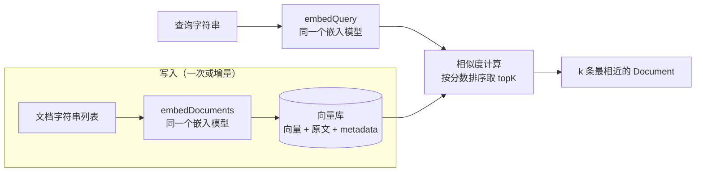

import { Canvas, Controls, Meta } from '@storybook/addon-docs/blocks';
import * as EmbeddingsVectorStores from './embeddings-vector-stores.stories';

<Meta of={EmbeddingsVectorStores} name="Docs" />

# 嵌入与向量库

上一课把跨 thread 的记忆存进了 Store；当要检索的东西从「几十条记忆」变成「成百上千段文本」时，让模型逐条比对就撑不住了。检索侧有一套专门的基石：**嵌入（embeddings）把文本变成定长向量，让「语义相近」变成「几何相近」；向量库（vector store）把这些向量存起来，把查询向量送到最近的文档处，按相似度排序取回前 k 条**。两者通过统一接口解耦：嵌入模型决定「语义怎么变成几何」，向量库只负责「存向量、算相似度、取 topK」。读完你应该能预测：换一个嵌入模型会破坏什么、`similaritySearch` 的 k 和分数怎么读、以及为什么把 `MemoryVectorStore` 换成 Pinecone 不需要动业务逻辑。



| 关键输入 | 默认 / 取值 | 回查要点 |
| --- | --- | --- |
| `OpenAIEmbeddings` 的 `model` | 不传时默认 `text-embedding-ada-002`（上一代） | 显式传 `text-embedding-3-small`（1536 维）或 `text-embedding-3-large`（3072 维） |
| `dimensions` | 不传 = 模型原生维度 | 仅 text-embedding-3 系列支持；直接产出降维后的向量 |
| `batchSize` | 512（上限 2048） | `embedDocuments` 每次请求打包的文本数 |
| `stripNewLines` | `true` | 嵌入前移除文本中的换行 |
| `apiKey` | `process.env.OPENAI_API_KEY` | dotenv 加载 `.env` 后自动读取 |
| `embedQuery(text)` | 返回 `number[]` | 查询侧入口：单条文本 → 一个向量 |
| `embedDocuments(texts)` | 返回 `number[][]` | 写入侧入口：一批文本 → 向量数组 |
| `similaritySearch(query, k)` | `k` 建议显式传 | 返回 k 条 `Document`，不带分数 |
| `similaritySearchWithScore(query, k)` | 同上 | 返回 `[Document, score][]`；分数方向由实现决定 |
| MemoryVectorStore 的分数 | 余弦相似度，降序 | 越大越相似（上限 1）；不少实现返回距离，方向相反 |

## 快速上手

最小闭环是「字符串列表建库 → 语义检索」两步。注意真实的运行条件：`MemoryVectorStore` 本身只住在进程内存里，但写入和查询都要真的调 OpenAI 的嵌入接口——所以需要 `OPENAI_API_KEY`：

```ts
// semantic-search.ts —— OpenAIEmbeddings + MemoryVectorStore：写入与相似度检索。
// 运行条件：npm i @langchain/openai @langchain/core @langchain/classic dotenv；
// 项目根目录 .env 写入 OPENAI_API_KEY=sk-...；npx tsx semantic-search.ts。
import 'dotenv/config';
import { OpenAIEmbeddings } from '@langchain/openai';
import { MemoryVectorStore } from '@langchain/classic/vectorstores/memory';

// 显式传 model：不传时包内默认回落到上一代 ada-002
const embeddings = new OpenAIEmbeddings({ model: 'text-embedding-3-small' });

// fromTexts：字符串列表一步建库（内部逐条嵌入后写入）
const vectorStore = await MemoryVectorStore.fromTexts(
  [
    '猫是常见的家庭宠物，性格独立安静。',
    '狗需要每天遛弯和社交，精力旺盛。',
    'Transformer 是当前大语言模型的主流架构。',
    '红酒炖牛肉是一道经典的法式家常菜。',
  ],
  {},                        // 每条文本的 metadata，先给空对象占位
  embeddings,
);

// 相似度检索：查询里没出现「猫」，也没出现任何文档原词
const hits = await vectorStore.similaritySearch('哪种动物适合陪伴且不用天天遛', 2);
console.log(hits.map((doc) => doc.pageContent));
// [ '猫是常见的家庭宠物，性格独立安静。', '狗需要每天遛弯和社交，精力旺盛。' ]
```

查询与「猫」没有共同关键词，猫却排在了第一：匹配发生在向量空间里，不是字符串匹配。下面拆开这条链的两端。

## 嵌入

嵌入模型把任意长度的文本映射成一个**定长向量**——`text-embedding-3-small` 是 1536 个浮点数，`text-embedding-3-large` 是 3072 个。训练目标保证：**语义相近的文本，向量在几何上也相近**。于是「这两段文本像不像」这个语义问题，被换成「这两个向量离得近不近」这个几何问题，可以用 cosine 相似度、欧氏距离或点积直接计算（官方文档列的就是这三种度量）。

用二维向量手算一遍最直观（真实维度是 1536/3072，这里降到 2 维便于验算）：

```text
apple  → [0.90, 0.10]      banana → [0.85, 0.20]      car → [0.10, 0.90]

cos(apple, banana) = (0.90×0.85 + 0.10×0.20) / (|apple|×|banana|) ≈ 0.99   语义近
cos(apple, car)    = (0.90×0.10 + 0.10×0.90) / (|apple|×|car|)    ≈ 0.22   语义远
```

三个推论，构成后面所有用法的前提：

- **相似度即距离。** 检索就是在向量库里找「与查询向量夹角最小（cosine 最大）的 k 个文档」。分数的具体含义见后文「相似度分数」。
- **坐标系是模型私有的。** 每个嵌入模型有自己的一套空间；**写入和查询必须用同一个模型（含同样的 `dimensions`）**，两个不同模型的向量放进同一个距离计算里没有意义。
- **换模型 = 换坐标系。** 升级嵌入模型后，旧文档的向量全部作废，必须全量重新嵌入、重建索引；新旧向量混在一个库里，检索结果会静默地乱掉。

顺带一条边界：官方明确当前嵌入是**纯文本**的，不支持多模态（图片等）嵌入。

## OpenAIEmbeddings

`@langchain/openai` 的 `OpenAIEmbeddings` 是 JS 主线的默认选择（`npm i @langchain/openai`），实现 langchain-core 的 `Embeddings` 标准接口——全手册通用的两个方法：`embedQuery`（查询侧，单条 → `number[]`）和 `embedDocuments`（写入侧，一批 → `number[][]`）。直接调一次，看清向量长什么样：

```ts
// embed-basics.ts —— 直接调用嵌入接口，观察向量的形态与维度。
// 运行条件：同快速上手（@langchain/openai + dotenv + OPENAI_API_KEY）。
import 'dotenv/config';
import { OpenAIEmbeddings } from '@langchain/openai';

const embeddings = new OpenAIEmbeddings({ model: 'text-embedding-3-small' });

const queryVector = await embeddings.embedQuery('什么是语义检索');
const docVectors = await embeddings.embedDocuments([
  '向量库按相似度检索文本。',
  'Redis 是一种内存数据库。',
]);

console.log(queryVector.length);   // 1536 —— 维度由模型决定
console.log(docVectors.length);    // 2    —— 一条文本一个向量
console.log(docVectors[0][0]);    // 形如 -0.0132 的小数，具体值随文本变化
```

配置项与选择（默认值见开场参考表）：

- **模型选择**：`text-embedding-3-small` 便宜、1536 维，原型和中小语料的首选；`text-embedding-3-large` 3072 维，检索质量更好、成本更高。**不传 `model` 时包内默认是上一代 `text-embedding-ada-002`**——建议永远显式写。
- **维度缩减**：text-embedding-3 系列支持 `dimensions`，让 API 直接输出更短的向量，换取更低的存储和检索成本：

  ```ts
  // 3072 维的 large，按需压到 1024 维存储
  const embeddings1024 = new OpenAIEmbeddings({
    model: 'text-embedding-3-large',
    dimensions: 1024,
  });
  ```

  注意缩减维度后，查询侧必须传同样的 `dimensions`——回到「同模型原则」。
- **批量**：`embedDocuments` 按 `batchSize`（默认 512，上限 2048）把文本打包成多次请求；大批量写入时调大它可以减少请求次数。
- **重复语料缓存**：同一批文档反复嵌入既慢又费钱，官方提供 `CacheBackedEmbeddings.fromBytesStore` 把向量缓存进一个 Store；`namespace` 必须设（如用模型名），查询向量默认不缓存，除非额外传 `query_embedding_store`。

多数时候你不需要手动调这两个方法——向量库和检索器在内部会自动调用它们（写入时调 `embedDocuments`，查询时调 `embedQuery`）。手动调的场景：检查向量维度、缓存查询向量、或在自建检索逻辑里直接算相似度。

提供方差异不显著时无须在意：换成 Gemini 只是把实例换成 `@langchain/google-genai` 的 `GoogleGenerativeAIEmbeddings`（模型如 `gemini-embedding-001`），`embedQuery` / `embedDocuments` 接口不变——这正是标准接口的意义。略有差别的一点：部分提供方（如 Cohere）对「查询」和「待检索文档」做不同的嵌入处理，所以保持两个入口各司其职，别手动互换着调。

## 向量库接口

向量库解决「向量 + 原文 + metadata 存在哪、怎么搜」。官方为它定义了统一接口，核心是三件事——**写入、相似度检索、转检索器**——换来一个关键性质：**换向量库实现，不改应用逻辑**（原话：switch between different implementations without altering your application logic）。

| 方法 | 职责 |
| --- | --- |
| `addDocuments(docs)` | 写入：内部调 `embedDocuments`，把向量连同原文、metadata 一起存 |
| `similaritySearch(query, k, filter?)` | 检索：返回与查询最相近的 k 条 `Document`，不带分数 |
| `similaritySearchWithScore(query, k, filter?)` | 检索 + 分数：返回 `[Document, score][]`，已按分数排好 |
| `similaritySearchVectorWithScore(vector, k, filter?)` | 按现成向量检索：跳过 `embedQuery`，适合缓存过查询向量 |
| `delete(params)` | 按条件删除已存条目 |
| `asRetriever(k \| options)` | 包装成检索器（Runnable），获得 `invoke` / `batch` |

```ts
// 写入：addDocuments 收 Document 对象；纯字符串场景用快速上手的 fromTexts 更省事。
// Document 的完整结构（pageContent / metadata / id）、加载与切分归[文档加载与切分](?path=/docs/document-processing--docs)一课。
import { Document } from '@langchain/core/documents';
await vectorStore.addDocuments([
  new Document({
    pageContent: '低温慢煮能保留食材的原汁原味。',
    metadata: { source: 'kitchen' },   // metadata 随向量一起存，检索时原样带回
  }),
]);

// 复用查询向量：先 embedQuery，再按向量检索
const queryVector = await embeddings.embedQuery('怎么做饭更好吃');
const scored = await vectorStore.similaritySearchVectorWithScore(queryVector, 3);

// 转检索器：向量库本身不是 Runnable，asRetriever 之后才能 invoke / batch
const retriever = vectorStore.asRetriever(2);
const docs = await retriever.invoke('大模型的主流架构是什么');
// 也可传选项对象：asRetriever({ searchType: 'mmr', searchKwargs: { fetchK: 4 } })
```

`asRetriever` 是本课的出口：检索器直接给 Agent 或链提供上下文，「检索 → 注入 → 带引用回答」的 RAG 闭环归 [RAG](?path=/docs/rag--docs) 一课。另外，上一课在 Store 语义检索配置里见过的 `index` / `embed` 参数，底层调的就是本课这批嵌入模型——机制在这里，用法留在那一课。

### MemoryVectorStore

`@langchain/classic/vectorstores/memory`（`npm i @langchain/classic`）是官方的进程内向量库，零部署，也是原型、测试和教学的首选。它的行为细节都来自源码：

- **相似度与排序**：默认算 **cosine 相似度**，按分数**降序**返回——越大越相似，上限 1。构造器第二个参数可以换相似度函数（签名 `similarity?: typeof cosine`）。
- **三个静态构造器**：`fromTexts(texts, metadatas, embeddings)`（字符串列表直接建库）、`fromDocuments(docs, embeddings)`、`fromExistingIndex(embeddings)`（复用已有实例的底层结构）。
- **filter 是函数不是对象**：类型为 `(doc: Document) => boolean`，在相似度计算**之前**先过滤候选（官方总览页的对象式 filter 示例不适用于它，详见常见问题）。
- **边界**：纯内存、不持久化，进程退出即丢；检索是对全量向量逐个算相似度，没有 ANN 索引。语料大到需要 HNSW 这类索引、或需要跨进程共享时，换生产向量库。

## 相似度分数

`similaritySearch` 与 `similaritySearchWithScore` 的区别只在一件事：**分数**。而读分数之前必须先回答「方向」——这是最容易踩的坑：

- **分数语义由向量库实现决定。** MemoryVectorStore 返回**余弦相似度，越大越相似**；但官方同时列出了 cosine / 欧氏距离 / 点积三种度量，不少实现返回的是**距离——越小越相似**（还有的实现允许配置，如 Oracle 的 `distanceStrategy`）。换库时第一件事是查这个库的分数语义，最可靠的自查方式：拿一组明显相关、明显无关的文本各查一次，看分数往哪边走。
- **`k`（topK）控制返回条数**，按分数从高到低截断。k 太小漏掉相关文档，k 太大把不相关的也塞进上下文——按下注入上下文后的效果调整。
- **filter 在打分前过滤候选**，官方明确警告：基于 metadata 的过滤支持程度**因实现而异**，换库时把 filter 当作需要重写的部分逐一核对。

下面的画布把「排序 + 分数 + topK」的机制摊开（用预置相似度矩阵确定性模拟，非真实嵌入）：

<Canvas of={EmbeddingsVectorStores.Interactive} />
<Controls of={EmbeddingsVectorStores.Interactive} />

| 读者操作 | 可观察证据 |
| --- | --- |
| 切换「查询词」 | 六条文档整体重排，分数条长度随之变化——换查询就是换「谁离得近」 |
| 切到「量子纠错（无关）」 | 排序照样产生（总有第一名），但第一名分数只剩 0.11——**分数绝对值本身就是相关性信号**，不要只看相对排序 |
| 调「topK」 | 高亮行数变化，落在 topK 之外的行变灰并标注「topK 外」——`k` 是检索结果的截断位置 |
| 底部读数 | 第一名的编号与分数、返回条数随参数同步更新 |
| 打开 Show code | 看到该 Canvas 实际执行的 `example.ts`：预置相似度矩阵的确定性模拟，不依赖 `@langchain/*` |

## 生产向量库选型

官方 JS 集成清单覆盖十余种向量库，按下载数量级排：Weaviate、Pinecone、Qdrant、MongoDBAtlasVectorSearch、RedisVectorStore、OracleVS、PGVectorStore、Cloudflare vectorize、Turbopuffer、Neo4jVectorStore、Google Cloud SQL for PostgreSQL、SAP HANA Cloud Vector Engine 等；MemoryVectorStore 内置在 classic 包里、不单独发集成。完整清单和各家安装命令见文末官方总览页。

选择判据点到为止（本手册不含向量数据库运维）：

| 已有条件 / 需求 | 顺手的选择 |
| --- | --- |
| 只在原型、测试、单进程小语料里用 | MemoryVectorStore，零部署 |
| 不想自己运维任何基础设施 | 托管服务：Pinecone、Turbopuffer |
| 已经用 Postgres / Mongo / Redis | 对应的 PGVectorStore / MongoDBAtlasVectorSearch / RedisVectorStore，不引入新存储 |
| 自托管 + 开源生态 | Qdrant、Weaviate |

无论选哪个，写入与检索走的是同一套 `addDocuments` / `similaritySearch` 接口，分数语义和 filter 支持是换库时仅有的两个必须重新核对的点——这也是官方把接口抽象出来的目的。

## 最佳实践

- 嵌入模型与维度一次定死：同一个库里所有向量必须来自**同一个模型加同一份参数**；要换模型（或改 `dimensions`），就全量重嵌入重建索引，绝不与旧向量混存。
- 从 `text-embedding-3-small` 起步：原型和中小语料足够且便宜；检索质量不够再升 `text-embedding-3-large`，或用 `dimensions` 降维换存储成本——降维后查询侧同步改参数。
- 业务代码依赖检索器而不是向量库类：在组装层调 `asRetriever()`，下游只面向 Retriever 接口；日后换库只改初始化一处。
- 大批量写入前算一次成本：`embedDocuments` 按 `batchSize`（默认 512）分批；重复嵌入同一语料（CI 里反复建索引）加 `CacheBackedEmbeddings` 缓存。

## 常见问题

- 分数是越高越相似，还是越低越相似？
  先查当前库的语义再下判断：MemoryVectorStore 返回余弦相似度（越大越相似），但官方列的三种度量里不少实现返回距离（越小越相似）。最可靠的自查：对同一批数据拿明显相关、明显无关的查询各跑一次 `similaritySearchWithScore`，看分数往哪边走。
- 照官方文档给 `similaritySearch` 传对象式 filter（如 `{ source: 'tweets' }`），MemoryVectorStore 里不生效或类型报错？
  官方总览页的示例是通用形态；MemoryVectorStore 的 `filter` 实际是 `(doc: Document) => boolean` **函数**，在打分前逐条过滤。各家 filter 形态差异很大，换库时逐一核对。
- 换了嵌入模型（或改了 `dimensions`）后检索结果明显变乱 / 维度不匹配报错？
  根因是坐标系变了：不同模型、不同维度的向量互相不可比。同一个库必须全部来自同一模型同一参数；换模型就全量重嵌入重建，混存的结果错乱往往不报错、只会静默变差。
- 服务重启后 MemoryVectorStore 里什么都查不到？
  设计行为：纯内存、不持久化。要么启动时重建（`fromTexts` / `addDocuments`），要么按「生产向量库选型」换持久化实现。
- `embedQuery` 和 `embedDocuments` 能不能混着用？
  接口上都返回向量，但别混：`embedQuery` 是查询侧单条入口，`embedDocuments` 是写入侧批量入口（走 `batchSize` 分批）；部分提供方（如 Cohere）对两端做不同嵌入处理。让向量库在内部自动调对应的方法，手动调用只用于检查维度、缓存向量这类明确场景。

## 总结回顾

摘要：

嵌入把文本映射成定长向量，把「语义相近」变成「几何相近」，相似度用 cosine / 欧氏 / 点积计算；坐标系是模型私有的，写入与查询必须共用同一个模型和维度，换模型等于换坐标系、必须全量重嵌入。`OpenAIEmbeddings` 实现标准 `Embeddings` 接口：`embedQuery` 管查询侧、`embedDocuments` 管写入侧（按 `batchSize` 分批），不传 `model` 会回落到上一代 ada-002；3 系列支持 `dimensions` 降维，重复语料可用 `CacheBackedEmbeddings` 缓存。向量库走统一接口：`addDocuments` 写入、`similaritySearch` / `similaritySearchWithScore` / `similaritySearchVectorWithScore` 检索、`asRetriever` 转检索器接 RAG、`delete` 删除，换实现不改业务逻辑。MemoryVectorStore 零部署、余弦相似度降序（越大越相似）、filter 是函数、不持久化；分数方向和 filter 支持是实现相关的，是换库时仅有的两个必查点；生产按托管、已有存储、自托管三类选型。

一句话：

> 嵌入模型把语义变成几何，向量库只是在这套几何里取最近的 k 个——换嵌入模型是换坐标系（必须全量重嵌入），换向量库只是换存储与计算（接口不变）。

知识要点：

- 嵌入是什么？为什么说「相似度即距离」？官方列出哪三种相似度度量？
- 为什么写入和查询必须用同一个嵌入模型和同一份维度参数？换模型后旧向量怎么办？
- `embedQuery` 和 `embedDocuments` 各自的输入输出与分工？谁在自动调用它们？
- 不给 `OpenAIEmbeddings` 传 `model` 会发生什么？`dimensions` 和 `batchSize` 各控制什么？
- 向量库标准接口有哪几个方法？`asRetriever` 解决什么问题？
- MemoryVectorStore 的分数是什么方向？它的 `filter` 参数是什么形态？
- topK 截断发生在哪里？查询与语料无关时，排序和分数各表现出什么？
- 换一个向量库时，哪两个点必须重新核对？

## 参考资料

- [OpenAIEmbeddings 集成（官方：模型、dimensions 降维、batchSize、embedQuery / embedDocuments、MemoryVectorStore 配合示例）](https://docs.langchain.com/oss/javascript/integrations/embeddings/openai)
- [Vector store 集成总览（官方：统一接口、k 与 filter、相似度度量、生产向量库集成清单）](https://docs.langchain.com/oss/javascript/integrations/vectorstores/index)
- [Build a semantic search engine（官方教程：fromTexts 建库、similaritySearchWithScore、asRetriever）](https://docs.langchain.com/oss/javascript/langchain/knowledge-base)
- [Embedding model 集成索引（官方：Embeddings 标准接口、提供方清单、CacheBackedEmbeddings、纯文本边界）](https://docs.langchain.com/oss/javascript/integrations/embeddings/index)
- [MemoryVectorStore 源码（余弦相似度降序、filter 函数形态、fromTexts / fromDocuments 构造器）](https://github.com/langchain-ai/langchainjs/blob/main/libs/providers/langchain-classic/src/vectorstores/memory.ts)
- [OpenAIEmbeddings 源码（默认 model / batchSize / stripNewLines）](https://github.com/langchain-ai/langchainjs/blob/main/libs/providers/langchain-openai/src/embeddings.ts)
