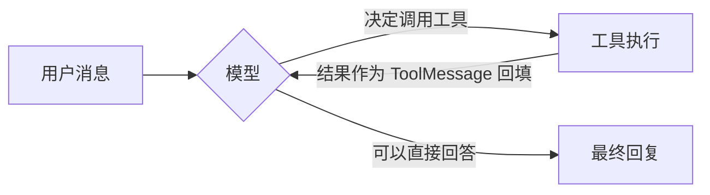

import { Canvas, Controls, Meta } from '@storybook/addon-docs/blocks';
import * as FirstAgent from './first-agent.stories';

<Meta of={FirstAgent} name="Docs" />

# 第一个 Agent

本课用 `createAgent` 把模型、系统提示和一个查天气的工具组装成一个 Agent，再用 `invoke` 与 `stream` 跑通它。Agent 与直接调模型的差别只有一件事：模型在一个循环里反复「决定调用工具 → 拿到工具结果」，直到它能给出最终回答；循环之外的一切——系统提示、工具清单、工具的执行与结果回填——由 `createAgent` 搭好的运行环境负责。读完本课，你应该能预测：换一个不需要工具的问题、多挂一个工具、或把 `invoke` 换成 `stream` 时，分别会发生什么。



| 关键输入 | 形式 | 回查要点 |
| --- | --- | --- |
| `model` | `"provider:model"` 字符串或模型实例，必填 | 实例形式最直观：`new ChatOpenAI({ model })` |
| `tools` | `tool()` 数组，可选 | 不传就没有工具，Agent 退化为带系统提示的纯对话 |
| `systemPrompt` | 字符串或 `SystemMessage`，可选 | 交代角色与工具使用规则 |
| `agent.invoke` | 返回最终 state 的 Promise | `result.messages` 是全量消息历史，最后一条是答案 |
| `agent.stream` | 返回可读流的 Promise | 每个条目是一个节点跑完后的全量状态快照 |

## 快速上手

沿用「安装」一课的工程（依赖 `langchain`、`@langchain/openai`、`zod`、`dotenv`），在 `.env` 里配置 `OPENAI_API_KEY`，把下面的代码存成 `weather.ts`，用 `npx tsx weather.ts` 运行：

```ts
// weather.ts —— 最小可运行的天气 Agent
// 运行条件：OPENAI_API_KEY 已写入 .env；npx tsx weather.ts 运行。
import 'dotenv/config';
import * as z from 'zod';
import { ChatOpenAI } from '@langchain/openai';
import { createAgent, tool } from 'langchain';

// 1. 定义工具：模型只靠 name、description、schema 判断何时调用它
const getWeather = tool(
  ({ city }: { city: string }) => `It's always sunny in ${city}!`,
  {
    name: 'get_weather',
    description: 'Get the weather for a given city',
    schema: z.object({
      city: z.string().describe('The city to get the weather for'),
    }),
  }
);

// 2. 组装 Agent：模型 + 工具 + 系统提示
const agent = createAgent({
  model: new ChatOpenAI({ model: 'gpt-4o-mini' }),
  tools: [getWeather],
  systemPrompt:
    'You are a weather assistant. Use get_weather for any current weather question.',
});

// 3. 运行并消费结果
async function main() {
  const result = await agent.invoke({
    messages: [{ role: 'user', content: "What's the weather in San Francisco?" }],
  });

  console.log(result.messages.at(-1)?.content);
  // => The weather in San Francisco is sunny! ...（措辞因模型而异）
}

main();
```

`ChatOpenAI` 默认读取环境变量 `OPENAI_API_KEY`，所以 `import 'dotenv/config'` 要写在文件最前面。这 30 行就是 Agent 的最小闭环：三行组装、一次调用。值得注意的是，代码里没有任何一行显式调用 `getWeather`——它是被模型决定调用的。

## Agent 是什么

官方的定义很直接：Agent 是模型在循环中调用工具，直到任务完成。模型本身只会生成文本和「工具调用请求」，它不知道今天的天气，也不能自己执行函数；把工具真正跑起来、把结果作为新消息回填给模型的，是 `createAgent` 搭好的运行环境（系统提示、工具清单、中间件等循环之外的部分）。这就是需要 Agent 而不是裸调模型的原因：工具补上模型没有的实时信息，循环让「模型决定 → 环境执行 → 结果回填」自动跑到能回答为止。

一次带工具的回答，循环是这样转的：

1. 模型收到 messages 和工具清单，判断需要外部信息；
2. 模型产出一条带 `tool_calls` 的 AIMessage，`content` 通常为空；
3. 运行环境执行对应工具，把返回值包成 ToolMessage 追加进 messages；
4. 模型再次被调用，看到工具结果，决定继续调用工具还是给出最终回答。

关键判断：调不调工具、传什么参数，由模型根据工具的 `name`、`description`、`schema` 决定，你的代码里没有也不需要调用工具的分支逻辑。

### 消息如何流动

真实运行一次后，`console.log(result.messages)` 看到的顺序就是上面的循环留下的痕迹。下面的实例用确定性模拟数据画出这条消息流（消息类名与 `type` 字段对齐 `@langchain/core` 的真实形态，不发起真实模型调用）：

<Canvas of={FirstAgent.Interactive} />
<Controls of={FirstAgent.Interactive} />

| 读者操作 | 可观察证据 |
| --- | --- |
| 切换「输入问题」为日常闲聊 | 消息数停在 2、「调用工具」变为 —：不需要外部信息的问题不产生工具回合 |
| 拖动「回放步骤」从 1 到 4 | 消息按 HumanMessage → AIMessage → ToolMessage → AIMessage 逐条追加，这正是 messages 数组的追加式结构 |
| 打开 Show code | 看到该 Canvas 实际执行的 `example.ts`：纯 TS 确定性模拟，不依赖 `@langchain/*` |

## 组装 createAgent

快速上手里已经见过三个最小要素：`model`、`tools`、`systemPrompt`。三者分别回答「谁来决策」「能做什么」「按什么规则做」，都是可选组合——只传 `model` 也能得到一个带默认行为的对话 Agent。

### model：实例或字符串

```ts
// 形式一：模型实例，最常用（构造参数细节见「模型与消息」一课）
import { ChatOpenAI } from '@langchain/openai';

const model = new ChatOpenAI({ model: 'gpt-4o-mini' });

// 形式二：字符串 "provider:model"，运行时按提供方解析，
// 需要已安装对应集成包（这里是 @langchain/openai）。
// createAgent 与 getWeather 沿用快速上手里的导入和定义。
const agent2 = createAgent({ model: 'openai:gpt-4o-mini', tools: [getWeather] });
```

两种形式等价，实例形式便于显式传参与复用；字符串形式便于切换提供方。模型必须支持 tool calling（主流聊天模型都支持），否则工具形同虚设。Gemini 对照：`@langchain/google-genai` 的 `ChatGoogleGenerativeAI`，或字符串 `'google:gemini-2.5-flash-lite'`，写法只差实例来源。

### tools：定义与挂载

`tool()` 接收两样东西：执行函数和描述对象。执行函数可以是异步的，参数对象先按 `schema` 校验再注入；返回值（字符串或结构化内容）会成为 ToolMessage 的内容回填给模型。描述对象的三个字段都是写给模型看的：

| 字段 | 作用 | 要点 |
| --- | --- | --- |
| `name` | 模型引用工具的标识 | 用 snake_case，语义直白 |
| `description` | 模型决定「用不用」的主要依据 | 写清何时该用，而不只是它是什么 |
| `schema` | 参数形状与参数说明（zod） | 字段上的 `.describe()` 文案同样会发给模型 |

挂载就是把工具放进 `tools` 数组，`createAgent` 会自动把清单发给模型并在循环中执行。工具错误处理、依赖运行上下文（context）的工具等深入用法归「工具」一课。

### systemPrompt：工作规则

静态规则直接给字符串，它会作为系统消息进入对话开头。快速上手的例句只做一件事：告诉模型遇到实时天气问题必须用工具，而不是凭训练记忆编一个答案。两个边界：按运行状态动态生成提示需要 middleware（归「中间件」一课）；`SystemMessage` 实例形式用于需要多内容块等高级场景，本课不展开。

`createAgent` 其余参数各管一件事，本课只在用到处展开：

| 参数 | 一句话用途 | 深入 |
| --- | --- | --- |
| `checkpointer` | 持久化消息历史，配合 `thread_id` 实现多轮对话 | 「短期记忆」 |
| `responseFormat` | 用 zod schema 约束最终输出，结果落在 `result.structuredResponse` | 「结构化输出」 |
| `middleware` | 在模型调用前后拦截改写（护栏、摘要、动态提示） | 「中间件」 |
| `stateSchema` / `contextSchema` | 扩展 agent state、声明每次运行注入的 context | 「中间件」 |
| `name` | 在多智能体图中标识本 Agent | 「多智能体」 |

## 运行并消费结果

`invoke` 的输入是一个带 `messages` 的对象，消息元素用 `role` 和 `content` 描述（`"user"` 是用户消息，完整的消息类型系统见「模型与消息」一课）：

```ts
const result = await agent.invoke({
  messages: [{ role: 'user', content: "What's the weather in San Francisco?" }],
});
```

输出是执行结束后的最终 state，常用的字段只有两个：

- `messages`：本轮从你输入的用户消息到最终回答的全量消息数组，中间的工具回合都在里面；答案永远在最后一条 AIMessage 上，取文本用 `result.messages.at(-1)?.content`。官方 quickstart 也常用 `.contentBlocks` 把消息内容取成统一的内容块数组，两种写法取到的是同一份内容。
- `structuredResponse`：配了 `responseFormat` 才会出现（归「结构化输出」一课）。

注意 state 是「全量」而不是「增量」：`invoke` 一次就把循环跑到底。同一个 agent 实例第二次 `invoke` 默认不记得上一轮内容——跨轮记忆需要 `checkpointer` 并在第二个参数里带同一个 `thread_id`（归「短期记忆」一课）：

```ts
const result2 = await agent.invoke(
  { messages: [{ role: 'user', content: 'thank you!' }] },
  { configurable: { thread_id: 'demo-thread' } } // 配合 checkpointer 才生效
);
```

## 流式查看执行过程

`invoke` 只给终点，`stream` 给过程。`stream` 返回一个可读流，逐个产出执行经过每个节点之后的全量状态快照：

```ts
const stream = await agent.stream({
  messages: [{ role: 'user', content: "What's the weather in San Francisco?" }],
});

for await (const snapshot of stream) {
  const last = snapshot.messages.at(-1);
  console.log(last?.type, ':', last?.content);
}
// 依次输出（块数与顺序取决于执行经过的节点，措辞因模型而异）：
// ai :                        ← 模型决定调用工具，content 为空
// tool : It's always sunny in San Francisco!
// ai : It's sunny in San Francisco! ...
```

这回答了调试时最常见的问题：工具到底有没有被调用。每个快照都是全量 messages，所以打印「最后一条」就能看到执行走到了哪一步。token 级增量、事件流（`streamEvents`）与 streamMode 选择归「流式输出」一课。

## 最佳实践

- 先判断要不要挂工具：问题不需要外部信息（总结、改写、纯推理）就别挂工具，多一个工具就多一分误调用和延迟；`tools` 留空时 `createAgent` 就是带系统提示的普通对话。
- `description` 写「何时用」而不是「是什么」：模型决策的依据只有 name、description、schema 三样；写清触发条件，多个工具时还要写清彼此的分工边界。
- 工具使用规则写进 `systemPrompt`：让「什么情况必须用工具、优先用哪个」成为显式规则，而不是指望模型猜。
- 排查行为先看全量 messages：`console.log(result.messages)` 或改用 `stream`，先确认工具是否被调用、参数传了什么，再接业务逻辑。

## 常见问题

- 模型从不调用工具，直接凭记忆回答
  先 `console.log(result.messages)`：没有带 `tool_calls` 的 AIMessage，就是模型没决定调用。依次检查 `description` 是否写清何时该用、`schema` 是否简单明确、模型是否支持 tool calling（主流聊天模型都支持，部分轻量模型的工具调用可能不稳定）。
- `console.log(result)` 打出一大串对象，找不到答案在哪
  `result` 是最终 state，不是回复文本。答案在 `result.messages.at(-1)`（最后一条 AIMessage）的 `content` 里。
- 启动即报 OpenAI API key 相关错误（401 或 key not found）
  `ChatOpenAI` 默认读环境变量 `OPENAI_API_KEY`：确认 `.env` 里写了这个变量，且 `import 'dotenv/config'` 出现在文件最前面（只要在构造模型前执行即可，放最前最保险）。
- `stream` 里同一条消息反复出现、打印越来越长
  这是默认模式的正常行为：每个条目是跑完一个节点后的全量 state 快照，不是增量。需要增量内容时去看「流式输出」一课的 streamMode 与 `streamEvents`。
- 第二次 `invoke` 时模型忘了上一轮说了什么
  单次 `invoke` 是无状态的，这是设计行为。跨轮记忆需要给 `createAgent` 传 `checkpointer`，并在调用时带同一个 `thread_id`（「短期记忆」一课展开）。

## 总结回顾

摘要：

本课从「Agent 是模型在循环里调用工具」这个判断出发，用 `createAgent` 的三个最小要素（`model`、`tools`、`systemPrompt`）组装了一个能查天气的 Agent：`tool()` 的 name、description、schema 是写给模型看的决策依据，代码从不显式调用工具；`invoke` 一次跑完整个循环，返回全量 messages 的最终 state，答案在最后一条 AIMessage；一次工具回合留下 HumanMessage、AIMessage(tool_calls)、ToolMessage、AIMessage 四条消息，不需要工具的问题只有两条；`stream` 以节点粒度产出全量快照，用来观察执行到哪一步。

一句话：

> Agent 就是模型在循环里调用工具；`createAgent` 负责执行工具并把结果回填给模型，直到模型给出最终回答。

知识要点：

- Agent 与直接调用模型的差别是什么？
- `createAgent` 的三个最小要素是什么，各自承担什么？
- `tool()` 的哪些字段是写给模型看的？
- 一次带工具的回答，messages 里按顺序会出现哪几类消息？
- `invoke` 的输出里，答案在哪一条消息上、怎么取？
- `stream` 默认产出什么粒度的内容？
- 两次 `invoke` 之间，默认记住了什么？

## 参考资料

- [LangChain.js Quickstart（官方上手教程：第一个 Agent）](https://docs.langchain.com/oss/javascript/langchain/quickstart)
- [LangChain.js Agents（官方概念文档：Agent 与 createAgent）](https://docs.langchain.com/oss/javascript/langchain/agents)
