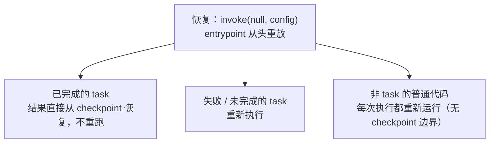

import { Canvas, Controls, Meta } from '@storybook/addon-docs/blocks';
import * as FunctionalApi from './functional-api.stories';

<Meta of={FunctionalApi} name="Docs" />

# Functional API

Functional API 是 LangGraph 的过程式入口：不把代码重构为 nodes / edges 的图，用 `entrypoint` 包住流程、`task` 包住关键步骤，就把持久化、断点恢复、human-in-the-loop 和流式加进了既有 TypeScript 代码——控制流还是你熟悉的 `if` / `else`、循环和 `await`。「LangGraph 思维模型」一课已经给出三条 API 线的选型判断器，本课聚焦 Functional API 自身的三个问题：`task` 到底改变了什么（这是理解一切行为的钥匙）、哪些步骤该包成 task、以及它与 Graph API 如何互转与混用。读完你应该能预测：同一段逻辑包与不包 task，在失败重跑和恢复时会走哪条路。

| 构件 | 形态 | 关键要点 |
| --- | --- | --- |
| `entrypoint` | `entrypoint(name \| { name, checkpointer?, store?, cache? }, fn)` | 返回可 `invoke` / `stream` 的运行时实例；传 `checkpointer` 启用持久化 |
| `task` | `task(name \| { name, retry?, cache? }, fn)` | 调用像普通函数，但总返回 Promise；结果记入 checkpoint |
| `getPreviousState<T>()` | 在 `fn` 内调用 | 读同 thread 上一次保存的值，首跑为 `undefined` |
| `entrypoint.final` | `return entrypoint.final({ value, save })` | 解耦「返回给调用者的值」与「保存进 checkpoint 的值」 |
| `invoke` | `invoke(input, { configurable: { thread_id } })` | 出错后修复底层问题，同 thread 传 `null` 恢复 |

边界提醒：`StateGraph` 的状态定义、节点与条件路由归「Graph API」一课；checkpointer 选型与 durability mode 配置归「持久化」一课；`interrupt` / 时间旅行细节归「中断与时间旅行」一课。

## 快速上手

一个可恢复的最小闭环：两个 task，第二个第一次执行会失败；修复后同 thread 传 `null` 恢复，观察昂贵步骤没有重跑。

```ts
// functional-quickstart.ts —— Functional API 最小可恢复闭环。
// 运行条件：npm i @langchain/langgraph；npx tsx functional-quickstart.ts（不需要模型 API key）。
import { entrypoint, task, MemorySaver } from '@langchain/langgraph';

let dbFixed = false; // 模拟外部故障：首次执行必失败
let enrichRuns = 0;

// task：名字用于 checkpoint 与调试；昂贵的准备工作放这里
const enrich = task('enrich', async (query: string) => {
  enrichRuns += 1;
  return `enriched:${query}`;
});

const fetchRows = task('fetchRows', async (sql: string) => {
  if (!dbFixed) throw new Error('db down');
  return `rows of ${sql}`;
});

// entrypoint：流程入口；if / else 就是控制流
const workflow = entrypoint(
  { name: 'report', checkpointer: new MemorySaver() },
  async (sql: string) => {
    const enriched = await enrich(sql);
    return fetchRows(enriched);
  },
);

const config = { configurable: { thread_id: 't1' } }; // 恢复按 thread 聚合

try {
  await workflow.invoke('SELECT 1', config);
} catch (error) {
  console.log('run 1 失败:', String(error)); // Error: db down
}

dbFixed = true; // 修好外部故障后恢复：同 thread、输入传 null
const result = await workflow.invoke(null, config);
console.log(result, { enrichRuns });
// rows of enriched:SELECT 1 { enrichRuns: 1 }
// enrich 没有重跑——结果直接来自 checkpoint，只有失败的 fetchRows 重跑
```

## task：被运行时跟踪的步骤

`task` 把一段函数变成被 LangGraph 运行时跟踪的离散工作单元。调用方式与普通函数几乎相同，差别只有四条：

- **总返回 Promise。** 这让并行变得自然：`items.map(step)` 后 `await Promise.all(...)`，多个 task（例如多个 LLM 调用）并发执行，适合 I/O 密集场景。
- **只能在 entrypoint、其他 task 或 `StateGraph` 节点内调用。** 在应用主代码里直接调用会报错。
- **开启 checkpointer 后，输入与输出必须 JSON 可序列化**，否则运行时报错。
- **名字稳定且有含义。** task 名字类比 Graph API 的节点名，用于 checkpoint 标识、调试与 LangSmith 观测；恢复时结果按「名字 + 输入」对号入座，改名的 task 会丢掉历史结果。

```ts
// 并行：task 返回 Promise，IO 密集子任务直接并发
const generateParagraph = task('generateParagraph', async (topic: string) => {
  /* LLM 调用或昂贵计算 */
  return `paragraph about ${topic}`;
});

const workflow = entrypoint('doc', async (topics: string[]) => {
  const paragraphs = await Promise.all(topics.map(generateParagraph));
  return paragraphs.join('\n\n');
});
```

entrypoint 的包裹函数最多两个形参：第一个是输入，第二个是可选的 `LangGraphRunnableConfig`。**要传多个数据时打包成一个对象**，不能声明多个位置参数。

### 重试与缓存

task 的对象形式接受两种执行策略，都在 task 边界内生效：

```ts
// task-policy.ts —— task 级重试与缓存。
// 运行条件：npm i @langchain/langgraph；npx tsx task-policy.ts（不需要模型 API key）。
import { entrypoint, task, type RetryPolicy } from '@langchain/langgraph';
import { InMemoryCache } from '@langchain/langgraph-checkpoint'; // @langchain/langgraph 的依赖

let attempts = 0;
const retryPolicy: RetryPolicy = { retryOn: (error) => error instanceof Error };

// retry：task 内自动重试瞬态失败，流程不中断
const getInfo = task({ name: 'getInfo', retry: retryPolicy }, async () => {
  attempts += 1;
  if (attempts < 2) throw new Error('Failure'); // 首次失败
  return 'OK';
});

// cache：按输入缓存结果；ttl 单位是秒
const slowAdd = task({ name: 'slowAdd', cache: { ttl: 120 } }, async (x: number) => {
  await new Promise((resolve) => setTimeout(resolve, 1000)); // 昂贵计算
  return x * 2;
});

// task 级 cache 要生效，entrypoint 级必须提供 BaseCache 实例
const main = entrypoint({ cache: new InMemoryCache(), name: 'main' }, async (x: number) => {
  await getInfo();
  return slowAdd(x);
});

console.log(await main.invoke(5)); // 10（等待 1 秒）
console.log(await main.invoke(5)); // 10（同输入命中缓存，不再等待）
```

`RetryPolicy` 的默认值（不配置时即为这些）：`maxAttempts: 3`、`initialInterval: 500`（毫秒）、`backoffFactor: 2`、`maxInterval: 128000`；默认策略只重试特定网络错误，所以对自定义错误类型要用 `retryOn` 显式圈定。`cache: { ttl }` 不写 `ttl` 则永不过期；缓存按输入命中，跨 thread 生效——这与「同 thread 内已完成 task 直接从 checkpoint 恢复」是两套机制：checkpoint 恢复不看输入是否相同，缓存看。

## 重放与恢复

恢复语义是 Functional API 最反直觉也最重要的一点：**恢复不是从断掉的哪一行续行，而是从 entrypoint 开头重放整个函数**。重放时三类代码去向不同：



用计数器探针可以直接核对这三条规则：

```ts
// replay-probe.ts —— 恢复时哪些代码重跑：task 结果来自 checkpoint，普通代码重放。
// 运行条件：npm i @langchain/langgraph；npx tsx replay-probe.ts（不需要模型 API key）。
import { entrypoint, task, MemorySaver } from '@langchain/langgraph';

let plainRuns = 0; // 非 task 的普通逻辑
let slowRuns = 0;  // task：结果入 checkpoint
let fixed = false;

const slow = task('slow', async (q: string) => {
  slowRuns += 1;
  return `slow:${q}`;
});
const risky = task('risky', async () => {
  if (!fixed) throw new Error('boom');
  return 'ok';
});

const workflow = entrypoint({ name: 'probe', checkpointer: new MemorySaver() }, async (q: string) => {
  plainRuns += 1; // 普通代码：没有 checkpoint 边界，重放时重新执行
  const a = await slow(q);
  const b = await risky();
  return { a, b };
});

const config = { configurable: { thread_id: 'p1' } };
try {
  await workflow.invoke('x', config); // 首次执行：risky 失败，错误上抛
} catch {
  console.log('run 1 后', { plainRuns, slowRuns }); // { plainRuns: 1, slowRuns: 1 }
}

fixed = true; // 修复后同 thread 传 null 恢复
console.log('恢复结果', await workflow.invoke(null, config));
// { a: 'slow:x', b: 'ok' } —— slow 的结果直接来自 checkpoint
console.log('恢复后', { plainRuns, slowRuns }); // { plainRuns: 2, slowRuns: 1 }
// 普通代码重放了（1→2），已完成的 task 没有重跑（1→1）
```

这套重放模型推出三条硬规则：

- **副作用必须放进 task。** 直接写在 entrypoint 里的 `fs.writeFileSync`、发邮件、扣库存，恢复重放时会再次执行。非确定性同理：用 `Date.now()` 决定分支要封装成 `task('getTime', () => Date.now())`，否则重放时分支可能走向不同结果。
- **task 的副作用要设计成幂等。** 一个启动了但未完成的 task 在恢复时可能重跑，用幂等键或先查已有结果兜底。
- **`interrupt` 与 resume 值按索引严格匹配**，重放时执行顺序改变可能匹配到错误的 resume 值——机制细节归「中断与时间旅行」一课，这里先记住「interrupt 的流程里，task 边界之外不要有影响顺序的副作用」。

## 哪些步骤该包成 task

机制清楚了，判断就变得直接。对每个步骤问四个问题，任一命中就包成 task：

| 问题 | 包成 task 的收益 |
| --- | --- |
| 这一步昂贵吗（LLM 调用、检索、大计算）？ | 结果入 checkpoint，中断 / 恢复后不再重算 |
| 这一步调用外部系统、可能瞬态失败吗？ | `retry` 策略在 task 内自动重试，流程不中断 |
| 同输入会重复计算吗？ | `cache` 按输入命中，跨调用省掉重跑 |
| 需要在 LangSmith 里看清这一步吗？ | task 名字就是观测粒度 |

反方向同样成立：**廉价的纯函数不必包**。一个字符串拼接、一次本地过滤，重放时重算没有副作用、代价可忽略——包成 task 反而多一次序列化和 checkpoint 记录。混用是常态：entrypoint 里可以有普通函数（胶水逻辑、本地变换）也有 task（昂贵步骤、副作用步骤、要观测的步骤），边界只由上面四问决定。

LLM 调用几乎总是命中全部四问，是最典型的 task：

```ts
// llm-task.ts —— 把模型调用包成 task：昂贵、可能失败、值得缓存、需要观测。
// 运行条件：npm i @langchain/langgraph @langchain/openai；.env 提供 OPENAI_API_KEY。
import { ChatOpenAI } from '@langchain/openai';
import { entrypoint, task, MemorySaver } from '@langchain/langgraph';

const model = new ChatOpenAI({ model: 'gpt-4o-mini' });

const summarize = task(
  { name: 'summarize', retry: { retryOn: (e) => e instanceof Error } },
  async (text: string) => {
    const response = await model.invoke([{ role: 'user', content: `用一句话总结：${text}` }]);
    return String(response.content);
  },
);

const workflow = entrypoint(
  { name: 'digest', checkpointer: new MemorySaver() },
  async (article: string) => {
    const clean = article.trim(); // 廉价纯函数：不值得包 task
    return summarize(clean);      // LLM 调用：四问全中
  },
);
```

「包与不包在恢复时走哪条路」可以确定性模拟——切换下面的开关，对照两行执行轨迹：

<Canvas of={FunctionalApi.Boundary} />
<Controls of={FunctionalApi.Boundary} />

| 读者操作 | 可观察证据 |
| --- | --- |
| 关闭「enrich 包成 task」 | 恢复行中 enrich 从「checkpoint 恢复」变为「重新执行」，enrich 执行计数 1 → 2 |
| 打开「fetch 带 retry 策略」 | run 1 中 fetch 第一次尝试失败后按策略重试成功，流程不中断，恢复行变为「无需恢复」 |
| 两个开关都关闭 | run 1 失败上抛；恢复时 enrich 重放、fetch 重跑，与正文 replay-probe 的计数一致 |
| 打开 Show code | 看到该 Canvas 实际执行的 `example.ts`：纯 TS 模拟上述规则，不依赖 `@langchain/*` |

## previous 前值

entrypoint 有一个跨调用的记忆通道：同 thread 的每次调用结束后，返回值（或 `entrypoint.final` 的 `save`）被保存；下次调用在函数内用 `getPreviousState<T>()` 读回。它对应底层名为 `PREVIOUS` 的 last-value 通道——只存最近一次保存的值，首跑读到 `undefined`，这个「首跑分支」就是状态初始化的位置。

```ts
// previous-acc.ts —— previous 前值：同 thread 的跨调用记忆与 entrypoint.final。
// 运行条件：npm i @langchain/langgraph；npx tsx previous-acc.ts（不需要模型 API key）。
import { entrypoint, getPreviousState, MemorySaver } from '@langchain/langgraph';

const total = entrypoint(
  { name: 'total', checkpointer: new MemorySaver() },
  async (n: number) => {
    const prev = getPreviousState<number>(); // 上次保存的值；首跑为 undefined
    const sum = (prev ?? 0) + n;
    // value 返回给调用者，save 存入 checkpoint，两者解耦
    return entrypoint.final({ value: `小计 ${sum}`, save: sum });
  },
);

const config = { configurable: { thread_id: 'cart' } };
console.log(await total.invoke(3, config)); // 小计 3（保存 3）
console.log(await total.invoke(4, config)); // 小计 7（保存 7）
console.log(await total.invoke(5, config)); // 小计 12（保存 12）
```

不使用 `final` 时，保存的就是返回值本身；要用「上次的返回值」当记忆，直接 `getPreviousState()` 即可。使用 `final` 的典型场景是对话式 workflow：把 `addMessages(messages, response)` 存进 checkpoint 维护消息历史，但只把最后一条回复返回给调用者——消息历史归「短期记忆」一课展开，跨 thread 的长期记忆用 entrypoint options 里的 `store`，归「长期记忆与 Store」一课。

版本注意：官方 how-to 页的示例把前值写成 entrypoint 函数的第二个参数 `previous`；但截至 npm 上的 `@langchain/langgraph` 1.4.x，第二个形参实际收到的是 `LangGraphRunnableConfig` 对象，读前值要用 `getPreviousState()`。照抄 how-to 会把 config 当成前值用（判断方法见「常见问题」）。

previous 的延续效果可以确定性模拟——固定输入序列 `[3, 1, 5]` 连续三次调用同一 thread：

<Canvas of={FunctionalApi.Memory} />
<Controls of={FunctionalApi.Memory} />

| 读者操作 | 可观察证据 |
| --- | --- |
| 保持「用 entrypoint.final 解耦」关闭 | 三次调用的返回值即保存值：3 → 4 → 9（previous 读到上次返回值） |
| 打开「用 entrypoint.final 解耦」 | 返回值与保存值分家：返回 0 → 3 → 4，保存 3 → 4 → 9（读数区两个数字不再相等） |
| 打开 Show code | 看到该 Canvas 实际执行的 `example.ts`：纯 TS 模拟 previous 通道，不依赖 `@langchain/*` |

## 与 Graph API 对照与互转

Functional API 与 Graph API 是同一运行时的两个入口，能力（persistence、streaming、human-in-the-loop、memory）完全一致，差别只在表达方式与 checkpoint 粒度：

| 方面 | Functional API | Graph API |
| --- | --- | --- |
| 控制流 | 语言原生（`if` / `for` / `await`），代码量少 | 声明式 nodes / edges，结构显式 |
| 短期记忆 | 不声明 State / reducer，状态局部在函数内 + `previous` 通道 | 显式共享 State，跨节点合并要 reducer |
| checkpoint 语义 | task 结果写入 entrypoint 已关联的 checkpoint，不新建 | 每个 super-step 结束新建 checkpoint |
| 可视化 | 不支持（图在运行时动态生成） | 结构即文档，可视化、易调试分享 |

第三行值得展开：Graph API 在每个 super-step 边界落 checkpoint（机制见「LangGraph 思维模型」）；Functional API 里 entrypoint 是一个整体执行单元，**只有 task 边界是 durability 边界**——这就是上一节四问判断的底层依据。

互转是双向的，官方明确支持：

- **过程式 → 图**：`if` / `else` 分支多到难读、出现并行后汇合、多个步骤需要显式共享状态、或团队需要对着图讨论流程时，把 entrypoint 内的控制流改写为条件边与节点。task 函数体几乎原样变成节点函数。
- **图 → 过程式**：图为线性流程付出过度样板时，节点函数退化为 task，边退化为顺序 `await`。

### 混用

两种 API 可以出现在同一个应用里，三种组合都合法：

```ts
// 混用一：entrypoint 内调用编译好的 StateGraph（复杂分支子流程）
const workflow = entrypoint({ name: 'hybrid', checkpointer }, async (input: string) => {
  const routed = await routerGraph.invoke(input); // Graph API：多决策点分支
  return await summarize(`routed:${routed}`);     // task：昂贵 LLM 步骤
});

// 混用二：task 也可以在 StateGraph 的节点里调用（task 的合法调用位置之一）
const reviewNode = async (state: typeof State.State) => {
  const result = await summarize(state.input);
  return { messages: [{ role: 'ai', content: result }] };
};

// 混用三：子 entrypoint 不传 checkpointer，自动继承父级的
const child = entrypoint('child', async (x: number) => x * 2);
const parent = entrypoint({ name: 'parent', checkpointer }, async (x: number) => child(x));
```

### 渐进引入

对既有过程式代码，Functional API 的设计目标就是最小改动路径，分三步走，每步独立可验证：

```ts
// 第 1 步：整段既有逻辑原样包进 entrypoint——控制流不动，还没有 task。
// 收益：统一的 invoke / stream 接口 + thread 级持久化（返回值进 previous 通道）。
const flow = entrypoint(
  { name: 'report-flow', checkpointer: new MemorySaver() },
  async (input: { sql: string }) => {
    const rows = await queryDb(input.sql); // 普通函数：暂不包 task
    return render(rows);                   // 普通函数
  },
);

// 第 2 步：把最昂贵 / 有副作用的步骤逐个换成 task（task 名字保持稳定）。
// 每换一个，中断恢复就少重算一步——按「哪些步骤该包成 task」的四问排优先级。

// 第 3 步：按需补 retry / cache；分支复杂化、需要并行汇合或显式状态时，再迁移 Graph API。
```

第 1 步就要注意重放语义：包进 entrypoint 的既有代码如果带有写文件、发请求等副作用，在第 2 步之前它们没有 durability 边界，恢复重放会重复执行——要么尽早包成 task，要么保证幂等。

## 最佳实践

- task 粒度按「恢复代价」拆：拆得越细，中断后重跑越少、观测越清晰；但把整个流程写成一个巨型 task，durability 退化为全有或全无。线性连续的廉价逻辑合在普通函数里，昂贵和有副作用的逻辑各自成 task。
- 失败处理三选一，按错误性质定：瞬态错误（限流、网络抖动）用 task 级 `retry` 当场消化；需要人工修复的错误让它上抛，修好后 `invoke(null, config)` 恢复；有副作用的 task 无论选哪条，都要幂等设计兜底。
- task 名字一旦进入 checkpoint 历史就不要改：恢复时结果按名字对号入座，改名等于放弃历史结果；同理，缓存键按 task 输入生成，把易变字段（时间戳、随机数）从 task 输入里剥离，否则永远不命中。
- 迁移判断用「结构信号」而不是「规模」：代码行数多不是迁移理由，并行汇合、多决策点分支、显式共享状态、需要可视化协作才是；线性流程长期停留在 Functional API 是合法且常更好的选择。

## 常见问题

- 照官方 how-to 把 `previous` 写成第二个参数，拿到的东西却不像前值？
  这是文档与 npm 包的版本差：how-to 页描述 `async (inputs, previous?)`，但 `@langchain/langgraph` 1.4.x 实际传给第二形参的是 `LangGraphRunnableConfig`。判断方法：`'configurable' in second` 为真就是 config。处理动作：读前值一律用 `getPreviousState<T>()`，它在 1.1.x 与 1.4.x 行为一致。
- 恢复后副作用重复执行了（文件写了两份、消息发了两遍）？
  副作用写在 entrypoint 普通代码里，恢复重放时必然重新执行。把它包成 `task`——已完成的 task 结果从 checkpoint 恢复、不重跑；若该 task 本身可能「启动了但未完成」，再加幂等键或先查已有结果。
- 在应用主代码里直接调用 task 报错？
  task 只能在 entrypoint、其他 task 或 StateGraph 节点内调用，运行时依赖入口建立的执行上下文。把调用点移进 entrypoint，或把外层逻辑本身包成 entrypoint。
- task 配了 `cache: { ttl }` 却还是重复执行？
  task 级 `cache` 只是策略，生效前提是 entrypoint 级配置了 `cache: new InMemoryCache()`（或其它 `BaseCache` 实现）。另外缓存按输入命中：输入里含时间戳、随机数等易变字段时永远不命中。
- entrypoint 函数想收多个参数（如 `(question, options)`）写不了？
  包裹函数最多两个形参（输入 + 可选 config），多个数据打包成对象传入：`invoke({ question, options })`。task 没有这个限制，可以正常声明多个参数。

## 总结回顾

摘要：

本课把 Functional API 讲成三个层次：用法上，`task` 是被运行时跟踪的步骤——总返回 Promise、可并行、可在对象形式里配 `retry` 与 `cache`；机制上，恢复不是续行而是从 entrypoint 开头重放，已完成的 task 从 checkpoint 恢复、失败的 task 重跑、非 task 普通代码每次都重新执行，因此副作用与非确定性必须放进 task、且要幂等；判断上，昂贵、易失败、可缓存、需观测四问任中即包，廉价纯函数不必包。`getPreviousState` 与 `entrypoint.final` 提供同 thread 的跨调用记忆并解耦返回值与保存值。与 Graph API 共享同一运行时：checkpoint 语义不同（task 边界 vs super-step 边界）、表达不同（过程式 vs 声明式），可双向迁移，可在 entrypoint 内调图、在图节点内调 task、用子 entrypoint 继承 checkpointer，对既有代码按「包 entrypoint → 换 task → 补策略」三步渐进引入。

一句话：

> task 边界就是 durability 边界：恢复时 entrypoint 重放，普通代码重跑，只有已完成 task 的结果从 checkpoint 恢复。

知识要点：

- `task` 与普通函数调用有哪四条差别？输入输出有什么硬约束？
- 恢复时三类代码（已完成 task、失败 task、普通代码）各走哪条路？用什么操作恢复？
- 哪些步骤该包成 task？判断依据是哪四个问题？
- `retry` 与 `cache` 各自的生效前提与默认值是什么？
- `getPreviousState` 读到什么？`entrypoint.final` 解决什么问题？
- Functional API 与 Graph API 在控制流、记忆、checkpoint 语义、可视化上各差在哪？如何混用与互转？
- 既有代码按什么顺序渐进引入？第 1 步就要注意什么？

## 参考资料

- [Functional API（官方：概念、与 Graph API 对照、重放与幂等）](https://docs.langchain.com/oss/javascript/langgraph/functional-api)
- [Use the Functional API（官方：retry / cache、previous、entrypoint.final、getState）](https://docs.langchain.com/oss/javascript/langgraph/use-functional-api)
- [LangGraph.js API 参考（entrypoint / task / RetryPolicy 签名核对）](https://reference.langchain.com/)
