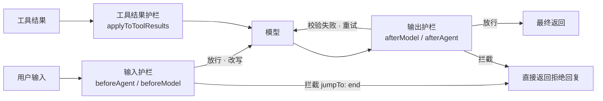

import { Canvas, Controls, Meta } from '@storybook/addon-docs/blocks';
import * as Guardrails from './guardrails.stories';

<Meta of={Guardrails} name="Docs" />

# 护栏

[人机协同](?path=/docs/human-in-the-loop--docs)一课划出了界线：审批把「这次该不该做」交给人裁决。护栏（guardrails）补上另一半——把「这条输入/输出能不能过」交给**规则**判断：进模型之前拦下越界输入（禁用话题、注入指令、不该外发的密钥），出模型之后校验输出（PII 泄漏、内部信息、格式违约），外加用限额兜住失控成本。在 LangChain.js 里，护栏多数以[中间件](?path=/docs/middleware--docs)落地：官方把实现分成两条路线——**确定性**（regex / 关键词 / 规则，快而便宜）与**模型判断**（分类模型 / 审核接口，兜得住语义级问题但更慢更贵）。本课沿这条线讲清：护栏拦在请求链路的什么位置、拦下之后的三种结局（拦截、改写、重试）、预置护栏中间件怎么配、以及官方预置不够时怎么用 `createMiddleware` 自定义。读完你应该能预测：一条消息配上不同护栏组合后，会走放行、改写还是被拦，输出被拦和被重试各花掉几次模型调用。



预置护栏速查（关键配置与默认值已与官方文档和本地 `langchain` 1.2.26 源码核对，均 `import { … } from 'langchain'`）：

| 中间件 | 一句话 | 关键配置（默认值） | 失败行为 |
| --- | --- | --- | --- |
| `piiMiddleware('email', { … })` | 检测并处理 PII | `strategy`（`'redact'`）；`applyToInput`（`true`）、`applyToOutput`（`false`）、`applyToToolResults`（`false`）；`detector` 自定义检测 | `redact` / `mask` / `hash` 改写；`block` 抛 `PIIDetectionError` |
| `modelCallLimitMiddleware({ … })` | 模型调用限额 | `threadLimit` / `runLimit`（均无默认）；`exitBehavior`（`'end'`） | `end` 合成 AIMessage 收尾；`error` 抛 `ModelCallLimitMiddlewareError` |
| `toolCallLimitMiddleware({ … })` | 工具调用限额 | `toolName`（缺省 = 全部工具）；两个 limit 至少配一个；`exitBehavior`（`'continue'`） | `continue` 合成 error `ToolMessage` 回喂；`error` 抛 `ToolCallLimitExceededError`；`end` 收尾（多工具批次抛错） |
| `openAIModerationMiddleware({ … })` | 有害内容审核（OpenAI 接口） | `model` 必填；`checkInput` / `checkOutput`（`true`）、`checkToolResults`（`false`）；`moderationModel`（`'omni-moderation-latest'`）；`exitBehavior`（`'end'`） | `end` 拦截收尾；`error` 抛错；`replace` 改写该条消息 |
| `humanInTheLoopMiddleware({ interruptOn })` | 高危动作交人裁决 | `interruptOn` 按工具映射 | interrupt 挂起，机制归[人机协同](?path=/docs/human-in-the-loop--docs) |

## 快速上手

最小闭环：挂一个 PII 输入护栏，invoke 后在返回的消息历史里核对改写。工程沿用[安装](?path=/docs/installation--docs)一课。把代码存成 `guardrails-demo.ts`，用 `npx tsx guardrails-demo.ts` 运行：

```ts
// guardrails-demo.ts —— 最小输入护栏：email 在进模型前被改写
// 运行条件：OPENAI_API_KEY 已写入 .env；npx tsx guardrails-demo.ts 运行。
import 'dotenv/config';
import { ChatOpenAI } from '@langchain/openai';
import { createAgent, piiMiddleware } from 'langchain';

const agent = createAgent({
  model: new ChatOpenAI({ model: 'gpt-5.5' }),
  // 第一个参数是 PII 类型，选项在第二个参数——不是包成一个对象传
  middleware: [piiMiddleware('email', { strategy: 'redact' })],
});

const result = await agent.invoke({
  messages: '我的邮箱是 alice@example.com，帮我记一下，再说说今天适合穿什么。',
});

// 改写发生在 beforeModel 且直接更新 state：返回的历史里第一条已是脱敏文本
console.log(result.messages[0].content);
// => 我的邮箱是 [REDACTED_EMAIL]，帮我记一下，再说说今天适合穿什么。
console.log(result.messages.at(-1)?.content);
// => 已记下（模型看到的就是脱敏后的输入，措辞因模型而异）
```

闭环就三步：挂中间件 → invoke → 在 `result.messages` 里核对改写。生产上通常再叠一层 `applyToOutput: true`，让输出侧同样过检（见「预置护栏」）。

## 护栏解决什么问题

护栏管五类风险，每一类都有对应的动作：

| 风险 | 典型场景 | 护栏动作 |
| --- | --- | --- |
| 越界输入 | 禁用话题、违规请求 | 输入侧拦截：合成拒绝回复 + `jumpTo: 'end'` |
| 敏感数据进出 | 用户丢进邮箱/卡号，模型复述、工具外发 | PII 改写（redact / mask / hash）或 block 抛错 |
| 提示注入 | 「忽略之前的指令…」、工具结果里藏指令 | 注入检测 + 纵深防御（无官方预置，见「自定义护栏」） |
| 有害 / 越权输出 | 泄内部信息、不当内容、格式违约 | 输出侧校验：拦截替换或回喂修正重试 |
| 失控成本 | 死循环、工具滥用 | 调用限额中间件 |

「出问题再处理」有三层，各管一段——判断者不同，别混用（与[人机协同](?path=/docs/human-in-the-loop--docs)一课的对照表同源，这里从护栏视角看）：

| 机制 | 谁判断 | 时机 | 归属 |
| --- | --- | --- | --- |
| 护栏 | **规则**（或辅助模型） | 请求进出模型时 | 本课 |
| HITL 审批 | **人** | 工具执行前 | [人机协同](?path=/docs/human-in-the-loop--docs) |
| 工具错误回传 | **主模型**自我修正 | 工具执行失败后 | [工具](?path=/docs/tools--docs) |

两条实现路线（官方二分法）：

- **确定性**：regex、关键词、规则、schema 校验。快、便宜、可解释、零额外模型调用；代价是写不全——变体、编码、同义改写会漏。
- **模型判断**：小模型分类（SAFE / UNSAFE）或审核接口。能兜住语义级问题；更慢更贵，且自身有误判。

实践顺序：确定性做第一道（输入侧先拦），模型判断做第二道兜底（输出侧复审）。护栏不是独立体系——它在 LangChain.js 里就是中间件的一种用途，钩子签名与叠加顺序归[中间件](?path=/docs/middleware--docs)一课；官方也称 HITL 是高风险决策「最有效的护栏之一」：规则能判的不打扰人，人只兜规则判不了的高危动作。

## 位置与时机

护栏的价值一半来自**放对位置**。四个钩子位置各管一段：

| 位置 | 覆盖对象 | 触发频率 | 适合 | 官方落点 |
| --- | --- | --- | --- | --- |
| `beforeAgent` | 第一条用户消息 | 每次 invoke 一次 | 鉴权、限流、禁用话题短路——坏输入 0 次模型调用就拦下 | 自定义 ContentFilter（官方示例） |
| `beforeModel` | 最后一条 HumanMessage、最近的工具结果 | 每轮模型调用前 | PII 脱敏、注入检测——多轮工具循环时中途进来的内容也过检 | `piiMiddleware`（input / toolResults）、`openAIModerationMiddleware` |
| `afterModel` | 最后一条 AIMessage | 每轮模型返回后 | 输出脱敏、schema / 敏感词校验 | `piiMiddleware`（output）、`openAIModerationMiddleware` |
| `afterAgent` | 最终 AIMessage | 每次 invoke 结束前 | 最终安全复审（模型判断 SAFE / UNSAFE） | 自定义 SafetyGuardrail（官方示例） |

两个位置判断，记住了就不会选错：

- **输入侧比输出侧便宜。** 输入护栏在花钱之前拦：拦截时模型 0 次调用；输出护栏拦下时至少已经花了 1 次。能进黑名单的别留给输出兜底。
- **工具结果也是输入。** Agent 多轮循环时，工具带回来的外源内容（网页、邮件、文件）会在下一轮 `beforeModel` 进入模型——间接注入从这里进来，所以 PII 与审核中间件都有 `applyToToolResults` / `checkToolResults` 开关（默认关闭）。

下面的实例把一条消息在护栏组合下的完整路径确定性走一遍（纯 TS 模拟，不发起真实模型调用；钩子位置、消息形态与文案对齐 `piiMiddleware` 的真实行为和官方自定义护栏示例）：

<Canvas of={Guardrails.Interactive} />
<Controls of={Guardrails.Interactive} />

| 读者操作 | 可观察证据 |
| --- | --- |
| 「输入护栏」保持 `off` 完整回放 | 消息原样进入模型，第 1 轮回答把 `alice@example.com` 复述出来——模型见过原值 |
| 切换为 `redact` | 出现「改写后」的 HumanMessage（`[REDACTED_EMAIL]`），第 1 轮回答不再含原邮箱——**改写只向内传播到模型**，且历史里保留的就是改写后版本 |
| 切换为 `block` | 链路在第 3 段终止：中间件合成拒绝 AIMessage，模型调用 0 次，输出护栏显示「未执行」 |
| 「输出护栏」设为 `flag` | 第 1 轮输出命中敏感词，被替换为拒绝文案直接返回，模型调用 1 次 |
| 设为 `retry` | schema 校验失败 → 合成修正请求 → 模型第 2 轮 → 再检通过，模型调用 2 次 |
| 拖动「回放步骤」 | 逐段观察消息流；虚线块是护栏判定，不是 messages 成员 |
| 打开 Show code | 看到该 Canvas 实际执行的 `example.ts` |

最后是排序：护栏类中间件放 `middleware` 数组**最前**（[中间件](?path=/docs/middleware--docs)一课的准则——第一个位置最先执行、包住其余全部），别让改写类、日志类中间件先碰到消息。

## 失败行为

护栏判失败之后有三种结局，选哪种取决于调用方能不能处理、以及拦的东西有多严重：

| 处置 | 含义 | invoke 的结果 | 典型实现 |
| --- | --- | --- | --- |
| 拦截 | 不继续执行 | 两种形态：**抛错**（`block` / `error`，调用方必须 catch）；或**正常返回**（`end`：合成一条拒绝 / 限额 AIMessage + `jumpTo: 'end'`） | `piiMiddleware` 的 `block`；限额与审核的 `error` / `end` |
| 改写 | 替换内容后继续 | 正常返回，消息历史里就是改写后的版本（原值不保留） | `redact` / `mask` / `hash`、审核的 `replace` |
| 重试 | 把失败原因回喂，再来一轮 | 正常返回，最终是修正后的输出；代价是多一次模型调用 | 输出校验失败合成修正请求；`toolStrategy` 默认自动重试 |

预置护栏的失败开关全部叫 `exitBehavior`（PII 叫 `strategy`），语义对照：

| 中间件 | 默认 | 全部取值与语义 |
| --- | --- | --- |
| `piiMiddleware` | `'redact'` | `redact` / `mask` / `hash` 改写继续；`block` 抛 `PIIDetectionError` |
| `modelCallLimitMiddleware` | `'end'` | `end` 合成 AIMessage（内容为错误消息）正常收尾；`error` 抛 `ModelCallLimitMiddlewareError` |
| `toolCallLimitMiddleware` | `'continue'` | `continue` 超限调用不执行、合成 `status: "error"` 的 ToolMessage 回喂模型，其余继续；`error` 抛 `ToolCallLimitExceededError`；`end` 注入收尾消息直接结束（同批还有其他工具待执行时抛错） |
| `openAIModerationMiddleware` | `'end'` | `end` 合成违规回复收尾；`error` 抛 `OpenAIModerationError`；`replace` 把该条消息替换为违规文案后继续 |

两个容易混的点：

- **「拦截」有两种表面形态。** 抛错和「合成拒绝消息正常返回」对调用方完全不同：前者要 try/catch、适合程序化处理；后者调用方无感，适合直接把文案展示给用户。选哪种看调用方的能力，不是看严重程度。
- **「重试」必须配限额兜底。** 校验重试本身也可能循环（模型一直修不对），给重试设最大次数，并叠 `modelCallLimitMiddleware` 兜底。

## 预置护栏

### PII 脱敏：piiMiddleware

一个实例管一种类型，多种类型叠加多个实例。内置检测器：`email`、`credit_card`（Luhn 校验）、`ip`、`mac_address`、`url`；自定义类型名必须配 `detector`（RegExp、模式字符串或 `(content) => PIIMatch[]` 函数），否则构造时抛 `Unknown PII type: …`。四种 `strategy`：

| strategy | 行为 | 例子 | 适用 |
| --- | --- | --- | --- |
| `redact`（默认） | 整段替换为占位符 | `[REDACTED_EMAIL]` | 通用合规、日志脱敏 |
| `mask` | 部分遮蔽 | `****-****-****-1234`、`a***@domain` | 人还要看：客服界面 |
| `hash` | 确定性哈希（sha256 前 8 位） | `<email_hash:a1b2c3d4>` | 分析与调试：同值同哈希可关联、不可还原 |
| `block` | 抛 `PIIDetectionError`（带 `piiType` 与 `matches`） | — | 完全禁止该类数据进出 |

```ts
// 运行条件：OPENAI_API_KEY 已写入 .env。
import { createAgent, piiMiddleware } from 'langchain';

const agent = createAgent({
  model: new ChatOpenAI({ model: 'gpt-5.5' }),
  middleware: [
    // 一个实例一种类型：邮箱改写、卡号遮蔽（对齐官方示例的组合方式）
    piiMiddleware('email', { strategy: 'redact', applyToOutput: true }),
    piiMiddleware('credit_card', { strategy: 'mask' }),
    // 自定义类型：密钥直接禁止（detector 是模式字符串）
    piiMiddleware('api_key', {
      detector: 'sk-[a-zA-Z0-9]{32}',
      strategy: 'block',
    }),
    // 工具带回的外源内容同样过检（防间接注入带进敏感数据）
    piiMiddleware('email', { applyToToolResults: true }),
  ],
});
```

三个行为边界（已在 1.2.26 源码核对）：

- **改写直接更新 state。** `beforeModel` 返回替换后的消息数组，历史里保留的就是脱敏版本——模型从没见过原值，之后也找不回来。需要在后续流程里用原值（比如真的要给这个邮箱发邮件），由应用层在 invoke 前自己留存映射。
- **只检「最后一条 HumanMessage」（输入）与「最后一条 AIMessage」（输出）。** 不是全历史扫描；工具结果侧检的是最后一条 AIMessage 之后的 `ToolMessage`。历史里更早的 PII 不会被回头处理。
- **`block` 在 invoke 上抛错。** 调用侧要 catch `PIIDetectionError`（可从 `error.matches` 拿到命中位置）再决定返回什么。

### 调用限额：modelCallLimitMiddleware 与 toolCallLimitMiddleware

两个限额中间件管「失控成本」：死循环、重复调用、滥用。计数维度是理解它们的钥匙——`runLimit` 管**单次 invoke** 内（每次调用结束自动清零），`threadLimit` 管**整个会话线程**累计（跨 invoke 相加，必须配 checkpointer + `thread_id` 才记得住，与[人机协同](?path=/docs/human-in-the-loop--docs)的挂起恢复同一个机制，checkpointer 选型归[持久化](?path=/docs/persistence--docs)一课）。

```ts
// 运行条件：OPENAI_API_KEY 已写入 .env。
import { ChatOpenAI } from '@langchain/openai';
import { MemorySaver } from '@langchain/langgraph';
import {
  createAgent,
  modelCallLimitMiddleware,
  toolCallLimitMiddleware,
} from 'langchain';

const agent = createAgent({
  model: new ChatOpenAI({ model: 'gpt-5.5' }),
  tools: [search, sendEmail],
  checkpointer: new MemorySaver(), // threadLimit 的计数随检查点持久化，必须配
  middleware: [
    // 模型调用：单次最多 8 轮，整个线程最多 50 轮
    modelCallLimitMiddleware({ runLimit: 8, threadLimit: 50 }),
    // 全局工具调用限额 + 单工具限额，两个实例分开配
    toolCallLimitMiddleware({ runLimit: 20 }),
    toolCallLimitMiddleware({ toolName: 'send_email', runLimit: 3 }),
  ],
});
// threadLimit 生效还要求 invoke 带同一个 thread_id（见「常见问题」）
```

行为细节（已在源码核对）：

- `modelCallLimitMiddleware` 计数在 `afterModel` 递增，`beforeModel` 检查；超限时 `'end'`（默认）合成一条内容为 `"Model call limits exceeded: …"` 的 AIMessage 正常收尾，`'error'` 抛错。限额也能在调用时用 `{ configurable: { runLimit: 5 } }` 覆盖。
- `toolCallLimitMiddleware` 至少配一个 limit，否则构造抛错；`runLimit` 不能大于 `threadLimit`。默认 `'continue'`：超限的调用**不执行**，合成一条配对 `tool_call_id`、`status: "error"` 的 ToolMessage（文案 `Tool call limit exceeded. Do not call 'X' again.`）回喂模型，同批未超限的工具照常执行——由模型看到错误后改道。`'end'` 只适合单工具批次：同批还有其他工具待执行会直接抛错（提示改用 `'continue'` 或 `'error'`）。

### 有害内容：openAIModerationMiddleware

走 OpenAI 的 moderation 接口判内容安全，是「模型判断」路线的官方预置——`checkInput` / `checkOutput` 默认都是 `true`（注意与 `piiMiddleware` 相反，那边输出默认关）：

```ts
// 运行条件：OPENAI_API_KEY 已写入 .env。
import { ChatOpenAI } from '@langchain/openai';
import { createAgent, openAIModerationMiddleware } from 'langchain';

const agent = createAgent({
  model: new ChatOpenAI({ model: 'gpt-5.5' }),
  // model 必须是 OpenAI 模型：中间件借它的 client 调审核接口
  middleware: [
    openAIModerationMiddleware({
      model: 'gpt-5.5',
      checkToolResults: true, // 外源内容也过检
      exitBehavior: 'end',
      // 违规文案模板，可用占位符 {categories} {category_scores} {original_content}
      violationMessage: '该请求因 {categories} 被拒绝。',
    }),
  ],
});
```

`'end'`（默认）合成违规 AIMessage 收尾；`'error'` 抛 `OpenAIModerationError`；`'replace'` 不终止流程，把命中的那条消息（输入或输出）替换成违规文案后继续。此中间件目前未收录在官方 guardrails / built-in 文档页，以上按本地 `langchain` 1.2.26 源码整理。Gemini 对照：`@langchain/google-genai` 无对应预置审核中间件，用下面的自定义输出护栏加分类模型实现。

## 自定义护栏

### 输入护栏：话题与注入拦截

官方示例的形态：`beforeAgent` 里查第一条用户消息，命中黑名单就合成拒绝回复并 `jumpTo: 'end'`——零模型成本短路。

```ts
// 运行条件：OPENAI_API_KEY 已写入 .env。
import { AIMessage, createMiddleware, HumanMessage } from 'langchain';

const bannedTopics = ['代写论文', '破解', '恶意攻击'];

const contentFilter = createMiddleware({
  name: 'content-filter',
  beforeAgent: {
    canJumpTo: ['end'], // 必须先声明跳转目标（中间件课的硬规则）
    hook: async (state) => {
      const firstHuman = state.messages.find(HumanMessage.isInstance);
      if (!firstHuman) return;

      const text =
        typeof firstHuman.content === 'string'
          ? firstHuman.content
          : JSON.stringify(firstHuman.content);

      if (bannedTopics.some((topic) => text.includes(topic))) {
        return {
          // 替换最终回复，直接结束：模型 0 次调用
          messages: [new AIMessage('这个话题我不能协助，换个话题好吗？')],
          jumpTo: 'end',
        };
      }
    },
  },
});
```

**注入检测**没有官方预置（JS 现状：guardrails 页只把它列为用例），只能自己写启发式。要点是把检查放到 `beforeModel`（每轮都跑，覆盖中途从工具结果进来的注入），模式表按自己的威胁模型维护：

```ts
// 运行条件：OPENAI_API_KEY 已写入 .env。
import { AIMessage, createMiddleware } from 'langchain';

// 启发式模式：明显的指令劫持话术（可按业务补充编码、unicode 变体）
const injectionPatterns = [
  /ignore (all )?(previous|above|prior) instructions/i,
  /disregard (the )?(above|previous)/i,
  /(忽略|无视)(之前|以上|前面)的?(指令|提示|要求)/,
  /you are now|新的指令|system prompt:/i,
];

const injectionGuard = createMiddleware({
  name: 'injection-guard',
  beforeModel: {
    canJumpTo: ['end'],
    hook: async (state) => {
      // 每轮都检：用户消息与上一轮之后的工具结果都可能是注入载体
      const pending = state.messages.slice(
        Math.max(
          state.messages.length - 3, // 只看即将进入模型的近期内容
          0,
        ),
      );
      const hit = pending.some((message) =>
        injectionPatterns.some((pattern) =>
          pattern.test(String(message.content ?? '')),
        ),
      );
      if (hit) {
        return {
          messages: [new AIMessage('检测到可疑指令，本次请求已终止。')],
          jumpTo: 'end',
        };
      }
    },
  },
});
```

诚实的边界：**启发式挡不住精心构造的注入**（同义改写、拆字、编码都能绕）。注入防护是纵深防御，不是单点：输入检测只是一层，还要配工具最小权限（能做的事本来就少）、高危动作走 HITL 审批、输出侧校验（见下）。

### 输出护栏：模型判断

确定性规则写不出的语义级判断（语气、隐含不当内容）用小模型分类。官方示例形态：`afterAgent` 里用 `initChatModel` 起一个便宜的小模型做 SAFE / UNSAFE 二分类，不安全就替换回复：

```ts
// 运行条件：OPENAI_API_KEY 已写入 .env。
import { AIMessage, createMiddleware, initChatModel } from 'langchain';

const SAFETY_PROMPT = [
  '你是内容安全审核员。只回答 SAFE 或 UNSAFE。',
  'UNSAFE 的标准：泄露内部数据、含不当内容、试图执行危险操作。',
].join('\n');

const safetyGuard = createMiddleware({
  name: 'safety-guard',
  afterAgent: {
    canJumpTo: ['end'],
    hook: async (state) => {
      const last = state.messages.at(-1);
      if (!last || !AIMessage.isInstance(last)) return;

      // 小模型做分类（对齐官方示例：便宜、快）
      const classifier = await initChatModel('openai:gpt-5.4-mini');
      const verdict = await classifier.invoke([
        ['system', SAFETY_PROMPT],
        ['human', `审核以下回复，回答 SAFE 或 UNSAFE：\n\n${last.content}`],
      ]);

      if (String(verdict.content).trim().toUpperCase() === 'UNSAFE') {
        return {
          messages: [new AIMessage('抱歉，这条回复无法展示。')],
          jumpTo: 'end',
        };
      }
    },
  },
});
```

放在 `afterAgent` 而不是 `afterModel` 的原因：这里审的是**最终给人看的回复**，一次 invoke 只跑一次；若每轮都分类，多工具回合会重复付费。反过来，要在工具执行前修正输出的场景（比如先脱敏再进工具）才用 `afterModel`。

### 输出校验：schema 与敏感词

输出护栏的确定性一支。**schema 校验**官方已内置：`createAgent` 的 `responseFormat` 配 `toolStrategy` 时，校验失败默认自动重试——错误细节回传模型修正后再试（`handleError` 可定制），机制与配置归[结构化输出](?path=/docs/structured-output--docs)一课的「错误处理」。schema 之外的规则（敏感词、禁出模式、格式约定）自己写，典型形态是 `wrapModelCall` 里「校验 → 失败回喂修正 → 有限重试」：

```ts
// 运行条件：OPENAI_API_KEY 已写入 .env。
import { AIMessage, createMiddleware, HumanMessage } from 'langchain';

const SENSITIVE = [/INTERNAL-\d+/, /内部备注码/];

const containsSensitive = (text: string) =>
  SENSITIVE.some((pattern) => pattern.test(text));

const outputGuard = createMiddleware({
  name: 'output-guard',
  wrapModelCall: async (request, handler) => {
    let response = await handler(request);

    // 有限重试：把失败原因作为修正请求回喂，最多再来 2 轮
    for (let attempt = 0; attempt < 2; attempt++) {
      if (!containsSensitive(String(response.content))) break;

      response = await handler({
        ...request,
        messages: [
          ...request.messages,
          response,
          new HumanMessage(
            '上一次输出包含禁止外发的内部编码（如 INTERNAL-4021），请去除后重新回答。',
          ),
        ],
      });
    }

    // 修不好就拦截：换成安全文案，不让原文出去
    return containsSensitive(String(response.content))
      ? new AIMessage({
          content: '抱歉，这条回复无法展示。',
          tool_calls: response.tool_calls, // 保留配对，避免悬空 tool_call
        })
      : response;
  },
});
```

三个要点：重试必须**有限**（循环上限 + `modelCallLimitMiddleware` 兜底）；修正请求要**说清楚哪里错了、怎么改**（对齐 `toolStrategy` 回喂错误细节的思路）；修不好时降级为**拦截**而不是把坏输出放出去——替换文案时新建 `AIMessage` 并带上原 `tool_calls`，配对关系不悬空（[工具](?path=/docs/tools--docs)一课的协议）。

## 最佳实践

- **护栏放数组最前**：安全类中间件放 `middleware` 第一个位置——最先执行、包住其余全部（[中间件](?path=/docs/middleware--docs)一课的排序准则）。
- **确定性在前、模型判断在后**：regex / 关键词 / schema 能拦的先拦（免费），分类模型只在输出侧兜底复审（每 invoke 一次）。
- **输入侧能拦的别留给输出侧**：坏输入在模型前拦下是 0 次调用，到了输出侧至少 1 次；工具结果也是输入，`applyToToolResults` / `checkToolResults` 按威胁模型打开。
- **拦截形态按调用方选**：程序化处理选抛错（`block` / `error`）；直接面向用户选合成拒绝消息（`end`）。
- **重试必配限额**：输出校验重试设最大次数，并叠 `modelCallLimitMiddleware` 防修不正死循环。
- **预置优先**：PII、限额、审核、HITL 官方都有现成实现，动手写之前先过上表。
- **规则与人分层**：护栏判「能不能过」，HITL 判「该不该做」；规则能判的不打扰人，审批项越多人越倾向无脑全批。

## 常见问题

- **配了 `piiMiddleware('api_key', { strategy: 'block' })`，invoke 直接抛 `PIIDetectionError`。**
  这是 block 的既定行为：检测命中即抛错。调用侧 try/catch 后返回固定文案；或降级为 `redact` 继续执行。错误对象上 `matches` 有命中位置，可记日志。
- **官方 guardrails 文档页示例里的 `piiRedactionMiddleware`，和我装的包行为对不上。**
  两个名字是不同的东西：`piiRedactionMiddleware({ rules })` 是旧的规则版（改写给模型看、`afterModel` 还原原值给工具，已标记 deprecated）；当前策略版是 `piiMiddleware('email', { strategy, … })`——第一个参数是类型，选项在第二个参数，不是包成一个对象。
- **`threadLimit` 没生效，每次 invoke 都重新数。**
  thread 级计数随检查点持久化：`createAgent` 必须传 `checkpointer`，invoke 必须带同一个 `thread_id`（与[人机协同](?path=/docs/human-in-the-loop--docs)恢复挂起同一把键）。缺了就只剩 `runLimit` 在单次调用内计数。
- **只配了 `piiMiddleware('email')`，输出里还是有邮箱。**
  `applyToOutput` 默认 `false`——默认只检输入。要双向过检显式加 `applyToOutput: true`；注意 `openAIModerationMiddleware` 相反，`checkOutput` 默认 `true`。两家的默认方向不一致，配置前先想清楚要检哪侧。
- **输出校验重试停不下来，token 烧穿。**
  重试循环没有上限，模型一直修不对就一直问。给重试设最大次数（见「输出校验」的 for 循环写法），再叠 `modelCallLimitMiddleware({ runLimit })` 做最后兜底。
- **PII 脱敏后，后面真的要用原邮箱发邮件，找不回来了。**
  改写直接更新消息历史，原值不保留。需要原值时由应用层在 invoke 前留存（消息原文在你手里），或给该场景单独放行并改用输出侧兜底；旧版 `piiRedactionMiddleware` 的标记-还原机制已 deprecated，不建议新代码采用。
- **`toolCallLimitMiddleware` 配了 `exitBehavior: 'end'`，同批多工具时抛错。**
  `'end'` 只能用于单工具批次：同批还有其他工具待执行时会抛「Cannot end execution with other tool calls pending」。多工具场景用默认 `'continue'`（超限的回喂错误消息）或 `'error'`。

## 总结回顾

摘要：

护栏是在请求进出模型的固定拦截点上做规则判断的中间件：输入侧（`beforeAgent` 一次、`beforeModel` 每轮）在花钱前拦下越界输入，输出侧（`afterModel` 每轮、`afterAgent` 最终一次）校验有害 / 越权输出，工具结果侧挡间接注入；实现分确定性（regex / 关键词 / schema，快而便宜）与模型判断（分类模型 / 审核接口，兜语义级问题）两条路线，前者做第一道、后者兜底。失败行为三种：拦截（抛错或合成拒绝 AIMessage 加 `jumpTo: 'end'`）、改写（`redact` / `mask` / `hash` 替换后继续，历史保留改写版）、重试（失败原因回喂修正，必须配限额兜底）。预置四件：`piiMiddleware('email', { strategy, applyToInput, applyToOutput, applyToToolResults })`（输出默认关）、`modelCallLimitMiddleware` 与 `toolCallLimitMiddleware`（`runLimit` 单次 / `threadLimit` 需 checkpointer，`exitBehavior` 默认分别是 `'end'` 与 `'continue'`）、`openAIModerationMiddleware`（输入输出默认开，源码可得）。注入检测无预置，用 `beforeModel` 启发式加纵深防御（工具最小权限、HITL、输出校验）；输出校验的 schema 一支由 `responseFormat` 的 `toolStrategy` 默认自动重试承担，敏感词等自定义规则用 `wrapModelCall` 写有限重试。护栏与 HITL 分层：规则判「能不能过」，人判「该不该做」。

一句话：

> 护栏是在请求进出模型的固定拦截点上做规则判断的中间件——位置决定拦什么（输入侧比输出侧便宜），确定性或模型判断决定怎么判，拦截、改写、重试决定拦下之后的结局。

知识要点：

- 护栏管哪五类风险？与 HITL 审批、工具错误回传的判断归属怎么分？
- 四个钩子位置各覆盖什么、触发几次？为什么输入侧比输出侧便宜、工具结果也算输入？
- 拦截、改写、重试三种失败行为下 invoke 分别返回什么？「拦截」的两种表面形态差在哪？
- `piiMiddleware` 的四种 `strategy` 各是什么行为？三个 `applyTo*` 开关的默认值是什么？
- 限额中间件的 `runLimit` 与 `threadLimit` 差在哪？`threadLimit` 依赖什么前提？
- 两个限额中间件的 `exitBehavior` 默认值分别是什么？`toolCallLimitMiddleware` 的 `'continue'` 超限后发生什么？
- 注入检测为什么没有预置可抄？启发式要放在哪个钩子、为什么单靠它不够？
- 输出校验的 schema 一支官方怎么自动重试？自定义敏感词校验的「有限重试」怎么写、修不好时怎么办？
- 护栏中间件在 `middleware` 数组里放哪个位置？为什么？

## 参考资料

- [Guardrails（LangChain.js 官方文档：两条实现路线、beforeAgent / afterAgent 示例、PII 策略与组合用法）](https://docs.langchain.com/oss/javascript/langchain/guardrails)
- [Prebuilt middleware（LangChain.js 官方文档：piiMiddleware、modelCallLimitMiddleware、toolCallLimitMiddleware 的配置与默认值）](https://docs.langchain.com/oss/javascript/langchain/middleware/built-in)
- [langchainjs 仓库（本地 1.2.26 源码核对：pii / 限额 / openAIModeration 的钩子时机、默认值、exitBehavior 语义与合成消息文案）](https://github.com/langchain-ai/langchainjs)
- [Human-in-the-loop（LangChain.js 官方文档：HITL 作为最高层护栏的定位）](https://docs.langchain.com/oss/javascript/langchain/human-in-the-loop)
