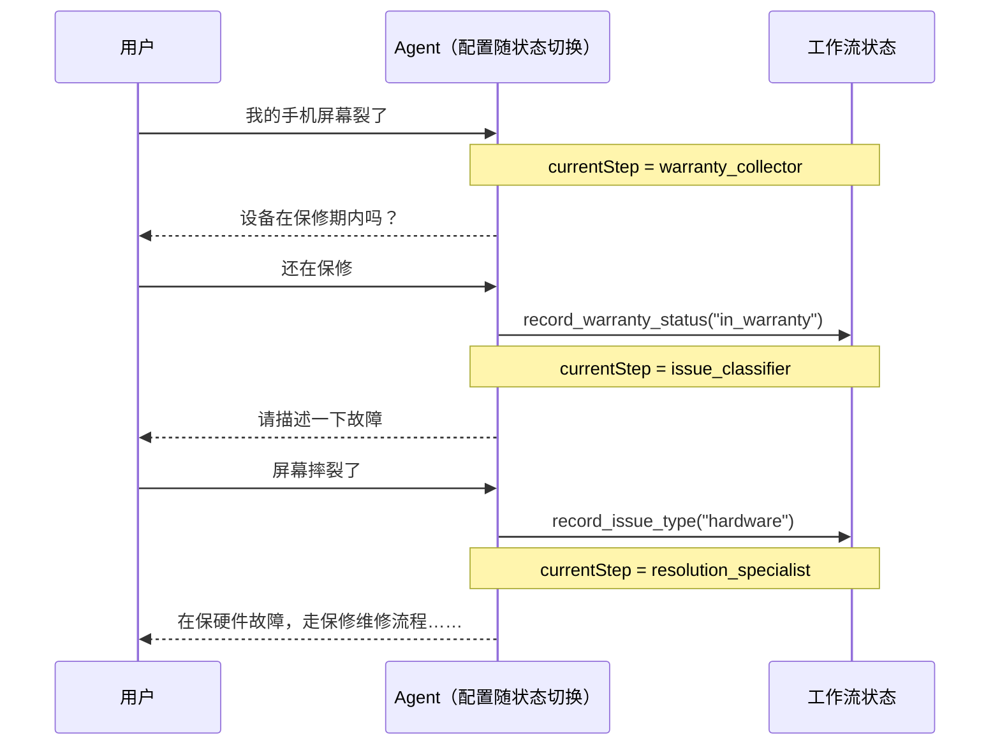
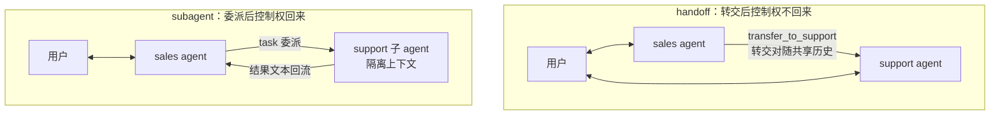

import { Canvas, Controls, Meta } from '@storybook/addon-docs/blocks';
import * as Handoffs from './handoffs.stories';

<Meta of={Handoffs} name="Docs" />

# 移交

本课讲 handoff（移交）：用一个工具调用，把**控制权和共享状态一起**交给下一个执行者。术语源自 OpenAI（`transfer_to_sales_agent` 这类工具调用）；在 LangChain JS 里它的核心机制是一句话——**工具返回 `Command` 更新一个跨轮持久的状态变量（`currentStep` 或 `activeAgent`），系统读这个变量换配置或换 agent**。它与「子代理」的委派是同一条多智能体轴上的两个方向：委派后控制权回到主 Agent，转交后控制权整个移走、不再回来。读完你应该能预测：一次转交发生时，谁接着面对用户、消息历史流向哪里、轮次怎样终结。



| 关键点 | 取值 / 默认 | 回查要点 |
| --- | --- | --- |
| 状态变量 | 单 agent 用 `currentStep`；多 agent 用 `activeAgent` | 工具在 `Command.update` 里写它；中间件或条件边读它 |
| 转交工具 schema | `z.object({})` | 目标在创建工具时写死；模型只决定调不调，依据是 `description` |
| `Command.update.messages` | 必含配对的 `ToolMessage`（`tool_call_id` 一致） | 多 agent 转交还要带上触发转交的 `AIMessage` |
| `Command.graph` | `Command.PARENT` | 工具在 agent 子图内运行，路由目标却是父图节点 |
| 终局判断 | 最后一条 `AIMessage` 无 `tool_calls` → `END` | 归还控制权给用户时，最后一条必须是 `AIMessage` |
| `createHandoffTool` | 只在 `@langchain/langgraph-supervisor` / `-swarm` | 工具名自动生成 `transfer_to_<agent_name>`；`addHandoffMessages` 默认 `true` |
| 状态持久化 | `checkpointer` + 同一 `thread_id` | 没有它，`currentStep` / `activeAgent` 跨轮即失 |

## 控制权的分界

「概览与路由」一课把 handoffs 定位为"按状态把控制权整体移交给另一个 agent"，把 subagents 定位为"主 agent 把子 agent 当工具调用"（task 委派的写法归[「子代理」](?path=/docs/subagents--docs)一课）。落到可观察的行为上，分界只看一件事：**这次协作结束后，控制权在哪**。

| 维度 | handoff 转交 | subagent 委派 |
| --- | --- | --- |
| 控制权 | 随转交整体移走，发起方退出本轮回路 | 始终在主 Agent，子 agent 只是它调用的工具 |
| 消息历史 | 一份共享历史，跨转交延续 | 子 agent 在隔离气泡里另起历史，只有结果回流 |
| 谁面对用户 | 当前持有控制权的 agent 直接对话 | 主 Agent 汇总后答复 |
| 轮次终结 | 持有者输出无 `tool_calls` 的 `AIMessage` | 主 Agent 拿到工具结果后继续 |
| 典型场景 | 客服分流、话题随对话转移 | 并行调研、大上下文子任务 |



把两种模式放进同一个确定性模拟里对照。转交与委派的判断在范例里用查表脚本模拟（真实实现就是正文下面的工具 + `Command`）：

<Canvas of={Handoffs.Interactive} />
<Controls of={Handoffs.Interactive} />

| 读者操作 | 可观察证据 |
| --- | --- |
| 场景「登录故障」保持「handoff 转交」 | 控制权条在 `transfer_to_support` 处由蓝变绿：sales 转交后不再发言，support 直接向用户追问；共享历史读数含转交前的全部消息 |
| 同场景切到「subagent 委派」 | 控制权条全程蓝色；support 只出现在隔离气泡里，气泡内 3 条消息不进主上下文（读数从 6 条降到 4 条），由 sales 综合答复用户 |
| 场景「价格加故障」保持「handoff 转交」 | 出现 sales→support→sales 两次转交（A→B→A 乒乓回环），最后一段回到 sales，以无 `tool_calls` 的 `AIMessage` 终局 |
| 场景「购买咨询」对比两种模式 | 轨迹完全相同、转移次数都是 0——不需要转移控制权时，两种模式都没有额外开销 |
| 打开 Show code | 看到该 Canvas 实际执行的 `example.ts`：纯 TS 确定性模拟，不依赖 `@langchain/*` |

这张对照表就是本课核心判断的可观察形态：**选模式，实质是在选控制权和消息历史怎么分**。委派换隔离与并行，转交换直接面对用户的连续对话。

## 转交工具

两种实现路径共用同一个最小机制：一个普通 `tool()`，内部不返回字符串，而是返回 `Command`——用 `update` 改写状态变量，触发转移。

```ts
// 转交工具的最小形态：tool() 内返回 Command，把状态变量改写为下一个执行者
// （承接下方客服状态机 SupportState，完整可运行版本见下一节）
import { tool, ToolMessage, type ToolRuntime } from 'langchain';
import { Command } from '@langchain/langgraph';
import { z } from 'zod';

const transferToSpecialist = tool(
  async (_, config: ToolRuntime<typeof SupportState.State>) =>
    new Command({
      update: {
        messages: [
          // ToolMessage 与触发转交的 tool_call 配对，补全请求-响应循环
          new ToolMessage({
            content: 'Transferred to specialist',
            tool_call_id: config.toolCallId,
          }),
        ],
        currentStep: 'specialist', // 状态变量改写：下一次模型调用即换配置
      },
    }),
  {
    name: 'transfer_to_specialist',
    // 描述即路由依据：模型读它判断何时转交
    description: 'Transfer to the specialist agent.',
    schema: z.object({}), // 无输入参数：目标在创建时写死
  },
);
```

三个设计要点都藏在参数里：

- **`description` 是路由依据。** 模型看不到你的状态机，它依据工具描述决定何时调用；描述要写清"什么情况下转"，而不是重复目标名字。概览课的 supervisor 用结构化输出选目标，handoff 用工具描述选目标——判断都交给了模型，载体不同。
- **`schema: z.object({})`，目标创建时写死。** JS 里一个转交工具对应一个固定目标（`name` 与目标对应，多 agent 版还直接 `goto` 到目标节点名）；模型选了工具就是选了目标。要"一个工具、多个目标"，就得自己把目标放进 schema 并在实现里校验——官方 JS 文档没有这种形态，不建议自造。
- **`ToolMessage` 不是装饰。** LLM 发起工具调用后会等待响应；`ToolMessage` 用匹配的 `tool_call_id` 补全这个请求-响应循环，缺了它对话历史就是畸形的，下一个读历史的模型可能直接报错。只要转交工具更新 `messages`，就必须带上它。

输入参数还有另一种形态：**收集数据与触发转交合并在同一个工具里**。下面的 `record_warranty_status` 用 `status` 参数既写入业务状态、又把 `currentStep` 推到下一步——参数本身就是转交的触发信号，这是客服教程的关键写法。

## 单 Agent 状态机

官方 JS 文档给出两种实现路径：**单 agent + middleware**（一个 agent，状态驱动换配置）和**多 agent subgraphs**（多个独立 agent 互转）。官方的建议很明确：大多数 handoffs 场景用前者，更简单。下面是官方 customer support 教程的精炼——一个客服 agent 按三步推进：收保修信息 → 分类问题 → 给出方案，`currentStep` 是状态机的轴。

```ts
// support-state-machine.ts —— 官方 customer support 教程精炼：
// 单 agent + currentStep 状态机：工具更新状态并推进流程，中间件按状态
// 换系统提示与工具集，checkpointer 让状态跨轮存活。
// 运行条件：npm i langchain @langchain/langgraph @langchain/openai zod dotenv，
// .env 配置 OPENAI_API_KEY，然后 npx tsx support-state-machine.ts。
import 'dotenv/config';
import { z } from 'zod';
import {
  createAgent,
  createMiddleware,
  tool,
  ToolMessage,
  HumanMessage,
  type ToolRuntime,
} from 'langchain';
import { Command, MemorySaver, StateSchema } from '@langchain/langgraph';
import { ChatOpenAI } from '@langchain/openai';

// 1. 状态：currentStep 是状态机的轴，另外两个字段是随流程收集的数据
const SupportStep = z.enum([
  'warranty_collector',
  'issue_classifier',
  'resolution_specialist',
]);
const WarrantyStatus = z.enum(['in_warranty', 'out_of_warranty']);
const IssueType = z.enum(['hardware', 'software']);

const SupportState = new StateSchema({
  currentStep: SupportStep.optional(),
  warrantyStatus: WarrantyStatus.optional(),
  issueType: IssueType.optional(),
});

// 2. 状态更新工具：写业务数据 + 推进 currentStep（转交就发生在这个 Command 里）
const recordWarrantyStatus = tool(
  async ({ status }, config: ToolRuntime<typeof SupportState.State>) =>
    new Command({
      update: {
        messages: [
          new ToolMessage({
            content: `Warranty status recorded as: ${status}`,
            tool_call_id: config.toolCallId, // 与 tool_call 配对
          }),
        ],
        warrantyStatus: status,
        currentStep: 'issue_classifier', // 状态转移
      },
    }),
  {
    name: 'record_warranty_status',
    description:
      "Record the customer's warranty status and transition to issue classification.",
    schema: z.object({ status: WarrantyStatus }), // 输入参数同时是收集的数据
  },
);

const recordIssueType = tool(
  async ({ issueType }, config: ToolRuntime<typeof SupportState.State>) =>
    new Command({
      update: {
        messages: [
          new ToolMessage({
            content: `Issue type recorded as: ${issueType}`,
            tool_call_id: config.toolCallId,
          }),
        ],
        issueType,
        currentStep: 'resolution_specialist',
      },
    }),
  {
    name: 'record_issue_type',
    description:
      'Record the type of issue and transition to resolution specialist.',
    schema: z.object({ issueType: IssueType }),
  },
);

// 3. 普通工具：不推进状态，只在当前步内使用
const provideSolution = tool(
  async ({ solution }) => `Solution provided: ${solution}`,
  {
    name: 'provide_solution',
    description: 'Provide a solution to the customer.',
    schema: z.object({ solution: z.string() }),
  },
);

const escalateToHuman = tool(
  async ({ reason }) => `Escalating to human support. Reason: ${reason}`,
  {
    name: 'escalate_to_human',
    description: 'Escalate the case to a human support specialist.',
    schema: z.object({ reason: z.string() }),
  },
);

// 4. 回退工具：只改 currentStep，允许用户更正信息
//（go_back_to_classification 同构，换目标步骤即可）
const goBackToWarranty = tool(
  async () => new Command({ update: { currentStep: 'warranty_collector' } }),
  {
    name: 'go_back_to_warranty',
    description: 'Go back to warranty verification step.',
    schema: z.object({}),
  },
);

// 5. 每步配置：提示 + 工具 + 前置依赖，一张表看清整个工作流
const WARRANTY_PROMPT = `你是设备售后客服。当前阶段：保修确认。
任务：问候客户，询问设备是否在保修期内，然后用 record_warranty_status 记录并进入下一步。
一次只问一个问题。`;

const CLASSIFIER_PROMPT = `你是设备售后客服。当前阶段：问题分类。客户保修状态：{warrantyStatus}。
任务：请客户描述故障，判断是 hardware（物理损坏）还是 software（崩溃、性能），
然后用 record_issue_type 记录并进入下一步。不确定时先追问。`;

const RESOLUTION_PROMPT = `你是设备售后客服。当前阶段：解决方案。保修状态：{warrantyStatus}，问题类型：{issueType}。
任务：software 问题用 provide_solution 给排查步骤；hardware 且在保用 provide_solution 说明保修维修；
hardware 且过保用 escalate_to_human。客户说信息填错了，用 go_back_to_warranty 回退。`;

const STEP_CONFIG = {
  warranty_collector: {
    prompt: WARRANTY_PROMPT,
    tools: [recordWarrantyStatus],
    requires: [] as const,
  },
  issue_classifier: {
    prompt: CLASSIFIER_PROMPT,
    tools: [recordIssueType],
    requires: ['warrantyStatus'] as const,
  },
  resolution_specialist: {
    prompt: RESOLUTION_PROMPT,
    tools: [provideSolution, escalateToHuman, goBackToWarranty],
    requires: ['warrantyStatus', 'issueType'] as const,
  },
} as const;

// 6. 中间件：每轮读 currentStep，套用对应配置（wrapModelCall 基础见「中间件」一课）
const applyStepMiddleware = createMiddleware({
  name: 'applyStep',
  stateSchema: SupportState,
  wrapModelCall: async (request, handler) => {
    const step = request.state.currentStep ?? 'warranty_collector';
    const stepConfig = STEP_CONFIG[step];
    // 校验前置数据：requires 声明的字段没收集齐就到了这一步，直接报错
    for (const key of stepConfig.requires) {
      if (request.state[key] === undefined) {
        throw new Error(`${key} must be set before reaching ${step}`);
      }
    }
    // 把状态值填进提示词占位符
    let systemPrompt: string = stepConfig.prompt;
    for (const [key, value] of Object.entries(request.state)) {
      systemPrompt = systemPrompt.replaceAll(`{${key}}`, String(value ?? ''));
    }
    return handler({ ...request, systemPrompt, tools: [...stepConfig.tools] });
  },
});

// 7. 组装：checkpointer 让 currentStep 跨轮存活（机制见「持久化」一课）
const model = new ChatOpenAI({ model: 'gpt-4o-mini' });
const agent = createAgent({
  model,
  tools: [
    recordWarrantyStatus,
    recordIssueType,
    provideSolution,
    escalateToHuman,
    goBackToWarranty,
  ],
  stateSchema: SupportState,
  middleware: [applyStepMiddleware],
  checkpointer: new MemorySaver(),
});

// 8. 四轮对话：同一 thread_id 延续，观察 currentStep 一步步推进
const config = { configurable: { thread_id: 'support-demo-1' } };
const turns = [
  '你好，我的手机屏幕裂了',
  '还在保修期内',
  '摔了一下，屏幕物理开裂',
  '请问我该怎么办？',
];

for (const [index, text] of turns.entries()) {
  const result = await agent.invoke(
    { messages: [new HumanMessage(text)] },
    config,
  );
  const reply = result.messages.at(-1)?.content ?? '';
  console.log(`Turn ${index + 1} · currentStep = ${result.currentStep} · ${reply}`);
}
```

运行后 `currentStep` 依次推进：`warranty_collector` → （记录保修后）`issue_classifier` → （分类后）`resolution_specialist`，第四轮给出在保硬件的保修维修指引。整个循环的官方表述值得背下来：**工具驱动工作流（更新 `currentStep`），中间件响应（下一轮换配置）**——转交不再发生在 agent 之间，而发生在同一个 agent 的配置之间；消息历史天然连续，没有跨 agent 的上下文搬运问题。

三个高频配套件：

- **`checkpointer` 不是可选项。** 没有它，两次 `invoke` 之间 `currentStep` 丢失，工作流每轮都退回第一步。
- **`requires` 把顺序约束变成硬校验。** 保修没记录就到分类步，中间件直接抛错——"前置条件满足才解锁能力"由代码保证，不靠模型自觉。
- **回退要克制。** 官方提示：如果工作流需要任意两步互跳，先反思是否真的需要结构化工作流；这个模式最适合"清晰的顺序推进 + 偶尔的回退修正"。

对话变长时，用 `SummarizationMiddleware` 压缩早期消息（如 `trigger: { tokens: 4000 }, keep: { messages: 10 }`），写法见[「短期记忆」](?path=/docs/short-term-memory--docs)。

## 多 Agent 转交

当每个"状态"需要的是**定制 agent 实现**（自带反思、检索步骤的复杂图节点）时，才升级到多 agent subgraphs：每个 agent 是父图的一个节点，转交工具用 `Command.PARENT` 从 agent 子图内部直接改走父图的边。官方对这条路径有一句明确警告：单 agent 模式下消息历史自然流动，而 subgraph 转交**必须显式决定哪些消息过境**——弄错就是畸形历史或膨胀上下文。

```ts
// multi-agent-handoff.ts —— 多 agent 转交：sales 与 support 互为图中节点，
// 转交工具带 Command.PARENT 路由父图；路由器判断终局或续转。
// 运行条件：npm i langchain @langchain/langgraph @langchain/openai zod dotenv，
// .env 配置 OPENAI_API_KEY，然后 npx tsx multi-agent-handoff.ts。
import 'dotenv/config';
import { z } from 'zod';
import {
  createAgent,
  AIMessage,
  ToolMessage,
  tool,
  type ToolRuntime,
} from 'langchain';
import {
  Command,
  END,
  START,
  StateGraph,
  StateSchema,
  MessagesValue,
} from '@langchain/langgraph';
import { ChatOpenAI } from '@langchain/openai';

// 1. 父图状态：共享消息历史 + 当前持有控制权的 agent
const MultiAgentState = new StateSchema({
  messages: MessagesValue,
  activeAgent: z.string().optional(),
});

// 2. 双向转交工具：A→B 与 B→A 成对出现，构成乒乓通道
function makeTransfer(target: 'sales_agent' | 'support_agent') {
  return tool(
    async (_, runtime: ToolRuntime<typeof MultiAgentState.State>) => {
      // 触发转交的 AIMessage：必须随转交给接收方，否则对方看到不完整会话
      const lastAiMessage = [...runtime.state.messages]
        .reverse()
        .find(AIMessage.isInstance);
      // 人工 ToolMessage：与 tool_call 配对，补全请求-响应循环
      const transferMessage = new ToolMessage({
        content: `Transferred to ${target}`,
        tool_call_id: runtime.toolCallId,
      });
      return new Command({
        goto: target,
        update: {
          activeAgent: target, // 控制权随转交移交
          // 只传转交对，不传当前 agent 的全部历史
          messages: [lastAiMessage, transferMessage].filter(Boolean),
        },
        graph: Command.PARENT, // 工具在 agent 子图内，目标是父图节点
      });
    },
    {
      name: `transfer_to_${target}`,
      description: `Transfer to the ${target}.`,
      schema: z.object({}),
    },
  );
}

const model = new ChatOpenAI({ model: 'gpt-4o-mini' });

// 3. 两个 agent：各持指向对方的转交工具，提示词写清何时转出
const salesAgent = createAgent({
  model,
  tools: [makeTransfer('support_agent')],
  systemPrompt:
    'You are a sales agent. Help with pricing and purchasing. ' +
    'If asked about technical issues, transfer to the support agent.',
});
const supportAgent = createAgent({
  model,
  tools: [makeTransfer('sales_agent')],
  systemPrompt:
    'You are a support agent. Help with technical issues. ' +
    'If asked about pricing or purchasing, transfer to the sales agent.',
});

// 4. 节点函数：把父图状态交给对应 agent（StateGraph 基础见「Graph API」一课）
const callSales = async (state: typeof MultiAgentState.State) =>
  salesAgent.invoke(state);
const callSupport = async (state: typeof MultiAgentState.State) =>
  supportAgent.invoke(state);

// 5. 终局判断：最后一条 AIMessage 不带 tool_calls，说明 agent 决定答复用户
const routeAfterAgent = (state: typeof MultiAgentState.State) => {
  const lastMsg = state.messages.at(-1);
  if (lastMsg instanceof AIMessage && !lastMsg.tool_calls?.length) {
    return END; // 归还控制权给用户
  }
  return (state.activeAgent ?? 'sales_agent') as 'sales_agent' | 'support_agent';
};

const routeInitial = (state: typeof MultiAgentState.State) =>
  (state.activeAgent ?? 'sales_agent') as 'sales_agent' | 'support_agent';

// 6. 组图：入口按 activeAgent 分发，agent 之后判断终局或续转
const graph = new StateGraph(MultiAgentState)
  .addNode('sales_agent', callSales)
  .addNode('support_agent', callSupport)
  .addConditionalEdges(START, routeInitial, ['sales_agent', 'support_agent'])
  .addConditionalEdges('sales_agent', routeAfterAgent, [
    'sales_agent',
    'support_agent',
    END,
  ])
  .addConditionalEdges('support_agent', routeAfterAgent, [
    'sales_agent',
    'support_agent',
    END,
  ])
  .compile();

const result = await graph.invoke({
  messages: [
    { role: 'user', content: "Hi, I'm having trouble with my account login." },
  ],
});
for (const msg of result.messages) {
  console.log(msg.content);
}
```

对照 Canvas 里「价格加故障」的轨迹读这段代码：用户先到默认的 sales；话题转到技术问题，sales 调 `transfer_to_support_agent`，`Command` 同时把 `activeAgent` 改成 support 并 `goto` 过去；support 处理完再被问价格，就调反方向的工具转回来——**A→B→A 的乒乓不是特殊机制，就是成对的转交工具加两边都写清"何时转出"的提示词**。每一跳之后 `routeAfterAgent` 都做一次终局判断：最后一条消息是 `AIMessage` 且没有 `tool_calls`，说明持有者决定直接答复用户，图到 `END`。

`Command.PARENT` 是这段代码里唯一的新面孔：概览课里 supervisor 的 `Command({ goto })` 路由的是自己图里的节点，而这里的转交工具运行在 agent 自己的子图内，`goto` 的目标却是父图的节点——`graph: Command.PARENT` 就是这次"越级路由"的声明。

转交时携带什么，官方给了三条纪律：

- **成对携带。** 触发转交的 `AIMessage`（含 `tool_call`）与人工 `ToolMessage` 必须一起过境，少了任何一半，接收方看到的就是残缺会话。
- **只传转交对，不传全部历史。** 上面的示例假设没有并行工具调用，直接取最后一条 `AIMessage`；把当前 agent 的全部消息都塞过去，接收方会被无关的内部推理干扰，token 也白花。
- **要背景就摘要。** 接收方需要更多上下文时，把摘要写进 `ToolMessage` 的 `content`，而不是搬运原始历史。

最后一条与终局判断互为镜像：**转交给下一个 agent 时补全工具调用对；归还控制权给用户时，确保最后一条是 `AIMessage`**——界面的"回合结束"信号和历史的合法性都系在它身上。

## createHandoffTool 预制件

上面两节的转交工具都是手写的。LangChain JS 另有预制的 `createHandoffTool`，但它**不在核心包里**（`langchain` 与 `@langchain/langgraph` 均无此导出，本地 1.2.x 与 npm 最新版一致），而是随两个多智能体库发布：

| 包 | 用法定位 |
| --- | --- |
| `@langchain/langgraph-swarm` | 对等转交：`createSwarm` 组网，agent 之间互转（本课模式的成品形态） |
| `@langchain/langgraph-supervisor` | supervisor 转交：`createSupervisor({ outputMode: 'handoff' })`，由 supervisor 把整段对话转给 worker |

签名与行为（与两库源码核对）：

- `agentName`：目标 agent 的节点名，**创建时写死**；工具名自动生成为 `transfer_to_<agent_name>`（空白转下划线、转小写）。它必须与图中节点名一致，否则 `goto` 无处可去。
- `description`：可选，默认 `Ask agent '<agentName>' for help`——这行字就是模型的路由依据，生产环境几乎总要重写成"什么情况转"。
- schema 固定为 `z.object({})`：与手写版一致，一个工具一个目标，没有多目标输入形态。
- 返回的 `Command` 自动带上转交对：`addHandoffMessages`（supervisor 版参数，默认 `true`）为 `false` 时会把发起转交的 `AIMessage` 和 `ToolMessage` 都从接收方历史中剔除——上下文工程的快捷开关。

swarm 库把整套机制打包：

```ts
// swarm 预制件组合：createHandoffTool 生成转交工具，createSwarm 搭好
// activeAgent 状态与路由，checkpointer 记住上次活跃的 agent。
// 运行条件：npm i @langchain/langgraph-swarm @langchain/langgraph @langchain/openai，
// .env 配置 OPENAI_API_KEY。
import 'dotenv/config';
import { ChatOpenAI } from '@langchain/openai';
import { MemorySaver } from '@langchain/langgraph';
import { createReactAgent } from '@langchain/langgraph/prebuilt';
import { createSwarm, createHandoffTool } from '@langchain/langgraph-swarm';

const model = new ChatOpenAI({ model: 'gpt-4o-mini' });

// 一个工具对应一个目标；不写 description 时默认 "Ask agent 'support_agent' for help"
const transferToSupport = createHandoffTool({
  agentName: 'support_agent',
  description: 'Transfer to the support agent for technical issues.',
});
const transferToSales = createHandoffTool({ agentName: 'sales_agent' });

// swarm 库目前推荐 createReactAgent（而非 langchain 的 createAgent），
// name 必须与 agentName 一致，编译出的图节点以此命名
const salesAgent = createReactAgent({
  llm: model,
  tools: [transferToSupport],
  prompt: 'You are a sales agent. Transfer to support for technical issues.',
  name: 'sales_agent',
});
const supportAgent = createReactAgent({
  llm: model,
  tools: [transferToSales],
  prompt: 'You are a support agent. Transfer to sales for pricing.',
  name: 'support_agent',
});

// createSwarm 搭好整个 handoff 图：activeAgent 状态 + 入口条件路由 + 转交边
const workflow = createSwarm({
  agents: [salesAgent, supportAgent],
  defaultActiveAgent: 'sales_agent',
});
const app = workflow.compile({ checkpointer: new MemorySaver() });

// 同一 thread_id 的下一轮会从上次活跃的 agent 继续——有状态转交的卖点
const result = await app.invoke(
  { messages: [{ role: 'user', content: '登录有故障' }] },
  { configurable: { thread_id: 'swarm-demo-1' } },
);
console.log(result.messages.at(-1)?.content);
```

手写版与预制件的取舍：手写版逐字控制 `Command.update` 里过境的消息（本课多 agent 一节的三条纪律），预制件替你处理好转交对与 `activeAgent` 路由、还附带跨轮记忆——用哪个，取决于你对"转交时携带什么"的定制需求有多细。

## 最佳实践

- 实现路径先选单 agent + middleware：官方明确说它覆盖大多数 handoffs 场景且更简单；只有每个状态需要定制 agent 实现（复杂图节点）才上多 agent subgraphs。
- 转交工具的 `description` 写"何时转"（路由依据），工具名与目标节点名共用一份常量；提示词里同步写清何时转出——乒乓是否收敛主要取决于这两处文案。
- 上下文过滤按角色决定：完整历史、过滤片段还是摘要；subgraph 转交默认只带转交对，背景信息摘要进 `ToolMessage` 的 `content`，不搬运原始子历史。
- 工具语义保持单一：`transfer_to_sales()` 只路由，还是顺手创建工单？官方建议把副作用拆成单独动作，转交工具只负责控制权。
- 单 agent 状态机给每步声明 `requires` 前置依赖，让顺序约束由校验错误保证，而不是祈祷模型不跳步。

## 常见问题

- 转交后目标 agent 报错或答非所问，像是没看到之前的对话？
  先查转交对。`Command.update.messages` 里要同时有触发转交的 `AIMessage`（含 `tool_call`）和 `tool_call_id` 匹配的 `ToolMessage`；少任何一半，接收方读到的就是残缺会话。单 agent 版只需 `ToolMessage`，多 agent 版两者都要。
- 多 agent 转交图要么一轮就结束、要么两个 agent 无限互转？
  看终局判断和提示词。`routeAfterAgent` 的条件是"最后一条 `AIMessage` 无 `tool_calls`"——agent 决定直接答复时图才会到 `END`；无限乒乓通常是两边提示词都只写"不归我管就转走"，没有任何一方被指示"能答就直接答"。
- 第二轮 `invoke` 之后 agent 忘了流程，从第一步重新问起？
  状态没持久化。`currentStep` / `activeAgent` 都靠 checkpointer 跨轮存活，且每轮要用同一个 `thread_id`；没有 checkpointer，每次调用都是全新状态。
- 从 `langchain` 或 `@langchain/langgraph` 导入 `createHandoffTool` 报"没有导出的成员"？
  它不在核心包里。安装 `@langchain/langgraph-swarm`（对等转交）或 `@langchain/langgraph-supervisor`（supervisor 转交）后从对应包导入。
- 单 agent 状态机一轮就把保修、故障、方案全问完，步骤形同虚设？
  两处加固：提示词里写明"一次只问一个问题、收集完本步信息立即调用记录工具"；每步只挂该步的工具（中间件已经按 `STEP_CONFIG` 裁剪工具集，工具不可用就是硬约束）。

## 总结回顾

摘要：

handoff 的全部机制围绕一个状态变量展开：转交工具返回 `Command` 写它，中间件或条件边读它。单 agent 状态机里它是 `currentStep`——工具更新状态并推进流程，中间件在下一轮换提示与工具，消息历史天然连续，官方推荐它覆盖大多数场景；多 agent 转交里它是 `activeAgent`——`Command.PARENT` 让 agent 子图内的工具直接路由父图节点，A→B→A 的乒乓由成对的转交工具与双向提示词构成，每一跳后用"最后一条 `AIMessage` 无 `tool_calls`"判断终局。与 subagent 委派的分界始终是控制权：转交整体移走、共享历史延续；委派后回传结果、子代理在隔离上下文工作。转交时携带什么是多 agent 版的命门——成对携带转交消息、只传转交对、背景写进 `ToolMessage` 摘要。预制件 `createHandoffTool` 不在核心包，随 `@langchain/langgraph-swarm` / `-supervisor` 发布：目标创建时写死、描述即路由依据，`createSwarm` 把状态、路由与转交边整套搭好。

一句话：

> handoff 转移的不是任务而是控制权：一次工具调用把状态变量改写，配置或 agent 随之整体换岗，直到持有者用一条不带 `tool_calls` 的回复把控制权还给用户。

知识要点：

- handoff 与 subagent 委派在控制权、消息历史、面向用户和轮次终结上各差在哪？
- 转交工具的最小形态是什么？为什么 `ToolMessage` 的 `tool_call_id` 配对不可省？
- 单 agent 状态机里 `currentStep`、`STEP_CONFIG.requires`、checkpointer 各承担什么？
- 多 agent 转交为什么需要 `Command.PARENT`？终局判断的条件是什么？
- A→B→A 的乒乓靠什么构成？怎样让它收敛？
- 转交时应该携带哪些消息？为什么不能把当前 agent 的全部历史都传过去？
- `createHandoffTool` 在哪些包里？`agentName`、`description`、`addHandoffMessages` 各决定什么？

## 参考资料

- [Handoffs（官方：状态变量机制、单 agent middleware 与多 agent subgraphs 两条路径、上下文工程与实现考量）](https://docs.langchain.com/oss/javascript/langchain/multi-agent/handoffs)
- [Build customer support with handoffs（官方教程：currentStep 状态机、STEP_CONFIG、step middleware、checkpointer 与 go back）](https://docs.langchain.com/oss/javascript/langchain/multi-agent/handoffs-customer-support)
- [@langchain/langgraph-swarm（createHandoffTool / createSwarm 的 API 参考与 swarm 模式说明）](https://reference.langchain.com/javascript/langchain-langgraph-swarm)
- [@langchain/langgraph-supervisor（createHandoffTool 与 supervisor 的 handoff outputMode）](https://reference.langchain.com/javascript/langchain-langgraph-supervisor)
- [langgraphjs handoff.ts 源码（createHandoffTool 签名与默认值核对）](https://github.com/langchain-ai/langgraphjs/blob/main/libs/langgraph-swarm/src/handoff.ts)
