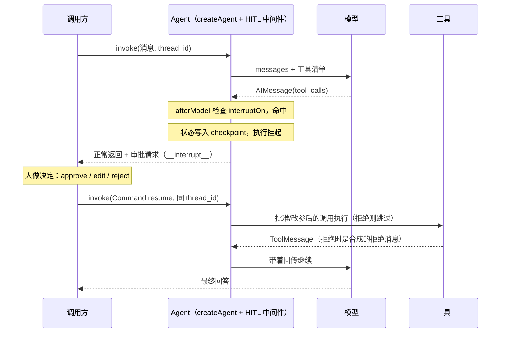

import { Canvas, Controls, Meta } from '@storybook/addon-docs/blocks';
import * as HumanInTheLoop from './human-in-the-loop.stories';

<Meta of={HumanInTheLoop} name="Docs" />

# 人机协同

Agent 的工具里有一类动作一旦执行就收不回来：发邮件、删数据、转账、下单。[工具](?path=/docs/tools--docs)一课讲过核心分离——模型只产出调用意图，运行时才执行函数。人机协同（human-in-the-loop，HITL）就插在这两半之间：`humanInTheLoopMiddleware` 在模型产出 `tool_calls` 之后、工具真正执行之前发起 interrupt，把「要不要照做」交给人裁决。本课沿这条线讲清：拦在哪一步、`interruptOn` 怎么配、拦下后 invoke 返回什么（`__interrupt__`）、怎么批准/改参/拒绝并恢复（`Command` resume）、以及无状态部署下靠什么找回挂起的执行（`thread_id`）。读完你应该能预测：给某个工具配上审批后再 invoke，调用会停在哪一步、你手里多出什么、三种决定各把执行推向什么结果。



关键输入与默认值（已与官方文档和 `langchain` 1.x 源码核对）：

| 输入 | 默认值 / 取值 | 回查要点 |
| --- | --- | --- |
| `interruptOn` | 必填，缺省时中间件不做任何事 | 工具名 → `true` / `false` / 配置对象；**未列出的工具自动执行** |
| `true` | — | 暂停审批，允许 approve / edit / reject 全部三种决定 |
| `false`（或未列出） | 自动执行 | 不进入审批请求，工具照常运行 |
| `allowedDecisions` | 配置对象形式必填 | `['approve', 'edit', 'reject']` 的子集，限定该工具允许的决定 |
| `descriptionPrefix` | `'Tool execution requires approval'` | 组装为 `{prefix}\n\nTool: {name}\nArgs: {JSON}`；工具自定义 `description` 时被忽略 |
| `description` | 无（用上面的模板） | 字符串，或 `(toolCall, state, runtime) => string` 动态生成 |
| `when` | 无（该工具总是拦） | 按参数判定是否拦（如只拦非 SELECT 的 SQL）；需 `langchain >= 1.4.6` |
| 运行前提 | `checkpointer` + `thread_id` | 挂起存状态、恢复找状态都靠它们，缺一不可 |

## 快速上手

最小审批闭环：配置一个要审批的工具 → invoke 得到挂起的审批请求 → 人批准 → 恢复执行。工程沿用[安装](?path=/docs/installation--docs)一课，另需 `@langchain/langgraph`（提供 `Command`、`MemorySaver`）。把代码存成 `approval-loop.ts`，用 `npx tsx approval-loop.ts` 运行：

```ts
// approval-loop.ts —— 最小审批闭环：触发 interrupt → 人批准 → 恢复执行
// 运行条件：OPENAI_API_KEY 已写入 .env；npx tsx approval-loop.ts 运行。
import 'dotenv/config';
import * as z from 'zod';
import { ChatOpenAI } from '@langchain/openai';
import { MemorySaver, Command } from '@langchain/langgraph';
import { HumanMessage } from '@langchain/core/messages';
import {
  createAgent,
  humanInTheLoopMiddleware,
  tool,
  type HITLRequest,
  type Interrupt,
} from 'langchain';

const sendEmail = tool(
  async ({ to, subject }) => `Email sent to ${to}: "${subject}"`,
  {
    name: 'send_email',
    description: 'Send an email to the given address.',
    schema: z.object({
      to: z.string().describe('Recipient email address'),
      subject: z.string().describe('Email subject'),
    }),
  }
);

const agent = createAgent({
  model: new ChatOpenAI({ model: 'gpt-5.5' }),
  tools: [sendEmail],
  middleware: [
    humanInTheLoopMiddleware({
      interruptOn: {
        send_email: true, // 每次调用 send_email 前都暂停等人裁决
      },
    }),
  ],
  checkpointer: new MemorySaver(), // interrupt 依赖检查点保存挂起状态
});

// thread_id 是恢复指针：挂起与恢复必须用同一个
const config = { configurable: { thread_id: 'approval-demo-1' } };

async function main() {
  const result = await agent.invoke(
    {
      messages: [
        new HumanMessage('给 alice@example.com 发一封主题为「请假」的邮件。'),
      ],
    },
    config
  );

  // 挂起时 invoke 正常返回（不是抛异常），审批请求在 __interrupt__ 里
  const interrupt = result.__interrupt__?.[0] as
    | Interrupt<HITLRequest>
    | undefined;

  if (!interrupt) {
    console.log(result.messages.at(-1)?.content);
    return;
  }

  const [request] = interrupt.value.actionRequests;
  console.log(`等待审批: ${request.name}`, request.args);
  // => 等待审批: send_email { to: 'alice@example.com', subject: '请假' }

  // 人看过参数，批准：同 thread_id + Command resume 恢复执行
  const resumed = await agent.invoke(
    new Command({ resume: { decisions: [{ type: 'approve' }] } }),
    config
  );
  console.log(resumed.messages.at(-1)?.content);
  // => 已给 alice@example.com 发出主题为「请假」的邮件。（措辞因模型而异）
}

main();
```

审批闭环就这四步：配置策略 → invoke 拿到 `__interrupt__` → 人做决定 → `Command` resume 恢复。后面各节分别展开每一步里的选择与坑。

## 拦截点

审批拦在**模型产出意图之后、工具执行之前**——中间件的 `afterModel` 钩子恰好在两半之间运行。这个位置不是随手的：意图已经明确（`tool_calls` 里有名字、有参数，人审得有据），副作用还没发生（拦下来零成本），错过了它动作就不可撤销。拦下之后 Agent 不是崩溃也不是终止，而是**挂起**：LangGraph 把执行状态写入 checkpointer，无限期等待恢复。

「出问题再处理」有三层，各管一段，不要混用：

| 机制 | 谁判断 | 时机 | 归属 |
| --- | --- | --- | --- |
| HITL 审批 | **人**判断这次该不该做 | 工具执行前，事后无法替代 | 本课 |
| 护栏 | **规则**判断输入输出是否越界 | 请求进出模型时 | [护栏](?path=/docs/guardrails--docs) |
| 工具错误回传 | **模型**看到错误后自我修正 | 工具执行失败后 | [工具](?path=/docs/tools--docs) |

什么时候需要 HITL：动作不可撤销或有外部副作用（发邮件、写库、支付）、动作影响范围超出当前对话（删文件、改配置）、合规要求人签字。纯读操作（查询、检索）不需要拦。判断标准一句话：**如果这次调用做错了，人是唯一能兜底的，就该在人还能拦住的时候拦**。

`humanInTheLoopMiddleware` 本身是[中间件](?path=/docs/middleware--docs)体系里的一个预置中间件（`afterModel` 钩子）；本课只用它的现成能力，想自定义拦截位置与逻辑时去那一课。

两个容易踩的默认行为：

- 只挂 `humanInTheLoopMiddleware({})` 而不配 `interruptOn`，中间件什么都不做，等于没挂。
- 审批机制与模型提供方无关：拦截发生在运行时层，`@langchain/google-genai` 的模型链路原样可用，没有差异。

## interruptOn：配置审批策略

`interruptOn` 是「工具名 → 策略」的映射，三种取值：

```ts
humanInTheLoopMiddleware({
  interruptOn: {
    write_file: true,  // 暂停，允许 approve / edit / reject 全部三种决定
    execute_sql: {     // 配置对象：精确控制
      allowedDecisions: ['approve', 'reject'], // 不允许改参
      description: 'SQL execution requires DBA approval',
    },
    read_data: false,  // 显式自动执行
  },
  descriptionPrefix: 'Tool execution pending approval',
})
```

四条规则：

- **没列出的工具自动执行。** `interruptOn` 只收紧列出的工具，其余照常运行——新增高风险工具时记得补条目，这是白名单语义。
- `false` 与「未列出」效果相同，写出来是为了让读代码的人明确看到「这个工具评估过、放行」。
- 配置对象里 `allowedDecisions` 必填：不该改参的工具（如 SQL、支付）只留 `approve` / `reject`，从源头杜绝审批人改出危险参数。
- 模型并行调用多个被拦工具时，**合并为一次审批请求**（一个 `__interrupt__`，多个 `actionRequests`），同批未被拦的工具照常立即执行。

审批请求里给人的说明文字有三层来源：工具配置了 `description` 就用它（字符串，或 `(toolCall, state, runtime) => string` 动态生成，比如把参数拼进提示）；没配则用 `` `${descriptionPrefix}\n\nTool: ${name}\nArgs: ${JSON.stringify(args, null, 2)}` `` 模板。想让审批人一眼看到关键参数，用动态 description 自己拼。

只拦「部分调用」用 `when` 谓词按参数分级（需 `langchain >= 1.4.6`）：

```ts
import type { ToolCallRequest } from 'langchain';

// 只拦非只读 SQL：SELECT 直接放行，其余暂停审批
const isWriteQuery = (request: ToolCallRequest) =>
  !String(request.toolCall.args.query ?? '')
    .trimStart()
    .toUpperCase()
    .startsWith('SELECT');

humanInTheLoopMiddleware({
  interruptOn: {
    execute_sql: {
      allowedDecisions: ['approve', 'reject'],
      when: isWriteQuery, // 返回 false 的调用不进入审批请求
    },
  },
});
```

`when` 返回 `false` 的调用直接执行，不会出现在审批请求里——审批人只看到真正需要裁决的动作。另外，配置对象还接受 `argsSchema`（参数的 JSON schema），它会被带进审批请求的 `reviewConfigs`，供前端为「改参」渲染带类型的编辑表单。

## 挂起与 `__interrupt__`

从 invoke 到挂起，中间件走五步：模型返回 `AIMessage(tool_calls)` → `afterModel` 钩子逐个比对 `interruptOn` 策略 → 有命中就构造 `HITLRequest` 调用 LangGraph 的 `interrupt()` → 状态写入 checkpointer，执行无限期暂停 → invoke **正常返回**。最后一行最重要：挂起不是异常，`invoke` 的 Promise 正常 resolve，你从返回值里读审批请求。

返回值里两样东西值得看：

- `result.messages`：停在 `AIMessage(tool_calls)`——意图已经在了，`ToolMessage` 还没有（这就是「每个 tool_call 必须有配对回传」的暂停时刻，协议见[工具](?path=/docs/tools--docs)一课）。
- `result.__interrupt__`：`Interrupt` 数组，`value` 就是审批请求：

| 字段 | 装什么 | 用途 |
| --- | --- | --- |
| `value.actionRequests[]` | `{ name, args, description }` | 展示给审批人：哪个工具、什么参数、为什么拦 |
| `value.reviewConfigs[]` | `{ actionName, allowedDecisions, argsSchema? }` | 告诉前端这批动作允许哪些决定、改参表单长什么样 |

审批人决定之后，三种 resume 各自把执行推向不同结果——这是本课的核心对照，用下面的实例走一遍。

## 恢复执行：`Command` 与三种决定

恢复统一是同一种调用形态：`agent.invoke(new Command({ resume }), config)`，`config` 必须还是挂起时的那个 `thread_id`。`resume` 的载荷是 `HITLResponse`：

```ts
import { Command } from '@langchain/langgraph';

await agent.invoke(
  new Command({
    resume: {
      // decisions 与 actionRequests 一一对应、顺序一致
      decisions: [
        { type: 'approve' },
        { type: 'edit', editedAction: { name: 'send_email', args: { /* … */ } } },
        { type: 'reject', message: 'This action is not allowed' },
      ],
    },
  }),
  config
);
```

两条硬校验，不满足直接抛错：`decisions` 的**数量必须等于** `actionRequests` 的数量（模型并行调用多个被拦工具时，要逐个给决定），顺序与 `actionRequests` 一致；决定类型必须在该工具的 `allowedDecisions` 里。

### approve：原样执行

```ts
new Command({ resume: { decisions: [{ type: 'approve' }] } })
```

工具按模型原产出的参数执行，结果照常以 `ToolMessage` 回传、循环继续——与没有审批时完全一致，只是晚了一步。这是最常见的决定：审批的意义就在这一步的「晚」里。

### edit：改参后执行

```ts
new Command({
  resume: {
    decisions: [
      {
        type: 'edit',
        editedAction: {
          name: 'send_email', // 通常与原工具相同
          args: { to: 'bob@example.com', subject: '请假' }, // 改正后的参数
        },
      },
    ],
  },
})
```

`editedAction` 换掉执行时的名字与参数，但 `id` 保留原值——回传的 `ToolMessage` 仍与原 `tool_call` 配对，模型看到的就是「我请求的调用用修正后的参数执行了」。典型场景：审批人发现模型幻觉了错误收件人、金额单位不对，改完再放行。注意**保守修改**：大幅改写参数会让模型重新评估整个方案，可能重复调用工具或改走别的路径——edit 是纠错，不是重新编程；要换方案就用 reject 加说明。

### reject：不执行并回喂拒绝消息

```ts
new Command({
  resume: {
    decisions: [
      {
        type: 'reject',
        message: '收件人不在白名单。不要重试外发，向用户说明并建议内部中转。',
      },
    ],
  },
})
```

reject 做三件事：**工具不执行**；中间件**合成**一条与原 `tool_call` 配对的 `ToolMessage`，`content` 是你的 `message`（省略时用默认文案，如 `` User rejected the tool call for `send_email` with id call_1 ``），并带 `status: "error"`；流程**带着这条消息回到模型**，由模型消化拒绝原因后改道——向用户解释、换个安全方案，或放弃。`message` 是写给模型的行为指引：对副作用型工具，明确说出应该「放弃 / 追问用户 / 换安全替代」中的哪一个，默认文案只表达了「被拒了，别重试」。

下面的实例把三条恢复路径的消息流并排走一遍（纯 TS 确定性模拟，不发起真实模型调用，字段与文案对齐 `humanInTheLoopMiddleware` 的真实行为）：

<Canvas of={HumanInTheLoop.Interactive} />
<Controls of={HumanInTheLoop.Interactive} />

| 读者操作 | 可观察证据 |
| --- | --- |
| 拖动「回放步骤」到第 3 段 | 执行停在挂起点：messages 止于 `AIMessage(tool_calls)`，审批请求在 `__interrupt__`（虚线块不是 messages 成员） |
| 切换「恢复决定」为 `approve` | ToolMessage 是工具真实结果，最终回答确认已发送 |
| 切换为 `edit` | ToolMessage 标注 `editedAction` 改参后执行，`tool_call_id` 不变，结果按新收件人给出 |
| 切换为 `reject` | 工具未执行；合成 `status: "error"` 的拒绝 ToolMessage，模型向用户解释失败 |
| 打开 Show code | 看到该 Canvas 实际执行的 `example.ts` |

一个源码层面的边界：**一批决定里只要有 reject，同批 approve / edit 的调用也不会立即执行**——中间件改写该条 `AIMessage` 后直接回到模型重新规划，被批准的调用通常由模型重新发起。给「批准一个、拒绝一个」的混合批次做产品逻辑时，按「先回模型、再等下一轮」预期，不要假设批准的已经落盘执行。

## 恢复键：thread_id 与无状态部署

审批天然跨请求：invoke 挂起发生在一次 HTTP 请求里，用户点「批准」往往是**另一次**请求——那个进程里没有上一次执行的任何内存现场。恢复能成立，是因为挂起时状态已经写进 checkpointer，而 `thread_id` 就是指回这份检查点的键：同值复用 = 从挂起点继续；换新值 = 全新会话、空状态。审批场景里 thread_id 就是「待办审批单」的编号，从挂起请求里取出来，随审批决定一起带回：

```ts
// 审批回调（可能在另一个进程/实例上）：只靠 checkpointer + thread_id 恢复
async function handleApproval(threadId: string) {
  const config = { configurable: { thread_id: threadId } }; // 挂起时的同一个
  return agent.invoke(
    new Command({ resume: { decisions: [{ type: 'approve' }] } }),
    config
  );
}
```

部署形态决定 checkpointer 选型：`MemorySaver` 把状态放在**单进程内存**里，进程重启即丢、跨实例不可见——只适合本地原型与测试；多实例 / 无状态 API 场景必须换共享的持久化实现（`AsyncPostgresSaver`、`MongoDBSaver`），任何实例都能用同一 `thread_id` 恢复。还有一个输入形态约束：`new Command({ resume })` 是唯一设计为直接传给 `invoke` / `stream` 的 `Command` 用法，不要用 `update` / `goto` 之类的参数当输入。

checkpointer 与 thread 级消息历史的关系见[短期记忆](?path=/docs/short-term-memory--docs)；checkpointer 机制本身（快照、生产存储切换）归[持久化](?path=/docs/persistence--docs)一课。

## 流式下的审批

流式场景里挂起同样可感知：`streamEvents` 跑完后检查 `stream.interrupted`，审批请求在 `stream.interrupts` 里，决定后用 `Command` 再入一次流式即可（流式 API 的完整用法见[流式输出](?path=/docs/streaming--docs)）：

```ts
const config = { configurable: { thread_id: 'approval-demo-1' } };

// 一路流式到挂起点：token 照常输出，interrupted 标记暂停
const stream = await agent.streamEvents(
  { messages: [{ role: 'user', content: '给 alice@example.com 发一封请假邮件。' }] },
  { ...config, version: 'v3' }
);
for await (const message of stream.messages) {
  for await (const token of message.text) {
    process.stdout.write(token);
  }
}

if (stream.interrupted) {
  console.log(`\n等待审批: ${JSON.stringify(stream.interrupts)}`);
  // 展示审批 UI → 人做决定 → Command resume 再入流式，直到不再 interrupted
  const resumed = await agent.streamEvents(
    new Command({ resume: { decisions: [{ type: 'approve' }] } }),
    { ...config, version: 'v3' }
  );
  for await (const message of resumed.messages) {
    for await (const token of message.text) {
      process.stdout.write(token);
    }
  }
}
```

## 最佳实践

- **按不可撤销性圈审批范围**：只拦写操作与外部副作用，读操作直接放行；用 `when` 把「同工具的低危调用」也放出去。审批项越多，审批人越倾向于无脑全批，机制就失效了。
- **`allowedDecisions` 给最小集**：不该改参的工具（SQL、支付、删除）只留 `['approve', 'reject']`，从配置上杜绝改出危险参数。
- **reject 的 message 写成行为指引**：明确放弃、追问用户还是换安全替代；默认文案只说「被拒了，别重试」，对副作用型工具远远不够。
- **edit 保守纠错**：小修参数（改正收件人、金额）用 edit；要换方案就用 reject 说明意图，让模型自己重新规划。
- **生产换持久 checkpointer**：`MemorySaver` 仅限单进程原型；多实例或审批跨请求的服务用 `AsyncPostgresSaver` / `MongoDBSaver`，并把 `thread_id` 当作审批工单号随请求流转。

## 常见问题

- **挂了 `humanInTheLoopMiddleware`，工具却直接执行、没有暂停。**
  按顺序排查：`interruptOn` 的键是否与工具 `name` 逐字一致（工具用 snake_case，见[工具](?path=/docs/tools--docs)）；是否配了 `interruptOn`（缺省时中间件不做事）；本批调用是否全被 `when` 放行或本就未列出；最后确认 `createAgent` 传了 `checkpointer`、invoke 传了 `thread_id`——interrupt 的挂起与恢复都建立在持久化上。
- **恢复时抛 `Number of human decisions (1) does not match number of hanging tool calls (2)`。**
  模型并行调用了多个被拦工具，它们合并成一次审批请求，`decisions` 必须逐个给出且顺序与 `actionRequests` 一致。先打印 `actionRequests.length`，再按顺序构造决定数组。
- **恢复时抛 `Unexpected human decision: … Decision type 'edit' is not allowed`。**
  用了该工具 `allowedDecisions` 之外的决定类型。要么把类型加进该工具的 `allowedDecisions`，要么改用允许的类型（如先 reject 再让模型换方案）。
- **恢复后 Agent 像失忆了一样，从头开始新对话。**
  恢复时用了新的 `thread_id`。同值复用才从挂起的检查点继续，新值是全新空状态；把挂起请求的 `thread_id` 存下来随审批决定带回（见「恢复键」一节）。
- **同一批里批准了一个、拒绝了另一个，被批准的也没执行。**
  一旦同批有任何 reject，本轮不执行任何已批准调用：流程带着拒绝消息回到模型重新规划，被批准的通常由模型重新发起。这是中间件的既定行为，不是丢失批准。
- **reject 之后模型又发起了一模一样的调用。**
  拒绝消息太弱（或省略了 `message` 用默认文案）。在 `message` 里明确写出「不要重试这个工具，改用什么方式」，模型的重试倾向会显著下降。

## 总结回顾

摘要：

人机协同在「模型产出意图」与「运行时执行」之间插入人的裁决：`humanInTheLoopMiddleware` 的 `afterModel` 钩子在工具执行前比对 `interruptOn` 策略，命中则通过 LangGraph `interrupt()` 挂起，状态写入 checkpointer，invoke 正常返回，审批请求装在 `__interrupt__`（`actionRequests` + `reviewConfigs`）里。策略按工具名配置：`true` 全三种决定、`false` 与未列出自动执行、配置对象用 `allowedDecisions` 收窄、`description` 定制给人的说明、`when` 按参数分级（`langchain >= 1.4.6`）；多个命中合并为一次请求。恢复用同 `thread_id` 的 `new Command({ resume: { decisions } })`：approve 原样执行，edit 用 `editedAction` 改名改参（`id` 保留、回传仍配对），reject 不执行并合成 `status: "error"` 的拒绝 `ToolMessage` 回喂模型；decisions 数量与顺序必须与请求对齐，同批含 reject 时已批准的调用也会先回到模型。无状态与多实例部署下，恢复完全依赖持久 checkpointer 加 `thread_id` 这把恢复键，生产用 `AsyncPostgresSaver` / `MongoDBSaver`。流式场景用 `streamEvents` 的 `interrupted` / `interrupts` 感知挂起、`Command` 再入。更底层的 `interrupt` 原语与时间旅行归[中断与时间旅行](?path=/docs/interrupts-time-travel--docs)，输入输出规则校验归[护栏](?path=/docs/guardrails--docs)。

一句话：

> 审批不是打断 Agent，而是把执行挂起在检查点上——拦截靠策略、裁决靠人、恢复靠同一个 `thread_id` 加一条 `Command` resume。

知识要点：

- 审批拦在哪一步？为什么这个位置的代价最小？
- `interruptOn` 三种取值各是什么行为？未列出的工具怎么办？
- `allowedDecisions`、`description`、`when`、`argsSchema` 各控制什么？`descriptionPrefix` 的默认值与组装模板是什么？
- 挂起时 invoke 返回什么？`__interrupt__` 里有哪些字段？`messages` 停在哪条消息上？
- 三种决定各自把执行推向什么结果？reject 合成的 `ToolMessage` 长什么样（content、status、tool_call_id）？
- `decisions` 的数量与顺序有什么约束？不满足时抛什么错？
- 同批混合批准与拒绝时，被批准的调用会发生什么？
- 无状态 / 多实例场景靠什么恢复挂起的执行？`MemorySaver` 为什么不行？
- 流式场景怎么感知挂起并恢复？`Command` 哪个用法才是合法的 invoke 输入？

## 参考资料

- [Human-in-the-loop（LangChain.js 官方文档）](https://docs.langchain.com/oss/javascript/langchain/human-in-the-loop)
- [Interrupts（LangGraph.js 官方文档：挂起、thread_id 指针与 Command 恢复）](https://docs.langchain.com/oss/javascript/langgraph/interrupts)
- [langchainjs 仓库（humanInTheLoopMiddleware 实现：默认拒绝文案、混合批次行为，已在本地 1.2.26 源码核对）](https://github.com/langchain-ai/langchainjs)
