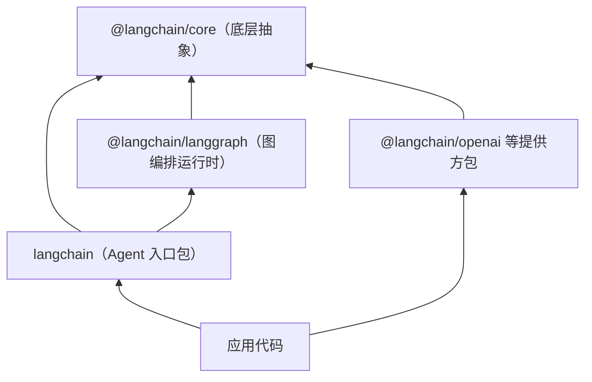

import { Meta } from '@storybook/addon-docs/blocks';

<Meta id="installation" title="入门上手/安装" name="Docs" />

# 安装

本课把 LangChain 1.x 的 TypeScript 工程从零跑到第一次模型调用：认清 `langchain`、`@langchain/core`、`@langchain/langgraph` 三层的依赖关系，用五条命令搭出最小工程，或用官方脚手架直接生成可运行模板。读完你能回答：每个包装在哪一层、什么时候必须显式安装、装完用什么证据确认工程是通的。



箭头方向是"依赖"：`langchain` 建立在 LangGraph 与 core 之上，提供方包只依赖 core 的统一接口。

| 包 | 作用 | 何时显式安装 |
| --- | --- | --- |
| `langchain` | 1.x 入口包，导出 `createAgent`、`tool` | 所有 Agent 应用 |
| `@langchain/core` | 模型、消息与运行时的底层抽象；`langchain` 的 peer 依赖 | 与 `langchain` 成对安装 |
| `@langchain/langgraph` | 图编排与持久化运行时；`langchain` 的内置依赖 | 直接使用 `StateGraph` 等图 API 时 |
| `@langchain/openai` | OpenAI 提供方接入 | 用 OpenAI 模型时 |
| `@langchain/google` | Gemini 提供方接入 | 用 Gemini 模型时 |
| `zod` | 工具与结构化输出的 schema | 定义工具或结构化输出时 |
| `dotenv` | 从 `.env` 读取 `OPENAI_API_KEY` 等环境变量 | 密钥走环境变量时 |
| `create-langgraph` | 官方脚手架（`npm init langgraph@latest`） | 想直接生成可运行模板时 |
| `@langchain/langgraph-cli` | `langgraph dev` 本地开发服务器 | 脚手架项目本地调试时 |

## 快速上手

前置：Node.js ≥ 20 是 1.x 各包 `engines` 的最低要求，官方安装文档的运行口径是 Node.js 22+，新机器建议直接用 22+；模型调用验证一步需要 OpenAI API key。命令以 npm 为例，pnpm / yarn / bun 同理。

```bash
mkdir my-langchain-app && cd my-langchain-app
npm init -y
npm pkg set type=module
npm install langchain @langchain/core @langchain/openai zod dotenv
npm install -D typescript tsx @types/node
```

安装命令以官方安装页的 `npm install langchain @langchain/core` 为基础，补上验证所需的提供方包（`@langchain/openai`）与官方示例同样要求的 `zod`，以及读取密钥的 `dotenv`。`npm pkg set type=module` 把默认 CommonJS 的项目切到 ESM，顶层 `await` 与 1.x 模板的导入写法都需要它；`tsx` 用来直接运行 TypeScript。

把密钥写进项目根目录的 `.env`（不要提交到版本库）：

```bash
OPENAI_API_KEY=sk-你的密钥
```

创建验证脚本，做一次最小模型调用：

```ts
// src/index.ts —— 安装验证：一次最小模型调用
import "dotenv/config"; // 从 .env 读取 OPENAI_API_KEY
import { ChatOpenAI } from "@langchain/openai";

const model = new ChatOpenAI({ model: "gpt-5.5" }); // 换成你的账号可用的模型

const response = await model.invoke("用一句中文确认你已经成功运行。");
console.log(response.content);
```

```bash
npx tsx src/index.ts
```

可观察结果：终端打印一句中文确认回复——依赖、密钥、网络三件事同时得到验证。没有 key 时改用零成本验证，核对三个包的版本与依赖树：

```bash
npm ls langchain @langchain/core @langchain/langgraph
```

示例输出（版本号以安装时最新发布为准）：

```text
my-langchain-app@1.0.0 /path/to/my-langchain-app
├── @langchain/core@1.2.14
└─┬ langchain@1.5.15
  └── @langchain/langgraph@1.4.13
```

树里能看到 `@langchain/langgraph` 是随 `langchain` 自动装进来的传递依赖。官方安装页还建议在调试首个应用时开启 LangSmith 追踪，接入方式由「LangSmith 追踪」一课展开。

## 包结构

1.x 的包分三层：`@langchain/core` 提供统一抽象，`@langchain/langgraph` 提供图编排运行时，`langchain` 把两者组合成 Agent 框架的入口。分层的直接后果是安装动作不同：core 以 peer 依赖声明，npm 7+ 虽会自动补装，但官方命令选择显式成对安装来锁定版本组合；langgraph 是普通依赖，装 `langchain` 时自动带上；提供方包完全独立，按模型提供方挑选。

### @langchain/core

底层抽象层：定义统一的聊天模型接口、消息类型、工具接口与运行时抽象。正因为模型接口统一，切换提供方时应用代码改动最小。

它以 peer 依赖的身份被 `langchain` 引用：不锁进 `langchain` 自己的版本树，而由宿主项目提供。npm 7+ 会自动补装一份满足范围的版本，但官方安装命令固定把两个包成对写出，让版本组合是显式、可控的：

```bash
npm install langchain @langchain/core
```

工程里也可以直接从它的子路径导入基础类型：

```ts
import { HumanMessage } from "@langchain/core/messages";
```

消息类型的完整体系与用法由「模型与消息」一课展开。

### langchain

1.x 的入口包：`createAgent`（官方定位是"最小、高度可配置的 agent harness"）和 `tool` 都从这里导出。它的框架模型是 **Agent = 模型 + 框架**，框架部分包含提示词、工具和中间件，模型部分由你选的提供方包提供。

安装它会自动带入 `@langchain/langgraph` 与 `@langchain/langgraph-checkpoint` 作为运行时依赖，因此纯 Agent 应用不需要再显式安装 LangGraph。`createAgent` 的组装写法（模型、系统提示、工具怎么接）由「第一个 Agent」一课展开，本课只保证工程能跑。

### @langchain/langgraph

图编排运行时：`StateGraph` 等图 API、Functional API 以及持久化、中断恢复等执行能力都在这个包里。LangChain 的 agent 构建于 LangGraph 之上，因此天然继承持久执行、human-in-the-loop 等能力。

什么时候显式安装：需要直接 `import` 它的 API（图编排、checkpointer 生产存储）或单独控制它的版本时。最小表达：

```ts
import { StateGraph } from "@langchain/langgraph";
```

它有独立的升级命令（见「版本线」），图 API 本身由 LangGraph 阶段课程展开。

### 提供方集成包

模型提供方不包含在核心包里，官方把数百个集成放在独立的 provider packages 中，按需安装。主线用 OpenAI：

```bash
npm install @langchain/openai
```

`ChatOpenAI` 默认从环境变量 `OPENAI_API_KEY` 读取密钥，这也是快速上手里 `dotenv` 的意义。Gemini 的差异只在包名与模型名：装 `@langchain/google`，模型写 `"google:gemini-2.5-flash-lite"`，其余写法同构；Anthropic 对应 `@langchain/anthropic`。

在 `createAgent` 的 `model` 参数里还可以用字符串前缀路由提供方，例如 `"google:..."`、`"azure_openai:..."`、`"bedrock:..."`——这种写法属于 `createAgent` 的参数细节，由「第一个 Agent」一课展开。

## 脚手架

不想手动搭工程时，官方脚手架 `create-langgraph` 能从模板直接生成可运行项目：

```bash
npm init langgraph@latest
# 等价写法：npx create-langgraph@latest my-project --template react-agent-js
```

不带 `--template` 时进入交互式选择。模板 ID 一览：

| 模板 ID | 生成内容 |
| --- | --- |
| `new-langgraph-project-js` | 最小带记忆的 chatbot |
| `react-agent-js` | 可扩展多工具的 agent |
| `memory-agent-js` | 跨会话持久记忆的 ReAct 风格 agent |
| `retrieval-agent-js` | 检索问答 agent |
| `data-enrichment-js` | 搜索并整理结果的 agent |

生成物是完整的 TypeScript 工程：`src/agent.ts`（agent 定义）、`langgraph.json`（LangGraph 配置）、`tsconfig.json` 和 `.env.example`。生成后运行：

```bash
cd my-project
npm install
npx @langchain/langgraph-cli@latest dev
```

`langgraph dev` 启动本地 API 服务器，带热重载和调试工具（终端会打印访问地址）。已有工程想补一份 `langgraph.json` 时，用扫描命令 `npx create-langgraph@latest config`，它会找到代码里导出的 agent 并生成配置。

注意两个容易踩的名字坑：npm 上的 `create-langchain` 目前只是官方维护者注册的占位包（0.0.1，无可执行内容），跑不出任何脚手架，别把它当初始化命令；`@langchain/langgraph-cli` 安装后的可执行名是 `langgraphjs`（避免与 Python 版 `langgraph` 冲突）。

## 版本线

LangChain.js 从 1.0.0 起进入稳定线，版本号遵循 semver：major 是破坏性 API 变更，minor 是向后兼容的新功能，patch 是修复。LangChain 与 LangGraph 的 1.x 都是 LTS：次版本之间可以安全升级。

两条容易出错的版本事实：

- `langchain` 与 `@langchain/core` 保持版本对齐，升级成对进行：

```bash
npm update langchain @langchain/core
# 或固定版本：npm install langchain@1.0.0 @langchain/core@1.0.0
```

- 旧线仍在维护但不是主线：LangChain 0.3 / LangGraph 0.4 处于 MAINTENANCE 状态，持续到 2026 年 12 月，之后只剩社区支持。新项目直接用 1.x。

查当前安装的版本用 `npm ls`（见「快速上手」），官方文档另给了一种代码内写法 `import { version } from "langchain/package.json"`，适合构建工具解析的工程；Node 原生 ESM 直接运行时需要 JSON import attributes，用 `npm ls` 更省事。

API 稳定性按标记分级，回查时按标记判断能否用于生产：

| 标记 | 含义 | 生产可用 |
| --- | --- | --- |
| 无前缀 | 稳定 API，仅 major 版本才破坏 | 可用 |
| Beta | 功能完整，未来可能微调 | 可用 |
| Alpha | 实验性，会有显著变化 | 慎用 |
| Deprecated | 将在未来 major 版本移除 | 尽快迁移 |
| `_` 前缀或标明内部 | 内部 API | 不要依赖 |

## 最佳实践

- 新项目在脚手架与手动之间选：要 `langgraph dev` 开发服务器、LangGraph 配置和完整模板结构，用 `npm init langgraph@latest` 起步；只做最小 Agent 或嵌入已有工程，用快速上手的手动五步，依赖面更小、升级更可控。
- 升级永远成对：`langchain` 与 `@langchain/core` 一起升，避免 peer 版本错位引发的隐性不兼容；直接用图 API 的项目把 `@langchain/langgraph` 也纳入显式管理。
- Node 环境按官方口径装 22+：engines 底线是 20，但官方文档按 22+ 描述运行行为，新环境直接对齐省去口径差；已有 20.x 环境可以跑，遇到文档行为差异时先 `node -v`。

## 常见问题

- 运行时报 401 或找不到 `OPENAI_API_KEY`
  检查三处：`.env` 在项目根目录、脚本第一行有 `import "dotenv/config"`、变量名拼写是 `OPENAI_API_KEY`；都正确后仍 401 则是密钥本身失效，去 OpenAI 控制台重新生成。
- 照旧教程写 `import { LLMChain } from "langchain"` 报"没有这个导出"
  教程基于 0.x 旧线，1.x 移除了旧 chains / agents 入口；按 1.x 的 `createAgent` 路线改写，或确认自己确实要固定安装 0.x 版本（维护期到 2026 年 12 月）。
- `npm install` 报 EBADENGINE，或运行时报顶层 `await` 不支持
  前者用 `node -v` 检查版本，1.x 各包要求 Node 20+（官方口径 22+）；后者通常是 `package.json` 缺 `"type": "module"`，补 `npm pkg set type=module` 后用 `npx tsx` 运行。
- 执行 `npx create-langchain` 没有反应或报 no bin
  这个包目前是占位包，不是脚手架；初始化项目用 `npm init langgraph@latest`（即 `create-langgraph`），开发服务器用 `npx @langchain/langgraph-cli@latest dev`。

## 总结回顾

摘要：

1.x 的包分三层：`@langchain/core` 是必须与 `langchain` 成对安装的底层抽象，`@langchain/langgraph` 是随 `langchain` 自动带入的图编排运行时，提供方能力来自独立的 `@langchain/*` 集成包。最小工程五条命令搭好，用一次模型调用或 `npm ls` 依赖树验证；要现成模板就用 `npm init langgraph@latest` 生成并配合 `langgraph dev`。版本线上 1.x 是 LTS，`langchain` 与 `@langchain/core` 成对升降，0.x 旧线维护到 2026 年 12 月。

一句话：

> 装对三个位置——成对的 `langchain` + `@langchain/core`、按需的提供方包——最小工程就能跑通，其余运行时能力都随入口包自动进来。

知识要点：

- 三个核心包各在哪一层，什么时候需要显式安装？
- 官方安装命令是什么，装完后用什么命令和输出核对工程是通的？
- 脚手架的实名命令是什么，生成物里有哪些文件？
- 1.x 版本线的状态如何，升级时哪两个包必须成对？
- 常见安装故障（密钥、0.x 教程、Node 版本、占位脚手架）各自怎么判断和处理？

## 参考资料

- [LangChain.js 安装（官方）](https://docs.langchain.com/oss/javascript/langchain/install)
- [LangChain.js 概览（官方）](https://docs.langchain.com/oss/javascript/langchain/overview)
- [LangChain.js 版本管理（官方）](https://docs.langchain.com/oss/javascript/versioning)
- [create-langgraph（官方脚手架，npm）](https://www.npmjs.com/package/create-langgraph)
- [langchain（npm，依赖结构与 engines）](https://www.npmjs.com/package/langchain)
- [@langchain/core（npm，engines）](https://www.npmjs.com/package/@langchain/core)
