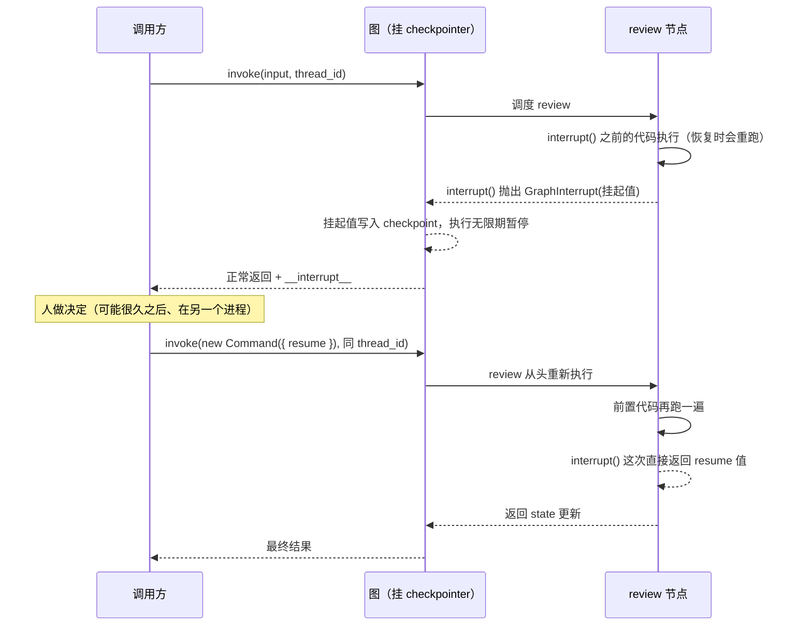

import { Canvas, Controls, Meta } from '@storybook/addon-docs/blocks';
import * as InterruptsTimeTravel from './interrupts-time-travel.stories';

<Meta of={InterruptsTimeTravel} name="Docs" />

# 中断与时间旅行

「人机协同」一课在 Agent 层用过 interrupt：`humanInTheLoopMiddleware` 拦下工具调用，人批准后 `Command` resume 放行；「持久化」一课讲清了它的底座——图在每个 super-step 边界落一份 checkpoint，按 `thread_id` 串成链。本课下到 LangGraph 原语层把中间补齐：`interrupt()` 在节点内怎么挂起（抛 `GraphInterrupt`、挂起值去哪了、`invoke` 返回什么）、`Command({ resume })` 恢复时到底发生什么（**节点从头重跑、`interrupt()` 返回 resume 值**——最容易被误解的一条），以及把 `checkpoint_id` 当时间坐标的时间旅行：`getStateHistory` 定位历史点、`invoke` 重放、`updateState` 分叉。读完你应该能预测：resume 之后哪些代码会再执行一遍、从历史某点重放时哪些节点重跑、分叉会不会改掉原来的历史（不会——只追加）。



关键输入与默认值（已与官方文档和本地 `@langchain/langgraph` 1.1.5 源码核对）：

| 输入 | 默认 / 取值 | 回查要点 |
| --- | --- | --- |
| `interrupt(value)` | `value` 需可 JSON 序列化 | 无可用 resume 值时抛 `GraphInterrupt` 挂起；恢复后再次调用则**返回 resume 值** |
| 运行前提 | 两个都必填 | `compile({ checkpointer })` + 调用时带 `thread_id`；缺 checkpointer 时 `interrupt()` 直接抛 `GraphValueError: No checkpointer set` |
| 恢复输入 | `new Command({ resume })` | 同 `thread_id` 再 invoke；resume 是唯一可直接作为 `invoke` 输入的 `Command` 用法 |
| 挂起时的返回 | `invoke` 正常 resolve | 挂起信息在返回值 `__interrupt__`（`{ id, value }[]`）；`isInterrupted()` 判断 |
| 静态断点 | `interruptBefore` / `interruptAfter`，默认 `[]` | `compile` 时按节点名声明（也可调用时临时指定）；用 `invoke(null, config)` 继续，无 resume 值 |
| 重放 | `invoke(null, snapshot.config)` | config 里带 `checkpoint_id`；目标点之前的节点不重跑 |
| 分叉 | `updateState(config, values, asNode?)` | 追加 `source: 'update'` 的新 checkpoint，**不回滚**原历史；返回新 config |

## 快速上手

最小挂起-恢复闭环，纯函数、不需要模型 API key（`npm i @langchain/langgraph` 后 `npx tsx interrupts-demo.ts` 直接跑）。沿用[持久化](?path=/docs/persistence--docs)一课的图形态，节点里多了一个 `interrupt()`：

```ts
// interrupts-demo.ts —— interrupt 最小闭环：挂起 → 审阅 → Command resume 恢复。
import {
  Annotation,
  Command,
  END,
  interrupt,
  MemorySaver,
  START,
  StateGraph,
} from '@langchain/langgraph';

const State = Annotation.Root({
  draft: Annotation<string>(),
  result: Annotation<string>(),
});

// 审阅节点：interrupt() 之前的代码每次进入节点都会执行（恢复时重跑）
function review(state: typeof State.State) {
  console.log(`[review] 进入节点，整理《${state.draft}》`);
  // 无可用 resume 值时抛 GraphInterrupt；恢复后再次调用则返回 resume 值
  const decision = interrupt({ question: '是否发布？', draft: state.draft });
  console.log(`[review] interrupt() 返回：${String(decision)}`);
  return {
    result: decision === 'approve' ? `已发布《${state.draft}》` : '已取消',
  };
}

const graph = new StateGraph(State)
  .addNode('review', review)
  .addEdge(START, 'review')
  .addEdge('review', END)
  .compile({ checkpointer: new MemorySaver() }); // 硬前提 1：checkpointer

const config = { configurable: { thread_id: 'demo-1' } }; // 硬前提 2：thread_id

// 第一次 invoke：停在 review 内部，Promise 正常 resolve（不是抛异常）
const first = await graph.invoke({ draft: '3.5 节草稿' }, config);
const pending = (first as { __interrupt__?: Array<{ value: unknown }> })
  .__interrupt__?.[0];
console.log('等待人工：', pending?.value);
// => { question: '是否发布？', draft: '3.5 节草稿' }

// 人批准：同一个 thread_id + Command({ resume }) 恢复
const done = await graph.invoke(new Command({ resume: 'approve' }), config);
console.log(done.result);
// => 已发布《3.5 节草稿》
```

注意控制台输出顺序：`进入节点，整理《3.5 节草稿》` 打印了**两遍**——第一次 invoke 一遍、resume 恢复一遍。这不是 bug，是本课的核心机制（见「恢复」一节）。

## interrupt：节点内挂起

`interrupt()` 可以写在**节点函数内的任何位置**——工具函数里、被当作函数调用的子图里都行。它的工作方式不是「等待」，而是「抛出」：

1. 节点执行到 `interrupt(value)`，当前没有可用的 resume 值，就抛出一个特殊的 `GraphInterrupt`（挂起值 `value` 装在异常里）。
2. 运行时接住这个异常，把挂起值记录为该任务的 interrupt，连同图状态一起写进 checkpoint，执行**无限期暂停**——不占线程、不占进程，状态全在 checkpointer 里。
3. `invoke` **正常返回**（不是 reject），挂起信息装在返回值的 `__interrupt__` 字段（`Interrupt` 数组，每项 `{ id, value }`）；也可以用导出的 `isInterrupted(result)` / `INTERRUPT` 常量判断与读取。
4. 恢复 = 同一个 `thread_id` 上再 invoke 一次 `new Command({ resume })`——resume 值会成为 `interrupt()` 调用的返回值。

两个硬前提在源码里是显式校验：图没挂 checkpointer 时调用 `interrupt()` 直接抛 `GraphValueError: No checkpointer set`（错误码 `MISSING_CHECKPOINTER`）；调用时没带 `thread_id` 则 checkpoint 无处归档。这条链路与[持久化](?path=/docs/persistence--docs)一课一致：挂起值和图状态都在 checkpoint 链上，`thread_id` 就是指回它的指针——官方称它为「持久游标」。

三处衔接：Agent 层的审批封装（`humanInTheLoopMiddleware` 怎么用 `interrupt()` 组装审批请求）见[人机协同](?path=/docs/human-in-the-loop--docs)；流式下的挂起感知（`streamEvents` 的 `interrupted` / `interrupts`）该课也演示过，原语层不再重复；挂起后用 `getState` 能在 `tasks[].interrupts` 里看到挂起值——[持久化](?path=/docs/persistence--docs)一课的 `interrupted` 过滤模式取的就是它。

### 恢复：节点从头重跑

最容易误解的一条：**恢复不是从 `interrupt()` 那一行继续，而是该节点从头重新执行**。原因回到[持久化](?path=/docs/persistence--docs)一课的快照粒度——checkpoint 只在 super-step 边界存在，节点执行到一半的状态无处可存：挂起时 review 本轮**没有任何 state 更新落盘**，运行时手里只有「进入该节点之前」的快照，恢复时只能把整个节点重跑一遍。

重跑中的 `interrupt()` 调用走了另一条分支（源码实现）：每个节点执行期内维护 interrupt 计数器，**按索引严格匹配** resume 值——重跑再次经过第 1 个 `interrupt()` 时，它不再抛出，而是返回上次已消费的 resume 值；走到当前挂起的那个 `interrupt()` 时返回本次 `Command({ resume })` 的新值。匹配完全按调用顺序的索引进行，所以**多次执行中 interrupt 的调用顺序必须确定**，这也是「interrupt() 尽量写在节点最前面」的深层原因：前置代码越少，重跑越便宜、越安全。

下面的实例把这段轨迹逐行回放（纯 TS 确定性模拟，不依赖 `@langchain/*`，行为对齐源码语义）：

<Canvas of={InterruptsTimeTravel.InterruptReplay} />
<Controls of={InterruptsTimeTravel.InterruptReplay} />

| 读者操作 | 可观察证据 |
| --- | --- |
| 拖动「回放阶段」到 ② | `interrupt()` 标记「抛出」，`invoke` 返回 `__interrupt__`；前置代码计数停在 ×1 |
| 拖到 ③ | review 从头重跑：前置代码计数变 **×2**（红色），节点未完成时它本轮的输出无处落盘 |
| 拖到 ④ | `interrupt()` 标记「返回 'approve'」（不再抛出），`result` 写入、图到 END |
| 切换「resume 值」为 `reject` | `interrupt()` 返回 `'reject'`，`result` 走「已取消」——resume 值就是分流依据 |
| 打开 Show code | 看到该 Canvas 实际执行的 `interrupt-replay.ts` |

一个直接推论：`interrupt()` 之前的外部副作用（发请求、写库）在每次恢复时都会再来一遍。处理原则见下一小节。

较新版本（`@langchain/langgraph >= 1.4.16`）给 `interrupt()` 增加了第二参数 `{ responseSchema }`：用 Zod schema 校验 resume 值，不合法时抛 `ZodError`、图停在原挂起点，用同一个 `thread_id` 重新发一次合规的 `Command({ resume })` 即可（本地 1.1.5 尚无此参数，用到的读者按此版本门槛核对）。

### 编写纪律：让重跑无害

官方文档把恢复语义的约束整理成一串纪律，每条都对应一个真实故障模式：

- **`interrupt()` 之前的副作用必须幂等**（用 upsert 而不是 insert），或者干脆挪到 `interrupt()` 之后、单独节点里。「先创建订单再等人确认」会在每次恢复时重复创建订单；「先确认再创建」不会。
- **不要把 `interrupt()` 包进裸的 `try/catch`**——挂起靠抛 `GraphInterrupt` 传播，catch 会把它吞掉。确实要捕获周边代码的异常时，catch 里用 `isGraphInterrupt(e)` 判断后原样重新抛出。
- **不要让 `interrupt()` 的调用次数 / 顺序随非确定数据变化**。典型反例是在节点里 `while` 循环「问询-校验-重问」：每次恢复节点从头重跑、每轮循环多消费一个 resume 值，呈指数级重执行。正确做法是一个节点一个 `interrupt()`，校验不过用**条件边**把流程引回该节点。
- **挂起值只放可 JSON 序列化的数据**（字符串、数字、普通对象）——它要写进 checkpoint 跨进程存活，函数和类实例不行。
- 子图里的 `interrupt()`：恢复时**父节点和子图节点都从头重跑**；子图要有独立 checkpoint 才能在子图内部恢复 / 分叉，细节归[子图](?path=/docs/subgraphs--docs)一课。

同一节点写多个 `interrupt()` 是合法的，它们**顺序消费**：第 1 个挂起等第 1 次 resume，第 2 个要等第 1 个恢复、节点重跑到它面前时才挂起：

```ts
function collect() {
  const name = interrupt({ ask: '名称' });  // 第 1 次挂起在这里
  const age = interrupt({ ask: '数量' });   // name 恢复后节点重跑，才会到达这里
  return { result: `${name} × ${age}` };
}

await graph.invoke(input, config);                             // 停在第 1 个
await graph.invoke(new Command({ resume: 'Alice' }), config);  // 停在第 2 个
await graph.invoke(new Command({ resume: '30' }), config);     // 完成
// 第 2 次 resume 时节点重跑：name 得到已消费的 'Alice'，age 得到新的 '30'
```

并行分支各自挂起时，一次 `Command({ resume })` 只喂一个值不够用：先从 `isInterrupted(result)` / `result[INTERRUPT]` 收集各挂起的 `id`，构造「interrupt id → resume 值」的映射再传给 `new Command({ resume: resumeMap })`。

## 静态断点：interruptBefore 与 interruptAfter

`interrupt()` 之外，`compile` 还接受按**节点边界**的静态断点：`interruptBefore: ['node_a']` 在进入 node_a 前暂停，`interruptAfter: ['node_b']` 在它完成后暂停（也可在调用时通过 config 的同名字段临时加）。两者的对照：

| 对照 | 动态 `interrupt()` | 静态断点 |
| --- | --- | --- |
| 位置 | 节点函数内任意处（含工具、函数式子图） | 节点边界，`compile` 时按节点名声明 |
| 携带值 | `interrupt(value)` 任意 JSON 载荷 | 无载荷 |
| 挂起表现 | `invoke` 返回 `__interrupt__`，挂起值可用 | `invoke` 返回，`getState` 的 `next` 指向待执行节点 |
| 恢复 | `new Command({ resume })`，值回到 `interrupt()` 调用处 | `invoke(null, config)`，无值可带 |
| 适用 | HITL 等待人的输入（2.4 的审批建在这上面） | 调试：在任意节点前后停下观察 state |

官方对静态断点的定位是调试工具，不推荐用来做 human-in-the-loop——它不携带值、恢复时拿不到「人的回答」，表达力不如 `interrupt()`。另外还有第三种暂停：节点函数里直接 `throw new NodeInterrupt(message)`（`GraphInterrupt` 的子类，语义是「这个节点无法继续」的错误式中断），不是等待 resume 的挂起，需要人工输入时仍用 `interrupt()`。

## 时间旅行：重放与分叉

checkpointer 存下的不只服务恢复——整条 checkpoint 链就是这段 thread 的**全部历史**，`checkpoint_id` 是链上的时间坐标。时间旅行两种玩法：

- **重放（replay）**：把 config 的 `checkpoint_id` 指到历史某份快照，`invoke(null, config)` 从那个点继续跑。
- **分叉（fork）**：`updateState` 在历史某份快照上改 state，从改动点长出一条新分支继续跑。

先用一句话立住语义，再看代码：**两种玩法都只重新执行目标点之后的节点**——之前的节点结果已经存在 checkpoint 里，不重跑；之后的所有节点（包括 LLM 调用、外部请求、interrupt）**重新执行**，可能给出不同结果。时间旅行不是「缓存回放」，是「换个起点重跑」。定位历史点用[持久化](?path=/docs/persistence--docs)一课的 `getStateHistory`（最新在前，收全量再 `find` / `filter`）。

下面的实例沿官方算例（`generateTopic → writeJoke`，thread 已完整跑过一次）确定性模拟两种玩法与三个边界（纯 TS，不依赖 `@langchain/*`）：

<Canvas of={InterruptsTimeTravel.TimeTravel} />
<Controls of={InterruptsTimeTravel.TimeTravel} />

| 读者操作 | 可观察证据 |
| --- | --- |
| 选「时间坐标」step 1 + 重放 | `writeJoke` 标记「将重跑」、`generateTopic` 标记「已保存」（读数 0 次 / 1 次）；新快照追加到链尾 |
| 时间坐标拖到 step 0 + 重放 | 两个节点都「将重跑」——目标点越早，重跑范围越大 |
| 时间坐标拖到 step 2 + 重放 | 结论行变琥珀色：`no-op`，最终快照的 `next` 为空，没有节点可执行 |
| 切到「分叉」+ step 1 | `updateState` 追加 `source: 'update'` 快照（`as_node: generateTopic`），`writeJoke` 用 `topic: chickens` 算出**不同的 joke**；主线历史完整保留 |
| 分叉 + step 2 | `writeJoke` 的后继是 END：**没有任何节点重跑**，改了 `topic` 但 joke 保持旧值 |
| 分叉 + step 0 | 结论行变红：`InvalidUpdateError`——该快照上没有节点执行历史可推断 `as_node`，需显式传入 |
| 打开 Show code | 看到该 Canvas 实际执行的 `time-travel.ts` |

### 重放：从历史 checkpoint 继续

官方算例的完整代码（纯函数，直接可跑）：

```ts
// time-travel-demo.ts —— 时间旅行：重放 + 分叉。
import {
  Annotation, END, MemorySaver, START, StateGraph,
} from '@langchain/langgraph';

const State = Annotation.Root({
  topic: Annotation<string>(),
  joke: Annotation<string>(),
});
const generateTopic = () => ({ topic: 'socks in the dryer' });
const writeJoke = (state: typeof State.State) => ({
  joke: `Why do ${state.topic} disappear? They elope!`,
});

const graph = new StateGraph(State)
  .addNode('generateTopic', generateTopic)
  .addNode('writeJoke', writeJoke)
  .addEdge(START, 'generateTopic')
  .addEdge('generateTopic', 'writeJoke')
  .addEdge('writeJoke', END)
  .compile({ checkpointer: new MemorySaver() });

const config = { configurable: { thread_id: 'demo-2' } };
await graph.invoke({}, config); // 主线跑完：topic = 'socks in the dryer'

// 1. 定位历史点：getStateHistory 最新在前，按 next 找「writeJoke 执行前」那份
const states = [];
for await (const snapshot of graph.getStateHistory(config)) states.push(snapshot);
const beforeJoke = states.find((s) => s.next.includes('writeJoke'))!;

// 2. 重放：snapshot.config 自带 checkpoint_id，从该点继续
await graph.invoke(null, beforeJoke.config);
// writeJoke 重新执行（再算一遍 joke），generateTopic 不跑——结果已在 checkpoint 里
```

三个要点：

- `snapshot.config` 自带 `checkpoint_id`，直接用即可；等价的手写形态是 `invoke(null, { configurable: { thread_id, checkpoint_id } })`。
- 重放产生的**新 checkpoint 追加到同一条 thread 链**——重放不是只读操作，「回到过去」本身也会写历史。
- 重放**最终** checkpoint（`next` 为空）是 no-op：没有待执行节点，什么都不发生。

### 分叉：updateState 改历史再继续

分叉在重放的基础上多一步「先改 state」：`updateState(snapshot.config, values, asNode?)` 把 `values` 写进从该快照分出的**新 checkpoint**（`metadata.source === 'update'`），返回新 config；接着 `invoke(null, forkConfig)` 从这里继续：

```ts
// 3. 分叉：在 beforeJoke 上改 topic，再从新 config 继续
const forkConfig = await graph.updateState(
  beforeJoke.config,
  { topic: 'chickens' },
);
const forked = await graph.invoke(null, forkConfig);
console.log(forked.joke);
// => Why do chickens disappear? They elope!（主线仍是 socks 版，历史未被回滚）
```

四条边界：

- **不回滚，只追加。** `updateState` 不会删掉或改写原历史，新 checkpoint 的 `parentConfig` 指向被分叉的那份快照；`getStateHistory` 里两条路径都在。想「撤销」到过去，语义是从旧点重放 / 分叉，不是删除未来。
- **`asNode`（`as_node`）归属谁。** 更新值要通过某个节点的 writers 写入（**走该通道的 reducer**——`messages` 这类追加通道会追加而不是覆盖），checkpoint 也把该节点记为更新者，执行从它的**后继**继续。默认从快照的版本历史推断（通常是正确的），三种情况要显式传：并行分支上「最后更新者」有歧义（抛 `InvalidUpdateError`）；全新 thread 没有执行历史；想让图把某节点「当作已跑过」从而跳过它（把 `asNode` 设成更后面的节点）。
- **挂起点也在分叉范围内。** 重放 / 分叉经过含 `interrupt()` 的节点时，interrupt **总是重新触发**——节点重跑、再次挂起、等待一次**新的** `Command({ resume })`（旧 resume 值已被消费，不会自动生效）。灵活之处：可以从**两个 interrupt 之间**分叉，只改后面那问的答案，前面的回答原样保留。
- **子图内的时间旅行**默认做不到「子图内部分叉」：继承父图 checkpointer 时整个子图是一个 super-step，重放会从头重跑整个子图；要按子图步落快照需给子图 `compile({ checkpointer: true })`，再用 `getState(config, { subgraphs: true })` 取子图 config——完整机制归[子图](?path=/docs/subgraphs--docs)一课。

## 最佳实践

- **`interrupt()` 写在节点最前面，前置副作用保持幂等。** 重跑的单位是整个节点：挂起点越靠后、前置代码越多，每次恢复重复执行的越多。做不到幂等的动作（下单、发消息）挪到 `interrupt()` 之后或独立节点。
- **resume 前先想一遍「哪些代码会再跑」。** 把纯计算、幂等动作放在 `interrupt()` 之前，把依赖 resume 值的副作用全部放在之后，是挂起类节点最稳的结构。
- **时间旅行前确认非确定性。** 重放 / 分叉会重新执行目标点之后的节点：LLM 调用可能给不同回答、外部请求可能已经变了。把「可重放的纯计算」与「难重放的副作用」拆成不同节点，重放边界就有得选。
- **`updateState` 后拿返回的 forkConfig 继续跑。** 它精确指向 update 产生的那份快照；继续用旧的 `snapshot.config` 会从更早的时间点再分叉一次。
- **生产环境挂起必须配持久化 checkpointer。** 挂起可能跨越进程存续（审批隔夜、服务重启），`MemorySaver` 只适合本地开发——选型与 `setup()` 见[持久化](?path=/docs/persistence--docs)一课。

## 常见问题

- **resume 后日志 / 前置代码又执行了一遍，是不是恢复错了地方？**
  设计行为：恢复时该节点从头重新执行，`interrupt()` 之前的代码每次都跑。检查前置副作用是否幂等；重跑有害的代码挪到 `interrupt()` 之后或独立节点。
- **`interrupt()` 之前插入的数据在恢复后又插了一份。**
  副作用不幂等。改成 upsert / 先查后插，或把写库动作整个挪到 `interrupt()` 之后。
- **调用 `interrupt()` 直接抛 `GraphValueError: No checkpointer set`。**
  `compile({ checkpointer })` 没传实例（只 import 类不算）。interrupt 的挂起与恢复全建立在 checkpoint 上，核对编译参数与调用时的 `thread_id`。
- **把 `interrupt()` 包进 `try/catch` 后图不挂起了（或恢复时行为错乱）。**
  挂起靠抛 `GraphInterrupt` 传播，裸 catch 会把它当普通异常吞掉。catch 里用 `isGraphInterrupt(e)` 判断并原样重新抛出，或把易错代码与 `interrupt()` 分开。
- **节点里 `while` 循环校验人工输入，越恢复执行次数越多。**
  每次恢复节点从头重跑、循环里的 `interrupt()` 按索引消费 resume 值，形成指数级重执行。改成「一个节点一个 `interrupt()` + 校验不过用条件边引回」。
- **同一节点两个 `interrupt()`，第二次 resume 时第一个的答案「丢了」。**
  按索引匹配：重跑经过第一个 `interrupt()` 时返回的是它已消费的值，新的 resume 值只给当前挂起的那个。只要调用顺序确定，两个答案都会正确回到各自的位置。
- **重放后结果和上次不一样。**
  重放不是缓存回放：目标点之后的节点重新执行，LLM / 外部调用是新的。要么接受差异（探索场景），要么把不确定的部分留在目标点之前。
- **`updateState` 之后觉得原历史被改掉了 / 想撤销分叉。**
  `updateState` 只追加不回滚，原路径在 `getStateHistory` 里完整保留；「撤销」的语义是从更早的历史点重放或再分叉一次。
- **从挂起的时间点重放，图又停在那里等输入。**
  interrupt 在时间旅行中总是重新触发，旧的 resume 值已被消费。对新的挂起再发一次 `new Command({ resume })` 即可。

## 总结回顾

摘要：

`interrupt()` 是 LangGraph 原语层的挂起：在节点内任意处调用，无可用 resume 值时抛 `GraphInterrupt`，挂起值与图状态一起写进 checkpoint，`invoke` 正常返回 `__interrupt__`；恢复用同 `thread_id` 的 `new Command({ resume })`，语义是该节点从头重跑、`interrupt()` 返回 resume 值，多个 interrupt 按索引严格匹配。重跑语义决定了编写纪律：前置副作用幂等、不吞 `GraphInterrupt`、调用顺序确定、挂起值可 JSON 序列化。静态断点 `interruptBefore` / `interruptAfter` 是节点边界上的调试型暂停，用 `invoke(null, config)` 继续。时间旅行把 `checkpoint_id` 当时间坐标：重放 `invoke(null, snapshot.config)` 与分叉 `updateState(config, values, asNode?)` 都只重新执行目标点之后的节点、新快照追加进同一条链，`updateState` 不回滚原历史，`asNode` 决定更新归属与恢复起点；含 `interrupt()` 的节点在重放 / 分叉中总是重新挂起，需要新的 resume。Agent 层的审批封装见[人机协同](?path=/docs/human-in-the-loop--docs)，checkpointer 与存储选型见[持久化](?path=/docs/persistence--docs)，子图内的恢复与分叉归[子图](?path=/docs/subgraphs--docs)。

一句话：

> 恢复与时间旅行是同一个机制的两面：执行只能从 checkpoint 重建——resume 是从挂起的快照重跑该节点，时间旅行是把 `checkpoint_id` 当起点重跑之后的节点。

知识要点：

- `interrupt()` 首次调用与恢复后再次调用分别发生什么？挂起值从 `invoke` 返回值哪里读？
- 两个硬前提是什么？缺 checkpointer 时抛什么错？
- 恢复时节点内哪些代码重跑？`interrupt()` 的返回值从哪来？多个 interrupt 怎么匹配 resume 值？
- 围绕重跑语义的五条编写纪律分别防什么故障？
- 动态 `interrupt()` 与静态断点在位置、携带值、恢复输入、适用场景上差在哪？
- 重放和分叉各自的 API 形态是什么？目标点之前 / 之后的节点各怎么样？
- `updateState` 改不改原历史？新快照的 `metadata.source` 是什么？哪三种情况要显式传 `asNode`？
- 时间旅行经过 `interrupt()` 节点时会怎样？旧 resume 值还能用吗？

## 参考资料

- [Interrupts（LangGraph.js 官方文档：interrupt 机制、重放语义与编写纪律、Command resume、静态断点）](https://docs.langchain.com/oss/javascript/langgraph/interrupts)
- [Use time travel（LangGraph.js 官方文档：重放、分叉、updateState 与 as_node、与 interrupt 的交互）](https://docs.langchain.com/oss/javascript/langgraph/use-time-travel)
- [langgraphjs 仓库（interrupt 的索引匹配实现、Command、updateState 的 as_node 推断，已在本地 @langchain/langgraph 1.1.5 源码核对）](https://github.com/langchain-ai/langgraphjs)
