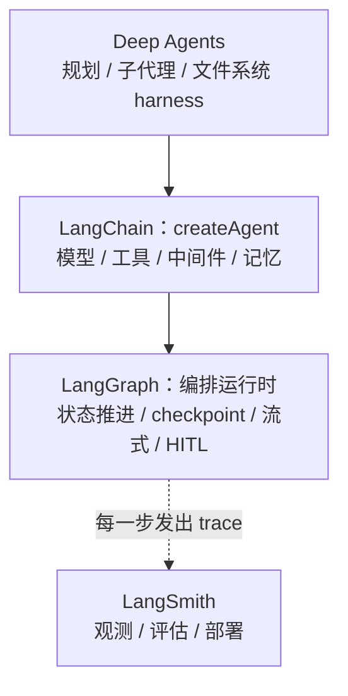
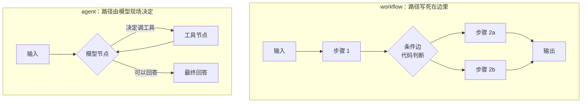

import { Canvas, Controls, Meta } from '@storybook/addon-docs/blocks';
import * as LanggraphThinking from './langgraph-thinking.stories';

<Meta of={LanggraphThinking} name="Docs" />

# LangGraph 思维模型

本课是「LangGraph 图编排」阶段的开篇，只回答进入具体 API 之前必须先定下来的问题：LangGraph 在平台里处于哪一层、图执行模型怎么推进、workflow 与 agent 的分界在哪里、三条 API 线（createAgent / Graph API / Functional API）各自什么时候用。`StateGraph` 的具体写法归「Graph API」一课，`entrypoint` / `task` 归「Functional API」一课，checkpointer 配置归「持久化」一课；本课的产出是一套选型判断。读完你应该能预测：拿到一个需求时先问哪几个问题，答案如何落到三条线之一。

| 线 | 所在包 | 一句话定位 | 何时选 |
| --- | --- | --- | --- |
| `createAgent` | `langchain` | 标准 agent 循环的 harness：模型 + 工具 + 中间件全托管 | 需求就是「模型决策 + 调工具回答」的标准循环 |
| Graph API | `@langchain/langgraph` | 声明式定义 nodes / edges / state，`compile` 成可执行图 | 复杂分支、并行汇合、显式共享状态、需要可视化和团队协作 |
| Functional API | `@langchain/langgraph` | 用 `entrypoint` + `task` 把编排写进过程式代码 | 线性或少量分支、嵌入既有代码、快速原型 |

三条线跑在同一个运行时上：persistence、streaming、human-in-the-loop、memory 全都不缺，选线改变的只是「你显式声明多少控制流」。

## LangGraph 在平台中的位置

官方给 LangGraph 的定位是：一个低层级（low-level）的 agent 编排框架与运行时，用来构建、管理和部署长时间运行的、有状态的 agent。它强调 fine-grained control——在同一张图里混排确定性的手写步骤和 LLM 驱动的步骤；它不抽象化 prompt 和架构，也可以完全脱离 LangChain 独立使用。



自上而下看：Deep Agents 是更高层的 harness，建立在 LangGraph 之上；LangChain 提供 `createAgent` 这样的 prebuilt agent 抽象；LangGraph 是它们共同的编排运行时，负责 durable execution、streaming、human-in-the-loop 和 persistence；LangSmith 在旁边观测每一步。

所以「第一个 Agent」一课的结论在这里升级一步：你其实已经在用 LangGraph 了。`createAgent` 返回的就是一张编译好的图——模型节点与工具节点连成的循环；那一课里 `stream` 每个「节点跑完后的全量状态快照」，节点粒度正是底下这张图给的。官方的建议也很直白：新手或标准 agent 需求直接用 `createAgent` 这类 prebuilt agent，需要控制流程结构时才下沉到 LangGraph 层。

安装只需要编排运行时本身：

```bash
npm i @langchain/langgraph @langchain/core
```

## 图执行模型

官方的思考路径是五步：把任务画成离散步骤的流程图 → 明确每步做什么 → 设计共享状态 → 实现节点 → 连边组装。落到执行模型上只有三个角色：

- **节点（node）**：一个函数。收到当前 state，返回一份「更新片段」——不是全量替换 state，更新怎么合并由 state 定义里的 reducer 决定（比如 messages 用追加合并）。
- **边（edge）**：控制流。固定边声明先后顺序；条件边按 state 现场路由。官方建议只连必要的边，路由逻辑也可以写进节点里（`Command` 的 `goto`），保持控制流显式可追踪。
- **状态（state）**：跨节点共享的数据，是节点之间唯一的传递媒介。

执行按步推进：LangGraph 的执行模型受 Pregel（BSP，bulk synchronous parallel）与 Apache Beam 启发——节点在 super-step 中运行，一步之内节点执行完、状态更新在步末合并，再进入下一步；checkpoint 就产生在节点边界。这一句话解释了后面几课会反复遇到的三件事：为什么故障恢复是从「停止的那个节点」开头重跑而不是从半截续上；为什么消息历史用 reducer 追加合并；为什么流式产出的快照是节点粒度。

最小的一张图长这样（无模型调用，本地即可跑通）：

```ts
// graph-taste.ts —— 图执行模型的最小骨架：节点返回更新片段，条件边按 state 路由。
// 运行条件：npm i @langchain/langgraph；npx tsx graph-taste.ts（不需要模型 API key）。
// 完整写法（Annotation、compile 参数、Command 路由）归「Graph API」一课。
import { Annotation, END, START, StateGraph } from '@langchain/langgraph';

// 状态：跨节点共享的数据；reducer 声明更新如何合并（这里是追加）
const State = Annotation.Root({
  messages: Annotation<any[]>({
    reducer: (current, update) => current.concat(update),
  }),
});

// 节点：普通异步函数，读 state、返回「更新片段」
const classify = async (state: typeof State.State) => {
  const question = state.messages.at(-1).content as string;
  const intent = question.includes('退款') ? 'billing' : 'general';
  return { messages: [{ role: 'ai', content: `intent=${intent}` }] };
};

const answer = async (state: typeof State.State) => {
  const last = state.messages.at(-1).content as string;
  return { messages: [{ role: 'ai', content: `按 ${last} 分支作答` }] };
};

// 边：START → classify；classify 之后按 state 现场路由
// 注意：这里的分支条件是确定性代码，不是模型决策——这就是 workflow
const graph = new StateGraph(State)
  .addNode('classify', classify)
  .addNode('answer', answer)
  .addEdge(START, 'classify')
  .addConditionalEdges(
    'classify',
    (state) =>
      (state.messages.at(-1).content as string).includes('billing')
        ? 'answer'
        : END,
    ['answer', END],
  )
  .compile();

const result = await graph.invoke({
  messages: [{ role: 'user', content: '我要申请退款' }],
});
console.log(result.messages.map((m: { content: unknown }) => m.content));
// ['我要申请退款', 'intent=billing', '按 intent=billing 分支作答']
```

state 设计有一条官方原则值得回查：**state 存原始数据，不存格式化文本**。需要拼 prompt 时在节点内按需格式化；能从原始数据推导出来的值也不要放进 state。存了格式化产物，下游节点就被迫解析文本，state 也失去了「单一事实来源」的地位。

## workflow 与 agent 的分界

官方定义只有两句：**workflows** have predetermined code paths——路径预先写死在代码里，按既定顺序运行；**agents** are dynamic and define their own processes and tool usage——流程和工具使用由模型自己决定，运行在连续的反馈循环里。分界问题因此只有一个：

> **下一步由谁决定？** 写代码时定死是 workflow；运行时交给模型是 agent。



两张图的关键差异在「分支的判断者」：workflow 的菱形是代码（`if` / 条件边函数），agent 的循环出口是模型（有没有 `tool_calls`）。agent 里开发者仍然定义工具集和行为准则（systemPrompt、护栏、人审），自主的只是路径选择——这正是「第一个 Agent」「护栏」「人机协同」几课已经在做的事。

workflow 不是 agent 的低配版，而是另一种取舍：路径可枚举时它可预测、可测试、便宜；agent 的灵活性是拿可预测性换的，必须配护栏、人审和观测兜底。workflow 内部还有一条光谱，按结构复杂度排：

| 模式 | 结构 | 适用条件 | 典型例子 |
| --- | --- | --- | --- |
| prompt chaining | 串行链，每步处理上一步输出，可加质量门提前终止 | 任务能拆成小的、可验证的步骤 | 生成笑话 → 检查标点 → 再交付 |
| routing | 先分类输入，再分发到专用流程 | 输入有明确类别可判断 | 客服问题分流到定价 / 退款 / 退货 |
| parallelization | 并行跑独立子任务，或同任务多次采样取优 | 子任务彼此独立；要提速或提高置信度 | 关键词提取 ∥ 格式检查；多维度打分 |
| orchestrator-worker | 编排者拆解任务、委派 worker、汇总结果 | 整体流程固定，但子任务不可预定义 | 跨未知数量的文件更新代码与文档 |
| evaluator-optimizer | 一个 LLM 生成、另一个评估，循环到达标 | 有明确成功标准但需要多轮迭代 | 双语翻译多轮校准 |

其中 orchestrator-worker 是值得注意的中间形态：编排本身是确定性的 workflow，子任务的展开方式却像 agent（LangGraph 用 `Send` API 在运行时动态生成 worker 节点）。这说明分界不是整个系统二选一，而是**逐段判断**——同一条流水线里，分类段可以是 workflow、处理段可以是 agent。

## 三条 API 线与选型

三条线不是三套技术，而是同一运行时的三个入口：`createAgent` 把标准 agent 循环全部托管，Graph API 让你显式声明图结构，Functional API 让你用普通代码写编排。它们可以出现在同一个应用里（Graph 节点内部调一个 `entrypoint`，或图里的一个节点就是 `createAgent` 的返回值），也可以双向迁移：过程式代码分支变复杂时改写成图；图过度设计时简化回过程式。

用下面的判断器把本课的分界判断和结构判断走一遍——四个开关对应四个问题，推荐会随判断同步变化：

<Canvas of={LanggraphThinking.Interactive} />
<Controls of={LanggraphThinking.Interactive} />

| 读者操作 | 可观察证据 |
| --- | --- |
| 关闭「下一步由模型决定」，其余保持默认 | 推荐从 createAgent 变为 Functional API：路径可枚举时不需要 agent |
| 在上一步基础上打开「并行 / 汇合 / 显式状态」 | 推荐变为 Graph API：结构复杂度把 workflow 一侧也推向显式图 |
| 重新打开「下一步由模型决定」并打开「并行 / 汇合 / 显式状态」 | 推荐仍是 Graph API，理由变为「把 createAgent 当作图中节点」——混合形态 |
| 打开「需要人审中断」 | 推荐不变，卡片追加提示：三条线都支持 interrupt，落地需 checkpointer |
| 打开 Show code | 看到该 Canvas 实际执行的 `example.ts`：纯 TS 确定性规则，不依赖 `@langchain/*` |

### createAgent：标准循环的 harness

`createAgent` 是 LangChain 层的 prebuilt agent：模型 + 工具 + 系统提示 + 中间件组装好之后，「模型决定 → 环境执行工具 → 结果回填」的循环、循环的终止、消息历史的维护全部由 harness 托管。选它不需要理由，**不选它才需要理由**——凡是「模型决策 + 调工具回答」的标准形态，它都是三条线里代码最少的起点。

```ts
// 「第一个 Agent」课组装的 agent，本质是一张编译好的 LangGraph 图：
// 模型节点 →（有 tool_calls？）工具节点 → 回模型节点 …… → END
const result = await agent.invoke({
  messages: [{ role: 'user', content: "What's the weather in San Francisco?" }],
}); // 跑的就是这张图，invoke / stream 的行为因此与图一致
```

什么时候离开它：流程里有它管不到的东西——多阶段流水线、非 LLM 步骤的编排、并行分支、跨步骤的显式状态、固定顺序的确定性步骤。这些需求下沉到下面两条线，而 `createAgent` 的返回值可以继续作为图中的一个节点存在。

### Graph API：显式声明图

Graph API 是声明式路线：定义 nodes、edges 和 shared state，`compile()` 成一张结构可视、可讨论的图。「图执行模型」一节的 `graph-taste.ts` 已经是它的写法，具体展开归「Graph API」一课。选它的条件：多个决策点的条件分支、并行执行后需要汇合、跨节点显式共享状态、团队需要对着图讨论流程，或者你想要可视化的调试与文档。

Graph API 的独特收益是「结构即文档」——节点和边就是架构图本身，配合 LangSmith 能逐步对照执行轨迹与声明结构。代价是样板代码：线性流程用它会显得过度设计。它还能把高层抽象混进图中，节点不必都是手写函数：

```ts
// 图中的节点可以是 createAgent 的返回值：agent 本身就是「进 messages、出 messages」的节点
const agent = createAgent({
  model: new ChatOpenAI({ model: 'gpt-4o-mini' }),
  tools: [getWeather],
});

const graph = new StateGraph(State)
  .addNode('agent', agent) // agent 循环整体作为一个节点
  .addNode('review', humanReview)
  .addEdge(START, 'agent')
  .addEdge('agent', 'review');
```

### Functional API：过程式嵌入

Functional API 是命令式路线：把 LangGraph 的能力直接嵌进标准过程式代码，`task` 包住每个要被 checkpoint 跟踪的步骤，`entrypoint` 包住整个流程，控制流就是你熟悉的 `if` / `else`、循环和 `await`：

```ts
// functional-taste.ts —— 同一类判断逻辑的 Functional API 写法。
// 运行条件：npm i @langchain/langgraph；npx tsx functional-taste.ts（不需要模型 API key）。
// entrypoint 的 checkpointer、final 等完整能力归「Functional API」一课。
import { entrypoint, task } from '@langchain/langgraph';

// task：被运行时跟踪的最小步骤单位（名字用于 checkpoint 与调试）
const classify = task('classify', async (question: string) => {
  return question.includes('退款') ? 'billing' : 'general';
});

const answer = task('answer', async (intent: string) => `按 ${intent} 分支作答`);

// entrypoint：流程入口；if / else 就是控制流，没有显式的边
const workflow = entrypoint('classify-flow', async (question: string) => {
  const intent = await classify(question);
  if (intent === 'billing') {
    return await answer(intent);
  }
  return '直接结束';
});

console.log(await workflow.invoke('我要申请退款'));
// 按 billing 分支作答
```

选它的条件：流程线性或只有少量分支、想把编排嵌进既有过程式代码（对现有结构改动最小）、想快速原型少写样板。注意它不等于「没有图思维」：`task` 边界就是 checkpoint 边界，task 拆多细直接决定恢复时要重跑多少（见下面 durability 一节）。

## durability 与 checkpoint

agent 系统经常长时间运行：一个流程可能等待人工审批几小时，可能在执行一半时进程重启。LangGraph 用 durable execution 解决这个问题——执行中在每个**节点边界**写 checkpoint，故障后从断点恢复而不是从头再来；human-in-the-loop 的暂停 / 恢复、thread 级短期记忆，都建立在同一套 checkpoint 机制上。

宏观上只需要记三件事：

- **checkpoint 落在节点边界**。恢复时从「停止的那个节点」开头重跑整个节点——这就是 `interrupt()` 必须写在节点最前面的原因（「人机协同」一课已在 agent 语境见过，机制归「中断与时间旅行」一课展开）。
- **thread_id 聚合同一会话**。同一个 `thread_id` 的多次调用共享同一份检查点历史，这是多轮对话记忆的底层机制（「短期记忆」一课已用过）。
- **写入时机可选**。durability 默认是 async（后台写 checkpoint，不阻塞执行），可选 exit（整个流程跑完才写）和 sync（每步阻塞等待写入完成）。默认档性能最好，sync 恢复保证最强，exit 介于两者之间——配置细节归「持久化」一课。

开启它只需要在编译时传入 checkpointer：

```ts
// 概念引用：compile 时传 checkpointer，图执行从此具备断点恢复能力
// （MemorySaver 用于开发，生产存储与完整机制归「持久化」一课）
const app = graph.compile({ checkpointer: new MemorySaver() });
```

三条 API 线在这一层完全一致：`createAgent` 的 `checkpointer` 参数、Graph API 的 `compile({ checkpointer })`、Functional API 的 `entrypoint({ checkpointer })`，接的是同一个机制。

## 最佳实践

- 从能解决问题的最简线开始，按需下沉：默认 `createAgent`；需要嵌编排就用 Functional API；结构复杂到需要对着图讨论时再上 Graph API。起点选错了，两条线之间的迁移成本比想象中低（官方明确支持双向迁移）。
- 写代码前先画步骤图：把任务拆成离散步骤、标出每步是 LLM 步骤 / 数据步骤 / 动作步骤 / 人工步骤，再决定哪些分支交给代码、哪些交给模型——这是官方推荐的入口动作，也是 workflow / agent 分界的操作化。
- 混合形态是常态而不是妥协：确定性前置处理（分类、校验）用 workflow 段，开放性处理段放 `createAgent` 节点；一个系统的不同段落可以落在分界的两侧。
- 节点粒度按恢复与隔离需求拆：拆细节点换来更细的 checkpoint 粒度、外部调用的独立重试和更清晰的中间可观测性；但每一步都拆成节点同样有维护成本，线性连续的逻辑合在一个节点里是合法且常更好的选择。

## 常见问题

- 我已经会用 `createAgent` 了，为什么还要学 LangGraph？
  因为标准循环之外的任何需求——多阶段流水线、并行分支、显式跨步骤状态、编排非 LLM 步骤、在图中混排 agent 与确定性步骤——都要落到 LangGraph 层实现；而且 `createAgent` 本身就跑在 LangGraph 上，理解图执行模型（节点粒度、state 合并、checkpoint 边界）直接帮你解释它的 stream 输出与恢复行为。
- Graph API 和 Functional API 是两套运行时吗？
  不是。它们共享同一个底层运行时，persistence、streaming、human-in-the-loop、memory 能力完全一致，可以在同一应用里混用，也可以互相迁移（`if` / `else` 分支变复杂时改写成条件边；图过度设计时简化回过程式）。选哪个只看你要多少显式结构。
- workflow 是不是比 agent 落后，应该尽量都做成 agent？
  把分界当成需求判断而不是水平判断：路径能枚举就选 workflow——可控、可测、便宜、可离线验证；agent 的自主性是拿可预测性换的，只有在问题和解法不可预测时才值得支付这个代价，并配套护栏、人审与观测。
- 选了 Functional API，还需要图思维吗？
  需要。`task` 边界就是 checkpoint 边界：task 拆得越细，恢复时重跑的代价越小、可观测性越好；把整个流程写成一个巨型 task，durability 就退化成「全有或全无」。边不显式了，步骤边界照样重要。

## 总结回顾

摘要：

本课把 LangGraph 放进平台分层：它是 `createAgent` 与 Deep Agents 之下的编排运行时，负责状态推进、checkpoint、流式与 human-in-the-loop；图执行模型由节点（读 state 返回更新片段）、边（控制流）和共享 state 构成，按 super-step 推进、在节点边界落 checkpoint；workflow 与 agent 的分界是「下一步由谁决定」，workflow 内部还有从 prompt chaining 到 evaluator-optimizer 的结构光谱，orchestrator-worker 证明分界可以逐段落判断；三条 API 线——`createAgent` 托管标准循环、Graph API 显式声明图、Functional API 嵌入过程式代码——共享同一运行时，可混用可迁移；durability 让长时间运行和断点恢复成为可能，thread_id 与 durability mode 是它的两个关键旋钮。

一句话：

> 下一步由谁决定，是 workflow 与 agent 的唯一分界；三条 API 线只是同一运行时上「显式声明多少控制流」的不同入口。

知识要点：

- LangGraph 在平台中承担什么角色，`createAgent` 和它是什么关系？
- 图执行模型的三要素各做什么，状态更新怎么合并，checkpoint 产生在哪里？
- workflow 与 agent 的官方分界是什么，各自付出和换来什么？
- 五种 workflow 模式各自适合什么场景？哪个是 workflow 与 agent 的中间形态？
- 三条 API 线各自的适用条件是什么？能混用和迁移吗？
- durability 解决什么问题，三种 mode 差在哪里？

## 参考资料

- [LangGraph.js Overview（官方：定位、平台分层、安装）](https://docs.langchain.com/oss/javascript/langgraph/overview)
- [Thinking in LangGraph（官方：五步构建法、state 原则、checkpoint 与 durability modes）](https://docs.langchain.com/oss/javascript/langgraph/thinking-in-langgraph)
- [Workflows and Agents（官方：分界定义与五种 workflow 模式）](https://docs.langchain.com/oss/javascript/langgraph/workflows-agents)
- [Choosing APIs（官方：Graph API 与 Functional API 选型）](https://docs.langchain.com/oss/javascript/langgraph/choosing-apis)
