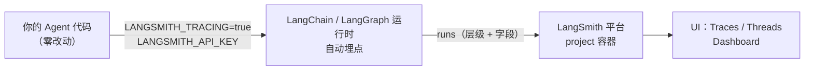
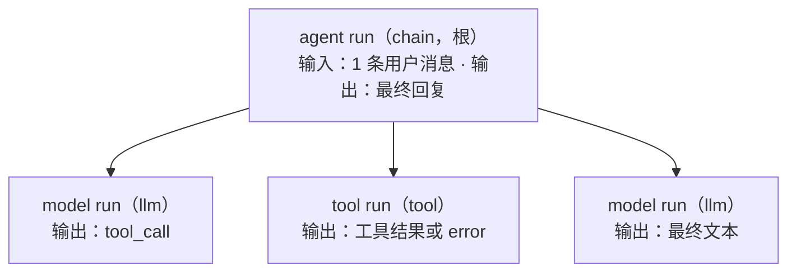

import { Canvas, Controls, Meta } from '@storybook/addon-docs/blocks';
import * as LangsmithObservability from './langsmith-observability.stories';

<Meta of={LangsmithObservability} name="Docs" />

# LangSmith 追踪

LangSmith 是 LangChain 官方的观测平台：Agent 的每次执行被自动记录成一条 trace——一棵按层级嵌套的 run 树，每层带着输入输出、耗时、token 与成本。本课走完从开通到排查的完整路径：注册与 API key、两个环境变量接入（代码零改动）、run 树的结构、以及"慢在哪 / 贵在哪 / 工具返回了什么"的定位方法。读完你能预测：设与不设 `LANGSMITH_TRACING` 分别会发生什么、一条 trace 里能看到什么、三个排查入口分别落到哪个 run。



追踪链路只有三段：环境变量打开开关，运行时自动上报，平台按 project 归档。中间不需要写任何埋点代码。

| 环境变量 | 作用 | 不设时的行为 |
| --- | --- | --- |
| `LANGSMITH_TRACING` | 总开关，设为 `true` 启用追踪 | 不追踪——这是默认状态 |
| `LANGSMITH_API_KEY` | 认证凭据，从 Settings > API Keys 创建 | 开了开关也无法上报 |
| `LANGSMITH_PROJECT` | trace 归入哪个 project | 自动落入 `default` 项目 |
| `LANGSMITH_ENDPOINT` | 上报端点，EU / APAC 等区域需要 | 默认美国端点；URL 末尾不能带斜杠，否则认证失败 |
| `LANGSMITH_WORKSPACE_ID` | 一个 key 关联多个 workspace 时选定 | 按 key 默认的 workspace |
| `LANGCHAIN_CALLBACKS_BACKGROUND` | JS 特有：回调在后台异步发送 | 默认 `true`；serverless 环境要设 `false`，否则进程提前退出会丢 trace |

## 快速上手

从零到第一条 trace 的最小闭环，复用「第一个 Agent」的 weather agent，代码一行不改：

1. 注册账号：打开 [smith.langchain.com](https://smith.langchain.com)，用 Google / GitHub / 邮箱登录，无需信用卡。
2. 创建 API key：进入 Settings 页面 → **API Keys** → **Create API Key**，复制并妥善保存。
3. 在项目根目录的 `.env` 里追加两行（`OPENAI_API_KEY` 已有）：

```bash
LANGSMITH_TRACING=true
LANGSMITH_API_KEY=你的_langsmith_密钥
```

4. 原样再跑一次 `npx tsx weather.ts`——`import 'dotenv/config'` 会把两个变量带进运行时。
5. 回到 smith.langchain.com，左侧 **Tracing** → 选 `default` 项目 → 在 **Traces** 标签里点开刚出现的行。

可观察结果：点开的 trace 里能看到完整的一圈 Agent 循环——模型的工具调用请求、`get_weather` 的执行、模型拿到结果后的最终回复。官方的说法是：开启后"No extra code is needed to log a trace to LangSmith"——`createAgent` 组装的 Agent 全部自动追踪。

## 平台与开通

**LangSmith 是什么。** 一个围绕 Agent 生命周期的平台，三大能力：观测（tracing、dashboard）、评估（数据集、LLM-as-judge、在线评估）、提示词管理。本手册主线聚焦观测——评估细节归[「Agent 评估」](?path=/docs/agent-evals--docs)（6.3），提示词管理不在路线内展开。

**什么时候需要它。** 判断标准是有没有"循环 + 多工具 + 多轮"：单次裸调模型时 `console.log` 够用；一旦 Agent 在循环里自己决定调工具、跨多轮累积上下文，纸条式日志回答不了"慢在哪一步、token 花在哪些消息上、工具到底返回了什么"。trace 把这些问题变成可以点开看的结构化数据。

**账号结构。** 注册后进入的是 workspace：projects、API keys、成员和定价表都挂在 workspace 上，API key 创建时就归属某个 workspace。一个 key 被关联到多个 workspace 时，用 `LANGSMITH_WORKSPACE_ID` 指定发往哪个。

**部署形态。** 开通时选一种：

| 形态 | 数据位置 | 运维 | 适用 |
| --- | --- | --- | --- |
| Cloud | LangChain 托管云 | 自动升级、自动扩容 | 默认选择，本课按 Cloud 展开 |
| BYOC | 你的 VPC | LangChain 管理的基础设施 | 数据必须留在自己网络内 |
| Self-hosted | 你的基础设施 | 手动升级与扩容 | 两者都需要 Enterprise 计划 |

云上数据保留 180 天，之后永久删除（用量统计的少量元数据保留）；需要长期留存的 trace 转存进 dataset。

## 接入追踪

机制：`LANGSMITH_TRACING=true` 让 LangChain / LangGraph 运行时在执行路径上自动埋点（官方称之为 integration，等价于其他观测体系的 auto-instrumentation）。`createAgent` 的每次 `invoke` 变成一条 trace；LangGraph 图节点里调用的 `model.invoke` 会被自动推断出正确的追踪上下文、嵌套成子 run；Deep Agents 同理——5.2 系列提到的"设两个环境变量就能在 trace 里看全工具调用与子代理"就是这条机制。部署在 LangSmith Deployment / Managed Deep Agents 上的应用已预配好环境变量，本地开发才需要自己设置。

一个 JS 特有的行为：运行时默认在后台异步发送 trace（`LANGCHAIN_CALLBACKS_BACKGROUND=true`），不阻塞主流程；但在 serverless（Lambda 等进程即退的环境）里要显式设为 `false`，改成同步发送，否则进程在发送完成前退出会丢 trace。

### 项目路由与环境隔离

project 是"单个应用或服务的全部 trace"的容器，是组织 trace 的第一维度。路由靠 `LANGSMITH_PROJECT`：

```bash
# dev 与 prod 用不同环境变量值，trace 天然隔离
LANGSMITH_PROJECT=weather-agent-dev    # 开发环境
LANGSMITH_PROJECT=weather-agent-prod   # 生产环境
```

两种隔离方式的取舍：

| 方式 | 做法 | 适合 |
| --- | --- | --- |
| 按环境分 project | 每个环境设不同 `LANGSMITH_PROJECT` | 彻底隔离：列表噪音、权限、保留策略互不影响 |
| 同 project + 元数据 | 不分 project，在 run config 里带 `metadata.environment` | 方便同图对比 dev / prod 指标，代价是列表混在一起 |

无论哪种方式，都建议给调用打上结构化标注——它们会附着到 trace 上，是 UI 过滤和 dashboard 分组的依据：

```ts
const result = await agent.invoke(
  { messages: [{ role: 'user', content: "What's the weather in San Francisco?" }] },
  {
    configurable: { thread_id: 'demo' }, // 同一 thread_id 的多轮 trace 归为一段会话
    tags: ['production', 'weather-agent', 'v1.0'],
    metadata: { userId: 'user123', environment: 'production' },
  }
);
```

`thread_id` 同时服务两边：LangGraph 凭它接上 checkpointer 里的历史（「短期记忆」），LangSmith 凭它把每轮 trace 归进同一个 thread。

### 显式接入

不想全局开追踪、或要按调用指定 project 时，用 `LangChainTracer`（来自 `@langchain/core/tracers/tracer_langchain`）做选择性追踪——未设 `LANGSMITH_TRACING` 时，只有挂了 tracer 的调用被记录：

```ts
import { LangChainTracer } from '@langchain/core/tracers/tracer_langchain';

// 动态项目名：按实验 / 按租户路由 trace
const tracer = new LangChainTracer({ projectName: 'weather-agent-experiments' });

await agent.invoke(
  { messages: [{ role: 'user', content: "What's the weather in San Francisco?" }] },
  { callbacks: [tracer] }
);
```

没有用 LangChain 运行时的代码（直接调 OpenAI SDK 的脚本、普通函数）走 `langsmith` 包的显式接入：`wrapOpenAI` 包装客户端让每次调用自动记录为嵌套 run，`traceable` 把函数包装成 run：

```ts
import { wrapOpenAI } from 'langsmith/wrappers';
import { traceable } from 'langsmith/traceable';

const client = wrapOpenAI(new OpenAI()); // 每次 LLM 调用自动成为一个嵌套 run

const getContext = traceable(
  async function getContext(query: string) {
    /* 检索或计算 */
  },
  { run_type: 'tool' } // 自定义函数标成什么类型的 run
);
```

敏感信息不想进 trace 时，在 tracer 前面挂匿名化器（写法对齐官方 LangGraph.js 文档）：

```ts
import { Client } from 'langsmith';
import { createAnonymizer } from 'langsmith/anonymizer';
import { LangChainTracer } from '@langchain/core/tracers/tracer_langchain';

const anonymizer = createAnonymizer(/\b\d{3}-\d{2}-\d{4}\b/g); // 掩码 SSN 形态的字符串
const tracer = new LangChainTracer({ client: new Client({ anonymizer }) });
const tracedGraph = graph.withConfig({ callbacks: [tracer] });
```

## run 树

trace 是"一次操作的全部记录"，run 是其中的"一个工作单元"——类比 OpenTelemetry 的 span。一次用户请求触发模型调用、工具使用、再次模型调用，这些 run 凭同一个 `trace_id` 聚成一条 trace（上限 25,000 个 run，超出会被拒收）。LangSmith 侧的结构完全由 parent-child 关系决定：



Agent 循环转一圈，就多出一段"model run → tool run → model run"的兄弟节点；LangGraph 的图节点会作为中间 run 包住内部的模型与工具调用，所以图的层级直接映射成 run 树的层级。`trace_id` 就是根 run 的 id，每个 run 用 `parent_run_id` 挂到父节点上（内部另有可排序的层级键 `dotted_order`，回查数据导出时会碰到）。

run 按 `run_type` 分类，UI 里各按类型渲染：

| run_type | 记录什么 | 出现在哪 |
| --- | --- | --- |
| `chain` | 组合步骤；Agent / 图执行的总 run | 每条 trace 的根 |
| `llm` | 模型调用：消息、生成结果、token、成本 | Agent 循环的每一圈 |
| `tool` | 工具名、入参、返回值或 error | 模型决定调工具时 |
| `retriever` | 检索 query 与命中文档（UI 内联渲染文档） | RAG 检索步骤（「RAG」阶段） |
| `embedding` | 嵌入调用 | 向量化步骤（「嵌入与向量库」） |
| `prompt` / `parser` | 提示词模板渲染 / 输出结构化 | 相应组件执行时 |

无论哪种类型，每个 run 记录的字段是同一套：

| 字段 | 内容 | 排查时回答 |
| --- | --- | --- |
| `inputs` / `outputs` | 输入输出；llm run 是 messages 数组 | 模型实际看到了什么、工具实际返回了什么 |
| `error` / `status` | 异常信息；`success` / `error` / `pending` | 哪一步坏了、为什么 |
| `start_time` / `end_time` | 起止时刻，相减即延迟 | 慢在哪一层 |
| `first_token_time` | 首 token 时刻（流式 llm run） | 等首 token 慢，还是生成慢 |
| `prompt_tokens` / `completion_tokens` / `total_tokens` | 分项 token | 钱花在输入还是输出 |
| `total_cost` 等成本字段 | 按 token 与定价算出 | 哪次调用最贵 |
| `tags` / `metadata` | 调用时附着的标注 | 过滤、分组、环境区分 |

上一层的 messages 就是下一层的全部上下文——这是读 trace 时最重要的直觉：第 N 次模型 run 的输入里，能看到前几圈留下的所有 tool_call 与工具结果。

多轮会话用 thread 组织：同一个 `thread_id` 的每轮各成一条 trace，按时间归成一段会话；thread 保留完整的时序与嵌套，而 trajectory 是它的压平投影——把人 / AI / 工具消息去重后摊成一个有序列表，只看"交换了什么"，不看执行细节。

## 排查一次执行

**入口与视图。** 左侧 **Tracing** → 选 project，页面提供 **Threads** / **Traces** / **Runs** 三个标签：Threads 按会话看，Traces 一次执行一行，Runs 直接按 run 平铺。加过滤条件缩小范围（延迟、错误、标签等），点任意一行打开侧栏，在三个视图间切换（快捷键 `T` / `D`）：

| 视图 | 看什么 | 什么时候用 |
| --- | --- | --- |
| Trajectory | 对话层：输入输出、推理过程、工具调用、每轮 token / 成本元数据 | 先总览"这次对话发生了什么" |
| Turns | 每轮一张卡片：根 run 的输入输出，可展开 | 没有可渲染消息的 trace，或快速看结构 |
| Details | 调试层：单个 run 的输入输出、时序、token、错误、元数据 | 定位到具体 run 后读字段 |

三个排查入口的定位路径：

| 入口 | 路径 | 读到的字段 |
| --- | --- | --- |
| 慢 | 按延迟过滤 / 排序 trace → Details 里看 run 树各层耗时 → 最长的一层 | `start_time` / `end_time` 区间；llm run 再看 `first_token_time` 区分"等首 token"与"生成中" |
| 贵 | trace 树的成本汇总（悬停看明细）→ token 大头的 run | `prompt_tokens` vs `completion_tokens`——输入常是大头 |
| 错 | 状态标红的 run | `error` 字段；再上层 model run 的输入里看模型如何消化这次失败 |

下面的实例用一条预置的示例 trace 演示这三个入口。数据是按官方 run 数据格式构造的示意值：weather-agent 的一次完整回合，`get_weather` 调用外部 API 超时报错，模型消化失败后给出最终回复——耗时、token、成本三者相互自洽：

<Canvas of={LangsmithObservability.TraceTriage} />
<Controls of={LangsmithObservability.TraceTriage} />

| 读者操作 | 可观察证据 |
| --- | --- |
| 切换「排查入口」为慢 | 高亮落到 `get_weather`：2.6s 占全 trace 52%——慢在工具与外部依赖，不是模型 |
| 切换「排查入口」为贵 | 高亮落到第 2 次 `ChatOpenAI`：$0.0031 占 64%，输入 1,230 比第 1 次多 126 token——上下文只增不减 |
| 切换「排查入口」为错 | 高亮落到 `get_weather`：读 `error` 字段；与「慢」是同一个 run，但读的字段不同 |
| 观察模型 run 内的虚线 | 首 token 分界线：把它左边的等待和右边的生成分开看 |
| 打开 Show code | 看到该 Canvas 实际执行的 `example.ts`：纯确定性模拟，不依赖 `@langchain/*` |

这条 trace 同时给出两个常见结论的样例：慢不一定是模型——外部 API 超时占了整条 trace 的一半多；贵主要贵在输入——整条 trace 92% 的 token 是输入 token，系统提示、工具 schema 和逐轮累积的历史每次调用都重新计费，裁剪上下文的手段见[「短期记忆」](?path=/docs/short-term-memory--docs)。

Details 视图里还能把一条 trace 分享成公开链接、转存进 dataset、加入 annotation queue（后两者是评估的原料，归[「Agent 评估」](?path=/docs/agent-evals--docs)）；也可以在 UI 里直接用 Chat 对 trace 提问，或用 LangSmith CLI 在终端查看。

## token 与成本

成本的构成只有三个输入：token 数、模型身份、单价。token 数由运行时经 `usage_metadata` 上报（`input_tokens` / `output_tokens` / `total_tokens` 及缓存等细分）；模型身份靠 run 元数据里的 `ls_provider` 与 `ls_model_name`；单价来自定价表（每百万 token 单价，计算时从最具体的 token 类型往默认价贪心回退——缓存命中的部分用细分价，剩余用默认输入价）。LangChain 的 LLM 调用开箱即计；其他提供方不上报 usage 时成本为空，需要手动补 token 数与成本。

成本在三个地方可见：

1. **单条 trace：** run 树上逐 run 显示，根 run 汇总，悬停看明细，按 input / output / other 拆分。
2. **项目统计：** 项目页给出全部 trace 的总量。
3. **Dashboard：** Monitoring 区的 Dashboard 按钮，每个 project 自动生成预建面板，六个板块——Traces（trace 数、延迟、错误率）、LLM Calls（llm run 的调用量与延迟）、Cost & Tokens（总量与单 trace 的 token / 成本）、Tools（按工具名的调用量、错误率、延迟）、Run Types（根 run 直接子级的统计）、Feedback Scores（前 5 种 feedback 的聚合）。可用指标包括 count、latency（均值 / p50 / p99）、time to first token、tokens（total / input / output）、cost、feedback score；右上角可全局按 tag 或 metadata 分组（分组上限 top 20），时间范围在 dashboard 顶部统一设置。

feedback score 是质量维度的补位：一条 (tag, score) 记录绑定到具体 run 上，数值型取平均、分类型计数，来源是人工标注、用户反馈或在线评估——怎么生产这些分数归[「Agent 评估」](?path=/docs/agent-evals--docs)，本课只需知道 dashboard 的质量图表读的是它们。

内置定价覆盖大部分 OpenAI / Anthropic / Gemini 模型；要覆盖或覆盖默认值，在 [定价表](https://smith.langchain.com/settings/workspaces/models) 里点 **+ Model** 添加（字段含 Model Name、Input / Output Price 及细分、Match Pattern、Provider）。两个限制：定价改动不回填历史 trace；thread 级聚合要求子 run 带 `session_id` 或 `thread_id` 元数据，否则 token 与成本不计入 thread 统计。

## 最佳实践

- 开关与隔离一起设计：本地开发常开 tracing（配 `weather-agent-dev` 一类的项目名），生产按"彻底隔离"与"同图对比"的需求在分 project 与同 project + metadata 之间二选一，定了就全环境统一，别混用两种约定。
- 固定 metadata 键名：`environment`、`userId`、版本号一类字段从第一天就用一致的键名，它们是 dashboard 分组与告警过滤的抓手；随手起的键名等于没用。
- 成本问题先看输入 token：Agent 的成本大头几乎总在输入侧（系统提示 + 工具 schema + 累积历史每轮重复计费），先裁剪上下文（「短期记忆」），再考虑换更便宜的模型。
- serverless 必设 `LANGCHAIN_CALLBACKS_BACKGROUND=false`；EU 等区域的 `LANGSMITH_ENDPOINT` 末尾不带斜杠——这两条是"配置看起来全对但 trace 就是不出现"的最常见来源。
- 敏感数据在源头处理：能脱敏的用 anonymizer，不能进 trace 的内容干脆别放进 prompt——trace 里的东西会按 workspace 的保留策略存 180 天。

## 常见问题

- 设了环境变量但 UI 里没有 trace
  按顺序查三处：`import 'dotenv/config'` 是否在文件最前（变量要真的进了进程环境）；变量名前缀是 `LANGSMITH_` 不是 `LANGCHAIN_`（`LANGCHAIN_CALLBACKS_BACKGROUND` 是唯一例外）；serverless 里是否忘了设 `LANGCHAIN_CALLBACKS_BACKGROUND=false`，后台异步发送碰上进程即退就是静默丢失。
- 所有 trace 都挤在 `default` 项目里
  没设 `LANGSMITH_PROJECT`；按环境补上项目名即可，之后的新 trace 会路由到对应项目，已有 trace 不迁移。
- 换了 EU 端点后上报一直 401 / 认证失败
  检查 `LANGSMITH_ENDPOINT` 的 URL 末尾是否多了斜杠——官方明确要求不带尾斜杠，否则认证出错。
- 成本或 token 显示为空 / 为 0
  该提供方没有回报 `usage_metadata`：LangChain 的 LLM 调用会自动带，其他提供方要手动补 token 数与成本；另外确认定价表里有匹配 `ls_model_name` / `ls_provider` 的条目。已入库的历史 trace 不会被新定价回填。
- 只想追踪个别调用，不想全局开
  用 `LangChainTracer` 挂在 `invoke` 的 `callbacks` 里做选择性追踪，还能顺带指定 `projectName`；不设 `LANGSMITH_TRACING` 时其余调用不记录。
- trace 变得特别大或部分 run 不见了
  单条 trace 的 run 上限是 25,000，超出后新增 run 被拒收；通常是工具循环失控，先在 trace 里定位反复调用的 run，再回代码收紧循环条件。

## 总结回顾

摘要：

LangSmith 的追踪接入是环境变量级的：`LANGSMITH_TRACING=true` 加 `LANGSMITH_API_KEY`，`createAgent` / LangGraph 的每次执行自动记录成一条 trace，`LANGSMITH_PROJECT` 决定它落入哪个容器。trace 是一棵 run 树——agent run（chain）下嵌套 model run（llm）与 tool run（tool），每层记录输入输出、起止时间、首 token 时刻、分项 token、成本与标注；多轮凭 `thread_id` 归成 thread。排查从 Tracing 进入，在 Trajectory / Turns / Details 三个视图里按"慢 / 贵 / 错"三个入口定位到具体 run 再读字段：慢读时间区间与 `first_token_time`，贵读输入 token，错读 `error`。成本 = token × 定价表单价，在 trace 树、项目统计和 dashboard 六板块里可见，feedback score 补上质量维度。

一句话：

> 设两个环境变量，你的 Agent 就有一棵可以点开的执行树——排查"慢 / 贵 / 错"就是在树上定位到具体 run，再读它记录的字段。

知识要点：

- 开通到第一条 trace 的完整步骤是什么，哪两行环境变量是必需的？
- trace、run、thread、trajectory 分别是什么，run 树的层级由什么决定？
- `run_type` 有哪几种，每个 run 固定记录哪些字段？
- 慢 / 贵 / 错三个入口分别定位到哪种 run，各读什么字段？
- 成本由哪三个输入构成，在哪三处可以看到，为什么输入 token 常是大头？
- dev / prod 的 trace 隔离有哪两种做法，各适合什么场景？
- trace 不出现、落错项目、认证失败、成本为空这四类故障各自怎么判断？

## 参考资料

- [LangChain.js 观测（官方）](https://docs.langchain.com/oss/javascript/langchain/observability)
- [LangGraph.js 观测（官方）](https://docs.langchain.com/oss/javascript/langgraph/observability)
- [LangSmith 平台设置（官方）](https://docs.langchain.com/langsmith/platform-setup)
- [LangSmith 账号与 API key（官方）](https://docs.langchain.com/langsmith/admin)
- [LangSmith 追踪快速上手（官方）](https://docs.langchain.com/langsmith/observability-quickstart)
- [观测概念：runs / traces / threads / projects（官方）](https://docs.langchain.com/langsmith/observability-concepts)
- [run（span）数据格式（官方）](https://docs.langchain.com/langsmith/run-data-format)
- [在 UI 中查看 trace（官方）](https://docs.langchain.com/langsmith/view-traces)
- [追踪 LangGraph 应用（官方）](https://docs.langchain.com/langsmith/trace-with-langgraph)
- [项目监控与 dashboard（官方）](https://docs.langchain.com/langsmith/dashboards)
- [成本追踪（官方）](https://docs.langchain.com/langsmith/cost-tracking)
