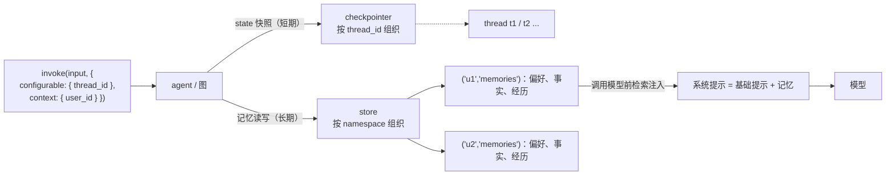

import { Canvas, Controls, Meta } from '@storybook/addon-docs/blocks';
import * as LongTermMemory from './long-term-memory.stories';

<Meta of={LongTermMemory} name="Docs" />

# 长期记忆与 Store

长期记忆是跨 thread 的那一半记忆：「短期记忆」一课的对话历史到 `thread_id` 的边界就停了——换个 id、开个新会话，模型就从零开始。Store 把这个边界打开：它是一个独立的键值文档存储，不按会话组织，而按**命名空间**（namespace，字符串元组，第一维通常是 `user_id`）组织；同一位用户开多少个会话，检索到的都是同一批记忆。记忆不会自己进入模型——要在调用模型前检索并**注入系统提示**；新记忆也不会自己产生——要么模型在对话中主动写回（热路径），要么后台任务统一提炼。读完本课，你应该能预测：换 `thread_id` / 换 `user_id` 分别会看到谁的记忆、`put` 同一个 key 会发生什么、`search` 不传 `query` 时返回什么、以及记忆和 checkpoint 各自管哪一段。



| 关键输入 | 默认 | 回查要点 |
| --- | --- | --- |
| `store`（`createAgent` / `compile` 参数） | 不传 = 无长期记忆 | 传了之后节点、中间件、工具经 `runtime.store` 访问 |
| `namespace` | 无默认，每次读写必填 | 字符串元组；第一维放隔离键（如 `user_id`）；`search` 按前缀匹配 |
| `put` 第四参 `index` | 不设 = 用 store 的索引配置 | `false` 不做向量索引；字段数组（如 `["food_preference"]`）只嵌入指定字段 |
| `search` 的 `limit` | `10` | 超出**静默截断**；分页用 `offset` |
| `search` 的 `query` | 不设 = 不做语义排序 | 只按前缀列出 + `filter` 过滤；需要 store 配了 `index` 才有意义 |
| `search` 的 `filter` | 不设 | 值内等值匹配，支持 `$eq` / `$ne` / `$gt` / `$gte` / `$lt` / `$lte` |
| `index.embeddings` + `index.dims` | 不配 = 纯键值 store | 两者必须成对出现；`fields` 默认 `["$"]`（整个 value 嵌成一个向量） |
| `InMemoryStore` | — | 进程内存，仅开发；生产换 `PostgresStore` 等 |
| `PostgresStore.setup()` | 首次使用必须调用 | 建表，幂等，放应用启动处 |

## 快速上手

沿用「第一个 Agent」一课的工程（依赖 `langchain`、`@langchain/openai`、`@langchain/langgraph`、`dotenv`），在 `.env` 里配置 `OPENAI_API_KEY`，把下面的代码存成 `ltm-agent.ts`，用 `npx tsx ltm-agent.ts` 运行：

```ts
// ltm-agent.ts —— 跨 thread 记忆的最小闭环
// 运行条件：OPENAI_API_KEY 已写入 .env；npx tsx ltm-agent.ts 运行。
import 'dotenv/config';
import { ChatOpenAI } from '@langchain/openai';
import { createAgent, dynamicSystemPromptMiddleware } from 'langchain';
import { InMemoryStore, MemorySaver } from '@langchain/langgraph';
import { z } from 'zod';

// 跨 thread 的记忆仓库：进程内存版，生产换 PostgresStore（见「生产 Store」一节）
const store = new InMemoryStore();

// user_id 走 context：不进 state、不进消息历史，每次调用时单独给
const contextSchema = z.object({ user_id: z.string() });

const agent = createAgent({
  model: new ChatOpenAI({ model: 'gpt-4o-mini' }),
  checkpointer: new MemorySaver(), // 短期记忆照旧按 thread 累积
  store, // 长期记忆：跨 thread 读写
  contextSchema,
  middleware: [
    // 每次调用模型前：按 user_id 的命名空间检索记忆，注入系统提示
    dynamicSystemPromptMiddleware<z.infer<typeof contextSchema>>(
      async (_state, runtime) => {
        const memories = await runtime.store?.search(
          [runtime.context.user_id, 'memories'],
          { limit: 10 },
        );
        const info = memories?.map((m) => `- ${m.value.text}`).join('\n');
        return [
          '你是一个乐于助人的助手。',
          '用户长期记忆（跨会话已知信息）：',
          info || '-（暂无）',
        ].join('\n');
      },
    ),
  ],
});

async function main() {
  // 先手工放一条记忆：namespace 是 (user_id, 分类) 的字符串元组
  await store.put(['user_123', 'memories'], 'profile', {
    text: '用户叫 Bob，喜欢简短直接的回复',
  });

  // 第一段会话：短期记忆按 thread-1 累积
  await agent.invoke(
    { messages: '你好！用一句话介绍你自己。' },
    {
      configurable: { thread_id: 'thread-1' },
      context: { user_id: 'user_123' },
    },
  );

  // 全新 thread：短期记忆从零开始，但长期记忆仍然注入
  const result = await agent.invoke(
    { messages: '我叫什么名字？你喜欢怎么跟我说话？' },
    {
      configurable: { thread_id: 'thread-2' },
      context: { user_id: 'user_123' },
    },
  );
  console.log(result.messages.at(-1)?.content);
  // => 你叫 Bob，我尽量简短直接。（措辞因模型而异）
}

main();
```

对照「短期记忆」一课的结论——同一个换 `thread_id` 的实验，那边模型不知道 Bob，这边一开口就知道。差别只有三处：构造时多传 `store` 和 `contextSchema`、调用时第二参数多传 `context: { user_id }`、多挂一个把记忆拼进系统提示的中间件。记忆来自 store 的命名空间而不是 thread 的消息历史，这就是跨会话的全部秘密。

## 短期记忆与长期记忆的分界

官方概念文档按**范围**划分：短期记忆的作用域是单个 thread，作为 graph state 的一部分由 checkpointer 持久化；长期记忆跨 thread 存在、可在任意 thread 任意时刻召回，由 Store 保存，命名空间自定义（不绑定 thread）。两者不是二选一，而是**正交**的两个维度——一次调用同时携带 `thread_id`（给 checkpointer）和 `context.user_id`（给 store 命名空间）：

| 维度 | 短期记忆 | 长期记忆 |
| --- | --- | --- |
| 范围 | thread（一段会话）内 | 跨 thread，随时召回 |
| 载体 | state 里的 `messages` + checkpointer 快照 | store 里的 JSON 文档 |
| 组织键 | `thread_id` | namespace 元组（第一维通常是 `user_id`） |
| 典型内容 | 消息历史、本会话的中间产物 | 用户偏好、事实、过往经历 |
| 超限手段 | 裁剪 / 摘要 / 删除（「短期记忆」一课） | 按 `limit` 检索注入、按 key 更新删除（本课） |

checkpointer 与快照机制的底层细节归[「持久化」](?path=/docs/persistence--docs)一课；这里只需要记住分工：**checkpointer 管「这段会话发生过什么」，store 管「这位用户 / 这个应用知道什么」**。

长期记忆里存什么，官方借人类记忆分了三类：

| 类型 | 存什么 | Agent 里的例子 |
| --- | --- | --- |
| Semantic（语义记忆） | 事实 | 关于用户的事实（叫 Bob、喜欢简短回复） |
| Episodic（情景记忆） | 经历 | agent 过去的动作（上次这样改代码用户很满意） |
| Procedural（程序记忆） | 规则 / 指令 | agent 自己的系统提示（用「反思」让模型改写自己的指令并存回 store） |

注意术语：semantic memory（心理学概念，存事实）和 semantic search（基于嵌入的检索技术）是两回事。语义记忆有两种组织方式：**Profile**——每位用户一份持续更新的 JSON 文档，结构固定、读取简单，但文档变大后更新容易出错；**Collection**——一组独立的小记忆条目，单条容易生成、召回率高，但更新和检索复杂度上移（要管理插入 / 更新 / 删除的平衡）。Store 的命名空间 + `search` 天然适合 Collection；Profile 则是「一个用户一个 key」的特例，就像快速上手里的 `'profile'` 那条。

## BaseStore 接口

所有 store 实现继承 `BaseStore`（从 `@langchain/langgraph` 导出）。文档按「namespace 像文件夹、key 像文件名」组织：`put(["user_123", "memories"], "m1", {...})` 的完整路径可以理解成 `user_123/memories/m1`。读写接口一共五个，外加批量：

| 方法 | 签名 | 说明 |
| --- | --- | --- |
| `put` | `put(namespace, key, value, index?)` | 写入 / 更新一条（同 key 整体覆盖） |
| `get` | `get(namespace, key)` | 精确取一条，找不到返回 `null` |
| `search` | `search(namespacePrefix, { filter, limit, offset, query })` | 按前缀列出 / 过滤 / 语义排序 |
| `delete` | `delete(namespace, key)` | 删一条 |
| `listNamespaces` | `listNamespaces({ prefix, suffix, maxDepth, limit, offset })` | 浏览命名空间层级 |
| `batch` | `batch([op, op, ...])` | 一次执行多个操作，结果按序返回 |

取回的每条是一个 `Item`：

| 字段 | 说明 |
| --- | --- |
| `value` | 存入的 JSON 对象；**顶层 key 可直接用于 `filter`** |
| `key` | 命名空间内的唯一标识 |
| `namespace` | 该条所属的命名空间元组 |
| `createdAt` / `updatedAt` | 创建 / 最近更新时间；`search` 的排序依据（依后端而定） |

语义检索命中的条目还带 `score`（余弦相似度，-1 到 1）。先看一个不需要 API key 的完整算例：

```ts
// store-demo.ts —— BaseStore 读写算例，不需要 API key；npx tsx store-demo.ts 运行。
import { InMemoryStore } from '@langchain/langgraph';

const store = new InMemoryStore();

async function main() {
  // put(namespace, key, value)：namespace 是字符串元组，key 在命名空间内唯一
  await store.put(['user_123', 'memories'], 'm1', { text: '偏好简短回复' });
  await store.put(['user_123', 'memories'], 'm2', { text: '养了一只猫叫 Mochi' });
  await store.put(['user_456', 'memories'], 'm1', { text: '喜欢意大利菜' });

  // get：按 (namespace, key) 精确取
  console.log(await store.get(['user_123', 'memories'], 'm1'));
  // => { value: { text: '偏好简短回复' }, key: 'm1',
  //      namespace: ['user_123', 'memories'], createdAt, updatedAt }

  // search：按命名空间前缀列出——user_456 的条目不可见
  console.log((await store.search(['user_123', 'memories'])).length); // => 2

  // 前缀匹配不是精确匹配：('user_123',) 也能命中 ('user_123', 'memories')
  console.log((await store.search(['user_123'])).length); // => 2

  // 浏览命名空间：user_123 名下现在有一个
  console.log(await store.listNamespaces({ prefix: ['user_123'], maxDepth: 2 }));
  // => [['user_123', 'memories']]

  // put 同 key = 整体覆盖（upsert），不是字段合并
  await store.put(['user_123', 'memories'], 'm1', { lang: 'zh' });
  console.log((await store.get(['user_123', 'memories'], 'm1'))?.value);
  // => { lang: 'zh' }——旧值的 text 字段消失；要保留旧字段得先 get 再合并写回

  // delete：按 (namespace, key) 删除
  await store.delete(['user_456', 'memories'], 'm1');
  console.log(await store.get(['user_456', 'memories'], 'm1')); // => null
}

main();
```

### put 与 get

`put` 是 upsert 语义：同 namespace 同 key 再 `put`，`value` 被**整体替换**（上面算例的 `{ lang: 'zh' }`），`updatedAt` 刷新、`createdAt` 保留。做「更新用户档案」这类部分更新时，标准写法是先 `get`、合并字段、再 `put` 写回。第四参 `index` 只影响向量索引（见「语义检索」一节），不影响键值读写。

`get` 是唯一精确的读取：知道 key 时永远用它；`search` 才是需要遍历 / 过滤 / 排序时的工具。

### search 与 delete

`search` 的第一个参数是**前缀**，不是精确命名空间：`["user_123"]` 会命中 `("user_123", "memories")` 等一切以它开头的子命名空间——想「一次检索某用户全部记忆」时正好用上；反过来，传空前缀 `[]` 会命中 store 里全部命名空间，把所有用户的记忆一起捞出来，是跨用户泄漏的常见来源。

| 选项 | 默认 | 说明 |
| --- | --- | --- |
| `limit` | `10` | 超出**静默截断**，不报错也不提示；条目多时显式调大或分页 |
| `offset` | `0` | 配合 `limit` 分页（官方分页模式见下方） |
| `filter` | 不设 | 按 `value` 顶层字段等值过滤，支持 `$gt` 等操作符：`{ score: { $gte: 3 } }` |
| `query` | 不设 | 语义检索的自然语言查询，结果按相似度排序并带 `score`；没配 `index` 的 store 传了也不排序 |

不带 `query` 时的排序依后端而定：`PostgresStore` 按 `updatedAt` 降序（最近更新在前），`InMemoryStore` 按插入序（最新在末尾）——切换实现时别依赖默认顺序，需要稳定顺序就用 `query` 或 `filter`。

```ts
// 官方分页模式：翻完整命名空间
let offset = 0;
while (true) {
  const page = await store.search(['alice', 'memories'], { limit: 50, offset });
  if (page.length === 0) break;
  offset += 50;
}
```

`delete(namespace, key)` 与 `get` 同构：精确删一条。没有「按条件批量删」——要清一批就 `search` 出来逐条 `delete`，这正是 Collection 模式下记忆生命周期管理（过期条目要删）的基本循环。

### listNamespaces 与 batch

`listNamespaces` 浏览 store 的目录结构：`prefix` / `suffix` 收窄范围（支持 `"*"` 通配），`maxDepth` 截断层级。调试「我的记忆到底存到哪了」时先调它。`batch` 把多个 put / get / search / listNamespaces 操作合成一次调用，结果按操作顺序返回——批量灌入初始记忆时比循环 `put` 高效。

## 命名空间设计

命名空间是任意长度的字符串元组，层级语义由你定义，官方惯例是把**隔离键放第一维**：`[userId, "memories"]`。元组从左到右是从粗到细的包含关系，和文件路径同构：

```text
("user_123", "memories", "m1")   ≈   user_123/memories/m1
("acme", "user_123", "memories") ≈   acme/user_123/memories   ← 多租户：组织放最前
("agent_instructions", "agent_a") ≈  agent_instructions/agent_a ← 全局：程序记忆不放用户维度
```

三条设计判断：

- **第一维决定隔离边界。** 放 `user_id`，每个用户只能看见自己的记忆；放 `org_id` 再放 `user_id`，就是「组织内按用户隔离」。`search` 的前缀语义让上层维度可以整体检索：`store.search(["acme"])` 命中该组织全部记忆。
- **不要把 `thread_id` 放进长期记忆的命名空间。** 那等于把跨会话存储退化成按会话分箱，换 thread 就读不到——需要会话隔离的信息属于短期记忆（[「短期记忆」](?path=/docs/short-term-memory--docs)）。
- **分类放后维。** `("user_123", "memories")`、`("user_123", "profile")`、`("user_123", "episodes")` 共享同一个隔离键，检索粒度由前缀长度决定。

下面的实例把「隔离 + 注入」合在一起对照：同一个 store、两个 `user_id` 命名空间、两个 `thread_id`，观察换哪一个会改变模型看到的记忆。

<Canvas of={LongTermMemory.Interactive} />
<Controls of={LongTermMemory.Interactive} />

| 读者操作 | 可观察证据 |
| --- | --- |
| 切换「当前 user_id」 | 高亮的命名空间切换到对应用户，系统提示里的记忆行整体替换——不同用户的记忆互不可见 |
| 只切换「当前 thread_id」 | 命名空间高亮与注入的记忆**完全不变**——记忆跟 `user_id` 走，不跟会话走 |
| 调大记忆数并调小「注入上限」 | 命名空间里条目变多，但系统提示只注入前 `limit` 条，其余标注「未注入」——`search` 默认 `limit: 10` 静默截断的缩影 |
| 打开「热路径写入」 | 新记忆落在**当前 user** 的命名空间（带「本次新增」标记）；切到任意 `thread_id` 它仍在——写回的隔离键来自 `context`，与 thread 无关 |
| 打开 Show code | 看到该 Canvas 实际执行的 `example.ts`：纯 TS 确定性模拟，不依赖 `@langchain/*` |

## 记忆如何进入模型

store 里的记忆对模型是不可见的——必须有人检索并拼进提示。整件事分「挂载 → 读注入 → 写回」三步。挂载在 `createAgent`（或图 `compile`）时一次完成：

```ts
// createAgent 路径：store + contextSchema 一起给
const contextSchema = z.object({ user_id: z.string() });
const agent = createAgent({ model, tools, store, contextSchema, checkpointer });

// 调用时 user_id 走 context（不进 state、不进消息历史）
await agent.invoke(input, {
  configurable: { thread_id: 't1' },
  context: { user_id: 'user_123' },
});

// Graph API 路径：checkpointer 与 store 在 compile 同时接线
const graph = workflow.compile({ checkpointer, store });
// 节点的第二参数（官方文档命名为 runtime）上能拿到 store 与 context，
// 完整的节点读写示例见下文「读：注入系统提示」
```

`context` 是每次调用的临时输入：不持久化、不进消息历史，正好承载 `user_id` 这类「知道该查谁」的标识；`thread_id` 则走 `configurable` 给 checkpointer。两个键在两个通道里，互不干扰。

### 读：注入系统提示

`createAgent` 下最直接的注入点是 `dynamicSystemPromptMiddleware`——它在每次调用模型前重算系统提示（快速上手已用过完整版）：

```ts
import { dynamicSystemPromptMiddleware } from 'langchain';

const withMemories = dynamicSystemPromptMiddleware<z.infer<typeof contextSchema>>(
  async (_state, runtime) => {
    const memories = await runtime.store?.search(
      [runtime.context.user_id, 'memories'],
      { limit: 10 },
    );
    const info = memories?.map((m) => `- ${m.value.text}`).join('\n') ?? '';
    return `你是一个乐于助人的助手。\n\n用户长期记忆：\n${info}`;
  },
);
// createAgent({ ..., middleware: [withMemories] })
```

需要动整个模型请求（改 messages、换工具、缓存控制）而不是只改系统提示时，用 `wrapModelCall`——`request` 上有 `state`、`runtime`、`messages`、`systemMessage`，官方示例就是用它拼接系统消息：

```ts
const wrap = createMiddleware({
  name: 'InjectMemories',
  wrapModelCall: async (request, next) => {
    const userId = (request.runtime.context as { user_id: string }).user_id;
    const memories = await request.runtime.store?.search(
      [userId, 'memories'],
      { limit: 10 },
    );
    const info = memories?.map((m) => `- ${m.value.text}`).join('\n') ?? '';
    return next({
      ...request,
      systemMessage: request.systemMessage.concat(`\n\n用户长期记忆：\n${info}`),
    });
  },
});
```

中间件机制（挂载点、执行顺序、钩子一览）归[「中间件」](?path=/docs/middleware--docs)一课。Graph API 没有「系统提示」概念，就在节点里手动拼 system 消息——官方 add-memory 指南的标准模式：

```ts
import type { GraphNode } from '@langchain/langgraph';

const callModel: GraphNode<typeof State> = async (state, runtime) => {
  const userId = runtime.context?.user_id as string;
  const memories = await runtime.store?.search(
    [userId, 'memories'],
    { query: String(state.messages.at(-1)?.content), limit: 3 },
  );
  const info = memories?.map((d) => d.value.text).join('\n') || '';
  const response = await model.invoke([
    { role: 'system', content: `You are a helpful assistant. User info: ${info}` },
    ...state.messages,
  ]);
  return { messages: [response] };
};
```

注入什么、注入多少由检索参数决定：条目少就整段列出（`limit: 10`）；条目多就用 `query` 做语义检索只注入最相关的几条（需要配 `index`，见下一节）。注入的位置放在系统提示、用明确的段落标签（如「用户长期记忆：」），比散进对话历史更稳定。

### 写：热路径与后台

新记忆怎么产生？官方概念文档给两条路，取舍真实存在：

| 写入时机 | 做法 | 换来 | 代价 |
| --- | --- | --- | --- |
| 热路径（in the hot path） | 对话中由模型决定写入，通常做成一个工具 | 实时可用，可当场告知用户「记住了」 | 多一个工具占模型注意力；边聊边想「存不存」增加延迟，质量易受干扰 |
| 后台（in the background） | 会话结束后由后台任务提炼写入（定时 / cron / 手动触发） | 主链路零延迟，提炼逻辑集中、可控 | 有时滞——其他 thread 在下次提炼前看不到新记忆；触发时机要设计 |

热路径的标准写法是给 agent 一个 `save_memory` 工具，工具第二参数是自动注入的 `ToolRuntime`，上面有 `store` 和 `context`：

```ts
// save-memory.ts —— 热路径写回：模型在对话中决定何时保存
// 运行条件：OPENAI_API_KEY 已写入 .env；与上面的 agent 组合使用。
import { tool, type ToolRuntime } from '@langchain/core/tools';
import { BaseStore } from '@langchain/langgraph';
import { z } from 'zod';

type AppContext = z.infer<typeof contextSchema>; // { user_id: string }

const saveMemory = tool(
  async ({ memory }, runtime: ToolRuntime<unknown, AppContext>) => {
    const userId = runtime.context.user_id;
    // 运行时注入的就是 LangGraph 的命名空间 store（类型声明滞后，断言一次）
    const store = runtime.store as unknown as BaseStore;
    await store.put([userId, 'memories'], crypto.randomUUID(), { text: memory });
    return '已保存。';
  },
  {
    name: 'save_memory',
    description: '保存一条关于用户的长期记忆，跨会话可用。',
    schema: z.object({ memory: z.string().describe('要记住的一条事实') }) },
  },
);

// createAgent({ model, tools: [saveMemory], store, contextSchema, checkpointer })
```

两个细节：`crypto.randomUUID()` 做条目 key 是官方推荐的「每条记忆一个新 key」写法（Collection 模式）；写回的命名空间隔离键取自 `runtime.context.user_id`——所以写进的是**当前用户**的空间，与当前是哪个 thread 无关。工具定义与 schema 的完整规则归[「工具」](?path=/docs/tools--docs)一课。

官方概念文档还给出第三类写回——**程序记忆**：让 agent 反思并改写自己的系统提示，`put(["agent_instructions"], "agent_a", { instructions })` 存回 store，下次调用模型前读取。这正是「记忆注入系统提示」反过来用：提示词本身成为被 store 管理的长期记忆。

## 语义检索

记忆一多，「整段列出」就不够了：注入 50 条记忆不如只注入与当前话题最相关的 3 条。给 store 配 `index`，`search` 的 `query` 就会按向量相似度排序：

```ts
// semantic-store.ts —— 支持语义检索的 store
// 运行条件：OPENAI_API_KEY 已写入 .env（embeddings 调用计费）；npx tsx semantic-store.ts 运行。
import 'dotenv/config';
import { OpenAIEmbeddings } from '@langchain/openai';
import { InMemoryStore } from '@langchain/langgraph';

const store = new InMemoryStore({
  index: {
    embeddings: new OpenAIEmbeddings({ model: 'text-embedding-3-small' }),
    dims: 1536, // 必须与 embeddings 模型匹配
    // fields 默认 ["$"]：把整个 value 拼成一个向量；也可只嵌入特定字段
  },
});

async function main() {
  await store.put(['user_123', 'memories'], 'food', { text: 'I love pizza' });
  await store.put(['user_123', 'memories'], 'work', { text: '在杭州做前端' });

  // 语义检索：query 与条目内容算相似度，按 score 降序返回
  const items = await store.search(['user_123', 'memories'], {
    query: 'What does the user like to eat?',
    limit: 1,
  });
  console.log(items[0].key, items[0].score?.toFixed(3));
  // => food 0.8xx（分数依文本而定；越接近 1 越相关）
}

main();
```

三个配置项的边界：`embeddings` 与 `dims` **必须成对出现**且维度匹配（`text-embedding-3-small` 是 1536）；`fields` 默认 `["$"]` 嵌入整个 value，传字段路径数组（如 `["food_preference"]`）就只嵌入该字段——「value 里有代码片段等大而不相关的内容」时用它省 token。写入侧还能按条覆盖：`put(ns, key, value, false)` 跳过索引（仍可按前缀 / filter 检索），`put(ns, key, value, ["field"])` 只索引该字段。用 Gemini 时把 embeddings 换成 `new GoogleGenerativeAIEmbeddings({ model: 'models/text-embedding-004' })`（`@langchain/google-genai`），`dims` 相应改 768。

使用 LangSmith 的 Agent Server 部署时，store 由服务端托管，语义检索在 `langgraph.json` 里配置同款 `index`。嵌入模型的原理、选型与向量库的写入检索归[「嵌入与向量库」](?path=/docs/embeddings-vector-stores--docs)一课；本课只需要「配了 index，query 才排序」这一件事。

## 生产 Store

和 checkpointer 一样，`InMemoryStore` 只存进程内存，重启即失，定位是开发与测试；生产换数据库实现，接口同基类、调用代码零改动：

| 包 | 实现 | 官方定位 |
| --- | --- | --- |
| `@langchain/langgraph` | `InMemoryStore`（随附的 `@langchain/langgraph-checkpoint` 提供） | 内存实验 |
| `@langchain/langgraph-checkpoint-postgres` | `PostgresStore` | 生产首选（LangSmith 同款） |
| `@langchain/langgraph-checkpoint-mongodb` | `MongoDBStore` | 生产可用；支持服务端自动嵌入（Atlas） |
| `@langchain/langgraph-checkpoint-redis` | `RedisStore` | 生产可用 |
| — | `UpstashStore`、`AsyncBatchedStore`（写缓冲基类，`@langchain/langgraph` 导出） | 托管 / 高吞吐场景 |

以 Postgres 为例的完整切换（与「持久化」一课切 checkpointer 同款套路）：

```ts
// 运行条件：npm i @langchain/langgraph-checkpoint-postgres；
// 一个可连接的 Postgres 实例，连接串写入环境变量 POSTGRES_URI。
import { PostgresStore } from '@langchain/langgraph-checkpoint-postgres';

const store = PostgresStore.fromConnString(process.env.POSTGRES_URI!, {
  index: {
    embeddings: new OpenAIEmbeddings({ model: 'text-embedding-3-small' }),
    dims: 1536,
  },
});

// 首次使用必须调用：建表，幂等，放应用启动处
await store.setup();

// agent / 图代码不变：还是那一个 store 参数
const agent = createAgent({ model, store, contextSchema });
```

两个工程细节：漏 `setup()` 的典型症状是运行时报表不存在；使用 LangSmith 的 Agent Server 部署时 store 由服务端自动提供，不需要手动配置。

## 最佳实践

- 命名空间第一维放稳定的隔离键（`user_id`，多租户再加 `org_id` 前缀），分类放后维；隔离键来自 `context` 而不是 `thread_id`，否则跨会话记忆退化成会话分箱。
- 写入时机按产品需求选：客服个性化这类「当场生效」的记忆走热路径工具；用户画像这类「汇总提炼」的记忆走后台任务，并接受时滞——混合使用（偏好热路径、画像后台）是常见形态。
- 语义记忆的组织按规模选：少而稳定（< 20 条、结构固定）用 Profile（一个用户一个 key，先 get 再合并写回）；多而增长用 Collection（每条一个 `randomUUID()` key，配 `index` 用 `query` 检索）。
- 注入限量：`limit` 默认 10 且静默截断——条目多时要么显式调大，要么改用语义检索只注入最相关的几条；注入位置固定在系统提示、带明确段落标签。
- 开发用 `InMemoryStore`、生产换 `PostgresStore`，切换只动 `createAgent` / `compile` 传的那一个对象；长跑服务的写入吞吐大时评估 `AsyncBatchedStore` 做写缓冲。

## 常见问题

- `search` 明明该有更多结果，只回来 10 条
  `limit` 默认 10，超出静默截断。显式传更大的 `limit`，或用 `offset` 分页（官方翻页模式见「search 与 delete」）。
- `import { InMemoryStore } from 'langchain'` 之后 `put` 报「方法不存在」
  `langchain` 包转出的 `InMemoryStore` 来自 `@langchain/core/stores`，是 `mget` / `mset` 的扁平键值实现；长期记忆的命名空间版必须 `import { InMemoryStore } from '@langchain/langgraph'`。两个包的 `BaseStore` 同样不同名同实，认准导入来源。
- 换了 `thread_id` 之后模型忘了用户信息
  这是短期记忆的设计边界（见「短期记忆」一课）。跨 thread 要的是本课的 store：挂 `store`、调用时给 `context.user_id`、再加读注入——三样齐了才生效，只挂 `store` 不注入的话模型仍然看不到。
- 工具里 `runtime.store.put(...)` 过不了类型检查
  `ToolRuntime` 上 `store` 的类型声明是 core 的扁平 `BaseStore`，但运行时注入的其实是 LangGraph 的命名空间 store。断言一次再用：`const store = runtime.store as unknown as BaseStore`（从 `@langchain/langgraph` 导入 `BaseStore`）。
- `put` 更新后旧字段丢了
  `put` 是整体覆盖不是字段合并。先 `get` 旧值、合并新字段、再 `put` 写回；Profile 模式下这条几乎是必经路径。
- 模型看得到记忆但不照做
  先检查注入量与位置：记忆行数过多会稀释注意力，把注入控制在系统提示的一个明确段落里（如「用户长期记忆：」标签），并配合 `limit` / `query` 只注入相关条目；仍不生效再调整标签措辞与指令的相对位置。
- 切到 `PostgresStore` 后运行报数据库表不存在
  `setup()` 没调用。它在首次使用前调一次即可、幂等，放应用启动处。

## 总结回顾

摘要：

长期记忆与短期记忆正交：checkpointer 按 `thread_id` 存会话内 state，Store 按命名空间元组（第一维是 `user_id` 这类隔离键）存跨 thread 的 JSON 文档。`BaseStore` 五个读写方法——`put`（upsert，同 key 整体覆盖）与 `get` 精确读写，`search` 按前缀列出 / `filter` 过滤 / `query` 语义排序（`limit` 默认 10 静默截断），`delete` 精确删，`listNamespaces` 浏览目录，`batch` 批量。记忆进入模型靠挂载 + 注入：`createAgent({ store, contextSchema })` 或 `compile({ checkpointer, store })`，调用时 `user_id` 走 `context`；读在 `dynamicSystemPromptMiddleware`、`wrapModelCall` 或图节点里 `search` 后拼进系统提示，写在热路径（`save_memory` 工具经 `ToolRuntime` 拿 store）或后台任务。配 `index`（`embeddings` + `dims`，`fields` 默认 `["$"]`）后 `query` 按相似度排序。生产从 `InMemoryStore` 换 `PostgresStore`（`fromConnString` + `setup()`），代码零改动。

一句话：

> 长期记忆 = 跨 thread 的 Store：`namespace` 元组第一维放隔离键，记忆靠「调用前检索注入系统提示」进入模型、靠「热路径或后台写回」产生——`thread_id` 决定会话，`user_id` 决定记忆。

知识要点：

- 短期记忆与长期记忆分别以什么为主键？一次调用里 `thread_id` 和 `user_id` 各走哪个通道？
- `put` 对已存在的同 key 条目做什么？部分更新的标准写法是什么？
- `search` 的第一个参数为什么叫前缀？`limit` 默认多少、超出时发生什么？
- 不带 `query` 的 `search` 返回顺序由什么决定？`filter` 支持哪些匹配方式？
- 命名空间第一维应该放什么？为什么不该放 `thread_id`？
- `createAgent` 挂 store 需要哪几个参数配合？`context` 和 `configurable` 各承载什么？
- 把记忆注入系统提示有哪三个挂载点？各自适用什么场景？
- 热路径与后台写入各自的代价是什么？`ToolRuntime` 上能拿到什么？
- `index` 配置的三个字段是什么、默认值是什么？不配 `index` 时 `query` 会怎样？
- 从 `InMemoryStore` 切到 `PostgresStore` 要改哪些代码？`setup()` 何时调用？

## 参考资料

- [LangChain.js Long-term memory（官方：长期记忆用法、namespace+key、工具读写 store、InMemoryStore 与 PostgresStore）](https://docs.langchain.com/oss/javascript/langchain/long-term-memory)
- [LangGraph.js Stores（官方：BaseStore 语义、search 前缀与分页、index 配置、生产实现清单）](https://docs.langchain.com/oss/javascript/langgraph/stores)
- [LangChain Memory 概念（官方：短期/长期分界、三类记忆、Profile 与 Collection、热路径与后台写入）](https://docs.langchain.com/oss/javascript/concepts/memory)
- [LangGraph.js Add memory（官方：compile 挂 store、节点 runtime 检索注入、跨 thread 验证模式）](https://docs.langchain.com/oss/javascript/langgraph/add-memory)
