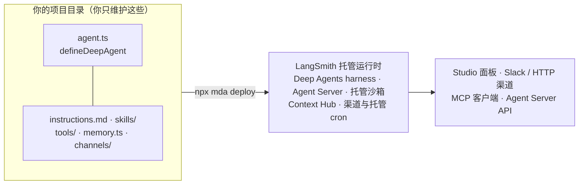
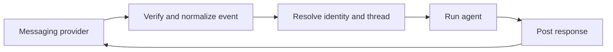

import { Canvas, Controls, Meta } from '@storybook/addon-docs/blocks';
import * as ManagedDeepAgents from './managed-deep-agents.stories';

<Meta of={ManagedDeepAgents} name="Docs" />

# Managed Deep Agents

上一课你自己把 Deep Agents 推上生产：选 backend、配 permissions、接沙箱、自己跑服务器。本课换一条路：**Managed Deep Agents（MDA）是 LangSmith 云端托管的 Deep Agents 运行时**——你把 agent 写成一个目录里的文件（`agent.ts`、`instructions.md`、`skills/`、`tools/`……），`mda deploy` 把它交给平台，harness 循环、文件系统、沙箱、记忆、Agent Server 全部由 LangSmith 运维。它不是第二套框架：MDA 跑的就是开源 Deep Agents harness，agent loop、六个内置文件工具、subagents、skills 与前三课写的完全相同；差别只在「谁编译、谁运维」——`createDeepAgent` 返回你自己运行的编译产物，`defineDeepAgent` 返回一份交给托管运行时的定义。读完你应该能预测：改哪个文件影响什么、一次 `mda deploy` 上传了什么、哪些职责从你的代码清单里消失了。



| 命令 | 作用 | 关键差异点 |
| --- | --- | --- |
| `npx managed-deepagents init <name>` | 脚手架一个新项目 | 新建目录，不能在已有项目里原地运行 |
| `npx mda dev` | 编译到 `.mda/build`，跑本地 Agent Server 并打开 Studio | 默认热重载；`--port` / `--hostname` / `--no-browser` / `--no-reload` |
| `npx mda build` | 只编译不运行 | 不校验 definition 调用，遗留问题到 graph 加载才报错 |
| `npx mda deploy` | 部署到 LangSmith Agent Server | `--name` / `--deployment-type prod` / `--no-wait` |
| `npx mda evals init -i` | 初始化 Harbor 评估工作区 | 生成 `.mda/evals/`，不进部署构建 |

版本与状态基线：Managed Deep Agents 处于 public beta，**仅在 LangSmith Cloud 美国区可用**，workspace 需要 beta 访问权限；`mda` CLI 来自 `managed-deepagents` 包（版本对齐 `mda --version` 报告的版本）。示例模型沿用官方 quickstart 的 `openai:gpt-5.5`——官方文档把 OpenAI / Google / Anthropic 三种 provider 示例并列，本手册按 NOTE 惯例以 OpenAI 为主，差异处补对照。

## 快速上手

从零到托管部署的最小闭环：脚手架 → 写 key 与提示词 → 定义 agent → Studio 本地验证 → 部署。

```bash
# 运行条件：Node ≥ 20 + npm；LangSmith 账号（workspace 有 MDA 公测权限）；
# 模型 provider 的 API key；CLI（mda）由 managed-deepagents 包提供。
npx managed-deepagents init research-assistant
cd research-assistant
```

`.env` 里放两把 key：模型 provider 的和 LangSmith 的（后者认证本地 `mda dev`、部署与 Studio）：

```text
OPENAI_API_KEY=<OPENAI_API_KEY>
LANGSMITH_API_KEY=<LANGSMITH_API_KEY>
```

`instructions.md` 写系统提示词（不是 `agent.ts` 里的参数）：

```markdown
# Research assistant

You are a careful research assistant. Use internet search to find sources,
keep notes, and return concise answers with citations.
```

`agent.ts` 只剩定义本身——name、model、工具：

```ts
import { defineDeepAgent } from 'managed-deepagents';

// OpenAI 内置的 web search：服务端搜索，不用额外装包或配 key
export const agent = defineDeepAgent({
  name: 'research-assistant',
  model: 'openai:gpt-5.5',
  tools: [{ type: 'web_search_preview' }],
});
```

本地验证与部署：

```bash
npm install
npx mda dev      # 编译 → 本地 Agent Server → 自动打开 LangSmith Studio
npx mda deploy   # 部署到 LangSmith Agent Server，结束时打印部署面板 URL
```

预期行为：Studio 里问 "What were the main announcements from the latest LangChain release?"，agent 调 web search 工具并返回带引用的回答；`mda deploy` 完成后打开面板 URL，部署状态 ready，同样的问题得到同样带工具调用的回答。官方还提供同名的 `managed-deep-agents` 技能（`npx skills add langchain-ai/langchain-skills --skill managed-deep-agents --yes`），让编码 agent 代你走完这套流程。

## 职责边界

MDA 的官方定位一句话：**Build your agent as a directory of files while LangSmith runs the harness and runtime**——你写 agent 的「智能部分」（instructions、tools、skills、model），平台跑「执行部分」（agent 循环、文件系统、subagents、Agent Server）。分工表：

| 你提供 | 平台供给 |
| --- | --- |
| instructions（`instructions.md`） | Deep Agents harness：agent loop、文件系统工具、subagents 委派 |
| tools（`tools/`） | 托管运行时：Agent Server API、threads、runs、streaming、MCP endpoint |
| skills（`skills/`） | 托管沙箱、durable memory、channels、schedules（以项目文件中的声明启用） |
| model（`agent.ts` 的 `model`） | Context Hub（托管 instructions / skills / memory）、可观测性 |

「不是第二套框架」落在代码上就是**谁编译 agent**。`defineDeepAgent` 接受 `createDeepAgent` 的选项（去掉运行时自有的部分），并要求一个静态 `name`；托管运行时在部署时用 `createDeepAgent` 编译并补齐组件：

```ts
// 自托管（上一课）：返回编译好的 agent——backend、store、checkpointer、server 都是你自己的事
import { createDeepAgent } from 'deepagents';
export const agent = await createDeepAgent({ model: 'openai:gpt-5.5' /* ... */ });

// 托管（本课）：返回一份定义——交给 mda CLI，运行时补齐组件后编译
import { defineDeepAgent } from 'managed-deepagents';
export const agent = defineDeepAgent({ name: 'research-assistant', model: 'openai:gpt-5.5' });
```

逐项对照两种模式下同一职责由谁承担、你写什么（纯确定性模拟，两侧文案为官方职责划分的归纳）：

<Canvas of={ManagedDeepAgents.ResponsibilityMatrix} />
<Controls of={ManagedDeepAgents.ResponsibilityMatrix} />

| 读者操作 | 可观察证据 |
| --- | --- |
| 关注点切到「跨会话记忆」 | 左侧要 `StoreBackend` + 自己运行的 store + namespace 工厂；右侧只要一个 `memory.ts` 文件，存储由 Context Hub 支撑 |
| 关注点切到「代码执行沙箱」 | 左侧自己创建/复用/销毁沙箱（TTL 与作用域自己管）；右侧 `sandbox/index.ts` 声明即由平台创建、快照、闲置时停止 |
| 关注点切到「服务器与 API」 | 右侧由 Agent Server 自动供给 threads、runs、streaming 与 MCP endpoint，左侧要自己跑进程或写 `langgraph.json` |
| 关注点切到「草稿与任务文件」 | 托管定义里没有（也不能有）`backend` 参数：文件归属交给平台 |
| 任一关注点下看左下角读数 | 托管侧「你写的」始终是一个声明文件，承担者是 LangSmith 托管运行时 |
| 打开 Show code | 看到该 Canvas 实际执行的 `example.ts`：`FOCUS_ITEMS` 查表与面板绘制，不依赖 `@langchain/*` |

### 何时选托管

官方迁移指南按七个关注点给出对照：

| 关注点 | 自托管 Deep Agents | Managed Deep Agents |
| --- | --- | --- |
| 托管 | 自己跑进程 / 容器，或部署为 LangSmith Deployment | LangSmith 在 Agent Server 上托管，`mda deploy` 即完成部署 |
| 文件系统与 shell | 任意 backend：agent state、本地磁盘、store 或自备沙箱 | 一个托管沙箱：文件中声明，LangSmith 创建、快照、闲置时停止 |
| 跨会话记忆 | 自己运行存储并接线 | 一个共享 memory 树，加一个文件即可启用 |
| 终端用户的第三方访问 | 为每个用户配置并存储凭据 | Connections 持有 workspace 密钥并执行 OAuth |
| 聊天界面 | 自己写集成 | Channels 连接 Slack 等消息服务 |
| 定时运行 | 自己运行调度器 | Schedules 运行托管 cron 任务 |
| agent 周围的代码 | 自己写（自定义路由、应用代码） | 仅托管 agent；要自定义应用代码用 LangSmith Deployment |

决策原则：想要渠道、OAuth、定时运行、托管沙箱、持久记忆这一层而**不想自己运维**就迁 MDA；需要自己掌控这一层就留在 Deep Agents（自托管生产化的 backend / permissions / 沙箱 / 容错四条配置轴见[「生产化」](?path=/docs/deep-agents-production--docs)）。官方明确「先在 Deep Agents 上开发、生产就绪后再迁移」是正常路径——迁移是重新打包而非重写，tools、middleware、subagents 原样保留。

四种情况**不能直接迁移**：手写 `BackendProtocol` 的自定义 backend（托管沙箱是唯一选择）；自备 store / checkpointer（threads、runs、持久化由 Agent Server 供给，特定 store 逻辑要移进 tool 或 middleware）；自定义应用代码 / 路由（MDA 只托管 agent，不托管 Web 应用，需要就用 LangSmith Deployment）；以及 Python 侧的 `state_schema`（`define_deep_agent` 不接受；TypeScript 的 `defineDeepAgent` 接受 `stateSchema`，无此限制）。

## 项目结构

MDA 项目没有 `langgraph.json`——上一课 LangSmith Deployment 用它映射 graphs，MDA 用 `agent.ts` 里 `defineDeepAgent` 的 `name` 作为 graph ID，配置全部换成「文件存在即启用」。项目文件分三类：

| 路径 | 类别 | 职责 |
| --- | --- | --- |
| `agent.ts`（或 `agent.tsx`） | 必需 | 唯一必需文件：`defineDeepAgent` 创建并导出名为 `agent` 的定义；一个项目只能有一个 agent 入口 |
| `instructions.md` | 托管上下文 | 系统提示词；部署时同步 Context Hub，之后可在 Hub 更新而无需重新部署 |
| `skills/<name>/SKILL.md` | 托管上下文 | 每个目录一个技能（机制归[「技能」](?path=/docs/skills--docs)与 5.2.2），同样同步 Context Hub |
| `memory.ts` | 托管上下文 + 托管配置 | 存在即启用跨会话记忆：`export const memory = defineMemory({ scope: 'agent' })` |
| `tools/`、`middleware/` | 应用代码 | 普通模块，从 agent 入口导入（工具写法归[「工具」](?path=/docs/tools--docs)，中间件归[「中间件」](?path=/docs/middleware--docs)） |
| `tools/mcp.ts` | 托管配置（例外） | MCP 连接器声明，导出名为 `mcp`（不是普通工具模块） |
| `sandbox/index.ts` | 托管配置 | 存在即启用托管沙箱（`defineSandbox`） |
| `identity.ts` | 托管配置 | 调用方认证（如 `auth.langsmithApiKey()`）；无此文件则无托管认证，`mda dev` 会报 `Identity none` |
| `channels/<name>.ts` | 托管配置 | 消息渠道声明（Slack / HTTP，见「渠道」） |
| `schedules/<name>.ts` | 托管配置 | 托管 cron 声明 |
| `package.json` | 依赖 | 声明项目依赖 |
| `.env` | 密钥 | 本地开发加载；非保留条目在部署时转发为 hosted secrets（见「部署」） |
| `evals/` | 评估 | Harbor 评估工作区（`harbor-job.json` + 各任务目录）；`mda evals init -i` 初始化，生成物在 `.mda/evals/` 下，不进部署构建；评估方法归[「Agent 评估」](?path=/docs/agent-evals--docs) |

四条结构规则：托管声明支持 `.tsx` / `.mts` / `.cts` 扩展名变体；`channels/` 与 `schedules/` 只有**直接子项**被视为托管声明，嵌套模块不算；`mda build` 会把整个项目根复制到 `.mda/build`、`mda deploy` 全部上传，所以项目根只放需要部署的内容，无关文件移出去；`.gitignore` 至少加 `.env`、`.env.*`、`.mda/`。

## agent 定义

入口约束：定义必须在项目根部的 `agent.ts` / `agent.tsx` 内调用并导出为 `agent`（`src/` 布局可以保留，但入口在根；`mda build` 不校验 definition 调用，遗留的托管参数要到 graph 加载时才报错）。

| 参数 | 说明 |
| --- | --- |
| `name` | 必填静态字符串，须匹配 `[a-zA-Z][a-zA-Z0-9_-]*`；用作 graph ID、默认部署名、客户端的 `assistantId`，可用 `mda deploy --name` 覆盖 |
| `model` | `provider:model` 字符串（如 `openai:gpt-5.5`），或传 LangChain chat model 实例以配置参数 |
| `tools` | 本地模块定义的工具数组；远程 MCP 服务器的工具走 `tools/mcp.ts` 的 MCP connectors |
| `middleware` | 包裹模型调用、工具调用与 agent 生命周期，按数组顺序执行（机制归[「中间件」](?path=/docs/middleware--docs)） |
| `subagents` | 委派专门任务的子 agent，各自可有 prompt、model、tools（归 5.2.2） |
| `permissions` | 文件系统工具的路径级读写规则（语义归上一课）；**声明 sandbox 后会被清空** |
| `interruptOn` | 在选定工具调用前暂停等人批准 / 编辑 / 拒绝（机制归[「人机协同」](?path=/docs/human-in-the-loop--docs)） |
| `responseFormat` | 要求输出符合 schema 的结构化数据（归[「结构化输出」](?path=/docs/structured-output--docs)） |
| `contextSchema` / `stateSchema` | 调用 context 与状态的 schema；`stateSchema` 为 TS 端独有（Python 端不接受） |
| `cache` / `debug` | `createDeepAgent` 的同名选项原样保留 |

注意 `instructions`、`skills`、`memory` **不在定义参数里**——系统提示词、技能、记忆、沙箱、身份、渠道、调度都通过项目文件配置，这是 MDA 与 `createDeepAgent` 最大的用法差异。

`model` 的两种形态与一条捷径：

```ts
import { defineDeepAgent } from 'managed-deepagents';

// 直接调 provider：冒号分隔，key 放 .env（官方另示例 google:gemini-3.6-flash、anthropic:claude-sonnet-4-6）
export const agent = defineDeepAgent({
  name: 'research-assistant',
  model: 'openai:gpt-5.5',
});
```

`model` 的另一条路是 LLM Gateway（每个项目仍然只有一个 agent 入口，下面是另一个项目的写法）：

```ts
// LLM Gateway：斜杠分隔，统一加限流、回退等策略；
// LangChain 托管模型（如 moonshotai/kimi-k3）无需 provider secret、消耗 Gateway Credits；
// workspace 配置过的 provider（如 anthropic/claude-opus-5）用自己的 provider 账单
export const gatewayAgent = defineDeepAgent({
  name: 'my-agent',
  model: 'langsmith:moonshotai/kimi-k3',
});
```

新项目初始化时可以直接走 Gateway：`npx mda init my-agent --gateway`。从 `createDeepAgent` 迁移时按下表对号入座：

| `createDeepAgent` | MDA 去向 |
| --- | --- |
| `model` / `tools` / `middleware` / `subagents` / `interruptOn` / `responseFormat` / `contextSchema` / `stateSchema` / `cache` / `debug` / `permissions` | 原样保留，名字不变 |
| （无） | 新增必填 `name` |
| `systemPrompt` | 文本移入 `instructions.md` 后删除该参数 |
| `skills` | 移入 `skills/` 目录（每个 skill 一个目录，含 `SKILL.md`） |
| `memory` | 移入 `memory.ts`；注意挂载的是**空**记忆树，旧记忆内容要手动搬进 `instructions.md` 或 skill |
| `backend` | 换成 `sandbox/` 声明（`defineSandbox({ idleTtlSeconds: 600, defaultTimeout: 600 })`，可加 `sandbox/setup.sh` 做快照） |
| `store` / `checkpointer` | 删除，由托管运行时供给 |

## 本地开发

`mda dev` 在部署前把项目跑起来：校验并编译到 `.mda/build` → 把 `.env` 复制进本地构建（必要时附加仅本地使用的身份配置）→ 为 instructions、skills、memory 创建**本地 Context Hub mock** → 启动 LangGraph 开发服务器 → 在 LangSmith Studio 中打开 agent。它不会创建或更新任何托管部署。

| 参数 | 作用 |
| --- | --- |
| `--port PORT` | 本地服务器端口 |
| `--hostname HOST` | 监听的主机名 |
| `--no-browser` | 启动但不自动打开 Studio |
| `--no-reload` | 关闭 LangGraph 开发服务器的热重载 |

热重载的边界要记住：graph / agent 代码层默认热重载（`--no-reload` 可关），但项目结构与托管声明层的改动需要**停止并重新运行 `mda dev`** 重新编译。本地默认值还有三条与部署环境不同：Studio 自动提供一个**测试用户**（identity 行为是假的）；配置的沙箱不可用时 agent 回退到**临时本地文件夹**（CLI 打印该路径）；`schedules` 只列出、**不会运行**。所以官方提醒：生产使用前应在开发部署中测试身份与沙箱行为，不要只信 `mda dev`。

## 部署

前置条件：有 MDA 公测权限的 workspace、`LANGSMITH_API_KEY`（`.env` 或 shell 环境）、`mda` CLI、TypeScript 项目 `npm install`、模型凭证（`.env` / shell 环境或 LangSmith workspace secrets 三处任一）。

`mda deploy` 做四件事：把 code-first 项目编译为托管的 LangGraph app；同步 deploy-owned context 到 Context Hub；上传编译源码；触发 LangSmith hosted deployment build。输入路由（官方原文）：

| 输入 | 去向 |
| --- | --- |
| `instructions.md` + `skills/**` | Context Hub 的 deploy-owned context |
| `.env` | deploy 认证 + 非保留的 hosted secrets（不进归档） |
| 项目源码文件 | `.mda/build` 源码归档 → hosted deployment |
| `schedules/**` | 部署 live 之后配置为 LangSmith cron jobs |

```bash
npx mda deploy                            # 基本部署；结束时打印 LangSmith 部署面板 URL
npx mda deploy --name research-assistant  # 覆盖 name 给出的默认部署名
npx mda deploy --deployment-type prod     # 生产部署
npx mda deploy --no-wait                  # 不等待构建即退出；schedule 对账被跳过（CLI 在部署达到 DEPLOYED 前返回）
```

instructions 的同步是单向的：deploy 时 `instructions.md` 与 `skills/` 进 Context Hub，**之后可以直接在 Hub 里更新它们而无需重新部署**；反过来，改本地文件不会自动同步到已部署的 agent，要等下一次 deploy。

### secrets 与环境变量

`.env` 优先于 shell 环境变量。三类行为要分清：

- **保留变量**（`LANGSMITH_API_KEY`、`LANGGRAPH_HOST_API_KEY`、`LANGCHAIN_API_KEY` 等平台变量）可以认证本次 deploy，但**不会**作为用户管理的部署 secrets 上传。
- **非保留 `.env` 条目**（如 `OPENAI_API_KEY`、`TAVILY_API_KEY`、`DATABASE_URL`）会转发为 hosted deployment secrets；模型 provider key 只在 shell 环境里时，也会在该次 deploy 中作为 secret 转发。provider key 无处可取时，部署在**上传前**失败。
- `MDA_INGRESS_SECRET` 仅当项目声明了 backend identity 时必需，缺失则 deploy 在 preflight 阶段失败。

保留变量、空值以及 `.env` / `.env.*` 文件本身都不会进入编译构建归档。终端用户的第三方凭证不走 `.env`，走 Connections（平台托管 OAuth，代表 agent 或调用者授权）。

### 部署后调用

部署产物是一个 **Agent Server deployment**：自动带 Agent Server API（assistants、threads、runs、streaming、任务队列）和一个 **MCP endpoint**——MCP 客户端（如 Claude Code）可以把部署的 agent 当成一个工具来调。最快的验证路径是打开 CLI 打印的部署面板 URL，确认状态 ready 后直接对话；执行细节在 LangSmith 可观测性里看 trace（归[「LangSmith 追踪」](?path=/docs/langsmith-observability--docs)）。Agent Server API 的具体端点与调用方式归[「部署」](?path=/docs/deployment--docs)（6.4）。

部署失败（`BUILD_FAILED` / `DEPLOY_FAILED`）时，打开 CLI 打印的部署 URL 查看 revision logs；完整步骤清单见官方 CLI reference。

## 渠道

渠道（channels）让消息服务**启动 runs 并收到回复**：`channels/<name>.ts` 每个文件导出一个命名 `channel`，文件名即渠道名且必须在项目内唯一（不要命名为 `channel.ts`）。托管运行时的生命周期是：验证并规范化消息服务商的事件 → 解析 identity 与 thread → 运行 agent → 把响应发回原会话：



渠道由三部分组成：inbound events（验证 / 规范化事件并启动 run）、outbound messaging（把最终响应发回会话）、provisioning（创建并配置连接服务商与已部署 agent 的资源）。它与 MCP connector 方向相反：渠道是**别人触发你的 agent**，connector 是**你的 agent 调远程工具**；一个项目可只用其一或两者兼有。

### Slack

```ts
// channels/slack.ts —— 最简形态：一行声明（每个文件只导出一个 channel）
import { channels } from 'managed-deepagents';

export const channel = channels.slack();

// 也可以带外观配置（与上面二选一）：name（1–35 字符）、description（≤139）、
// icon（512×512 PNG ≤1MB）、backgroundColor（如 '#1d4ed8'）
export const supportChannel = channels.slack({
  name: 'Support Agent',
  description: 'Answers customer questions about orders and returns',
  icon: 'support-agent.png',
  backgroundColor: '#1d4ed8',
});
```

资源由平台代建：Managed Deep Agents 创建并配置连接 Slack 与已部署 agent 的资源，不需要手工配 Slack app 或 event subscriptions——唯一的人工步骤是首次部署时 CLI 给出 HTTPS 授权链接，选择工作区并批准。行为要点：`triggerOnAllMessages` 默认 `false`（频道消息需 @提及，私信始终触发）；每个部署只支持一个 Slack 渠道；runs 以解析出的调用者身份运行（渠道与 `identity.ts` 配合把会话映射到 thread）；文件传输需要 `managed-deepagents>=0.8.0` 且配置 sandbox，上传落在 `/workspace/attachments/`，回传用 `attach_file`，单文件上限 200 MiB。

### HTTP

任何能发 JSON webhook 的服务都能当渠道。声明由三个回调组成：`verify`（唯一防线，须用 HMAC 校验原始字节）、`parse`（把请求转成消息：`userId`、UUID 格式的 `threadId`、`target`、`content`，或返回 ignore 忽略）、`post`（运行结束后异步把回复发回外部服务）：

```ts
// channels/orders.ts —— HTTP 渠道骨架
import { channels } from 'managed-deepagents';
import { parse, verify } from '../lib/orders.js';

export const channel = channels.http({
  provider: 'orders',
  verify,   // 返回 false 时端点回 401：用 HMAC + timingSafeEqual 校验 rawBody 签名
  parse,    // 请求体 → { userId, threadId, target, content }，不感兴趣的事件返回 ignore
  async post(input) {
    if (input.type !== 'content') throw new Error('This adapter supports content messages only');
    const response = await fetch('https://orders.example.com/api/comments', {
      method: 'POST',
      headers: {
        authorization: `Bearer ${process.env.ORDERS_API_TOKEN}`,
        'content-type': 'application/json',
      },
      body: JSON.stringify({ orderId: input.target, body: input.content }),
    });
    if (!response.ok) throw new Error('Order reply failed');
    return { id: String((await response.json()).id) };
  },
});
```

部署后外部服务把 webhook 指到 `POST https://<deployment-url>/channels/<name>/events`；端点立即回 `202 accepted`，真正的回复由 `post` 在 run 结束后送达。`post` 可省略，失败可用可选的 `onError(error, target)` 处理。

## 成本与限制

三条硬限制先记住：**public beta**；**仅 LangSmith Cloud 美国区**；workspace 需要 beta 访问权限。计费上，MDA 部署是 LangSmith Deployment 的一种，按**资源消耗**计费而非按次调用：Compute 按 vCPU 与内存用量计（LangChain Compute Units，LCU），Storage 按数据库存储计（LangChain Storage Units，LSU）；Serverless 部署可在闲置后 scale to zero（beta），缩容后计算费用停止，Dedicated 部署常驻并持续消耗。当前费率与成本计算器以[官方定价页](https://www.langchain.com/pricing)为准。

计划门槛（2026-10 查证，以定价页现状为准）：Developer（免费）计划的 deployments 标注为不可用；Plus 计划附带 1 个免费的小型 Serverless 部署，超出部分按用量计费；Enterprise 定制并可托管。此外模型费用独立于部署费用：`openai:` 等直连 provider 走你自己的 provider 账单，`langsmith:` 前缀的 Gateway 托管模型消耗 Gateway Credits。

## 最佳实践

- 选型只看一层：要渠道、OAuth、定时、托管沙箱、持久记忆这一层且不想运维就选 MDA；要自定义路由与应用代码、自备 backend / store / checkpointer 就留在自托管或用 LangSmith Deployment。
- 先在 Deep Agents 上开发、生产就绪再迁移（官方认可路径）；迁移时按选项映射表逐项对号，`memory` 记得手动搬运旧内容。
- 项目根当部署单元管理：`mda build` / `mda deploy` 全量复制上传，无关文件移出项目根；`.gitignore` 配 `.env`、`.env.*`、`.mda/` 三件套。
- `managed-deepagents` 版本对齐 `mda --version` 报告的版本，避免定义与 CLI 行为漂移。
- 生产上线走两步：先以默认（开发）部署验证 identity 与沙箱行为（本地 `mda dev` 的三条默认差异不代表部署形态），确认后再 `--deployment-type prod`。
- secrets 分层：模型与工具 key 走 `.env` 或 workspace secrets，终端用户凭证走 Connections，声明 backend identity 时补 `MDA_INGRESS_SECRET`；不把终端用户凭证塞进项目根。

## 常见问题

- 声明了 `sandbox/index.ts` 之后，`permissions` 全部失效？
  官方规定声明沙箱会清空 `permissions`——文件系统权限规则会禁用沙箱的 `execute` 工具，两者互斥。要路径边界就不要声明沙箱；要执行就把边界收敛到沙箱隔离本身。
- `mda dev` 一切正常，部署后行为不一样？
  本地默认值与部署不同：Studio 自动提供测试用户（identity 是假的）；沙箱不可用时回退临时本地文件夹；schedules 只列出不运行。以部署形态验证身份、沙箱与定时行为。
- 修改 `instructions.md` 后，已部署 agent 的行为没变？
  本地文件只在下一次 `mda deploy` 时同步到 Context Hub。部署后的更新路径是直接在 Context Hub 里改，立即生效、无需重新部署；两头都改时以 Hub 为准。
- `mda dev` 改了代码没生效？
  graph / agent 代码层默认热重载（`--no-reload` 可关），但项目结构与托管声明（`channels/`、`identity.ts` 等）的改动需要停止并重新运行 `mda dev` 重新编译。
- `mda deploy` 报模型 provider key 缺失，在上传前就失败？
  provider key 无处可取时部署在上传前失败。把它放进 `.env`（非保留条目会转发为 hosted secrets）或 LangSmith workspace secrets；仅在 shell 环境导出时，也会在该次 deploy 中转发。注意保留变量（`LANGSMITH_API_KEY` 等）不会被转发为部署 secrets。
- 部署卡在 `BUILD_FAILED` / `DEPLOY_FAILED`？
  打开 CLI 打印的部署面板 URL 查看 revision logs 定位构建日志；完整步骤与排障见官方 CLI reference。
- 免费 Developer 账号能跑 MDA 吗？
  公测需要 beta 权限；计费上 Developer 计划的 deployments 不可用，至少需要 Plus（含 1 个免费小型 Serverless 部署）。以官方定价页当前信息为准。

## 总结回顾

摘要：

Managed Deep Agents 是同一套 Deep Agents harness 的托管交付：你把 agent 写成一个目录的文件，`defineDeepAgent` 交出定义（必填 `name`、`model`、tools / middleware / subagents 等 `createDeepAgent` 选项，去掉 `store` / `checkpointer` / `backend`），`mda deploy` 把它编译为托管 LangGraph app 并跑在 LangSmith Agent Server 上。项目结构以文件代替配置：`agent.ts` 唯一必需，`instructions.md`、`skills/`、`memory.ts` 是同步到 Context Hub 的托管上下文，`identity.ts`、`sandbox/index.ts`、`channels/`、`schedules/`、`tools/mcp.ts` 存在即启用对应能力，没有 `langgraph.json`。本地 `mda dev` 用本地 mock 与宽松默认（测试用户、沙箱回退、schedules 不跑）在 Studio 里验证；部署时 `.env` 的非保留条目转发为 hosted secrets，instructions 与 skills 进 Context Hub 可在线更新。渠道把 Slack / HTTP 消息映射为以调用者身份运行的 runs；成本按 LCU / LSU 资源消耗计费，Developer 计划不可用、Plus 含一个免费小型 Serverless 部署，公测期仅美区。

一句话：

> Managed Deep Agents 不是第二套框架，而是同一套 Deep Agents harness 的托管交付——选它的判据不是功能多少，而是你愿不愿意把执行、存储、沙箱与服务器这一层交给 LangSmith，自己只维护 agent 定义与文件。

知识要点：

- MDA 与自托管 Deep Agents 的核心差别是什么？`createDeepAgent` 与 `defineDeepAgent` 各返回什么、谁编译？
- 迁移后哪些职责消失（backend / store / checkpointer / server），哪些换成声明文件（memory / sandbox / channels / schedules）？哪些情况不能直接迁移？
- MDA 项目唯一必需的文件是什么？托管上下文、应用代码、托管配置三类各含哪些路径？为什么没有 `langgraph.json`？
- `defineDeepAgent` 的 `name` 用在哪？`instructions` / `skills` / `memory` 为什么不进定义参数？
- `mda dev` 与部署环境的三条默认差异是什么？热重载的边界在哪？
- `mda deploy` 的输入路由：instructions、`.env`、源码、schedules 各去哪？保留变量与非保留条目怎么处理？
- 渠道怎么把消息变成 run？Slack 与 HTTP 渠道各自怎么声明、资源由谁创建？
- 部署按什么计费？哪些计划能用，公测期还有什么限制？

## 参考资料

- [Managed Deep Agents overview（官方：定位、职责划分、能力地图）](https://docs.langchain.com/langsmith/javascript/managed-deep-agents-overview)
- [Managed Deep Agents quickstart（官方：init、.env、agent.ts、mda dev / deploy 最小闭环）](https://docs.langchain.com/langsmith/javascript/managed-deep-agents-quickstart)
- [Agent definitions（官方：defineDeepAgent 参数、name 规则、模型与 Gateway）](https://docs.langchain.com/langsmith/javascript/managed-deep-agents-agent-definition)
- [Project structure（官方：文件分类与「存在即启用」规则）](https://docs.langchain.com/langsmith/javascript/managed-deep-agents-project-structure)
- [Develop locally with LangSmith Studio（官方：mda dev 流程、参数与本地默认差异）](https://docs.langchain.com/langsmith/javascript/managed-deep-agents-local-development)
- [Deploy a Managed Deep Agent（官方：输入路由、secrets 规则、排障）](https://docs.langchain.com/langsmith/javascript/managed-deep-agents-deploy)
- [Channels（官方：渠道组成与生命周期）](https://docs.langchain.com/langsmith/javascript/managed-deep-agents-channels)
- [Slack channel（官方：channels.slack() 声明与授权流程）](https://docs.langchain.com/langsmith/javascript/managed-deep-agents-channels-slack)
- [HTTP channel（官方：verify / parse / post 回调）](https://docs.langchain.com/langsmith/javascript/managed-deep-agents-channels-http)
- [Move from Deep Agents（官方：选型对照表、选项映射、迁移步骤）](https://docs.langchain.com/langsmith/javascript/managed-deep-agents-migrate)
- [LangChain 定价页（官方：LCU/LSU 费率、各计划的部署权益）](https://www.langchain.com/pricing)
- [Usage and billing（官方：部署按资源计费的 LCU / LSU 模型）](https://docs.langchain.com/langsmith/billing)
