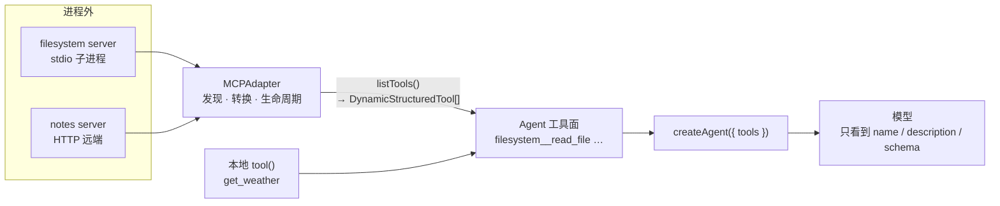

import { Canvas, Controls, Meta } from '@storybook/addon-docs/blocks';
import * as Mcp from './mcp.stories';

<Meta of={Mcp} name="Docs" />

# MCP 接入

[工具](?path=/docs/tools--docs)一课列过工具的四个来源，其中生态最大的是 MCP：filesystem、GitHub、Postgres、浏览器、搜索……现成的 MCP server 成百上千，任何一个都不用你再写一份 `tool()` 包装。本课建立在一个核心判断上：**MCP 把工具的定义与执行搬进独立的 server，`MCPAdapter` 只做三件事——发现（server 暴露了哪些工具）、转换（把 MCP 工具变成 LangChain 工具）、生命周期（连接什么时候开、什么时候关）**。转换完成后，对 `createAgent` 与模型而言，MCP 工具与本地 `tool()` 工具完全同质。沿着这条线，本课依次讲清：MCP 是什么与解决什么问题、三种传输（stdio / http / sse）怎么配、模型实际看到的工具清单怎么来（过滤、命名前缀、撞名冲突）、连接怎么开关与容错、以及挂进 Agent 的完整闭环。读完你应该能预测：关掉命名前缀会发生什么、`listTools('filesystem')` 过滤发生在哪一层、忘了 `close()` 会出现什么症状。



`new MCPAdapter({...})` 顶层配置的字段与默认值（已与 `@langchain/mcp-adapters` v2 源码核对；连接字段见[传输](#传输)一节）：

| 字段 | 默认值 | 作用与回查要点 |
| --- | --- | --- |
| `servers` | 必填，至少一个 | `Record<服务器名, 连接配置>`；服务器名由你起，参与工具名前缀 |
| `prefixToolNameWithServerName` | `true` | 工具名加 `服务器名__` 前缀（双下划线）；`loadMcpTools()` 中默认 `false` |
| `additionalToolNamePrefix` | `""` | 在服务器名前再加一层统一前缀，如 `mcp__` |
| `throwOnLoadError` | `true` | 单个工具加载失败时是否抛错 |
| `onConnectionError` | `"throw"` | 服务器连不上时：抛错 / `"ignore"` 跳过该 server / 自定义函数 |
| `outputHandling` | text、image、audio 进 `content`，resource 进 `artifact` | 工具输出各类型进 `ToolMessage` 的 content 还是 artifact |

## 快速上手

连接本地 filesystem MCP server，把它的文件操作工具挂进 Agent（工程沿用[安装](?path=/docs/installation--docs)一课，另装 `npm install @langchain/mcp-adapters`）。把代码存成 `mcp-quickstart.ts`，用 `npx tsx mcp-quickstart.ts` 运行：

```ts
// mcp-quickstart.ts —— 连接 stdio MCP server：发现工具，再挂进 Agent
// 运行条件：Node ≥ 20.10；./sandbox 目录必须存在（server 以它为根，只能访问其中文件）。
// 第 1 步只发现工具，不需要 API key；第 2 步创建 Agent 需要 .env 里的 OPENAI_API_KEY。
// npx 首次运行会临时下载 @modelcontextprotocol/server-filesystem，可能较慢。
import 'dotenv/config';
import { ChatOpenAI } from '@langchain/openai';
import { createAgent } from 'langchain';
import { MCPAdapter } from '@langchain/mcp-adapters';

const adapter = new MCPAdapter({
  servers: {
    filesystem: {
      transport: 'stdio',
      command: 'npx',
      args: ['-y', '@modelcontextprotocol/server-filesystem', './sandbox'],
    },
  },
});

try {
  // 第 1 步：发现——listTools() 打开连接，把 MCP 工具转换为 LangChain 工具
  const tools = await adapter.listTools();
  console.log(tools.map((tool) => tool.name));
  // => ['filesystem__read_file', 'filesystem__write_file', ...]
  // 工具名默认带「服务器名__」前缀，防止多个 server 的工具撞名

  // 第 2 步：挂载——与本地 tool() 工具的用法完全一致
  const agent = createAgent({
    model: new ChatOpenAI({ model: 'gpt-5.5' }),
    tools,
  });
  const result = await agent.invoke({
    messages: [{ role: 'user', content: '把 sandbox 里的 .txt 文件都列出来。' }],
  });
  console.log(result.messages.at(-1)?.content);
} finally {
  // stdio server 是 adapter 拉起的子进程，不 close 进程可能挂着不退出
  await adapter.close();
}
```

不想本地起 server 也可以直接连公共端点：`servers: { docs: { url: 'https://docs.langchain.com/mcp' } }`（无需任何 key），把上面的 filesystem 换成它即可。

## MCP 是什么

[Model Context Protocol](https://modelcontextprotocol.io) 是一个开放协议，标准化「应用如何向 LLM 提供工具与上下文」。它解决的问题是一对多的集成爆炸：没有协议时，N 个应用各自为 M 个数据源写集成，是 N × M 份代码；有了协议，工具提供方实现一次 MCP server，任何 MCP client——LangChain 应用、Claude Desktop、Cursor、各类 IDE——都能连接同一个 server，变成 N + M。

三个角色判断（够用即可，协议细节不深挖）：

- **你的应用是 client。** LangChain 侧只写 client：`@langchain/mcp-adapters` 底层用官方 MCP TypeScript SDK 建立连接、协商协议，你不用直接碰协议报文。
- **server 是别人实现好的进程或远端服务。** 来源三类：官方与社区 server（npm 上 `@modelcontextprotocol/server-*` 系列：filesystem、memory、puppeteer 等）、托管服务暴露的 HTTP 端点、自建 server（用 `@modelcontextprotocol/sdk` 写，本课不展开）。
- **server 暴露三种东西，本课只桥接 tools。** tools 是可执行函数（模型调用）；resources 是可读数据（见[挂进 Agent](#挂进-agent)尾部）；prompts 是预置提示词。

版本现状一句话：`MCPAdapter` + `servers` + `listTools()` 是 v2 的推荐 API；`MultiServerMCPClient`、`mcpServers`、`getTools()` 是废弃的兼容 API，仍能使用且旧教程里大量出现。官方 JS 文档页目前还以旧 API 为示例，看到 `new MultiServerMCPClient({ mcpServers: {...} })` 时按对应关系翻译即可（对应表见[常见问题](#常见问题)）。

## 传输

连接配置按传输三选一。`transport` 字段可以省略——配置里有 `command`/`args` 即按 stdio，有 `url` 即按 streamable HTTP；显式写 `transport: 'sse'` 才走旧式 SSE。

```ts
const adapter = new MCPAdapter({
  servers: {
    // 名字由你起，参与工具名前缀；三种传输的完整字段见下面三小节
    math: { transport: 'stdio', command: 'node', args: ['./math_server.mjs'] },
    docs: { url: 'https://docs.langchain.com/mcp' },
  },
});
```

### stdio：本地子进程

```ts
const adapter = new MCPAdapter({
  servers: {
    filesystem: {
      transport: 'stdio',
      command: 'npx',                                  // 拉起 server 的可执行文件
      args: ['-y', '@modelcontextprotocol/server-filesystem', './sandbox'],
      env: { DEBUG: 'mcp*' },        // 可选：传给子进程的环境变量
      cwd: './work',                 // 可选：子进程工作目录
      stderr: 'inherit',             // 默认 inherit：server 日志直接进你的终端
      restart: { enabled: true, maxAttempts: 3, delayMs: 1000 }, // 可选：崩溃自动重启
    },
  },
});
```

client 把 server 作为子进程拉起，通过 stdin/stdout 通信——本地工具、脚本封装最常用的形态。两条边界：stdio 没有 HTTP 层，**不支持 headers**（需要认证的走 http）；server 进程由 client 负责，忘了 `close()` 它不会自己退出（见[生命周期](#生命周期)）。

### http：streamable HTTP

```ts
const adapter = new MCPAdapter({
  servers: {
    docs: {
      transport: 'http',                        // 可省：有 url 即 http
      url: 'https://docs.langchain.com/mcp',
      headers: { Authorization: 'Bearer YOUR_TOKEN' }, // 可选：静态令牌 / 自定义头
      // authProvider, // 可选：应用自管令牌 { token } 或 OAuth 的 OAuthClientProvider
    },
  },
});
```

现行标准传输，远端服务用它。认证两个层次：简单场景在 `headers` 里放 `Authorization`；需要程序化管理时用 `authProvider`——`{ token, onUnauthorized? }`（应用自管令牌，拿到 token 后会取代配置的 Authorization 头）或实现 SDK 的 `OAuthClientProvider`（OAuth 流程）。另有一个可选 `mode` 字段（`auto` / `modern` / `legacy`，默认自动协商协议版本）：连接旧版 SDK 1 的 server 或想跳过启动探测时可显式 `mode: 'legacy'`。

### sse：旧式端点

```ts
const adapter = new MCPAdapter({
  servers: {
    legacy: { transport: 'sse', url: 'http://localhost:8000/sse' },
  },
});
```

SSE 是上一代 HTTP 传输，已被 streamable HTTP 取代。只在一个场景需要它：server 明确只暴露 SSE 端点、没有 streamable HTTP 入口。连接参数与 http 相同（`url`、`headers`、`authProvider`）。新 server 一律用 http。

## 发现与命名

`listTools()` 连接配置里的 server，返回扁平的 LangChain 工具数组——每个都是 `DynamicStructuredTool`，`name`、`description`、`schema` 来自 server 侧的工具定义，模型与 `createAgent` 看到的就是转换后的这三样。两个常用变体：

```ts
const tools = await adapter.listTools();               // 全部 server，扁平数组
const fsTools = await adapter.listTools('filesystem'); // 按服务器名过滤
const tagged = await adapter.listTools(['math', 'docs'], { // 多选 + 连接级选项（headers 等）
  headers: { 'X-Request-ID': 'run-42' },
});

const grouped = await adapter.listToolsets(); // Record<服务器名, 工具[]>，想按 server 分组处理时用
```

一个容易误判的细节：过滤发生在**返回层**而不是连接层——传入服务器名后返回值只含指定 server 的工具，但 adapter 仍会对配置里的所有 server 做发现（连不上的按 `onConnectionError` 处理）。想让某台 server 完全不参与，就别把它写进 `servers`。

命名规则决定模型调用时用的名字：

- **默认加前缀**：`prefixToolNameWithServerName: true`（默认）把工具名变成 `服务器名__原名`，双下划线分隔——`filesystem__read_file`。为什么默认开：多 server 场景下同名工具（两个 server 都有 `read_file`）一旦撞名，模型与运行时都无法区分。
- **关掉前缀的条件**：单 server、或确定没有同名工具时，可以 `prefixToolNameWithServerName: false` 换回原名，省一点上下文。
- **撞名不是被静默处理，而是直接抛错**。关闭前缀且多个 server 暴露同名工具时，`listTools()` 抛出：

```text
Tool name collision: a tool named "read_file" is exposed more than once
(filesystem, notes). Leave "prefixToolNameWithServerName" unset or set it
to true to keep tool names unique across servers.
```

（同一 server 内部重复列出同名工具则是另一种报错：让 server 去重，或改用 `listToolsets()` 分组取。）`additionalToolNamePrefix` 在最前面再加一层统一前缀，如 `mcp__filesystem__read_file`，用于把 MCP 工具与本地工具在命名空间上分开。

下面的实例把这条链路确定性画出来：两个 server（故意都暴露 `read_file`）经过过滤与前缀规则，进入 Agent 工具面后模型看到什么。不发起真实连接，行为对齐 `@langchain/mcp-adapters` v2 源码。

<Canvas of={Mcp.Interactive} />
<Controls of={Mcp.Interactive} />

| 读者操作 | 可观察证据 |
| --- | --- |
| 关闭「服务器名前缀」 | 中栏两个 server 的 `read_file` 输出同名且标红，右栏变为 `Tool name collision` 红条，模型可见读数变为「listTools() 抛错」 |
| 切换「listTools 过滤」到 `filesystem` | 左栏 notes 卡片变虚线并标注「未选中」，中栏与右栏只剩 filesystem 的三个工具 |
| 打开「附带本地工具」 | 右栏多出独立分组的 `get_weather`（本地 `tool()` 定义，不参与前缀与过滤） |

打开 Show code 可看到该 Canvas 实际执行的 `example.ts`：纯 TS 确定性模拟，不依赖 `@langchain/*`。

## 生命周期

连接的全部节奏是：**构造不开连接，首次发现按需打开，`close()` 全部关闭，关后还能再用。**

- **构造是纯声明。** `new MCPAdapter({...})` 只解析配置，不连任何 server；连接在第一次 `listTools()` / `listToolsets()` / `getClient()` 时建立，之后复用已建立的连接与已发现的工具，重复调用不会重复发现。
- **`close()` 关闭一切并清空缓存。** 所有连接断开（stdio 子进程随之结束），进行中的请求被中止。之后 adapter 仍可使用——下一次 `listTools()` 会按同一份配置重新连接，而不是恢复旧连接。
- **不 `close()` 的症状**：stdio server 是 client 拉起的子进程，脚本跑完 Node 进程挂着不退出、或子进程残留。脚本与 CLI 用 `try/finally`（快速上手的写法）；长驻服务在关停钩子里调。

多 server 容错由 `onConnectionError` 决定，三种姿态：

```ts
const adapter = new MCPAdapter({
  servers: {
    core: { url: 'http://core.internal/mcp' },
    optional: { url: 'http://maybe-down.internal/mcp' },
  },
  onConnectionError: 'ignore', // 默认 'throw'：任何一个连不上，listTools() 整体失败
  // 也可以是函数：抛出 = 传播错误；正常返回 = 跳过该 server 继续
  // onConnectionError: async ({ serverName, error }) => log(serverName, error),
});

const tools = await adapter.listTools(); // 'ignore' 下只剩连得上的 server 的工具
const client = await adapter.getClient('optional'); // undefined = 该 server 没连上
```

`getClient(服务器名)` 返回底层 MCP SDK client（或 `undefined`）：用来检查某台 server 的连接状态，或调用工具之外的能力。工具发现缓存策略用 `listTools` 的第二个参数控制：`cacheMode: 'use' | 'refresh' | 'bypass'`（默认 use，复用 SDK 缓存）。

## 挂进 Agent

挂载没有新 API：`createAgent` 的 `tools` 数组直接放 `listTools()` 的结果，可与本地 `tool()` 工具混排。

```ts
// 运行条件：同快速上手——OPENAI_API_KEY 已写入 .env，./sandbox 目录存在。
import 'dotenv/config';
import * as z from 'zod';
import { ChatOpenAI } from '@langchain/openai';
import { createAgent, tool } from 'langchain';
import { MCPAdapter } from '@langchain/mcp-adapters';

// 本地工具照常定义（见「工具」一课）
const getWeather = tool(
  ({ city }) => `Sunny, 23°C in ${city}`,
  {
    name: 'get_weather',
    description: 'Get current weather for a city.',
    schema: z.object({ city: z.string().describe('City name') }),
  },
);

const adapter = new MCPAdapter({
  servers: {
    filesystem: {
      transport: 'stdio',
      command: 'npx',
      args: ['-y', '@modelcontextprotocol/server-filesystem', './sandbox'],
    },
  },
});

try {
  // 桥接工具与本地工具拼进同一个数组；过滤只挂需要的 server
  const tools = [...(await adapter.listTools('filesystem')), getWeather];

  const agent = createAgent({
    model: new ChatOpenAI({ model: 'gpt-5.5' }),
    tools,
  });

  const result = await agent.invoke({
    messages: [{ role: 'user', content: '看看 sandbox 里的笔记，再告诉我北京天气。' }],
  });
  console.log(result.messages.at(-1)?.content);
} finally {
  await adapter.close();
}
```

运行时对「工具从哪来」完全无感：模型看到的就是转换后的 `name` / `description` / `schema`，产出 `tool_calls`；执行时 adapter 把调用转发给 server，把结果转回 `ToolMessage`（`tool_call_id` 配对协议见[工具](?path=/docs/tools--docs)一课）。所以桥接层与模型提供方无关——换成 `@langchain/google-genai` 的模型，同一批 MCP 工具原样可用，代码一行不改。

**MCP 工具失败的两种形态**（衔接[工具](?path=/docs/tools--docs)一课的错误处理）：

| 失败来源 | 结果 | 模型看到什么 |
| --- | --- | --- |
| server 端执行失败（`isError: true`） | 转成 `status: "error"` 的 `ToolMessage` | 错误文本可见，可换参数自我修正 |
| 参数校验失败、连接断开等程序性错误 | 抛 `ToolException` | 挂在 `createAgent` 里被默认工具节点兜底，转成错误 `ToolMessage` 回传 |

绕过 Agent 直接调 MCP 工具（如快速上手第 1 步之后再 `tools[0].invoke({...})`）时没有 tool call 上下文，两种失败都以 `ToolException` 抛出，需要自己 try/catch。想让它硬失败而不是回到模型，与本地工具一样走中间件 re-throw（见[中间件](?path=/docs/middleware--docs)）。

工具之外还有三块能力，按需取用：

- **resources**：server 暴露的可读数据（文件、记录），不是工具、不自动进模型——`await adapter.listResources()` 发现、`await adapter.readResource('filesystem', 'file:///sandbox/a.txt')` 读出内容，读完后由你注入消息。
- **elicitation（工具请求用户输入）**：现代 server 可在工具执行中请求用户填表或访问 URL，adapter 默认 `elicitation: true`，经 LangGraph interrupt 暂停运行——需要配 checkpointer 才能暂停/恢复，机制归[人机协同](?path=/docs/human-in-the-loop--docs)一课。
- **其余进阶能力的落点**：

| 能力 | 配在哪 | 一句话用途 |
| --- | --- | --- |
| `beforeToolCall` / `afterToolCall` | 构造配置 | 拦截改写入参、HTTP headers 或工具结果 |
| `outputHandling` | 构造配置 | 按输出类型指定进 content 还是 artifact（大结果不烧上下文） |
| `defaultToolTimeout` | 构造配置 | 工具执行超时（毫秒） |
| `onProgress` / `onMessage` | 构造配置 | 长任务进度通知 / server 日志通知 |
| `loadMcpTools(名, client, 选项)` | 顶层导出 | 已自管 MCP SDK client 时，只做工具转换不接管连接 |

## 最佳实践

- **工具面保持最小**：只连当前任务需要的 server，多 server 时用 `listTools('x')` 过滤后再挂载。把整个 server 生态全挂给模型，选错工具与幻觉工具名的概率随清单长度上升（数量控制的完整手段见[工具](?path=/docs/tools--docs)一课）。
- **命名策略按 server 数量定**：多 server 保持默认前缀防撞名；单 server 且在意上下文可关前缀。所有按工具名匹配的规则（审批、白名单、日志过滤）必须写转换后的全名——前缀改变的是模型实际调用的名字。
- **adapter 生命周期对齐应用生命周期**：长驻应用建一次、复用到关停；脚本与每请求新建的场景用 `try/finally` 保证 `close()`，避免 stdio 子进程泄漏。
- **多 server 且部分可选时配 `onConnectionError: 'ignore'`**：让非核心 server 宕机不拖垮整体启动；需要感知时用函数姿态记日志再跳过。
- **治理放在 Agent 层，不在传输层**：MCP 工具与本地工具一样过中间件（`wrapToolCall` 审计、输入输出校验），不需要为 MCP 单独写一套（见[中间件](?path=/docs/middleware--docs)）。

## 常见问题

- **旧教程代码 `new MultiServerMCPClient({ mcpServers: {...} })` 还能用吗？**
  能——废弃的兼容 API 仍导出。对应关系：`MultiServerMCPClient` → `MCPAdapter`、`mcpServers` → `servers`、`getTools()` → `listTools()`（`initializeConnections()` → `listToolsets()`）。新代码统一用后者；注意 v2 还改了默认工具名（前缀默认开）与错误行为，升级时把按工具名匹配的规则一并过一遍。
- **工具名多了 `filesystem__` 前缀，日志里报 not a valid tool。**
  `listTools()` 默认 `prefixToolNameWithServerName: true`，模型与你的代码都要用带前缀的全名（双下划线分隔）。要么按全名适配，要么在单 server、确认无重名的场景显式设 `false`。
- **`listTools()` 抛 Tool name collision: a tool named "read_file" is exposed more than once ...**
  多个 server 暴露同名工具且关闭了前缀。保持前缀默认开启，或改用 `listToolsets()` 按 server 分组各取各的；若报错来自同一个 server 内部重复，需要 server 侧去重。
- **脚本跑完 Node 进程不退出，或残留 stdio server 子进程。**
  adapter 没 `close()`。stdio server 由 client 拉起，`close()` 才结束它们；用 `try/finally` 包住整段使用（见快速上手）。
- **连接远程 server 返回 401。**
  http 连接配 `headers: { Authorization: 'Bearer <token>' }`（静态令牌），或 `authProvider`（应用自管令牌传 `{ token }`，OAuth 实现 `OAuthClientProvider`）。stdio 没有 HTTP 层，不支持 headers——需要凭据的 server 走 http 或在 `args` 里传。
- **npx 拉起的 stdio server 启动失败或一直挂起。**
  先在终端手动跑同一 `command` + `args`，确认 server 本身能起（npx 首次要下载包，可能慢）；检查 `args` 里的路径与目录是否存在；`stderr` 默认 `inherit`，server 的报错会直接打到你的终端。

## 总结回顾

摘要：

MCP 用一个开放协议把工具生态变成 N + M：server 实现一次，所有 client 复用。LangChain 侧的入口是 `@langchain/mcp-adapters` 的 `MCPAdapter`——构造时用 `servers` 声明连接（stdio 本地子进程、http streamable 远端、sse 只留给旧端点，`transport` 可按字段推断），`listTools()` 按需打开连接、发现工具并转换为 `DynamicStructuredTool`，可按服务器名过滤、用 `listToolsets()` 分组。命名默认加 `服务器名__` 前缀防撞名，关掉前缀且跨 server 同名会让 `listTools()` 抛 Tool name collision；`close()` 关闭全部连接与缓存且 adapter 之后仍可复用，`onConnectionError` 决定多 server 的容错姿态。挂进 `createAgent` 后与本地 `tool()` 工具同质：模型只看 name/description/schema，执行失败转 `status: "error"` 的 ToolMessage 让模型自我修正，程序性错误抛 `ToolException` 由 Agent 默认兜底；resources 需手动读取，elicitation 经 interrupt 暂停需要 checkpointer。`MultiServerMCPClient`/`mcpServers`/`getTools()` 是废弃的兼容 API。

一句话：

> MCPAdapter 把「外部 server 的工具」翻译成「LangChain 的工具」——发现、命名、生命周期都收敛在 adapter 一层，Agent 与模型对工具的来历完全无感。

知识要点：

- MCP 解决什么问题？LangChain 应用在协议中扮演什么角色？
- `MCPAdapter` 构造需要什么？构造时会建立连接吗？
- 三种传输各配哪些字段？`transport` 什么时候可以省略？
- `listTools()` 默认给工具名加了什么？为什么？怎么关闭、怎么按服务器过滤？
- 关掉前缀后什么情况会抛 Tool name collision？两种撞名报错分别怎么处理？
- `close()` 做什么？不调用的典型症状是什么？关闭后 adapter 还能用吗？
- `onConnectionError` 的三个取值分别什么行为？`getClient()` 返回什么？
- MCP 工具执行失败时模型看到什么？什么错误会抛 `ToolException`？
- 废弃 API（`MultiServerMCPClient` / `mcpServers` / `getTools`）与 v2 API 怎么对应？
- MCP 工具能与本地 `tool()` 工具混用吗？对 MCP 工具的治理放在哪一层做？

## 参考资料

- [MCP（LangChain.js 官方文档）](https://docs.langchain.com/oss/javascript/langchain/mcp)
- [@langchain/mcp-adapters（langchainjs 仓库：MCPAdapter v2 用法与迁移说明，API 细节已对照其源码核对）](https://github.com/langchain-ai/langchainjs/tree/main/libs/langchain-mcp-adapters)
- [MCP 协议官方文档](https://modelcontextprotocol.io/introduction)
