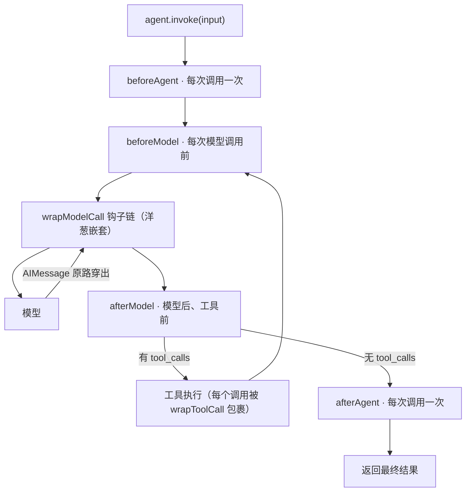

import { Canvas, Controls, Meta } from '@storybook/addon-docs/blocks';
import * as Middleware from './middleware.stories';

<Meta of={Middleware} name="Docs" />

# 中间件

[工具](?path=/docs/tools--docs)一课给 Agent 装上了手脚；中间件给它装上「体检仪」和「编辑」——在不改动 Agent 循环代码的前提下，把日志、改写、重试、护栏、提前终止这类横切逻辑插进固定的拦截点。用法只多一个参数：

```ts
const agent = createAgent({
  model,
  tools: [getWeather],
  middleware: [loggingMiddleware, toolRetryMiddleware()],
});
```

中间件不是独立进程，也不是把 Agent 包一层的外壳：它的钩子被编译进 `createAgent` 生成的 LangGraph 图里，因此整个 Agent 依旧可以作为节点或子图嵌进更大的 `StateGraph`。钩子分两类，回答两个问题——**什么时机被调用**（节点式：`beforeAgent` / `beforeModel` / `afterModel` / `afterAgent`，像路上的检查站，顺序执行）与**能否控制调用本身**（包裹式：`wrapModelCall` / `wrapToolCall`，像洋葱一层层包住模型与工具，可以放行、改写、重试甚至拦截）。本课依次讲清：两类钩子各拿到什么、多个中间件叠加时的执行顺序、预置中间件怎么选、以及自己写中间件的典型场景（改写请求、拦截工具调用、动态筛选、状态与跳转）。读完你应该能预测：把一个中间件从数组末尾挪到开头、在 `wrapModelCall` 里改提示词、在 `wrapToolCall` 里不调 `handler`，Agent 的行为分别会怎么变。



六个钩子速查（时机与能力，已与官方文档和 `langchain` 类型定义核对）：

| 钩子 | 触发时机 | 拿到什么 | 改写能力 | 典型用途 |
| --- | --- | --- | --- | --- |
| `beforeAgent` | 每次调用最先，仅一次 | `state`、`runtime` | 只能返回状态更新 | 初始化、审计、敏感话题短路 |
| `beforeModel` | 每次模型调用前 | `state`、`runtime` | 只能返回状态更新 | 计数、状态检查 |
| `wrapModelCall` | 包裹整个模型调用 | `request` + `handler` | 请求下传与 `AIMessage` 上返都可改，`handler` 可调 0/1/多次 | 动态提示词、筛选工具、重试 |
| `afterModel` | 模型返回后、工具执行前 | `state`、`runtime` | 只能返回状态更新 | 更新状态、修工具调用参数 |
| `wrapToolCall` | 包裹每个工具调用 | `request`（含 `toolCall`）+ `handler` | 参数与结果都可改，可拒绝执行 | 日志、统一兜底、审计拦截 |
| `afterAgent` | 整次调用结束，仅一次 | `state`、`runtime` | 只能返回状态更新 | 收尾统计 |

## 快速上手

一个自定义中间件加一个预置中间件的最小组合（工程沿用[安装](?path=/docs/installation--docs)一课：依赖 `langchain`、`@langchain/openai`、`zod`、`dotenv`）。把代码存成 `middleware-demo.ts`，用 `npx tsx middleware-demo.ts` 运行：

```ts
// middleware-demo.ts —— 打点中间件 + 重试中间件的最小叠加
// 运行条件：OPENAI_API_KEY 已写入 .env；npx tsx middleware-demo.ts 运行。
import 'dotenv/config';
import * as z from 'zod';
import { ChatOpenAI } from '@langchain/openai';
import { createAgent, createMiddleware, tool, toolRetryMiddleware } from 'langchain';

const getWeather = tool(
  async ({ city }) => `${city}今天晴，26℃。`,
  {
    name: 'get_weather',
    description: 'Query the current weather of a city.',
    schema: z.object({ city: z.string().describe('City name') }),
  },
);

// 最小的自定义中间件：给每次模型调用打点
const logging = createMiddleware({
  name: 'logging',
  wrapModelCall: async (request, handler) => {
    console.log(`[logging] 调用模型，携带 ${request.messages.length} 条消息`);
    const response = await handler(request); // handler = 下一层，这里最终是模型本身
    console.log(
      `[logging] 模型返回，发起 ${response.tool_calls?.length ?? 0} 个工具调用`,
    );
    return response;
  },
});

const agent = createAgent({
  model: new ChatOpenAI({ model: 'gpt-5.5' }),
  tools: [getWeather],
  // 数组顺序就是叠加顺序：logging 在最前，是最外层
  middleware: [logging, toolRetryMiddleware()],
});

const result = await agent.invoke({ messages: '北京今天天气怎么样？' });
console.log(result.messages.at(-1)?.content);
```

预期输出（措辞因模型而异，行序是关键——带工具回合的调用里模型被调了两次，`wrapModelCall` 也跟着跑了两次）：

```
[logging] 调用模型，携带 1 条消息
[logging] 模型返回，发起 1 个工具调用
[logging] 调用模型，携带 3 条消息
[logging] 模型返回，发起 0 个工具调用
北京今天晴，26℃。
```

这行序就是本课的主线：`handler(request)` 是「下一层」——不调它就是拦截，调多次就是重试；钩子随 Agent 循环反复触发，而不是每次 `invoke` 只跑一遍。

## 中间件是什么

一个中间件就是一个带 `name` 和若干钩子的对象，用 `createMiddleware()` 包一层，传给 `createAgent` 的 `middleware` 数组。它挂进 Agent 生命周期的固定拦截点：两次钩子类别的分界，在于**「路过」还是「包裹」**。

### 节点式钩子：顺序执行的检查站

`beforeAgent`、`beforeModel`、`afterModel`、`afterAgent`。签名统一是 `(state, runtime)`，返回一个「部分状态」对象（经 reducer 合并进 state）或者不返回。它们**看不到 request**——既看不到即将发给模型的 `messages` 和 `systemMessage`，也拦不下调用本身；适合「看一眼状态、记一笔状态」：计数、初始化、审计。`afterModel` 拿到的 state 已包含模型刚返回的消息，因此可以在工具执行前修正状态（比如微调工具调用参数）。

### 包裹式钩子：包住调用的洋葱

`wrapModelCall` 和 `wrapToolCall` 的签名是 `(request, handler)`。`handler` 是下一层：`wrapModelCall` 的 `handler` 最终落到模型，`wrapToolCall` 的落到工具执行。你可以决定调用它 0 次（拦截、短路）、1 次（放行，前后可加工）或多次（重试、降级）。返回值：`wrapModelCall` 返回 `AIMessage`（或 `Command`），`wrapToolCall` 返回 `ToolMessage`（或 `Command`）。

`request` 的关键字段（已在 `langchain` 类型定义中核对）：

| 字段 | wrapModelCall | wrapToolCall | 说明 |
| --- | --- | --- | --- |
| `model` | ✓ | — | 本步要用的模型，可替换 |
| `messages` | ✓ | — | 即将发给模型的消息 |
| `systemMessage` | ✓ | — | `SystemMessage` 对象（不是字符串），追加用 `.concat()` |
| `tools` / `toolChoice` | ✓ | — | 工具清单与调用策略，可筛选 |
| `toolCall` | — | ✓ | `{ name, args, id }`，模型产出的调用意图 |
| `tool` | — | ✓ | 工具实例本身（动态注册的工具可能没有） |
| `state` / `runtime` | ✓ | ✓ | 当前状态与运行时（context、writer 等） |

### createMiddleware 的编译期配置

| 字段 | 必填 | 作用 |
| --- | --- | --- |
| `name` | 是 | 中间件标识；报错信息与日志会引用它 |
| `stateSchema` | 否 | 声明中间件私有状态，随 checkpointer 持久化，钩子里读写 |
| `tools` | 否 | 给 Agent 追加工具（如 `todoListMiddleware` 注册 `write_todos`） |
| `streamTransformers` | 否 | 流式输出的逐块转换（本课不展开） |

| | 节点式（`before*` / `after*`） | 包裹式（`wrap*`） |
| --- | --- | --- |
| 执行方式 | 顺序执行，不能拦下调用 | 嵌套包裹，控制调用 0/1/多次 |
| 拿到什么 | `state`、`runtime` | `request`、`handler` |
| 更新状态 | 返回部分状态对象 | 返回 `Command({ update })` |
| 适合 | 顺序逻辑、记账 | 控制流：改写、重试、拦截 |

## 执行顺序

`middleware: [A, B, C]` 时只有三条规则（官方文档原文语义）：

1. **`before_*` 按数组正序**：A → B → C。
2. **`wrap_*` 洋葱嵌套**：A 包住 B，B 包住 C，C 包住模型。请求按 A → B → C → 模型逐层进入，结果按模型 → C → B → A 原路穿出——**第一个中间件是最外层**。
3. **`after_*` 按数组反序**：C → B → A。

下面的实例把 `middleware: [outer, inner]` 一次调用（无工具回合）的 13 步时序确定性画出来，并演示改写发生在哪一层、对谁可见（不发起真实模型调用）：

<Canvas of={Middleware.Interactive} />
<Controls of={Middleware.Interactive} />

| 读者操作 | 可观察证据 |
| --- | --- |
| 拖动「回放步骤」1 → 13 | 前 4 步节点式钩子正序执行（洋葱之外），5-6 步 `wrapModelCall` 逐层进入，7 步抵达模型，8-9 步原路穿出，10 步起 `afterModel`/`afterAgent` 反序收尾 |
| 「改写位置」设为「inner 改写请求」 | 第 6 步出现紫色注释「`systemMessage.concat(…)`」；「模型收到」从第 7 步起带上 `Additional context.`，而 outer 的进入段（第 5 步）早已执行完——**request 改写只向内传播** |
| 改为「inner 改写响应」 | 第 8 步出现紫色注释「`new AIMessage(…)`」；「外层收到」从第 9 步起变成改写后内容——**AIMessage 改写只向外传播** |
| 保持「不改写」完整回放 | 13 步时序与下方时序表逐条对应：正序 → 嵌套 → 反序 |

打开 Show code 可看到该 Canvas 实际执行的 `example.ts`：纯 TS 确定性模拟，不依赖 `@langchain/*`。

`middleware: [outer, inner]` 单个回合的完整时序：

| # | 阶段 | 执行者 | 说明 |
| --- | --- | --- | --- |
| 1-2 | `beforeAgent` | outer → inner | 整次调用最先，仅一次，正序 |
| 3-4 | `beforeModel` | outer → inner | 每次模型调用前，正序 |
| 5 | `wrapModelCall` outer 进入 | outer | 请求向内传，此处可改写 request |
| 6 | `wrapModelCall` inner 进入 | inner | 最内层，改写 request 的最后机会 |
| 7 | 模型调用 | model | 真正的 LLM 请求 |
| 8 | `wrapModelCall` inner 穿出 | inner | 返回段，改写 AIMessage 的第一机会 |
| 9 | `wrapModelCall` outer 穿出 | outer | 结果回到最外层 |
| 10-11 | `afterModel` | inner → outer | 反序开始，工具执行前 |
| 12-13 | `afterAgent` | inner → outer | 整次调用结束，反序 |

带工具回合时，3-11 步会随「模型 → 工具」循环重复，每次工具调用还各自被 `wrapToolCall` 包裹。

### 改写在哪一层生效

改写沿洋葱**单向传播**：request 改写只对更内层与模型可见，`AIMessage` 改写只对更外层可见；节点式钩子两者都碰不到（`afterModel` 读到的是已合并进 state 的消息，不是模型返回的那个对象）。由此得出排序准则（官方最佳实践）：**关键中间件放数组最前**——护栏、审计、安全类放第一个位置，保证最先执行、包住其余全部；改写类居中；纯日志类可以放最后。

## 预置中间件

动手写自定义之前先查预置（官方最佳实践：prefer built-in）。下表 15 个（关键配置已与官方 built-in 页和本地 `langchain` 类型核对；除注明外均 `import { … } from 'langchain'`）：

| 中间件 | 一句话 | 关键配置 | 深入 |
| --- | --- | --- | --- |
| `toolRetryMiddleware()` | 失败的工具调用指数退避重试 | `maxRetries`（默认 2）、`tools`、`retryOn`、`onFailure` | [官方文档](https://docs.langchain.com/oss/javascript/langchain/middleware/built-in) |
| `modelRetryMiddleware()` | 失败的模型调用重试 | 同上（无 `tools`） | [官方文档](https://docs.langchain.com/oss/javascript/langchain/middleware/built-in) |
| `modelFallbackMiddleware('openai:gpt-5.5', 'anthropic:claude-…')` | 主模型失败时逐个降级 | 变参传入备选模型 | [官方文档](https://docs.langchain.com/oss/javascript/langchain/middleware/built-in) |
| `summarizationMiddleware({ model })` | 把旧历史压缩成摘要 | `model` 必填；`trigger`（单对象 AND / 数组 OR）、`keep`（默认 `{ messages: 20 }`） | [短期记忆](?path=/docs/short-term-memory--docs) |
| `humanInTheLoopMiddleware({ interruptOn })` | 工具执行前暂停等人审批 | `interruptOn` 按工具 `name` 映射；需 checkpointer | [人机协同](?path=/docs/human-in-the-loop--docs) |
| `modelCallLimitMiddleware({ runLimit })` | 限制模型调用次数 | `runLimit` / `threadLimit`（需 checkpointer）/ `exitBehavior` | [护栏](?path=/docs/guardrails--docs) |
| `toolCallLimitMiddleware({ toolName, runLimit })` | 限制（单个）工具的调用次数 | 至少一个 limit；`exitBehavior: 'continue' \| 'error' \| 'end'` | [护栏](?path=/docs/guardrails--docs) |
| `piiMiddleware({ piiType })` | 检测并处理消息中的 PII | `piiType`（email、credit_card、ip…）、`strategy: 'redact' \| 'block' \| 'mask' \| 'hash'` | [护栏](?path=/docs/guardrails--docs) |
| `todoListMiddleware()` | 注册 `write_todos` 工具与规划提示 | 无配置 | [官方文档](https://docs.langchain.com/oss/javascript/langchain/middleware/built-in) |
| `llmToolSelectorMiddleware()` | 用 LLM 先筛一遍工具清单 | `maxTools`、`alwaysInclude`、`model` | [工具](?path=/docs/tools--docs) |
| `providerToolSearchMiddleware({ searchableTools })` | 工具搜索交给提供方服务端 | 仅 Anthropic 或 OpenAI gpt-5.5+ | [官方文档](https://docs.langchain.com/oss/javascript/langchain/middleware/built-in) |
| `contextEditingMiddleware()` | 超阈值清掉旧工具输出 | `edits: [new ClearToolUsesEdit()]`、`triggerTokens`（默认 100000） | [短期记忆](?path=/docs/short-term-memory--docs) |
| `toolEmulatorMiddleware()` | 用 LLM 伪造工具响应，离线测 Agent | `tools`、`model` | [官方文档](https://docs.langchain.com/oss/javascript/langchain/middleware/built-in) |
| `createFilesystemMiddleware()` | `ls` / `read_file` / `write_file` / `edit_file` | `backend`；来自 `deepagents` | [Deep Agents](?path=/docs/deep-agents-quickstart--docs) |
| `createSubAgentMiddleware({ subagents })` | 用 `task` 工具暴露子代理 | `subagents` 数组；来自 `deepagents` | [Deep Agents](?path=/docs/deep-agents-quickstart--docs) |

### 按需求选型

- **工具或模型总在超时/限流** → `toolRetryMiddleware` / `modelRetryMiddleware`；还想兜底换模型 → `modelFallbackMiddleware`。
- **对话越滚越长、上下文吃紧** → 压缩成摘要用 `summarizationMiddleware`、只清旧工具输出用 `contextEditingMiddleware`（机制归[短期记忆](?path=/docs/short-term-memory--docs)一课）。
- **危险操作必须人审** → `humanInTheLoopMiddleware`（interrupt 机制归[人机协同](?path=/docs/human-in-the-loop--docs)一课）。
- **控成本、防死循环** → `modelCallLimitMiddleware` / `toolCallLimitMiddleware`；**隐私合规** → `piiMiddleware`（策略归[护栏](?path=/docs/guardrails--docs)一课）。
- **工具太多模型选不动** → 先按[工具](?path=/docs/tools--docs)一课收敛定义与分工描述，再考虑 `llmToolSelectorMiddleware`（官方建议 10+ 个工具时）或 `providerToolSearchMiddleware`。
- **要计划性、文件、子代理** → `todoListMiddleware` 与 deepagents 两件套（归 [Deep Agents](?path=/docs/deep-agents-quickstart--docs)）。

## 自定义中间件

### 改写请求：动态系统提示

`createAgent` 的 `systemPrompt` 是静态的；运行时信息（日期、租户、开关）要在 `wrapModelCall` 里追加。关键细节：`request.systemMessage` 始终是 `SystemMessage` **对象**而非字符串，官方文档强调用 `.concat()` 追加而不是拼字符串，才能保留 `cache_control` 等提供方元数据：

```ts
// 运行条件：OPENAI_API_KEY 已写入 .env。
import { createMiddleware } from 'langchain';

const dynamicPrompt = createMiddleware({
  name: 'dynamic-prompt',
  wrapModelCall: async (request, handler) => {
    return handler({
      ...request, // 不可变风格：始终展开构造新对象向内传
      // concat 返回追加了新内容的新 SystemMessage，保留 cache_control 元数据
      systemMessage: request.systemMessage.concat(
        `\n今天的日期是 ${new Date().toISOString().slice(0, 10)}。回答保持简洁。`,
      ),
    });
  },
});
```

### 拦截工具调用：日志、兜底与拒绝

[工具](?path=/docs/tools--docs)一课在这里留了两个入口：统一给所有工具改写错误文案、必要时让错误硬冒泡。都在 `wrapToolCall`：

```ts
// 运行条件：OPENAI_API_KEY 已写入 .env。
import { createMiddleware, ToolMessage } from 'langchain';

const toolGuard = createMiddleware({
  name: 'tool-guard',
  wrapToolCall: async (request, handler) => {
    console.log(`[tool-guard] ${request.toolCall.name}`, request.toolCall.args);
    if (
      request.toolCall.name === 'delete_database' &&
      request.runtime.context?.dryRun
    ) {
      // 拒绝执行：不调 handler，直接回一条 ToolMessage，模型会据此改道
      return new ToolMessage({
        content: '当前为演练模式，禁写操作未执行。请向用户说明。',
        tool_call_id: request.toolCall.id,
      });
    }
    try {
      return await handler(request);
    } catch (error) {
      // 兜底：不 re-throw，错误文案完全自控（对照工具课的默认错误模板）
      console.error(`[tool-guard] ${request.toolCall.name} 失败`, error);
      return new ToolMessage({
        content: `工具 ${request.toolCall.name} 暂时不可用，请稍后重试或换个方案。`,
        tool_call_id: request.toolCall.id,
      });
    }
  },
});
```

三种处置对应三种结局：**不调 `handler`** 是这次调用被拦截（模型看到你给的 `ToolMessage`）；**调一次**是放行（前后可加工）；**re-throw** 让异常向上冒泡，本次 `invoke` 直接失败（工具课「硬失败」的写法）。

### 动态筛选工具与动态模型

工具课的另一个入口：按运行时条件过滤 `request.tools`：

```ts
// 运行条件：OPENAI_API_KEY 已写入 .env。
import { createMiddleware } from 'langchain';

const toolFilter = createMiddleware({
  name: 'tool-filter',
  wrapModelCall: async (request, handler) => {
    const readOnly = request.runtime.context?.readOnly ?? false;
    // 只筛清单，不删定义：把子集传给 handler 即可
    const tools = readOnly
      ? request.tools.filter((item) => !item.name.startsWith('write_'))
      : request.tools;
    return handler({ ...request, tools });
  },
});
```

硬规则（已在 `langchain` 源码中核对）：`wrapModelCall` 里可以**筛掉**工具，但**新增或改动工具定义会直接抛错**——运行时会对比传入与返回的工具集。动态切换模型同理可行，把预建好的实例赋给 `request.model`：

```ts
// models 用 initChatModel 预建：简单问题小模型，复杂推理大模型
return handler({
  ...request,
  model: request.state.needsDeepThink ? models.complex : request.model,
});
```

### 状态更新与提前结束

节点式钩子更新状态最简单：声明 `stateSchema`，返回部分状态对象，经 reducer 合并（`messages` 这类字段追加而非覆盖）：

```ts
// 运行条件：OPENAI_API_KEY 已写入 .env。
import * as z from 'zod';
import { createMiddleware } from 'langchain';

const turnCounter = createMiddleware({
  name: 'turn-counter',
  stateSchema: z.object({ modelCalls: z.number().default(0) }),
  beforeModel: async (state) => ({ modelCalls: state.modelCalls + 1 }),
});
```

包裹式钩子要顺带更新状态时则返回 `Command`（从 `@langchain/langgraph` 导入）：多层中间件都返回 `Command` 时**外层覆盖内层**，同层发生重试会**丢弃**先前返回的 `Command`——所以日常把结果原样 `return`、状态记账交给节点式钩子更省心。

提前结束用 `jumpTo`：在钩子对象上声明 `canJumpTo`（可取 `'end'` / `'tools'` / `'model'`，不声明会在运行时报错），返回值里带上 `jumpTo` 即直接跳出：

```ts
// 运行条件：OPENAI_API_KEY 已写入 .env。
import { AIMessage, createMiddleware } from 'langchain';

const offTopic = createMiddleware({
  name: 'off-topic',
  beforeAgent: {
    canJumpTo: ['end'], // 必须先声明跳转目标
    hook: async (state) => {
      const last = state.messages.at(-1);
      if (typeof last?.content === 'string' && last.content.includes('代写论文')) {
        return {
          messages: [new AIMessage('这个主题我不能协助，换个话题好吗？')],
          jumpTo: 'end', // 直接跳到结束，不调模型
        };
      }
    },
  },
});
```

### 自定义 context：每次调用独立的输入

`state` 随 checkpointer 持久化、跨回合累积；`context` 相反——在中间件上声明 `contextSchema`，调用时随 `invoke` 传入，钩子里读 `request.runtime.context`，**只读、每次调用独立、不持久化**。适合放租户、权限、灰度开关这类「本次调用的环境参数」：

```ts
// 运行条件：OPENAI_API_KEY 已写入 .env。
import * as z from 'zod';
import { createMiddleware } from 'langchain';

const tenant = createMiddleware({
  name: 'tenant',
  contextSchema: z.object({
    tenantId: z.string(),
    readOnly: z.boolean().default(false),
  }),
  wrapModelCall: async (request, handler) =>
    handler({
      ...request,
      systemMessage: request.systemMessage.concat(
        `\n当前租户：${request.runtime.context.tenantId}`,
      ),
    }),
});

// 调用侧：context 随每次 invoke 传入，不进消息、不持久化
await agent.invoke({
  messages: '列出所有客户',
  context: { tenantId: 'acme', readOnly: true },
});
```

## 最佳实践

- **一个中间件只做一件事**：命名即职责（`logging` 只打日志、`tool-guard` 只管工具），组合需求靠数组叠加，不要堆成大杂烩。
- **优雅地处理错误**：`wrap` 钩子里 `try/catch`，并显式选择兜底（返回错误 `ToolMessage` 让模型自救）还是硬失败（re-throw 冒泡）；别让中间件自己把 Agent 搞崩。
- **顺序逻辑用节点式，控制流用包裹式**：只想看/记状态用 `before*` / `after*`；要改请求、要决定调不调，才用 `wrap*`。
- **文档化你的 `stateSchema`**：中间件状态会随 checkpointer 持久化，字段含义写清楚，避免后续维护踩坑。
- **给中间件写单测**：钩子是普通函数（`(request, handler)` 或 `(state, runtime)`），可以脱离真实模型直接单测。
- **关键中间件放最前**：护栏、审计、安全类放数组第一个——最先执行、包住其余全部。
- **优先用预置**：动手写之前先过一遍上面的预置清单，大多数常见需求官方已有实现。

## 常见问题

- **为什么 `beforeModel` / `afterModel` 在一次 `invoke` 里跑了多次？**
  一次调用通常包含多个「模型 → 工具」循环：`beforeModel`、`afterModel`、`wrapModelCall` 随**每次模型调用**触发；只有 `beforeAgent` / `afterAgent` 整次 `invoke` 各执行一次。看快速上手的输出行序即可印证。
- **在 `wrapModelCall` 里改了 `systemMessage`，为什么外层中间件「看不到」？**
  改写沿洋葱单向传播：request 改写只向内（更内层与模型可见），`AIMessage` 改写只向外（更外层可见），外层在你的改写之前就已完成自己的进入段。想让改写对所有人生效，就把该中间件挪到数组最前（成为最外层）。
- **返回 `jumpTo` 时报错，提示目标未声明。**
  跳转目标必须先在钩子对象上声明 `canJumpTo: ['end' | 'tools' | 'model']`，再在返回值里带 `jumpTo`；只返回不声明会运行时报错。
- **包裹式钩子里怎么更新状态？直接返回状态对象行不行？**
  不行——包裹式钩子更新状态要返回 `new Command({ update: { … } })`（`@langchain/langgraph`）。多层同时更新时外层覆盖内层，同层重试会丢弃先前的 `Command`。单纯记账建议改用节点式钩子（返回部分状态对象即可）。
- **`middleware` 数组顺序到底怎么排？**
  记三条规则：`before_*` 正序、`wrap_*` 嵌套（第一个包住其余全部）、`after_*` 反序。实操准则：关键/护栏类最前，改写类居中，日志类最后。
- **`modelCallLimitMiddleware` 的 `threadLimit` 没生效。**
  `threadLimit` 按 thread 跨调用累计，必须配 checkpointer 才能记住计数；没配时用 `runLimit`（单次 `invoke` 内计数）。checkpointer 归[持久化](?path=/docs/persistence--docs)一课。

## 总结回顾

摘要：

中间件把横切逻辑插进 `createAgent` 的固定拦截点，钩子被编译进 LangGraph 图、Agent 依旧可作子图复用。两类钩子：节点式（`beforeAgent` / `beforeModel` / `afterModel` / `afterAgent`）拿 `state` 与 `runtime`、返回部分状态对象、顺序执行；包裹式（`wrapModelCall` / `wrapToolCall`）拿 `request` 与 `handler`、可以改写请求与结果、决定下层调用 0/1/多次。叠加顺序三规则：`before_*` 正序、`wrap_*` 洋葱嵌套（第一个中间件最外层）、`after_*` 反序；改写沿洋葱单向传播——request 改写只向内，`AIMessage` 改写只向外。预置共 15 个：重试降级（`toolRetry` / `modelRetry` / `modelFallback`）、历史压缩（`summarization` / `contextEditing`，归短期记忆）、人工审批（`humanInTheLoop`，归人机协同）、限额与隐私（`modelCallLimit` / `toolCallLimit` / `pii`，归护栏）、工具治理（`llmToolSelector` / `providerToolSearch`）、规划与测试（`todoList` / `toolEmulator`）、deepagents 两件套（`createFilesystemMiddleware` / `createSubAgentMiddleware`）。自定义四场景：动态系统提示（`systemMessage.concat()` 保留缓存元数据）、拦截工具调用（不调 `handler` 拦截、re-throw 硬失败、兜底返回自写 `ToolMessage`）、动态筛选工具与模型（可筛不可增）、状态与跳转（节点式返回 dict、包裹式返回 `Command`、`canJumpTo` 声明后 `jumpTo: 'end'` 提前结束）；`context` 随 `invoke` 传入、只读不持久，与 `state` 互补。

一句话：

> 中间件是 `createAgent` 的固定拦截点：节点式钩子在洋葱外顺序看状态，包裹式钩子逐层包住模型与工具、决定放行、改写还是拦截——数组顺序决定谁包住谁，改写沿洋葱单向传播。

知识要点：

- 中间件拦截生命周期的哪些阶段？哪两个位置是「包裹」而不是「路过」？
- 节点式与包裹式钩子的签名分别是什么？各自能改什么、不能改什么？
- `middleware: [outer, inner]` 一次模型调用的完整时序是什么？`before_*`、`wrap_*`、`after_*` 各按什么顺序？
- request 改写与 `AIMessage` 改写分别对谁可见？想在最外层生效该把中间件放哪？
- `wrapModelCall` 里对 `tools` 能做什么、不能做什么？
- `wrapToolCall` 不调 `handler`、调一次、re-throw 分别是什么结局？
- 节点式与包裹式的状态更新方式有何不同？外层与内层的 `Command` 冲突时听谁的？
- `jumpTo` 怎么声明、怎么返回？`state` 与 `context` 在持久性上的差别是什么？
- 15 个预置中间件按需求怎么映射？哪些分别归属短期记忆、人机协同、护栏、Deep Agents？

## 参考资料

- [Middleware overview（LangChain.js 官方文档：中间件定位与生命周期）](https://docs.langchain.com/oss/javascript/langchain/middleware/overview)
- [Prebuilt middleware（LangChain.js 官方文档：15 个预置中间件与配置）](https://docs.langchain.com/oss/javascript/langchain/middleware/built-in)
- [Custom middleware（LangChain.js 官方文档：钩子、执行顺序、jumpTo 与 context）](https://docs.langchain.com/oss/javascript/langchain/middleware/custom)
