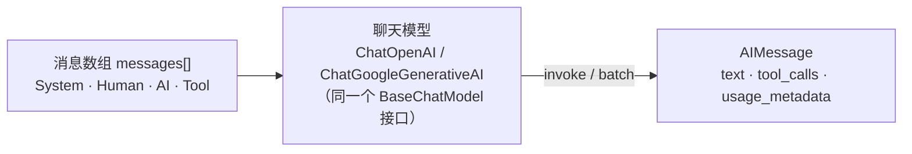

import { Canvas, Controls, Meta } from '@storybook/addon-docs/blocks';
import * as Stories from './models-and-messages.stories';

<Meta of={Stories} name="Docs" />

# 模型与消息

LangChain 把"和谁对话"与"说了什么"拆成两个正交概念：**聊天模型**（如 `ChatOpenAI`）决定请求发给哪家提供方，**消息**（`HumanMessage`、`AIMessage` 等）承载对话内容。所有提供方的聊天模型都实现同一个标准接口（`BaseChatModel`），输入和输出统一用同一种消息结构——这就是[第一个 Agent](?path=/docs/first-agent--docs) 里 `state.messages` 能原样传给模型、也能换提供方的原因。本课把模型当独立对象讲清：怎么调（`invoke`/`batch`）、怎么配（`ChatOpenAI` 参数与默认值）、消息长什么样（四种类型与多模态内容块）、回复里有什么（文本与 token 用量），以及换成 Gemini 时哪些东西会变。



开场先给 `ChatOpenAI` 的常用参数速查（默认值已与官方文档核对）：

| 参数 | 默认值 | 作用 |
| --- | --- | --- |
| `model` | 必填 | 模型名直接透传提供方（如 `gpt-5.5`），出新模型不需要升级包 |
| `apiKey` | 读 `OPENAI_API_KEY` 环境变量 | 未显式传入时从环境变量读取 |
| `temperature` | 不传则用提供方 API 默认（OpenAI 为 1） | 越高越有创造性，越低越确定 |
| `maxTokens` | 不传则不设上限 | 限制单次响应的 token 数 |
| `timeout` | 不传则用底层 SDK 默认 | 请求超时，单位毫秒（如 `120_000`） |
| `maxRetries` | `6` | 429/5xx/网络错误自动重试（指数退避加抖动）；401/404 不重试 |
| `configuration` | 无 | 透传 openai SDK 的 `ClientOptions`（`baseURL`、`defaultHeaders` 等） |
| `useResponsesApi` | `false` | `true` 强制走 OpenAI Responses API；用到内置工具时会自动路由 |

## 快速上手

脱离 Agent，直接把模型当函数调一次——这是本课的最小闭环（包结构见[安装](?path=/docs/installation--docs)）：

```ts
// 运行条件：Node ≥ 20（ESM）；已安装 langchain 与 @langchain/openai；
// .env 中配置 OPENAI_API_KEY，由 dotenv 加载（对齐 tester/ 的实践）。
import 'dotenv/config';
import { ChatOpenAI } from '@langchain/openai';

const model = new ChatOpenAI({ model: 'gpt-5.5' });

const response = await model.invoke('用一句话解释什么是 token。');

console.log(response.text); // 模型的文本回复
console.log(response.usage_metadata); // { input_tokens, output_tokens, total_tokens }
```

## 调用接口

所有聊天模型实现同一套标准接口，输入是消息，输出统一是 `AIMessage`。最常用的是 `invoke`（单次请求）和 `batch`（并发批量）；`stream`/`streamEvents` 归[流式输出](?path=/docs/streaming--docs)一课。

`invoke` 的输入有三种等价写法，按场景选：

```ts
// 1. 纯字符串：单轮独立提问，最省事
await model.invoke('用一句话解释什么是 token。');

// 2. OpenAI 字典格式：role/content，适合从 OpenAI 代码迁移
await model.invoke([
  { role: 'system', content: '你是中译英翻译助手。' },
  { role: 'user', content: '我爱编程。' },
]);

// 3. 消息类实例：完整形态，支持多轮、多模态、工具消息（推荐）
await model.invoke([
  new SystemMessage('你是简洁的中文助手。'),
  new HumanMessage('一句话解释什么是 token。'),
]);
```

消息类是功能最全的形态：字符串和字典格式能做的事它都能做，还携带 `name`、`id`、`tool_calls` 等字典格式表达不了的字段。后面「消息类型」一节展开。

`batch` 并发发一组请求，适合批量打分、翻译、分类：

```ts
const answers = await model.batch([
  '什么是 token？',
  '什么是上下文窗口？',
  '什么是温度参数？',
], { maxConcurrency: 5 }); // 限制同时在途的请求数

console.log(answers.map((a) => a.text));
```

`bindTools()`（绑定工具）和 `withStructuredOutput()`（结构化输出）是同一接口上的扩展方法，分别归[工具](?path=/docs/tools--docs)和[结构化输出](?path=/docs/structured-output--docs)两课。

## ChatOpenAI 配置

构造参数决定模型行为与请求韧性。常用组合：

```ts
import 'dotenv/config';
import { ChatOpenAI } from '@langchain/openai';

const model = new ChatOpenAI({
  model: 'gpt-5.5',
  temperature: 0,   // 抽取、分类等要稳定结果的场景设 0
  maxTokens: 512,   // 限制单次响应的 token 数
  timeout: 30_000,  // 毫秒
  maxRetries: 3,    // 默认 6；公网不稳或批量跑可调高（官方建议 10–15）
});
```

三个语义要点：

- **`model` 是自由字符串。** 模型名直接透传给提供方 API，新模型名无需升级 LangChain 包即可使用；微调模型传 `ft:gpt-3.5-turbo-0613:{ORG_NAME}::{MODEL_ID}` 格式。
- **重试只覆盖瞬态错误。** 网络错误、429、5xx 自动重试；401/404 属于配置错误，重试没有意义，会立即抛出——排障时这是区分"配置错了"和"限流了"的信号。
- **`configuration` 是逃生口。** 自定义网关、代理或 OpenAI 兼容端点（vLLM、Together 等）时，在这里传 `baseURL` 和 `defaultHeaders`：

```ts
// OpenAI 兼容端点：configuration 透传给底层 openai SDK
const localModel = new ChatOpenAI({
  model: 'qwen3:8b',
  configuration: { baseURL: 'http://localhost:11434/v1' },
  // 鉴权按端点要求，通过 apiKey 或 configuration.defaultHeaders 传入
});
```

两个轻量入口：

- **`useResponsesApi: true`** 强制走 OpenAI 的 Responses API（面向 agent 场景，支持 `web_search_preview`、computer use 等内置工具）；用到这些内置工具时 LangChain 会自动路由，无需手动设置。
- **`initChatModel`** 用一个字符串选提供方与模型，参数集与直接实例化相同，适合按配置切换：

```ts
import { initChatModel } from 'langchain';

const model = await initChatModel('openai:gpt-5.5', { temperature: 0 });
```

按运行时状态动态换模型的 `wrapModelCall` 写法归[中间件](?path=/docs/middleware--docs)一课。

## 消息类型

一条消息由三部分组成：**role**（谁说的）、**content**（说了什么，文本或多模态内容块）、**可选元数据**（`id`、`name`、token 用量等）。LangChain 的类名与 OpenAI 字典格式的 role 命名不同，但一一对应：

| LangChain 类 | OpenAI 字典 role | 谁产生 | 用来做什么 |
| --- | --- | --- | --- |
| `SystemMessage` | `system` | 开发者 | 设定角色、语气与规则，一般放消息数组开头 |
| `HumanMessage` | `user` | 用户 | 用户输入，多模态内容的入口 |
| `AIMessage` | `assistant` | 模型 | 模型回复：文本、`tool_calls`、token 用量 |
| `ToolMessage` | `tool` | 你的代码 | 把工具执行结果回传给模型 |

通用可选字段：`name`（作者标识，行为因提供方而异，有的用于识别、有的忽略）、`id`（唯一标识，用于追踪与消息去重）。

### SystemMessage

给模型下"导演指令"：角色、语气、输出规范。它在请求里优先级最高，是控制行为最便宜的手段：

```ts
import { SystemMessage, HumanMessage } from 'langchain';

const messages = [
  new SystemMessage('你是资深 TypeScript code reviewer，只指出最关键的问题。'),
  new HumanMessage('帮我看看这段代码：const x: any = await fetch(url)'),
];

const response = await model.invoke(messages);
```

### HumanMessage

用户侧输入，`content` 既可以是字符串，也可以是内容块数组（多模态，见[多模态内容块](#多模态内容块)）。支持元数据：

```ts
const humanMessage = new HumanMessage({
  content: '帮我看看这段代码为什么报错。',
  name: 'alice',    // 可选：作者标识，提供方处理方式不一
  id: 'msg_123',    // 可选：唯一标识，用于追踪与去重
});
```

### AIMessage

模型的输出。通常由 `invoke`/`batch` 返回，也可以手动构造，用来预置对话历史或 few-shot 示例：

```ts
import { AIMessage } from 'langchain';

const messages = [
  new SystemMessage('你是简洁的中文助手。'),
  new HumanMessage('你能帮我做什么？'),
  new AIMessage('我可以回答问题、调用工具、处理多模态输入。'), // 手写的历史回复
  new HumanMessage('那 2+2 等于几？'),
];
```

返回的 `AIMessage` 上有这些字段（用量与元数据见下节）：

| 字段 | 类型 | 说明 |
| --- | --- | --- |
| `text` | `string` | 取文本回复的便捷入口 |
| `content` | `string` \| `ContentBlock[]` | 原始内容；多模态输出时是数组 |
| `contentBlocks` | `ContentBlock.Standard[]` | 把 `content` 惰性解析成标准内容块 |
| `tool_calls` | `ToolCall[]` | 模型发起的工具调用（`name`/`args`/`id`），无调用时为空 |
| `id` | `string` | 消息唯一标识 |
| `usage_metadata` | `UsageMetadata` | token 用量，见下节 |
| `response_metadata` | `ResponseMetadata` | 提供方原始响应信息，见下节 |

流式返回的 `AIMessageChunk` 用 `concat` 逐块拼接，归[流式输出](?path=/docs/streaming--docs)一课。

### ToolMessage

把工具执行结果传回模型，让下一轮推理能看到结果。三个要点：`content` 是字符串化的工具输出；`tool_call_id` **必须逐字匹配** `AIMessage.tool_calls` 里的 `id`；`artifact` 存只给程序用、不发给模型的附加数据：

```ts
import { AIMessage, ToolMessage } from 'langchain';

// 模型返回的工具调用（通常由框架产生，这里展示它的形态）
const aiMessage = new AIMessage({
  content: '',
  tool_calls: [
    { name: 'get_weather', args: { location: 'Tokyo' }, id: 'call_123' },
  ],
});

// 工具执行完后，用同一个 id 回填结果
const toolMessage = new ToolMessage({
  content: 'Sunny, 24°C',  // 工具输出的字符串化结果
  tool_call_id: 'call_123', // 与 tool_calls[0].id 匹配，配错模型直接报错
  name: 'get_weather',
  // artifact: { fetchedAt: '2026-10-01' }, // 可选：只给程序访问，不发给模型
});

const response = await model.invoke([aiMessage, toolMessage]);
```

用 `tool()` 定义工具、把工具绑给模型的完整链路归[工具](?path=/docs/tools--docs)一课；多轮消息怎么存进记忆归[短期记忆](?path=/docs/short-term-memory--docs)一课。

## token 用量与响应元数据

每次响应都带两份账本，都在 `AIMessage` 上：

```ts
const response = await model.invoke('用一句话解释什么是 token。');

console.log(response.usage_metadata);
// { input_tokens: 12, output_tokens: 34, total_tokens: 46, ... }
// 缓存命中、推理 token 等明细也在这个对象里

console.log(response.response_metadata);
// 提供方原始信息，如 model_provider、model_name
```

- **`usage_metadata`：标准化的 token 用量**（`input_tokens`/`output_tokens`/`total_tokens`），字段名跨提供方一致，用来算成本、监控消耗。
- **`response_metadata`：提供方原始响应信息**，字段随提供方变化。一个易混点：OpenAI 的**提示缓存**命中数放在 `response_metadata` 而不是 `usage_metadata`——超 1024 token 的前缀自动缓存，想核对缓存收益时查这里。

缓存机制正是提供方差异的典型样本：OpenAI 前缀超 1024 token 自动缓存（可用 `prompt_cache_key` 命中更多）；Gemini 是隐式缓存，无需配置即返回节省；Anthropic 则要在 content block 上显式标 `cache_control`。跨提供方的统一观测归[LangSmith 追踪](?path=/docs/langsmith-observability--docs)一课。

## 多模态内容块

图片、文件等输入要求 `content` 从字符串升级为**内容块数组**。LangChain v1 的标准内容块跨提供方通用——同一份消息可以直接发给 OpenAI 或 Gemini。

标准格式里，多模态块的来源有三档（`source_type`）：`url`（直链）、`base64`（内嵌数据，需配 `mime_type`）、`id`（提供方托管的文件标识）：

```ts
import { HumanMessage } from 'langchain';

// 图片 URL
const byUrl = new HumanMessage({
  content: [
    { type: 'text', text: '描述这张图片的内容。' },
    { type: 'image', source_type: 'url', url: 'https://example.com/chart.png' },
  ],
});

// 本地文件 / 截图：base64 内嵌
const byBase64 = new HumanMessage({
  content: [
    { type: 'text', text: '这张截图里报了什么错？' },
    {
      type: 'image',
      source_type: 'base64',
      mime_type: 'image/png',
      data: pngBase64String,
    },
  ],
});

const response = await model.invoke([byUrl]);
console.log(response.text);
```

内容块家族速查：

| block `type` | 载荷 | 关键字段 |
| --- | --- | --- |
| `text` | 文本 | `text` |
| `image` | 图片 | `source_type` + `url`，或 `data` + `mime_type`，或 `id` |
| `audio` | 音频 | 同 `image` 的三档来源 |
| `video` | 视频 | 同 `image` 的三档来源 |
| `file` | 文件（如 PDF） | `source_type: 'base64'` + `mime_type: 'application/pdf'` + `data` |

三条边界：

- **并非所有模型支持所有模态**——纯文本模型收到 `image` 块会直接报错，先确认模型能力。
- 内容块类型可以直接导入做类型标注：`import { ContentBlock } from 'langchain'`。
- 除标准格式外，模型也接受 OpenAI chat completions 格式和提供方原生格式；要跨提供方移植就用标准格式。

下面用模拟器观察组装结果——消息结构是纯数据，不请求模型也能核对：

<Canvas of={Stories.MessageBuilder} />
<Controls of={Stories.MessageBuilder} />

| 读者操作 | 可观察证据 |
| --- | --- |
| 把「消息角色」切到 human / ai / system / tool | 左侧类名卡与右侧 `role` 同步变化：`HumanMessage` → `"user"`，`AIMessage` → `"assistant"` |
| 把「内容形态」切到纯文本 | `content` 从 `ContentBlock[]`（2 块）变回单个字符串 |
| 切换「图片来源」 url / base64 / id | 图片块的字段组合随之变化：`url`；`mime_type` + `data`；`id` |
| 角色选 system 或 tool 且内容形态选文本+图片 | 出现边界提示条：这两种消息通常不放多模态块 |

打开 Show code 可看到该 Canvas 实际执行的 `example.ts`：`assembleMessage()` 就是上面的组装规则，`draw()` 只负责呈现。

## 提供方差异

标准接口意味着**换提供方只换构造**，消息与调用代码原样保留：

```ts
// 运行条件：另需安装 @langchain/google-genai，.env 中配置 GOOGLE_API_KEY。
import { ChatGoogleGenerativeAI } from '@langchain/google-genai';

const openai = new ChatOpenAI({ model: 'gpt-5.5' });
const gemini = new ChatGoogleGenerativeAI({ model: 'gemini-2.5-flash-lite' });

// 同一段消息、同一套 invoke/batch，两边都能跑
const messages = [
  new SystemMessage('你是简洁的中文助手。'),
  new HumanMessage('一句话解释什么是 token。'),
];
const a = await openai.invoke(messages);
const b = await gemini.invoke(messages);
```

差异集中在构造侧，速查对照：

| 对照点 | OpenAI | Gemini |
| --- | --- | --- |
| 包与类 | `@langchain/openai` → `ChatOpenAI` | `@langchain/google-genai` → `ChatGoogleGenerativeAI` |
| 环境变量 | `OPENAI_API_KEY` | `GOOGLE_API_KEY` |
| 模型名示例 | `gpt-5.5`、`gpt-5.4-mini` | `gemini-2.5-flash-lite` |
| 提示缓存 | 前缀超 1024 token 自动缓存，可用 `prompt_cache_key` | 隐式缓存，无需配置即返回节省 |
| 特有配置 | `useResponsesApi`、`modalities`（音频输出）等 | 隐式缓存之外基本走标准参数 |
| `name` 字段 | 用于识别 | 可能被忽略 |

实践上把提供方差异锁在"构造模型"这一处：消息构造、调用代码、多模态 content blocks 全部用标准格式写，换提供方时只改 import 和构造参数。

## 最佳实践

- **`temperature` 按任务定，不为"更好"而设**：抽取、分类、结构化输出要稳定，设 `0`；创作、头脑风暴才调高。不确定就先不传，用提供方默认。
- **`maxTokens` 是保险丝不是旋钮**：批量跑任务时设上限防失控计费，但调小会截断长回复（JSON 截断的坑在[结构化输出](?path=/docs/structured-output--docs)处理）。
- **超时与重试成对设置**：公网不稳或大批量跑时，显式设 `timeout` 并把 `maxRetries` 提到 10–15（官方建议）；只调其一会在网络抖动时要么干等、要么白白失败。
- **多模态与跨提供方场景只用标准 content blocks**：不写 OpenAI 原生格式或提供方私有格式，移植时消息层零改动。
- **输入形态按持久度选**：一次性脚本用字符串；要进 Agent、要复用、要多模态，从一开始就用消息类构造。

## 常见问题

- **配置了 `apiKey` 还是报 401/404，而且没有重试。**
  这是正常行为：`maxRetries` 只覆盖网络错误、429、5xx；401/404 是配置错误，立即抛出。按顺序检查 `.env` 是否真的被 dotenv 加载（`console.log(process.env.OPENAI_API_KEY)`）、模型名拼写、`configuration.baseURL` 是否指向正确的端点。
- **传了 `ToolMessage` 后模型报 400 / 工具消息参数错误。**
  `tool_call_id` 必须与 `AIMessage.tool_calls[].id` 逐字一致，且 `ToolMessage` 要紧跟对应的 `AIMessage`。打印两侧的 id 对比，通常是工具链路里 id 丢失或被重新生成。
- **`response.content` 打印出来是数组或 `[object Object]`，不是文字。**
  `content` 的类型是 `string | ContentBlock[]`，多模态输出时是数组。取文本用 `response.text`，要按块处理就用 `response.contentBlocks`。
- **带图片的消息报 unsupported / invalid content 之类错误。**
  先确认模型本身支持该模态（纯文本模型收到 `image` 块会报错），再检查 `source_type` 与字段是否匹配：`url` 要 `url`，`base64` 要 `mime_type` + `data`，托管文件用 `id`。

## 总结回顾

摘要：

聊天模型与消息是两个正交概念：模型实现统一的 `BaseChatModel` 接口（`invoke` 单次、`batch` 并发），输入三种写法（字符串、OpenAI 字典、消息类），输出统一是 `AIMessage`。`ChatOpenAI` 的配置集中在构造参数——`model` 自由透传、`maxRetries` 默认 6 且只重试瞬态错误、`configuration.baseURL` 接兼容端点。消息分四类且与 OpenAI role 一一对应（System/Human/AI/Tool ↔ system/user/assistant/tool），`AIMessage` 携带 `text`、`tool_calls`、`usage_metadata`、`response_metadata`，`ToolMessage` 靠 `tool_call_id` 与工具调用配对。多模态用标准 content blocks（`source_type` 三档来源），跨提供方通用；换 Gemini 只换构造，差异集中在环境变量、模型名与缓存机制。

一句话：

> 消息结构跨提供方通用，换模型只换构造——把"和谁对话"与"说了什么"分开，是 LangChain 模型层的核心设计。

知识要点：

- `invoke` 的三种输入写法分别适合什么场景？
- `ChatOpenAI` 各构造参数的默认值是什么，哪些错误不会被自动重试？
- 四种消息类与 OpenAI 的 role 如何对应，谁产生、各携带哪些字段？
- `AIMessage` 上 `content` 与 `text`、`contentBlocks` 的关系是什么？
- `usage_metadata` 与 `response_metadata` 各装什么，OpenAI 的缓存命中数在哪里？
- 多模态内容块的 `source_type` 三档来源分别要配哪些字段？
- 从 `ChatOpenAI` 换到 `ChatGoogleGenerativeAI` 要改哪些东西，哪些不用改？

## 参考资料

- [Models（LangChain.js 官方文档）](https://docs.langchain.com/oss/javascript/langchain/models)
- [Messages（LangChain.js 官方文档）](https://docs.langchain.com/oss/javascript/langchain/messages)
- [ChatOpenAI 集成（LangChain.js 官方文档）](https://docs.langchain.com/oss/javascript/integrations/chat/openai)
