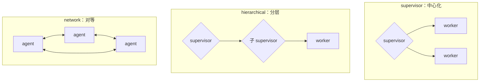
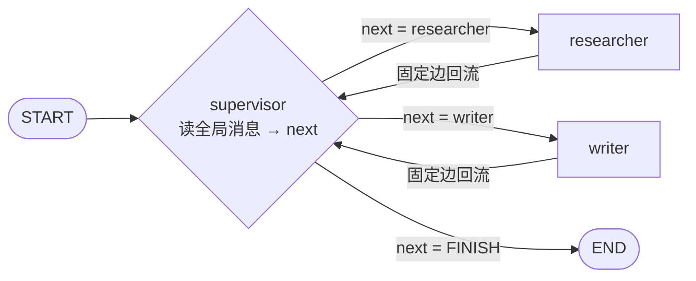

import { Canvas, Controls, Meta } from '@storybook/addon-docs/blocks';
import * as MultiAgentOverview from './multi-agent-overview.stories';

<Meta of={MultiAgentOverview} name="Docs" />

# 概览与路由

本课是「多智能体」主题组的开篇，回答三个问题：什么时候真的需要多智能体、官方提供了哪些模式、其中两种分发——supervisor 路由循环与 router 分发——怎么落地成代码。`task` 工具委派子代理归「子代理」一课，handoff 转移控制权归「移交」一课，SKILL.md 式能力披露归「技能」一课；Deep Agents 把这些模式打包成开箱即用的 harness，归阶段 5.2。读完你应该能预测：拿到一个需求时先核对哪些信号，再决定分发交给写死的代码、单次 LLM 分类，还是多轮有状态的 supervisor。

| 模式 | 一句话定位 | 控制权在哪 | 详细落点 |
| --- | --- | --- | --- |
| subagents | 主 agent 把子 agent 当工具调用，所有路由经主 agent | 主 agent（即 supervisor） | 「子代理」 |
| handoffs | 按状态把控制权整体移交给另一个 agent | 随移交转移 | 「移交」 |
| skills | 单 agent 保持控制权，按需加载专门提示与知识 | 始终在同一 agent | 「技能」 |
| router | 先分类输入，分发给专门 agent，最后综合结果 | 路由步骤（一次性） | 本课 |
| custom workflow | 用 LangGraph 定制编排，混排确定性步骤与 agent | 图结构本身 | 本课 + 「Graph API」 |

五种模式不是互斥的单选题：官方明确可以混搭——subagents 架构调用的工具里可以包着 custom workflow 或 router 图。本课讲清整张地图和 router / supervisor 两种分发的写法，其余模式只给边界和入口。

## 何时需要多智能体

官方文档开篇先给的不是一个模式，而是一句提醒：**并非每个复杂任务都需要多智能体**——单一 agent 配合适当（有时是动态加载）的工具和提示，通常就够了。上一课 Agentic RAG 的做法（把检索做成工具交给一个 agent）正是这个思路的延伸：先穷尽"单 agent + 工具"的组合，再考虑拆成多个 agent。

那什么时候真的要拆？官方说开发者要"多智能体"时，通常追求三种能力：

- **上下文管理**：在不撑爆模型上下文窗口的前提下提供领域专业知识——每个 agent 只看自己该看的。
- **分布式开发**：不同团队各自开发、维护、测试自己的 agent，互不阻塞。
- **并行化**：为子任务生成专门的 worker 并发执行。

对应的进入信号：单 agent 的工具多到模型选择混乱、任务需要携带大量上下文的领域专业知识、需要通过顺序约束解锁能力（前一步产出是后一步的输入）。反过来说，任务简单、工具少、单轮交互，就是单 agent 的地盘。

拆与不拆的代价是可量化的。官方用一组典型场景对比了四种模式的模型调用数：

| 场景 | 结论 |
| --- | --- |
| 单次请求 | subagents 4 次模型调用，handoffs / skills / router 各 3 次——subagents 的结果要流回主 agent，多一跳换来集中控制 |
| 重复请求（多轮） | 有状态的 handoffs、skills 省约 40–50% 调用（agent 保持活跃或技能上下文已在会话历史中）；subagents 和 router 无状态，每请求重跑 |
| 多领域、每个领域约 2000 token 文档 | subagents 靠上下文隔离整体少处理约 67% token（对比 skills 每次调用都要处理全部技能文档） |

这些数字的用途不是背，而是建立直觉：**多智能体的收益（隔离、并行、分布式）每一项都有对应的调用与延迟开销**。支撑全部取舍的设计原则官方也给了名字——context engineering：决定每个 agent 看到什么信息。模式选择本质上是在决定"上下文在哪些 agent 之间怎么分"。

## 模式全景

把开场参考表展开成选择信号：

| 模式 | 强项 | 弱项 | 什么时候选 |
| --- | --- | --- | --- |
| subagents | 分布式开发、并行、多跳编排、大上下文隔离 | 直接面对用户的能力最弱；重复请求开销大 | 子任务需要独立的大上下文，或要并行、要按团队拆分维护 |
| handoffs | 多跳对话、直接用户交互 | 不提供上下文隔离与分布式开发 | 对话中控制权要随话题转移（归「移交」） |
| skills | 简单专注的任务、单 agent 保持控制 | 大上下文领域知识会反复占用窗口 | 能力差异主要是"提示 + 知识"，不需要独立执行（归「技能」） |
| router | 并行 fan-out、确定性分发 | 不做多跳编排、不维护状态 | 输入有明确类别，一步分类就能分发（本课） |
| custom workflow | 完全控制图结构：顺序、分支、循环、并行 | 自己写编排，没有现成模式 | 标准模式都不满足，要混排确定性逻辑与 agentic 行为（本课 + 「Graph API」） |

两点补充：其一，Deep Agents 把 subagents、skills、planning、虚拟文件系统和上下文管理打包成内置能力，不想自己组装这些模式时它是官方的"多智能体全家桶"入口（归阶段 5.2）。其二，custom workflow 里可以把整个 agent（甚至整个多 agent 系统）作为单个节点嵌入——router 图本身就是 custom workflow 的一个例子。

### supervisor、network 与 hierarchical 拓扑

上表是按"能力模式"分的；按"谁连谁"的拓扑看，subagents 模式在实践里有三种形态：



- **supervisor（中心化）**：一个主 agent 集中协调，所有路由经过它，worker 之间不直接通信。路由逻辑集中在一处，可审计、可控；代价是每一步都要回中心。
- **hierarchical（分层）**：supervisor 的某些 worker 本身又是下一层的 supervisor，把大团队按层分解。规模大到单个 supervisor 管不过来（要盯的 worker 和消息太多）时用它。
- **network（对等）**：没有唯一中心，每个 agent 都能调用其他 agent，控制权在网内流转。少一跳、延迟低，但路径发散、难调试。

拓扑影响开销的方式很直接：**每多一跳，通常多一次模型调用**。判断顺序建议：先问"是否必须拆"（上一节），再问"路由要不要集中"——要可控选 supervisor，要低延迟互通选 network，规模大再上 hierarchical。本课的代码主线是 supervisor 与 router；network / hierarchical 是同一套工具（工具调用、Command 路由）的不同连线方式，不单独展开。

## supervisor 路由循环

supervisor 的核心是一个**路由 agent**：它读全局消息账本，每轮决定下一步交给哪个 worker，还是结束。worker 的结果回流到账本，supervisor 再次判断——循环直到它输出 FINISH。这就是「子代理」一课会展开的"main agent 把 subagent 当工具"在图编排层的等价结构：官方 JS 文档用 createAgent + tool 封装实现同一模式，本课给 Command 化的路由节点写法，两者殊途同归——都是"supervisor 看全局、决定下一个 worker"。



图里有两类控制流，各由不同机制负责：

- **分发（supervisor → worker）**：路由节点返回 `new Command({ goto })`，动态决定下一步给谁；`goto: END` 表示不再分发。
- **回流（worker → supervisor）**：普通固定边。worker 完成后回到 supervisor 再判断，循环由此闭合。

`Command` 的关键输入（与本地 `@langchain/langgraph` 类型定义核对）：`goto` 接受单个节点名、节点名序列或 `Send` 对象（并行分发用，见下一节）；`update` 是随命令一起写入的状态更新片段，返回 `Command` 的节点就用它代替普通返回值合并状态。最小可运行实现：

```ts
// supervisor-loop.ts —— supervisor 路由循环的最小可运行实现：
// supervisor 节点读全局消息，用结构化输出决定下一个 worker 还是结束；
// worker 完成后经固定边回流 supervisor，直到 goto END。
// 运行条件：npm i @langchain/langgraph @langchain/openai zod dotenv，
// .env 配置 OPENAI_API_KEY，然后 npx tsx supervisor-loop.ts。
import 'dotenv/config';
import { z } from 'zod';
import { Annotation, Command, END, START, StateGraph } from '@langchain/langgraph';
import { ChatOpenAI } from '@langchain/openai';

// 全局消息账本：supervisor 的判断依据，也是 worker 结果的回流通道
const State = Annotation.Root({
  messages: Annotation<any[]>({
    reducer: (current, update) => current.concat(update),
  }),
});

const model = new ChatOpenAI({ model: 'gpt-4o-mini' });

// 决策 schema：枚举约束可去的目标，FINISH 表示不再分发
const RouteDecision = z.object({
  next: z.enum(['researcher', 'writer', 'FINISH']),
  reason: z.string(),
});

const supervisor = async (state: typeof State.State) => {
  const decision = await model.withStructuredOutput(RouteDecision).invoke([
    {
      role: 'system',
      content:
        '你是编排者，根据对话进度决定下一步：缺材料给 researcher，' +
        '材料齐了给 writer，任务完成输出 FINISH。',
    },
    ...state.messages,
  ]);
  if (decision.next === 'FINISH') {
    return new Command({ goto: END }); // 结束：分发的终点
  }
  return new Command({ goto: decision.next }); // 分发：下一步交给谁
};

// worker：这里用最小占位；换成 createAgent 的返回值就是完整的多 agent 系统
const researcher = async (_state: typeof State.State) => ({
  messages: [{ role: 'ai', content: '调研结论：LangGraph 用 Command 做动态路由……' }],
});

const writer = async (_state: typeof State.State) => ({
  messages: [{ role: 'ai', content: '成稿（含引用）：……' }],
});

const graph = new StateGraph(State)
  .addNode('supervisor', supervisor)
  .addNode('researcher', researcher)
  .addNode('writer', writer)
  .addEdge(START, 'supervisor')
  // 结果回流：漏掉这两条边，worker 跑完图就直接结束，supervisor 不再有发言权
  .addEdge('researcher', 'supervisor')
  .addEdge('writer', 'supervisor')
  .compile();

const result = await graph.invoke({
  messages: [{ role: 'user', content: '写一篇 300 字介绍 Command 路由，先调研再成稿' }],
});
console.log(result.messages.at(-1)?.content);
```

把这个循环和它的对照组——静态条件路由——放进同一张确定性模拟里观察。判断逻辑在范例里用查表模拟（真实实现就是上面的模型 + 结构化输出）：

<Canvas of={MultiAgentOverview.Interactive} />
<Controls of={MultiAgentOverview.Interactive} />

| 读者操作 | 可观察证据 |
| --- | --- |
| 任务保持「技术综述」，路由为「静态条件路由」 | 入口一次分类后固定走 researcher → writer → END：不产出中途检查，草稿缺引用也只能交付 |
| 同任务切到「supervisor 循环」 | 轨迹出现回流：草稿缺引用时再派 researcher、重写、判断 FINISH；判断调用从 1 次升到 5 次 |
| 任务切到「事实核查」，对比两种路由 | 路径几乎相同，但 supervisor 多花一次判断——类别可枚举的简单任务上，静态路由更划算 |
| 打开 Show code | 看到该 Canvas 实际执行的 `example.ts`：纯 TS 确定性模拟，不依赖 `@langchain/*` |

这张对照表就是本课核心判断的可观察形态：supervisor 用更多判断调用换取"看中间结果再决定"的灵活性；路径可枚举时这些调用是纯开销。

## router 分发

官方对 router 的定位是一个**专用的路由步骤**：通常是一次 LLM 调用或基于规则的逻辑，把输入分类后分发给专门 agent，最后综合结果。它和 supervisor 的分界（官方在 router 文档里专门提示）：router 是无状态的预处理步骤——不维护对话历史、不看执行中间状态；supervisor 是完整 agent——多轮维护上下文，动态决定调用谁。选择信号：输入类别明确、要确定性或轻量分类，用 router；要基于上下文的灵活编排，用 supervisor（或 subagents）。

router 的"分类"一环有静态和 LLM 两种写法，分发一环有单目标和并行两种目标形态。

### 静态条件路由

分支写死在代码里——这就是「LangGraph 思维模型」一课 workflow 一侧的路由，零模型调用、可预测、可离线测试：

```ts
// 静态路由：按输入类别查表分发，分支条件是确定性代码（Graph API 基础归「Graph API」一课）
graph.addConditionalEdges('classify', (state) =>
  state.intent === 'billing' ? 'billingAgent' : 'generalAgent',
);
```

适合输入有明确类别且类别可枚举的场景（客服分流、按语言分发）。类别本身需要"理解"输入才能判断时，才升级到 LLM 路由。

### LLM 路由

分类交给模型，官方 router 文档的 `Command` 写法：结构化输出约束分类结果，`goto` 直接吃分类出来的目标节点名，`update` 顺手把改写后的查询写进状态：

```ts
// LLM 路由：分类这一步交给模型（官方 router 文档的 Command 写法，承接上文 State 与 model）
const RouteDecision = z.object({
  agent: z.enum(['githubAgent', 'notionAgent', 'slackAgent']),
  query: z.string(),
});

const classify = async (state: typeof State.State) => {
  const decision = await model.withStructuredOutput(RouteDecision).invoke([
    { role: 'user', content: state.query },
  ]);
  // 分类结果直接决定 goto 的目标，query 一并写进状态
  return new Command({ goto: decision.agent, update: { query: decision.query } });
};
```

一次分类出多个目标时，用 `Send` 做并行 fan-out——每个目标带独立输入，map-reduce 式地并发执行后汇合：

```ts
// 并行 fan-out：一次分类出多个目标，用 Send 给每个目标带独立输入（官方 router 文档写法）
const routeQuery = async (state: typeof State.State) => {
  const classifications = await classifyQuery(state.query); // → [{ agent, query }, ...]
  return classifications.map((c) => new Send(c.agent, { query: c.query }));
};
```

`Send` 与 `Command` 的 `goto` 的分工：`goto` 接受节点名（单个或序列），走图的主状态；`Send` 为每个目标附带一份独立输入，专用于同一节点被并发调用多次的分发。两者都可以出现在路由节点的返回值里。

### 会话状态与 tool wrapper

router 无状态，多轮会话里就是短板：每个 agent 语气和提示不同，用户直连不同 agent 体验会不连贯；官方建议这类场景改用 handoffs 或 subagents（各有专门课）。留在 router 模式内的官方方案是 **tool wrapper**——把无状态的路由图包成一个工具，挂在维护会话记忆的 agent 上：

```ts
// 官方推荐的最简有状态方案：无状态 router 图包成 tool，会话状态交给 conversational agent
// （tool、createAgent 来自 langchain 包）
const searchDocs = tool(
  async ({ query }) => {
    const result = await workflow.invoke({ query }); // workflow 就是上面的路由图
    return result.finalAnswer;
  },
  {
    name: 'search_docs',
    description: 'Search across multiple documentation sources',
    schema: z.object({ query: z.string().describe('The search query') }),
  },
);

const conversationalAgent = createAgent({
  model,
  tools: [searchDocs],
  systemPrompt: 'You are a helpful assistant. Use search_docs to answer questions.',
});
```

需要更深的状态管理时（历史持久化、跨会话记忆），用 persistence 存消息历史并选择性注入 agent 上下文——机制归「持久化」一课，选择什么注入属于 context engineering 的调节手段。

## 最佳实践

- 默认从单 agent + 工具起步，命中至少一个信号（工具多到选择混乱、领域知识需要大上下文、需要并行或按团队分布式开发）再上多智能体；先试重组工具、动态加载工具、分层提示这些更便宜的替代。
- 按分发判断者选模式：类别可枚举用静态条件路由（零模型调用）；类别模糊但单轮可判定用 LLM 路由；要看执行中间结果反复编排用 supervisor。
- 按请求形态估开销：重复请求占比高的对话产品偏向有状态模式（官方数据：handoffs / skills 省约 40–50% 调用，细节归「移交」「技能」两课）；并行 + 大领域上下文偏向 subagents / router fan-out 的上下文隔离（少处理约 67% token）。
- supervisor 的决策 schema 用 `z.enum` 约束目标，并把枚举值与图中节点名共用一份常量——把"目标写错"从运行期的静默路由失败变成结构化输出的校验错误。
- 模式可以混搭：subagent 内部可以跑 custom workflow，router 图整体可以被包成 tool；先按每个子问题选模式，再组合，不追求全系统一种模式。

## 常见问题

- supervisor 和 router 都在做"分发"，到底差在哪？
  看两点：轮数和状态。router 是无状态的预处理步骤——入口一次分类（单次 LLM 调用或规则逻辑）就交出控制权，不维护对话历史、不看执行中间结果；supervisor 是完整 agent——多轮维护上下文，每轮看全局消息动态决定调用谁、何时结束。类别可枚举、单轮分发选 router；要看中间结果反复编排选 supervisor。
- 用了 `Command({ goto })` 分发，worker 跑完图就直接结束了，没回到 supervisor？
  漏了回流边。`goto` 只负责 supervisor → worker 这一跳；worker 完成后的去向仍由静态边决定，需要 `addEdge('worker', 'supervisor')` 显式回流。没有出边的节点执行完就隐式结束整张图，表现为"任务没汇总就返回了"。
- 路由节点 `return` 普通对象和 `return new Command(...)` 有什么区别？
  普通对象只按 reducer 合并状态，下一步走静态边；`Command` 才携带 `goto`（以及 `update`、`resume`），让"这次返回"同时决定状态写入和下一跳。需要节点自己决定下一步给谁时，用 `Command` 或 `addConditionalEdges`，两者选一。
- 任务变复杂了，是不是就该上多智能体？
  先核对三个信号（工具多到选择混乱、领域知识要大上下文、需要并行或分布式开发），都没命中就先在单 agent 内重组工具和提示。多智能体的灵活性是用更多模型调用、更高延迟和更大的调试面换来的，官方开篇的提醒就是这句话。

## 总结回顾

摘要：

本课先立住了"先确认单 Agent + 工具不够"的门槛：官方给的三种能力诉求（上下文管理、分布式开发、并行化）与进入信号，加上可量化的开销对比（有状态模式重复请求省 40–50% 调用、上下文隔离少处理约 67% token），全部围绕 context engineering 这条设计原则。模式地图上，subagents、handoffs、skills、router、custom workflow 各有控制权归属与选择信号，可混搭；subagents 按拓扑分为 supervisor（中心化）、hierarchical（分层）、network（对等），每多一跳多一次调用。实现主线是 supervisor 路由循环：路由节点返回 `Command({ goto })` 分发、worker 经固定边回流、`goto: END` 结束；router 分发则有静态条件路由、LLM 路由（`Command` 单目标 / `Send` 并行 fan-out）和 tool wrapper 三种写法，router 与 supervisor 的分界是单次无状态分类对多轮有状态编排。

一句话：

> 上多智能体之前先确认单 Agent + 工具真的不够；分发由谁决定——写死的代码、单次 LLM 分类，还是多轮有状态的 supervisor——决定了模式与开销。

知识要点：

- 官方说"要多智能体"通常指哪三种能力？进入信号是什么？
- 五种模式各自的控制权归属、强项与开销特征是什么？
- supervisor、hierarchical、network 三种拓扑差在哪，拓扑怎么影响调用数？
- supervisor 路由循环里 `Command({ goto })` 与回流边各负责什么？`goto` 能接受哪些值？
- 静态条件路由、LLM 路由、tool wrapper 分别适合什么场景？`Send` 和 `goto` 怎么分工？
- router 与 supervisor 的官方分界是什么？有状态模式为什么在重复请求上省调用？

## 参考资料

- [Multi-agent overview（官方：何时需要多智能体、五种模式与调用开销对比）](https://docs.langchain.com/oss/javascript/langchain/multi-agent/index)
- [Router（官方：Command / Send 分发写法、有状态路由的注意事项与 tool wrapper）](https://docs.langchain.com/oss/javascript/langchain/multi-agent/router)
- [Custom workflow（官方：LangGraph 定制编排、混排确定性步骤与 agent）](https://docs.langchain.com/oss/javascript/langchain/multi-agent/custom-workflow)
- [Subagents（官方：supervisor 的集中协调与上下文隔离、与 router 的分界）](https://docs.langchain.com/oss/javascript/langchain/multi-agent/subagents)
