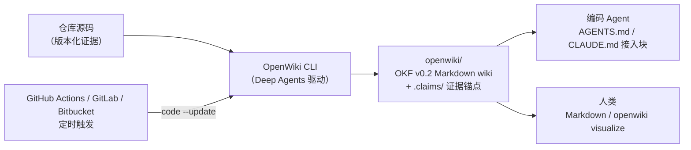

import { Canvas, Controls, Meta } from '@storybook/addon-docs/blocks';
import * as OpenWiki from './openwiki.stories';

<Meta of={OpenWiki} name="Docs" />

# OpenWiki

OpenWiki 是 LangChain 官方的开源 CLI：为一个代码库（或你的个人知识源）生成并**持续维护**一份 Markdown wiki，主要消费者是编码 Agent——Codex、Claude Code、Cursor 这些工具动手前先读 wiki，只在需要细节时才回源码，因此更快、token 更便宜。它构建在 5.2.1 的 Deep Agents 之上：调研仓库、规划页面、撰写内容这些活，就是一个 Deep Agent 在干。本课站在使用者视角：装好、配置模型、跑一次 `--init` 看懂产物（OKF 格式页面 + 锚定源码的 Claims），再把 `--update` 接进 CI，让文档随代码一起演化。读完你应该能预测：一次提交落在 Claim 证据窗口内和窗口外，下一次 CI 运行分别会发生什么。



| 关键输入 | 形式 | 默认与回查要点 |
| --- | --- | --- |
| `openwiki --init` | 交互式向导 | 首次生成；重跑会从零重建 wiki 与 Claims，但保留 `INSTRUCTIONS.md` |
| `openwiki --update` | 增量刷新 | 核对过期 Claims；CI 里用 `openwiki code --update --print`；`openwiki/` 不存在且提供 provider/model 环境变量时自动完成首次生成 |
| `openwiki personal --init` | 交互式向导 | 个人知识库，写入 `~/.openwiki/wiki`（不是仓库目录） |
| `~/.openwiki/.env` | 配置文件 | 凭据与默认值存放处；进程环境变量优先于文件值 |
| `OPENWIKI_PROVIDER` / `OPENWIKI_MODEL_ID` | 环境变量 | OpenAI 主线：`openai` + `gpt-5.6-terra`，key 走 `OPENAI_API_KEY` |
| `openwiki/` | 输出目录 | OKF v0.2 Markdown bundle：concept 页面 + `.claims/` sidecar + `index.md` / `log.md` 保留文件 |

## 快速上手

OpenWiki 是全局安装的 npm CLI（不往你的项目里加依赖）。在任意 Git 仓库根目录：

```bash
# 1. 全局安装（Windows 建议 npm/pnpm；Bun 可能要编译 better-sqlite3 原生依赖）
npm install -g openwiki

# 2. 首次生成：交互式向导会依次询问——
#    推理提供方与模型（选 openai / gpt-5.6-terra）
#    → 提供方 API key（OPENAI_API_KEY）
#    → 可选的 LangSmith key 与项目名（用于追踪）
openwiki --init

# 3. 之后源码变化时增量刷新（也会修复上次失败的 Mermaid 图）
openwiki --update

# 4. 本地可视化浏览：交互式节点图 + 并排 Markdown 阅读器（仅绑定 127.0.0.1）
openwiki visualize
```

向导结束后凭据存进 `~/.openwiki/.env`，仓库里多出 `openwiki/` 目录和被接入的 `AGENTS.md`。最小的验证证据：

```bash
ls openwiki/
# index.md  log.md  INSTRUCTIONS.md  architecture.md  operations.md  …  .claims/

git diff --stat
# AGENTS.md | …… （插入 <!-- OPENWIKI:START --> … <!-- OPENWIKI:END --> 接入块）
```

直接运行 `openwiki` 会进入交互式会话（也可以带消息启动：`openwiki "Please generate documentation for this repository"`）；一次性非交互运行用 `openwiki -p "Summarize what you can do"`。会话内常用命令：`/api-key` 换 key、`/langsmith-key` 配追踪、`/effort` 调推理力度。

## OpenWiki 是什么

它解决的是**上下文不持久**的工程问题：编码 Agent 每接到一个任务都要重新探索仓库——架构、集成、工作流这些「慢变化」的知识每次都重新拼，又贵又慢；人手写的文档则会腐烂。OpenWiki 的答案是让一个 Deep Agent 把这些知识写成 wiki（覆盖 architecture、integrations、evals、workflows 这类主题），Agent 先读精选的 wiki、按需再进源码，人类也可以直接读同样的 Markdown。官方给的能力清单里与本课主线直接相关的是：Grounded Claims（关键事实追溯到版本化源码证据）、Automatic updates（CI 定时刷新、内容变更才开 PR）、Coding-agent integrations（在 Codex / Claude Code / OpenCode / Cursor 内运行）。

两种运行模式共用同一个 CLI：

| 模式 | 命令 | 输出位置 | 为谁服务 |
| --- | --- | --- | --- |
| Code（默认） | `openwiki` / `openwiki code` | 当前仓库的 `openwiki/` | 编码 Agent 的仓库上下文 |
| Personal | `openwiki personal` | `~/.openwiki/wiki` | 你自己的「本地个人大脑」 |

与 5.2.1 的衔接一句话说清：OpenWiki 就是 [Deep Agents](?path=/docs/deep-agents-quickstart--docs) 的一个成品应用——仓库调研靠虚拟文件系统工具与子代理委派，页面撰写就是 `write_file`/`edit_file`，长上下文靠自动摘要；你不写任何 `deepAgents()` 代码，只在 CLI 层面消费它。追踪面也一样：配置 LangSmith 后（`LANGSMITH_API_KEY`、`LANGCHAIN_TRACING_V2=true`、`LANGCHAIN_PROJECT=openwiki`），文档生成的每次运行都在 trace 里可见，细节归[「LangSmith 追踪」](?path=/docs/langsmith-observability--docs)。

## 安装与首次配置

安装本身只有一条命令（见快速上手）；首次配置的落点是 `--init` 向导四问与 `~/.openwiki/.env`：

- **提供方与模型**：向导列出全部支持的提供方；OpenAI 主线选 `openai`。配置和密钥保存到 `~/.openwiki/.env`，之后 `--init`/`--update` 直接复用。
- **提供方 API key**：OpenAI 是 `OPENAI_API_KEY`；也可用 `OPENAI_BASE_URL` 指向 OpenAI 兼容网关（须暴露 Responses API）。
- **LangSmith（可选）**：key 与项目名，用于追踪与「从运行时 trace 丰富 wiki」的 connector。
- **中断恢复**：`--init` 中断后重跑同一命令，可从 `openwiki/.run.json` 记录的页面队列断点续跑。

向导之外还可以用环境变量直接指定（进程环境变量优先于 `.env` 文件值）：

```bash
OPENWIKI_PROVIDER=openai
OPENWIKI_MODEL_ID=gpt-5.6-terra
```

`--init` 支持 `--language <BCP-47>` 指定文档语言，中文仓库直接 `openwiki --init --language zh-CN`。

## Code 模式

默认模式。四件事按序讲清：产物长什么样（目录）、页面什么格式（OKF）、事实怎么锚定源码（Claims）、后续怎么保持新鲜（更新与恢复）。

### openwiki/ 目录

一次 `--init` 后的典型布局：

```text
your-repo/
├── AGENTS.md            # OpenWiki 插入/刷新接入块（见「与编码工具集成」）
├── CLAUDE.md            # 同上（文件存在时才动它）
└── openwiki/
    ├── index.md         # 保留文件：入口索引，声明 okf_version: "0.2"
    ├── log.md           # 保留文件：更新日志
    ├── INSTRUCTIONS.md  # 你手写的 brief：范围、优先级、写作约定
    ├── architecture.md  # concept 页面（单主题 wiki 页）…
    ├── operations.md
    └── .claims/         # Claim sidecar：把事实页锚定到版本化仓库证据
```

| 路径 | 职责 | 回查要点 |
| --- | --- | --- |
| `openwiki/` | 生成的 Markdown wiki（quickstart、architecture、operations 等主题页） | 页面间用标准 Markdown 链接互链 |
| `openwiki/INSTRUCTIONS.md` | 仓库专属 wiki 指令（scope 与优先级） | **你手写的**：`--init`/`--update` 都读它但从不重写 |
| `openwiki/.claims/` | 结构化 Claim sidecar | 事实页的证据锚点，`--update` 的核对对象 |
| `openwiki/.page-manifest.json` | 每页进度与源码 checkpoint | 支持可恢复的增量生成 |
| `openwiki/.last-update.json` | 上次成功检查的元数据 | 空更新也会刷新它（证明「查过」） |
| `openwiki/.run.json` | 中断运行的页面队列 | 成功完成后删除；CI 里通常主动 `rm` |
| `openwiki/.langsmith.json` | 提交进仓库的 LangSmith 配置 | 只含 workspace/项目名，**永不含 key** |

### OKF 页面格式

输出遵循 Google **OKF（Open Knowledge Format）v0.2** 规范的 Markdown bundle（而非静态 HTML）。核心概念是 **concept**：一个单主题的普通 Markdown 页面，YAML front matter 必须有非空 `type`，其余标准字段可选：

```yaml
---
type: architecture
generated:
  by: openwiki/<version>
  at: 2026-10-01T08:00:00Z   # 正文变化（含空白）才推进；仅 front matter 变化不推进
verified:
  by: openwiki/<version>
  at: 2026-10-01T08:05:00Z   # 成功核对完整 Claims 并持久化 sidecar 后才盖
sources:
  - repo://src/server.ts#L40-L82   # grounded Claims 的证据投影
---
```

四个字段的语义（字段族以 OKF v0.2 规范为准）：

- **`generated`**：页面产出戳。`--update` 中正文任何变化都推进 `at`；producer 标记为 `openwiki/<version>`（宿主编码 Agent 代写时则是宿主标记）。
- **`verified`**：验证戳。只有一次成功提交**核对完非空完整的 Claims 集合、通过最终证据复核并持久化 sidecar** 后才写入——它是「这页事实当前可信」的机器可读凭证。
- **`sources`**：仓库页会把 grounded Claims 的证据投影进来；你独立撰写的 sources 条目会被保留。
- **保留文件**：`index.md` 与 `log.md` 是 scaffolding 不是 concept；根 index 声明 `okf_version: "0.2"`。v0.2 的 provenance/trust/lifecycle 可选字段族（`sources`、`verified`、`status`、`stale_after`）存在时会被校验，producer 自定义扩展字段在更新与迁移中被保留。

### Claims 与证据链接

Claim 是「未来 Agent 会依赖的事实命题」，覆盖 behavior、responsibilities、architecture、data flow、invariants、failure semantics、configuration、security boundaries 这类命题。每个 Claim 指向**确切的仓库证据**——文件路径加行号范围，并记录建立时观察到的证据版本（版本化快照）：

```text
repo://src/server.ts#L40-L82      ← 证据锚点：路径 + 行范围
snapshot: a1b2c3d                 ← Claim 建立时的证据版本
```

页面完成时持久化已核对的 Claims（`.claims/` 下的 sidecar），验证结果投影为 front matter 的 `verified`。一个刻意边界：connector 派生的事实（如 LangSmith-only 的观察）**不**作为 Claims——只有版本化仓库证据能承载。

这套「页面 ↔ Claim ↔ 源码」的关系与源码漂移后的更新链路，用确定性模拟观察一次（路径、命令与字段对齐 openwiki 官方文档，不发起真实模型调用）：

<Canvas of={OpenWiki.Interactive} />
<Controls of={OpenWiki.Interactive} />

| 读者操作 | 可观察证据 |
| --- | --- |
| 「证据窗口内」拖动时间线 1 → 5 | 第 2 步 L55 行出现「●修改 e5f6g7h」且落在蓝色证据窗口里；第 3 步 Claim 徽章转 `stale`；第 4 步页面重写，`generated.at` / `verified.at` 推进到 10-03 08:00 并标「← 已推进」；第 5 步 PR 卡显示「开 PR（architecture.md + .claims/）」 |
| 切到「证据窗口外」再拖到 5 | 修改标记落在 L120——蓝色窗口之外；Claim 全程保持 `verified (10-01 08:00)`，两个时间戳纹丝不动，PR 卡显示「不开 PR（仅刷新 .last-update.json）」 |
| 对比两场景的第 4 步 | 窗口内：时间戳推进 + Claims 重新核对；窗口外：复核通过但页面零改动——「无变化不推进 `generated.at`」的直观对照 |
| 打开 Show code | 看到该 Canvas 实际执行的 `example.ts`：纯 TS 确定性模拟，不依赖 `@langchain/*` |

这条链路就是 OpenWiki 文档「不腐烂」的机制内核：**事实锚在源码坐标上，源码动了才动文档**。

### 更新与断点恢复

`--update` 是增量语义：diff 当前 HEAD 与上次文档化提交，只重算受影响的页面；失败的 Mermaid 图会在后续 update 中修复。两个值得记住的行为：

- **空更新近乎免费**：干净的 `--update` 跳过模型调用、不改 wiki 内容，只刷新 `openwiki/.last-update.json` 记录检查已执行——这也是 CI 敢每天跑的底气。
- **断点恢复**：持久 checkout 里靠 `openwiki/.run.json` 与 `.page-manifest.json` 续跑；临时 CI runner 失败后（除非保留 workspace）从头开始，但已完成的部分页面仍可作为部分进度发布（见 CI 小节的 PR 策略）。

对照记忆 `--init`：它从零重建整个仓库 wiki、替换已有生成内容与 Claims（手写的 `INSTRUCTIONS.md` 保留），所以它是「重置」而不是「刷新」。

## 模型提供方

平台开箱支持 13 个提供方，凭据与默认值统一存 `~/.openwiki/.env`：

| 提供方 | 凭据 | 回查要点 |
| --- | --- | --- |
| `openai` | `OPENAI_API_KEY` | 主线选择；可选 `OPENAI_BASE_URL`（须暴露 Responses API） |
| `openai-chatgpt` | ChatGPT OAuth 令牌 | 用 ChatGPT 登录，用量计入 Plus/Pro/Team 的 Codex 额度 |
| `copilot` | GitHub CLI 会话或 `COPILOT_API_KEY` | CI 必须用 OAuth 令牌，经典/细粒度 PAT 会被拒 |
| `openrouter` | `OPENROUTER_API_KEY` | 默认不发送 `max_tokens`，低余额可能 402（见下） |
| `anthropic` | `ANTHROPIC_API_KEY` | 现代 Claude 模型内置输出上限 16384 |
| `gemini` | `GEMINI_API_KEY` | Google AI Studio |
| `gemini-enterprise` | Google ADC + `GOOGLE_CLOUD_PROJECT` | 无需 API key；需 `roles/aiplatform.user` |
| `bedrock` | AWS 凭据 + 区域 | 内置输出上限 16000；跨区域推理要用 profile ID |
| `baseten` / `fireworks` / `nebius` / `nvidia` | 各自 `*_API_KEY` | 均可选自定义 `*_BASE_URL` |
| `openai-compatible` | `OPENAI_COMPATIBLE_API_KEY` + `OPENAI_COMPATIBLE_BASE_URL` | 本地 Ollama / LM Studio 也走这条；模型 ID 自带 |

三个横切的运行参数：

```bash
# 推理力度：openai 提供方的 gpt-5.6-terra / luna / sol 支持
# none / low / medium / high / xhigh / max；无效组合请求前即失败
OPENWIKI_REASONING_EFFORT=high

# 全局输出令牌上限（映射为各提供方的 max_tokens / maxOutputTokens）
OPENWIKI_MAX_OUTPUT_TOKENS=16384

# 提供方请求重试次数（默认 3）
OPENWIKI_PROVIDER_RETRY_ATTEMPTS=3
```

两个提供方专属坑：**openai-compatible** 网关默认非流式，只支持流式的网关会生成空白 wiki 且无报错，需 `OPENWIKI_OPENAI_COMPATIBLE_STREAMING=true`；**openrouter** 低余额时预检报 402，可用 `OPENWIKI_OPENROUTER_MAX_TOKENS` 显式设限（设小可能截断长页面）。

## 与编码工具集成

两个方向，别混淆：**被动接入**让编码 Agent 读到 wiki，**主动运行**让编码 Agent 替你跑 OpenWiki。

被动接入是 `--init` 自动完成的：OpenWiki 在仓库根的 `AGENTS.md` 与 `CLAUDE.md` 里插入并刷新标记块，块内是告诉 Agent「动手前先查 `openwiki/` 对应页面」的提示，**块外你自己的内容一概不动**：

```markdown
<!-- OPENWIKI:START -->
（OpenWiki 生成并维护：提示编码 Agent 何时查阅 openwiki/ 下的 wiki 页面）
<!-- OPENWIKI:END -->
```

主动运行把 OpenWiki 装进宿主编码 Agent（Codex、Claude Code、OpenCode、Cursor 四种），用户级一次安装、任意 Git 仓库可用：

```bash
openwiki integrations install codex     # 装进 Codex
openwiki integrations install claude    # 装进 Claude Code
openwiki integrations install opencode  # 装进 OpenCode
openwiki integrations install cursor    # 装进 Cursor

openwiki integrations list              # 查看
openwiki integrations uninstall cursor  # 卸载
# 加 --project [path] 可改为仓库级作用域（解析到 Git 仓库根）
```

装好重启宿主 Agent，直接用自然语言驱动：

```text
Initialize this repository's OpenWiki from the current source and tests.
Update this repository's OpenWiki for changes since its last successful run.
```

分工是关键：宿主编码 Agent 负责调研仓库、规划 wiki、用**它原生的仓库工具**撰写页面（因此不需要 OpenWiki 自己的提供方凭证，直接用宿主已认证的模型会话）；OpenWiki 负责 page-job 生命周期、Claims 校验与持久化、源码漂移处理和确定性收尾。限制：仅支持 Code mode，connector 来源的上下文（含 LangSmith）尚不支持。

## CI 自动更新

无人值守的核心是：**CI 里只跑 update，永远不用跑 init**——workflow 提供了所需的提供方与模型环境变量时，`openwiki code --update` 发现 `openwiki/` 不存在会自动完成首次生成。

GitHub Actions 的最小可用 workflow（改编自官方示例 `examples/openwiki-update.yml`，OpenAI 主线）：

```yaml
# .github/workflows/openwiki-update.yml
name: OpenWiki Update

on:
  workflow_dispatch:        # 手动触发：调试与首次接入用
  schedule:
    - cron: "0 8 * * *"     # 每天 08:00 UTC

permissions:
  contents: write
  pull-requests: write

jobs:
  update:
    runs-on: ubuntu-latest
    steps:
      - name: Check out repository
        uses: actions/checkout@v4
        with:
          persist-credentials: true
          # 全量历史：--update 要拿 HEAD 与上次文档化提交做 diff；
          # 浅克隆会让 update 面对空的变更摘要
          fetch-depth: 0

      - name: Set up Node.js
        uses: actions/setup-node@v4
        with:
          node-version: "22"

      - name: Install OpenWiki
        # mermaid + jsdom 可选：为图表校验提供更贴近 GitHub 渲染的高保真校验
        run: npm install --global openwiki

      - name: Run OpenWiki
        id: openwiki
        continue-on-error: true   # 失败也走完 PR 步骤：保留已完成的页面作进度
        run: openwiki code --update --print
        env:
          OPENWIKI_PROVIDER: openai
          OPENAI_API_KEY: ${{ secrets.OPENAI_API_KEY }}
          OPENWIKI_MODEL_ID: gpt-5.6-terra
          LANGSMITH_API_KEY: ${{ secrets.LANGSMITH_API_KEY }}   # 可选：追踪
          LANGCHAIN_PROJECT: openwiki
          LANGCHAIN_TRACING_V2: "true"
          # OPENWIKI_TELEMETRY_DISABLED: "1"   # 取消注释关闭匿名 CI 遥测

      - name: Remove transient run state
        if: ${{ !cancelled() }}
        run: rm -f -- openwiki/.run.json

      - name: List update paths
        id: paths
        if: ${{ !cancelled() }}
        run: |
          paths=openwiki,AGENTS.md,.github/workflows/openwiki-update.yml
          if [ -e CLAUDE.md ]; then paths="$paths,CLAUDE.md"; fi
          echo "list=$paths" >> "$GITHUB_OUTPUT"

      - name: Create pull request
        if: ${{ !cancelled() }}
        uses: peter-evans/create-pull-request@v7
        with:
          add-paths: ${{ steps.paths.outputs.list }}
          branch: openwiki/update
          commit-message: "docs: update OpenWiki"
          title: "docs: update OpenWiki"

      - name: Propagate failure
        if: ${{ steps.openwiki.outcome == 'failure' }}
        run: exit 1
```

需要先在仓库 Settings → Secrets 配置 `OPENAI_API_KEY`（可选 `LANGSMITH_API_KEY`）。行为要点：

- **PR 内容**：wiki 文件、`openwiki/.claims/`、`AGENTS.md`、`CLAUDE.md`，以及 workflow 本身——**只有这些文件有变化时**。无变化就不开 PR（空更新只留 `.last-update.json`）。
- **失败策略**：官方示例用 `continue-on-error: true` + 收尾 PR——失败的运行故意保留失败前完成的页面，合并这个 PR 就让部分进度成为下次定时的基线，最后一步再把失败码抛出去。
- **断点**：临时 runner 失败即从头开始（除非保留 workspace）；`rm -f -- openwiki/.run.json` 清掉瞬态运行态避免污染提交。
- **遥测**：定时与 CI 运行会发送匿名可靠性遥测，`OPENWIKI_TELEMETRY_DISABLED=1` 关闭。

GitLab CI 与 Bitbucket Pipelines 用同一套机制：把官方示例 `examples/openwiki-update.gitlab-ci.yml` 放进 `.gitlab-ci.yml`（或 include）；Bitbucket 把 `examples/openwiki-update.bitbucket-pipelines.yml` 放进 `bitbucket-pipelines.yml` 后调度名为 `openwiki-update` 的自定义 pipeline。

## Personal 模式

Personal 模式把同一套生成能力对准**你的个人知识源**，产出「本地个人大脑」：

```bash
openwiki personal --init    # 配置连接器并首次生成
openwiki personal --update  # 增量刷新
```

输出在 `~/.openwiki/wiki`（不进任何仓库）。可接入的连接器：本地 git 仓库、Custom MCP、Gmail、Notion、web search、Hacker News、X/Twitter。与 Code 模式的关键差异：

| | Code 模式 | Personal 模式 |
| --- | --- | --- |
| 输出位置 | 仓库内 `openwiki/` | `~/.openwiki/wiki` |
| 证据源 | 版本化仓库源码（`repo://` 锚点） | 个人知识连接器 |
| 编码 Agent 集成 | AGENTS/CLAUDE 接入块 + integrations 宿主运行 | 不支持 integrations |
| CI | 官方三平台示例 | 无内置 CI 剧本 |

本课主线是 Code 模式；Personal 只需知道入口与边界，深度用法等实际需要时再展开官方文档。

## 质量与成本控制

四个控制点按「影响什么」排列：

- **`openwiki/INSTRUCTIONS.md`（质量的第一杠杆）**：手写 brief 控制文档的范围、优先级和写作约定（语气、术语、强调什么跳过什么）；`--init`/`--update` 都读它但从不重写。改它不用编辑器也行：`openwiki "Update openwiki/INSTRUCTIONS.md to prioritize the public API and skip internal toolging"`。写得越准，生成的页面越贴需求、重跑越少。
- **`.openwikiignore`（读取边界）**：仓库根的忽略文件，支持注释、`*`/`**` glob、目录规则与 `!` 否定；同时过滤文件发现与 shell 执行范围。注意它是**读取边界**——不保证某话题无法从其他证据间接推断。
- **推理力度与模型档位（单位成本）**：`OPENWIKI_REASONING_EFFORT` 从 `none` 到 `max` 六档（openai 的 gpt-5.6-terra/luna/sol 支持），交互里用 `/effort` 切换、`/effort default` 恢复；`OPENWIKI_MAX_OUTPUT_TOKENS` 控制单次输出上限。首次 `--init` 是从零生成全量 wiki、模型调用量最大，值得先低档试跑再定稿。
- **空更新零模型成本**：干净的 `--update` 跳过模型调用——CI 高频检查不花钱，钱只花在真实漂移上。配合 LangSmith 追踪（6.1）可以核对每次运行的实际 token 开销。

顺带的输出质量项：安装 `npm install mermaid jsdom` 后，嵌入页面的 Mermaid 图会得到更贴近 GitHub 渲染的高保真校验（失败的图转为 `text` fence 并注释，等待后续 update 修复）；`--init --language zh-CN` 控制文档语言。

## 最佳实践

- 接入顺序：本地 `--init` 跑通 → 用 `INSTRUCTIONS.md` 把范围与优先级调到位 → 再上 CI。首次生成为调质量反复重跑时，在本地低成本完成，别烧 CI 的钱。
- CI 的 checkout 必须 `fetch-depth: 0`：`--update` 靠 HEAD 与上次文档化提交的 diff 圈定工作面，浅克隆会让它面对空的变更摘要。
- 成本三杠杆组合用：`.openwikiignore` 收窄读取面（少读）、`OPENWIKI_REASONING_EFFORT` 降档（便宜）、`OPENWIKI_MAX_OUTPUT_TOKENS` 设上限（防失控）；空更新免费，检查频率可以放宽心。
- `AGENTS.md` / `CLAUDE.md` 只在 `<!-- OPENWIKI:START/END -->` 标记块内是 OpenWiki 的地盘，块外内容永远安全；删掉块只会在下次运行时重建。
- CI 失败采用「部分进度 PR」策略：`continue-on-error` + 无条件走 PR 步骤，合并部分页面作为下次基线，比整轮丢弃便宜。

## 常见问题

- CI 里 `--update` 报找不到初始文档，要改成先 `--init` 吗？
  不用。只要 workflow 提供了所需的 provider 与 model 环境变量（`OPENWIKI_PROVIDER`、`OPENWIKI_MODEL_ID` 与对应凭据），`openwiki code --update` 发现 `openwiki/` 不存在会自动创建初始文档。
- 每天定时跑会不会天天开 PR、天天烧模型费？
  不会。干净的 `--update` 跳过模型调用，wiki 与 Claims 无变化时 CI 不开 PR，只刷新 `openwiki/.last-update.json` 记录检查已执行；钱只花在真实漂移上。
- 想让生成的 wiki 是中文？
  首次生成用 `openwiki --init --language zh-CN`（BCP-47 语言标签）；语言是 `--init` 的选项，已生成的 wiki 需要重新 init 切换。
- 用 openai-compatible 网关（或本地 Ollama）生成的 wiki 是空白的，也不报错？
  默认走非流式请求，只支持流式的网关会拒绝或返回空内容。设 `OPENWIKI_OPENAI_COMPATIBLE_STREAMING=true` 启用流式（令牌计数会变为估算值）。
- CI 里 Copilot 提供方认证失败？
  CI 需要 `COPILOT_API_KEY` 为 GitHub **OAuth 令牌**，经典或细粒度 PAT 会被 Copilot API 拒绝；本地则优先复用 GitHub CLI 会话（`gh auth login`）。
- 改了 `INSTRUCTIONS.md`，下次 `--update` 会不会把它冲掉？
  不会。`--init` 与 `--update` 都读取它但从不重写；它是你手写的 brief，只能你自己（或通过聊天命令）修改。

## 总结回顾

摘要：

OpenWiki 是构建在 Deep Agents 上的开源 CLI，为代码库生成并持续维护 OKF v0.2 格式的 Markdown wiki，主要消费者是编码 Agent。Code 模式在仓库内产出 `openwiki/`：concept 页面的 front matter 用 `generated`/`verified`/`sources` 表达产出与验证状态，关键事实以 Claim 锚定 `repo://` 路径加行范围的版本化证据，存于 `.claims/` sidecar；`INSTRUCTIONS.md` 是手写 brief、永不重写。`--update` 增量语义：diff 后只动受影响页面，空更新跳过模型调用且不开 PR。模型层支持 13 个提供方（OpenAI 主线 `OPENWIKI_PROVIDER=openai`），力度与输出上限可调。集成分被动（`AGENTS.md`/`CLAUDE.md` 标记块）与主动（`openwiki integrations install` 在 Codex/Claude Code/OpenCode/Cursor 内用宿主模型运行）。CI 用 `openwiki code --update --print`，无需 init，变更时开 PR、失败保留部分进度。Personal 模式把同一能力对准 git/Gmail/Notion 等个人知识源，输出 `~/.openwiki/wiki`。

一句话：

> OpenWiki 把「为代码库写文档并保持新鲜」变成一条命令加一个定时任务——事实锚在源码坐标上，源码动了才动文档，编码 Agent 从此读 wiki 而不是每次重新探索仓库。

知识要点：

- OpenWiki 是什么、为谁服务？它与 Deep Agents 是什么关系？
- Code 与 Personal 两种模式的命令、输出位置与消费者各是什么？
- 安装与首次配置的最小闭环是哪几条命令？凭据存在哪里、优先级如何？
- `openwiki/` 目录下各文件的职责是什么？哪些是保留文件、哪个是手写 brief？
- OKF 页面的 front matter 四个关键字段各自表达什么？`generated.at` 何时推进？
- Claim 的证据锚点长什么样？覆盖哪类事实命题？connector 派生的事实能当 Claim 吗？
- `--init` 与 `--update` 的语义差异是什么？空更新发生什么？断点恢复靠哪些文件？
- 编码工具集成的被动与主动两条路径分别怎么做？主动运行需要 OpenWiki 的提供方凭证吗？
- CI workflow 的关键配置点有哪些（fetch-depth、secrets、PR 条件、失败策略）？
- 质量与成本的四个控制点分别是什么、影响什么？

## 参考资料

- [OpenWiki overview（官方：定位、两种模式、能力清单）](https://docs.langchain.com/oss/openwiki/overview)
- [OpenWiki quickstart（官方：安装、--init 向导、生成结构、更新与 visualize、交互命令）](https://docs.langchain.com/oss/openwiki/quickstart)
- [Code mode（官方：openwiki/ 目录职责、OKF v0.2 字段语义、Claims 与 repo:// 证据、init/update 行为）](https://docs.langchain.com/oss/openwiki/code-mode)
- [Automate updates（官方：CI 命令、环境变量、PR 行为、空更新与遥测）](https://docs.langchain.com/oss/openwiki/automate-updates)
- [Model providers（官方：13 个提供方凭据表、effort、输出令牌上限、各提供方专属行为）](https://docs.langchain.com/oss/openwiki/providers)
- [Integrations（官方：四种宿主、install/list/uninstall、宿主内运行提示词与分工）](https://docs.langchain.com/oss/openwiki/integrations)
- [openwiki-update.yml 官方示例（GitHub Actions workflow 真源，本课 YAML 的改编来源）](https://github.com/langchain-ai/openwiki/blob/main/examples/openwiki-update.yml)
