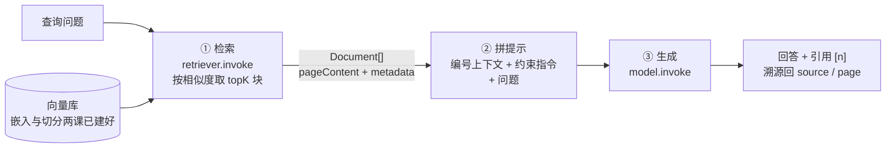

import { Canvas, Controls, Meta } from '@storybook/addon-docs/blocks';
import * as Rag from './rag.stories';

<Meta of={Rag} name="Docs" />

# RAG

前两课把语料切好、嵌入、写进了向量库；本课把它接成完整的问答闭环。RAG（Retrieval-Augmented Generation，检索增强生成）按官方定义就是把两样东西拼进同一个提示：「combine a question with retrieved context in a prompt for an LLM」。本课只讲**固定管线**：检索、拼提示、生成三步的顺序与触发都写死在代码里，每个问题都走同一条路——要不要检索、何时检索由 Agent 决定的做法归 [Agentic RAG](?path=/docs/agentic-rag--docs) 一课。总纲一句话：**检索命中决定回答的上限，提示与引用约束决定它是否可信。** 读完你应该能预测：topK 调小会发生什么、命中里没有答案时模型会怎么答、回答里的引用编号 `[1]` 是从哪来的。



关键输入与现状速查（接口与默认值已核对 `@langchain/core@1.2.14` 发布包源码）：

| 关键输入 | 默认值 / 现状 | 回查要点 |
| --- | --- | --- |
| `asRetriever(k)` 的 `k` | 不传为 `4` | 数字简写；对象形态可传 `k` / `filter` / `searchType` / `searchKwargs` |
| `searchType` | `'similarity'` | `'mmr'` 兼顾多样性，参数走 `searchKwargs`（`fetchK` / `lambda`） |
| `retriever.invoke(query)` | `string` → `Document[]` | 1.x 公开类上没有 `getRelevantDocuments`；另有 `batch` / `stream` |
| 上下文注入位置 | system 消息（本手册约定） | 上下文 + 指令进 system，问题进 user |
| 引用格式 | 提示约定，无专门 API | 编号上下文 `[n]` + 引用指令；可靠性靠核验 |
| 检索触发时机 | 每次回答必然检索 | 固定管线的定义；不由模型决定 |

## 快速上手

三步最小闭环：建库（沿用前两课的产物形态）→ 检索 → 拼提示 → 生成。检索和生成都要真的调 OpenAI 接口，需要 `OPENAI_API_KEY`（工程基础见[安装](?path=/docs/installation--docs)一课）：

```ts
// rag-minimal.ts —— 固定管线三步：检索 → 拼提示 → 生成。
// 运行条件：npm i @langchain/openai @langchain/core @langchain/classic dotenv；
// .env 写入 OPENAI_API_KEY=sk-...；npx tsx rag-minimal.ts。
import 'dotenv/config';
import { Document } from '@langchain/core/documents';
import { ChatPromptTemplate } from '@langchain/core/prompts';
import { ChatOpenAI, OpenAIEmbeddings } from '@langchain/openai';
import { MemoryVectorStore } from '@langchain/classic/vectorstores/memory';

// 语料：切分后的块（加载与切分归「文档加载与切分」，这里手工构造 3 块）
const vectorStore = await MemoryVectorStore.fromDocuments(
  [
    new Document({
      pageContent: '未拆封且不影响二次销售的商品，支持签收后 7 天内无理由退货。',
      metadata: { source: 'policy.md', page: 2 }, // 引用的溯源线索在加载阶段写入
    }),
    new Document({
      pageContent: '质量问题退货在仓库收到退货后 3 个工作日内全额退款，款项原路返回。',
      metadata: { source: 'policy.md', page: 3 },
    }),
    new Document({
      pageContent: '会员每消费 1 元累计 1 积分，积分可在下单时按 100 比 1 抵扣。',
      metadata: { source: 'benefits.md', page: 1 },
    }),
  ],
  new OpenAIEmbeddings({ model: 'text-embedding-3-small' }),
);

const question = '没拆封的东西能退吗';

// ① 检索：asRetriever 把向量库包成 Runnable；2 是 topK，不传默认 4
const retriever = vectorStore.asRetriever(2);
const docs = await retriever.invoke(question);

// ② 拼提示：块编号成上下文，与指令一起进 system，问题进 user
const context = docs
  .map(
    (doc, i) =>
      `[${i + 1}] ${doc.metadata.source} 第${doc.metadata.page} 页\n${doc.pageContent}`,
  )
  .join('\n\n');
const prompt = ChatPromptTemplate.fromMessages([
  ['system', '你是客服助手。只根据参考文档回答；未提及就明确说明；回答末尾标注引用编号。\n\n参考文档：\n{context}'],
  ['human', '{question}'],
]);
const messages = await prompt.invoke({ context, question });

// ③ 生成：prompt.invoke 的产物可直接喂给模型
const model = new ChatOpenAI({ model: 'gpt-4o-mini' });
const answer = await model.invoke(messages);
console.log(answer.content);
// 形如：可以。未拆封且不影响二次销售的商品支持签收后 7 天内无理由退货 [1]。
```

`retriever.invoke` 进、`Document[]` 出；`formatDocs` 把块变成编号文本；`model.invoke` 产出带引用编号的回答——三步各管一段，下面逐段拆开。

## RAG 解决什么问题

官方 RAG 教程给出的动机就是直接问模型为什么会失败：

- **知识不在权重里。** 要检索的往往是「private data, recent data, or data that is not part of the training data」——私有语料、新数据、训练截止之后的事实，模型参数里根本没有，问出来只能是猜。
- **回答不锚定事实源。** 直接问模型的答案是「often plausible, sometimes wrong, and never grounded in your source of truth」——看起来合理、不保证正确、从不锚定你的事实源。RAG 把回答锚定在检索回来的语料上，错了能定位到是哪块语料的问题。
- **语料塞不进窗口。** 「you generally cannot just fit it all into the context window」——就算窗口够大，全量注入的 token 成本和「关键信息被淹没」的风险也不可接受，所以每次只检索最相关的一小部分注入。

一个常见追问：为什么不微调？微调教模型「怎么答」（风格、格式、领域语感），改不了「答什么事实」，语料更新还要重训；RAG 在推理时提供事实，语料一更新下次检索就生效。两者不互斥，事实型问答先用 RAG。

固定管线的「固定」意味着：三步顺序、每步参数、是否检索都不由模型决定。这是刻意的——问题域收敛（每个问题都要查同一批语料）时它比 Agent 便宜、快、行为可预测；代价是查询写死、检索必执行（分界判断见「与 Agent 结合」一节）。

## 检索器

官方对 retriever 的定义一句话：「an interface that returns documents given an unstructured query」——输入字符串、输出 `Document[]`。它比向量库更抽象一层：官方明确「a retriever does not need to be able to store documents, only to return (or retrieve) them」，所以 retriever 家族里除了向量库转出来的，还有 Kendra、Exa、Perplexity 这类「检索即服务」的集成。价值就在这层抽象：问答代码只面向 `invoke(query) -> Document[]`，检索的实现（向量、关键词、外部 API）可以整体替换。

### 从向量库获得

所有向量库都有 `asRetriever`（返回 `VectorStoreRetriever`），两种传参形态（已核对发布包源码）：

```ts
const retriever = vectorStore.asRetriever(2); // 数字简写：只设 topK

const retriever2 = vectorStore.asRetriever({ // 对象形态：全量参数
  k: 4,                    // 不传默认 4
  // filter: ...,          // 形态因实现而异，MemoryVectorStore 是函数（见嵌入一课）
  searchType: 'similarity', // 默认；'mmr' 平衡相关性与多样性
  searchKwargs: { fetchK: 20 }, // 仅 mmr 生效：先取 fetchK 个再从中选多样的
});

// 官方教程的示例就是这个形态：
const retriever3 = vectorStore.asRetriever({
  searchType: 'mmr',
  searchKwargs: { fetchK: 1 },
});
```

### invoke 与 getRelevantDocuments 的现状

1.x 里 retriever 的公开调用入口是 **Runnable 标准方法**。发布包源码里 `BaseRetriever` 的类型是 `Runnable<string, DocumentInterface[]>`——这意味着：

- 单查用 `await retriever.invoke(query)`；
- 多查用 `await retriever.batch([q1, q2])`（官方教程原例：一次批量问「When was Nike incorporated?」和「What was Nike's revenue in 2023?」两个问题）；
- 作为 Runnable 还能 `.pipe()` 进链、被并发调度，这是把检索交给框架的入口。

`getRelevantDocuments` 是 **0.x 的公开方法，1.x 的公开类上已经没有了**：源码里只剩 `_getRelevantDocuments`——带下划线的子类实现钩子（自定义 retriever 时重写它），不是给你调用的。官方 JS 文档的示例（语义检索教程、retriever 集成页）用的都是 `invoke` / `batch`。迁移对照：

```ts
await retriever.getRelevantDocuments(query); // 0.x 写法，1.x 报 not a function
await retriever.invoke(query);               // 1.x 写法
```

### topK 与命中质量

`k`（默认 4）是检索结果的截断位置：太小会漏掉回答需要的块（下一节的画布能直接看到），太大则把不相关的块也塞进上下文，挤占预算、稀释重点。要按分数排查命中质量时，用 `similaritySearchWithScore` 拿 `[Document, score][]`（分数方向与实现相关，见[嵌入与向量库](?path=/docs/embeddings-vector-stores--docs)一课）。

## 提示组装

检索拿到的是「块」，模型需要的是「带着使用说明的上下文」。组装做三件事：**格式化块、放进正确的位置、配上约束指令**。

### 上下文格式化

把 `Document[]` 变成编号文本块——编号是一切的地基：

```ts
import type { Document } from '@langchain/core/documents';

function formatDocs(docs: Document[]): string {
  return docs
    .map(
      (doc, i) =>
        `[${i + 1}] ${doc.metadata.source} 第${doc.metadata.page} 页\n${doc.pageContent}`,
    )
    .join('\n\n');
}
```

两个设计点：

- **编号 `[n]` 按命中顺序排**，回答里的引用就对得上号；没有编号的上下文无法可靠引用，也无法核验。
- **来源标注跟编号一起放块头**：模型引用时看得到来源，展示层也能直接渲染「来自 policy.md 第 2 页」。`source` / `page`（以及切分追加的 `loc.lines` 行号）都是[文档加载与切分](?path=/docs/document-processing--docs)一课在加载阶段写进 metadata 的——这里只是消费。

### 注入位置

上下文和指令放 **system** 消息、问题放 **human** 消息，是本手册的约定（官方只要求 question 与 retrieved data 都出现在提示里，位置是实践选择）。好处：指令紧贴上下文、角色清晰，多轮对话里问题在变而「参考文档」的框架保持稳定。模板用 `ChatPromptTemplate`（`@langchain/core/prompts`）：

```ts
const prompt = ChatPromptTemplate.fromMessages([
  ['system', '你是客服助手。只根据参考文档回答；未提及就明确说明；回答末尾标注引用编号。\n\n参考文档：\n{context}'],
  ['human', '{question}'],
]);
const messages = await prompt.invoke({ context, question });
// messages 是 ChatPromptValue，可直接传给 model.invoke（模型合法输入类型之一）
```

### 约束指令三件套

指令里真正起作用的是三句话，缺一不可：

1. **只根据参考文档回答**——压制模型用训练知识作答的倾向；
2. **未提及就明确说明**——设计「检索不到」时的兜底出口，宁可说「文档中未提及」也不许编；
3. **回答末尾标注引用编号**——为核验与来源展示铺路（下一节）。

预算提醒：注入量约等于 `k × 块长`（块长由[切分参数](?path=/docs/document-processing--docs)决定）。上下文越长，关键块被淹没的风险越高——k 不是越大越安全。

## 带引用回答

引用不是哪个库函数吐出来的，它是**metadata + 提示约定**的组合产物。溯源链是完整的一条线：

> 加载时写入 metadata（`source` / `page`）→ 切分浅拷贝继承到每个块 → 检索原样带回 → 块头展示 `[n] 来源` → 模型按指令引用 `[n]` → 编号映射回 metadata → 读者能点开原文核对。

这条链上任何一环缺失，引用就断：加载阶段没写 `source`，模型想引也没东西可引；上下文没编号，引用对不上号；提示没约束，模型多半不标。官方 Deep Agents RAG 教程的做法同理——检索块落盘时在块头写 `# Source: ${doc.metadata.source}`，并要求最终回答带来源链接：引用的实现思路在官方与本课一致。

但要清楚：提示约束只是**请求**，不是保证。模型可能标出上下文里不存在的 `[5]`，或引用编号与论断对不上（引用幻觉）。两个加固动作：

```ts
// ① 生成后核验：回答里的编号必须在本次命中集合内
const validNumbers = new Set(docs.map((_, i) => i + 1));
// 解析 answer.content 中的 [n]，不在 validNumbers 里的引用判定为编造，删或修

// ② 硬保证：结构化输出把 cites 限成枚举（用法见「结构化输出」一课）
import { z } from 'zod';

const CitedAnswer = z.object({
  answer: z.string(),
  cites: z.array(z.number().int().min(1).max(docs.length)), // 只允许 1..k
});
const structured = await model
  .withStructuredOutput(CitedAnswer)
  .invoke(messages);
```

核验是底线（任何模型都该做），结构化输出是强约束（关键场景再加一层）。

## 管线数据流

三步连起来看一遍。下面的实例用预置语料（8 块政策手册）加预置分数**确定性模拟**一次查询经过固定管线的全过程：① 检索命中（按分数排序、topK 截断）→ ② 拼装后的完整提示预览 → ③ 模拟回答与引用。分数、回答、引用全部由预置数据按规则推导，不调用嵌入模型与 LLM：

<Canvas of={Rag.Interactive} />
<Controls of={Rag.Interactive} />

| 读者操作 | 可观察证据 |
| --- | --- |
| 保持「海外购的退款要多久到账」+ topK 4 | 回答同时引用 `[1]` `[2]`（policy.md 第 3、5 页），状态「完整回答」——答案本来就需要两块拼起来（画布实测，下同） |
| topK 调到 1 | ② 提示预览只剩一个上下文块；③ 退化为「部分回答 · 缺块」，答案缺了「长约 10 个工作日」那半边——需要的块被截在 topK 外 |
| topK 调到 3 或更大 | shipping.md 第 4 页（跨境配送时效，与退款无关）挤进上下文——k 换召回的代价是噪声块进入提示，调到 6 时噪声更多 |
| 切到「未拆封的商品可以退货吗」 | 单块就够支撑完整回答；多余命中块只消耗 token，不改变引用 |
| 切到「可以用数字货币支付吗」 | 排序照样产生第一名（0.13），但引用为「无」、状态「兜底：文档未提及」——分数绝对值本身是相关性信号，别只看相对排序（与嵌入一课结论一致） |
| 底部读数 | 进入上下文的块数、top1 分数、引用编号、回答状态随参数同步更新 |

打开 Show code 可看到该 Canvas 实际执行的 `example.ts`：核心是 `CORPUS` / `QUERIES` 预置数据与 `runPipeline` 的排序、截断、兜底规则，可在浏览器外独立核对。

## 检索质量排查

RAG 答错的第一嫌疑不是模型。管线三层——检索、提示、生成——**逆向排查，离错误表现最近的一层先查**：

1. **先打印检索命中。** `console.log(await retriever.invoke(question))`（要分数就用 `similaritySearchWithScore`）。命中里没有答案 → 问题在检索层或语料层，直接跳第 4 步，别动提示和模型——命中不对时换再强的模型也无力回天。
2. **再打印拼装后的提示。** 命中对但回答绕开文档，看 `console.log(context)` 与完整 messages：上下文是否太长把关键块淹没（topK=6 的画布现象）、编号与来源是否清晰、指令是否被用户问题的相反措辞压过。
3. **提示正确仍答错或编引用。** 才是模型层：换更强模型、加引用核验、上结构化输出。
4. **检索层内部由近及远：** topK 太小 → 先调大 `k` 试一次；查询表述与语料措辞差距大（语义鸿沟）→ 换个问法验证，系统解法是查询重写，归 [Agentic RAG](?path=/docs/agentic-rag--docs)；命中块粒度不对（块太杂或碎）→ 切分参数，见[文档加载与切分](?path=/docs/document-processing--docs)；分数整体偏低 → 嵌入模型与同模型原则，见[嵌入与向量库](?path=/docs/embeddings-vector-stores--docs)。

| 症状 | 先查哪层 | 判断依据 |
| --- | --- | --- |
| 回答内容错误 | 检索命中（第 1 步） | 命中不含答案时，生成端只能编 |
| 命中对但回答绕开文档 | 拼装后的提示（第 2 步） | 指令弱或上下文淹没 |
| 引用编号对不上内容 | 引用核验 | 回答编号 ⊄ 命中编号集合 |
| 命中不含答案 | topK → 查询表述 → 切分 → 嵌入（第 4 步） | 由近及远逐层收窄 |

全链路的输入输出观测（每步耗时、token、命中列表）用 LangSmith 追踪，见[LangSmith 追踪](?path=/docs/langsmith-observability--docs)一课。

## 与 Agent 结合

什么时候固定管线够用、什么时候把检索交给 Agent？判断标准是**问题的形状**：

- 问题域收敛、每个问题都要查同一批语料、答案一步可得 → **固定管线**（本课）：检索先行、上下文注入，便宜、快、行为可预测。
- 任务混合（有的问题不需要检索）、需要多跳（A 的答案决定去查 B）、需要模型改写查询再查 → **检索工具化**，归 [Agentic RAG](?path=/docs/agentic-rag--docs)。

固定管线接到 [createAgent](?path=/docs/first-agent--docs) 上的形态是**上下文注入**：调用方先检索，把编号上下文拼进 systemPrompt，Agent 的工具留给真正的业务动作：

```ts
// 运行条件：同快速上手，另需 npm i langchain zod（createAgent 的组装见「第一个 Agent」一课）
import { createAgent } from 'langchain';
import { HumanMessage } from '@langchain/core/messages';

const docs = await retriever.invoke(question); // 调用方负责检索——固定在这里

const agent = createAgent({
  model: 'openai:gpt-4o-mini',
  tools: [/* 业务工具，如查订单状态；检索不在工具里 */],
  systemPrompt: `你是客服助手。只根据参考文档回答，未提及就明确说明，回答末尾标注引用编号。

参考文档：
${formatDocs(docs)}`,
});
const result = await agent.invoke({
  messages: [new HumanMessage(question)],
});
```

要点：上下文**随每个问题重新检索注入**（谁调用谁负责），检索不是 Agent 的工具——模型既不决定「查不查」，也看不到检索动作本身。把检索包成 `tool()`、让模型决定何时检索与如何重写查询，以及 Deep Agents RAG 教程的「检索-卸载-委托」模式（检索块写入文件系统、子代理逐块分析再汇总），都归 [Agentic RAG](?path=/docs/agentic-rag--docs) 一课。

## 最佳实践

- **先打印命中，再调模型。** 检索命中决定回答上限；提示与模型只能约束「不编造」，补救不了「没检到」。任何 RAG 调优从 `console.log` 命中列表开始。
- **编号与引用指令成对出现。** 只编号不指令，模型不标引用；只指令不编号，引用无从落点。块头同时带 `[n]` 与 source/page。
- **k 从默认 4 起步，按命中质量调。** 用大 k 换召回不如先修查询表述与切分粒度——画布里 topK=6 的噪声块就是代价的直接展示。
- **无命中兜底显式设计。** 指令层要求「未提及就明说」，代码层检测 `cites` 为空时走引导语或人工，两条腿都要。
- **上下文格式全库统一。** 编号、来源标注、分隔符一旦定死就别混用第二种格式——引用核验依赖编号语义稳定。
- **metadata 在加载阶段写全。** `source` / `page` / `loc.lines` 决定引用能否溯源、检索能否过滤；入库后补字段等于重灌整个库（见文档加载与切分一课）。

## 常见问题

- **调用 `retriever.getRelevantDocuments(query)` 报 not a function。**
  0.x 遗留写法。1.x 的 `BaseRetriever` 公开方法就是 Runnable 的 `invoke` / `batch` 等（已核对 1.2.14 发布包），`_getRelevantDocuments` 是子类实现钩子。改成 `await retriever.invoke(query)`。
- **回答带着引用编号，但编号指向的内容和论断对不上，或标了不存在的编号。**
  引用幻觉：提示约束只是请求不是保证。生成后把回答中的 `[n]` 与本次命中编号集合核验，不在集合内的判定为编造；需要硬保证时用 `withStructuredOutput` 把 `cites` 限成 1..k 的枚举（见结构化输出一课）。
- **明明检索命中了，模型却说「文档中未提及」。**
  依次看两样：拼装后的完整提示（上下文是否太长、关键块是否排在后面被淹没——topK=6 的画布展示了噪声挤占的效果）和指令强度（system 明写「只根据参考文档回答」并紧贴上下文）。处理：减小 k、收紧指令、块头带来源。
- **模型用训练知识回答，完全不引用文档。**
  指令不够硬。三件套写全（只根据文档 / 未提及就明说 / 标注引用编号），上下文与指令放 system、问题放 human；仍不服从就换更强的模型——弱模型更难顶住自身参数里的「记忆」。
- **想要「这句话来自哪个文件第几页」，现在只有笼统文本。**
  两个前置没做全：上下文块头没带 source/page（模型看不到来源），或提示没要求标注引用。`formatDocs` 的块头标注与引用指令成对补上。
- **检索时好时坏，同一问题忽对忽错。**
  先确认写入与查询用同一个嵌入模型与同一份维度参数（混存会静默变差，见嵌入一课）；再看查询措辞与语料措辞的差距——语义检索不是关键词匹配，但极端表述差距仍会漏；系统解法（查询重写、多轮检索）归 Agentic RAG 一课。

## 总结回顾

摘要：

RAG 把模型不知道的知识从训练权重搬进推理时上下文，解决知识不在权重里、回答不锚定事实源、语料塞不进窗口三个问题。固定管线三步：检索用 `retriever.invoke(query)` 拿 topK 块——retriever 由 `vectorStore.asRetriever(k | { k, filter, searchType, searchKwargs })` 包装，默认 k=4、searchType 'similarity'，1.x 公开调用入口是 Runnable 的 invoke/batch，`getRelevantDocuments` 已移除；拼提示用 `formatDocs` 把块编成带来源的编号上下文，连同三件套指令（只根据文档 / 未提及就明说 / 标注引用）放进 system，问题放 human；生成端产出带 `[n]` 引用的回答，引用的本质是 metadata + 提示约定，可靠性靠生成后核验与结构化输出加固。质量排查逆向走：先打印命中，再打印提示，最后才怀疑模型；命中不对时在检索层内由近及远查 topK、查询表述、切分、嵌入。与 Agent 的结合里，固定管线对应上下文注入，检索工具化归 Agentic RAG。

一句话：

> 检索命中决定回答的上限，提示与引用约束决定它是否可信——验证 RAG 从打印命中开始，而不是从换模型开始。

知识要点：

- RAG 解决哪三个问题？为什么不把语料全部塞进上下文窗口？
- 固定管线三步各自的输入和输出是什么？「固定」体现在哪？
- `asRetriever` 的两种传参形态是什么？`k` 与 `searchType` 的默认值各是多少？
- 1.x 里怎么调用 retriever？`getRelevantDocuments` 的现状是什么？
- 上下文块为什么要编号？块头为什么同时标注 source 与 page？
- 上下文注入位置的本手册约定是什么？约束指令三件套是哪三句？
- 引用是怎么实现的？为什么说它是「metadata + 提示约定」？
- 引用幻觉怎么核验？想硬保证用什么手段？
- 召回不对时，排查的前两步各打印什么？检索层内部按什么顺序收窄？
- 固定管线与检索工具化的分界判断是什么？上下文注入时谁负责检索？

## 参考资料

- [Build a semantic search engine（LangChain.js 官方教程：入库、similaritySearch、asRetriever、retriever.batch、metadata 溯源）](https://docs.langchain.com/oss/javascript/langchain/knowledge-base)
- [Retriever 集成总览（官方：retriever 定义、「不必存储只要返回」、非向量库家族）](https://docs.langchain.com/oss/javascript/integrations/retrievers/index)
- [RAG with Deep Agents（官方 RAG 教程：RAG 定义与动机原句、retrieve/generate 两步、`# Source:` 引用约定）](https://docs.langchain.com/oss/javascript/deepagents/rag)
- [langchainjs 仓库 @langchain/core retrievers 源码（BaseRetriever 接口现状与 `_getRelevantDocuments` 钩子）](https://github.com/langchain-ai/langchainjs/tree/main/libs/langchain-core/src/retrievers)
- [langchainjs 仓库 @langchain/core vectorstores 源码（VectorStoreRetriever 默认 k=4、searchType、asRetriever 传参）](https://github.com/langchain-ai/langchainjs/tree/main/libs/langchain-core/src/vectorstores)
- [JS API 参考（retriever 与 ChatPromptTemplate 类型回查）](https://reference.langchain.com/)
