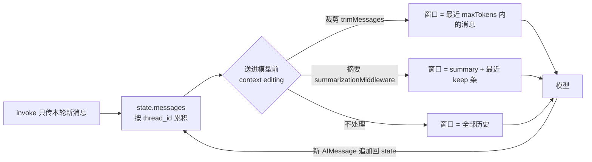

import { Canvas, Controls, Meta } from '@storybook/addon-docs/blocks';
import * as ShortTermMemory from './short-term-memory.stories';

<Meta of={ShortTermMemory} name="Docs" />

# 短期记忆

短期记忆是一个 thread（一段会话）内的消息历史：`createAgent` 的 state 里有一个 `messages` 列表，配上 `checkpointer` 之后，它随每次 `invoke` 累积，凭同一个 `thread_id` 就能接上之前的对话。历史一长，三个问题随之而来——超出模型上下文窗口、token 成本随轮次线性上涨、过长的历史稀释注意力让回答变差。解法是在把历史送进模型之前做 context editing：裁剪（丢掉旧消息换空间）或摘要（把旧消息压缩成一条 summary 换信息保留）。读完本课，你应该能预测：换一个 `thread_id` 会发生什么、把 `maxTokens` 或 `trigger.tokens` 调小会发生什么、以及两种策略下模型分别还能不能「记得 Bob」。



| 关键输入 | 默认 | 回查要点 |
| --- | --- | --- |
| `checkpointer` | 不传则无跨轮记忆 | `MemorySaver` 存进程内存，重启即失；生产换数据库版（「持久化」一课） |
| `thread_id` | 挂 checkpointer 后必须给 | 放在第二参数 `configurable` 里；同 id 共享历史，不同 id 互不可见 |
| `trimMessages.maxTokens` | 必填 | 窗口 token 上限 |
| `trimMessages.tokenCounter` | 必填 | 计数函数或模型实例；不传会报错，没有隐式默认 |
| `trimMessages.strategy` | `"last"` | `"last"` 保最新、`"first"` 保最旧 |
| `trimMessages.startOn` / `endOn` | 不设 | 窗口首尾的消息类型对齐，避免孤儿消息 |
| `trimMessages.includeSystem` | `false` | `"last"` 策略下是否保留首条 SystemMessage |
| `summarizationMiddleware.trigger` | 不设则永不触发 | `{ tokens }` / `{ messages }` / `{ fraction }`，单对象内 AND、数组间 OR |
| `summarizationMiddleware.keep` | `{ messages: 20 }` | 触发后原样保留的最近消息数（或 token / fraction） |
| `summarizationMiddleware.trimTokensToSummarize` | `4000` | 待摘内容超长时先裁到该长度再摘 |

## 快速上手

沿用「第一个 Agent」一课的工程（依赖 `langchain`、`@langchain/openai`、`dotenv`），在 `.env` 里配置 `OPENAI_API_KEY`，把下面的代码存成 `memory.ts`，用 `npx tsx memory.ts` 运行：

```ts
// memory.ts —— 带短期记忆的最小多轮对话
// 运行条件：OPENAI_API_KEY 已写入 .env；npx tsx memory.ts 运行。
import 'dotenv/config';
import { ChatOpenAI } from '@langchain/openai';
import { createAgent } from 'langchain';
import { MemorySaver } from '@langchain/langgraph';

const agent = createAgent({
  model: new ChatOpenAI({ model: 'gpt-4o-mini' }),
  // 挂上 checkpointer：state（含 messages）按 thread 存取
  checkpointer: new MemorySaver(),
});

// 同一个 thread_id = 同一段会话历史
const threadConfig = { configurable: { thread_id: 'demo' } };

async function main() {
  await agent.invoke(
    { messages: [{ role: 'user', content: '你好！我叫 Bob。' }] },
    threadConfig
  );

  // 第二次 invoke 只传新消息，历史由 checkpointer 按 thread_id 接上
  const result = await agent.invoke(
    { messages: [{ role: 'user', content: '我叫什么名字？' }] },
    threadConfig
  );

  console.log(result.messages.at(-1)?.content);
  // => 你叫 Bob。（措辞因模型而异）
}

main();
```

对比「第一个 Agent」一课的结论——不挂 `checkpointer` 时第二次 `invoke` 默认不记得上一轮——这里的差别只有两处：构造时多传 `checkpointer`，调用时多传同一个 `thread_id`。这就是短期记忆的最小闭环。

## 多轮对话与 thread_id

短期记忆的存储介质是 agent state 里的 `messages` 列表：每次 `invoke` 你只传本轮的新消息，运行环境把它们合并进该 thread 已有的历史（新消息按 id 追加，同 id 的消息覆盖旧的），模型每次都看到合并后的全量列表。也因此，挂了 `checkpointer` 之后 `result.messages` 不再只是本轮的一问一答，而是这个 thread 从头到现在的全部消息——取最终答案仍然用 `result.messages.at(-1)?.content`。

两个常用细节：

- 输入可以写成字符串简写：`agent.invoke({ messages: '我叫什么名字？' }, threadConfig)` 等价于一条用户消息。
- 消息类型系统（HumanMessage / AIMessage / ToolMessage 与 `role` 写法的对应）见「模型与消息」一课；本课只关心「列表在增长」这一件事。

`tester/chat.test.ts` 是同一机制的裸图写法：`StateGraph` + `MessagesAnnotation` + `MemorySaver`，用 `uuid` 生成 `thread_id` 隔离测试用例。`createAgent` 只是把这套挂载包好了。

### thread_id：会话的边界

thread 的语义类似邮件里的一封对话：同一个 `thread_id` 的所有 `invoke` 共享一段历史，不同 `thread_id` 之间互不可见。换一个 id，就是开了一段新会话：

```ts
// 换一个 thread_id：历史从空开始
const other = { configurable: { thread_id: 'another-demo' } };
const r = await agent.invoke(
  { messages: [{ role: 'user', content: '我叫什么名字？' }] },
  other
);
// => 模型不知道 Bob——它看到的历史里没有第一轮
```

`thread_id` 的常见取法是「每个用户的每段会话一个」（首次进入时生成 uuid 存进会话记录）。两个边界：`MemorySaver` 只存进程内存，重启即失，生产环境要换成 `PostgresSaver.fromConnString(...)` 这类数据库 checkpointer，选型与快照机制归「持久化」一课；想让模型记住跨会话的信息（「这位用户总是喜欢简短回复」），thread 内的 messages 帮不上忙，那是跨 thread 的长期记忆（Store），归「长期记忆与 Store」一课。

## 裁剪与摘要

历史无界增长要付三笔钱：模型上下文窗口有上限、token 成本按轮次线性上涨、超长历史让模型抓不住重点。context editing 就是决定「模型这次实际看到哪些消息」，官方给了三条路：

| 策略 | 做什么 | 换来 | 代价 |
| --- | --- | --- | --- |
| 裁剪 `trimMessages` | 按 token 预算保留最近（或最旧）的消息 | 零额外调用，窗口可控 | 被裁内容对模型彻底不可见 |
| 摘要 `summarizationMiddleware` | 达到触发线后，把旧消息压缩成一条 summary | 关键信息保留在 summary 里 | 每次触发多一次模型调用，质量依赖摘要提示词 |
| 删除 `RemoveMessage` | 按消息 id 从 state 永久移除 | state 真正变小（长期成本也降） | 永久丢失，无法找回 |

无论哪条路，都有两条有效历史的硬约束：部分提供方要求历史以 `user` 消息开头；`tool` 结果消息必须跟在带 `tool_calls` 的 assistant 消息之后。裁剪窗口的两端、删除的范围都可能撞上它们。

下面的实例用同一份多轮消息历史（第 1 条含姓名）做确定性模拟，对照前两种策略在 token 预算下的窗口差异：

<Canvas of={ShortTermMemory.Interactive} />
<Controls of={ShortTermMemory.Interactive} />

| 读者操作 | 可观察证据 |
| --- | --- |
| 调小「token 预算」 | 裁剪栏从尾部收缩，含姓名的第 1 条被标「裁掉」，栏头「姓名」徽标变红；摘要栏达到触发线后把旧消息压成一条 summary，姓名徽标保持绿色 |
| 调大「token 预算」超过历史总量 | 两栏都完整保留：裁剪装得下就不裁，摘要未达触发线不动历史（栏头提示「未触发」） |
| 减小「对话轮数」 | 历史变短，同样的预算下两栏都不再修改历史 |
| 调整「摘要保留消息数」 | 摘要栏保留区与被压缩区的分界移动，summary 始终在窗口最前 |
| 打开 Show code | 看到该 Canvas 实际执行的 `example.ts`：纯 TS 确定性模拟，不依赖 `@langchain/*` |

两条结论都从这个对照里长出来：裁剪保住了「最近的上下文」但保不住「被推出去的关键信息」；摘要多花一次模型调用，把关键信息换成一条很小的 summary 留在窗口里。

### 裁剪 trimMessages

`trimMessages` 是 `@langchain/core/messages` 的纯函数（`langchain` 包也转出口）：输入消息列表和 token 预算，返回应该保留的子列表，本身不改任何 state。先看一个不需要 API key 的算例：

```ts
// trim-demo.ts —— 纯函数算例，不需要 API key；npx tsx trim-demo.ts 运行。
import {
  AIMessage,
  BaseMessage,
  HumanMessage,
  trimMessages,
} from '@langchain/core/messages';

const messages = [
  new HumanMessage({ content: 'Hi! My name is Bob.', id: 'm1' }),
  new AIMessage({ content: 'Hi Bob! Nice to meet you.', id: 'm2' }),
  new HumanMessage({ content: 'Write a short poem about my cat.', id: 'm3' }),
  new AIMessage({ content: 'Soft paws, warm heart…', id: 'm4' }),
  new HumanMessage({ content: 'Now translate it to Chinese.', id: 'm5' }),
];

// 4 字符 ≈ 1 token 的近似计数（与内置 countTokensApproximately 同思路）
const approxTokens = (msgs: BaseMessage[]) =>
  msgs.reduce((n, m) => n + Math.ceil(String(m.content).length / 4), 0);

async function main() {
  const kept = await trimMessages(messages, {
    maxTokens: 14,
    strategy: 'last', // 保留最新
    startOn: 'human', // 窗口从用户消息开始
    tokenCounter: approxTokens,
  });

  console.log(kept.map((m) => m.id));
  // => ['m3', 'm4', 'm5']
  // 预算内先装下 m4 + m5（约 13 token）；
  // startOn: 'human' 把窗口起点对齐回 m3——对齐可能让窗口略超预算。
}

main();
```

参数速查：

| 参数 | 说明 |
| --- | --- |
| `maxTokens` | 窗口 token 上限，必填 |
| `tokenCounter` | 计数函数或模型实例（用模型的 `getNumTokens`），必填；追求精确时直接传模型实例 |
| `strategy` | `"last"`（默认）从尾部保留；`"first"` 从头部保留 |
| `startOn` / `endOn` | 窗口第一条 / 最后一条必须是的消息类型（`"human"`、`"ai"`、`"tool"` 等，可数组）；`startOn` 仅 `"last"` 策略有效 |
| `includeSystem` | `"last"` 策略下是否无条件保留下标 0 的 SystemMessage，默认 `false` |
| `allowPartial` / `textSplitter` | 是否允许切半条消息（默认 `false`），以及切分器 |

真实 Agent 里通常不手写 `trimMessages` 的调用循环，而是把它挂成「每次调用模型前」的中间件——这是官方文档的标准模式：

```ts
import { createMiddleware, trimMessages } from 'langchain';
import { RemoveMessage } from '@langchain/core/messages';
import { REMOVE_ALL_MESSAGES } from '@langchain/langgraph';

const trimWindow = createMiddleware({
  name: 'TrimWindow',
  beforeModel: async (state) => {
    const window = await trimMessages(state.messages, {
      maxTokens: 2000,
      strategy: 'last',
      startOn: 'human', // 防止窗口从 ai 消息开始（部分提供方要求 user 开头）
      endOn: ['human', 'tool'], // 防止窗口停在悬空的 tool_calls 上
      tokenCounter: (msgs) =>
        msgs.reduce((n, m) => n + Math.ceil(String(m.content).length / 4), 0),
    });
    // 清空后按裁剪结果重写历史
    return {
      messages: [new RemoveMessage({ id: REMOVE_ALL_MESSAGES }), ...window],
    };
  },
});

// const agent = createAgent({ model, checkpointer, middleware: [trimWindow] });
```

`beforeModel` 的挂载机制、执行顺序与自定义中间件的写法归「中间件」一课；这里只需要知道它每次调用模型前跑一次，返回值是对 state 的更新。上面的写法会把裁剪结果写回 state（历史真的变短了）；只想影响本次模型输入、不动 state 时，用 `wrapModelCall` 改 `request.messages`，同样见「中间件」一课。

### 摘要 summarizationMiddleware

`summarizationMiddleware` 是 `langchain` 的预置中间件，它把「监控 token → 压缩旧消息 → 重写历史」整件事包好了：

```ts
// summary-agent.ts —— 摘要式短期记忆
// 运行条件：OPENAI_API_KEY 已写入 .env；npx tsx summary-agent.ts 运行。
import 'dotenv/config';
import { ChatOpenAI } from '@langchain/openai';
import { createAgent, summarizationMiddleware } from 'langchain';
import { MemorySaver } from '@langchain/langgraph';

const agent = createAgent({
  model: new ChatOpenAI({ model: 'gpt-4o-mini' }),
  checkpointer: new MemorySaver(),
  middleware: [
    summarizationMiddleware({
      // 用哪个模型做摘要（可与主模型不同，通常选便宜的小模型）
      model: new ChatOpenAI({ model: 'gpt-4o-mini' }),
      trigger: { tokens: 400 }, // 演示用小阈值；线上按模型窗口设置
      keep: { messages: 2 }, // 触发后原样保留最近 2 条
    }),
  ],
});

const threadConfig = { configurable: { thread_id: 'summary-demo' } };

async function main() {
  await agent.invoke(
    { messages: '你好！我叫 Bob，我养了一只猫叫 Mochi。' },
    threadConfig
  );
  await agent.invoke({ messages: '帮我写一首关于 Mochi 的短诗。' }, threadConfig);
  await agent.invoke({ messages: '再把它翻译成英文。' }, threadConfig);

  // 前面的历史此时已被压缩成一条 summary，但关键信息仍在
  const result = await agent.invoke({ messages: '我叫什么名字？' }, threadConfig);
  console.log(result.messages.at(-1)?.content);
  // => 你叫 Bob。（措辞因模型而异）
}

main();
```

工作机制：中间件在每次调用模型前统计全部历史 token，达到 `trigger` 后，保留最近 `keep` 条，把更早的消息发给摘要模型，压缩成一条以 `Here is a summary of the conversation to date:` 开头的消息（作为用户消息进入历史），再用 `RemoveMessage(REMOVE_ALL_MESSAGES)` + summary + 保留消息重写 `messages`。切分保留边界时会自动避免拆散「带 `tool_calls` 的 AI 消息 + 对应 ToolMessage」组合。`createAgent` 的 `systemPrompt` 不在 `messages` 里，不会被摘要吞掉。

参数速查：

| 参数 | 默认 | 说明 |
| --- | --- | --- |
| `model` | 必填 | 做摘要的模型，字符串 `"openai:gpt-4o-mini"` 或实例 |
| `trigger` | 不设则永不触发 | 单对象内多条件 AND；传数组则数组间 OR，任一满足即触发 |
| `keep` | `{ messages: 20 }` | 保留最近多少条（或 `{ tokens }` / `{ fraction }`，三选一） |
| `tokenCounter` | `countTokensApproximately` | 近似计数按 4 字符 ≈ 1 token，对中文明显低估，预算敏感时换模型自带计数 |
| `summaryPrompt` | 内置提示词 | 传给摘要模型的指令，可用 `{messages}` 占位符注入待摘内容 |
| `summaryPrefix` | `"Here is a summary of the conversation to date:"` | summary 消息的固定前缀 |
| `trimTokensToSummarize` | `4000` | 待摘内容超过该长度时先裁到该长度再摘 |

一个不直观但真实的边界：`keep` 按消息条数判断保留区，**消息总数不超过 `keep` 时（默认 20 条），即使 token 已超过触发线也不会摘要**——此时要么调小 `keep`，要么把触发条件换成 `{ tokens }` 并接受「短历史不压缩」。

### 直接删消息

`RemoveMessage({ id })` 是 `messages` 状态的删除指令：按消息 id 从 state 里永久移除（官方文档的例子把它挂在 `afterModel`，模型答完后清掉最早两条）：

```ts
import { createMiddleware } from 'langchain';
import { RemoveMessage } from '@langchain/core/messages';

const deleteOld = createMiddleware({
  name: 'DeleteOldMessages',
  afterModel: (state) => {
    if (state.messages.length > 2) {
      // 按消息 id 永久删除最早两条
      return {
        messages: state.messages
          .slice(0, 2)
          .map((m) => new RemoveMessage({ id: m.id! })),
      };
    }
  },
});
```

官方例子运行后，模型随即忘了 Bob——删除改的是 state 本身，被删的消息再也找不回来。它适合「确定不再需要的历史」（例如已结算的中间工具输出）；配合特殊 id `REMOVE_ALL_MESSAGES`（来自 `@langchain/langgraph`）可以先清空整个列表再写回保留的消息，前面裁剪、摘要两小节的重写都用到了它。需要按名字、类型批量筛选而不是按位置删除时，同包的 `filterMessages` 更合适。

## 最佳实践

- 先判断值不值得保：闲聊、重复尝试这类低价值历史，裁掉即可；用户偏好、任务目标、已做的决定属于跨轮关键信息，用摘要保进 summary；确定永久不需要的（结算过的工具输出），删除让 state 真正变小。
- 预算留余量：`maxTokens` / `trigger.tokens` 要远小于模型上下文窗口——系统提示、工具 schema 和本轮回复都要占窗口；摘要的触发线要比裁剪的预算更早介入，给压缩留出时间。
- 摘要模型选便宜的小模型：摘要不需要主模型的能力，`model` 传 `gpt-4o-mini` 这一级即可；对摘要侧写不满意时先调 `summaryPrompt`，再考虑换模型。
- 裁剪参数用稳妥组合：`strategy: "last"` + `startOn: "human"` + `endOn: ["human", "tool"]` 同时避开「历史不以 user 开头」和「tool 结果悬空」两类提供方校验错误。
- `thread_id` 按「用户 × 会话」粒度生成：粒度太粗（全站一个 id）历史互相污染，太细（每次 invoke 一个 id）等于没有记忆。

## 常见问题

- 第二次 `invoke` 模型还是忘了上一轮
  依次检查三处：`createAgent` 是否传了 `checkpointer`；两次 `invoke` 的第二参数是否带同一个 `thread_id`；服务是否重启过（`MemorySaver` 只存进程内存，重启即失，生产换数据库 checkpointer，见「持久化」一课）。
- 启动调用就报 `Checkpointer requires one or more of the following "configurable" keys: "thread_id"`
  挂了 `checkpointer` 的 agent，`invoke` 必须给第二参数：`{ configurable: { thread_id: '...' } }`。
- 配了 `summarizationMiddleware` 但从不触发
  三种可能：没配 `trigger`（不设就永不触发）；消息总数没超过 `keep`（默认 `{ messages: 20 }`，条数不够时 token 再多也不摘）；`tokenCounter` 低估——内置近似计数按 4 字符 ≈ 1 token，中文通常 1 字就接近 1 token，历史「看起来很长」但计数不到线。
- 裁剪或删除之后，模型调用报 400（提供方校验失败，如 history 必须以 user 开头、tool 消息找不到对应的 tool_calls）
  裁剪加 `startOn: 'human'`、`endOn: ['human', 'tool']` 对齐窗口两端；删除时避开「带 `tool_calls` 的 AI 消息 + 其 ToolMessage」组合，摘要中间件内置的边界保护可以参考。
- 想让模型在新会话里也记得用户信息（换个 `thread_id` 就丢）
  这是设计行为：短期记忆只到 thread 边界。跨 thread 的记忆用 Store 按命名空间读写，见「长期记忆与 Store」一课。

## 总结回顾

摘要：

短期记忆是 thread 内的 `messages` 状态：`checkpointer` 让它跨 `invoke` 存活，`thread_id` 划定会话边界，同 id 共享、不同 id 隔离、`MemorySaver` 随进程存亡。历史超预算时在送模型前做 context editing：`trimMessages` 是纯函数，按 `maxTokens` 预算和 `strategy` / `startOn` / `endOn` 规则保留子集，官方模式是用 `beforeModel` 中间件配合 `REMOVE_ALL_MESSAGES` 重写历史；`summarizationMiddleware` 在 token 达到 `trigger` 后把旧消息压成一条 summary 并保留最近 `keep` 条，多花一次模型调用换来关键信息不丢；`RemoveMessage` 按 id 永久删除，让 state 真正变小。被裁的信息彻底不可见、被摘的信息留在 summary 里、被删的信息无法找回——三种代价决定选哪种。

一句话：

> 短期记忆就是 thread 内累积的 `messages` 状态：`checkpointer` 按 `thread_id` 存取，历史超预算时，用裁剪换空间，或用摘要换信息保留。

知识要点：

- `createAgent` 具备跨轮记忆需要补哪两个输入，各放在哪里？
- 同一个与不同的 `thread_id` 下，第二次 `invoke` 的模型分别看到什么？
- `trimMessages` 的 `strategy` / `startOn` / `endOn` / `includeSystem` 分别控制窗口的什么？
- `summarizationMiddleware` 的 `trigger` 何时触发（单对象与数组的与或语义）？`keep` 默认保留什么？
- 为什么消息数不超过 `keep` 时即使 token 超线也不摘要？
- 裁剪、摘要、删除三种策略各自的代价是什么？
- 摘要触发后，`messages` 里发生了一次怎样的重写？

## 参考资料

- [LangChain.js Short-term memory（官方：短期记忆与裁剪/摘要/删除模式）](https://docs.langchain.com/oss/javascript/langchain/short-term-memory)
- [LangChain Memory 概念（官方：短期/长期记忆分界与 thread 定义）](https://docs.langchain.com/oss/javascript/concepts/memory)
