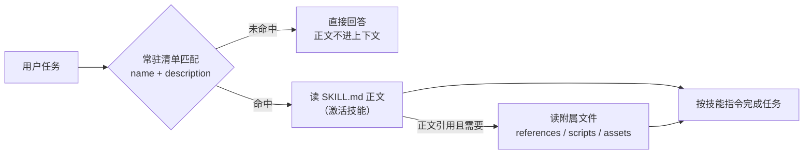

import { Canvas, Controls, Meta } from '@storybook/addon-docs/blocks';
import * as Skills from './skills.stories';

<Meta of={Skills} name="Docs" />

# 技能

本课是「多智能体」主题组的收尾，回答四个问题：技能是什么（把「如何做某类任务」的知识打包成目录 + SKILL.md，按需加载而不是塞满系统提示）、渐进式披露的层级怎么分工（名字和描述常驻，用到才读正文，再按需读附属文件）、SKILL.md 和技能目录怎么写、在 LangChain JS 里怎么加载挂载。控制权维度上它与前两课互补：子代理拆上下文、移交转控制权，而技能全程不换 agent——它改变的是**知识进入上下文的方式**这个维度。读完你应该能预测：一个任务进来会触发哪一级加载、付多少 token，以及描述写得差的技能为什么会一直沉默。顺带一提：本手册的每一节课程，正是由一份 SKILL.md 驱动生成的——你在本课学的机制，正在本课的发生现场运行。



| 层级 | 加载内容 | 何时加载 | 谁决定 | 量级参考 |
| --- | --- | --- | --- | --- |
| 1 常驻元数据 | frontmatter 的 `name` + `description` | 启动时注入系统提示，覆盖全部技能 | 挂载层代码（中间件 / harness） | 约 100 token / 技能 |
| 2 技能正文 | `SKILL.md` 正文（指令、schema、示例） | 技能被激活时 | 模型（匹配描述后发起加载） | 建议低于 5000 token |
| 3 附属文件 | `scripts/`、`references/`、`assets/` 里的文件 | 正文引用且任务需要时 | 模型（按引用路径读取） | 按需，单文件保持聚焦 |

## 技能是什么

官方 JS 文档把技能定位为**打包成可调用单元的专门能力**——本质是提示驱动的专门化（prompt-driven specializations），比完整的 sub-agent 更轻量，由 agent 按需调用。拆开是两件事：**载体**是一个目录（`SKILL.md` + 附属文件），**加载方式**是按需进入上下文，而不是启动时全量塞进系统提示。一个 SQL 助手可以同时挂「销售分析」和「库存管理」两个技能：常驻的只有两行描述，表结构和业务口径等到对应问题出现才加载。

它和相邻机制的分界：

| 相邻机制 | 本体 | 与技能的分界 |
| --- | --- | --- |
| 工具（2.1） | 可执行的能力：模型发起调用，代码返回结果 | 技能是知识包，不新增执行能力；技能可以引用脚本、注册工具，但本体是「怎么做的知识」 |
| 子代理（5.1.2） | 独立上下文的执行单元，主 agent 委派任务 | 技能不拆上下文、不产生第二个 agent，知识注入当前窗口 |
| 移交（5.1.3） | 把控制权整体转移给另一个 agent | 技能全程保持控制权在同一个 agent |
| 知识塞进系统提示 | 启动即全量常驻 | 技能把常驻面压缩到 name + description，正文按任务付费 |

什么时候用技能？官方给的适用信号：单个 agent 需要多种专门化；不需要在技能之间强制约束顺序；多个团队要独立开发维护各自的能力。典型例子：编码助手按语言或任务分技能、知识库按领域分技能、创意助手按输出格式分技能。反过来，能力差异需要独立上下文或并行执行时选子代理；对话中控制权要随话题转移时选移交。

这套机制不是 LangChain 的发明：官方注明它与 Agent Skills 开放规范（agentskills.io，Claude Code 采用的同款约定）和 llms.txt 的思想一致——都是「把渐进式披露应用于专门提示和领域知识」。因此 `SKILL.md` 的字段与目录约定以该规范为准（下文展开），Deep Agents 在 JS 侧内置支持，LangChain agent 层则用工具 + 中间件实现同一模式（「加载与挂载」一节）。

## 渐进式披露

三级层级表已经给了回查入口，这里讲机制：**每一级的「谁决定」不同**。第一级由挂载层代码决定——agent 层是中间件把清单注入系统提示，Deep Agents 是内置的 SkillsMiddleware，模型对此无感知。第二、三级由模型决定——它读常驻清单判断任务是否命中，命中就发起加载，这一步官方称为「激活」（activation）。

第二级在两种实现里的形态不同：agent 层实现中，模型调用 `load_skill` 工具，正文作为工具结果（ToolMessage）进入上下文；Deep Agents 中没有专用的加载工具，模型匹配描述后直接用内置的 `read_file` 读 `SKILL.md` 正文。殊途同归：正文只在激活后进入上下文。第三级完全交给模型——正文里的相对路径引用（如「重订货策略细节见 references/reorder-policy.md」），任务用到才读，规范建议引用只一层深，避免嵌套引用链。

把这个机制和它的对照组——所有技能正文常驻系统提示——放进同一张确定性模拟里观察。技能触发判断在范例里用查表模拟（真实实现就是模型读常驻描述后调用 `load_skill`，见「加载与挂载」）：

<Canvas of={Skills.Interactive} />
<Controls of={Skills.Interactive} />

| 读者操作 | 可观察证据 |
| --- | --- |
| 任务保持「查销售额」，策略「渐进式披露」 | 常驻层只有两个技能的元数据块（95 tk），按需层展开 sales-analytics 正文（+900 tk），合计 995 tk |
| 同任务切到「全量塞系统提示」 | 常驻层变成两块完整正文（1900 tk），按需层空置——与任务是否命中无关 |
| 任务切到「闲聊问候」 | 渐进式按需层空置，合计只有 95 tk 常驻；全量策略仍付 1900 tk |
| 任务切到「重订货清单」 | 展开到第三级：inventory-management 正文之外，再读正文引用的 references/reorder-policy.md（+600 tk） |
| 任务切到「年终盘点」，对比两种策略 | 渐进式合计 1995 tk 反超全量 1900 tk，还多出一次 load_skill 调用延迟——全部知识都用时，披露机制只剩开销 |
| 打开 Show code | 看到该 Canvas 实际执行的 `example.ts`：纯 TS 确定性模拟，不依赖 `@langchain/*` |

这张对照表就是本课核心判断的可观察形态：**常驻面乘以技能数是每次请求的固定成本，正文只在命中时付费**。官方按技能体积给过分级建议：小于 1K token 的小技能直接放系统提示（配合 prompt caching 更划算）；1K 到 10K 的中等技能适合按需加载；超过 10K 或占到上下文窗口 5–10% 的大技能应该分页、搜索或分层加载——把第三级的附属文件当成分层手段。

官方还列了三个扩展方向，都在三级骨架上做加法：**动态工具注册**——技能激活时同时注册专属工具（如加载 database_admin 后才挂 backup / restore 工具），通过工具更新状态实现；**层级式技能**——技能内定义子技能形成树（数据科学技能下挂 pandas、可视化、统计推断三个子技能），子技能独立按需加载；**引用感知**——正文只指向资源位置而不内联，靠第三级按需读取。

## SKILL.md

`SKILL.md` 是技能目录里唯一必需的文件：YAML frontmatter 承载第一级的常驻元数据，Markdown 正文承载第二级。字段约束以 Agent Skills 规范为准：

| 字段 | 必填 | 约束与作用 |
| --- | --- | --- |
| `name` | 是 | 最多 64 字符；只允许小写字母、数字和连字符；不能首尾是连字符、不能连续连字符；**必须与父目录名一致** |
| `description` | 是 | 最多 1024 字符；写清技能做什么、什么时候用，带上用户会提到的关键词 |
| `license` | 否 | 许可证名或指向随包许可文件 |
| `compatibility` | 否 | 最多 500 字符；环境要求（目标产品、系统依赖、网络），多数技能不需要 |
| `metadata` | 否 | 字符串到字符串的任意键值映射，给实现方存扩展信息 |
| `allowed-tools` | 否 | 空格分隔的预授权工具列表；实验性字段，各实现支持程度不同 |

最小示例：

```markdown
---
name: sales-analytics
description: 编写 sales 库的 SQL 查询，覆盖表结构、业务口径与示例。用户问销售额、订单、客户分析时使用。
---
```

带可选字段的完整示例：

```markdown
---
name: pdf-processing
description: Extracts text and tables from PDF files, fills PDF forms, and merges multiple PDFs. Use when working with PDF documents or when the user mentions PDFs, forms, or document extraction.
license: Apache-2.0
metadata:
  author: example-org
  version: "1.0"
---
```

正文没有格式限制，写什么取决于「怎么做这个任务最有效」。规范推荐的三类内容：分步指令、输入输出示例、常见边界情况。最要紧的约束是：**激活时整个文件会一次性载入**，所以主文件保持精炼（规范建议低于 500 行），长内容拆到附属文件里按第三级引用——这正是渐进式披露对写法的反向要求。

## 目录与附属文件

一个技能就是一个目录，`SKILL.md` 之外的内容按惯例分三类：

```text
skills/
├── sales-analytics/          # 目录名必须等于 frontmatter 的 name
│   ├── SKILL.md              # 必需：元数据 + 指令正文
│   ├── references/           # 可选：按需阅读的参考文档
│   └── assets/               # 可选：模板、图表、数据等静态资源
└── inventory-management/
    ├── SKILL.md
    └── scripts/              # 可选：可执行脚本
```

目录里的技能名用连字符（规范硬约束）。上文内存数组示例里的 `sales_analytics` 沿用了官方教程的下划线命名——纯内存技能不进目录、不受此约束，但建议从一开始就按规范命名，将来迁移到文件系统时零改动。

- **`scripts/`**：模型可以运行的代码。要求自包含或写清依赖、带可读的报错信息、处理好边界情况——脚本失手的成本是模型拿错误结果继续推理。
- **`references/`**：更深的文档（`REFERENCE.md`、领域文件如 `reorder-policy.md`）。单文件保持聚焦：模型按需加载，文件越小越省上下文。
- **`assets/`**：模板、示例图、查找表这类不直接阅读、直接取用的资源。

在正文里引用这些文件时，用相对技能根目录的路径，且引用保持一层深（`SKILL.md` 直接指向文件，不让文件之间互相套娃引用）。规范提供了参考实现库 `skills-ref`，可以校验 frontmatter 与命名约定是否合规：

```bash
skills-ref validate ./skills/sales-analytics
```

## 加载与挂载

包现状先说清：`langchain` 包（本核对基于 1.2.26）没有专用的 skills API，官方 JS 文档把技能作为一种**实现模式**交付——三件套：技能数据（name + description + content）、一个 `load_skill` 工具、把清单注入系统提示的机制。存储位置与发现方式都可以替换：

| 维度 | 官方列出的选项 |
| --- | --- |
| 存储 | 内存数组（官方教程主线）、文件系统（SKILL.md 目录，Claude Code 方式）、S3 / 数据库 / Notion 等远程存储 |
| 发现 | 系统提示清单（教程主线）、`load_skill` 工具描述内清单、目录扫描、注册服务、动态工具查询 |

### 内存技能与 load_skill 工具

官方教程（SQL 助手）的主线实现：技能放在内存数组里，`load_skill` 工具按名取正文，中间件在每次模型调用前把技能清单追加进系统提示（第一级的落点）。中间件 API 细节归「中间件」（2.2），这里只用 `wrapModelCall` 这一个钩子：

```ts
// skills-agent.ts —— 内存技能 + load_skill 工具 + 中间件注入清单：
// 常驻的只有技能清单（name + description），正文由 load_skill 按需返回。
// 运行条件：npm i langchain @langchain/openai @langchain/langgraph zod dotenv，
// .env 配置 OPENAI_API_KEY，然后 npx tsx skills-agent.ts。
import 'dotenv/config';
import { z } from 'zod';
import { createAgent, createMiddleware, tool } from 'langchain';
import { ChatOpenAI } from '@langchain/openai';
import { MemorySaver } from '@langchain/langgraph';

// 技能的三字段结构：name + description 常驻，content 按需加载
interface Skill {
  name: string;
  description: string;
  content: string;
}

const SKILLS: Skill[] = [
  {
    name: 'sales_analytics',
    description:
      '销售数据查询专家：编写 sales 库的 SQL。用户问销售额、订单、客户分析时使用。',
    content: `# Sales Analytics Schema
## Tables
- customers(id, name, region, created_at)
- orders(id, customer_id, status, total_amount, ordered_at)
## Business Logic
- 活跃客户 = 近 90 天有下单
- 收入只计 status = 'completed' 的订单
## Example Query
SELECT region, SUM(total_amount) AS revenue
FROM orders WHERE status = 'completed' GROUP BY region;`,
  },
  {
    name: 'inventory_management',
    description:
      '库存查询专家：编写 inventory 库的 SQL。用户问库存、仓储、重订货时使用。',
    content: `# Inventory Schema
## Tables
- products(id, name, reorder_point)
- inventory(product_id, warehouse_id, quantity)
## Business Logic
- 需要重订货 = 库存低于对应商品的 reorder_point
## References
- 重订货策略细节见 references/reorder-policy.md（需要阈值规则时再读）`,
  },
];

// 第二级的入口：未命中时返回可用列表，帮模型自纠错
const loadSkill = tool(
  async ({ skillName }) => {
    const skill = SKILLS.find((s) => s.name === skillName);
    if (!skill) {
      return `未找到技能 ${skillName}。可用技能：${SKILLS.map((s) => s.name).join(', ')}`;
    }
    return skill.content; // 正文此刻才作为 ToolMessage 进入上下文
  },
  {
    name: 'load_skill',
    description: '加载一个专门技能，返回该技能的完整指令与上下文。',
    schema: z.object({
      skillName: z.string().describe('要加载的技能名'),
    }),
  },
);

// 第一级的落点：把技能清单追加进系统提示，随每次模型调用生效
const skillMiddleware = createMiddleware({
  name: 'skillMiddleware',
  tools: [loadSkill],
  wrapModelCall: async (request, handler) => {
    const listing = SKILLS.map((s) => `- ${s.name}: ${s.description}`).join('\n');
    return handler({
      ...request,
      // systemMessage 是 SystemMessage 对象，追加内容用 .concat()
      systemMessage: request.systemMessage.concat(
        `\n\n## Available Skills\n${listing}\n需要某个技能的细节时，先调用 load_skill。`,
      ),
    });
  },
});

const agent = createAgent({
  model: new ChatOpenAI({ model: 'gpt-4o-mini' }),
  systemPrompt:
    '你是 SQL 助手。涉及业务口径或表结构时，先调用 load_skill 加载对应技能再写 SQL。',
  middleware: [skillMiddleware],
  checkpointer: new MemorySaver(),
});

const result = await agent.invoke(
  { messages: [{ role: 'user', content: '上月各地区完成了多少销售额？' }] },
  { configurable: { thread_id: 'demo-1' } },
);
console.log(result.messages.at(-1)?.content);
```

预期行为：「上月各地区完成了多少销售额」命中 `sales_analytics` 的描述，模型先调 `load_skill` 拿到表结构与口径（收入只计 `status = 'completed'`），再写出符合业务规则的查询。挂在 `createMiddleware` 的 `tools` 上的工具随中间件注册，不必再传给 `createAgent`。

两个变体：其一，官方 skills 概览页的最简版不写中间件，直接把技能清单写进 `load_skill` 的 `description`（「Available skills: write_sql 用于……」），系统提示里提一句技能存在——两三个技能的小场景够用。其二，清单内容别在模块初始化时写死：官方生产建议是把清单组装放在 `before_agent` 钩子里执行，让技能列表可以在运行中刷新。

### 强制先加载再用

基础实现有个官方明说的取舍：**靠提示引导，无法硬性约束工具顺序**——模型可能跳过 `load_skill` 直接写查询。教程的高级版用自定义 state 把「先加载」变成硬检查：

```ts
// 精简自官方教程高级版：用 state 追踪已加载技能，强制先 load_skill 再执行查询。
// 承接上文示例的 SKILLS、zod 与 model；中间件仍是前文的 skillMiddleware，
// 只是 tools 换成这里的 loadSkillTracked 与 writeSqlQuery。
import { Command, MemorySaver } from '@langchain/langgraph';
import { ToolMessage } from '@langchain/core/messages';
import { tool, type ToolRuntime } from '@langchain/core/tools';

const AgentState = z.object({
  skillsLoaded: z.array(z.string()).default([]),
});

// load_skill 改为返回 Command：消息照常返回，同时把技能名记进 state
const loadSkillTracked = tool(
  async ({ skillName }, runtime: ToolRuntime<typeof AgentState>) => {
    const skill = SKILLS.find((s) => s.name === skillName);
    if (!skill) {
      return `未找到技能 ${skillName}。可用技能：${SKILLS.map((s) => s.name).join(', ')}`;
    }
    return new Command({
      update: {
        messages: [
          new ToolMessage({
            content: skill.content,
            tool_call_id: runtime.toolCallId,
          }),
        ],
        skillsLoaded: [skillName],
      },
    });
  },
  {
    name: 'load_skill',
    description: '加载一个专门技能，返回该技能的完整指令与上下文。',
    schema: z.object({ skillName: z.string().describe('要加载的技能名') }),
  },
);

// 执行查询的工具先查 state：没加载过就拒绝，把模型引回 load_skill
const writeSqlQuery = tool(
  async ({ sql }, runtime: ToolRuntime<typeof AgentState>) => {
    if (!runtime.state.skillsLoaded.length) {
      return '请先调用 load_skill 加载对应技能，再执行 SQL。';
    }
    return runQuery(sql); // 你自己的查询执行器
  },
  {
    name: 'write_sql_query',
    description: '执行只读 SQL 并返回结果。',
    schema: z.object({ sql: z.string().describe('要执行的 SQL') }),
  },
);

const agent = createAgent({
  model: new ChatOpenAI({ model: 'gpt-4o-mini' }),
  stateSchema: AgentState, // 自定义 state 与内置 messages 自动合并
  systemPrompt:
    '你是 SQL 助手。先 load_skill 加载技能，再用 write_sql_query 执行查询。',
  middleware: [skillMiddleware], // tools 改挂 loadSkillTracked 与 writeSqlQuery
  checkpointer: new MemorySaver(),
});
```

工具回调的第二个参数是 `ToolRuntime`（已在本地 `@langchain/core` 类型中核对）：`runtime.state` 读当前状态、`runtime.toolCallId` 用于构造配对的 `ToolMessage`。`load_skill` 返回 `Command` 时既回填工具结果又更新 `skillsLoaded`，`write_sql_query` 检查通过才放行——顺序约束从提示语义变成了状态检查。

### 文件系统与 Deep Agents

把技能从内存数组换成文件系统里的 SKILL.md 目录，就是 Agent Skills 规范描述的形态（Claude Code 方式）：清单靠目录扫描生成，正文靠读文件加载。自己实现时沿上面的三件套替换数据源即可。

LangChain JS 里这套目录约定的**内置支持在 Deep Agents**（`deepagents` 包）：`createDeepAgent` 接受 `skills` 路径数组，内置的 SkillsMiddleware 完成前两级（元数据注入系统提示、正文靠模型 `read_file` 激活），第三级由模型按引用自行读取。路径相对 backend 根目录、用正斜杠；可指向含多个技能目录的目录，也可直接指向单个技能目录；同名技能后列出的覆盖先列出的。每个线程只加载一次并存于 state。

```ts
// Deep Agents 内置挂载（机制归本课，harness 细节归 5.2.2「核心能力」）
import { createDeepAgent, FilesystemBackend } from 'deepagents';

const backend = new FilesystemBackend({ rootDir: process.cwd() });

const agent = await createDeepAgent({
  model: 'openai:gpt-4o-mini',
  backend,
  skills: ['/skills/'], // ./skills 下每个子目录是一个技能（含 SKILL.md）
});
```

Deep Agents 的子代理、记忆与技能组合用法，见[「核心能力」](?path=/docs/deep-agents-capabilities--docs)（5.2.2）。

## 描述与触发质量

触发链路只有一环：模型判断「这个任务用不用某技能」时，看到的只有常驻清单里的 `name` + `description`（以及 `load_skill` 的工具描述）。**描述写得差，技能就永远沉默**——这是技能最常见也最不直观的故障。规范给的对比例子：

```text
好：Extracts text and tables from PDF files, fills PDF forms, and merges
    multiple PDFs. Use when working with PDF documents or when the user
    mentions PDFs, forms, or document extraction.
差：Helps with PDFs.
```

差的版本缺的不是信息量，是**触发面**。描述要写齐三件事：做什么（能力边界）、什么时候用（适用条件）、用户会怎么说（触发关键词——PDF、表单、文档提取这些用户嘴里会出现的词）。写完自查一句：用户描述任务时用的词，在这段描述里找得到吗？

`name` 也在触发面里：模型用它构造 `load_skill` 的参数，语义化命名（`sales-analytics` 而不是 `skill-1`）既帮匹配也帮记忆。规范约束顺带成为故障点：小写字母数字连字符、必须与目录名一致——目录改名而 frontmatter 没同步，是加载失败的常见原因。

多技能并存时还有一条：描述重叠的技能会互相抢触发。两个技能都写「处理文档」，模型的选择就近似随机；把分界词写进描述（「仅限 PDF」「仅限 Excel 表格」），选择才有依据。最后给模型留自纠错出口——`load_skill` 未命中时返回可用技能列表，模型下一轮就能改对参数。

## 最佳实践

- 按差异类型选机制：能力差异主要是「提示 + 知识」用技能；需要独立上下文、并行或按团队拆分用子代理；控制权要随话题转移用移交。技能不解决执行结构问题。
- 按体积分级放置：小于 1K token 直接放系统提示（配 prompt caching）；1K 到 10K 做成技能按需加载；超过 10K 或占上下文窗口 5–10% 的，拆附属文件分页、搜索或分层加载。
- 描述写三件事（做什么、何时用、触发关键词），未命中返回可用列表；技能多时检查描述之间的分界词，避免互相抢触发。
- 请求形态影响选择：重复请求占比高的对话产品里，已加载技能的内容留在会话历史中，官方数据下这类有状态模式省约 40–50% 调用；多领域大文档且高频全用的任务，子代理的上下文隔离整体少处理约 67% token，比把技能塞进同一窗口更划算。
- 工具顺序要硬约束就上 state（`skillsLoaded` 检查），不要指望系统提示的引导语；技能清单的组装放 `before_agent` 钩子，支持运行中刷新。

## 常见问题

- 技能一直不被触发，模型从不调用 `load_skill`？
  依次检查第一级是否真的到位：中间件是否挂进了 `middleware` 数组、`systemMessage.concat` 是否真的把清单追加进去了（用 LangSmith 追踪看模型实际收到的系统提示，归 6.1）；描述里有没有用户会说的关键词；`name` 是否语义化。清单根本没进上下文时，写得再好的描述也无效。
- `load_skill` 返回「未找到技能」？
  先看参数与 `name` 是否逐字一致（大小写、下划线还是连字符）；再确认目录名与 frontmatter 的 `name` 一致（规范硬约束）。让工具在未命中时返回可用技能列表，模型通常下一轮就能自纠错。
- 技能加载后，感觉上下文占用越滚越大？
  正常现象：第二级正文以 ToolMessage 形式留在会话历史里，线程内不会卸载；Deep Agents 的实现是每线程加载一次存于 state。多领域大文档且每次几乎全用的高频任务，这种占用不划算——改用子代理隔离上下文，或接受全量常驻。
- 任务需要用到全部技能时，渐进式披露是不是反而更贵？
  是。常驻清单加上全部正文按需加载，合计可能超过全量常驻（模拟里 1995 对 1900），还多出每次激活的工具调用延迟。这正是体积分级建议的来源：知识小且几乎总用到，就直接放系统提示，别做成技能。

## 总结回顾

摘要：

本课把技能立为「知识如何进入上下文」这个维度的机制：载体是目录加 `SKILL.md`（frontmatter 的 `name`、`description` 必填，正文承载指令），加载靠三级渐进披露——元数据常驻、激活读正文、引用读附属文件，各级的决策者从挂载层代码过渡到模型。LangChain agent 层没有专用 API，官方模式是内存技能加 `load_skill` 工具加中间件注入清单；顺序硬约束靠 `skillsLoaded` state；文件系统目录形态在 Deep Agents 内置支持。写法上，描述决定触发：写清做什么、何时用、触发关键词，未命中返回可用列表；体积决定放置：小于 1K 常驻、1K 到 10K 按需、更大就分层。与子代理、移交的分界在控制权与上下文结构：技能两者都不动。

一句话：

> 技能是知识的按需加载策略，不是新的执行单元——常驻的只有名字和描述，正文命中才付费，而命中与否几乎完全取决于描述写了什么。

知识要点：

- 技能与工具、子代理、移交、「塞满系统提示」的分界各是什么？
- 三级渐进披露各加载什么、何时加载、由谁决定？量级参考是多少？
- `SKILL.md` 的 frontmatter 有哪些字段？`name` 有哪些硬约束？
- 附属文件的三个惯例目录各放什么？文件引用的规则是什么？
- 官方三件套（技能数据、`load_skill`、清单注入）怎么用中间件落地？`ToolRuntime` 在工具里怎么拿到 state？
- 为什么全用技能的任务里渐进式披露反而更贵？体积分级怎么选？
- 描述写法的三要素是什么？技能不被触发时按什么顺序排查？

## 参考资料

- [Skills（官方：技能定位、适用信号、扩展方向与最简实现）](https://docs.langchain.com/oss/javascript/langchain/multi-agent/skills)
- [Build a SQL assistant with on-demand skills（官方教程：内存技能、中间件注入清单、skillsLoaded 硬约束、体积分级与生产建议）](https://docs.langchain.com/oss/javascript/langchain/multi-agent/skills-sql-assistant)
- [Agent Skills 规范（agentskills.io：SKILL.md 字段约束、目录约定、渐进式披露量级与校验工具）](https://agentskills.io/specification)
- [Deep Agents: Skills（官方：`skills` 配置、SkillsMiddleware 的两级加载、backend 依赖）](https://docs.langchain.com/oss/javascript/deepagents/skills)
