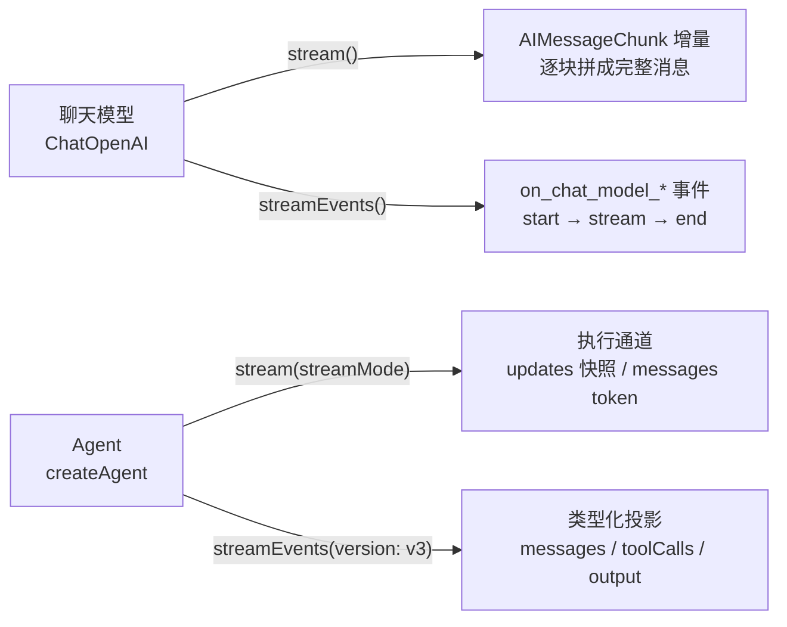

import { Canvas, Controls, Meta } from '@storybook/addon-docs/blocks';
import * as Stories from './streaming.stories';

<Meta of={Stories} name="Docs" />

# 流式输出

LLM 生成完整回复往往要几秒到几十秒。流式输出让模型一边生成、应用一边拿到内容，第一段文字很快就能出现在用户面前（首 token 延迟低），体验从"盯着加载圈"变成"看着答案打出来"。LangChain 在**两个层级**各提供**两类视角**的流式 API：模型级（直接在 `ChatOpenAI` 这类聊天模型上）与 Agent 级（在 `createAgent` 组装的运行对象上）；每个层级里，`stream` 给**内容的增量**，`streamEvents` 给**过程的事件**。本课讲清两级 API 的分工、事件流的形态（`on_chat_model_stream` 等事件与 v3 投影）、Agent 场景怎么选，以及在 Node 里怎么接消费端。读完你应该能预测：把 `invoke` 换成 `stream` 后拿到的东西变成什么、事件流里先看到什么后看到什么、Agent 上该用哪一个。



先给两级流式 API 的速查入口：

| API | 调用对象 | 产出 | 完整结果从哪拿 |
| --- | --- | --- | --- |
| `model.stream(input)` | 聊天模型 | `AIMessageChunk` 增量，`chunk.text` 是片段 | 自己 `concat` 聚合 |
| `model.streamEvents(input)` | 聊天模型、链、Agent | 带类型的事件流（`on_chat_model_*` 等） | `on_chat_model_end` 的 `data.output` 已聚合 |
| `agent.stream(input, { streamMode })` | Agent / graph | 按通道：`updates`（默认）节点跑完的全量快照、`messages` token 元组 | 聚合增量；多通道组合归[图级流式](?path=/docs/graph-streaming--docs) |
| `agent.streamEvents(input, { version: 'v3' })` | Agent / graph | 类型化投影（`stream.messages` 等） | `await stream.output` |

## 快速上手

脱离 Agent，直接看模型上 `invoke` 与 `stream` 的差别——这是本课的最小闭环：

```ts
// 运行条件：Node ≥ 20（ESM）；已安装 langchain 与 @langchain/openai；
// .env 中配置 OPENAI_API_KEY，由 dotenv 加载。npx tsx stream-demo.ts 运行。
import 'dotenv/config';
import { ChatOpenAI } from '@langchain/openai';

const model = new ChatOpenAI({ model: 'gpt-5.5' });

// invoke：等模型把整句生成完，一次性拿到 AIMessage
const response = await model.invoke('用一句话解释什么是流式输出。');
console.log(response.text);

// stream：模型一边生成一边交付，每个 chunk 是一段增量
const stream = await model.stream('用一句话解释什么是流式输出。');
for await (const chunk of stream) {
  process.stdout.write(chunk.text); // 用 stdout.write：console.log 会在每块后插换行
}
```

两段代码的最终文本一致，差别在交付节奏：`invoke` 等几秒后一次打印；`stream` 很快打出第一个片段，随后逐步补全——这就是流式的全部意义。

## 模型级 stream()

`stream()` 返回一个异步可迭代对象，逐个产出 `AIMessageChunk`。`invoke` 返回一条完整的 `AIMessage`（字段速查见[模型与消息](?path=/docs/models-and-messages--docs)），`stream` 把它拆成一串 chunk，每个 chunk 只带**新增**的部分。

### AIMessageChunk 与拼接

`chunk.text` 是本块的增量文本，不是全文。要完整消息就边消费边用 `concat` 累积——chunk 专门为拼接设计，聚合完的结果与 `invoke` 的返回等价，可以照常读 `text`、`tool_calls`，也能追加进对话历史：

```ts
const stream = await model.stream('用一句话解释什么是流式输出。');

let full; // 聚合容器：逐步 concat 成完整消息
for await (const chunk of stream) {
  process.stdout.write(chunk.text);              // 增量：立刻消费
  full = full ? full.concat(chunk) : chunk;      // 全量：同时累积
}

console.log(`\n完整回复：${full.text}`); // 与 invoke 拿到的文本一致
```

两条边界：

- **流式要求整条链路都懂 chunk。** 官方文档的原话是：streaming "only works if all steps in the program know how to process a stream of chunks"——中间环节若只接受完整消息，流式就会被截断成"等全部到齐再处理"。
- **大多数模型支持流式，且跨提供方通用。** `stream()` 是标准模型接口的一部分，`ChatGoogleGenerativeAI`（Gemini）等提供方的用法完全一致，差异只在个别集成的支持程度（见下文「常见问题」）。

### 非文本增量

chunk 里不只有文本。模型流式输出工具调用或推理内容时，增量藏在 `chunk.contentBlocks` 里，按 `type` 区分；工具调用的参数部分还能从 `chunk.tool_call_chunks` 直接读：

```ts
for await (const chunk of stream) {
  for (const block of chunk.contentBlocks) {
    if (block.type === 'text') {
      process.stdout.write(block.text);        // 文本增量
    } else if (block.type === 'reasoning') {
      // 推理模型的思考增量：展示与否由产品决定
    } else if (block.type === 'tool_call_chunk') {
      // 工具调用的增量：模型决定调用工具时出现
    }
  }
}
```

模型决定调用工具时，`name` 和 `args` 也是分块到达的，同样用 `concat` 聚合后读 `full.tool_calls`（怎么把工具绑给模型归[工具](?path=/docs/tools--docs)一课）：

```ts
for await (const chunk of stream) {
  for (const part of chunk.tool_call_chunks ?? []) {
    process.stdout.write(`${part.get('name', '') ?? ''}${part.get('args', '') ?? ''}`);
  }
}
```

## 模型级 streamEvents()

`stream()` 只给内容。如果想拿**过程**——这次调用什么时候开始、发出去的消息是什么、什么时候结束——就要用 `streamEvents()`：它把执行的每一步统一成带类型的事件流，且在后台自动把 chunk 聚合成完整消息。

事件对象的核心字段是 `event.event`（事件名）和 `event.data`（载荷）。聊天模型的事件以 `on_chat_model_` 为前缀、以 `start` / `stream` / `end` 收尾：

| 事件 | 触发时机 | 关键载荷 |
| --- | --- | --- |
| `on_chat_model_start` | 模型调用开始 | `data.input`：发出去的消息 |
| `on_chat_model_stream` | 每生成一块 | `data.chunk`：`AIMessageChunk`，读 `.text` 拿增量 |
| `on_chat_model_end` | 模型调用结束 | `data.output`：聚合好的完整消息 |

```ts
const events = await model.streamEvents('用一句话解释什么是流式输出。');

for await (const event of events) {
  if (event.event === 'on_chat_model_start') {
    console.log('调用开始，输入：', event.data.input);
  } else if (event.event === 'on_chat_model_stream') {
    process.stdout.write(event.data.chunk.text); // 增量埋在 data.chunk 里
  } else if (event.event === 'on_chat_model_end') {
    console.log('\n调用结束：', event.data.output.text); // 已聚合，无需自己 concat
  }
}
```

「对象 + 阶段」的命名形态在 Agent 级的新版事件流（v3）里被拆成了显式字段：直接迭代 v3 流时，每个原始事件带 `event.method`（阶段）与 `event.params.namespace`（对象族），见下文。

与 `stream()` 的分工一句话讲清：**只要内容增量用 `stream()`；要边界事件、要按事件类型过滤、要免手工聚合，用 `streamEvents()`**。事件流真正的主场是 Agent——多步执行（模型 → 工具 → 模型）里，事件是唯一能同时看到"模型在说什么"和"工具在干什么"的单条流。下面用模拟器把两种视角摆在一起核对——事件序列是确定性回放，不请求模型：

<Canvas of={Stories.StreamReplay} />
<Controls of={Stories.StreamReplay} />

| 读者操作 | 可观察证据 |
| --- | --- |
| 把「回放进度」拖到 1 | 右侧先出现 `on_chat_model_start`，左侧还没有任何 chunk——边界事件先于内容 |
| 从 2 拖到 9 | 左侧 chunk 逐块到达，每块的 `.text` 只是片段；右侧每块对应一个 `on_chat_model_stream`，当前事件高亮 |
| 拖到 10 | 左侧 `concat` 拼出完整句子、进度条到 100%；右侧 `on_chat_model_end` 的 `data.output` 就是这句——两种 API 拼出同一句话 |
| 打开 Show code | 看到该 Canvas 实际执行的 `example.ts`：`TIMELINE` 是事件序列的单一真源 |

## Agent 级流式

Agent 把一次回答变成多步执行：模型决定调工具 → 工具执行 → 模型再生成。流式的关键问题升级为「我要哪个层级的信息」：token 增量、工具动态，还是执行状态。两级 API 在 Agent 上都可用，形态各自升级。

### stream 与 streamMode

[第一个 Agent](?path=/docs/first-agent--docs)里用过 `agent.stream()` 的默认形态：逐节点产出**全量状态快照**，适合观察执行到哪一步。要看 token 增量，把 `streamMode` 指到 `messages` 通道——它产出 `(token, metadata)` 元组，`token` 是消息块，`metadata.langgraph_node` 标明来自哪个节点：

```ts
// 运行条件同上；agent 组装方式见「第一个 Agent」一课。
for await (const [token, metadata] of await agent.stream(
  { messages: [{ role: 'user', content: "What's the weather in San Francisco?" }] },
  { streamMode: 'messages' },
)) {
  console.log(`node: ${metadata.langgraph_node}`);
  process.stdout.write(String(token.text)); // 或按 token.contentBlocks 处理多模态增量
}
```

一个容易困惑的点：Agent 内部的节点代码用的是 `invoke`，为什么 `stream` 还能吐出 token？因为 LangChain 检测到你在对流整个应用时，会自动把内部调用切换成流式模式——节点里 `invoke` 的返回值不受影响。这解释了"我没改节点代码，token 却流出来了"。

`streamMode` 不止这两个通道：`values`（每步全量 state）、`custom`（用 `config.writer` 发自定义事件）、多通道组合（返回 `[mode, chunk]` 元组）都归[图级流式](?path=/docs/graph-streaming--docs)一课展开；本课只需要知道选通道的入口在这里。

### streamEvents 的 v3 投影

Agent 上官方推荐的流式方式是事件流：`streamEvents(input, { version: 'v3' })`。它不再让你解析事件名或元组，而是返回一个带**类型化投影**的 run 对象——每个关注点一条独立的流，各取所需：

```ts
const stream = await agent.streamEvents(
  { messages: [{ role: 'user', content: "What's the weather in San Francisco?" }] },
  { version: 'v3' },
);

// 多条投影用 Promise.all 并发消费（官方示例的标准形态）
await Promise.all([
  (async () => {
    for await (const message of stream.messages) {
      for await (const token of message.text) {
        process.stdout.write(token); // token 级文本增量
      }
    }
  })(),
  (async () => {
    for await (const call of stream.toolCalls) {
      console.log(`\n工具调用：${call.name}(${JSON.stringify(call.input)})`);
      console.log(`工具结果：${await call.output}`); // 工具执行完成后的输出
    }
  })(),
]);

const finalState = await stream.output; // 最终 state，等价于 invoke 的返回
```

常用投影速查：

| 投影 | 看到什么 |
| --- | --- |
| `stream.messages` | 每次 LLM 调用的消息流，一条 `message` 对应一次模型调用 |
| `message.text` / `message.reasoning` | 该消息的文本 / 推理增量（推理模型才有） |
| `message.toolCalls` | 该次模型调用里工具参数的渐进生成 |
| `message.output` / `message.usage` | 聚合好的最终消息 / token 用量 |
| `stream.toolCalls` | 工具执行生命周期：`name`、`input`、`await call.output`，出错读 `await call.error` |
| `stream.output` / `stream.values` | 最终 state / 过程中的 state 快照 |
| `stream.subagents` / `stream.subgraphs` | 命名的子 Agent / 嵌套图（归[多智能体](?path=/docs/multi-agent-overview--docs)与图级流式） |

直接 `for await (const event of stream)` 迭代则拿到原始协议事件，带完整封装：`event.method`、`event.params.namespace`、`event.params.data`——上一节提到的「对象族 + 阶段」拆开就是这两个字段。

Agent 级怎么选，官方文档给了明确判断：**多数应用与前端场景从 Event Streaming（`streamEvents` v3）开始**——类型化投影把"打字机文本、工具状态、最终结果"拆成独立通道，不用自己过滤拼装；只有需要底层执行通道（按节点看 state 更新、自定义事件）时才下沉到 `stream(streamMode)`，那套机制的完整展开在[图级流式](?path=/docs/graph-streaming--docs)。

## Node 与消费端接法

流式 API 的返回值（流对象、投影）都是异步可迭代，Node ≥ 20 原生支持 `for await`。消费端的三种接法：

- **终端：** `process.stdout.write(token)`。别用 `console.log`——它给每块插一个换行，打出来变成竖排。
- **要完整结果：** 模型级用 `concat` 聚合，或直接读 `on_chat_model_end` 的 `data.output`；Agent 级 `await stream.output` / `await message.output`。终态都是现成的，不要在消费端重新拼 state。
- **多路消费：** 多条投影（如 `stream.messages` 和 `stream.toolCalls`）必须并发消费——用 `Promise.all` 把每条包成独立任务，这是官方示例的标准形态。

把增量转发给浏览器客户端时，接法就是"拿到即转发"——在 `for await` 里把片段写向响应对象（SSE / WebSocket 均可）：

```ts
// 示意：把 token 增量以 SSE 形态写给 HTTP 客户端（res 为 Node 侧响应对象）
res.writeHead(200, {
  'Content-Type': 'text/event-stream',
  'Cache-Control': 'no-cache',
});

for await (const token of message.text) {
  res.write(`data: ${JSON.stringify(token)}\n\n`);
}
res.end();
```

两个开关：不需要流式时，在模型构造参数里设 `streaming: false` 显式关闭；个别集成不支持 `streaming` 参数，改用基类的 `disableStreaming: true` 关闭。

## 最佳实践

- **按信息层级选 API，不按 API 名字猜**：只要最终答案用 `invoke`；要打字机文本，模型级 `stream()` 或 Agent 级 `message.text` 投影；要工具动态或多路信息，用 `streamEvents()`；要按节点看执行状态，用 `stream(streamMode)`。
- **增量直接消费，终态交给聚合**：`concat`、`data.output`、`await stream.output` 都是现成的完整结果，别在消费端再维护一份"手工拼的 state"。
- **多条投影必须并发消费：** `Promise.all` 是官方示例的标准形态，每条投影（文本、工具动态）一个独立任务。
- **增量到、增量发**：流式的价值在首段内容尽快可见，别在消费端攒够一批再吐。
- **不需要流式就显式关掉**：`streaming: false` 省掉流式开销，行为也更确定。

## 常见问题

- **token 打印出来一块一行，不是连续的文本。**
  `console.log` 每次调用都追加换行。换成 `process.stdout.write(token)`，流结束后自己补一个换行。
- **节点代码里明明是 `invoke`，`stream` 却能吐出 token，是不是哪里错了。**
  这是自动流式：LangChain 检测到你在对流整个应用时，会把内部 runnable 切换到流式模式，节点里 `invoke` 的返回值不变。
- **事件流里看不到 token，只等来最终结果。**
  依次检查：模型构造参数是否设了 `streaming: false`；所用集成是否不支持流式（不支持 `streaming` 参数的集成用 `disableStreaming: true` 显式关闭，或换支持流式的模型）；个别提供方只对部分模型开放 token 流式。
- **`chunk.text` 是空字符串，但调用明明有输出。**
  内容不在文本通道：看 `chunk.contentBlocks`——推理增量是 `type: 'reasoning'`，工具调用增量是 `type: 'tool_call_chunk'`（或 `chunk.tool_call_chunks`）。模型决定只调用工具时 `content` 为空也是正常的（见[第一个 Agent](?path=/docs/first-agent--docs)的工具回合）。
- **旧代码里 `streamEvents(input, { version: 'v2' })` 加一堆 `on_*` 事件过滤，和本文对不上。**
  `v2` 是旧的事件名方案——就是本文模型级小节那套 `on_*` 事件；当前官方文档在 Agent 级统一推荐 `version: 'v3'` 的类型化投影。读旧代码时按事件名对照即可，`on_chat_model_stream` 的语义没有变。
- **为什么要用 `Promise.all` 消费多条投影？一条一条 `for await` 不行吗。**
  多条投影是同一次运行的并行视图，官方文档要求并发消费：每条投影（如 `stream.messages` 与 `stream.toolCalls`）包成一个独立任务，`Promise.all` 同时推进。先把一条耗尽再启动另一条不是文档支持的用法，照官方形态写即可。

## 总结回顾

摘要：

流式把"等完整回复"变成"边生成边交付"，价值在首 token 延迟。LangChain 两级 API：模型级 `stream()` 逐块产出 `AIMessageChunk`（`chunk.text` 是增量），`concat` 聚合后与 `invoke` 结果等价，非文本增量在 `contentBlocks`（`reasoning` / `tool_call_chunk`）里；模型级 `streamEvents()` 产出 `on_chat_model_start` → `on_chat_model_stream` → `on_chat_model_end` 事件序列，载荷在 `event.data`（`input` / `chunk` / `output`），并在后台聚合完整消息。Agent 级 `stream(streamMode)` 按通道给执行信息（`messages` 通道吐 `(token, metadata)` 元组），`streamEvents(version: 'v3')` 用类型化投影（`stream.messages` / `message.text` / `stream.toolCalls` / `stream.output`）把多路信息拆成独立流，多投影用 `Promise.all` 并发消费。官方判断：应用与前端场景从事件流开始，底层通道需求才下沉 `streamMode`。消费端终端用 `stdout.write`，终态用现成聚合，HTTP 客户端拿到增量即转发；不需要流式时用 `streaming: false` 关闭。

一句话：

> `stream` 给内容的增量，`streamEvents` 给过程的事件——先决定要哪个层级的信息，再选 API。

知识要点：

- `invoke` 与 `stream` 的差别是什么？流式为什么能改善体验？
- `chunk.text` 与完整消息是什么关系？怎么聚合，聚合结果等价于什么？
- chunk 里除了文本增量还可能有什么，各在哪个字段？
- `on_chat_model_start` / `stream` / `end` 各在什么时机触发，载荷放在事件的哪里？
- `streamEvents()` 相比 `stream()` 多给你什么？
- `agent.stream({ streamMode: 'messages' })` 产出什么元组，`metadata` 里有什么？节点用 `invoke` 为什么也能流出 token？
- v3 事件流有哪些常用投影？多条投影怎么消费，最终 state 怎么拿？
- 什么时候显式禁用流式，两个开关分别是什么？

## 参考资料

- [Streaming（LangChain.js 官方文档）](https://docs.langchain.com/oss/javascript/langchain/streaming)
- [Event streaming（LangChain.js 官方文档）](https://docs.langchain.com/oss/javascript/langchain/event-streaming)
- [Models — Streaming 小节（LangChain.js 官方文档）](https://docs.langchain.com/oss/javascript/langchain/models)
