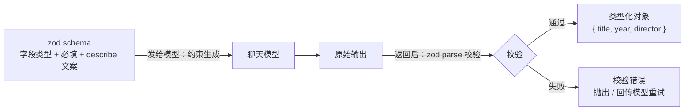

import { Canvas, Controls, Meta } from '@storybook/addon-docs/blocks';
import * as Stories from './structured-output.stories';

<Meta of={Stories} name="Docs" />

# 结构化输出

LLM 天然输出自然语言，而程序需要的是形状确定的数据。结构化输出把"输出长什么样"的约定从提示词挪进 schema：同一份 zod schema 既作为约束随请求发给模型，又在返回后校验结果，让你拿到类型确定、可以直接进业务代码的对象。它在 LangChain 里有两个层次——模型级 `withStructuredOutput(schema)` 约束一次调用，Agent 级 `createAgent({ responseFormat })` 约束最终回答（结果落在 `structuredResponse`）。读完本课你能预测：schema 里少写一个 `.optional()`、把 method 换成 `jsonMode`、或模型返回越界值时，分别会发生什么。



| 关键输入 | 默认值 | 回查要点 |
| --- | --- | --- |
| `withStructuredOutput(schema)` | — | 返回新的 Runnable，`invoke` 直接得到校验过的对象，不再是 `AIMessage` |
| `method` | `'functionCalling'`；gpt-5.x、o 系等新模型未指定时自动用 `'jsonSchema'` | 三条通道约束强度不同，见 [method 三种模式](#method-三种模式) |
| `includeRaw` | `false` | `true` 时返回 `{ raw, parsed }`；校验失败时 `parsed` 为 `null`，不再抛错 |
| `strict` | 不设置（不传给提供方） | `true` 启用 OpenAI 严格校验；配 `method: 'jsonMode'` 会直接报错 |
| `name` | `'extract'` | 结构化工具 / schema 的命名 |
| `responseFormat`（createAgent） | 未设置 | 直接传 schema 时自动选策略，结果在 `result.structuredResponse` |

## 快速上手

沿用[安装](?path=/docs/installation--docs)一课的工程（依赖 `langchain`、`@langchain/openai`、`zod`、`dotenv`），把下面的代码存成 `movie.ts`，用 `npx tsx movie.ts` 运行：

```ts
// movie.ts —— 最小可运行的结构化输出
// 运行条件：OPENAI_API_KEY 已写入 .env；npx tsx movie.ts 运行。
import 'dotenv/config';
import * as z from 'zod';
import { ChatOpenAI } from '@langchain/openai';

// 1. 用 zod 描述要什么：字段名、类型、给模型看的说明
const Movie = z.object({
  title: z.string().describe('The title of the movie'),
  year: z.number().describe('The year the movie was released'),
  director: z.string().describe('The director of the movie'),
});

// 2. 把 schema 绑到模型上，得到一个"返回结构化数据"的新模型
const structuredModel = new ChatOpenAI({ model: 'gpt-5.5' }).withStructuredOutput(Movie);

// 3. invoke 直接返回按 schema 解析并校验过的对象
const movie = await structuredModel.invoke('Provide details about the movie Inception');

console.log(movie);
// { title: 'Inception', year: 2010, director: 'Christopher Nolan' }
console.log(movie.year + 20); // 2030 —— year 一定是 number，类型直接可用
```

三步就是最小闭环：定义 schema、绑定、调用。注意第 3 步的返回值已经不是 `AIMessage`，而是解析后的普通对象——这是结构化输出最直接的体感差异。

## 为什么需要结构化输出

没有结构化输出时，让模型"输出 JSON"只能靠提示词约定，而约定不受约束：

```ts
const model = new ChatOpenAI({ model: 'gpt-5.5' });

const plain = await model.invoke('用 JSON 告诉我《盗梦空间》的导演和年份。');
console.log(typeof plain.content); // 'string'，而且每次长得都不一定一样
// 可能是 '{"director": "Christopher Nolan", "year": 2010}'
// 也可能带 ```json 代码围栏，或先来一句"好的，以下是……"
// 下游只能写字符串清洗，且永远不知道哪次会撞坏
```

结构化输出的解法是让 schema 承担**两重职责**：

- **约束生成（请求侧）：** 字段名、类型、`.describe()` 文案会随请求发给模型，模型按 schema 组织回答——`functionCalling` 通道下 schema 作为一个强制调用的工具，`jsonSchema` 通道下作为提供方原生 schema 约束（见 [method 三种模式](#method-三种模式)）。
- **校验返回（响应侧）：** 提供 zod schema 时，模型输出会再用 zod 的 parse 方法校验一遍——类型不对、缺必填字段、枚举外取值在这一层被拦下。

两重职责合起来，得到的收益是"类型确定"：下游代码直接写 `movie.year.toFixed()`，不用猜、不用解析、不用防御。`withStructuredOutput` 与 `bindTools` 是同一接口上的两个扩展方法——前者约束输出（本课），后者绑定工具（[工具](?path=/docs/tools--docs)一课）。

## withStructuredOutput

`withStructuredOutput` 是聊天模型的标准方法（[模型与消息](?path=/docs/models-and-messages--docs)一课的 `BaseChatModel` 接口），它返回一个**新的 Runnable**，原模型不受影响；输入仍是消息或字符串，`invoke`、`batch` 等标准接口照常可用：

```ts
const model = new ChatOpenAI({ model: 'gpt-5.5' });
const structured = model.withStructuredOutput(Movie); // model 本身不变

const [a, b] = await structured.batch([
  'Provide details about the movie Inception',
  'Provide details about the movie Interstellar',
]);
```

schema 有三种传法，校验行为不同：

| schema 类型 | 校验 |
| --- | --- |
| zod schema（首选，官方推荐写法） | 自动用 zod parse 校验 |
| Standard Schema（valibot 等任何实现规范的库） | 运行时经 `~standard.validate()` 校验 |
| JSON Schema 对象 | 不做自动校验，需手动校验；且必须配 `{ method: 'jsonSchema' }` |

本课以 zod 为主线。返回值形态由 `includeRaw` 决定，默认只给解析结果。

### includeRaw

要拿 token 用量、原始文本这类 `AIMessage` 上的元数据时，设 `includeRaw: true`，返回变成 `{ raw, parsed }`：

```ts
const withRaw = new ChatOpenAI({ model: 'gpt-5.5' }).withStructuredOutput(Movie, {
  includeRaw: true,
});

const { raw, parsed } = await withRaw.invoke('Provide details about the movie Inception');
console.log(parsed);              // { title: 'Inception', year: 2010, director: '...' }
console.log(raw.usage_metadata);  // token 用量在原始 AIMessage 上
```

一个关键行为差异：不开 `includeRaw` 时校验失败会直接抛错；开了以后解析失败**不再抛错**，`parsed` 变为 `null`，模型的原始输出保留在 `raw` 上——排查"模型到底返回了什么"时就靠它（见[错误处理](#错误处理)）。

## zod schema 设计

schema 是结构化输出的核心输入，字段级构造直接决定模型必须返回什么。一份覆盖常用构造的示例：

```ts
import * as z from 'zod';

const Actor = z.object({
  name: z.string().describe('Actor name'),
  role: z.string().describe('Character played'),
});

const MovieDetails = z.object({
  title: z.string().describe('Movie title'),                       // 必填字符串（默认）
  year: z.number().describe('Release year'),                       // 必填数值
  genres: z.array(z.string()).describe('Genre list'),              // 字符串数组
  cast: z.array(Actor).describe('Main cast'),                      // 嵌套对象数组
  rating: z.number().min(0).max(10).describe('Rating out of 10'),  // 数值范围
  sequel: z.string().nullable().describe('Sequel title, null if none'), // 可空
  boxOffice: z.number().optional().describe('Box office, omit if unknown'), // 可选
});
```

构造速查：

| 构造 | 写法 | 约束效果 |
| --- | --- | --- |
| 必填 | `z.string()`（默认） | 字段必须在，且类型正确 |
| 可选 | `.optional()` | 字段可以整个缺失 |
| 可空 | `z.number().nullable()` | 字段必须在，值可为 `null` |
| 枚举 | `z.enum(['positive', 'negative'])` | 取值只能落在枚举内 |
| 数组 | `z.array(z.string())` | 数组元素的类型逐一校验 |
| 嵌套 | `z.array(z.object({...}))` | 递归校验，错误路径带层级（如 `cast[0].role`） |
| 范围 | `.min(1).max(5)` | 数值边界 |
| 说明 | `.describe('...')` | 写给模型看的填空说明 |

四条设计判断：

- **`.describe()` 是写给模型的，不是注释。** 它决定模型往字段里填什么、按什么格式填；每个字段都值得写一句。
- **`optional` 与 `nullable` 语义不同：** 前者是"字段可以缺失"，后者是"字段一定在但值可为空"。`jsonSchema` 通道（gpt-5.x、o 系默认）不遵守 `optional`，可空字段一律用 `nullable`（见 [method 三种模式](#method-三种模式)）。
- **范围约束只在返回后生效。** `min`/`max` 不阻止模型生成越界值——官方示例里 `rating: z.number().min(1).max(5)`，模型仍可能给出 10，在校验环节被拦下后带着错误消息重试。把取值范围写进 `.describe()`（如 `'Rating from 1-5'`）能显著减少这类往返。
- **枚举是收敛输出最有效的构造。** 分类、打标签、路由这类字段优先用 `z.enum`，比自由字符串加事后清洗可靠得多。

zod 默认剥离 schema 之外的未知键：模型多返回的字段不会报错，也不会出现在结果里。

下面用实例观察 schema 构造与校验判定的对应关系——schema 与返回样本都是纯数据，不请求模型也能核对（合法/缺陷样本对齐官方文档示例）：

<Canvas of={Stories.SchemaBench} />
<Controls of={Stories.SchemaBench} />

| 读者操作 | 可观察证据 |
| --- | --- |
| 切换「schema 形态」必填与可选 / 枚举 / 嵌套与数组 | 左侧 schema 片段切换，右侧样本同步换成该形态下的对应样本 |
| 切换「样本缺陷」合法 / 取值非法 / 缺必填字段 | 合法样本判定为通过；缺陷样本在校验环节被拦下，错误消息定位到具体字段路径 |
| 形态选「必填与可选」且缺陷选「取值非法」 | 错误消息是 `rating: Input should be less than or equal to 5`——`max(5)` 拦下越界值 10，与官方校验失败示例一致 |
| 形态选「嵌套与数组」且缺陷选「缺必填字段」 | 错误位置是 `cast[0].role`——嵌套 schema 的错误带层级路径 |

打开 Show code 可看到该 Canvas 实际执行的 `example.ts`：`validateFields()` / `validateField()` 是判定规则（zod 行为的确定性复现），`SCENARIOS` 是三种形态与样本的来源，`draw()` 只负责呈现。

## method 三种模式

`withStructuredOutput` 的第二个参数决定 schema 通过哪条通道约束模型。ChatOpenAI 支持三种（其他提供方的取值以各自集成页为准）：

| method | 通道 | 约束强度 | 何时用 |
| --- | --- | --- | --- |
| `'functionCalling'` | schema 伪装成一个工具并强制模型调用它（`tool_choice` 锁定） | 高：参数由工具调用机制约束，返回后再过 zod 校验 | 默认值（gpt-3/4 系模型） |
| `'jsonSchema'` | OpenAI 原生 Structured Outputs（`response_format` 携带 schema） | 最高：提供方 API 保证输出符合 schema | gpt-5.x、o 系等新模型未指定 method 时的默认 |
| `'jsonMode'` | `response_format: json_object`，schema 说明进提示词 | 最低：只保证合法 JSON，不保证符合 schema | 模型不支持上两者时兜底 |

官方建议：支持时优先 `'functionCalling'` 或 `'jsonSchema'`，`'jsonMode'` 只在前两者不可用时用。

```ts
const model = new ChatOpenAI({ model: 'gpt-5.5' });

const bySchema = model.withStructuredOutput(Movie, { method: 'jsonSchema' }); // 原生约束
const byMode = model.withStructuredOutput(Movie, { method: 'jsonMode' });     // 只保证合法 JSON

// name 与 strict：给结构化工具命名，并启用 OpenAI 严格校验
const strictFn = model.withStructuredOutput(Movie, {
  name: 'extract_movie', // 默认 'extract'
  strict: true,
});
```

三条边界：

- **`jsonSchema` 的模型支持有限。** API 参考标注它需要 gpt-4o-mini、gpt-4o-2024-08-06 及更新的模型快照；老模型上 LangChain 会警告并回退到工具调用。`strict` 配 `method: 'jsonMode'` 则直接抛错——strict 只对前两条通道有意义。
- **`jsonSchema` 通道不遵守 `z.optional()`。** o 系推理模型默认走这条通道：optional 字段模型会自己编一个值填进去，可空字段要用 `z.nullable()`：

```ts
// o1 / gpt-5.x 等模型默认 jsonSchema 通道
const Bad = z.object({ color: z.optional(z.string()) });   // 可能返回 { color: 'No color mentioned' }
const Good = z.object({ color: z.nullable(z.string()) });  // 明确返回 { color: null }
```

- **提供方差异集中在 method 的取值集合。** Gemini 的 `ChatGoogleGenerativeAI` 同样实现 `withStructuredOutput`，可用通道以 `@langchain/google-genai` 的文档为准；Agent 场景下 Gemini 属于原生支持结构化输出的提供方（见下节）。

## Agent 的 responseFormat

Agent 场景下结构化输出不在模型上设置，而在 `createAgent` 的 `responseFormat` 参数上；[第一个 Agent](?path=/docs/first-agent--docs)一课的参数表已为它留了位置，这里展开。结果落在最终 state 的 `structuredResponse` 键：

```ts
// 运行条件：OPENAI_API_KEY 已写入 .env；npx tsx review.ts 运行。
import 'dotenv/config';
import * as z from 'zod';
import { ChatOpenAI } from '@langchain/openai';
import { createAgent, toolStrategy } from 'langchain';

const ProductReview = z.object({
  rating: z.number().min(1).max(5).optional(),
  sentiment: z.enum(['positive', 'negative']),
  keyPoints: z.array(z.string()).describe('The key points of the review. Lowercase, 1-3 words each.'),
});

const agent = createAgent({
  model: new ChatOpenAI({ model: 'gpt-5.5' }),
  tools: [],
  responseFormat: toolStrategy(ProductReview),
});

const result = await agent.invoke({
  messages: [
    { role: 'user', content: "Analyze this review: 'Great product: 5 out of 5 stars. Fast shipping, but expensive'" },
  ],
});

console.log(result.structuredResponse);
// { rating: 5, sentiment: 'positive', keyPoints: ['fast shipping', 'expensive'] }
console.log(result.messages.at(-1)?.content); // 最终回答照旧在 messages 里
```

四个要点：

- **直接传 schema（不包 strategy 函数）时自动选策略：** 模型原生支持结构化输出（`langchain >= 1.1` 从 model profile 的 `structuredOutput` 能力动态读取）就用 provider strategy，否则回退 tool calling strategy。
- **schema 传数组表示"多选一"：** `toolStrategy([ProductReview, CustomerComplaint])`，模型只准挑一个产出——union 类型的输出场景。
- **与工具并用有前提：** 同时指定 `tools` 时，模型必须支持同时使用工具和结构化输出。
- **划界：** 用 `tool()` 给工具定义参数 schema 的完整链路归[工具](?path=/docs/tools--docs)一课——本课的 schema 约束模型的**输出**，工具课的 schema 描述工具的**输入参数**，写法同源、用途不同。

### providerStrategy 与 toolStrategy

两个 strategy 函数显式控制输出通道：

- **`providerStrategy(schema)`：** 走提供方原生结构化输出（OpenAI、xAI、Gemini、Anthropic 支持），官方定位是最可靠的方式——schema 由提供方强制校验。模型原生支持时，`responseFormat: schema` 与 `responseFormat: providerStrategy(schema)` 等价。
- **`toolStrategy(schema, options?)`：** 把结构化输出做成一次额外的工具调用，所有支持工具调用的模型都能用（多数现代模型）。两个选项：
  - `toolMessageContent`：结构化结果生成后写回会话历史的 ToolMessage 文案，默认是 `"Returning structured response: {...}"`。
  - `handleError`：校验失败时的处理策略，默认自动重试（见[错误处理](#错误处理)）。

profile 数据缺失或过时、导致自动策略判断不准时，可以手动声明：

```ts
import { initChatModel } from 'langchain';

const model = await initChatModel('openai:gpt-5.5', {
  profile: { structuredOutput: true }, // 声明模型支持原生结构化输出
});
```

## 错误处理

模型可能生成不符合 schema 的输出，两个层次的处理机制不同。

**模型级：默认直接抛错。** 不开 `includeRaw` 时，校验失败会从 `invoke` 直接抛出，错误消息里带字段路径与原因：

```ts
try {
  const movie = await structuredModel.invoke('Provide details about the movie Inception');
} catch (error) {
  // 校验错误：缺必填字段 / 类型不符 / 枚举外取值，消息定位到具体字段
  console.error(String(error));
}
```

要同时拿到模型原始输出排查，就开 `includeRaw: true`——失败不抛错，`parsed` 为 `null`，原始内容在 `raw` 上。

**Agent 级：toolStrategy 默认自动重试（`handleError: true`）。** 校验失败的错误细节会作为 ToolMessage 回传给模型，要求修正后重试，直到通过。官方文档给的两类典型场景：

- **模型同时调了多个结构化工具**（union 场景）：每条工具消息都收到 `"incorrectly returned multiple structured responses... Please fix your mistakes"`，模型重试后只保留一个。
- **schema 校验失败：** 如 `rating` 给了 10、超过 `max(5)`，错误消息（`Input should be less than or equal to 5`）回传模型，修正为 5 后重试成功——上面 ProductReview 的例子里这一切自动发生。

`handleError` 的三档取值：

```ts
import { toolStrategy } from 'langchain';
import { ToolInputParsingException } from '@langchain/core/tools';

const responseFormat = toolStrategy(ProductReview, {
  handleError: (error) => {
    if (error instanceof ToolInputParsingException) {
      // 用这句话作为 ToolMessage 回传模型，继续重试
      return 'Please provide a valid rating between 1-5 and include a comment.';
    }
    return error.message; // 其他错误原样回传；在这里 throw 则终止执行
  },
  // handleError: true,  // 默认：所有错误用默认模板回传并重试
  // handleError: false, // 不重试，异常直接抛给调用方
});
```

## 最佳实践

- **每个字段都写 `.describe()`**，说明"填什么、什么格式"；能枚举的字段用 `z.enum`，比自由字符串加事后清洗可靠得多。
- **`optional` 与 `nullable` 按语义选：** 字段可能整个缺失用 `optional`；一定出现但可能为空用 `nullable`。走 `jsonSchema` 通道（gpt-5.x、o 系默认）的模型只用 `nullable`。
- **method 优先级：`jsonSchema` / `functionCalling` 优于 `jsonMode`。** jsonMode 只保证合法 JSON，schema 级保证要靠前两者。
- **数值范围写进 describe，别只靠 `min`/`max`：** 范围约束在返回后才校验，拦不住模型生成越界值，只会触发一轮失败与重试。
- **按场景选层次：** 抽取、分类这类单次任务用模型级 `withStructuredOutput`；进 Agent 循环、要自动重试或与工具并用时用 `responseFormat`。
- **平时不开 `includeRaw`：** 只有需要 token 用量、或要排查模型原始输出时再开，多一层解构换完整的排查信息。

## 常见问题

- **`withStructuredOutput` 之后取 `response.text` / `usage_metadata` 是 undefined**
  `invoke` 返回的已经是解析后的对象（或 `includeRaw` 时的 `{ raw, parsed }`），不再是 `AIMessage`。要 token 用量等元数据就设 `includeRaw: true`，从 `raw`（AIMessage）上取。
- **`invoke` 抛出校验错误，说某个字段越界或类型不对**
  看错误消息里的字段路径：`min`/`max`、枚举这类约束在返回后校验，不阻止模型生成越界值。把取值范围写进 `.describe()`、能枚举的改 `z.enum`；Agent 场景确认走的是 toolStrategy 默认的自动重试。
- **o1 / gpt-5.x 上 optional 字段被填了 "No color mentioned" 这类编造值**
  这些模型默认走 `jsonSchema` 通道，它不遵守 `z.optional()`；可空字段改用 `z.nullable()`，模型会明确返回 `null`。
- **`method: 'jsonMode'` 时字段缺失、类型不对却没有报错**
  这是 jsonMode 的设计行为：它只保证输出是合法 JSON，不保证符合 schema。要 schema 级保证就换 `functionCalling` 或 `jsonSchema`。
- **回复较长时 JSON 解析失败（Unexpected end of input 之类）**
  多半是 `maxTokens` 把 JSON 截断了——截断的输出无法通过解析。[模型与消息](?path=/docs/models-and-messages--docs)一课留过这个钩子：放大 `maxTokens`，或精简 schema（嵌套与数组适度）。
- **`result.structuredResponse` 是 undefined**
  先确认 `createAgent` 真的传了 `responseFormat`；仍为空时 `console.log(result.messages)` 看最后一轮是否存在结构化工具调用回合，再检查模型是否支持当前 strategy 要求的能力。

## 总结回顾

摘要：

结构化输出把输出约定从提示词挪进 schema，schema 同时承担约束生成与校验返回两重职责。模型级 `withStructuredOutput(schema)` 返回新的 Runnable，`invoke` 直接给校验过的对象；`includeRaw: true` 时返回 `{ raw, parsed }`，且校验失败不抛错、`parsed` 为 `null`。schema 用 zod 设计：`.describe()` 写给模型，必填/可选/可空/枚举/嵌套/数组各有语义，`min`/`max` 这类范围只在返回后校验。method 决定通道：`functionCalling`（默认）伪装成工具并强制调用，`jsonSchema`（新模型默认）走提供方原生约束、不遵守 `optional`，`jsonMode` 只保证合法 JSON。Agent 级把 schema 配在 `createAgent` 的 `responseFormat` 上，结果落在 `structuredResponse`；providerStrategy 最可靠，toolStrategy 通用于支持工具调用的模型，校验失败默认自动重试，`handleError` 可定制。

一句话：

> schema 既约束模型的生成、又校验模型的返回——结构化输出拿到的是类型确定的数据，而不是需要祈祷的自然语言。

知识要点：

- schema 的两重职责是什么，分别发生在请求的哪一步？
- `withStructuredOutput` 的返回值与原模型 `invoke` 的返回值差在哪，`includeRaw` 打开后怎么变？
- `optional` 与 `nullable` 语义差在哪，`jsonSchema` 通道下该用哪个？
- method 三种模式各自的通道与约束强度是什么，默认规则是什么？
- `min`/`max` 为什么挡不住模型生成越界值，挡在哪一层？
- Agent 场景结构化输出配在哪个参数上，结果从哪里取，两种 strategy 怎么选？
- `toolStrategy` 的 `handleError` 有哪几档，默认行为是什么？

## 参考资料

- [Structured output（LangChain.js 官方：createAgent 的 responseFormat 与两种 strategy）](https://docs.langchain.com/oss/javascript/langchain/structured-output)
- [Models - Structured output（LangChain.js 官方：withStructuredOutput、includeRaw、嵌套 schema）](https://docs.langchain.com/oss/javascript/langchain/models#structured-output)
- [ChatOpenAI 集成（官方：strict 与 name、推理模型的 optional 与 nullable）](https://docs.langchain.com/oss/javascript/integrations/chat/openai)
- [withStructuredOutput API 参考（@langchain/openai）](https://reference.langchain.com/javascript/langchain-openai/ChatOpenAI/withStructuredOutput)
