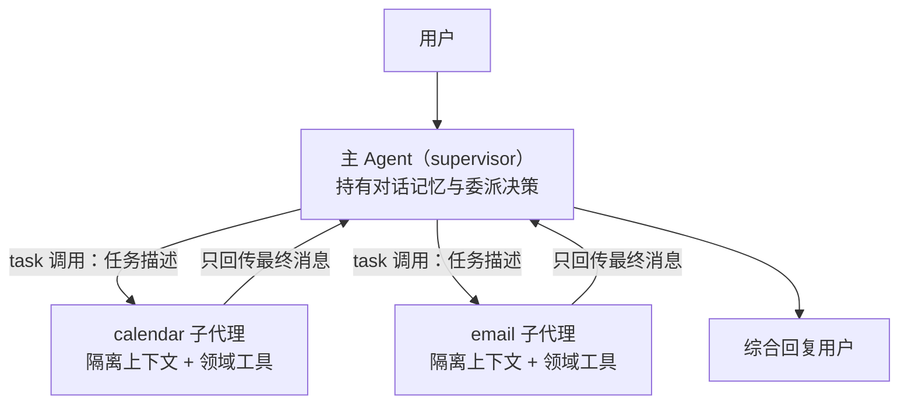

import { Canvas, Controls, Meta } from '@storybook/addon-docs/blocks';
import * as Subagents from './subagents.stories';

<Meta of={Subagents} name="Docs" />

# 子代理

本课讲 subagents 模式在 LangChain.js agent 层的实现：主 Agent（官方文档也称 supervisor）把子 Agent 包装成 `task` 工具来委派子任务；子 Agent 在独立的上下文窗口里跑完自己的工具循环，只把最终消息回传主上下文——token 节省与信息损失都源于这一个机制。多智能体的架构选型、五种模式对比和图编排层的 supervisor 循环归「概览与路由」；handoff 的控制权转移归「移交」；Deep Agents 内置的 `task`/`subagents` 配置归阶段 5.2。读完你应该能预测：把一个 Agent 包成工具挂上主 Agent 后，主上下文会多出哪两条消息、子 Agent 内部会发生什么、把输入从隔离切到透传会改变什么。



官方把实现 subagents 模式归纳成五项设计决策，每项都有明确的默认值：

| 设计决策 | 选项 | 默认与选择信号 |
| --- | --- | --- |
| 执行时机 | sync（阻塞等待）/ async（后台任务） | 默认 sync；下一步依赖结果用 sync，用户不该等待的长任务用 async 三工具 |
| 工具形态 | 一 Agent 一工具 / 单 `task` 分发工具 | 少量代理、要精细控制输入输出用前者；多团队、随加随用、强隔离用后者 |
| 子代理输入 | isolated（仅任务描述）/ fork（透传主对话历史） | 默认 isolated；任务依赖前文指代才透传 |
| 子代理输出 | 最终消息 / `Command` 回写多个 state 键 | 默认最终消息；要结构化回传才用 `Command` |
| 子代理发现 | 系统提示枚举 / enum 约束 / 工具发现 | 少于 10 个静态代理用前两种；更多或动态注册用工具发现 |

一个先说清的包现状事实：官方 JS 文档与 `langchain` 包当前**没有** `createSubagent` 函数或 `subagents` 配置项——subagents 是一种模式，不是一组 API。它的全部实现就是 `createAgent` 造子 Agent、`tool()` 包一层、挂回主 Agent 的 `tools`，本课的代码都围绕这三步展开。

## 快速上手

沿用「安装」一课的工程（依赖 `langchain`、`@langchain/openai`、`zod`、`dotenv`），`.env` 里配置 `OPENAI_API_KEY`，把下面的代码存成 `subagents-demo.ts`，用 `npx tsx subagents-demo.ts` 运行：

```ts
// subagents-demo.ts —— 最小委派闭环：research 子代理 + 主代理
// 运行条件：OPENAI_API_KEY 已写入 .env；npx tsx subagents-demo.ts 运行。
import 'dotenv/config';
import * as z from 'zod';
import { ChatOpenAI } from '@langchain/openai';
import { createAgent, tool } from 'langchain';

// 1. 子代理：独立上下文、独立提示的专职 Agent
const researchAgent = createAgent({
  model: new ChatOpenAI({ model: 'gpt-4o-mini' }),
  systemPrompt:
    'You are a research specialist. Investigate the assigned topic and ' +
    'ALWAYS include all findings in your final message.',
});

// 2. 包装成工具：主代理只看到 name、description、schema
const research = tool(
  async ({ query }) => {
    const result = await researchAgent.invoke({
      messages: [{ role: 'user', content: query }], // 任务描述作为唯一输入
    });
    return result.messages.at(-1)?.content; // 只回传最终消息
  },
  {
    name: 'research',
    description: 'Research a topic and return findings',
    schema: z.object({ query: z.string() }),
  }
);

// 3. 主代理：把子代理当工具调用，自己不再背领域细节
const mainAgent = createAgent({
  model: new ChatOpenAI({ model: 'gpt-4o-mini' }),
  tools: [research],
  systemPrompt: 'You coordinate work. Delegate research to the research tool.',
});

const result = await mainAgent.invoke({
  messages: [
    { role: 'user', content: '调研 LangChain 的 subagents 模式，总结三个要点' },
  ],
});
console.log(result.messages.at(-1)?.content);
```

这 30 行就是委派的最小闭环：子代理是一个完整的 Agent（有自己的循环和提示），但对外只是一支工具；主代理决定何时调用、收到报告后继续编排。注意第 2 步里发生了两次「缩窄」：输入缩成一条 `query`，输出缩成最后一条消息——这是后面「上下文隔离」的全部来源。

## 委派机制

官方对 subagents 架构的定义一句话可以立住：**中心化的主 Agent 把子 Agent 当工具调用**——调谁、传什么输入、怎么合并结果，都由主 Agent 决定；所有路由经过主 Agent，子代理之间不直接通信，也不直接面对用户。四个关键特征（官方 Key characteristics）：

- 集中控制：所有路由经过主 Agent；
- 不直接面对用户：子代理把结果回给主 Agent（但子代理内部可以用 `interrupt` 暂停收集用户输入，见「人机协同」）；
- 以工具为载体：子代理经 `tool()` 包装后被调用；
- 可并行：主 Agent 可以在单轮里调起多个子代理。

官方教程还给出了分层视角，这是理解「为什么不把工具直接给主 Agent」的最好框架：

- **底层：刚性 API 工具**——要求精确格式（ISO 日期、合法邮箱），错一点就失败；
- **中层：子代理**——接收自然语言，翻译成精确的 API 调用，跑完多步循环，返回自然语言确认；
- **顶层：主代理**——只看到 `schedule_event` 这类高层能力，在域的粒度上路由，不认识 `create_calendar_event` 这种底层工具。

每层职责单一，就能独立测试、独立演进：加一个新域不动旧域，改一个域的提示不污染其他域。

### 一 Agent 一工具

每个子代理包成一支独立的工具（官方 tool per agent）。适合代理数量少、要对每个子代理的输入输出做精细控制的场景。快速上手就是这种形态；官方教程进一步示范了描述该怎么写——写给主代理看的「何时用」与「输入长什么样」：

```ts
// 官方教程的 schedule_event 包装：描述讲清「何时用 + 处理什么 + 输入格式」
// （calendarAgent 是 createAgent 的返回值，承接快速上手的第 1 步）
const scheduleEvent = tool(
  async ({ request }) => {
    const result = await calendarAgent.invoke({
      messages: [{ role: 'user', content: request }],
    });
    const lastMessage = result.messages[result.messages.length - 1];
    return lastMessage.text; // 与 .content 等价，只回传最终响应
  },
  {
    name: 'schedule_event',
    description: `
Schedule calendar events using natural language.

Use this when the user wants to create, modify, or check calendar appointments.
Handles date/time parsing, availability checking, and event creation.

Input: Natural language scheduling request (e.g., 'meeting with design team next Tuesday at 2pm')
    `.trim(),
    schema: z.object({
      request: z.string().describe('Natural language scheduling request'),
    }),
  }
);
```

主代理靠这段描述决定何时委派，所以官方特意提醒：描述要清楚、具体。工具定义的其余细节（`schema` 校验、执行函数形态）与普通工具完全一致，归「工具」一课。

### 单 task 分发工具

代理多了以后，一 Agent 一工具会让主代理的工具清单跟着膨胀。官方的替代形态是**单分发工具**：一支参数化的 `task` 工具，按名字调用注册表里的任意子代理——任务描述作为人类消息发给子代理，子代理的最终消息作为工具结果返回：

```ts
// task 分发工具：官方 Agent registry 模式（模型换成 OpenAI 主线）
// 运行条件：OPENAI_API_KEY 已写入 .env。
import 'dotenv/config';
import * as z from 'zod';
import { ChatOpenAI } from '@langchain/openai';
import { createAgent, tool } from 'langchain';

const model = new ChatOpenAI({ model: 'gpt-4o-mini' });

// 各团队独立开发的子代理
const researchAgent = createAgent({
  model,
  systemPrompt: 'You are a research specialist...',
});
const writerAgent = createAgent({
  model,
  systemPrompt: 'You are a writing specialist...',
});

// 子代理注册表
const SUBAGENTS = { research: researchAgent, writer: writerAgent };

const task = tool(
  async ({ agentName, description }) => {
    const agent = SUBAGENTS[agentName];
    const result = await agent.invoke({
      messages: [{ role: 'user', content: description }],
    });
    return result.messages.at(-1)?.content;
  },
  {
    name: 'task',
    description: `Launch an ephemeral subagent.

  Available agents:
  - research: Research and fact-finding
  - writer: Content creation and editing`,
    schema: z.object({
      agentName: z.string().describe('Name of agent to invoke'),
      description: z.string().describe('Task description'),
    }),
  }
);

const mainAgent = createAgent({
  model,
  tools: [task],
  systemPrompt:
    'You coordinate specialized sub-agents. Available: research (fact-finding), ' +
    'writer (content creation). Use the task tool to delegate work.',
});
```

什么时候选它（官方给的信号）：要按团队分布式开发子代理、要把复杂任务隔离进独立上下文窗口、要不改协调者就扩容新代理、偏好约定优于配置。代价是放弃了每个子代理独立的输入输出控制——所有委派都被压成「名字 + 任务描述」一种形状。官方还有一个很提气的观察：这种模式下子代理的能力可以和主代理**完全相同**，此时委派的核心理由就是上下文隔离本身——让多步任务在隔离窗口里跑完，主线程只留一份摘要。

与「概览与路由」的分界在此说清：那节课的 supervisor 路由循环是同一模式在 LangGraph 图编排层的写法（`Command` 分发 + 固定边回流）；本课是 agent 层的写法——没有图，主代理在工具调用循环里完成同样的「看全局、派任务、收结果」。两种写法可以互换，选择取决于你要不要图结构带来的持久化、中断与流式控制。

## 上下文隔离

把快速上手的代码跑一遍，`console.log` 两边的消息历史，会看到两条形状完全不同的轨迹：

- **主代理上下文**只多了两条消息：一条带 `tool_calls` 的 AIMessage（委派），一条 ToolMessage（最终报告）。子代理内部的推理、工具调用、工具结果都不在这里。
- **子代理上下文**从任务描述开始，完整走完「模型 → 工具 → 模型 → … → 最终消息」的循环，然后整段历史被丢弃——默认情况下子代理是无状态的，每次调用都在干净的窗口里进行。

这就是官方说的 context isolation：每个子代理调用工作在干净的上下文窗口里，防止主对话膨胀。「概览与路由」引过的官方数字在这里兑现——多领域、每域约 2000 token 文档的场景下，subagents 靠隔离整体少处理约 67% 的 token。但同一机制的另一面是**信息损失**：子代理只回传最终消息，中间的工具结果与推理对主代理不可见；反过来，主对话里的上下文（用户的偏好、前文的指代）子代理也看不到。下面的实例把两条轨迹放进同一张图：

<Canvas of={Subagents.Interactive} />
<Controls of={Subagents.Interactive} />

| 读者操作 | 可观察证据 |
| --- | --- |
| 任务保持「单域」，模式保持 isolated | 主上下文只有 4 条消息（用户请求 → task 调用 → 报告回流 → 综合回复），子代理的完整六条历史连同工具回合全部留在隔离气泡里 |
| 切到「跨域：订会议 + 发邮件」 | 主泳道出现一条 `task ×2`：两个子代理气泡并行执行，两条报告先后回流——单轮多调用就是并行委派的形态 |
| 切到「模糊指代」+ isolated | 第一次委派的气泡以「AI·澄清请求」收场：任务描述里的「同一时间」无法解析；主泳道多出一跳「补上日期后重派」，委派次数升到 2——信息损失的代价 |
| 同任务切到 fork | 气泡顶部出现琥珀色「透传历史」行，指代一次解析成功，委派次数回到 1，主上下文消息从 6 条降到 4 条——透传换来准确，付出隔离 |
| 打开 Show code | 看到该 Canvas 实际执行的 `example.ts`：纯 TS 确定性模拟，不依赖 `@langchain/*` |

结论压缩成一句：**隔离同时决定子代理看不到什么（主对话）与主代理看不到什么（中间过程）**。前者的修复手段是下一小节的输入透传，后者的修复手段是提示子代理把结果写全（「子代理输出」小节）或用 LangSmith 追踪内部（归阶段 6.1）。

顺带说清持久化边界：子代理默认无状态，官方称其运行在 inherited checkpointer 模式——每次调用新状态、支持 `interrupt`、并行安全。要某个子代理跨调用维护自己的历史，就在它的 `createAgent` 上传 `checkpointer`（continuations 模式），两种模式的完整对照归「子图」一课。

### 子代理输入

默认（isolated）子代理只收到任务描述。当任务依赖主对话里的信息——用户的偏好、前文的指代——就在包装函数里从主 Agent 的 state 取历史，加工后传入：

```ts
// 官方教程的上下文注入写法：把原始用户消息拼进子代理提示
import { getCurrentTaskInput } from '@langchain/langgraph';
import { type BuiltInState, HumanMessage, tool } from 'langchain';

const scheduleEventWithContext = tool(
  async ({ request }, config) => {
    // 从当前运行的 state 里读主线程消息（getCurrentTaskInput 细节归「中间件」一课）
    const currentMessages = getCurrentTaskInput<BuiltInState>(config).messages;
    const originalUserMessage = currentMessages.find(HumanMessage.isInstance);
    const prompt = `
You are assisting with the following user inquiry:

${originalUserMessage?.content || 'No context available'}

You are tasked with the following sub-request:

${request}
    `.trim();

    const result = await calendarAgent.invoke({
      messages: [{ role: 'user', content: prompt }],
    });
    return result.messages[result.messages.length - 1].text;
  },
  {
    name: 'schedule_event',
    description: 'Schedule calendar events using natural language.',
    schema: z.object({
      request: z.string().describe('Natural language scheduling request'),
    }),
  }
);
```

透传多少由你决定——这正是「概览与路由」说的 context engineering 在子代理上的落点。官方把两种极端命名为：

| 模式 | 子代理收到 | 适合 | 代价 |
| --- | --- | --- | --- |
| **isolated**（默认） | 仅任务描述 | 不依赖前文的专注工作 | 指代、偏好等上下文丢失，可能要重派 |
| **fork** | 主对话完整历史（Deep Agents 还带系统提示） | 继续主 Agent 已开始的任务 | 提示更大、隔离更弱 |

Deep Agents 把 `mode: "isolated"` / `mode: "fork"` 做成了一等配置并自动实现 fork，归 5.2.2；在 LangChain agent 层，fork 就是你在这段代码里手工做的事。

### 子代理输出

主代理只看到工具返回值，所以「回传什么」直接决定它的编排质量。两个官方策略：

**一是提示子代理把结果写全。**官方点名的常见失败模式：子代理执行了工具调用和推理，但最终消息里不带结果——主代理拿到一句「已完成」却不知道完成了什么。修复是在子代理的提示里显式要求（快速上手的 `ALWAYS include all findings in your final message` 就是这个用途），必要时让子代理在最终消息里附带结构化摘要。

**二是用代码加工回传。**要回传的比一段文本更多时（额外的 state 键、结构化数据），从工具返回 `Command` 更新多个键，并自己构造 ToolMessage：

```ts
// 官方的 Command 回写写法：最终文本之外，把子代理的 state 键一并写回主 Agent
import { tool, ToolMessage } from 'langchain';
import { Command } from '@langchain/langgraph';

const callSubagent = tool(
  async ({ query }, config) => {
    const result = await subagent.invoke({
      messages: [{ role: 'user', content: query }],
    });

    return new Command({
      update: {
        // 除最终文本外，把子代理的 state 键也写回主 Agent
        exampleStateKey: result.exampleStateKey,
        messages: [
          new ToolMessage({
            content: result.messages.at(-1)?.text,
            tool_call_id: config.toolCall!.id, // 对应这次工具调用的 ID
          }),
        ],
      },
    });
  },
  {
    name: 'subagent_name',
    description: 'subagent_description',
    schema: z.object({ query: z.string().describe('The query to send') }),
  }
);
```

`Command` 的完整语义（`goto`、`update`、`resume`）归「Graph API」一课；这里只需要知道工具返回 `Command` 时，它的 `update` 会代替工具返回值合并进主 Agent 的 state。

## 委派质量

主代理怎么知道该派谁？官方的回答很干脆：**子代理的名字和描述是主要依据**——这是提示工程杠杆，不是配置项。两条写法原则：

- **名字**要清晰、面向动作：`research_agent`、`code_reviewer`，而不是 `agent1`；
- **描述**要具体到「处理什么任务、什么时候用」，多个子代理并存时还要写清彼此的分工边界，避免两个代理抢同一类任务。

一 Agent 一工具的形态下，描述写在各自的 `tool()` 里（上一节的 `schedule_event` 示范了多行写法）。单 `task` 分发工具的形态下，主代理拿到的工具描述只有一份，可用代理的信息必须另行提供——官方给了三种方式：

| 方式 | 适合 | 代价 |
| --- | --- | --- |
| 系统提示枚举 | 少于 10 个静态代理 | 代理变化要改提示 |
| enum 约束 | 少于 10 个静态代理 | 代理变化要改代码 |
| 工具发现（`list_agents` 等） | 超过 10 个或动态注册 | 多一支工具与一次发现调用 |

前文 `task` 工具的例子里，可用代理清单同时出现在工具描述和主代理 `prompt` 里，就是系统提示枚举。enum 约束的官方示例是 Python 的 `Enum`，JS 等价写法是把 `agentName` 的 schema 换成 `z.enum`——可用代理随之显式进入工具 schema，模型无法填入未注册的名字：

```ts
// enum 约束的 JS 等价写法：可用代理进入 schema，填错名字直接校验失败
schema: z.object({
  agentName: z.enum(['research', 'writer', 'reviewer']),
  description: z.string().describe('Task description'),
}),
```

代理规模再大、或注册表本身是动态的，就加一支 `list_agents` 工具按需发现——这是「技能」一课会展开的渐进式披露思想在代理发现上的应用。

## 工具与模型差异化

子代理之间的差异体现在三处，全部在各自的 `createAgent` 上独立配置：

```ts
// 两个域各自持有私有工具与专属提示（官方教程的 calendar / email 分工）
const calendarAgent = createAgent({
  model,
  tools: [createCalendarEvent, getAvailableTimeSlots], // 域内工具不外泄
  systemPrompt: CALENDAR_AGENT_PROMPT, // 教自然语言→ISO 日期的翻译规则
});

const emailAgent = createAgent({
  model,
  tools: [sendEmail],
  systemPrompt: EMAIL_AGENT_PROMPT, // 教收件人推断与措辞规范
});
```

- **工具差异化**是最主要的分工手段：每个域的工具只挂在自己的子代理上，主代理看不到 `create_calendar_event` 这类底层 API 工具，只在域粒度上选择（`schedule_event`）。工具少了，子代理内的选择就稳——这正是「概览与路由」说的「工具多到选择混乱」信号的解法。
- **提示差异化**让每个子代理专注一种翻译：日历代理教日期解析，邮件代理教措辞规范。域知识写进各自的提示，不挤占彼此的窗口。
- **模型差异化**是省钱的常用手法：`model` 本来就是每个 `createAgent` 实例独立指定的，而 subagents 天然分层——委派与综合的判断在主代理，域内的机械执行在子代理。让强模型做编排、小模型（如 `gpt-4o-mini`）跑格式翻译类子任务，两层各取所需。Gemini 对照：子代理换 `@langchain/google-genai` 的 `ChatGoogleGenerativeAI` 即可，写法只差实例来源（见「模型与消息」）。

敏感操作还可以给子代理挂 `humanInTheLoopMiddleware`（对域内工具审批），同时只给顶层主 Agent 配 `checkpointer` 以支持暂停恢复——这个「中间件挂子代理、检查点挂顶层」的结构来自官方教程，审批细节归「人机协同」一课。

## 并行委派

多数模型支持在一条 AIMessage 里发出多个工具调用，运行时会**并行执行**这些调用。对 subagents 意味着：主代理一轮委派两个子代理，两个隔离上下文同时开跑，报告先后回流，主代理再综合——上面的 Canvas「跨域」场景演示的就是这条交错时间线。触发方式不需要任何专门 API，只要主代理的提示允许它拆解任务（官方 supervisor 提示的写法：`use multiple tools in sequence or in parallel as appropriate`）。

并行不是没有前提：两个子任务必须相互独立。后一个任务的输入依赖前一个的结果时，模型自然会分两轮委派，运行时也自然串行。

长时间运行的任务还有第二档：**异步执行**（async）——主代理起一个后台作业继续对话，不阻塞用户。注意这里 async 指后台任务模式，不是 JS 的 `async`/`await` 语法。官方的三工具模式：

| 工具 | 职责 |
| --- | --- |
| start job | 启动后台任务，立即返回 `job_id` |
| check status | 查询状态（pending / running / completed / failed） |
| get result | 取回完成的结果 |

任务完成时由应用层通知用户（例如用户点击通知后发出一条「Check job_123 and summarize the results」消息），主代理据此取结果并汇报。

## 最佳实践

- 默认 isolated，出现「子代理需要前文才能干活」的实证（指代解析失败、反复要求澄清）再透传；透传时优先手工筛选相关消息，而不是整段历史灌入——fork 的提示膨胀是按每次委派计费的。
- 子代理提示里固定一条「最终消息必须包含全部结果」，这是官方点名的第一失败模式的疫苗；主代理拿不到结果的编排全是猜测。
- 按域拆子代理，域内工具保持私有：主代理只看到域粒度的高层工具；加新域不动旧域，测试也按域独立进行。
- 名字面向动作、描述写清何时用与分工边界；少于 10 个静态代理用系统提示枚举或 `z.enum` 约束，动态注册表才上 `list_agents`。
- 是否拆多代理先回「概览与路由」的三个信号核对；工具不多、无并行与分布式诉求时，单 Agent 重组工具永远更便宜。
- 选 sync 还是 async 看依赖方向：下一步要用结果就 sync 等待；用户不该等的独立长任务（合同审查、批量生成）用三工具模式放后台。

## 常见问题

- LangSmith 里子代理明明调了工具、拿到了结果，主代理却说「没有结果」或答非所问
  这是官方点名的常见失败模式：子代理执行了工具调用但没把结果写进最终消息，主代理只看得见最终消息。在子代理的 `systemPrompt` 里显式要求「最终消息必须包含全部结果与结论」，必要时要求附带结构化摘要。
- 用户说「改到同一时间」这类指代，子代理回复「无法确定，请提供具体信息」
  isolated 模式下主对话不在子代理的窗口里，这是设计代价不是 bug。两种修复：委派前由主代理把指代解析成具体值写进任务描述；或在包装函数里用 `getCurrentTaskInput` 透传相关历史（fork 模式）。
- 主代理不派发子代理，或者把任务派给了不合适的子代理
  路由依据只有名字和描述。检查 `description` 是否写清「何时用」与分工边界；单 `task` 工具形态下再检查可用代理清单（工具描述、系统提示或 `z.enum`）是否与注册表一致——清单与注册表不同步时，主代理会自信地派给不存在的代理。
- `get_state` 加 `subgraphs` 看不到子代理的内部状态
  官方限制：子代理运行在工具函数里，LangGraph 无法静态发现它们。要看子代理内部用 LangSmith 追踪（阶段 6.1）；必须在运行时读嵌套图状态（例如中断期间），把子代理改为在自定义图的节点函数里调用。
- 第二次委派同一子代理，它忘了上次的内容
  默认无状态是特性——每次调用干净窗口，并行安全。确需跨调用记忆时给该子代理的 `createAgent` 传 `checkpointer`（continuations 模式），对照「子图」一课的两种持久化模式再决定。
- 委派了两个独立子任务，主代理还是先等第一个做完再发第二个
  并行来自「一条 AIMessage 里的多个工具调用」。主代理提示里明确允许拆解并行（`in parallel as appropriate`），并确认两个任务在输入上互不依赖——有依赖时串行是正确行为。

## 总结回顾

摘要：

本课把 subagents 模式落到 LangChain.js 的三步实现：`createAgent` 造子 Agent、`tool()` 包装、挂回主 Agent 的 `tools`——JS 包当前没有 `createSubagent` 这样的专用 API，模式本身就是这段手工组装。上下文隔离是机制的核心：子代理在独立窗口跑完工具循环、只回传最终消息，主上下文只追加委派与报告两条消息，token 收益（官方多域场景约 67%）与信息损失（中间过程对主代理不可见、主对话对子代理不可见）同源。围绕隔离有三组调节手段：工具形态（一 Agent 一工具对单 `task` 分发）、输入（isolated 对 fork 透传）、输出（最终消息对 `Command` 回写）；委派质量靠名字与描述，发现方式按注册表规模三选一；子代理之间用工具、提示与模型差异化分工；一条 AIMessage 的多个工具调用即并行委派，独立长任务另有三工具异步模式。

一句话：

> 子代理模式的全部价值与代价同源于一件事：子代理在隔离的上下文窗口里跑完整个循环，只把最终消息回传主上下文。

知识要点：

- subagents 模式在 LangChain.js 里的三步实现是什么？为什么说它没有专用 API？
- 主代理的消息历史里，一次委派会追加哪两条消息？子代理的历史去了哪里？
- isolated 与 fork 各自适合什么任务？切换会改变哪几个可观察量？
- 主代理判断「派谁」的依据是什么？三种子代理发现方式各自适合多大规模？
- 一 Agent 一工具与单 `task` 分发工具怎么选？后者牺牲了什么换到什么？
- 子代理之间的工具、提示、模型差异化分别解决什么问题？
- 并行委派的触发条件是什么？异步三工具模式的三个工具各做什么？
- 官方点名的「子代理干了活但主代理没结果」是什么原因，怎么修？

## 参考资料

- [Subagents（官方：模式机制、设计决策表、上下文工程三件套与检查点模式）](https://docs.langchain.com/oss/javascript/langchain/multi-agent/subagents)
- [Build a personal assistant with subagents（官方教程：calendar/email 双子代理、三层架构、并行与信息流控制）](https://docs.langchain.com/oss/javascript/langchain/multi-agent/subagents-personal-assistant)
- [Multi-agent overview（官方：何时需要多智能体与模式开销对比，本课数字来源）](https://docs.langchain.com/oss/javascript/langchain/multi-agent/index)
