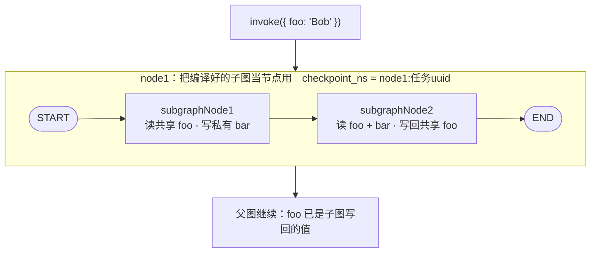

import { Canvas, Controls, Meta } from '@storybook/addon-docs/blocks';
import * as Subgraphs from './subgraphs.stories';

<Meta of={Subgraphs} name="Docs" />

# 子图

到上一课为止，中断、恢复和历史回放都发生在一张图里；真实系统里更常见的形态是**一张图里装着另一张图**——把「检索 → 重排 → 过滤」整套流程、或者一个完整的 Agent，封装成一个可复用的单元，挂进更大的编排里。这就是子图（subgraph）：**一张编译好的图，被当作父图的一个节点使用**。本课讲清三件事：父子图的状态怎么对上（同名键自动共享，还是用包装节点显式转换）、子图的状态存在哪（独立的 `checkpoint_ns` 命名空间，以及子图自己的 checkpointer 三态）、中断怎么穿透（子图内 `interrupt` 一路传到顶层，恢复入口也在顶层）。读完你应该能预测：往 `addNode` 里传一个编译后的图会发生什么、子图里读不读得到父图的键、在子图中间暂停后从哪里恢复。



| 关键输入 | 默认 / 格式 | 回查要点 |
| --- | --- | --- |
| `addNode('node1', subgraph)` | 传入**编译后**的图 | 前提：父子图共享状态键；自动获得基于节点名的稳定命名空间 |
| 包装节点 | 父节点函数内 `await subgraph.invoke(...)` | schema 不一致时显式转换输入与输出 |
| 子图 `compile({ checkpointer })` | 不传 = per-invocation | `true` = per-thread（跨调用累积）；`false` = stateless（无 checkpoint） |
| 父图 checkpointer | — | 子图的中断、状态查看、跨调用记忆都要求父图编译时带 checkpointer |
| `getState(config, { subgraphs: true })` | `subgraphs` 默认 `false` | 子图快照在 `tasks[i].state`；默认 per-invocation 只在暂停期间可查 |
| `checkpoint_ns` | 根图 `''`；子图 `节点名:任务uuid`；嵌套用 `\|` 连接 | 子图状态的独立寻址单元 |
| `Command({ graph: Command.PARENT, goto })` | `graph` 默认当前图 | 跳到最近父图的节点；更新共享键须给父图该键定义 reducer |

## 快速上手

最小闭环不需要模型 API key：写一个共享 `foo` 通道的子图，编译后直接传给父图的 `addNode`（`npm i @langchain/langgraph` 后 `npx tsx shared-keys.ts` 运行）：

```ts
// shared-keys.ts —— 共享状态键：把编译好的子图直接作为父图节点。
import { Annotation, END, START, StateGraph } from '@langchain/langgraph';

// 父子图声明同名通道 foo：挂载后自动映射为同一条通道
const State = Annotation.Root({ foo: Annotation<string>() });

const subgraph = new StateGraph(State)
  .addNode('subgraphNode1', (state) => ({ foo: `你好，${state.foo}` }))
  .addEdge(START, 'subgraphNode1')
  .addEdge('subgraphNode1', END)
  .compile();                       // 子图：先编译，才能作为节点挂载

const graph = new StateGraph(State)
  .addNode('node1', subgraph)       // 直接传编译后的图，不写包装函数
  .addEdge(START, 'node1')
  .addEdge('node1', END)
  .compile();

console.log(await graph.invoke({ foo: '世界' }));
// { foo: '你好，世界' }
```

对父图来说，`node1` 就是一个普通节点：进了 `foo`、出了更新后的 `foo`，内部结构不可见。下面展开它内部到底发生了什么。

## 为什么用子图

官方文档给子图列的三个动机，对应三种真实压力：

- **封装多步流程**：一组固定协作的节点（检索 → 重排 → 过滤）收进一张子图，父图的结构图和状态定义保持简明，控制流不必铺开每个细节。
- **复用**：同一张编译好的子图可以挂进多个父图，也可以在一个父图里多个位置使用——逻辑只维护一份。
- **团队分工**：只要子图的输入 / 输出 schema（对外的接口）不变，父图不需要了解子图内部怎么实现；不同人各写一张图，最后拼装。

构建 multi-agent 系统是这些动机的叠加（supervisor 手下的每个 agent 本质都是子图），也是子图最主要的生产场景——多智能体的编排模式归[多智能体](?path=/docs/multi-agent-overview--docs)一课，本课只管「图怎么嵌进图」这套通用机制。

## 状态映射

父子图协作的全部决策集中在一点：**两份 state schema 怎么对上**。官方文档按这个判据把通信分成两种模式：

| 模式 | 适用场景 | 接线方式 |
| --- | --- | --- |
| 共享状态键 | 父子图 schema 一致（或有同名通道），子图直接读写父图的通道 | 编译后的子图直接传给 `addNode` |
| 包装节点 | 父子图 schema 不同，或需要在两者之间做状态转换 | 父节点函数里调用 `subgraph.invoke()`，进出各做一次显式映射 |

下面的回放把两种模式放进同一个父图对照：中间映射区显示键怎么流动，底部显示子图在自己的 checkpoint 命名空间里留下的快照。

<Canvas of={Subgraphs.Interactive} />
<Controls of={Subgraphs.Interactive} />

| 读者操作 | 可观察证据 |
| --- | --- |
| 切到「共享状态键」 | 映射区变为 foo ⇄ foo 同名直通；子图卡片多出灰色的 bar——父图卡片里自始至终没有 bar，私有键不进父图 state |
| 切到「包装节点」 | 子图卡片只剩 bar：`foo` 在子图内部不存在；映射区变为「进入 `invoke({ bar: foo })` / 返回 `return { foo: bar }`」两条显式转换 |
| 推进「子图推进」到 1 | subgraphNode1 完成，私有 bar 就绪；父图 foo 仍是输入值（子图还没写回） |
| 推进「子图推进」到 2 | 共享键模式下父图 foo 变为子图写回的 `hi! Bob, how are you?`；包装模式下包装节点把 bar 转换写回 foo |
| 观察底部两条链 | 父图链 `checkpoint_ns` 为空串、子图链为 `node1:1ef6a2c4…`——子图快照落在独立命名空间，随推进逐格增长 |
| 打开 Show code | 看到该 Canvas 实际执行的 `example.ts`：纯 TS 确定性模拟，不依赖 `@langchain/*` |

### 共享状态键

父子图声明同名通道时，挂载后的子图读写的**就是父图那条通道**——不是拷贝，没有同步开销。子图还可以声明父图没有的**私有键**，作为内部工作区：

```ts
// shared-private-keys.ts —— 共享键直通 + 私有键隔离。
// 运行条件：npm i @langchain/langgraph；npx tsx shared-private-keys.ts（不需要模型 API key）。
import { Annotation, END, START, StateGraph } from '@langchain/langgraph';

const SubgraphState = Annotation.Root({
  foo: Annotation<string>(),   // 与父图同名：共享通道，双向可见
  bar: Annotation<string>(),   // 子图私有：父图 state 里没有这个键
});

const subgraph = new StateGraph(SubgraphState)
  .addNode('subgraphNode1', (state) => ({ bar: `hi! ${state.foo}` }))
  .addNode('subgraphNode2', (state) => ({ foo: `${state.bar}, how are you?` }))
  .addEdge(START, 'subgraphNode1')
  .addEdge('subgraphNode1', 'subgraphNode2')
  .addEdge('subgraphNode2', END)
  .compile();

const ParentState = Annotation.Root({ foo: Annotation<string>() });

const graph = new StateGraph(ParentState)
  .addNode('node1', subgraph)
  .addEdge(START, 'node1')
  .addEdge('node1', END)
  .compile();

console.log(await graph.invoke({ foo: 'Bob' }));
// { foo: 'hi! Bob, how are you?' }   —— bar 不在其中：私有键留在子图
```

注意输出里没有 `bar`：私有键只在子图执行期间存在，父图的最终状态里看不到它。这条「可见性单向收窄」的规则反过来也成立，是共享键模式最重要的边界——**子图只能看到自己 schema 里声明的通道**。父图有 `users`、`messages`、`docs` 三个键，子图 schema 里只声明了 `messages`，子图节点读到的就只有 `messages`；父图的键不会自动漏进来。要读，就在子图 schema 里声明同名共享键。

### 包装节点

schema 对不上（父图用 `docs`，子图期望 `query`；或子图是一段不该被父图 schema 约束的独立实现）时，退回普通节点的写法：父节点函数里调用子图，进出各做一次映射：

```ts
// wrapper-node.ts —— schema 不一致：包装节点内调用子图并显式转换。
// 运行条件：npm i @langchain/langgraph；npx tsx wrapper-node.ts（不需要模型 API key）。
import { Annotation, END, START, StateGraph } from '@langchain/langgraph';

// 子图只认识 bar：父图的 foo 它看不到，也不需要知道
const SubgraphState = Annotation.Root({ bar: Annotation<string>() });

const subgraph = new StateGraph(SubgraphState)
  .addNode('subgraphNode1', (state) => ({ bar: `hi! ${state.bar}` }))
  .addEdge(START, 'subgraphNode1')
  .addEdge('subgraphNode1', END)
  .compile();

const ParentState = Annotation.Root({ foo: Annotation<string>() });

const graph = new StateGraph(ParentState)
  .addNode('node1', async (state) => {
    // 父 → 子：把 foo 映射成子图的输入
    const out = await subgraph.invoke({ bar: state.foo });
    // 子 → 父：把子图输出映射回父图通道
    return { foo: out.bar };
  })
  .addEdge(START, 'node1')
  .addEdge('node1', END)
  .compile();

console.log(await graph.invoke({ foo: 'Bob' }));
// { foo: 'hi! Bob' }
```

多级嵌套（parent → child → grandchild）是同一模式的逐层应用：child 的节点里映射 grandchild 的键，parent 的节点里映射 child 的键，每层只认识相邻层。官方文档的三级示例强调的仍是那条规则：grandchild 内部访问不到 child / parent 的键，层与层之间只靠显式转换通信：

```ts
// 两级嵌套的中间层：对上、对下各做一次键映射
const child = new StateGraph(ChildState)
  .addNode('child1', async (state) => {
    const out = await grandchild.invoke({ myGrandchildKey: state.myChildKey });
    return { myChildKey: out.myGrandchildKey };
  })
  .addEdge(START, 'child1')
  .compile();
```

两种模式的取舍：共享键省掉胶水代码、`messages` 这类通道天然适合直通，是父子图同属一个应用时的默认选择；包装节点让子图保持彻底的 schema 独立——子图可以被不同父图复用、由不同团队维护，接口收敛在映射函数里。判据始终是「两份 schema 是否应该耦合」。

## checkpoint 命名空间

父图带 checkpointer 时，子图的状态**不与父图混存**。「持久化」一课已经提到 `checkpoint_ns` 字段，这里补齐它的构造规则（与 `@langchain/langgraph` 源码一致）：

- 根图的命名空间是**空字符串** `''`；
- 挂在 `node1` 下的子图，命名空间是 `节点名:任务 uuid`（如 `node1:1ef6a2c4-…`）；
- 再往里嵌套，用 `|` 连接（如 `node1:uuid|inner:uuid`）。

命名空间是子图状态的**独立寻址单元**：子图的每份 checkpoint 写进自己 `checkpoint_ns` 下的存储，父图的 `getState` 默认只读根图命名空间——这就是「持久化」一课那条常见问题（`getState` 看不到子图内部状态）的根源，解法见下面的「查看子图状态」。

同一个子图被多次调用时，命名空间还决定了状态是否延续——这正是子图持久化三态的分界线。

### 子图持久化三态

子图 `compile()` 的 `checkpointer` 参数比父图多两种取法，官方文档对应三种模式：

| 子图 `compile({ checkpointer })` | 官方名称 | 行为 |
| --- | --- | --- |
| 不传（默认） | per-invocation | 每次调用全新开始；**单次调用内**继承父 checkpointer，支持中断与持久执行 |
| `true` | per-thread | 状态在同一 thread 上跨调用累积，每次调用接着上次 |
| `false` | stateless | 完全不产生 checkpoint，像普通函数调用；不支持中断，崩溃只能从头重跑 |

三个前提和限制，都来自官方文档的 Note / Warning：

- **父图必须编译时带 checkpointer**，子图的持久化特性（中断、状态查看、跨调用记忆）才工作。父图没有，子图传什么都没用。
- per-invocation 是默认值，也是官方对多数应用（含 multi-agent）的推荐：多次调用各自全新、互不冲突，天然支持并行。
- **per-thread 不支持同一子图被并行调用**：并行调用写同一个命名空间，会产生 checkpoint 冲突。官方 multi-agent 示例用 `toolCallLimitMiddleware` 限制工具并发来规避；纯 LangGraph 要自己禁止并行。
- 节点内 `invoke` 的 per-thread 命名空间**按调用顺序分配**，重排调用顺序会把状态串到别的子图上；解决方法是给每个子图包一层 `StateGraph` 并用唯一节点名 `addNode(name, agent)` 换取稳定命名空间。**作为节点挂载的子图自动获得基于名称的稳定命名空间**，无需这层包装。

per-invocation 与 per-thread 的差异可以用一个纯函数对照观察——子图私有键 `runs` 记录累计调用次数：

```ts
// per-thread.ts —— 子图 checkpointer: true：同一 thread 上跨调用累积。
// 运行条件：npm i @langchain/langgraph；npx tsx per-thread.ts（不需要模型 API key）。
import { Annotation, END, MemorySaver, START, StateGraph } from '@langchain/langgraph';

const SubgraphState = Annotation.Root({
  foo: Annotation<string>(),    // 共享键：向父图汇报
  runs: Annotation<number>({    // 私有键：累计调用次数
    reducer: (current, update) => current + update,
    default: () => 0,
  }),
});

const subgraph = new StateGraph(SubgraphState)
  .addNode('tick', (state) => ({
    runs: 1,
    foo: `第 ${state.runs + 1} 次运行`,
  }))
  .addEdge(START, 'tick')
  .addEdge('tick', END)
  .compile({ checkpointer: true });   // per-thread：状态跨调用累积

const ParentState = Annotation.Root({ foo: Annotation<string>() });

const graph = new StateGraph(ParentState)
  .addNode('node1', subgraph)
  .addEdge(START, 'node1')
  .addEdge('node1', END)
  .compile({ checkpointer: new MemorySaver() });   // 父图必须带 checkpointer

const config = { configurable: { thread_id: 'demo-1' } };
console.log(await graph.invoke({ foo: '' }, config));   // { foo: '第 1 次运行' }
console.log(await graph.invoke({ foo: '' }, config));   // { foo: '第 2 次运行' }
// 对照：子图不传 checkpointer（默认 per-invocation）时，第二次输出仍是
// '第 1 次运行'——每次调用全新开始。
```

## 中断与穿透

子图内部的 `interrupt()` 与[人机协同](?path=/docs/human-in-the-loop--docs)一课是同一个机制，多出的一条规则是**穿透**：无论嵌套多深，子图（乃至子图的子图）里的中断都会向上传播到顶层 `invoke`——它正常返回（不是抛异常），中断请求挂在 `__interrupt__` 上。恢复的入口也只有一个：**顶层图**，用同 thread 的 `new Command({ resume })`，resume 值沿调用链送回子图的中断点继续执行。

```ts
// subgraph-interrupt.ts —— 子图内 interrupt 穿透到顶层，恢复入口也在顶层。
// 运行条件：npm i @langchain/langgraph；npx tsx subgraph-interrupt.ts（不需要模型 API key）。
import { Annotation, Command, END, interrupt, MemorySaver, START, StateGraph } from '@langchain/langgraph';

const State = Annotation.Root({ foo: Annotation<string>() });

const subgraph = new StateGraph(State)
  .addNode('node1', async (state) => {
    // interrupt 尽量写在节点最前面：恢复时节点从头重跑，前面的副作用会重复
    const answer = interrupt('需要人工补充信息');
    return { foo: `${state.foo} / ${answer}` };
  })
  .addEdge(START, 'node1')
  .addEdge('node1', END)
  .compile();   // 不传 checkpointer：默认 per-invocation，单次调用内继承父 checkpointer

const graph = new StateGraph(State)
  .addNode('node1', subgraph)
  .addEdge(START, 'node1')
  .addEdge('node1', END)
  .compile({ checkpointer: new MemorySaver() });   // 父图带 checkpointer：中断才能挂起

const config = { configurable: { thread_id: 'demo-1' } };

// 第一次 invoke：停在子图内部，正常返回，中断请求在 __interrupt__
const paused = await graph.invoke({ foo: 'Bob' }, config);
const [request] = (paused as { __interrupt__?: Array<{ value: unknown }> })
  .__interrupt__ ?? [];
console.log(request?.value);   // '需要人工补充信息'

// 恢复入口在顶层：resume 值沿调用链送回子图的中断点
const done = await graph.invoke(new Command({ resume: '已补充' }), config);
console.log(done.foo);   // 'Bob / 已补充'
```

三个边界条件：中断穿透**要求父图带 checkpointer**（挂起状态要有地方存）；默认 per-invocation 与 per-thread 都支持中断，**stateless（`checkpointer: false`）不支持**——没有 checkpoint 就没有挂起；包装节点（节点内 `invoke`）模式里中断同样穿透到顶层，恢复也一样，只是子图状态未必能查——见下一节。`interrupt` / resume 的完整机制（恢复时哪些代码重跑、如何分叉）归[中断与时间旅行](?path=/docs/interrupts-time-travel--docs)一课。

## 查看子图状态

`getState` 默认只返回根图快照。加 `{ subgraphs: true }` 后，待执行任务的描述里会多出子图自己的完整快照：

```ts
// 图结构与上一节 subgraph-interrupt.ts 相同：子图节点内 interrupt，当前处于暂停
const config = { configurable: { thread_id: 'demo-1' } };
await graph.invoke({ foo: 'Bob' }, config);   // 停在子图内部

// subgraphs: true：tasks[i].state 是子图自己的 StateSnapshot
const snap = await graph.getState(config, { subgraphs: true });
const sub = snap.tasks[0].state;
console.log(sub.values);                              // { foo: 'Bob' }
console.log(sub.next);                                // ['node1'] —— 子图停在它自己的 node1
console.log(sub.config.configurable.checkpoint_ns);   // 'node1:1ef6a2c4-…'
```

`sub` 就是一个普通的 `StateSnapshot`（字段含义见[持久化](?path=/docs/persistence--docs)一课）：`values` 是子图视角的状态、`next` 是子图内部待执行的节点、`config.configurable.checkpoint_ns` 就是那条独立命名空间。三态下的可见性差异：

| 子图模式 | `tasks[i].state` 能看到什么 |
| --- | --- |
| per-invocation（默认） | 只返回**当前这次调用**的状态，且只在暂停（中断）期间可查——调用结束后没有累积状态 |
| per-thread | 该 thread 上**所有调用累积**的状态 |
| stateless | 无子图 checkpoint，不可查 |

最后一个限制来自静态发现：子图必须能被父图**静态识别**——作为节点挂载，或在节点内直接 `invoke`。放进 tool 函数里调用（subagents 的常见形态）属于间接调用，`tasks[i].state` 拿不到子图状态，但中断仍然会穿透传播到顶层。想在运行前枚举子图本身，编译后的图提供 `getSubgraphs()` / `getSubgraphsAsync()`；画结构图时 `getGraphAsync({ xray: true })` 会把子图内部展开画进父图，而不是只画一个节点框。

## 从子图跳回父图

控制流默认被关在子图里：子图跑到自己的 END，控制权交还父图的下一超步。要提前改走父图的路径，用[Graph API](?path=/docs/graph-api--docs)一课见过的 `Command`，把 `graph` 指到 `Command.PARENT`：

```ts
// parent-nav.ts —— 子图节点返回 Command.PARENT：导航目标换成最近的父图。
// 运行条件：npm i @langchain/langgraph；npx tsx parent-nav.ts（不需要模型 API key）。
import { Annotation, Command, END, START, StateGraph } from '@langchain/langgraph';

const concat = (current: string, update: string) =>
  current ? `${current} → ${update}` : update;

const SubgraphState = Annotation.Root({
  // 共享键会被父图与子图先后写入：必须定义 reducer（原因见下文）
  foo: Annotation<string>({ reducer: concat, default: () => '' }),
});

const subgraph = new StateGraph(SubgraphState)
  .addNode(
    'nodeA',
    async () =>
      new Command({
        update: { foo: '子图结果' },
        goto: 'nodeC',           // 父图中的节点名
        graph: Command.PARENT,   // 目标不是当前子图，而是最近的父图
      }),
    { ends: ['nodeC'] },         // 声明可达目标：渲染与类型检查需要
  )
  .addEdge(START, 'nodeA');

const ParentState = Annotation.Root({
  foo: Annotation<string>({ reducer: concat, default: () => '' }),
  log: Annotation<string[]>({
    reducer: (current, update) => current.concat(update),
    default: () => [],
  }),
});

const graph = new StateGraph(ParentState)
  .addNode('node1', subgraph)
  .addNode('nodeC', async (state) => ({ log: [`nodeC 看到 foo=${state.foo}`] }))
  .addEdge(START, 'node1')
  .addEdge('nodeC', END)
  .compile();

console.log(await graph.invoke({ foo: '', log: [] }));
// { foo: '子图结果', log: ['nodeC 看到 foo=子图结果'] }
```

输出证明两件事同时发生：子图的 `update` 写进了**父图**的 `foo`（nodeC 读到了），控制流跳到了父图的 `nodeC`（log 里有记录）。`graph: Command.PARENT` 总是导航到**最近的**那层父图，多级嵌套时逐层使用即可。

一条文档明确要求的规则：**从子图向父图更新共享键时，父图 state 里该键必须定义 reducer**。原因回到「Graph API」一课的通道模型——这个键会被子图内部的执行和父图层的 `Command.update` 先后写入，没有 reducer 的 last-value 通道不接纳多次写入，直接抛 `InvalidUpdateError`。只在子图内部更新自己的私有键，则不受此限。

子图的执行输出（含内部各节点的更新）如何流出来，归[图级流式](?path=/docs/graph-streaming--docs)一课：`streamEvents` 配合 `subgraphs: true`，嵌套运行的路径前缀（如 `['node1:1ef6…']`）标识是哪个父节点下的子图在产出。

## 最佳实践

- 通信模式按 schema 耦合度选：父子图同属一个应用、共享 `messages` 等通道，默认共享键直接挂载；子图要复用到不同父图或由不同团队维护，用包装节点把接口收敛在映射函数里，schema 各自独立演进。
- 子图持久化从默认 per-invocation 起步：多次调用各自全新、天然可并行，官方也把它列为多数场景的推荐。确需子图记住跨调用状态（一个有连续记忆的专家子代理）才升 per-thread，并接受「同一子图不能并行调用」的约束。
- 命名空间求稳：需要 per-thread、或要按名字定位子图状态时，用唯一节点名 `addNode(name, agent)` 包一层换取稳定命名空间；作为节点挂载的子图天然如此。避免依赖「节点内 invoke 按调用顺序分配」的命名空间——重排调用顺序会把状态串走。
- 调试时用 `getGraphAsync({ xray: true })` 画结构图、用 `getState(config, { subgraphs: true })` 看子图快照：前者把子图内部展开，后者把独立命名空间里的状态取出来，两者都比「往子图里加日志」直接。

## 常见问题

- 子图节点里读不到父图的 state 键？
  设计行为：子图只能看到自己 schema 声明的通道，父图的键不会自动漏进来。要读就在子图 schema 里声明同名共享键；schema 不想耦合就在父图写包装节点做显式转换。
- `getState` 之后 `tasks[0].state` 是 `undefined`？
  按顺序查三件事：`{ subgraphs: true }` 传了没有（默认 `false` 只返回根图快照）；子图是不是静态可发现——放进 tool 函数里 `invoke` 属于间接调用，查不到（但中断仍会穿透）；默认 per-invocation 的子图跑完就没有可查状态，要在暂停（中断）期间查。
- 子图第二次调用没有记住上次的状态？
  默认 per-invocation 每次调用全新开始，这是推荐行为。确要跨调用记忆，子图 `compile({ checkpointer: true })`（per-thread），并确认父图编译时带了 checkpointer。
- per-thread 子图并行调用后 checkpoint 冲突 / 状态串了？
  同一 per-thread 子图并行调用写同一命名空间，官方明确不支持。禁止并行调用（官方 multi-agent 示例用 `toolCallLimitMiddleware` 限制），或给每个子图唯一节点名隔离命名空间；节点内 `invoke` 的 per-thread 命名空间按调用顺序分配，重排调用顺序同样会串状态。
- 子图返回 `Command.PARENT` 后抛 `InvalidUpdateError`？
  从子图向父图更新共享键时，父图 state 里这个键必须有 reducer——它会被子图内部与父图层先后写入，last-value 通道不接纳多写。给共享键加 reducer，或改为更新父图独有的键。
- `checkpointer: false` 的子图中断后恢复不了、崩溃后从头重跑？
  设计行为：stateless 完全不产生 checkpoint，不支持 interrupt 与持久执行。需要中断与恢复就回到默认（不传），并保证父图带 checkpointer。

## 总结回顾

摘要：

子图是一张编译好的图被当作父图节点复用，动机是封装、复用与团队分工。父子图的全部通信归结为两份 schema 怎么对上：声明同名通道即共享，子图直接读写父图通道、私有键留在子图内部且子图看不到父图未共享的键；schema 不一致时用包装节点，进出各做一次显式映射，多级嵌套逐层同理。持久化侧，子图状态落在独立的 `checkpoint_ns`（根图空串、子图 `节点名:任务uuid`、嵌套用 `|` 连接）；子图 `compile` 的 checkpointer 有三态——默认 per-invocation 每次全新但单次调用内继承父 checkpointer，`true` 为 per-thread 跨调用累积（不能并行、命名空间要稳），`false` 为 stateless 无 checkpoint；三态都要求父图带 checkpointer。子图内 `interrupt` 无论多深都穿透到顶层，恢复入口是顶层 `Command({ resume })`。查看用 `getState(config, { subgraphs: true })` 的 `tasks[i].state`，受静态发现限制。`Command({ graph: Command.PARENT })` 让子图直接改走父图路径，更新共享键必须给父图该键配 reducer。

一句话：

> 子图没有引入新机制——它只是让一张编译好的图成为节点；真正需要你设计的，是两份 state schema 怎么对上（同名共享或显式转换），其余一切由这个映射加上父图的 checkpointer 决定。

知识要点：

- 官方给子图列的三个动机是什么？它们分别对应什么真实压力？
- 两种通信模式的判据是什么？`addNode('node1', subgraph)` 直接可用的前提是什么？
- 共享键模式下，子图私有键在父图最终状态里吗？子图能读到父图未共享的键吗？
- 包装节点在什么时候用？进入和返回各做什么？多级嵌套时每层做什么？
- `checkpoint_ns` 的构造规则是什么？根图、子图、嵌套子图各是什么形态？
- 子图 `compile` 的 checkpointer 三态各是什么行为？默认是哪个？都要求父图做什么？
- per-thread 为什么不能并行调用同一子图？怎么换取稳定的命名空间？
- 子图里的 `interrupt` 在哪里被观察到？从哪里恢复？哪种子图模式不支持？
- `getState` 怎么拿到子图快照？拿不到时按什么顺序排查？
- `Command.PARENT` 做什么？更新共享键时为什么必须给父图该键定义 reducer？

## 参考资料

- [Use subgraphs（官方：两种通信模式、多级嵌套、子图持久化三态与命名空间、中断穿透、查看子图状态）](https://docs.langchain.com/oss/javascript/langgraph/use-subgraphs)
- [Use Graph API（官方：Command.PARENT 从子图导航到父图节点、共享键须配 reducer）](https://docs.langchain.com/oss/javascript/langgraph/use-graph-api)
