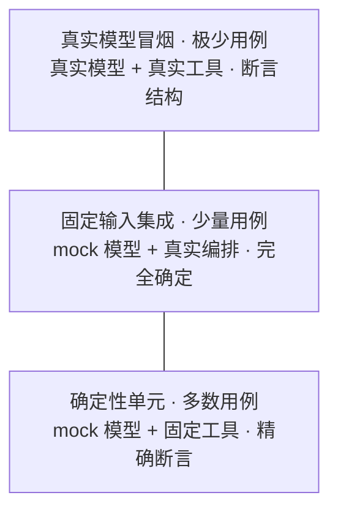

import { Canvas, Controls, Meta } from '@storybook/addon-docs/blocks';
import * as Testing from './testing.stories';

<Meta of={Testing} name="Docs" />

# 测试

[LangSmith 追踪](?path=/docs/langsmith-observability--docs)是事后看执行，测试是事前锁行为。Agent 恰恰是最需要事前锁行为的代码：LLM 输出非确定、模型在循环里自己决定下一步、工具带外部副作用，直接"跑一遍看看"既慢又贵还时好时坏。本课给出官方文档的解法：测试金字塔——确定性单元测试（mock 模型 + 固定工具，毫秒级、免费、完全确定）占多数，固定输入的集成测试验证编排，真实模型只留极少量冒烟。读完你能回答：一个被测对象该放进哪一层、`fakeModel()` 怎么把模型换成排队的假模型、断言怎么写才不 flaky、LangGraph 图怎么隔离着测、`*.int.test.ts` 怎么与单元测试分层执行。



| 层 | 模型 | 工具 | 断言 | 速度与成本 | 确定性 |
| --- | --- | --- | --- | --- | --- |
| 确定性单元（多数） | `fakeModel()` 排队响应 | 真实纯函数，直接调用 | `toBe` / `toEqual` 精确相等 | 毫秒级，无 key 免费 | 完全确定 |
| 固定输入集成（少量） | `fakeModel()` 排队响应 | 真实工具，验证完整编排 | 消息结构 / 调用序列 / 最终状态 | 秒内，无 key 免费 | 完全确定 |
| 真实模型冒烟（极少） | 真实轻量模型 | 真实工具 | 结构断言 / 宽松正则 / 结构化字段 | 秒级，按 token 计费 | 非确定 → 只断言结构 |

## 快速上手

一个不需要 API key、毫秒级跑完的 agent 测试。前置：任意 jest + ts-jest 工程（`tester/` 就是现成参照——`jest.config.mjs` + `jest.setup.js` 两个文件），且 `langchain` ≥ 1.2.30（`fakeModel` 从该版本起由 `langchain` 根导出；旧版本走本课「经典 Fake 与自定义假模型」）：

```bash
npm i -D jest ts-jest @types/jest
npm i langchain zod
```

```ts
// weather.unit.test.ts —— 单元层：mock 模型，不需要 API key
import { AIMessage, HumanMessage, createAgent, fakeModel, tool } from 'langchain';
import * as z from 'zod';

// 固定工具：纯函数，输出是已知量
const getWeather = tool(
  ({ city }: { city: string }) => `It's always sunny in ${city}!`,
  {
    name: 'get_weather',
    description: 'Get the weather for a given city',
    schema: z.object({ city: z.string() }),
  }
);

describe('weather agent（单元）', () => {
  test('按排队响应走完 工具调用 → 最终回复 一圈', async () => {
    // 模型被替换成假模型：第一次要求调工具，第二次给出最终回复
    const model = fakeModel()
      .respondWithTools([{ name: 'get_weather', args: { city: 'Tokyo' }, id: 'call_1' }])
      .respond(new AIMessage("It's always sunny in Tokyo!"));

    const agent = createAgent({ model, tools: [getWeather] });

    const result = await agent.invoke({
      messages: [new HumanMessage("What's the weather in Tokyo?")],
    });

    // 输出是排队的固定值，可以精确断言——真实模型下做不到
    expect(result.messages.at(-1)?.content).toBe("It's always sunny in Tokyo!");
    expect(model.callCount).toBe(2); // 模型恰好被调用两次：要工具 → 给结论
  });
});
```

```bash
npx jest weather.unit.test.ts
```

可观察结果：测试通过，耗时毫秒级；断网、删掉 `OPENAI_API_KEY` 照样过——因为模型从未被真正调用，工具是纯函数。这个文件同时用到了本课的三个主角：mock 模型（`fakeModel`）、固定工具（纯函数 `getWeather`）、对最终状态断言（`content` 与 `callCount`）。

## 测试金字塔

**Agent 为什么难测。** 三个来源叠加：LLM 对同一输入给出不同输出（非确定性）；Agent 循环里模型自己决定下一步，一次判断错误会带着整个循环跑偏（错误累积）；真实调用需要 API key、要花钱、依赖网络。官方文档对此的判断是：agentic 应用"tend to lean more on integration"——组件链式组合，且非确定性天然带来 flakiness。所以策略不是"少测"，而是**按确定性分层，把不依赖真实模型的测试全部下沉**。

**三层各替换什么。** 金字塔的本质是一张"替换清单"：

- **确定性单元（多数）：** 替换模型，保留工具。被测对象是纯逻辑——工具函数、提示组装、状态更新、中间件。`fakeModel()` 排队固定响应后，整条链路完全确定，可以逐字精确断言。
- **固定输入集成（少量）：** 替换模型，保留编排。被测对象是协作——`createAgent` 的循环、图的边、工具结果如何回流到下一轮模型调用。真实跑完整个 agent / 图，但模型输出仍由假模型固定。
- **真实模型冒烟（极少）：** 什么都不替换，放宽断言。被测对象就是真实模型的行为：凭证有效、schema 能被模型接受、延迟可接受、最终回答的结构正确。

第三条路是评估（evals：数据集、LLM-as-judge、回归对比）——它回答"输出质量好不好"，与本课"行为对不对"是两类问题，归[「Agent 评估」](?path=/docs/agent-evals--docs)。

**怎么选层。** 按被测对象判断，不按代码位置判断：

| 被测对象 | 落点 | 理由 |
| --- | --- | --- |
| 工具函数体、输入校验、提示组装 | 确定性单元 | 输出只由输入决定，与模型无关 |
| Agent 循环、图的边、状态流转 | 固定输入集成 | 编排要真跑，模型输出可固定 |
| 工具选择倾向、回答措辞质量 | 冒烟或评估 | 被测对象就是模型行为，无法 mock |

下面的实例把这张映射做成可操作的演示。切换「被测对象」，观察它落到哪一层、该层的模型 / 工具 / 断言配置如何随之变化：

<Canvas of={Testing.PyramidMap} />
<Controls of={Testing.PyramidMap} />

| 读者操作 | 可观察证据 |
| --- | --- |
| 切换「被测对象」为工具函数 | 高亮底层「确定性单元」：模型列是 `fakeModel()`，断言列是精确相等——纯函数不经过模型 |
| 切换为 Agent 编排 | 高亮中层「固定输入集成」：工具保持真实、模型仍为假——验证的是编排而非模型 |
| 切换为最终回答 | 高亮顶层「真实模型冒烟」：模型列变为真实轻量模型，断言列变为结构断言——非确定性被转移到断言策略消化 |
| 对照左下读数 | 「落点层级 / 模型 / 断言」与右侧配置卡同步变化 |
| 打开 Show code | 看到该 Canvas 实际执行的 `example.ts`：纯确定性映射，不依赖 `@langchain/*` |

测试与观测的分工：单元与集成层的断言失败直接指向代码行；冒烟层失败时，开着 [LangSmith 追踪](?path=/docs/langsmith-observability--docs)重跑一次，从 trace 里看模型实际收到了什么——测试负责发现问题，trace 负责解释问题。

## mock 模型

共同模型只有一句话：`createAgent` 的 `model` 参数和图节点消费的都是统一的模型接口（`BaseChatModel`），任何满足接口的对象都能注入。mock 的本质是**用确定性响应替换非确定的网络调用，接口保持不变**——Agent 代码零改动，测试里换成假模型即可。LangChain 给的配套是 `fakeModel()`（新 API，主线）与经典 Fake 系列（旧版本回退）。

### fakeModel：排队的假模型

`import { fakeModel } from 'langchain'`（`@langchain/core/testing` 同源）。它是链式 builder：用 `.respond()` 排队响应，每次 `invoke()` 按先进先出消费一条；队列耗尽后再调用会抛错——这个错误本身有用，见「常见问题」。

```ts
import { AIMessage, HumanMessage, fakeModel } from 'langchain';

const model = fakeModel()
  .respond(new AIMessage('I can help with that.'))
  .respond(new AIMessage("Here's what I found."));

const r1 = await model.invoke([new HumanMessage('Can you help?')]);
// r1.content === 'I can help with that.'
```

工具调用用 `.respondWithTools()` 排队：每项只要 `name` 和 `args`，`id` 可省略（自动生成）。它与 `.respond()` 混排，正好覆盖 agent 循环"要工具 → 给结论"的交替：

```ts
const model = fakeModel()
  .respondWithTools([{ name: 'get_weather', args: { city: 'SF' }, id: 'call_1' }])
  .respond(new AIMessage("It's 72°F and sunny in San Francisco."));
```

一个关键行为：`createAgent` / LangGraph 内部会对模型 `bindTools()`，而 `fakeModel().bindTools()` 返回的绑定对象**与原模型共享同一个队列和调用记录**。所以队列按"模型的全部调用"连续计数，不需要为绑定单独排队，检查也统一走原 model——「快速上手」的 `callCount === 2` 能成立，靠的就是这条。

| API | 作用 |
| --- | --- |
| `fakeModel()` | 创建可链式配置的假模型，可传入任何需要模型的位置 |
| `.respond(msg \| err \| factory)` | 排队一条响应：消息、要抛的错误、或按输入计算的工厂函数 |
| `.respondWithTools([{ name, args, id? }])` | 排队一条带 `tool_calls` 的 `AIMessage`，`id` 省略时自动生成 |
| `.alwaysThrow(err)` | 忽略队列，每次调用都抛该错误 |
| `.structuredResponse(value)` | 固定 `withStructuredOutput()` 的返回值，schema 被忽略 |
| `.callCount` / `.calls[i].messages` | 模型被调次数 / 每次调用收到的完整消息数组 |

### 看见模型收到了什么：calls 与 callCount

`calls` 记录每次 `invoke()` 收到的 `messages` 与 `options`，按序排列；即使该次调用抛错，记录也保留。它回答的是单元测试里最值钱的问题：**工具的结果真的回到了模型吗？系统提示和历史在第 N 轮长什么样？**

```ts
// 延续快速上手的 weather agent：断言工具结果回流给了第二次模型调用
expect(model.callCount).toBe(2);

const secondCallMessages = model.calls[1].messages;
const toolResult = secondCallMessages.find((m) => ToolMessage.isInstance(m));
expect(toolResult?.content).toBe("It's always sunny in Tokyo!"); // get_weather 的真实输出
```

这组断言同时锁住了两件事：agent 循环把 `ToolMessage` 追加进了下一轮输入（编排正确），以及真实工具的输出原样到达模型（固定工具的价值）。排查生产问题时，`calls` 里的消息数组就是你在 LangSmith trace 里看到的模型输入——同一个东西，一个在测试里、一个在平台上。

### 错误注入与动态响应

三类进阶排队，覆盖错误路径和"按输入回应"的场景：

```ts
// 1. 特定轮次抛错：该次调用抛出，队列继续——测重试与错误处理逻辑
const retryModel = fakeModel()
  .respond(new Error('rate limit exceeded'))
  .respond(new AIMessage('recovered'));

// 2. 每次都抛：测降级路径，不关心第几次失败
const downModel = fakeModel().alwaysThrow(new Error('service unavailable'));

// 3. 工厂函数：按收到的消息动态返回——比如把用户输入原样回显
const echoModel = fakeModel().respond((messages) => {
  const last = messages[messages.length - 1].text;
  return new AIMessage(`You said: ${last}`);
});
```

工厂函数的坑：**每个函数只占一个队列位、只消费一次**。要连续回应多次调用，就多次 `.respond(factory)` 排队。

结构化输出场景用 `.structuredResponse(value)`：传给 `withStructuredOutput()` 的 schema 会被忽略、始终返回配置值——测试聚焦"拿到结构化结果后应用怎么处理"，而不是解析器。对 `createAgent` 的 `responseFormat` 同理：走模型原生结构化输出的实现直接用 `.structuredResponse()` 固定值；把 schema 编译成一个工具的实现（[「结构化输出」](?path=/docs/structured-output--docs)的工具策略）按普通工具调用排队即可。

### 经典 Fake 与自定义假模型

版本事实先摆清：`fakeModel` 于 `langchain` 1.2.30 起从根导出（等价子路径 `@langchain/core/testing`，`@langchain/core` 1.2 系列引入）。本地 `tester/` 装的是 `langchain` 1.2.26 / `@langchain/core` 1.1.27，还没有它——旧项目有两条路。

**经典 Fake 系列**：`@langchain/core/utils/testing` 一直提供一整个假件家族，最常用的是 `FakeListChatModel`（`responses` 字符串列表逐条返回）：

```ts
import { FakeListChatModel } from '@langchain/core/utils/testing';

const model = new FakeListChatModel({
  responses: ['第一条响应', '第二条响应'], // 每次 invoke 依次返回，耗尽后循环
});
```

家族其余成员按需取用：`FakeChatModel`（最简假模型）、`FakeStreamingChatModel`（可控分块、可模拟流式抛错）、`FakeTool` / `FakeEmbeddings` / `FakeRetriever` / `FakeVectorStore`（对应组件的替身）。旧版本里它们不支持工具调用排队——这正是 `fakeModel` 被造出来的原因。

**自定义假模型**：继承 `BaseChatModel`、实现 `_generate()`，想要什么行为都自己写。langchain 自己测 agent 的 `FakeToolCallingModel` 也是这条路。适合需要记录全部入参、模拟特殊时序、或严格校验消息形状的场合：

```ts
import {
  BaseChatModel,
  type BaseChatModelCallOptions,
} from '@langchain/core/language_models/chat_models';
import { AIMessage, type BaseMessage } from '@langchain/core/messages';
import type { ChatResult } from '@langchain/core/outputs';

// 回显式假模型：记录收到的所有消息，最终返回固定文本
class EchoModel extends BaseChatModel<BaseChatModelCallOptions> {
  received: BaseMessage[][] = [];

  async _generate(messages: BaseMessage[]): Promise<ChatResult> {
    this.received.push(messages); // 检查点：断言每轮模型看到了什么
    return {
      generations: [{ message: new AIMessage('echo done'), text: 'echo done' }],
    };
  }

  _llmType() {
    return 'echo-model';
  }
}
```

选型一句话：新项目直接 `fakeModel`；卡在旧版本先用 `FakeListChatModel` 顶住；只有行为特殊到假模型表达不了时才写自定义类。

## 固定工具

"固定工具"的意思是：**测试里工具通常保持真实**。工具应当是确定性纯函数——给定输入只有一种输出，于是输出成为测试的已知量。需要 mock 的只有模型这一个非确定部件。反过来的组合（真实模型 + stub 工具）只在调试模型行为时才有意义。

**纯函数工具直接测，模型不参与。** `tool()` 包装的函数体可以直接调用断言——这是金字塔最底层、成本最低的测试：

```ts
// 工具函数体是纯函数：直接调用，不需要模型、不需要 agent
const result = await getWeather.invoke({ city: 'Tokyo' });
expect(result).toBe("It's always sunny in Tokyo!");
```

**外部依赖用注入切换真实实现与 stub。** 工具要调外部 API 时，把依赖做成工厂参数：生产传真实现，测试传 stub——替换发生在测试代码里，可见、可读：

```ts
import { tool } from 'langchain';
import * as z from 'zod';

// 工厂：外部依赖由调用方注入
function createWeatherTool(fetchWeather: (city: string) => Promise<string>) {
  return tool(async ({ city }: { city: string }) => fetchWeather(city), {
    name: 'get_weather',
    description: 'Get the weather for a given city',
    schema: z.object({ city: z.string() }),
  });
}

// 生产：createWeatherTool((city) => openMeteoClient.fetch(city))
// 测试：工具行为固定，输出是已知量
const getWeather = createWeatherTool(async () => "It's always sunny in Tokyo!");
```

依赖已经写死在模块里时，也可以用 `jest.mock()` 在模块层替换——能用，但替换发生在隐式的模块注册表里，不如依赖注入一目了然。工具本身的定义（`zod` schema、`ToolRuntime`、错误处理）见[「工具」](?path=/docs/tools--docs)；组件级替身（`FakeTool` 等）见上一节家族清单。

## 断言策略

核心判断：**断言的严格程度必须匹配所在层的确定性**。mock 模型下输出是排队的固定值，可以逐字 `toBe`；真实模型下任何逐字断言都是 flaky 之源。官方文档的原话是"assert structure, not content"——不比较精确输出字符串，而是验证结构属性。

**对最终状态断言，不对逐字输出断言。** 真实模型下断言消息类型、工具名、参数形状、消息数量；文本内容最多用宽松正则。`tester/hello.test.ts` 就是标准写法——真实模型 + 真实工具，只要求回答里 `toMatch(/sunny/i)`：

```ts
const message = result.messages[result.messages.length - 1];
expect(message.content).toMatch(/sunny/i); // 宽松正则，而非逐字相等
```

**结构化输出让断言可靠。** [「结构化输出」](?path=/docs/structured-output--docs)把自由文本收敛为 schema 字段，真实模型下也能对字段精确断言——`tester/weather.test.ts` 用 `responseFormat` + zod 后，敢直接 `toEqual`：

```ts
const response = await agent.invoke(
  { messages: [{ role: 'user', content: 'what is the weather outside?' }] },
  { configurable: { thread_id: '1' }, context: { user_id: '1' } }
);
// 自由文本→字段：非确定性被 schema 收敛，断言从正则升级为相等
expect(response.structuredResponse.weather_conditions).toEqual('sunny');
```

**工具调用序列断言。** mock 层用 `model.calls` 断言精确序列与次数（见 mock 模型一节）；真实层退一步，断言"调过什么"而非"按什么顺序调"：

```ts
// 真实模型：先找到带 tool_calls 的 AIMessage，再断言其中包含目标调用
const aiMsg = result.messages.find(
  (m) => AIMessage.isInstance(m) && m.tool_calls?.length
);
expect(aiMsg).toContainToolCall({ name: 'get_weather' });
expect(result.messages.at(-1)).toBeAIMessage();
```

最后两行用到 `langchainMatchers`——`@langchain/core/testing` 提供的 matcher 集合，注册一次全局可用。官方示例用 vitest；matcher 遵循通用的 `expect.extend` 协议，jest 在 setup 文件里同样注册：

```ts
// vitest.setup.ts（官方示例）：import { langchainMatchers } from '@langchain/core/testing'
// jest 侧：在 setup 文件（如 jest.setup.js）里直接写 expect.extend(langchainMatchers)
expect.extend(langchainMatchers);
```

| matcher | 断言什么 | 典型场景 |
| --- | --- | --- |
| `toBeAIMessage(expected?)` | 是 `AIMessage`；可选校验 content / name | 最终回复是 AI 消息且内容匹配 |
| `toBeHumanMessage` / `toBeSystemMessage` / `toBeToolMessage` | 同上各消息类型；`ToolMessage` 可校验 `tool_call_id` | 消息序列的类型检查 |
| `toHaveToolCalls([{ name, args }])` | `tool_calls` 集合精确匹配（顺序无关） | mock 层验证模型要求了哪些工具 |
| `toHaveToolCallCount(n)` | 工具调用总数 | 限制调用次数、防循环失控 |
| `toContainToolCall({ name })` | 至少包含一个匹配的调用；支持 `.not` | 真实层验证"调了某工具" |
| `toHaveToolMessages([{ content }])` | 按序存在这些 `ToolMessage` | 工具结果按序回流 |
| `toHaveBeenInterrupted(value?)` | 结果带 `__interrupt__` | HITL 审批被触发（[「人机协同」](?path=/docs/human-in-the-loop--docs)） |
| `toHaveStructuredResponse(obj)` | `structuredResponse` 的值 | 结构化最终响应 |

需要更严格的轨迹断言（`unordered`、`superset` 等模糊匹配模式）时，用 AgentEvals——那已经是评估的地界，见[「Agent 评估」](?path=/docs/agent-evals--docs)。

## 测试 LangGraph 图

官方给出的核心模式一句话：**每个测试前新建图，在测试内用新的 checkpointer 编译**。原因：图依赖状态，checkpointer 里存着跨调用历史，复用会让上一个测试的消息漏进下一个（见「常见问题」）。

```ts
import { END, MemorySaver, START, StateGraph, StateSchema } from '@langchain/langgraph';
import * as z from 'zod';

const State = new StateSchema({ my_key: z.string() });

// 工厂：每个测试拿到一张新图（四节点线性图：node1 → node2 → node3 → node4）
const createGraph = () => {
  return new StateGraph(State)
    .addNode('node1', () => ({ my_key: 'hello from node1' }))
    .addNode('node2', () => ({ my_key: 'hello from node2' }))
    .addNode('node3', () => ({ my_key: 'hello from node3' }))
    .addNode('node4', () => ({ my_key: 'hello from node4' }))
    .addEdge(START, 'node1')
    .addEdge('node1', 'node2')
    .addEdge('node2', 'node3')
    .addEdge('node3', 'node4')
    .addEdge('node4', END);
};

test('整图执行到 END', async () => {
  const compiled = createGraph().compile({ checkpointer: new MemorySaver() });
  const result = await compiled.invoke(
    { my_key: 'initial_value' },
    { configurable: { thread_id: '1' } } // 带上 thread_id，配合 checkpointer
  );
  expect(result.my_key).toBe('hello from node4');
});
```

`MemorySaver` 是内存 checkpointer，测试场景足够（生产存储的切换见[「持久化」](?path=/docs/persistence--docs)）。官方原文用 vitest（`import { test, expect } from 'vitest'`），上面按 `tester/` 的 jest 全局写法展示，其余不变。

节点里要调模型时，把模型做成工厂参数即可注入假模型——`tester/chat.test.ts` 的 `callModel` 节点就是这个形态（消息状态用 `MessagesAnnotation`）：

```ts
import { END, MessagesAnnotation, START, StateGraph } from '@langchain/langgraph';
import type { LanguageModelLike } from '@langchain/core/language_models/base';

// 把模型作为 createGraph(model) 的参数：生产传真实模型，测试传 fakeModel()
// LanguageModelLike 是 createAgent 同款「任何模型形态」类型
const createGraph = (model: LanguageModelLike) => {
  const callModel = async (state: typeof MessagesAnnotation.State) => {
    const response = await model.invoke(state.messages);
    return { messages: response };
  };
  return new StateGraph(MessagesAnnotation)
    .addNode('model', callModel)
    .addEdge(START, 'model')
    .addEdge('model', END);
};
```

**只测一个节点。** 编译后的图通过 `graph.nodes` 暴露节点，可以单独调用——注意这会**绕过**编译时传入的 checkpointer，适合测节点自身的逻辑：

```ts
test('单节点执行', async () => {
  const compiled = createGraph().compile({ checkpointer: new MemorySaver() });
  const result = await compiled.nodes['node1'].invoke({ my_key: 'initial_value' });
  expect(result.my_key).toBe('hello from node1');
});
```

**从中间某节点开始测（部分执行）。** 大图不想整条跑时：用 `updateState` 把状态"伪装成在目标节点的前一个节点产生的"，再用相同 `thread_id` 以 `null` 输入恢复执行，并用 `interruptAfter` 指定在哪里停下：

```ts
test('只执行 node2 到 node3', async () => {
  const compiled = createGraph().compile({ checkpointer: new MemorySaver() });
  const config = { configurable: { thread_id: 'partial-1' } };

  // 视为来自 node1 的更新：状态就像 node1 刚执行完一样
  await compiled.updateState(config, { my_key: 'initial_value' }, 'node1');

  const result = await compiled.invoke(
    null, // 传 null 表示恢复执行，而不是新输入
    { ...config, interruptAfter: ['node3'] } // node3 之后停下，node4 不执行
  );
  expect(result.my_key).toBe('hello from node3');
});
```

`updateState` 的 `asNode` 参数、`interruptAfter` 与恢复执行，和[「中断与时间旅行」](?path=/docs/interrupts-time-travel--docs)是同一套机制——那里用于产品功能，这里用来把图"切一段"出来测。

**确定性 replay。** `fakeModel` + `MemorySaver` 组合下，一次执行从输入到每个快照完全确定：同 `thread_id` 的历史快照（`getStateHistory`）可以逐个断言，改了图结构后重放旧 thread 就能看出行为在哪一步分叉——时间旅行在测试里变成回归工具。

## 集成与冒烟

集成测试做真实网络调用，回答四个问题：组件协作是否正常、凭证是否有效、schema 是否被真实 API 接受、延迟是否可接受。官方建议在 CI 或部署前运行，而不是每次保存都跑。

**用命名分层，用配置分跑。** 约定集成测试文件叫 `*.int.test.ts`，其余是单元测试。vitest 的官方配置用 mode 区分两种跑法（int 模式只收集成文件、加载 dotenv、放宽超时）：

```ts
// vitest.config.ts —— 官方示例
import { configDefaults, defineConfig } from 'vitest/config';

export default defineConfig((env) => {
  if (env.mode === 'int') {
    return {
      test: {
        testTimeout: 100_000, // 集成：真实调用慢，100 秒
        include: ['**/*.int.test.ts'],
        setupFiles: ['dotenv/config'], // 自动加载 .env
      },
    };
  }
  return {
    test: {
      testTimeout: 30_000, // 单元：30 秒
      exclude: ['**/*.int.test.ts', ...configDefaults.exclude],
    },
  };
});
```

```json
{
  "scripts": {
    "test": "vitest",
    "test:integration": "vitest --mode int"
  }
}
```

jest 没有内建 mode，惯用法是单独一份 `jest.config.int.mjs`（`testMatch: ['**/*.int.test.ts']` + 长超时）配合 `npx jest --config jest.config.int.mjs`，默认配置里用 `testPathIgnorePatterns` 把集成文件排除出日常运行。

**key 管理。** key 只从环境变量来，不进源码库：`.env` 写 `OPENAI_API_KEY=...` 并加进 `.gitignore`；runner 的 setup 文件负责加载——`tester/jest.setup.js` 一行 `require('dotenv').config()` 就是干这个的；CI 里用 secrets 注入。缺 key 的环境跳过而不是失败：

```ts
// vitest（官方示例）：缺 key 自动跳过
test.skipIf(!process.env.OPENAI_API_KEY)('agent 回答天气问题', async () => {
  /* 真实调用 */
});

// jest 惯用等价写法
(!process.env.OPENAI_API_KEY ? test.skip : test)('agent 回答天气问题', async () => {
  /* 真实调用 */
});
```

**超时。** 真实调用的耗时以秒计，且随服务波动。官方对 vitest 的建议是单元 30 秒 / 集成 100 秒；jest 侧用 `jest.setTimeout()`——`tester/` 里的真实用法从 30 秒到 120 秒不等（`chat.test.ts` 30 秒、`weather.test.ts` 60 秒、`dynamic-model.test.ts` 120 秒，按被测链路长度递增）。

**成本与延迟四条**（官方建议）：用轻量模型（验证结构和工具调用时，`gpt-4o-mini` 这个档位足够，文档示例用 Gemini flash-lite 档）；给模型设 `maxTokens` 限制回复长度（`new ChatOpenAI({ model: 'gpt-4o-mini', maxTokens: 256 })`）；限制测试范围——一个测试只验证一个行为，避免多轮 LLM 调用的端到端长链；选择性运行——集成留给 CI 和部署前（部署前的完整检查归[「部署」](?path=/docs/deployment--docs)）。

**冒烟测试的形态。** 一条最小端到端：真实模型 + 真实工具 + 宽松断言。`tester/hello.test.ts` 就是范本——30 秒超时、`/sunny/i` 正则、不做逐字比对。换成 OpenAI 只需把模型实例换成 `new ChatOpenAI({ model: 'gpt-4o-mini' })`。冒烟数量以"关键路径各一条"为限，再多就该问自己是不是在测输出质量——那是[「Agent 评估」](?path=/docs/agent-evals--docs)的数据集和 judge 更擅长的事。

## jest 与 vitest 组织

官方文档的示例主线是 vitest；`tester/` 是 jest + ts-jest 的真实工程。两者的 `describe` / `test` / `expect` 语义一致，测试代码几乎可以原样互换（差别基本只在 import 与配置）。`tester/jest.config.mjs` 一共三件事：

```ts
import { createDefaultPreset } from 'ts-jest';

const tsJestTransformCfg = createDefaultPreset().transform;

export default {
  testEnvironment: 'node',            // Agent 测试不需要浏览器环境
  transform: { ...tsJestTransformCfg }, // ts-jest 预设：直接跑 .test.ts
  setupFiles: ['<rootDir>/jest.setup.js'], // 每个测试文件前加载 dotenv
};
```

| 事项 | jest（`tester/` 实践） | vitest（官方示例） |
| --- | --- | --- |
| 安装 | `jest` + `ts-jest` + `@types/jest` | 只要 `vitest`（TS 内置支持） |
| TypeScript | ts-jest transform 预设 | 内置 esbuild，零配置 |
| 环境变量 | `jest.setup.js` 里 `require('dotenv').config()` | `setupFiles: ['dotenv/config']` |
| matcher 扩展 | setup 文件里 `expect.extend(langchainMatchers)` | `vitest.setup.ts` 里 `expect.extend(...)` |
| 超时 | `jest.setTimeout(30000)` | 配置项 `testTimeout` |
| 分层执行 | 独立 config + `--config` | `--mode int` + include/exclude |
| 跑单个文件 | `npx jest weather.test.ts` | `npx vitest weather.test.ts` |
| 按名过滤 | `npx jest -t '记住用户名'` | `npx vitest -t '记住用户名'` |

组织惯例（两边通用）：`*.test.ts` 与被测代码放一起；`describe` 按主题分组、`test` 一个行为一个用例；超时写在 `describe` 内（`tester/` 的用法）；`console.log` 打印 agent 回复是 `tester/` 的调试习惯，正式断言永远落在 `expect` 上。

## 最佳实践

- 分层比例一开始就定：绝大多数用例落单元层（`fakeModel` + 纯函数工具，毫秒级、无 key），编排逻辑落固定输入集成层，真实模型只给关键路径留冒烟——每往上一层，速度慢一个量级、确定性少一分。
- 文件名即文档：`*.unit.test.ts`（mock 模型）与 `*.int.test.ts`（真实 API）分后缀，CI 按后缀分层执行，任何人看文件名就知道这条测试要不要 key、慢不慢。
- 工具从第一天就纯函数化 + 依赖注入，别等要写测试时再重构——`createWeatherTool(fetchWeather)` 这种工厂在写生产代码时只多花一分钟。
- 断言逐级放宽：单元层精确相等 → 集成层结构与序列 → 冒烟层宽松正则或结构化字段；在真实模型上写逐字断言，等于预约一次 flaky。
- 长超时与成本控制一起设：集成层统一长超时 + 轻量模型 + `maxTokens`，并用缺 key 跳过让本地无 key 环境保持绿色——失败应该是"行为错了"，不是"没配 key"。

## 常见问题

- 测试报 `no response queued for invocation N`
  `fakeModel` 的响应队列被消费完了：agent 实际调模型的次数比你排队的多（`responseFormat` 的工具策略会多一轮、中间件可能追加调用）。对照 `model.callCount` 补齐 `.respond()`，或用工厂函数兜底；这个报错本身是"循环比预期多跑一圈"的信号，值得先确认是不是 bug。
- `import { fakeModel } from 'langchain'` 报没有这个导出
  版本低于 1.2.30（`langchain` 1.2.30 起从根导出；等价的 `@langchain/core/testing` 子路径在 core 1.2 系列）。升级依赖，或退回 `@langchain/core/utils/testing` 的 `FakeListChatModel` / 自定义 `BaseChatModel`。
- `bindTools()` 之后队列和调用记录对不上
  绑定对象与原模型**共享**队列与记录——队列按模型的全部调用连续计数，不是每个绑定对象各排各的。排查时统一从原 `model.calls` 看，不要试图给绑定对象单独排队。
- 真实模型的测试时好时坏（flaky）
  先看是不是在断逐字输出：改成结构断言（消息类型 / 工具名 / 参数形状）、结构化字段或宽松正则。仍然不稳的就不是测试问题而是输出质量问题，移交数据集 + LLM-as-judge 去做（「Agent 评估」）。
- 图测试第二轮莫名多出上一轮的消息
  checkpointer 或 `thread_id` 被跨测试复用了。每个测试 `new MemorySaver()`、新 `thread_id`，并在测试内 `compile`——工厂 + 测试内编译的整套模式就是为隔离这个污染。
- 集成测试在 CI 上因缺 key 失败
  用缺 key 跳过（vitest `test.skipIf` / jest 三元 `test.skip`）代替硬失败；同时确认 setup 文件加载了 dotenv、CI 的 secrets 真的注入了环境变量——`.env` 不会被 CI 自动读取。
- 断言 `tool_calls` 时总是 `undefined`
  取错了消息：最后一跳通常是文本回复，带 `tool_calls` 的 `AIMessage` 在中间。先 `messages.find((m) => AIMessage.isInstance(m) && m.tool_calls?.length)` 再断言，或直接用 `toContainToolCall`。

## 总结回顾

摘要：

Agent 测试按确定性分三层：确定性单元用 `fakeModel()` 把模型换成排队响应的假模型、工具保持真实纯函数，输出完全确定，可以精确断言，毫秒级且不需要 key；固定输入集成真跑 `createAgent` 或 LangGraph 图，验证编排、工具结果回流与状态流转，模型输出仍由假模型固定；真实模型只留极少量冒烟，断言结构而非逐字——结构化输出把自由文本收敛成字段后，真实模型下也能精确断言。`fakeModel` 支持 `.respond()` / `.respondWithTools()` 排队、`.alwaysThrow()` 与错误排队、`.structuredResponse()` 固定结构化输出，`bindTools()` 后共享队列，`calls` / `callCount` 能看见模型每轮收到什么；旧版本回退到 `@langchain/core/utils/testing` 的经典 Fake 或自定义 `BaseChatModel`。图测试的固定模式是工厂建图、测试内 `new MemorySaver()` 编译、带 `thread_id` 调用，单节点走 `graph.nodes`，部分执行用 `updateState` 的 `asNode` 加 `null` 输入恢复。集成测试用 `*.int.test.ts` 命名分层，key 从 dotenv 来、缺失即跳过，长超时 + 轻量模型 + `maxTokens` 控制成本。`langchainMatchers` 提供消息类型与工具调用的专用 matcher，jest 与 vitest 都能用 `expect.extend` 注册。

一句话：

> 能用假模型和固定工具精确断言的，绝不调真实模型；必须调真实模型时，断言结构而不是逐字输出。

知识要点：

- 三层金字塔各替换什么、保留什么，被测对象怎么映射到层级？
- `fakeModel` 的队列语义是什么，队列耗尽、`bindTools` 共享、工厂只消费一次分别意味着什么？
- `calls` 与 `callCount` 能回答哪类断言问题？
- 三条断言原则分别用在哪里：最终状态断言、结构化输出断言、工具调用序列断言？
- `langchainMatchers` 有哪些 matcher，jest 与 vitest 各怎么注册？
- 图测试的"工厂 + 测试内编译"解决什么问题，单节点与部分执行怎么写？
- `*.int.test.ts` 分层、key 管理、超时与成本控制各怎么做？

## 参考资料

- [LangChain.js 测试总览（官方）](https://docs.langchain.com/oss/javascript/langchain/test/index)
- [LangChain.js 单元测试：fakeModel（官方）](https://docs.langchain.com/oss/javascript/langchain/test/unit-testing)
- [LangChain.js 集成测试（官方）](https://docs.langchain.com/oss/javascript/langchain/test/integration-testing)
- [LangGraph.js 测试（官方）](https://docs.langchain.com/oss/javascript/langgraph/test)
- [JS API 参考：`@langchain/core/testing`](https://reference.langchain.com/)
