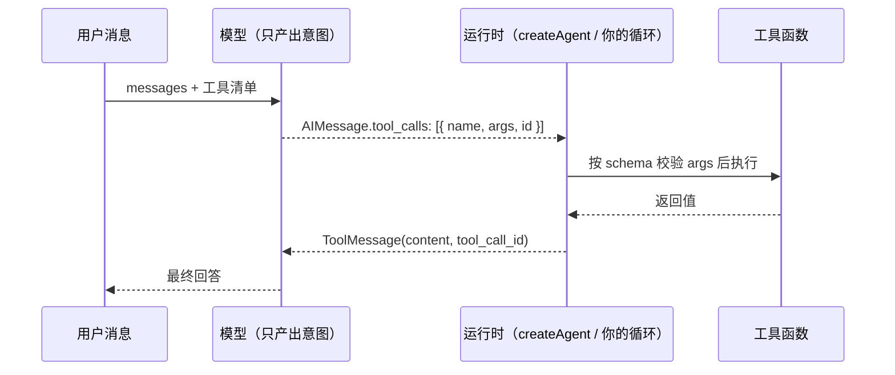

import { Canvas, Controls, Meta } from '@storybook/addon-docs/blocks';
import * as Tools from './tools.stories';

<Meta of={Tools} name="Docs" />

# 工具

工具是模型够到外部世界的唯一通道：查数据库、调 API、算数、读文件，都是工具。[第一个 Agent](?path=/docs/first-agent--docs) 里已经把工具挂进 `createAgent` 跑通了；本课把工具当独立对象讲透——它建立在一个核心分离上：**模型只产出「调用意图」，运行时才真正执行函数**。沿着这条线，本课依次讲清：协议怎么走（`tool_calls` → `ToolMessage`）、`tool()` 怎么定义（description 与 zod schema 的写法）、工具怎么挂载（`createAgent` / `bindTools`）、返回什么（字符串、对象、`ToolMessage`）、出错怎么办（抛错与返回错误，Agent 分别看到什么）、以及动态工具与数量控制。读完你应该能预测：换一个 description、改一个参数的 `.describe()`、把抛错改成返回错误文本，模型的行为分别会怎么变。



`tool()` 描述对象的字段与默认值（已与官方文档和 `@langchain/core` 类型核对）：

| 字段 | 必填 | 默认值 | 作用与回查要点 |
| --- | --- | --- | --- |
| `name` | 是 | — | 模型引用工具的标识；用 snake_case，部分提供方拒绝空格与特殊字符 |
| `description` | 否 | `` `${name} tool` `` | 模型决定「用不用」的主要依据；默认值没有信息量，实际必写 |
| `schema` | 否 | 接受单个字符串入参的 zod schema | 入参形状与参数说明，执行前先校验 |
| `responseFormat` | 否 | `'content'` | 设 `'content_and_artifact'` 时执行函数返回 `[content, artifact]` 二元组 |
| `returnDirect` | 否 | `false` | `true` 时工具输出直接成为最终回复，短路循环 |

## 快速上手

脱离 Agent，手写一遍调用循环——这是看清「意图与执行分离」的最小闭环（工程沿用[安装](?path=/docs/installation--docs)一课：依赖 `langchain`、`@langchain/openai`、`zod`、`dotenv`）。把代码存成 `tool-loop.ts`，用 `npx tsx tool-loop.ts` 运行：

```ts
// tool-loop.ts —— 手写工具调用链路：模型产出意图，我们执行并回传
// 运行条件：OPENAI_API_KEY 已写入 .env；npx tsx tool-loop.ts 运行。
import 'dotenv/config';
import * as z from 'zod';
import { ChatOpenAI } from '@langchain/openai';
import { tool } from 'langchain';

const searchDatabase = tool(
  ({ query, limit }) => `Found ${limit} results for '${query}'`,
  {
    name: 'search_database',
    description: 'Search the customer database for records matching the query.',
    schema: z.object({
      query: z.string().describe('Search terms to look for'),
      limit: z.number().describe('Maximum number of results to return'),
    }),
  }
);

const model = new ChatOpenAI({ model: 'gpt-5.5' });
// bindTools 返回绑定了工具清单的新模型，其余链路不变
const modelWithTools = model.bindTools([searchDatabase]);

async function main() {
  const messages = [
    { role: 'user' as const, content: '帮我找姓 Zhang 的客户，最多 3 条。' },
  ];

  // 第 1 步：模型只产出「调用意图」，没有任何代码被执行
  const aiMessage = await modelWithTools.invoke(messages);
  const toolCall = aiMessage.tool_calls?.[0];
  if (!toolCall) {
    console.log(aiMessage.content); // 模型直接回答了，没有工具回合
    return;
  }
  console.log(toolCall);
  // => { name: 'search_database', args: { query: 'Zhang', limit: 3 }, id: 'call_xxx' }

  // 第 2 步：执行由我们的代码完成——把意图原样交给工具
  const toolResult = await searchDatabase.invoke(toolCall);
  console.log(toolResult);
  // => ToolMessage { content: "Found 3 results for 'Zhang'", tool_call_id: 'call_xxx' }

  // 第 3 步：把结果追加回消息，模型给出最终回答
  const final = await modelWithTools.invoke([
    ...messages,
    aiMessage,
    toolResult,
  ]);
  console.log(final.content);
  // => 找到 3 位姓 Zhang 的客户……（措辞因模型而异）
}

main();
```

三步循环就是全部协议：模型产出 `tool_calls`，你执行工具，结果以 `ToolMessage` 回传。`createAgent` 做的事不过是把这三步装进循环自动跑到能回答为止。

## 工具是什么

一个工具由两半组成，分别写给两个读者：

- **定义**（`name`、`description`、`schema`）写给**模型**。模型看不到你的实现代码，它只看到这三样被序列化后的描述，据此决定要不要调用、传什么参数。
- **执行函数**写给**运行时**。模型不能执行函数、也拿不到函数结果；真正跑代码、拿到返回值的是运行时——`createAgent` 内置的工具节点，或者像快速上手那样由你手写循环。

协议的两侧靠 `id` 配对：模型在 `AIMessage.tool_calls` 里产出 `{ name, args, id }`（`args` 是模型生成的 JSON 对象，不是字符串）；运行时执行后构造 `ToolMessage`，其 `tool_call_id` 必须逐字等于对应的 `id`，模型才能知道哪份结果对应哪次请求（消息字段细节见[模型与消息](?path=/docs/models-and-messages--docs)）。两条硬规则：

- **消息历史里每个 `tool_call` 都必须有对应的 `ToolMessage`。** 漏掉任何一个（尤其是并行调用的某一个），提供方 API 会直接报错——OpenAI 表现为 400。
- **模型默认可以并行调用**：一条 `AIMessage` 可能带多个 `tool_calls`，运行时逐个执行、逐个回传。

下面的实例把一个工具回合的消息协议确定性画出来（消息类名、`type` 字段对齐 `@langchain/core` 真实形态，不发起真实模型调用）：

<Canvas of={Tools.Interactive} />
<Controls of={Tools.Interactive} />

| 读者操作 | 可观察证据 |
| --- | --- |
| 切换「执行模式」到「工具抛错 · 默认捕获」 | ToolMessage 的 content 变成 `` Error: …\n Please fix your mistakes. `` 固定模板，且模型下一轮修正了参数 |
| 切换到「工具抛错 · 冒泡终止」 | 没有 ToolMessage，消息流停在 AIMessage(tool_calls)，invoke 以异常拒绝 |
| 切换到「返回错误文本」「调用不存在的工具」 | 两种错误回传的文案与 `status: "error"` 差异，以及模型各自的恢复方式 |
| 拖动「回放步骤」 | 消息逐条追加，`tool_calls[0].id` 与 `tool_call_id` 始终同值 |

打开 Show code 可看到该 Canvas 实际执行的 `example.ts`：纯 TS 确定性模拟，不依赖 `@langchain/*`。

除了自己写 `tool()`，工具还有四个来源，定位各不相同：

| 来源 | 一句话定位 |
| --- | --- |
| 预置与集成工具包 | 社区维护的现成工具（搜索、检索等），见 integrations 文档 |
| MCP | 用 `@langchain/mcp-adapters` 把 MCP server 的工具挂进 Agent，归 [MCP 接入](?path=/docs/mcp--docs) |
| 提供方内置工具 | OpenAI web search、code interpreter 等由提供方服务端执行的工具 |
| headless 工具 | 定义注册在服务端、实现在浏览器端执行（地理定位、IndexedDB 等），定义与实现分模块维护 |

## 定义工具

`tool(executor, fields)` 接收执行函数和描述对象。执行函数可以是异步的，入参对象先按 `schema` 校验再注入；字段与默认值见开场参考表。真正决定工具好不好用的是两个可写字段：`description` 与 `schema`。

### description：写何时用，不只是是什么

模型决定调不调工具时，读到的信息只有 `name`、`description`、`schema` 三样。description 写「何时该用」，比写「这是什么」有效得多；多个工具时还要写清彼此的分工边界：

```ts
// 差：只说了是什么，模型不知道何时该选它
description: 'Search the customer database.'

// 好：写了何时用、何时不用、与相邻工具的分工
description:
  'Search the customer database for records matching the query. ' +
  'Use this when the user asks about customers, orders, or accounts. ' +
  'Do not use this for employee records — use search_employee instead.',
```

三条判断：

- description 默认值是 `` `${name} tool` ``，等于没有信息——这个字段实际必写。
- 写给模型的每个字都会消耗上下文并影响决策，长篇大论不如一句触发条件加一句边界。
- 工具的使用规则（「遇到实时数据必须先查」）更适合写进 `systemPrompt`，description 只负责单个工具的边界（见[第一个 Agent](?path=/docs/first-agent--docs)）。

### schema：用 zod 描述入参

`schema` 是一个 zod 对象，描述入参的形状；每个字段上的 `.describe()` 文案会和参数名、类型一起发给模型。模型看不到你的代码，它填参数的依据只有这份描述：

```ts
import * as z from 'zod';
import { tool } from 'langchain';

const searchDatabase = tool(
  ({ query, limit }) => `Found ${limit} results for '${query}'`,
  {
    name: 'search_database',
    description: 'Search the customer database for records matching the query.',
    schema: z.object({
      query: z.string().describe('Search terms to look for'),
      // 可选参数要写清缺省行为，模型才知道不传时会发生什么
      limit: z
        .number()
        .optional()
        .describe('Maximum number of results to return. Defaults to 10.'),
    }),
  }
);

// 无参工具用空对象：模型调用时不填任何参数
const listRegions = tool(
  () => 'north, south, east, west',
  {
    name: 'list_regions',
    description: 'List all supported regions. Takes no arguments.',
    schema: z.object({}),
  }
);
```

四条边界：

- 参数宁少勿多——每个参数都是模型要填的空，多一个可选参数就多一分填错的可能；能从 context 推导的值不要让模型传（见下文「ToolRuntime：读运行时上下文」一节）。
- schema 省略时，工具退化为接受单个字符串入参；无参工具显式写 `z.object({})`，并把「无参数」写进 description。
- 入参在执行前按 schema 校验，校验失败同样走错误回传（见[错误处理](#错误处理)），模型通常下一轮会修正。
- 这里 zod 约束的是**工具入参**；用 zod 约束模型**最终输出**是另一件事，归[结构化输出](?path=/docs/structured-output--docs)一课。zod 之外也接受 JSON schema 对象。

## 挂载与调用链路

「谁执行你的工具」有三层选择，代码量与控制力反向递增：

| 挂载方式 | 谁执行工具 | 适合 |
| --- | --- | --- |
| `createAgent({ tools })` | 内置工具节点，全自动 | Agent 闭环（本表下方展开） |
| `ToolNode`（`@langchain/langgraph`） | 图里显式的工具节点 | 自己编排 LangGraph 图，归 [Graph API](?path=/docs/graph-api--docs) |
| `model.bindTools([...])` | 你自己写循环 | 单次意图提取、调试工具定义、完全自定义编排 |

### createAgent：把执行交给运行时

```ts
const agent = createAgent({
  model: new ChatOpenAI({ model: 'gpt-5.5' }),
  tools: [searchDatabase, listRegions],
});
```

挂载就是把工具放进 `tools` 数组。运行时接过的职责：把清单经 `bindTools` 发给模型（模型必须实现 `bindTools`，否则启动报错）；从 `AIMessage.tool_calls` 里取出每个调用，按 `id` 配对执行；把返回值包装成 `ToolMessage` 回传并继续循环；对抛错和未知工具名做默认兜底（见[错误处理](#错误处理)）。你的代码里没有任何「如果模型要查数据库就……」的分支——调不调、传什么参数，由模型依据定义决定。

工作区 `tester/weather.test.ts` 是这个形态的真实工程参照：两个工具（其中一个无参、从 context 取值）挂进 `createAgent`，配 `checkpointer`，context 在 `invoke` 的第二个参数传入。

### bindTools：自己写循环

快速上手已经写过完整的三步循环，这里补手动链路的两个常用件。**toolChoice** 控制模型「必须调 / 可以不调 / 必须调哪个」：

```ts
// 默认 'auto'：模型自行决定
let bound = model.bindTools([searchDatabase, listRegions]);

// 'any'（OpenAI 映射为 required）：必须调用至少一个工具
bound = model.bindTools([searchDatabase, listRegions], { toolChoice: 'any' });

// 指定工具名：强制调用该工具（适合测试工具定义本身）
bound = model.bindTools([searchDatabase], { toolChoice: 'search_database' });
```

其余边界：流式收到工具调用时，增量在 `AIMessageChunk.tool_call_chunks` 里拼接，归[流式输出](?path=/docs/streaming--docs)一课；`@langchain/google-genai` 的模型同样实现 `bindTools`，手动链路代码原样可用，只有 `tool_call_id` 的格式由提供方生成——手动构造 `ToolMessage` 时永远用模型返回的原 `id`，不要自己编。

## 返回值形态

执行函数返回什么，决定 `ToolMessage` 里装什么：

| 返回什么 | 模型看到什么 | 什么时候用 |
| --- | --- | --- |
| 字符串 | 原样作为 `content` | 最常用：人类可读的结论 |
| 对象 | `JSON.stringify` 后作为 `content` | 多字段结果，模型按字段引用 |
| 内容块数组 | 多模态 `ToolMessage`（如 `[{ type: 'text', … }, { type: 'image', … }]`） | 返回图片、文件等，模型须支持该模态 |
| `ToolMessage` 实例 | 原样使用，字段完全由你控制 | 需要自定义 `status` 等细节时 |
| `Command` 实例 | 不止回消息，还能更新图状态 | LangGraph 编排，归 [Graph API](?path=/docs/graph-api--docs) |

一个容易忽略的细节：返回对象时模型看到的是序列化后的 JSON 字符串，字段名就是模型引用的依据——扁平、语义化的字段名比嵌套结构更稳。如果结果里有只给程序用、不该烧进模型上下文的大对象（检索出的原始文档、完整 JSON 数据），用 `responseFormat: 'content_and_artifact'` 把「给模型的」和「给程序的」分开：

```ts
const lookupOrder = tool(
  async ({ orderId }) => {
    const order = await db.findOrder(orderId); // 假设的大对象
    // [给模型的内容, 给程序的 artifact] 二元组
    return [`Order ${orderId}: ${order.status}, total ${order.total}.`, order];
  },
  {
    name: 'lookup_order',
    description: 'Look up an order by ID and summarize its status.',
    schema: z.object({ orderId: z.string().describe('The order ID') }),
    responseFormat: 'content_and_artifact',
  }
);

// agent.invoke 后在 result.messages 里找到 ToolMessage：
// message.content 是摘要；message.artifact 是完整 order 对象，只给程序访问。
```

### returnDirect：让工具输出直接成为回复

`returnDirect: true` 短路 Agent 循环：工具输出跳过「再让模型组织一遍」，直接作为最终回复返回，省一次模型调用。适合输出即答案的终端型工具——计算器、单位换算、格式转换：

```ts
const calculator = tool(
  // evalExpression 假设为已有的安全求值实现，不要用 eval
  async ({ expression }) => String(evalExpression(expression)),
  {
    name: 'calculator',
    description: 'Evaluate a math expression and return the exact result.',
    schema: z.object({ expression: z.string().describe('The expression to evaluate') }),
    returnDirect: true, // 结果直接回复用户，不再回到模型
  }
);
```

一个例外：模型并行调用多个工具时，只有**这一批全部**是 `returnDirect` 工具才会短路；混批（`returnDirect` 与普通工具同批）会回到模型继续循环。

## 错误处理

工具出错的默认行为是「让模型看到错误，而不是让调用崩溃」。`createAgent` 的内置工具节点会捕获执行抛出的异常和入参校验失败，转换成一条 `ToolMessage` 回传，模板是固定的：

```
Error: limit must be ≤ 100
 Please fix your mistakes.
```

那句英文不是你写的文案——它就是默认错误模板（`` `${error}\n Please fix your mistakes.` ``）。模型看到后会换参数重试；把上面的实例切到「工具抛错 · 默认捕获」可以完整看到这个回合。调用**不存在的工具**也一样优雅：返回 `` Error: search_db is not a valid tool, try one of [search_database]. ``，且该 `ToolMessage` 带 `status: "error"`，模型通常会改用正确的工具名。

在默认行为之上，「抛错」与「返回错误结果」是两种你可选的姿态：

| | 工具内抛错（默认捕获） | 工具内返回错误文本 |
| --- | --- | --- |
| Agent 看到的 content | 固定模板包裹 `error.message` | 你写的文案，可带建议动作 |
| 文案控制 | 弱（只有异常信息） | 完全可控 |
| 适合 | 意料之外的程序性异常 | 可自我修正的输入错误 |

```ts
const searchDatabase = tool(
  async ({ query }) => {
    if (query.length < 2) {
      // 输入错误：返回可读的错误与下一步建议，模型能据此向用户澄清
      return `query too short: '${query}' — give at least 2 characters`;
    }
    const rows = await db.search(query); // 数据库挂了属于程序性异常，直接抛
    return `Found ${rows.length} results for '${query}'`;
  },
  {
    name: 'search_database',
    description: 'Search the customer database for records matching the query.',
    schema: z.object({ query: z.string().describe('Search terms to look for') }),
  }
);
```

什么时候错误会**真的终止**调用而不是回到模型：`wrapToolCall` 中间件里抛出的错误默认向上冒泡（让 `invoke` 直接失败）；人机协同的 interrupt 与调用中止信号也总是冒泡。统一给所有工具加错误兜底、改写错误文案，属于中间件拦截，归[中间件](?path=/docs/middleware--docs)一课。

## 动态工具与数量控制

工具不是写完就固定不变的静态清单：执行时它可以从运行时拿到上下文（用户是谁、当前状态），挂载时清单可以按角色与任务裁剪，运行中还可以给调用次数设上限。这一节沿「工具自身的动态能力 → 清单规模的控制」展开，前者的完整形态是 `ToolRuntime`，后者的手段分定义时、挂载时、运行时三层。

### ToolRuntime：读运行时上下文

执行函数可以声明第二个参数 `runtime`，拿到本次运行的上下文——用户身份、权限、进度输出都在这里，而不是让模型当参数传：

```ts
import { createAgent, tool, type ToolRuntime } from 'langchain';

const getUserLocation = tool(
  (_: unknown, runtime: ToolRuntime<unknown, { user_id: string }>) => {
    const userId = runtime.context?.user_id ?? '1';
    return userId === '1' ? 'Florida' : 'SF';
  },
  {
    name: 'get_user_location',
    description: "Get the current user's location from their profile.",
    schema: z.object({}),
  }
);

const agent = createAgent({
  model: new ChatOpenAI({ model: 'gpt-5.5' }),
  tools: [getUserLocation],
  contextSchema: z.object({ user_id: z.string() }), // 声明运行时注入的 context
});

// context 在 invoke 的第二个参数传入，与 thread_id 同级
const result = await agent.invoke(
  { messages: [{ role: 'user', content: '我这边天气怎么样？' }] },
  { configurable: { thread_id: 't1' }, context: { user_id: '1' } }
);
```

（这段对齐 `tester/weather.test.ts` 的真实用法。）`ToolRuntime` 上常用的成员：

| 成员 | 装什么 | 要点 |
| --- | --- | --- |
| `context` | 每次运行注入的上下文 | 配合 `createAgent` 的 `contextSchema` 使用 |
| `toolCallId` | 本次调用的 `id` | 手动构造 `ToolMessage` 时回填 `tool_call_id` |
| `writer` | 流式进度输出 | `runtime.writer?.('Looking up…')`，消费者见[流式输出](?path=/docs/streaming--docs) |
| `store` | 跨 thread 的长期存储 | 命名空间读写，归[长期记忆](?path=/docs/long-term-memory--docs) |
| `state` | 当前 agent state | 配合工具的 `stateSchema` 读取 |

### 数量控制

工具清单越长，模型选错、传错参数的概率越高。三个层次的手段：

- **定义时收敛**：每个工具的 description 写清分工边界；能合并的近似工具合并（用一个参数区分），参数宁少勿多。
- **按运行时过滤**：角色、任务不同可用的工具不同——用 `wrapModelCall` 中间件按 `context` 或 feature flag 过滤 `request.tools`，甚至运行时注册新工具（同时要在 `wrapToolCall` 里提供执行）。拦截改写的完整写法归[中间件](?path=/docs/middleware--docs)一课。
- **运行时兜底**：`toolCallLimitMiddleware` 限制工具调用次数，防止模型陷入反复调用的死循环：

```ts
import { createAgent, toolCallLimitMiddleware } from 'langchain';

const agent = createAgent({
  model: new ChatOpenAI({ model: 'gpt-5.5' }),
  tools: [searchDatabase],
  middleware: [
    toolCallLimitMiddleware({
      threadLimit: 20, // 整个 thread 最多 20 次工具调用
      runLimit: 10,    // 单次 invoke 最多 10 次
      exitBehavior: 'continue', // 超限后拦截并告知模型；'error' 抛异常，'end' 立即结束
    }),
  ],
});
```

## 最佳实践

- **错误处理按「能否自我修正」分流**：输入类错误返回带建议的错误文本，让模型下一轮修正或向用户澄清；程序性异常直接抛，交给默认兜底；必须硬失败的场景用中间件 re-throw，不要靠文案伪装崩溃。
- **给模型的三个字段一起打磨**：`name` 用 snake_case 直白命名，description 写何时用与分工边界，schema 每个字段 `.describe()`——模型决策的全部依据就这三样，改任何一个都会改变调用行为。
- **工具数量主动控制**：清单保持短；按角色/任务用中间件过滤；配 `toolCallLimitMiddleware` 兜底。发现模型频繁幻觉工具名或选错工具，先精简清单再怀疑模型。
- **`returnDirect` 只给终端型工具**：输出即答案时省一次模型调用；中间步骤的工具保持默认，让模型整合结果。
- **大结果走 artifact**：检索原文、完整数据用 `responseFormat: 'content_and_artifact'` 分离「给模型的摘要」和「给程序的数据」，避免把上下文烧在模型不需要的细节上。

## 常见问题

- **messages 里出现陌生的 `` Please fix your mistakes. `` 文案，不是我写的。**
  这是默认错误模板：工具执行抛错或入参校验失败被自动转成 `ToolMessage` 回传给模型。用该消息的 `tool_call_id` 对回 `AIMessage.tool_calls` 里的 `id`，就能定位是哪次调用、什么参数触发的错误。
- **日志里出现 `` Error: search_db is not a valid tool, try one of [search_database]. ``**
  模型幻觉了一个不存在的工具名（常见于清单较长时）。核对该工具的 `name` 拼写是否与模型调用的一致；在 description 里强化「何时用谁」的分工；仍频繁出现就精简工具清单。
- **OpenAI 请求报 tool name 无效（400 invalid tool name）。**
  `name` 含大写、空格或特殊字符会被提供方校验拒绝。统一用 snake_case（`search_database`），只用小写字母、数字和下划线。
- **工具返回了对象，模型引用字段却驴唇不对马嘴。**
  对象会被 `JSON.stringify` 成字符串再进入 `ToolMessage.content`，模型按序列化后的字段名引用。把返回结构做扁平、字段名语义化；确实大的数据改用 `content_and_artifact`，只回摘要。
- **想让工具错误直接让 `invoke` 失败，而不是被转成消息回到模型。**
  默认行为是兜底转 `ToolMessage`。要硬失败：在 `wrapToolCall` 中间件里判断后 re-throw（中间件错误默认冒泡），或对失控循环用 `toolCallLimitMiddleware({ exitBehavior: 'error' })`；写法归[中间件](?path=/docs/middleware--docs)一课。

## 总结回顾

摘要：

工具建立在「模型只产出调用意图、运行时执行函数」的分离上：模型只看到 `name`、`description`、`schema` 并产出 `AIMessage.tool_calls`（`{ name, args, id }`，可并行多条），运行时执行后以 `tool_call_id` 配对的 `ToolMessage` 回传，每个 `tool_call` 必须有对应回传。定义工具就是写好这三样：description 写何时用与分工边界，schema 用 zod 描述入参、每个字段 `.describe()`，无参工具用 `z.object({})`。挂载三层：`createAgent` 全自动、LangGraph `ToolNode` 归图编排、`bindTools` 手写三步循环，toolChoice 可强制调用。返回值里字符串最常用，对象会被 JSON 序列化，`content_and_artifact` 分离给模型与给程序的数据，`returnDirect` 短路循环。错误默认被转成 `` `${error}\n Please fix your mistakes.` `` 的 `ToolMessage` 让模型自我修正，未知工具名同样优雅回传（`status: "error"`）；可修正的输入错误返回自写文案，程序性异常抛出。第二参数 `ToolRuntime` 提供运行时上下文（context、writer、store）；工具数量靠定义收敛、按 context 过滤与 `toolCallLimitMiddleware` 三层控制。

一句话：

> 模型只决定调用什么，运行时负责执行与回填——定义工具是写给模型看的三样加写给运行时执行的一段代码，错误处理的本质是决定 Agent 看到什么。

知识要点：

- 工具的两半分别写给谁？模型看得到哪三样信息？
- `tool_calls` 的结构是什么，`ToolMessage` 靠什么与它配对？漏掉一条会怎样？
- `description` 应该写什么？默认值是什么、为什么不可用？
- schema 怎么写参数说明？无参工具和省略 schema 分别是什么行为？
- 三层挂载方式各由谁执行工具？toolChoice 有哪些取值？
- 字符串、对象、内容块、`ToolMessage`、`Command` 各返回成什么？
- 工具抛错与返回错误文本，Agent 分别看到什么？默认错误模板长什么样？
- 什么情况下错误会真正让 `invoke` 失败？
- `ToolRuntime` 能拿到哪些运行时上下文？context 怎么声明和传入？
- 控制工具数量与防失控有哪三层手段？

## 参考资料

- [Tools（LangChain.js 官方文档）](https://docs.langchain.com/oss/javascript/langchain/tools)
- [Models（LangChain.js 官方文档：bindTools、tool_calls 结构与 toolChoice）](https://docs.langchain.com/oss/javascript/langchain/models)
- [langchainjs 仓库（内置 ToolNode 默认错误处理与 toolCallLimitMiddleware 实现）](https://github.com/langchain-ai/langchainjs)
