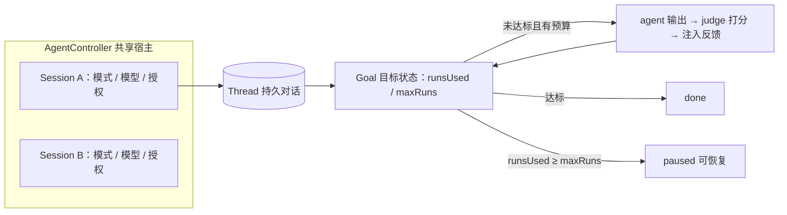

import { Canvas, Controls, Meta } from '@storybook/addon-docs/blocks';
import * as Stories from './agent-controller.stories';

<Meta of={Stories} name="Docs" />

# 目标与 Agent Controller

本课讲 Harness（长时运行）里让 agent「有方向、有宿主」的两个 Beta 机制。**Goals** 给线程挂一个持久目标：agent 不是回答一次就结束，而是进入多轮循环，每轮由 judge 打 0 / 1 分，未达标就注入反馈继续，直到 done 或预算耗尽 paused。**AgentController** 是交互式 agent 应用的共享运行时宿主：多个 Session 共用一个 Controller，各自绑定持久 Thread，可切换模式与模型、审批工具、委派子代理。两者配合的典型形态是一个「盯着目标干活」的常驻应用：Controller 承载会话，Goals 保证对话线程朝目标推进。



开场参考表（默认值与关键入口回查）：

| 条目 | 值 / 入口 |
| --- | --- |
| 成熟度 | Goals 与 AgentController 均为 Beta；Goals 需 mastra ≥ 1.42.0 |
| judge 默认 | 内置 LLM-as-judge，对每轮输出打 0 / 1 分；`goal.scorer` 可换自定义 scorer |
| 运行预算 | `maxRuns`；`runsUsed ≥ maxRuns` 仍未达标 → `paused`（可恢复） |
| 目标存储 | 线程状态，进程重启后目标仍存活 |
| 执行时机 | goal 步骤在 `isTaskComplete` 之后运行 |
| 评估输出 | `goal` 流 chunk |
| 目标管理 API | `setObjective` / `getObjective` / `updateObjectiveOptions` / `clearObjective` |
| Controller 生命周期 | `controller.init()` → `createSession()` → `session.subscribe()` / `sendMessage()` |
| 运行时可切换 | `session.mode.switch()`、`session.model.switch()`、`respondToToolApproval()` |
| 频道接入 | `resolveResourceId` / `resolveSession` |
| 编码场景 | 建议 `createCodingAgent()` |

## Goals：线程级持久目标

Goals 解决的问题是「多轮才做得完的任务没有终点线」。目标挂在 Thread 而不是某次 run 上：agent 每轮输出后，judge（默认内置 LLM-as-judge）打 0 / 1 分——0 分且有剩余预算时把反馈写回线程继续下一轮，1 分即 done，预算耗尽（runsUsed ≥ maxRuns）则 paused，可恢复继续。因为目标存在线程状态里，进程重启后循环仍能接着跑。

### 设置与读取目标

四个管理 API 覆盖目标的一生：设置、读取、改选项、清除。

```ts
const agent = new Agent({ name: 'worker', model: 'openai/gpt-4o' });

// 设置目标并给预算：之后的多轮循环都朝它努力，目标写入线程状态
await agent.setObjective('修复所有失败测试并保证 lint 通过', { maxRuns: 10 });

const goal = await agent.getObjective(threadId);      // 读取目标与当前进度
await agent.updateObjectiveOptions({ maxRuns: 20 }); // 中途调大预算
await agent.clearObjective();                        // 达成或放弃时移除目标
```

可观察证据：设置目标后，每轮评估结果经 `goal` 流 chunk 输出，从 stream 里能读到当前分数与状态；`getObjective` 读到的是线程上持久化的目标，重启后仍可读。

边界：只做「一次就能判完成」的检查不要用 Goals——一次性完成检查应该用 `isTaskComplete`；goal 步骤在 `isTaskComplete` 之后才运行，两者不是同类机制的二选一。

### 评估循环与预算

循环的三个出口由 judge 分数和预算共同决定：达标 done、未达标续跑、预算耗尽 paused。下面的离线示意里，每次反馈注入都会让后续轮次的通过率上升——这正是反馈写回线程的效果；把 maxRuns 调小、通过率调低，就能看到 paused 分支。

<Canvas of={Stories.Interactive} />

<Controls of={Stories.Interactive} />

读数解释：轮次显示已消耗的 run 数 / 预算，状态在「评估中 / done / paused」之间切换，剩余预算归零且未达标即 paused。真实循环中，每轮的分数与反馈同样经 `goal` chunk 暴露给调用方。

边界：自定义评分用 `goal.scorer` 接入自己的 scorer（如 rubric、多指标评分），judge 打出的分数替换为 scorer 结果，循环出口逻辑不变；paused 不是失败——它是「预算用完但目标还在」，恢复后从线程状态继续。

## Agent Controller：共享运行时宿主

AgentController 是交互式 agent 应用的「宿主进程」：在一个对象里协调模式、模型、存储、工作区、工具审批、子代理与频道。关键设计是**多 Session 共用一个 Controller**：Session 承载隔离的运行时状态（当前模式、模型、事件总线、授权），Thread 承载持久对话——同一对话线程可被不同 Session 先后接管，进程重启后对话仍在。

### 创建 Session 与消息循环

```ts
// 省略 agent / controller 的创建；编码场景可用 createCodingAgent() 一并创建
await controller.init();                        // 初始化共享运行时

const session = await controller.createSession({ threadId });
const unsubscribe = session.subscribe((event) => { /* 渲染 UI / 记录事件 */ });
await session.sendMessage('继续修剩下的测试');    // 发送用户消息，触发 agent 循环

await session.mode.switch('build');             // 切换模式（如 计划 → 构建 → 审查）
await session.model.switch('anthropic/claude-sonnet-4-5'); // 会话内热切换模型
```

可观察证据：`subscribe` 收到的事件流随 `sendMessage` 与模式切换实时变化；UI 层只依赖 Session 事件，不直接触碰 agent 与存储。

边界：不要在 controller 上保存「当前 Session」——多会话并发时它没有意义；需要会话时按 id 解析（频道接入走 `resolveResourceId` / `resolveSession`）。

### 工具审批与典型用途

受限操作（写文件、执行命令）可配置为需要审批：Session 暂停等待授权，调用方用 `respondToToolApproval()` 放行或拒绝；需要收缩权限的委派则交给子代理完成。

```ts
session.subscribe((event) => {
  if (event.type === 'tool-approval-request') {
    void session.respondToToolApproval(event.id, { approve: true });
  }
});
```

边界：审批授予只对存活的 Session 有效——Session 结束后授权随之失效，新 Session 需重新授权。

典型用途：多模式产品流程（计划 → 构建 → 审查）、作为 UI 的控制层、受限子代理委派；编码场景建议直接用 `createCodingAgent()` 创建配套的 agent 与 Controller。

## 常见问题

- 目标循环没跑几轮就 paused 了
  先看预算：runsUsed 达到 maxRuns 就会 paused。用 `updateObjectiveOptions` 调大 maxRuns 后恢复继续；若 judge 一直打 0 分，检查目标描述是否可判定，或用 `goal.scorer` 换更合适的评分方式。
- 只想判断「这个任务做完了吗」，用 Goals 反而多跑好几轮
  一次性完成检查改用 `isTaskComplete`；Goals 是多轮循环机制，goal 步骤还排在 `isTaskComplete` 之后，不适合单次判定。
- 审批放行了但工具没执行
  审批授予只对存活 Session 有效。确认响应审批的 Session 还活着；若已结束，重新 `createSession` 后再走一次审批。
- 多个页面 / 连接共用一个 Controller，状态互相串了
  Controller 本来就是共享宿主，隔离边界是 Session：每个连接各自 `createSession`，模式、模型与授权都挂在各自 Session 上；归属解析用 `resolveResourceId` / `resolveSession`，不要在 controller 上存「当前 Session」。

## 总结回顾

摘要：

Goals 把目标挂到线程状态上，让 agent 进入「输出 → judge 打分 → 反馈注入」的多轮循环，直到 done 或预算耗尽 paused，重启后目标仍存活；`setObjective` / `getObjective` / `updateObjectiveOptions` / `clearObjective` 管理目标一生，评估结果经 `goal` chunk 输出，一次性判定交给 `isTaskComplete`，自定义评分用 `goal.scorer`。AgentController 在其上提供共享运行时宿主：多 Session 共用一个 Controller，Session 持隔离运行时状态、Thread 持持久对话，`init` → `createSession` → `subscribe` / `sendMessage` 构成消息循环，模式与模型可热切换，工具审批经 `respondToToolApproval` 授予且只对存活 Session 有效。

一句话：

> Goals 决定 agent 朝哪里循环多少轮，AgentController 决定多个会话如何在同一个运行时里各干各的。

知识要点：

- judge 默认是什么、怎么换：内置 LLM-as-judge 打 0 / 1 分，`goal.scorer` 可自定义
- paused 何时发生、如何恢复：runsUsed ≥ maxRuns 且未达标；目标还在，调预算后可恢复继续
- 目标为什么重启后还在：存在线程状态里，不随进程消失
- Session 与 Thread 的分工：Session 持隔离运行时状态，Thread 持持久对话
- 审批授予的有效范围：只对存活 Session 有效
- 一次性完成检查用哪个 API：`isTaskComplete`（goal 步骤在其后运行）

## 参考资料

- [Goals | Mastra Docs](https://mastra.ai/docs/harness/goals)
- [Agent Controller | Mastra Docs](https://mastra.ai/docs/harness/agent-controller)

