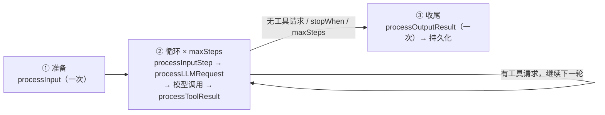

import { Canvas, Controls, Meta } from '@storybook/addon-docs/blocks';
import * as Stories from './agent-lifecycle.stories';

<Meta of={Stories} name="Docs" />

# Agent 执行机制

调用一次 `agent.generate()` 或 `agent.stream()`，Mastra 内部跑的是一条固定管线：**准备**（校验 RequestContext、解析模型与工具、组装消息列表）→ **循环**（模型调用与工具往返，直到满足停止条件）→ **收尾**（处理最终结果并持久化）。每个阶段都有输入/输出处理器回调在固定时机触发。本课把这条管线讲成时间轴，标出「每个回调在何时触发、能拿到什么」；回调的完整类型与写法见[输入输出处理器](?path=/docs/processors--docs)。



九个回调的触发时机速查（层级定义见下一节）：

| 回调 | 层级 | 触发时机 | 能做什么 |
| --- | --- | --- | --- |
| `processInput` | Run | 准备阶段，每次运行一次 | 修改初始消息列表；从存储恢复的运行会跳过 |
| `processInputStep` | Model step | 每轮模型调用前 | 就地编辑累计消息列表，影响后续各轮与持久化 |
| `processLLMRequest` | Model step | 消息转成提供商请求后 | 只改这一次调用的提示，不写入历史 |
| `processOutputStream` | Model step | 提供商流式返回期间 | 逐块检查 / 改写流块（见[流式输出](?path=/docs/streaming--docs)） |
| `processLLMResponse` | Model step | 该步提供商流结束后 | 观察整步响应 |
| `processOutputStep` | Loop iteration | 模型步之后、本地工具执行前 | 检查每轮模型步输出 |
| `processToolResult` | Loop iteration | 每个本地 / 客户端工具结果入消息列表前 | 校验、脱敏工具结果 |
| `processOutputResult` | Run | 收尾，每次请求一次（抛错也触发） | 处理最终结果与消息列表 |
| `processAPIError` | Model step | 提供商拒绝请求时 | 修改请求 / 消息并请求重试 |

## 三个层级：Run、Loop iteration、Model step

一次执行中的所有事件都落在这三层之一上。排查「回调为什么这时触发」时，先定位它属于哪一层：

| 层级 | 边界 | 典型事件 |
| --- | --- | --- |
| Run | 一次 `generate()` / `stream()` 从发起到最终结果或错误的全部工作，包含持久化执行中的暂停与恢复 | `processInput`、`processOutputResult`、tripwire |
| Loop iteration | 一轮循环 = 一次模型步 + 相关工具工作 + 是否继续的判断 | `processOutputStep`、`processToolResult`、停止判断 |
| Model step | 一次对模型提供商的请求及其响应，处理器围绕它前后运行 | `processInputStep`、`processLLMRequest`、`processLLMResponse` |

## 执行时间轴

切换阶段查看该阶段按顺序触发的回调，调整 `maxSteps` 观察循环迭代数（Canvas 为离线示意，不调用真实模型）：

<Canvas of={Stories.Interactive} />
<Controls of={Stories.Interactive} />

| 读者操作 | 可观察证据 |
| --- | --- |
| 把「切换阶段」调到准备 / 循环迭代 / 收尾 | 对应阶段卡片高亮，下方列出该阶段回调链与一句话说明 |
| 调整「maxSteps」 | 循环卡内迭代徽章数量变化，读数「模型步数上限」同步 |

## 准备阶段

进入循环前，Mastra 依次做四件事：校验 `RequestContext` → 解析模型、instructions、workspace/skills → 用输入与记忆组装消息列表 → 装配本次使用的工具与处理器。`processInput` 在组装消息列表时触发一次，是修改初始输入的唯一回调。

```ts
import { Agent } from '@mastra/core/agent';

const agent = new Agent({
  id: 'weather-agent',
  name: 'Weather Agent',
  instructions: '查询天气并给出穿衣建议。',
  model: 'openai/gpt-4o-mini',
});

// 一次 agent.generate() 的完整时间轴（伪代码，标注回调触发点）：
// ├─ 准备：RequestContext 校验 → 解析模型/指令/工具 → processInput（一次）
// ├─ 循环（每轮）：processInputStep → processLLMRequest → 模型调用
// │   → processLLMResponse → processOutputStep → 工具执行 → processToolResult → 停止判断
// └─ 收尾：processOutputResult（一次）→ 持久化
```

必要边界：

- `RequestContext` 校验发生在 `getDefaultOptions()` 之前——函数式默认值来不及在校验前补上缺失值。
- `processInput` 无法影响校验，也影响不了已经解析完的技能与输入处理器选择。
- 常规运行复用调用方传入的同一个 `RequestContext` 实例（不是副本），且它的值不会自动进入模型提示词。

## 循环阶段

### 一轮迭代的回调顺序

工具结果通常触发下一轮模型调用；每轮迭代按固定顺序经历六步：

1. **`processInputStep`** —— 收到累计消息列表，可就地编辑；下一轮模型看到的就是这份列表。
2. **`processLLMRequest`** —— 消息已转成提供商请求；改的只是这一次调用，不会进入历史。
3. **模型调用** —— 提供商流式返回期间 `processOutputStream` 逐块生效，本步结束后触发 `processLLMResponse`。
4. **`processOutputStep`** —— 模型步之后、本地工具执行前。
5. **工具执行 → `processToolResult`** —— 每个本地 / 客户端工具结果进入消息列表前触发。
6. **停止判断** —— 有工具请求就进入下一轮，否则按下述条件停止。

`processInputStep` 与 `processLLMRequest` 的分工：想改「下一轮模型看到什么、最终持久化什么」，编辑消息列表；只想改「这一次发出去的请求」，用 LLM 请求处理器。

### 循环何时停止

- 最终响应不再请求工具；
- 自定义 `stopWhen` 条件——基于已累积的步数求值，适合表达业务上的完成规则；
- `maxSteps` 上限——连续模型步数的硬上限，`generate()` 默认 **5**；
- 任务完成、goal 达成或子代理委派结束；
- 终止性 finish reason、错误、处理器 tripwire 或 abort。

```ts
const response = await agent.generate('Help me organize my day', {
  maxSteps: 10, // 最多 10 次连续模型调用；不传则默认 5
});
console.log(response.text);
```

这些停止检查之间没有公开的固定先后顺序。

## 收尾阶段

`processOutputResult` 每次请求触发一次，作用于完成的结果与消息列表——无论正常结束还是提供商抛错都会执行。两个注意点：

- `maxSteps` 停在某次工具调用上时，消息里可能没有最终 assistant 回复，此时结果不算失败但缺一段收尾文本。
- 先运行配置的输出处理器，再运行自动附加的记忆输出处理器——历史里保存的是处理后的最终形态（Observational Memory 走自己的钩子，不经这条路径）。

## 中止、错误与重试

- 处理器里调用 `abort()` 会产生 **tripwire** 中止；非重试的 tripwire 直接停止执行，并出现在结果与流中。
- tripwire 携带 `retry: true` 时，符合条件的 input-step / output-step 检查会带着反馈重放模型步，重试预算由 `maxProcessorRetries` 限制。
- 提供商拒绝请求进入 `processAPIError`，可修改请求 / 消息后请求重试——它与 tripwire 重试共享同一份 `maxProcessorRetries` 预算。
- 外部传入的 `abortSignal` 会穿透提供商调用与工具生命周期，停止循环并终止流，尽可能保留部分结果（可配 `onAbort` 回调收尾）。

## 持久化与恢复

Durable Agent 把同一套循环包进工作流：状态持久化、事件经 PubSub 发布，因此可以挂起（如工具审批）后从存储恢复。恢复语义与 `processInput` 直接相关：

- **从存储快照恢复的运行会跳过初始 `processInput`**；而信号、定时这类新分段唤醒会重新运行它。
- 只有可序列化的 `RequestContext` 条目会进入快照——函数、类实例、打开的连接不会在恢复后存活。
- 因此不要依赖一次性的 `processInput` 副作用：权威性的上下文增强应在恢复边界重复执行。

## 最佳实践

- `maxSteps` 只做兜底（默认 5），业务上的「做完了吗」用 `stopWhen` 条件或完成判断表达，避免循环被硬上限截断。
- 分不清改哪里时：改「对话历史与下一轮输入」走消息列表回调（`processInput`、`processInputStep`），改「单次请求」走 `processLLMRequest`。
- 恢复场景把 `processInput` 当作「可能不运行」的入口来设计，需要挺过挂起的数据放进可序列化的 `RequestContext`。

## 常见问题

- **`maxSteps` 用尽后 `response.text` 为空或没有最终回复？**
  调大 `maxSteps`，或用 `stopWhen` / 完成判断让循环以最终响应收束。`maxSteps` 停在某次工具调用上是正常行为，此时消息列表里没有最终 assistant 回复。
- **从存储恢复运行后，`processInput` 注入的上下文不见了？**
  恢复会跳过初始 `processInput`。把所需上下文存进可序列化的 `RequestContext`，或在恢复边界重新注入一次。

## 总结回顾

摘要：

一次 `generate()` / `stream()` 是一个 Run，由若干 Loop iteration 组成，每次迭代的核心是一个 Model step。准备阶段校验 RequestContext、解析模型与工具、组装消息列表，并触发一次 `processInput`；循环阶段每轮依次经过 `processInputStep` → `processLLMRequest` → 模型调用（流块经 `processOutputStream`、步末 `processLLMResponse`）→ `processOutputStep` → 工具执行与 `processToolResult`，再由停止条件决定是否继续；收尾阶段 `processOutputResult` 一次性处理最终结果，输出处理器先于记忆处理器运行，历史保存最终形态。tripwire、abort 与 `processAPIError` 重试贯穿全程，而从存储恢复的运行会跳过初始 `processInput`。

一句话：

> 记住时间轴就能定位一切：准备一次 `processInput`，循环每轮六步，收尾一次 `processOutputResult`——想改哪一环，就挂到哪个回调。

知识要点：

- Run / Loop iteration / Model step 三层各自的边界是什么？
- 九个处理器回调各在何时触发、能看到并改到什么？
- 循环有哪些停止条件？`maxSteps` 的默认值是多少？
- 为什么从存储恢复的运行不会再跑 `processInput`？哪些数据能挺过挂起？

## 参考资料

- [Agent Lifecycle（官方指南）](https://mastra.ai/docs/guides/agent-lifecycle)
- [Agent.generate() 参考：maxSteps 默认 5、stopWhen、maxProcessorRetries、abortSignal](https://mastra.ai/reference/agents/generate)
- [Agents 概览：Agent 定义与 generate / stream](https://mastra.ai/docs/agents/overview)
