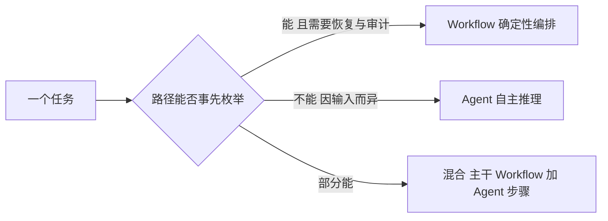
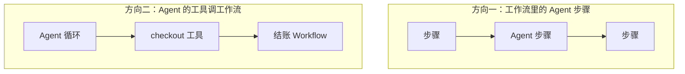

import { Canvas, Controls, Meta } from '@storybook/addon-docs/blocks';
import * as Stories from './agent-or-workflow.stories';

<Meta of={Stories} name="Docs" />

# Agent 还是工作流

拿到一个任务，你有两条实现路线：交给 Agent，让模型自己决定下一步做什么；或写成 Workflow，由你固定步骤、顺序和「完成」的定义。选错方向的代价很高——把两步的固定流程过度工程化成工作流，或把结账这类必须可控的流程交给模型自由发挥。本课给一套可操作的判断维度和一个任务分流器实例：读完应能对任意任务给出「Agent / Workflow / 混合」的结论，并说得出理由。



## 判断维度

两条路线共享同一个判断模型：任务沿两个轴评估——**路径由谁决定**（你写死，还是模型现场决定）和**结果由谁担保**（代码与 schema，还是提示词与模型能力）。五个维度把这两轴展开成可直接回答的问题：

| 判断维度 | 高值倾向 | 回查要点 |
| --- | --- | --- |
| 路径可预测性 | Workflow | 步骤能否事先枚举；能枚举就不要让模型再发明一次 |
| 失败恢复需求 | Workflow | 挂起/恢复、断点续跑、快照都建立在步骤级持久化之上 |
| 审计与合规 | Workflow | 每步有 id、输入输出留痕，可回查、可重放 |
| 成本控制 | Workflow | 固定步骤省掉多轮 LLM 往返；Agent 每次决策都消耗 token |
| 维护方 | — | Workflow 改代码与 schema；Agent 改 instructions 与工具集 |

下面用同一道「支持工单」题（读取工单、判断类别、生成回复）分别给出两种解法，然后拖动滑杆看分流器如何判定你的任务：

<Canvas of={Stories.Interactive} />
<Controls of={Stories.Interactive} />

| 读者操作 | 可观察证据 |
| --- | --- |
| 三个滑杆都拉高 | 推荐切为「工作流编排」，画布显示固定步骤链 |
| 三个滑杆都调低 | 推荐切为「Agent 自主推理」，画布显示模型自主循环 |
| 停在中间地带 | 推荐切为「混合」，画布显示步骤、Agent、步骤相接的结构 |

分流器的需求分 = 可预测性 × 0.4 + 恢复 × 0.3 + 审计 × 0.3；需求分 7 及以上推荐工作流，4 以下推荐 Agent，中间推荐混合。权重与阈值是离线示意，实际业务应自行标定。

### Agent：路径交给模型

Agent 是「会说话的大脑」：一个 LLM 配上工具，没有预定义路径——模型自己决定调用哪个工具、什么时候结束。适合开放式任务：方案因输入而异、你列不出固定步骤的场景（调研、诊断、内容生成）。对支持工单，Agent 解法是把工具交给模型，让它见招拆招：

```ts
import { Agent } from '@mastra/core/agent';

export const supportAgent = new Agent({
  name: 'support-agent',
  instructions: '你是客服代理。自行决定查订单、查退款政策还是直接回复，直到问题解决。',
  model: 'openai/gpt-4o-mini',
  tools: { getOrder, getRefundPolicy },
});

const result = await supportAgent.generate('我的订单还没到，帮忙处理一下');
// result.text / result.toolCalls / result.steps —— 每轮走哪条路径由模型现场决定
```

可观察证据：同一句话问两次，`result.toolCalls` 的序列可能不同，`result.usage` 的 token 数随路径波动——这就是「开放」的价值与代价。

边界：路径不可复现，回归测试与审计只能覆盖结果而非过程；`instructions` 与工具集是仅有的行为控制点，调优行为就是改提示词。

### Workflow：路径交给代码

Workflow 是确定性编排：`createStep` 定义带输入输出 schema 的步骤，`createWorkflow` 用 `.then()` 把顺序写死、`.commit()` 收尾。哪些步骤、什么顺序、何时算完成，全部由你定义。同一道工单题，先按规则分类、再按模板回复：

```ts
import { createWorkflow, createStep } from '@mastra/core/workflows';
import { z } from 'zod';

const classify = createStep({
  id: 'classify',
  inputSchema: z.object({ ticket: z.string() }),
  outputSchema: z.object({ category: z.enum(['billing', 'bug', 'other']) }),
  execute: async ({ inputData }) => ({ category: ruleBased(inputData.ticket) }),
});

const draft = createStep({
  id: 'draft',
  inputSchema: z.object({ category: z.enum(['billing', 'bug', 'other']) }),
  outputSchema: z.object({ reply: z.string() }),
  execute: async ({ inputData }) => ({ reply: renderTemplate(inputData.category) }),
});

export const ticketWorkflow = createWorkflow({
  id: 'ticket-workflow',
  inputSchema: z.object({ ticket: z.string() }),
  outputSchema: z.object({ reply: z.string() }),
})
  .then(classify)
  .then(draft)
  .commit();

const run = await ticketWorkflow.createRun();
const result = await run.start({ inputData: { ticket: '发票开错了' } });
// result.status: 'success' | 'failed' | 'suspended' 等；每步输入输出记录在 result.steps
```

可观察证据：`result.steps['classify']` 能查到该步的输入、输出与状态；进程中断后 `run.restart()` 从最后活动步骤续跑——审计粒度是「步骤」，这正是合规需要的。

边界：只适合步骤可枚举的任务；分支、循环要用控制流原语显式写出（见 [控制流](?path=/docs/workflow-control-flow--docs)），不能指望模型现场发挥；执行引擎默认内建，长时运行可接 Inngest / Temporal 等工作流运行器。

### 混合：两者组合

两者不是二选一，官方两条组合方向都支持：



- **方向一：** 主干用 `.then()` 固定并持久化，把最开放的判断点封装成 agent 步骤（`.agent()`）嵌进去；该点失败或挂起时，运行停在步骤边界，可用 suspend/resume 恢复（见 [工作流中的 Agent 与工具](?path=/docs/agents-and-tools-in-workflows--docs)、[挂起与恢复](?path=/docs/suspend-and-resume--docs)）。
- **方向二：** 把整个结账 Workflow 包成工具交给 Agent——模型只决定「何时结账」，结账本身百分之百按工作流逐步执行、留痕可审计。官方课程的表述：不是让模型去弄懂结账，而是你来定义结账。

## 最佳实践

- **先列步骤清单再选型。** 能把任务写成一份不含「视情况而定」的清单，就选 Workflow；清单里出现「看情况」的地方，就是 Agent 或混合的判断点。
- **确定性骨架 + 开放子任务。** 生产系统的常见形态：主干 Workflow 负责持久化、审计与成本，只在真正开放的判断点嵌入 agent 步骤；不要让 Agent 包办主干，也不要为每个判断点单开一个工作流。
- **强合规动作永远不要只靠模型。** 支付、退款、数据变更放进 Workflow，Agent 最多决定「何时调用」；这样失败能定位到步骤，而不是整次重跑。

## 常见问题

- **同一个任务有时对有时错，定位不了失败在哪。**
  把其中确定的部分改写成 Workflow：失败会落在具体步骤上，`result.status` 与 `result.steps` 可查；Agent 只能整次重跑再靠日志复盘。
- **两步的固定流程也要建 Workflow 吗？**
  不必。路径完全可预测、且没有恢复与审计需求时，普通函数甚至单个 Agent 都更省维护；工作流的价值来自步骤级持久化与留痕，用不上就别付这个成本。
- **判定为混合后不知道从哪边开始写。**
  先写 Workflow 骨架（步骤、schema、分支），把最不确定的点替换成 agent 步骤；反过来从「Agent + 工具」起步，之后要补审计与恢复会更难改。

## 总结回顾

摘要：

本课把「选 Agent 还是 Workflow」从感觉变成打分。判断模型是两个轴——路径由谁决定、结果由谁担保——展开为路径可预测性、失败恢复、审计、成本、维护方五个维度；前三者加权即分流器的工作流需求分（7 及以上选 Workflow，4 以下选 Agent，中间选混合）。同一道支持工单题的两种最小解法形成对照：Agent 的证据是 toolCalls 序列可变，Workflow 的证据是 steps 逐步留痕、可挂起恢复。混合模式给出两条组合方向：主干 Workflow 嵌 agent 步骤，或把 Workflow 包成 Agent 的工具。

一句话：

> 路径能事先枚举、需要恢复与审计的交给 Workflow；方案因输入而异的交给 Agent；两者都要就用 Workflow 做主干、Agent 做开放判断点。

知识要点：

- 五个判断维度分别把选型推向哪一边？
- Agent 与 Workflow 的可观察证据差在哪里（toolCalls 序列与 steps 留痕）？
- 分流器的需求分怎么算，两个阈值是多少？
- 混合模式的两个组合方向各解决什么问题？

## 参考资料

- [Agents vs. Workflows（Mastra Learn）](https://mastra.ai/learn/agents-vs-workflows)
- [Workflows Overview](https://mastra.ai/docs/workflows/overview)
- [Agents Overview](https://mastra.ai/docs/agents/overview)
