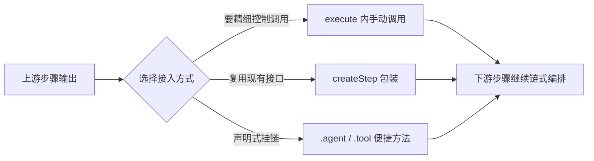

import { Canvas, Controls, Meta } from '@storybook/addon-docs/blocks';
import * as Stories from './agents-and-tools-in-workflows.stories';

<Meta of={Stories} name="Docs" />

# 工作流中的 Agent 与工具

工作流的步骤链天生是确定性代码，但真实任务里总有几步需要 LLM 推理（生成、摘要、开放判断），或想复用现成的工具逻辑。本课讲把 Agent 与工具接进步骤链的三种方式：在 `execute()` 内手动调用、用 `createStep()` 包装实例、以及 `.agent()` / `.tool()` 便捷方法，最后给出「确定性步骤还是 agent 步骤」的选择判断。

实例把同一条「解析输入 → 核心处理 → 汇总输出」流水线的核心步骤切换为三种实现：切到 agent 步骤时，读数变为开放推理、秒级耗时；开启 structuredOutput 后，输出形态变为 schema 约束的字段。



| 接入方式 | 适用时机 | 关键限制 |
| --- | --- | --- |
| `execute` 内手动调用 | 要控制消息历史、memory、流式，或对结果做后处理 | 步骤对工作流图不透明，拿不到声明式能力 |
| `createStep(agent / tool)` 包装 | 上游输出已能匹配 agent / tool 的输入 schema | 不匹配时需先 `.map()` 转换 |
| `.agent()` / `.tool()` | 直接挂链；图谱记录声明式条目，可持久化为 dynamic workflow | step 级选项需在参数里显式传入 |

## 三种接入方式

三种方式接入的是同一批对象，差别只在「谁控制这次调用」：手动调用把控制权交给步骤作者；包装与便捷方法把控制权交给框架，按默认 schema 完成输入输出映射。工具本体的定义与 agent 挂载方式见[工具课](?path=/docs/tools--docs)，本课只关心它们作为步骤的接口。

### execute 内手动调用

在 `execute()` 里通过上下文拿到 agent（`mastra.getAgent()`），或直接 import tool 调 `.execute()`。适合要对「这一次模型调用」做精细控制的场景：携带 memory 的会话历史、改用 `.stream()` 流式返回、或对响应做后处理再交给下游。

```ts
const summarize = createStep({
  id: 'summarize',
  inputSchema: z.object({ message: z.string() }),
  outputSchema: z.object({ list: z.string() }),
  execute: async ({ inputData, mastra }) => {
    const agent = mastra.getAgent('testAgent');
    const response = await agent.generate(
      `Convert this message into bullet points: ${inputData.message}`,
      { memory: { thread: 'user-123', resource: 'test-123' } },
    );
    return { list: response.text };
  },
});

const emphasize = createStep({
  id: 'emphasize',
  inputSchema: z.object({ text: z.string() }),
  outputSchema: z.object({ emphasized: z.string() }),
  execute: async ({ inputData, requestContext }) => {
    const response = await testTool.execute(
      { text: inputData.text },
      { requestContext },
    );
    return { emphasized: response.emphasized };
  },
});
```

可观察证据：`response.text` 是模型生成的文本；`testTool.execute()` 返回普通对象，同输入同输出、可单测可复算。

边界：这个步骤在图谱里只是一个普通 step——`.agent()` / `.tool()` 的声明式记录与 dynamic workflow 持久化对它不适用；默认 schema 映射也不存在，输入输出全靠自己声明。

### createStep 包装

`createStep(agent)` 与 `createStep(tool)` 把实例直接变成步骤。agent 有一组固定默认 schema：输入要求 `prompt` 字符串，输出给出 `text` 字符串；tool 则沿用其自身的输入上下文，前提是上一步输出已经匹配，否则先 `.map()` 补一层转换。

```ts
const agentStep = createStep(testAgent);
const toolStep = createStep(testTool);

export const testWorkflow = createWorkflow({})
  .map(async ({ inputData }) => ({
    prompt: `Convert this message into bullet points: ${inputData.message}`,
  }))
  .then(agentStep)
  .map(async ({ inputData }) => ({ text: inputData.text }))
  .then(toolStep)
  .commit();
```

可观察证据：`agentStep` 输出的 `text` 字段能被下一个 `.map()` 直接引用——默认 schema 就是链上的类型契约。

边界：包装只是省掉手写 `execute`，仍不能改调用方式；要结构化输出请在包装时传选项（见下一节）。

### .agent() / .tool() 便捷方法

`.agent()` 接受 agent 实例或已注册的 agent ID 字符串，选项与 `createStep(agent, options)` 一致；`.tool()` 同理，还额外支持 step 级 `retries` 与 `metadata`。两者在图谱里记录的是声明式条目而非不透明步骤，因此整条工作流可以持久化为 dynamic workflow（见[动态工作流课](?path=/docs/dynamic-workflows--docs)）。

```ts
export const testWorkflow = createWorkflow({})
  .map(async ({ inputData }) => ({
    prompt: `Generate an article about: ${inputData.topic}`,
  }))
  .agent(testAgent, { structuredOutput: { schema: articleSchema } })
  .tool(testTool)
  .commit();
```

`structuredOutput.schema` 接受任意 Standard JSON Schema（如 zod）：agent 生成符合 schema 的对象，步骤的 `outputSchema` 自动映射为该 schema，下游步骤拿到类型安全的字段。

```ts
const articleSchema = z.object({
  title: z.string(),
  summary: z.string(),
  tags: z.array(z.string()),
});

const tagCounter = createStep({
  id: 'count-tags',
  inputSchema: articleSchema,
  outputSchema: z.object({ tagCount: z.number() }),
  execute: async ({ inputData }) => ({ tagCount: inputData.tags.length }),
});
```

<Canvas of={Stories.Interactive} />
<Controls of={Stories.Interactive} />

| 读者操作 | 可观察证据 |
| --- | --- |
| 「核心步骤实现」切到 agent 步骤 | 确定性读数变为开放推理，耗时条变为秒级示意 |
| 打开 structuredOutput | 输出形态读数从 `text: string` 变为 title / summary / tags 字段 |
| 打开 Show code | 看到该 Canvas 实际执行的 hybrid-pipeline.ts |

## 确定性步骤还是 agent 步骤

选择判断只看一件事：这一步的输出能否用确定性逻辑表达。能，就用代码或工具步骤；需要语言理解、生成或开放判断，才值得引入 agent 步骤的耗时与不确定性。

| 维度 | 代码 / 工具步骤 | agent 步骤 |
| --- | --- | --- |
| 确定性 | 同输入同输出，可单测可复算 | 受模型影响，输出开放 |
| 耗时 | 毫秒级 | 秒级（LLM 往返） |
| 并行 | 适合 `.parallel` / `.foreach` 扇出 | 也可并行，但受成本与吞吐约束 |
| 输出 | 固定字段 | 默认 `text`，structuredOutput 后受 schema 约束 |

边界上还有两个入口：本课的三种接入方式可以作为子工作流的组成单元被整段复用（嵌套语法见[控制流课](?path=/docs/workflow-control-flow--docs)）；「整个任务该交给 agent 自主推理还是用工作流编排」是另一层判断，见[Agent 还是工作流](?path=/docs/agent-or-workflow--docs)。

## 常见问题

- agent 步骤报输入校验失败，提示缺少 prompt 字段
  先用 `.map()` 把上游输出转成含 `prompt` 的对象——`createStep(agent)` 的默认输入 schema 只认 `prompt` 字符串。
- agent 步骤只返回一整段 text，下游没法按字段取值
  给 `.agent()` 或 `createStep(agent, options)` 传 `structuredOutput: { schema }`，步骤 `outputSchema` 会自动映射为该 schema，下游直接读字段。

## 总结回顾

摘要：

把 agent 或 tool 接进工作流有三种姿势：`execute()` 内手动调用适合要控制消息历史、流式或后处理的场景；`createStep()` 包装省掉样板代码，agent 默认按 `prompt` 进、`text` 出做映射；`.agent()` / `.tool()` 最省事，接受实例或 ID 字符串，支持 `structuredOutput` 结构化输出，并在图谱里留下声明式条目，使工作流可持久化为 dynamic workflow。接入方式之外更要紧的是选择判断：确定性逻辑用代码或工具步骤，开放推理才用 agent 步骤。

一句话：

> 确定性交给代码与工具步骤，开放推理才交给 agent 步骤；三种接入方式只决定「谁控制这次调用」。

知识要点：

- 三种接入方式各自适合什么时机、分别放弃了什么？
- `createStep(agent)` 的默认输入输出 schema 是什么？
- `structuredOutput` 如何改变 agent 步骤的输出形态与下游类型？
- `.agent()` / `.tool()` 与手动调用在图谱记录上有何区别？

## 参考资料

- [Workflows: Agents and Tools](https://mastra.ai/docs/workflows/agents-and-tools)
