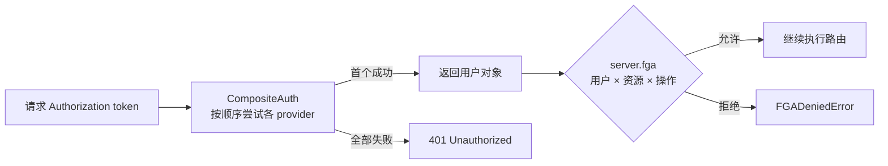

import { Canvas, Controls, Meta } from '@storybook/addon-docs/blocks';
import * as Stories from './auth-advanced.stories';

<Meta of={Stories} name="Docs" />

# 组合认证与细粒度授权

一个认证 provider 往往撑不住真实生产：Web 用户走 Clerk / Auth0 会话，第三方集成走 API key，老客户端还持着旧 JWT。Mastra 的 `CompositeAuth` 把多个认证提供者串成一条链，按声明顺序逐个尝试，首个认出请求的 provider 胜出；认证回答「你是谁」之后，FGA（Fine-Grained Authorization，企业版能力）继续回答「这个用户能否对这个资源执行这个操作」。本课实例离线模拟这两步判定：切换请求 token、provider 链顺序与 FGA 操作，读数会显示谁认证成功、FGA 判定允许还是拒绝。



| 关键对象 | 职责 | 回查要点 |
| --- | --- | --- |
| `CompositeAuth` | 串联多个认证 provider | `new CompositeAuth([a, b])`，数组顺序即尝试顺序 |
| `SimpleAuth` / `MastraJwtAuth` | 内置 provider | 分别来自 `@mastra/core/server` 与 `@mastra/auth` |
| `MastraAuthClerk` / `MastraAuthAuth0` | 第三方 provider | 独立包 `@mastra/auth-clerk`、`@mastra/auth-auth0` |
| `server.fga` | 挂载细粒度授权（企业版） | 配 `MastraFGAWorkos` 等实现 `IFGAProvider` 的 provider |
| `MastraFGAPermissions` | 内置权限枚举 | 经 `permissionMapping` 映射为 provider 权限 slug |

## 组合认证 CompositeAuth

`CompositeAuth` 来自 `@mastra/core/server`，构造参数是 provider 实例数组。请求到达时它取出 `Authorization` 头里的 token，按数组顺序依次调用每个 provider 的 `authenticateToken(token, request)`：返回用户的第一个 provider 胜出（first match wins），抛错或返回 `null` 都被视为「这个 provider 不认识它」，链静默继续；全部失败才返回 `null`，框架回 401。授权阶段同理，依次调用各 provider 的 `authorizeUser()` 直到某个返回 `true`。

<Canvas of={Stories.Interactive} />
<Controls of={Stories.Interactive} />

| 读者操作 | 可观察证据 |
| --- | --- |
| 切换「请求 token」 | 左栏命中的 provider 随之变化，读数显示谁认证成功 |
| 切换「provider 链顺序」 | 尝试次序翻转，不匹配的 provider 逐个「静默继续」 |
| 切换「FGA 操作」 | 右栏判定在允许 / 拒绝之间切换 |

最小接线：把链挂到 `server.auth`，单 provider 时直接传实例，多 provider 时包进 `CompositeAuth`。

```ts
import { Mastra } from '@mastra/core/mastra';
import { CompositeAuth, SimpleAuth } from '@mastra/core/server';
import { MastraAuthClerk } from '@mastra/auth-clerk';
import { MastraJwtAuth } from '@mastra/auth';

const composite = new CompositeAuth([
  // Web 用户会话（覆盖流量最多，放最前）
  new MastraAuthClerk({ publishableKey: process.env.CLERK_PUBLISHABLE_KEY, secretKey: process.env.CLERK_SECRET_KEY }),
  new MastraJwtAuth({ secret: process.env.MASTRA_JWT_SECRET }), // 服务间签发的 JWT
  new SimpleAuth({ tokens: { 'sk-integration-key-123': { id: 'integration-1', name: 'CI/CD Pipeline', type: 'api-key' } } }),
]);

new Mastra({ server: { auth: composite } });
```

### 顺序与失败行为

- **顺序影响性能**：每次请求都要从头试到命中为止，把覆盖流量最多的 provider 放第一位。API key 占多数就把 `SimpleAuth` 放最前，大多数请求走 Clerk 就把 Clerk 放最前。
- **单个失败静默继续**：某个 provider 内部抛错不会中断认证，链直接换下一个。代价是没有内建的调试输出——排查时在自定义 provider 的 `authenticateToken` 里加日志，或核对各 provider 的配置项。
- **两个硬边界**：链上所有 provider 共享同一个 `Authorization` 头里的 token（不能一个看请求头、一个看 cookie）；框架不会告诉应用层「这次是谁认出来的」。

### 用可辨识联合处理不同用户类型

不同 provider 返回的用户字段不同（Clerk 给 `sub` / `email`，API key 给 `id` / `name`）。文档推荐用可辨识联合加 `type` 判别字段，让应用代码在编译期收窄类型，而不是到处 `any`。

```ts
type ApiKeyUser = { type: 'api-key'; id: string; name: string };
type ClerkUser = { type: 'clerk'; sub: string; email: string };
type User = ApiKeyUser | ClerkUser;

// 应用代码里按 user.type 收窄：集成身份做限流与配额，真人用户走常规授权
if (user.type === 'api-key') { /* ... */ }
```

典型场景：API key 与 OAuth 会话共存、JWT 迁移到 Clerk 期间两套凭据并行（新 provider 在前、legacy 在后即可平滑过渡）、多家身份提供者并存（Web 用 Clerk、集成用 API key）。

### 第三方 provider 一览

官方按 provider 拆分独立包，命名规律是 `@mastra/auth-<provider>`，接入方式统一为「实例化 provider → 传入 `server.auth`」，配置项从环境变量读取。

| Provider | 包 / 入口 | 典型配置 |
| --- | --- | --- |
| Clerk | `@mastra/auth-clerk` | `publishableKey` + `secretKey`（可加 `jwksUri`） |
| Auth0 | `@mastra/auth-auth0` | `domain` + `audience` |
| WorkOS | `@mastra/auth-workos` | `MastraAuthWorkos`，可开 `fetchMemberships` 配合 FGA |
| Okta / Supabase / Better Auth / Google / Firebase | `@mastra/auth-*` 对应包 | 见 `integrations/auth/` 下各 provider 文档页，接入模式同上 |

自签 JWT 直接验签不需要第三方包，用 `@mastra/auth` 的 `MastraJwtAuth({ secret })` 即可；SimpleAuth 与 JWT 的单 provider 配置、公开与受保护路径见 [8.2.1 认证基础](?path=/docs/auth-basics--docs)。

## 细粒度授权 FGA

FGA 是 Mastra 企业版（EE）能力，生产使用需要 EE 许可证。它挂在 `server.fga` 上，与 `server.auth` 并列：认证先确定用户，FGA 再逐路由判权。设置了 `server.fga` 之后，没有认证用户的受保护动作一律拒绝（fail closed）；不设置则跳过 FGA 检查。

```ts
import { Mastra } from '@mastra/core/mastra';
import { MastraFGAPermissions } from '@mastra/core/auth/ee';
import { MastraAuthWorkos, MastraFGAWorkos } from '@mastra/auth-workos';

const mastra = new Mastra({
  server: {
    auth: new MastraAuthWorkos({
      fetchMemberships: true, // WorkOS FGA 依赖组织成员关系，必须开启
      mapUserToResourceId: (user) => user.teamId, // 认证后标记资源归属
    }),
    fga: new MastraFGAWorkos({
      resourceMapping: {
        agent: { fgaResourceType: 'team', deriveId: (ctx) => ctx.user.teamId },
        workflow: { fgaResourceType: 'team', deriveId: (ctx) => ctx.user.teamId },
        thread: { fgaResourceType: 'workspace-thread', deriveId: ({ resourceId }) => resourceId },
      },
      permissionMapping: {
        [MastraFGAPermissions.AGENTS_EXECUTE]: 'manage-workflows', [MastraFGAPermissions.WORKFLOWS_EXECUTE]: 'manage-workflows',
        [MastraFGAPermissions.MEMORY_READ]: 'read', [MastraFGAPermissions.MEMORY_WRITE]: 'update',
      },
    }),
    storedResources: { scope: true },
  },
});
```

两个约定：memory 相关检查的资源键用 `thread`（旧写法 `memory` 仍可用但已弃用）；`MastraFGAWorkos` 要求 `MastraAuthWorkos` 开启 `fetchMemberships: true`。

### resourceMapping 与 permissionMapping

- **resourceMapping** 的键是 Mastra 资源类型（agent / workflow / tool / thread 等），值由 `fgaResourceType`（FGA 侧资源类型）与 `deriveId(ctx)`（把 Mastra 资源 ID 换算成 FGA 资源 ID）组成。`ctx` 提供 `user`、`resourceId`（Mastra 侧归属 ID，如线程的 `resourceId`）、`requestContext`（高级租户解析）与 `metadata`；`deriveId` 返回 `undefined` 时回退为原始 Mastra 资源 ID。对线程而言，实际受检的是 `threadId`，但归属用的 `resourceId` 会转发出来，组合租户 ID（如 `userId-teamId-orgId`）因此可行。
- **permissionMapping** 把 `MastraFGAPermissions` 枚举映射为 provider 侧权限 slug，未映射的权限原样透传；provider 的 `validatePermissions()` 会在启动时校验整套映射。

### 存储资源与路由级 FGA

`storedResources: { scope: true }` 读取认证后由 `mapUserToResourceId()` 写入的 `MASTRA_RESOURCE_ID_KEY`，对 `/stored/agents`、`/stored/workspaces` 等存储资源路由的 list / read / update / publish / delete 做租户过滤。对象形式可自定义：

```ts
storedResources: { scope: { metadataKey: 'teamId', resolve: ({ user }) => user.teamId, requireScope: true } },
```

`requireScope` 为 `true`（或省略）时，解析不出归属的资源路由直接失败。自定义路由用 `fga` 元数据声明判权三要素：

```ts
export const getProjectRoute = createRoute({
  method: 'GET', path: '/projects/:projectId', responseType: 'json', requiresAuth: true,
  fga: { resourceType: 'project', resourceIdParam: 'projectId', permission: 'projects:read' }, handler: async () => ({ project: null }),
});
```

provider 上还有 `requireForProtectedRoutes: true`（受保护路由必须带 FGA 元数据）与 `auditProtectedRoutes: 'warn' | 'error'`（`'error'` 时缺元数据启动即失败）。核心 FGA 覆盖的执行点：Agent 执行与 `workflows:execute`、独立与 Agent 内工具的 `tools:execute`、线程的 `memory:read` / `memory:write` / `memory:delete`、存储资源路由按动作权限。注意 `createRun().start()` / `resume()` / `restart()` 等 SDK 直接调用不在本版核心检查范围内，需在应用代码自行守卫。

### 自定义 IFGAProvider

不接 WorkOS 时，可实现 `IFGAProvider`（类型来自 `@mastra/core/auth/ee`）的三个方法接入任意后端（OpenFGA、自建策略库等）：

```ts
import { FGADeniedError } from '@mastra/core/auth/ee';
import type { FGACheckParams, IFGAProvider, MastraFGAPermissionInput } from '@mastra/core/auth/ee';
class MyFGAProvider implements IFGAProvider {
  // check：查询后端，该用户对该资源是否有该权限
  async check(user, params: FGACheckParams): Promise<boolean> { return true; }
  async require(user, params: FGACheckParams): Promise<void> {
    if (!(await this.check(user, params))) throw new FGADeniedError(user, params.resource, params.permission);
  }
  async filterAccessible<T extends { id: string }>(
    user, resources: T[], resourceType: string, permission: MastraFGAPermissionInput,
  ): Promise<T[]> {
    return resources; // 逐个判权后过滤
  }
}
```

`check` 只回答布尔，`require` 在拒绝时抛 `FGADeniedError` 中断执行，`filterAccessible` 供列表路由过滤不可见资源。

### 系统角色 actor

定时任务、夜间报告这类系统调用没有「用户」。FGA 用 actor 信号表达系统身份：`actor: true` 或 `actor: { actorKind: 'system', agentId?, permissions?, scope? }`。默认受信 actor 在租户 scope 检查后跳过面向用户的 `require()`；provider 可选实现 `requireActor(actor, params)` 做按 agent 的最小权限校验（拒绝时抛 `FGADeniedError`；一旦实现，其错误会直接终止执行，不回退到组织级授权）。

```ts
await run.start({
  inputData: { city: 'London' },
  actor: { actorKind: 'system', sourceWorkflow: 'nightly-report', propagate: true },
});
```

- `propagate: true` 把 run 的 actor 传入各 step 的执行上下文；`true` 简写永不传播。不做传播时，step 内的 agent / tool 调用回落到用户成员关系解析——系统运行没有用户，会失败。
- 自定义 `execute` 函数永远不在传播覆盖范围内，要从 step context 读 `actor` 并显式传递；也可用 `createStep(agent, { actor: ... })` 按步覆盖，包括 `actor: undefined` 回落到用户授权。
- **actor 是受信输入，只能在服务端构造**，绝不能来自客户端输入：内置 Agent HTTP 路由会剥离客户端传入的 `actor`，并忽略客户端的 `organizationId`。durable workflow 的 resume 不会恢复 actor，要在受信侧显式传入；缺 actor 时回落用户授权，无用户即失败（fail closed）。
- `actor.permissions` 只是未验证的声明，真实授予要从可信来源（manifest 或按 `agentId` 查询 FGA 后端）解析；租户 scope 检查只确认存在受信 `organizationId`，需在 `requireActor` 里核实 `actor.agentId` 归属。

## 最佳实践

- **链序按流量排**：覆盖请求最多的 provider 放 `CompositeAuth` 数组首位；JWT 迁移 Clerk 期间新 provider 在前、legacy 在后，老客户端不掉线。
- **用户类型用联合类型收敛**：给每类用户一个 `type` 判别字段，应用层只写 `user.type` 分支，不写 `any`。
- **FGA 开启即收紧行动面**：设了 `server.fga` 后无用户请求一律拒绝，SDK 直连调用要在应用层补守卫；系统任务用服务端构造的 actor，并按需实现 `requireActor` 收紧到按 agent 最小权限。

## 常见问题

- **换了 token 类型整条链都 401？**
  先确认 token 形态确实被链上某个 provider 认识：所有 provider 共享同一个 `Authorization` 头，API key 不会以 Clerk 会话的形态出现；两套凭据并存时客户端要分别持有对应 token。
- **认证偶发失败却没有任何报错？**
  单个 provider 抛错会被静默吞掉并继续下一个，这是设计行为；在自己实现或包装的 provider 内加日志，或核对 `secretKey`、`jwksUri` 等配置是否正确。
- **配上 fga 之后定时任务跑不动了？**
  系统运行没有用户，fail closed 会拦下它：在服务端构造 actor（对象形式）并开 `propagate: true`；durable workflow 的 resume 要显式重传 actor，缺省时回落用户授权并失败。

## 总结回顾

摘要：

`CompositeAuth` 用一个数组把 SimpleAuth、MastraJwtAuth 与 Clerk / Auth0 / WorkOS 等第三方 provider 串成按序尝试的认证链：首个认出 `Authorization` 头 token 的 provider 胜出，单个失败静默继续，全部失败回 401；不同 provider 的用户差异用可辨识联合收敛。FGA（企业版）挂在 `server.fga`，经 `resourceMapping` 把 Mastra 资源换算到 FGA 资源、`permissionMapping` 把内置权限枚举映射为 provider 权限，覆盖 Agent / Workflow / 工具 / 线程记忆与存储资源路由，无用户即拒绝；系统任务用服务端构造的 actor（可 `propagate` 进 step），自定义后端则实现 `IFGAProvider` 的 check / require / filterAccessible。

一句话：

> 认证链解决「你是谁」，按声明顺序首个命中即胜出；FGA 解决「能不能动这个资源」，开启后无用户即拒绝，actor 只能服务端构造。

知识要点：

- `CompositeAuth` 的尝试顺序由什么决定？单个 provider 失败会怎样？
- 链上不同 provider 返回的用户类型不同时，文档推荐怎么处理？
- `resourceMapping.deriveId` 与 `permissionMapping` 各自把什么映射成什么？
- `storedResources: { scope: true }` 依据什么做租户过滤？自定义路由的 FGA 三要素是什么？
- `IFGAProvider` 的三个方法分别承担什么职责？
- actor 的 `propagate: true` 与 `true` 简写差在哪？为什么 actor 必须服务端构造？

## 参考资料

- [Composite Auth — Mastra Docs](https://mastra.ai/docs/auth/composite-auth)
- [Fine-Grained Authorization (FGA) — Mastra Docs](https://mastra.ai/docs/auth/fga)
