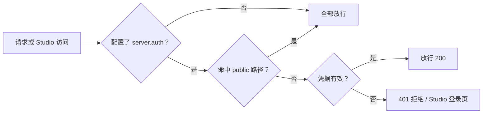

import { Canvas, Controls, Meta } from '@storybook/addon-docs/blocks';
import * as Stories from './auth-basics.stories';

<Meta of={Stories} name="Docs" />

# 认证基础

Mastra Server 的认证是**可选项**：不在 `Mastra` 配置里设置 `server.auth` 时，所有 API 路由与 Studio 都公开可访问；一旦配置，内置 API 路由（如 `/api/agents/*`、`/api/workflows/*`）和 Studio UI 会被一并锁住，每个请求都要过一次「凭据校验 → 路径判定」。本课讲两种内置提供者 `SimpleAuth` 与 `MastraJwtAuth` 的最小配置、路径放行规则（`protected` / `public` / `requiresAuth`），第三方提供者只给选型边界，组合认证与 Clerk / WorkOS 等细粒度接入见[组合认证与细粒度授权](?path=/docs/auth-advanced--docs)。



## 配置一览

| 方案 | 来源 | 凭据 | 适用 |
| --- | --- | --- | --- |
| 不配置 | - | - | 本地原型，全部公开 |
| `SimpleAuth` | `@mastra/core/server`（内置，无需安装） | 启动时写死的 `tokens` 映射 | 开发调试 |
| `MastraJwtAuth` | `@mastra/auth`（需安装） | `MASTRA_JWT_SECRET` 验签的 JWT | 生产自管密钥 |
| 第三方提供者 | 官方集成 | Auth0 / Clerk / Okta / Supabase / WorkOS / Better Auth / Google / Firebase | 生产，见 8.2.2 |

## 保护范围与路径规则

**保护对象**：配置 `server.auth` 后，全部内置 API 路由与自定义路由默认要求认证——无论请求来自 Studio 还是直接 API 调用；Studio UI 同时显示登录界面，并启用基于角色的访问控制（RBAC）。

**默认路径规则**：保护 `/api/*`，并把 `/api` 与 `/api/auth/*` 视为公开。

<Canvas of={Stories.Interactive} />
<Controls of={Stories.Interactive} />

| 读者操作 | 可观察证据 |
| --- | --- |
| 认证配置切到「无认证」 | 三条路径全部放行，与是否带 token 无关 |
| 保持认证配置，切换请求凭据 | API 路由在放行与 401 拒绝间切换；Studio 在进入工作台与显示登录页间切换 |
| 观察公开路径一行 | 始终放行，不受配置与凭据影响 |

路径规则两个坑：

- 自定义 `server.apiPrefix` 后，默认模式不再匹配，内置路由会脱离保护范围，必须同步更新 `protected` 与 `public`。
- 自己写的 API 路由想单独公开：路由定义加 `requiresAuth: false`，或把路径加进 `server.auth.public`。

## SimpleAuth：开发期令牌

这是什么：`@mastra/core/server` 内置提供者，把一组启动时确定的 token 字符串映射到用户对象，不用额外安装，适合本地快速锁门。

```typescript
import { Mastra } from '@mastra/core';
import { SimpleAuth } from '@mastra/core/server';

type User = { id: string; name: string; role: 'admin' | 'user' };

export const mastra = new Mastra({
  server: {
    auth: new SimpleAuth<User>({
      tokens: {
        'sk-admin-token-123': { id: 'user-1', name: 'Admin User', role: 'admin' },
        'sk-user-token-456': { id: 'user-2', name: 'Regular User', role: 'user' },
      },
    }),
  },
});
```

请求时默认检查 `Authorization` 头（带不带 `Bearer` 前缀均可）和 `X-Playground-Access`；需要更多入口时用 `headers` 选项追加自定义头，如 `['X-API-Key', 'X-Custom-Auth']`。

```bash
curl -X POST http://localhost:4111/api/agents/myAgent/generate \
  -H "Content-Type: application/json" \
  -H "Authorization: Bearer sk-admin-token-123" \
  -d '{"messages": "Hello"}'
```

其他可选配置：`headers`（额外检查的请求头）、`name`（日志里的 provider 名称）、`protected` / `public`（需要认证 / 绕过认证的路径模式数组）；`authorizeUser: (user, request) => boolean` 自定义授权，返回 `false` 即拒绝，可实现基于角色的判断。

边界：token 只存内存、无过期与刷新机制、无加密验证，文档明确它面向简单性而非生产安全——生产环境换 JWT 或第三方提供者。

## MastraJwtAuth：生产 JWT

这是什么：官方 `@mastra/auth` 包提供的 JWT 验证器，用共享密钥验签，凭据由你自行签发，适合生产环境。

```bash
npm install @mastra/auth@latest
```

```typescript
import { Mastra } from '@mastra/core';
import { MastraJwtAuth } from '@mastra/auth';

export const mastra = new Mastra({
  server: {
    auth: new MastraJwtAuth({
      secret: process.env.MASTRA_JWT_SECRET,
    }),
  },
});
```

`.env` 里两个变量：`MASTRA_JWT_SECRET` 是服务端验签密钥；`MASTRA_JWT_TOKEN` 存放签发好的 JWT 供客户端使用。签发可用 jwt.io 的 JWT Encoder：把密钥填进 "Sign JWT: Secret" 区，生成一个有效 JWT 后复制进去。

客户端两种接法——`MastraClient` 统一带 Bearer 头，或直接在 HTTP 请求里带头：

```typescript
import { MastraClient } from '@mastra/client-js';

export const mastraClient = new MastraClient({
  baseUrl: 'https://<mastra-api-url>',
  headers: {
    Authorization: `Bearer ${process.env.MASTRA_JWT_TOKEN}`,
  },
});
```

```bash
curl -X POST http://localhost:4111/api/agents/weatherAgent/generate \
  -H "Content-Type: application/json" \
  -H "Authorization: Bearer <your-jwt>" \
  -d '{"messages": "Weather in London"}'
```

Studio 侧：进入 Settings → Headers，点击 Add Header，名填 `Authorization`，值填 `Bearer <your-jwt>`，之后 Studio 发出的请求会自动携带该头。

## 最佳实践

- 开发期用 `SimpleAuth` 最快锁门；上线前必须换成 `MastraJwtAuth` 或第三方提供者——`SimpleAuth` 的 token 在内存里，重启即失效，也无法主动吊销。
- 改 `server.apiPrefix` 时同步更新 `protected` / `public`，否则内置路由落在默认模式之外，等于裸奔。

## 常见问题

- 配置认证后接口全部返回 401？
  先确认请求带了凭据：`SimpleAuth` 认 `Authorization`（`Bearer` 前缀可省）与 `X-Playground-Access`；JWT 方案检查令牌是否用 `MASTRA_JWT_SECRET` 签出。Studio 里在 Settings → Headers 配置该头。
- 只想让某个自定义路由公开？
  路由定义加 `requiresAuth: false`；整段路径则加进 `server.auth.public`，注意别把敏感路径误放进 `public`。

## 总结回顾

摘要：

Mastra 认证是可选配置：`server.auth` 不配即公开，配置后内置 API 路由与 Studio 一并被保护，默认保护 `/api/*` 并把 `/api` 与 `/api/auth/*` 视为公开，自定义路由用 `requiresAuth: false` 或 `public` 单独开放。`SimpleAuth` 来自 `@mastra/core/server`，用启动时写死的 `tokens` 映射加 `Authorization` 头做开发期认证，可配 `authorizeUser` 做授权判断，但 token 在内存、无过期无加密；`MastraJwtAuth` 来自需安装的 `@mastra/auth` 包，用 `MASTRA_JWT_SECRET` 验签，客户端 `MastraClient` 与 Studio（Settings → Headers）都通过 `Authorization: Bearer` 头携带 JWT。

一句话：

> 认证是整体开关，路径规则决定豁免范围，`SimpleAuth` 只属于开发期，生产用 JWT 或第三方提供者。

知识要点：

- `server.auth` 配置后哪些对象被保护？默认哪些路径放行？
- `SimpleAuth` 从哪些请求头取 token？`authorizeUser` 返回什么时拒绝访问？
- `MastraJwtAuth` 需要哪个包和环境变量？Studio 与客户端分别怎么带 token？
- 自定义 `apiPrefix`、公开单个自定义路由时分别要改什么？

## 参考资料

- [Authentication Overview](https://mastra.ai/docs/auth/overview)
- [Simple Auth](https://mastra.ai/docs/auth/simple-auth)
- [JSON Web Token (JWT)](https://mastra.ai/docs/auth/jwt)
