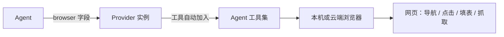

import { Canvas, Controls, Meta } from '@storybook/addon-docs/blocks';
import * as Stories from './browser.stories';

<Meta of={Stories} name="Docs" />

# 浏览器自动化

Mastra 的 browser 能力让 Agent 操控真实浏览器完成网页任务：导航、点击、填表、抓取数据、多步自动化，适合需要 JavaScript 渲染或登录态的页面。核心机制只有一步——创建一个 browser provider 实例，把它赋给 `new Agent({ browser })` 字段，provider 的全部浏览器工具就自动加入 agent 工具集，不需要手写任何工具。

选 provider 就是在选两件事：浏览器跑在哪里（本机还是云端）、元素怎么定位（无障碍树还是 AI 检测）。边界：要操控的是整台桌面（任意应用、鼠标键盘、截图）时，走 [6.2.3 桌面沙箱](?path=/docs/sandbox-computer--docs)；只针对网页的操作用本课的 browser provider。



| Provider | 包名 | 运行位置 | 定位方式 | 适用场景 |
| --- | --- | --- | --- | --- |
| AgentBrowser | `@mastra/agent-browser` | 本机（Playwright） | 无障碍树 | 通用自动化与抓取 |
| StagehandBrowser | `@mastra/stagehand` | Browserbase 云端或本机 | AI 检测元素 | 自然语言操作复杂页面 |
| FirecrawlBrowser | `@mastra/browser-firecrawl` | Firecrawl 托管沙箱 | 复用 AgentBrowser 工具 | 免本地浏览器的抓取 |
| BrowserViewer | CLI provider | 本机 Chrome | CDP 注入 | shell 命令行工具调试 |

## Provider 选型

所有 provider 实现同一套 browser 接口，赋给 Agent 的写法完全一致，差别只在「浏览器跑在哪、怎么定位元素」。按场景入口选择：

- 在本机做确定性自动化或抓取 → AgentBrowser（Playwright 驱动）。
- 页面结构未知、要让模型用自然语言描述操作 → Stagehand。
- 不想安装本地浏览器、只要抓取结果 → FirecrawlBrowser（托管沙箱）。
- 在 workspace agent 里用 shell 驱动命令行浏览器工具 → BrowserViewer（CLI provider）。

下方 Canvas 离线对照四个 provider 的运行位置、定位方式与部署要求；切换控件，读数随选中项变化。

<Canvas of={Stories.Interactive} />

<Controls of={Stories.Interactive} />

### AgentBrowser：Playwright 无障碍树定位

AgentBrowser 基于 Playwright，用无障碍树定位元素，适合页面结构相对稳定的通用自动化与抓取。安装 `@mastra/agent-browser` 后创建实例并赋给 Agent：

```typescript
import { AgentBrowser } from '@mastra/agent-browser';
import { Agent } from '@mastra/core/agent';

export const browser = new AgentBrowser({
  headless: false,
});

export const webAgent = new Agent({
  id: 'web-agent',
  name: 'Web Agent',
  model: 'openai/gpt-5.6-sol',
  browser,
  instructions: '你是网页自动化助手，用浏览器工具导航网站并完成任务。',
});
```

可观察证据：agent 自动获得 provider 的全部浏览器工具（打开 URL、选择元素、输入文本、读取页面内容等），模型按 instructions 自行决定调用哪个工具。边界：`headless: false` 会弹出真实浏览器窗口，便于调试；无障碍树定位要求页面可访问性结构可用。

### StagehandBrowser：自然语言操作

Stagehand 由 Browserbase 提供，用 AI 检测页面元素：`stagehand_act` 接受自然语言描述（如 "Press the Sign In button"）即可定位并操作，适合结构未知或频繁改版的页面。安装 `@mastra/stagehand`：

```typescript
import { StagehandBrowser } from '@mastra/stagehand';
import { Agent } from '@mastra/core/agent';

const browser = new StagehandBrowser({
  headless: false,
  model: 'openai/gpt-5.6-sol',
});

export const stagehandAgent = new Agent({
  id: 'stagehand-agent',
  model: 'openai/gpt-5.6-sol',
  browser,
});
```

工具集与证据：agent 获得 `stagehand_navigate`、`stagehand_act`、`stagehand_extract`、`stagehand_observe`、`stagehand_screenshot`。`stagehand_extract` 抽取结构化 JSON（如商品名、价格、库存状态）；`stagehand_observe` 返回当前页面可用动作列表；`stagehand_screenshot` 返回 PNG 图像内容，需要具备视觉能力的模型，不支持时用 `excludeTools: ['stagehand_screenshot']` 移除，文本与结构化数据改走 extract 或 observe。

### FirecrawlBrowser：托管沙箱抓取

FirecrawlBrowser 在 Firecrawl 托管的浏览器会话上运行 AgentBrowser 工具，本机无需安装任何浏览器，适合只要抓取结果、不想维护浏览器环境的场景：

```typescript
import { FirecrawlBrowser } from '@mastra/browser-firecrawl';

const browser = new FirecrawlBrowser({
  apiKey: process.env.FIRECRAWL_API_KEY,
});
```

可观察证据：工具集与 AgentBrowser 相同，但浏览器会话跑在 Firecrawl 侧，本地零浏览器依赖。边界：需要网络与 Firecrawl API key；依赖本机登录态的操作不适合托管会话。

### BrowserViewer：CLI 调试

BrowserViewer 是 CLI provider：启动本机 Chrome，并把 CDP URL 注入 `agent-browser`、`browser-use`、`browse` 等命令行工具，适合 workspace agent 通过 shell 命令驱动浏览器的调试场景。它不走 `new Agent({ browser })` 的工具集模式，而是给命令行工具提供可连接的浏览器。

## 云端连接与实时观察

云端连接有三种方式，按已有服务选择：Firecrawl API 直接用 FirecrawlBrowser（见上节）；Browserbase 用 Stagehand 原生云端，配 `env: 'BROWSERBASE'` 加 apiKey 与 projectId；已有任意 CDP 兼容浏览器服务时，给 AgentBrowser 传 `cdpUrl` 即可：

```typescript
const browser = new AgentBrowser({
  cdpUrl: process.env.BROWSER_CDP_URL,
  headless: true,
});
```

**Screencast 实时串流**：provider 可向 Mastra Studio 串流浏览器实时画面，默认启用。它依赖 WebSocket，需额外安装 `ws` 与 `@hono/node-ws`——两者默认不包含，因为与 Cloudflare Workers 等 serverless 环境不兼容；未安装时只禁用 screencast，其余功能正常。可调参数：

```typescript
const browser = new AgentBrowser({
  screencast: {
    enabled: true,
    format: 'jpeg',
    quality: 80,
    maxWidth: 1280,
    maxHeight: 720,
  },
});
```

**会话录制（Beta）**：仅 AgentBrowser 与 StagehandBrowser 支持。配置 `recording.outputDir` 后，agent 工具集额外加入 `browser_record`（启动 / 检查 / 停止）与 `browser_record_caption`（标注主要动作），停止后保存视频并返回路径。格式为 Motion-JPEG AVI，无需 ffmpeg。默认与限制：最长 30 秒（硬上限 120 秒）、最大帧尺寸 1024 × 720、caption 限 80 字符、每个进程同时只能有一个录制；自定义 `outputPath` 必须为绝对路径且位于 `outputDir` 内。

```typescript
import { join } from 'node:path';

const browser = new AgentBrowser({
  recording: {
    outputDir: join(process.cwd(), 'browser-recordings'),
  },
});
```

## 最佳实践

- 按「结构是否已知」选定位方式：结构稳定的页面用 AgentBrowser 的无障碍树，结果可预期；结构未知或频繁改版用 Stagehand 的自然语言操作，让模型现场判断元素。
- 按「已有服务」选云端方式：已有 Browserbase 账号走 Stagehand 原生云端；只想免部署抓取用 Firecrawl；自建或第三方 CDP 浏览器服务用 `cdpUrl`，不绑定厂商。
- serverless 部署不要安装 `ws` 与 `@hono/node-ws`：Mastra 自动禁用 screencast，浏览器功能其余部分不受影响。
- 录制仍处 Beta，可能有破坏性变更；生产代码不要依赖录制产物的路径与格式细节。

## 常见问题

- 装了 provider 包，但 agent 没有浏览器工具？
  确认 browser 实例真的传入了 `new Agent({ browser })` 的 `browser` 字段；只有字段赋值才会把 provider 工具加入工具集，仅 import 不会生效。
- Studio 里看不到浏览器画面？
  安装 `ws` 与 `@hono/node-ws` 并在 server 入口启用 WebSocket；缺装时 Mastra 只静默禁用 screencast，不报错。
- 录像文件异常或保存路径报错？
  录制是 Motion-JPEG AVI，无需 ffmpeg；确认自定义 `outputPath` 为绝对路径且位于 `recording.outputDir` 内，且当前进程没有其他录制在进行。
- `stagehand_screenshot` 调用失败？
  模型不支持视觉输入时，用 `excludeTools: ['stagehand_screenshot']` 移除截图工具，改用 `stagehand_extract` 或 `stagehand_observe` 获取文本与结构化数据。

## 总结回顾

摘要：

浏览器自动化的接入点只有一个：把 provider 实例赋给 `new Agent({ browser })`，provider 工具自动进入 agent 工具集。四个 provider 覆盖四种场景——AgentBrowser 用 Playwright 无障碍树做本机通用自动化与抓取；Stagehand 用 AI 检测元素，支持自然语言操作、结构化抽取与截图；FirecrawlBrowser 在托管沙箱复用 AgentBrowser 工具，本机零浏览器依赖；BrowserViewer 作为 CLI provider 向命令行工具注入 CDP URL。云端连接可走 Firecrawl API、Stagehand 原生 Browserbase 或任意 CDP 端点；Screencast 向 Studio 实时串流画面（需 `ws` 加 `@hono/node-ws`），会话录制（Beta）产出无需 ffmpeg 的 Motion-JPEG AVI，默认最长 30 秒。

一句话：

> 选 provider 就是选「浏览器跑在哪、元素怎么定位」，而接入方式始终是 `new Agent({ browser })`。

知识要点：

- 把 browser 赋给 Agent 后，agent 工具集发生了什么变化？
- 四个 provider 各自的运行位置、定位方式与部署要求是什么？
- 三种云端连接方式分别对应哪类服务？
- Screencast 依赖哪两个包，缺装时影响什么、不影响什么？
- 会话录制的默认时长、视频格式与 outputPath 约束是什么？

## 参考资料

- [Mastra Browser 文档](https://mastra.ai/docs/browser)
- [Stagehand 集成页](https://mastra.ai/integrations/browsers/stagehand)
