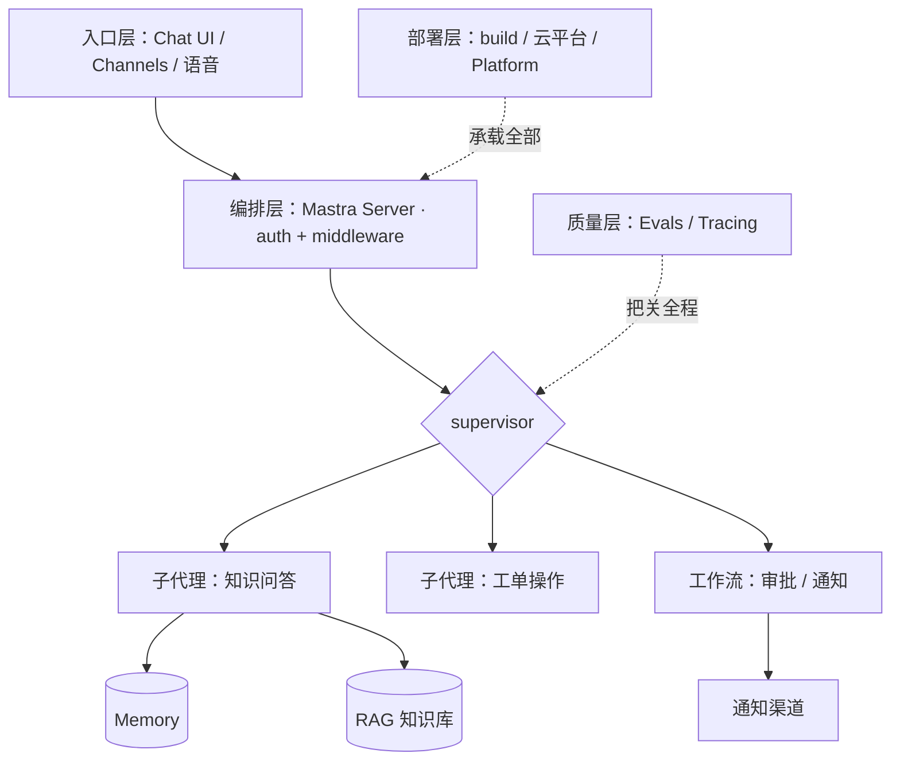

import { Canvas, Controls, Meta } from '@storybook/addon-docs/blocks';
import * as Stories from './capstone.stories';

<Meta of={Stories} name="Docs" />

# 完整示例项目

这是整套手册的收官课。前面的课程把 Agent、工具、工作流、记忆、RAG、Server、Evals 与部署逐个讲透；本课把它们组装成一个「智能客服 / 知识助手」式的完整应用架构：入口接收请求，Mastra Server 做鉴权与中间件，supervisor 协调子代理，确定性步骤交给工作流，Memory 与 RAG 供给上下文，Evals 把关质量，最后部署上线。

本课给的是文字架构加分层代码骨架，不追求可运行——真正可运行的起点是官方模板：先从 mastra.ai/templates 克隆一个相近模板，再按本课分层逐层改造成自己的项目。每一层都标注了深入课程链接，本课即整套手册的导航总图。



开场参考表即导航总图，与实例读数一致；课程链接格式为 `?path=/docs/<slug>--docs`：

| 层 | 职责 | 深入课程 | 起步模板 |
| --- | --- | --- | --- |
| 入口 | 接入用户并渲染流式回复 | [chat-ui](?path=/docs/chat-ui--docs)、[web-frameworks](?path=/docs/web-frameworks--docs)、[client-sdk](?path=/docs/client-sdk--docs)、[channels](?path=/docs/channels--docs) | Slack Agent、Chat with YouTube |
| 编排 | 鉴权后协调子代理与工作流 | [server-api](?path=/docs/server-api--docs)、[middleware](?path=/docs/middleware--docs)、[auth-basics](?path=/docs/auth-basics--docs)、[subagents](?path=/docs/subagents--docs)、[workflow-basics](?path=/docs/workflow-basics--docs)、[workflow-human-in-the-loop](?path=/docs/workflow-human-in-the-loop--docs) | Customer Support and Refund Agent |
| 记忆 | 记住用户与对话 | [memory-basics](?path=/docs/memory-basics--docs)、[working-memory](?path=/docs/working-memory--docs)、[semantic-recall](?path=/docs/semantic-recall--docs) | Agent Harness |
| 知识 | 知识库检索问答 | [rag-pipeline](?path=/docs/rag-pipeline--docs)、[chunking-and-embedding](?path=/docs/chunking-and-embedding--docs)、[retrieval-and-rerank](?path=/docs/retrieval-and-rerank--docs)、[graph-rag](?path=/docs/graph-rag--docs) | Organization Intelligence、Chat with PDF |
| 质量 | 上线前后持续把关 | [evals-basics](?path=/docs/evals-basics--docs)、[evals-datasets](?path=/docs/evals-datasets--docs)、[evals-ci](?path=/docs/evals-ci--docs)、[tracing](?path=/docs/tracing--docs) | 无专属模板 |
| 部署 | 构建并上线 | [deployment](?path=/docs/deployment--docs)、[cloud-deployment](?path=/docs/cloud-deployment--docs)、[workflow-runners](?path=/docs/workflow-runners--docs)、[mastra-platform](?path=/docs/mastra-platform--docs) | 各模板仓库自带脚本 |

## 参考架构：一次请求的六层旅程

共同模型：用户消息自上而下穿越架构——入口接收后交给 Mastra Server；Server 完成认证与请求上下文注入，把对话交给 supervisor；supervisor 按问题类型委派子代理（开放推理），或触发工作流（审批、通知等确定性步骤）；子代理执行时从 Memory 取对话历史与用户事实，从 RAG 取知识库证据；质量层贯穿开发与运行全程，部署层承载以上全部。

<Canvas of={Stories.Interactive} />
<Controls of={Stories.Interactive} />

| 读者操作 | 可观察证据 |
| --- | --- |
| 切换「高亮架构层」 | 画布高亮对应层，读数切换该层职责、深入课程与起步模板 |
| 打开 Show code | 看到该 Canvas 实际渲染的 `example.ts` 分层导航数据 |

### 入口层：把用户接进来

这是什么：网页聊天界面、Slack / Discord 等消息渠道或语音入口，负责把用户请求送进 Mastra 并渲染流式回复。Web 端两条常见路线：用 Mastra Client SDK 直连服务端，或经 AI SDK 格式转换接入 assistant-ui / CopilotKit 等聊天组件。

```ts
// 浏览器端骨架：Mastra Client SDK 调用服务端 agent 的流式接口
import { MastraClient } from '@mastra/client-js';

const client = new MastraClient({ baseUrl: '/api' });
const stream = await client.getAgent('support-supervisor').stream({ messages });
```

边界：入口层不写业务逻辑；鉴权、限流与租户隔离发生在下一层 Server。消息平台（Slack / Teams / Telegram 等）接入见 [channels](?path=/docs/channels--docs)。

### 编排层：supervisor、子代理与工作流

这是什么：请求的调度中枢。官方多智能体指南把「任务推进中谁掌握控制权」作为选型核心，给出 supervisor / handoffs / workflows / council 四种模式：开放任务用 supervisor（本参考架构的选择），路径固定可预测的用工作流，二者常组合使用。子代理通过 supervisor 的 `agents` 属性挂载，由 `stream()` / `generate()` 协调，并可用委派钩子与消息过滤调控。

```ts
// supervisor 骨架：子代理通过 agents 属性挂载（官方 supervisor 模式）
export const supervisor = new Agent({
  name: 'support-supervisor',
  model: 'openai/gpt-4o',
  instructions: '受理请求；知识问答委派 kb-agent，退款类触发 refund 工作流',
  agents: { 'kb-agent': kbAgent, 'ticket-agent': ticketAgent },
});
```

```ts
// 确定性步骤骨架：退款走工作流，审批挂起等人工，通过后通知
export const refundFlow = createWorkflow({ id: 'refund', inputSchema, outputSchema })
  .then(classifyStep)
  .then(awaitApprovalStep) // suspend 挂起等人工审批，resume 提交决策
  .then(notifyStep)
  .commit();
```

Server 把它们装配成一个服务，并挂上鉴权与请求上下文中间件：

```ts
// 装配骨架：agents + workflows + 存储进同一个 Mastra 实例
export const mastra = new Mastra({
  agents: { supervisor },
  workflows: { refundFlow },
  storage,
  server: { middleware: [authMiddleware] }, // 鉴权与 RequestContext 注入
});
```

边界：官方原则是「尽量先从单 agent 开始」，确有质量或并行收益再拆子代理；supervisor 模式的上限由委派质量决定，结果高度依赖委派时传递的上下文。

### 记忆与知识层：给回答供给上下文

这是什么：两条不同的上下文链路。Memory 按 resource / thread 双标识存对话，工作记忆跨线程记住用户关键事实，语义召回按向量捞回相关历史；RAG 负责项目静态知识：文档切块、嵌入、入库，检索封装成工具供 agent 调用。

```ts
// Memory 骨架（取值为示例，默认值以记忆各课为准）
export const memory = new Memory({
  options: {
    workingMemory: { enabled: true },             // 跨线程记住用户画像
    semanticRecall: { topK: 5, messageRange: 2 }, // 语义召回相关历史
  },
});
```

```ts
// RAG 检索工具骨架：切块入库之后的查询端
const kbTool = createTool({
  id: 'search-kb',
  inputSchema: z.object({ query: z.string() }),
  execute: async ({ context }) => {
    const results = await vectorQuery(context.query, { topK: 5 });
    return { chunks: rerank(results) }; // 返回带来源的片段
  },
});
```

边界：知识问答查静态知识库，记忆召回查对话历史，两条链路别混用——混在一起会互相稀释相关性；元数据过滤（租户、权限）应在两边都做。

### 质量层：Evals 把关，Tracing 定位

这是什么：上线前后各一道闸门。上线前用数据集与实验批量评估，gates 与 verdicts 判定通过与否；上线后用 tracing 的 span 结构定位慢调用与回归，CI 中跑零 LLM 的 quick checks 守住底线。

```ts
// 上线前骨架：对数据集批量跑评估实验，gates 全部通过才发布
const experiment = await dataset.run({ agents: { supervisor } });
```

边界：评估不是上线后才补的事——改提示词、换模型、拆子代理之前都应先有数据集基线，否则无法判断是改进还是回归。

### 部署层：从 build 到上线

```bash
mastra build   # 产出可自托管的部署产物
mastra deploy  # 或直接部署到 Mastra Platform
```

自托管跑在 Node 服务器上；Vercel / Cloudflare / AWS 等云平台各有适配；长时工作流配 Inngest / Temporal 运行器，后台任务用 worker 进程。

## 从官方模板起步

官方 templates 页提供 20+ 个可克隆的起步项目，每个模板仓库都含快速上手指南：本地脚手架、填 API key、`npm run dev` 后在 `localhost:4111` 打开 Studio。与本参考架构最贴近的三个：

- Customer Support and Refund Agent：工单处理加需人工审核的退款方案，对应编排层与工作流审批。
- Organization Intelligence：本地文件 / Drive / S3 问答并附引用，对应知识层 RAG。
- Agent Harness：带工具、记忆、审批与调度的多步任务执行，对应记忆层与长时运行。

起步命令（`--llm` 可选 openai / anthropic / google / xai）：

```bash
npm create mastra@latest support-app -- --llm openai
```

改造路径：模板起步 → 按开场表逐层替换为本项目的模型、Memory、RAG 与审批流 → 补 Evals 数据集 → 部署。多 agent 项目的文件组织参考 [file-based-agents](?path=/docs/file-based-agents--docs)。

## 最佳实践

- 先从单 agent 起步，验证瓶颈确实在委派质量后再拆子代理；官方明确「Start with one agent when possible」。
- 开放推理交给 supervisor，可枚举的确定性步骤（审批、通知、合规检查）固化进工作流；判断框架见 [agent-or-workflow](?path=/docs/agent-or-workflow--docs)。
- 先建 Evals 数据集基线，再动提示词或换模型，避免凭感觉判断回归。
- 不要从空目录写起：克隆最相近的官方模板再按层改造，起步成本最低。

## 常见问题

- 模板能跑，但不知道怎么改成自己的业务？
  按开场表从编排层向下逐层替换：先换模型与 instructions，再挂自己的工具与工作流，最后接 Memory 与 RAG；每层改动后回 Studio 验证再进行下一层。
- supervisor 总是委派给错误的子代理？
  收紧 supervisor 的 instructions 中各子代理职责的边界描述，用委派钩子（如 onDelegationStart）观察委派过程；职责仍然重叠时，把那部分委派改写为工作流步骤。

## 总结回顾

摘要：

本课把手册各章组装成一个「智能客服 / 知识助手」式参考架构：入口层接入用户，编排层用 Mastra Server 做鉴权与中间件、用 supervisor 协调子代理、用工作流承载审批与通知等确定性步骤；记忆层与知识层分别供给对话历史与知识库证据；质量层用 Evals 数据集在上线前把关、用 Tracing 在上线后定位问题；部署层把构建产物送上云平台或 Mastra Platform。官方模板是每层的可运行起点，逐层改造即可变成自己的项目。

一句话：

> 先从官方模板起步，再按「入口 → 编排 → 记忆 → 知识 → 质量 → 部署」六层逐层改造成自己的项目，每一层都有对应课程可深入。

知识要点：

- 六层参考架构各自负责什么，一次用户请求按什么顺序穿越它们？
- supervisor 模式里子代理挂在哪个属性上，确定性步骤为什么放工作流？
- 官方 templates 如何获取，哪三个模板与本参考架构最贴近？
- 上线前质量把关用什么机制，为什么要在改提示词之前建数据集？

## 参考资料

- [Mastra Templates](https://mastra.ai/templates)
- [Multi-Agent Systems 指南](https://mastra.ai/docs/guides/multi-agent-systems)
