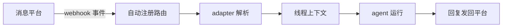

import { Canvas, Controls, Meta } from '@storybook/addon-docs/blocks';
import * as Stories from './channels.stories';

<Meta of={Stories} name="Docs" />

# Channels 消息渠道

Channels（`@mastra/core` ≥ 1.22.0）把 agent 接入 Slack、Teams、Discord、Telegram 等消息平台：给 agent 挂上平台 adapter，平台事件经自动注册的 webhook 路由进入 agent，回复再发回原平台。底层基于 Chat SDK（chat-sdk.dev），官方 adapter 之外，任何 Chat SDK 兼容 adapter（Linear、Lark、Matrix 等）都能以同一方式接入。

本课实例离线复现「消息入站出站流」：切换平台与消息类型，观察 webhook 路由、线程上下文与回复形态如何变化。



| 回查项 | 值 |
| --- | --- |
| 引入版本 | `@mastra/core@1.22.0` |
| 官方平台 | Slack、Teams、Discord、Telegram、WhatsApp、GitHub（指南另有 iMessage） |
| Webhook 路由 | `/api/agents/<agent-id>/channels/<platform>/webhook`，挂 adapter 后自动注册 |
| 响应策略 | 先返回 200，处理放后台，靠存储按事件 ID 去重 |
| 线程上下文 | 线程首条 @ 自动拉取最近 10 条消息 |
| 工具审批 | `requireToolApproval` 渲染为平台交互卡片（批准 / 拒绝按钮） |
| 回复形态 | markdown，平台不支持时降级纯文本；`inlineMedia` 支持多模态 |
| Serverless | 需要 `waitUntil` + Redis Streams pub/sub |

## 接入消息平台

### adapter 挂载

adapter 由工厂函数创建，挂到 agent 配置的 `channels.adapters` 数组，一个 agent 可同时挂多个平台 adapter。以 Slack 为例：

```ts
import { Agent } from '@mastra/core/agent';
import { createSlackAdapter } from '@mastra/channel-slack';

const slackAdapter = createSlackAdapter({
  token: process.env.SLACK_BOT_TOKEN,
  // 可选：配置后只在被 @ 提及时响应，不再扫描整段频道历史
  botUserId: process.env.SLACK_BOT_USER_ID,
  // 可选：只监听单个频道（与 botUserId 按需二选一）
  // channelId: 'C0123456789',
});

export const assistant = new Agent({
  name: 'assistant',
  instructions: '你是值守在 Slack 里的支持助手。',
  model: 'openai/gpt-4o',
  channels: { adapters: [slackAdapter] },
});
```

可观察边界：

- 挂载后无需手写路由：server 自动注册 `/api/agents/assistant/channels/slack/webhook`。
- Slack 应用需开通 Bot Token Scopes：`chat:write`、`app_mentions:read`、`users:read`、`im:history`、`groups:history`、`channels:history`。
- 在 Slack 应用的 Event Subscriptions 里把 Request URL 指向上面的 webhook 路由，并订阅 `app_mention`、`message.im`、`message.groups`、`message.channels` 事件。

### 官方平台与自定义 adapter

官方提供六大平台 adapter 与集成指南；不在官方列表里的平台，只要提供 Chat SDK 兼容 adapter 即可挂进同一个 `channels.adapters`。

| 平台 | 接入方式 |
| --- | --- |
| Slack | `@mastra/channel-slack` 的 `createSlackAdapter` |
| Teams / Discord / Telegram / WhatsApp / GitHub | 官方各平台 adapter，包名与凭据见 mastra.ai 对应集成页 |
| 其他（Linear、Lark、Matrix 等） | 任何 Chat SDK 兼容 adapter，同样挂入 `channels.adapters` |

## 消息入站出站流

一条消息从平台到回复经过五步：平台推送 webhook 事件 → 自动注册路由先回 200 并把处理放到后台（存储按事件 ID 去重）→ adapter 解析消息与发送者 → 线程首条 @ 时拉取最近 10 条上下文 → agent 运行后把回复发回平台；普通消息回复 markdown 文本，工具审批渲染为交互卡片。

<Canvas of={Stories.Interactive} />

<Controls of={Stories.Interactive} />

| 读者操作 | 可观察证据 |
| --- | --- |
| 切换「平台 adapter」 | 路由横幅中的 `<platform>` 段与第 3 步 adapter 工厂同步变化 |
| 切换「消息类型」为工具审批 | 第 5 步变为交互卡片说明，读数「回复形态」变为「交互卡片」 |
| 关闭「拉取线程上下文」 | 第 4 步与读数「上下文条数」归零 |
| 打开 Show code | 看到 `simulateChannel()` 组装的完整快照逻辑 |

## 最佳实践

- **按提及范围控制噪声**：Slack 配 `botUserId` 只在被 @ 提及时响应；要盯某个频道就配 `channelId` 单频道扫描，两者按场景选一。
- **Serverless 部署先补长连接**：函数环境没有常驻进程，需要 `waitUntil` 让后台处理活过响应，再用 Redis Streams pub/sub 跨实例分发事件，配置见 [8.5.3 运行器、Workers 与 PubSub](?path=/docs/workflow-runners--docs)。
- **多平台共用一个 agent**：把各平台 adapter 挂进同一个 `channels.adapters`，指令与工具复用，回复格式由各 adapter 负责适配。

## 常见问题

- 同一条消息 agent 回了两次？
  检查存储是否正常工作：webhook 处理靠存储按事件 ID 去重，serverless 环境还要确认已配置 Redis Streams pub/sub，否则多实例会各处理一次。
- Slack 里 @ 了机器人但没有响应？
  按顺序核对：应用是否订阅了对应事件并把 Request URL 指到 webhook 路由；Bot Token Scopes 是否齐全；配了 `botUserId` 时是否确实用了 @ 提及而非普通消息。

## 总结回顾

摘要：

Channels 用 adapter 把 agent 接入消息平台：工厂函数（如 `createSlackAdapter`）创建 adapter 挂到 `channels.adapters`，webhook 路由随之自动注册；事件进来先回 200 再后台处理，靠存储按事件 ID 去重；线程首条 @ 自动拉最近 10 条上下文，工具审批渲染成交互卡片，回复以 markdown 发回平台。官方覆盖 Slack、Teams、Discord、Telegram、WhatsApp、GitHub，其余平台走 Chat SDK 兼容 adapter。

一句话：

> 挂 adapter 即接入：路由自动注册、去重靠存储、上下文与审批由 Channels 代办。

知识要点：

- agent 的哪个配置项接收 adapter？webhook 路由长什么样？
- webhook 为什么先返回 200？去重依赖什么？
- 线程上下文何时拉取、拉多少条？工具审批在平台上长什么样？
- Serverless 部署 Channels 需要补哪两件事？

## 参考资料

- [Channels - Mastra Docs](https://mastra.ai/docs/channels)
- [Slack - Channels - Mastra Docs](https://mastra.ai/integrations/channels/slack)
