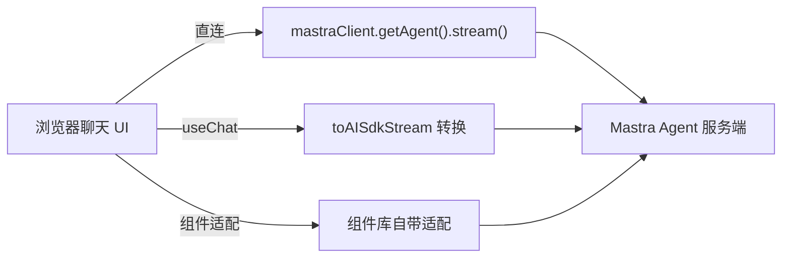

import { Canvas, Controls, Meta } from '@storybook/addon-docs/blocks';
import * as Stories from './chat-ui.stories';

<Meta of={Stories} name="Docs" />

# 前端接入与聊天 UI

Agent 和编排都跑在服务端（见 [8.1.1 Mastra Server 与 API 路由](?path=/docs/server-api--docs)），本课解决最后一公里：浏览器里怎么拿到流式回复，并渲染成气泡、工具卡片等聊天界面。Mastra 给了三条路径——用 `@mastra/client-js` 直连后自己处理流、用 `@mastra/ai-sdk` 把流转成 Vercel AI SDK 格式接 `useChat`、或套 assistant-ui / CopilotKit 等现成组件。三条路径共享同一个服务端 Agent，可以随时切换。



| 路径 | 服务端入口 | 前端依赖 | 适合 |
| --- | --- | --- | --- |
| client-js 直连 | 任意（`agent.stream()`） | `@mastra/client-js` | 完全自绘 UI、自定义流处理 |
| AI SDK 转换 | `chatRoute` / `handleChatStream` | `@mastra/ai-sdk` + `@ai-sdk/react` + `ai` | 已有或想要 `useChat` 管线 |
| 现成组件库 | 同上 | assistant-ui / CopilotKit | 最快出界面 |

## 三条接入路径

切换下方控件，对比每条路径要装什么、谁控制流细节、多快能出界面。三列的最下层都是同一个 Mastra Agent 服务端——路径差异只在中间的转换/适配层和最上层的 UI 层。

<Canvas of={Stories.Interactive} />
<Controls of={Stories.Interactive} />

| 读者操作 | 可观察证据 |
| --- | --- |
| 切换「接入路径」 | 对应列高亮，左下角三项读数（依赖、可控性、出界面速度）同步变化 |
| 打开 Show code | 看到 `example.ts` 中三条路径的分层定义 |

选型口诀：最快出界面选组件库；已有 `useChat` 管线选 AI SDK 转换；流细节要完全自控选 client-js 直连。组件库路径在下一节展开，先讲中间这条——它同时是两条路径的基础。

## AI SDK 转换与 useChat

共同模型：Mastra 自己的流（`agent.stream()`、`chatRoute` 的输出）不是 AI SDK 的 UIMessage 流，`@mastra/ai-sdk` 负责把前者转成后者；转好之后就是标准 Vercel AI SDK 前端写法——`useChat` 渲染消息、工具部件与自定义数据部件。转换函数默认输出 AI SDK v5 行为（向后兼容），装的是 v6 / v7 就显式传 `version`。

### chatRoute：Mastra 内建 server 的聊天路由

用 Mastra 自带 HTTP 服务（`mastra dev` 或自托管）时，在 `Mastra` 配置里注册一条聊天路由，服务端就绪：

```ts
import { Mastra } from '@mastra/core';
import { chatRoute } from '@mastra/ai-sdk';

export const mastra = new Mastra({
  agents: { weatherAgent },
  server: {
    apiRoutes: [
      chatRoute({ path: '/chat', agent: 'weatherAgent' }),
    ],
  },
});
```

同族还有 `workflowRoute({ path, workflow })` 与 `networkRoute({ path, network })`，分别把工作流、多 Agent 网络暴露成前端可消费的流；`workflowRoute` 默认带文本流（`includeTextStreamParts` 默认 `true`）。

### handleChatStream：框架无关 handler

不用 Mastra 内建 server（如 Next.js App Router）时，用 handler 自己搭路由：

```ts
// app/api/chat/route.ts
import { handleChatStream } from '@mastra/ai-sdk';
import { createUIMessageStreamResponse } from 'ai';
import { mastra } from '@/src/mastra';

export const maxDuration = 30;

export async function POST(req: Request) {
  const params = await req.json();
  const stream = await handleChatStream({
    mastra,
    agentId: 'weatherAgent',
    version: 'v7',
    params,
  });
  return createUIMessageStreamResponse({ stream });
}
```

对应还有 `handleWorkflowStream` / `handleNetworkStream`；`version` 按项目安装的 `ai` 包大版本传（默认 v5）。Express 等其他框架同样接这几个 handler。

### useChat：客户端消费转换后的流

前端对准 `chatRoute` 或自建路由，用 v5 风格的 `DefaultChatTransport` 指向端点即可：

```ts
const { messages, sendMessage } = useChat({
  transport: new DefaultChatTransport({
    api: 'http://localhost:4111/chat',
  }),
});
sendMessage({ text: inputValue });
```

带 Memory 的对话用 `prepareSendMessagesRequest` 只发送最新一条消息，并附上 `memory: { thread, resource }`，让服务端从 memory 取完整历史。

### toAISdkStream：原地转换 Mastra 流

前端已在用 `mastraClient.getAgent().stream()`（见 [8.1.4 Mastra Client SDK](?path=/docs/client-sdk--docs)）时，不必改服务端，拿到 Mastra 流后原地转换：

```ts
import { toAISdkStream } from '@mastra/ai-sdk';

// mastraStream 来自 mastraClient.getAgent('weatherAgent').stream(...)
const stream = toAISdkStream(mastraStream, { from: 'agent' });
```

`chatRoute` / `handleChatStream` 是在服务端转好整条流；`toAISdkStream` 适合自己在客户端或中间层转换。反向场景：已有 AI SDK 代码想借用 Mastra 的 processors 与 memory，可用 `withMastra()` 包装任意 AI SDK 模型，不必迁移成完整 Agent API。

### toAISdkV5Messages / toAISdkV4Messages：转换历史消息

`useChat` 的 `initialMessages` 需要 AI SDK 的 `UIMessage[]`，而 Mastra memory 存的是自己的消息格式。按 `useChat` 的版本选 `toAISdkV5Messages()` 或 `toAISdkV4Messages()` 转换后直接喂入。

客户端工具（`clientTools`）在浏览器端执行、结果经流回传，UI 侧把它当普通工具部件渲染即可，定义方式见 [8.1.4 Mastra Client SDK](?path=/docs/client-sdk--docs)。

## 现成聊天组件

不想自己写消息列表时的捷径，最终都消费 Mastra 的 AI SDK 兼容流：

- **assistant-ui**：React 聊天组件库，提供现成的 Thread、气泡、工具卡片，可深度定制；与 Mastra 走 `@mastra/ai-sdk` 的转换流接入，适合"要一个完整但可改的聊天界面"。
- **CopilotKit**：面向"给应用加 AI 助手"场景（侧边栏、Copilot 面板），自带前端运行时，接入后组件内可直接调 Mastra Agent。
- **OpenUI**：定位偏"用对话生成 UI 原型"，与生产聊天管线关系较远，作选型补充。

三者共同边界：省掉的是 UI 层，流格式适配仍依赖 Mastra 的 AI SDK 兼容层；深度改流行为时退回上一节的手动转换。

## 最佳实践

- 先定服务端入口，再选前端路径：用 Mastra 内建 server 就注册 `chatRoute`；用 Next.js / Express 就 `handleChatStream`；只有纯 client-js 直连两者都不需要。
- 版本对齐一次到位：`ai` 包大版本决定 handler 的 `version` 参数、`UIMessage` 类型与消息转换函数（v4 用 `toAISdkV4Messages`，v5+ 用 `toAISdkV5Messages`），混用是前端报错的主要来源。
- 自定义 UI 事件（进度、引用卡片等）走 `writer.custom()`：事件类型名必须以 `data-` 开头，且调用必须 `await`，否则流会被提前锁定。

## 常见问题

- 升级 `ai` 包后 `useChat` 流格式或类型报错？
  给服务端 handler / 转换函数显式传对应 `version`（默认 v5，装 v6 / v7 就传 `version: 'v6'` 或 `'v7'`），并让 `messages` 类型使用安装版本导出的 `UIMessage[]`。
- 自定义事件报 `WritableStream is locked`？
  检查每处 `writer.custom()` 是否加了 `await`；漏掉会让流在写入中被锁定。
- 带 Memory 的对话历史错乱或重复？
  v5 客户端配置 `DefaultChatTransport` 的 `prepareSendMessagesRequest` 只发送最新一条消息，并附 `memory: { thread, resource }`，让服务端从 memory 取完整历史。

## 总结回顾

摘要：

前端接入 Mastra 只解决一件事：把服务端 Agent 的流搬进聊天 UI。三条路径共享同一个服务端——`chatRoute`（Mastra 内建 server）或 `handleChatStream`（Next.js / Express）在服务端产出 AI SDK 兼容流，`@mastra/ai-sdk` 的 `toAISdkStream` 与 `toAISdkV5Messages` / `toAISdkV4Messages` 负责客户端侧的原地转换；`useChat` 用 `DefaultChatTransport` 消费转换后的流。不想自己搭 UI 时，assistant-ui / CopilotKit 在这条流之上提供现成组件。

一句话：

> 组件库最快出界面，AI SDK 转换复用 useChat 管线，client-js 直连完全自控；流格式转换始终由 `@mastra/ai-sdk` 兜底，版本对齐是唯一的常踩坑。

知识要点：

- 三条路径分别要装哪些包，谁负责流格式转换？
- `chatRoute` 与 `handleChatStream` 各用在哪种服务端？
- `toAISdkStream`、`toAISdkV5Messages` / `toAISdkV4Messages` 各解决什么问题？
- 升级 `ai` 包大版本时，需要同步改动哪几处？

## 参考资料

- [AI SDK UI 集成（useChat / chatRoute / toAISdkStream）](https://mastra.ai/integrations/agentic-ui/ai-sdk-ui)
- [AI SDK 辅助函数参考（withMastra）](https://mastra.ai/reference/ai-sdk/overview)
