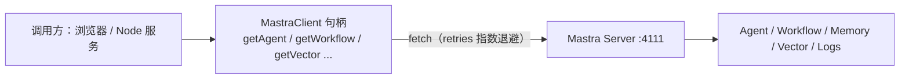

import { Canvas, Controls, Meta } from '@storybook/addon-docs/blocks';
import * as ClientSdk from './client-sdk.stories';

<Meta of={ClientSdk} name="Docs" />

# Mastra Client SDK

`MastraClient`（包 `@mastra/client-js`）是 Mastra Server 的类型安全客户端：从浏览器或另一个 Node 服务里调用服务端的 Agent、Workflow、Memory、向量与日志能力，底层走 [8.1.1 Mastra Server 与 API 路由](?path=/docs/server-api--docs) 的同一批 HTTP 路由。

它不替代服务端 Mastra 实例——模型调用与工具执行仍发生在服务端，客户端只负责「发起请求、消费响应」；浏览器端自己的逻辑用 `clientTools` 挂进对话执行。与 [9.2 前端接入与聊天 UI](?path=/docs/chat-ui--docs) 的边界：那边讲 UI 组件与协议转换，这边讲 client-js 本体。



## 创建客户端

构造选项决定所有请求的公共行为，默认值回查下表。

| 选项 | 类型 / 默认值 | 用途 |
| --- | --- | --- |
| `baseUrl` | `string` | Server 地址，如 `http://localhost:4111` |
| `retries` | `number`，默认 `3` | 失败重试次数 |
| `backoffMs` | `number`，默认 `300` | 首次重试延迟，逐次翻倍（指数退避） |
| `maxBackoffMs` | `number`，默认 `5000` | 退避等待上限 |
| `headers` | `Record<string, string>` | 随每个请求发送 |
| `credentials` | `'omit' \| 'same-origin' \| 'include'` | 跨域 cookie（fetch 标准取值） |
| `abortSignal` | `AbortSignal` | 取消该客户端的全部请求 |

```ts
import { MastraClient } from '@mastra/client-js';

export const mastraClient = new MastraClient({
  baseUrl: process.env.MASTRA_API_URL || 'http://localhost:4111',
});
```

**句柄与请求要分清。** `getAgent('weatherAgent')`、`getWorkflow(id)`、`getTool(id)`、`getVector(name)` 返回资源句柄，不发起网络请求；`listAgents()`、`listWorkflows()`、`listTools()`、`listLogs(...)` 这类 list 方法才真正查询。排查连通性问题从 list 方法入手，而不是句柄创建。

取消与重试：重试由 `retries` / `backoffMs` / `maxBackoffMs` 自动完成；主动取消用 `AbortController`，`abort()` 一次即取消该客户端所有在途请求。

```ts
const controller = new AbortController();
const client = new MastraClient({
  baseUrl: 'http://localhost:4111',
  abortSignal: controller.signal,
});
```

## 资源面：从客户端到 Mastra Server

同一资源面对所有调用方走同一条路由：换调用来源改变的是凭据方式，换资源面改变的是路径与返回形态。下面的拓扑并排放置三个代表成员——Agent 流式对话（POST stream 路由，返回流式分片）、Workflow 运行（POST runs 路由，返回 JSON 运行句柄）、Memory 线程（GET 查询，返回 JSON 数组）。

<Canvas of={ClientSdk.Interactive} />
<Controls of={ClientSdk.Interactive} />

| 读者操作 | 可观察证据 |
| --- | --- |
| 切换「资源面」 | 箭头上的方法与路径、返回形态、消费方式同步切换 |
| 切换「调用来源」 | 路径不变，凭据行在 cookie 与 headers 之间切换 |
| 打开 Show code | 看到该 Canvas 实际执行的 `example.ts` |

### Agent：generate 与 stream

`agent.generate(input)` 等待完整结果，`agent.stream(input)` 拿到流后逐段消费；两者都接受字符串或 `role` / `content` 消息数组。

```ts
const agent = mastraClient.getAgent('weatherAgent');

const response = await agent.generate('今天上海天气如何？');
console.log(response.text);

const stream = await agent.stream('讲个两句话的小故事');
stream.processDataStream({
  onTextPart: text => process.stdout.write(text),
});
```

可观察证据：`generate` 打印一次完整的 `response.text`；`stream` 的 `onTextPart` 按分片陆续触发。`processDataStream` 按分片类型分发回调，文本之外的其他分片走各自的 `onXxxPart`。需要透传业务上下文时，在选项里传 `requestContext`（`new RequestContext()` 或普通对象）。

### Workflow：createRun 与 startAsync

句柄先 `createRun()` 拿运行实例，再 `startAsync` 传入 `inputData`；`listWorkflows()` 回查全部可用工作流。

```ts
const workflow = mastraClient.getWorkflow('contentPipeline');
const run = await workflow.createRun();
const result = await run.startAsync({ inputData: { topic: 'mastra' } });
```

边界：`upsertDynamicWorkflow(definition)` 与 `listDynamicWorkflows()` 走同一客户端注册声明式工作流（mapping 图，不能带 JS 闭包），并要求存储适配器支持 `workflowDefinitions` 域。

### Memory、向量与日志

记忆、向量与观测数据各有句柄或查询入口；线程查询必须同时给 `resourceId` 与 `agentId`。

```ts
const threads = await mastraClient.listMemoryThreads({
  resourceId: 'user-1',
  agentId: 'weatherAgent',
});
const vector = mastraClient.getVector('knowledgeBase');
```

| 能力 | 入口 | 返回 |
| --- | --- | --- |
| 线程 | `listMemoryThreads` / `createMemoryThread` / `getMemoryThread` | `StorageThreadType` 等 |
| 消息 | `saveMessageToMemory` / `getMemoryStatus` | `messages` 数组 / 状态 |
| 向量 | `getVector(name)` 句柄 | `MastraVector` |
| 日志 / 追踪 | `listLogs(params)` / `getTrace` / `getTraces` | `LogEntry[]` / `TraceRecord` |
| 实验性 | `client.responses` / `client.conversations` | OpenAI 风格接口 |

## clientTools：浏览器端执行的工具

用 `createTool` 定义工具、通过 `clientTools` 传入 `generate` / `stream`：模型的调用计划在服务端产生，`execute` 在浏览器里运行（DOM、localStorage、剪贴板等 Web API），结果再回传服务端继续推理。服务端只需存在对应 Agent，不必注册同名工具。

```ts
const colorChangeTool = createTool({
  id: 'color-change-tool',
  description: 'Changes the HTML background color',
  inputSchema: z.object({ color: z.string() }),
  outputSchema: z.object({ success: z.boolean() }),
  execute: async inputData => {
    document.body.style.backgroundColor = inputData.color;
    return { success: true };
  },
});

const response = await agent.generate('把背景改成蓝色', {
  clientTools: { colorChangeTool },
});
```

## 跨域与 serverless 接入

- 浏览器直连带 cookie：客户端设 `credentials: 'include'`，同时服务端 CORS 返回具体 origin 的 `Access-Control-Allow-Origin`（不能是 `*`）和 `Access-Control-Allow-Credentials: true`，缺一处就表现为 401 或请求被拦截。
- serverless 中转：在 Next.js / Hono 等服务端函数里用 client-js 请求后，把流原样重建返回 `return new Response(stream.body)`。
- 服务间调用：Node 里认证统一走 `headers` 注入 Authorization / API key，无需跨域 cookie。

## 常见问题

- 浏览器调用一直 401，或 Network 面板里请求被 CORS 拦截
  成对检查两处配置：客户端 `credentials: 'include'`，服务端 CORS 返回具体 origin 且带 `Access-Control-Allow-Credentials: true`；`Access-Control-Allow-Origin: *` 与带凭据请求互斥，二者不能同时使用。
- 拿到 `agent` 句柄后 Network 面板没有任何请求
  这是正常行为：`getAgent` / `getWorkflow` 只创建句柄；真正的请求发生在 `generate` / `stream` / `createRun` 或 `listAgents()` 等调用上，连通性排查要从这些方法入手。

## 总结回顾

摘要：`MastraClient` 用一个 `baseUrl` 加少量公共选项（重试、headers、credentials、abortSignal）把 Mastra Server 的能力映射成类型安全句柄：Agent 走 `generate` / `stream` 消费完整结果或用 `processDataStream` 逐段消费分片，Workflow 走 `createRun` 再 `startAsync`，Memory、向量与日志各有 list 与句柄入口；浏览器端工具用 `clientTools` 就地执行后回传服务端。跨域场景要成对配置 credentials 与 CORS，serverless 中转用 `new Response(stream.body)` 重建流。

一句话：

> 客户端只管发起与消费——同一批路由、同一批资源句柄，调用方换成浏览器时变化的只有凭据与 CORS。

知识要点：

- 哪些方法创建句柄不发请求，哪些方法真正发起查询？
- `agent.stream` 返回的流如何逐段消费？serverless 中如何原样转发？
- `clientTools` 定义的工具在哪里执行，结果流向哪里？
- 跨域带 cookie 需要客户端与服务端同时满足什么条件？

## 参考资料

- [Mastra Client（官方文档）](https://mastra.ai/docs/server/mastra-client)
- [MastraClient API 参考](https://mastra.ai/reference/client-js/mastra-client)
