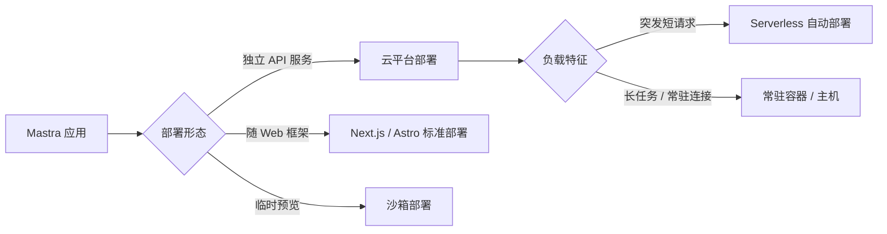

import { Canvas, Controls, Meta } from '@storybook/addon-docs/blocks';
import * as Stories from './cloud-deployment.stories';

<Meta of={Stories} name="Docs" />

# 云平台部署

把 Mastra 应用从本地 `mastra dev` 推到线上，核心是三个判断：应用形态（独立 API 服务还是随 Web 框架走）、负载特征（突发短请求、长任务还是常驻连接）、仓库形态（单包还是 monorepo）。Mastra 对 Vercel、Netlify、Cloudflare 提供内置部署器，其余平台各有官方教程，另有 `@mastra/deployer-sandbox` 用于临时预览。本课给出平台全景与选型判断，并覆盖 monorepo 与 Web 框架集成两个高频场景；构建产物与自托管服务器运行见[部署概览与自托管](?path=/docs/deployment--docs)。



平台全景回查表（接入方式以官方部署文档为准）：

| 平台 / 方案 | 接入方式 | 形态判断 |
| --- | --- | --- |
| Vercel / Netlify / Cloudflare | 内置部署器 | Serverless，突发短请求首选 |
| AWS Lambda / Bedrock AgentCore | 专属教程 | Serverless / 托管运行时，关注执行时长与文件系统限制 |
| AWS EC2 / Azure App Services / DigitalOcean / Render | 专属教程 | 常驻主机，适合长任务与常驻连接 |
| Kubernetes（含 Helm 版） | 专属教程 | 容器编排，适合自建集群与大规模常驻 |
| Neon | 专属教程 | 配合托管 Postgres 的部署教程 |
| Inngest / Temporal | 专属教程 | 工作流运行器，见[运行器、Workers 与 PubSub](?path=/docs/workflow-runners--docs) |
| Mastra Platform | 官方托管平台 | 全托管部署与环境管理，见[Platform 入门](?path=/docs/mastra-platform--docs) |

## 平台全景与选型

官方部署文档把云平台接入分为两层：**内置部署器**（框架自动完成平台配置）与**平台教程**（按官方指南手动接入）。选型先按负载特征定形态，再按形态挑平台。切换下方实例的负载特征，观察匹配的部署形态、代表平台与存储适配注意点（离线示意，不发起真实部署）。

<Canvas of={Stories.Interactive} />
<Controls of={Stories.Interactive} />

| 读者操作 | 可观察证据 |
| --- | --- |
| 切换「负载特征」 | 矩阵对应列高亮，底部「代表平台 / 存储注意」两栏同步更新 |
| 拖动「峰值并发」超过 2000 | 左下「规模提示」读数给出成本或时长上限提醒 |
| 打开 Show code | 看到该 Canvas 实际执行的 `example.ts` |

### 内置自动部署器

Vercel、Netlify、Cloudflare 三个平台有 Mastra 内置部署器，负责自动完成部署过程，无需手写平台专有配置；平台侧的账号、项目与环境变量仍按各自控制台操作，细节以对应平台集成页为准。三个平台都是 serverless 形态：按请求弹性伸缩、零闲时成本，代价是执行时长受限、没有可依赖的本地持久文件系统。

### 仅有教程的平台

AWS（EC2 / Lambda / Bedrock AgentCore）、Azure App Services、DigitalOcean、Render、Neon、Kubernetes（含 Helm）等平台没有内置部署器，按官方教程接入。判断口径：

- **Serverless 函数（Lambda）**：与内置部署器平台同类限制，关注时长上限与存储远程化。
- **常驻主机（EC2 / App Services / DigitalOcean / Render）**：进程不退出，适合长任务、SSE 流式与 WebSocket 常驻连接。
- **容器编排（Kubernetes）**：需要自管集群与扩缩容，配合 Helm 版教程可声明式部署。

### 形态判断：serverless 还是常驻

- **突发短请求**（问答、工具调用）：选 serverless，享受自动扩缩，存储改用托管方案。
- **长任务**（durable 工作流、Harness 长时运行）：serverless 时长上限会打断执行，选常驻容器，或交给专用运行器（见[运行器、Workers 与 PubSub](?path=/docs/workflow-runners--docs)）。
- **常驻连接**（SSE / WebSocket / Channels）：需要进程常驻，选常驻容器或自托管服务器。

## Monorepo 部署

Mastra 在 npm workspaces / Turborepo 中部署时，构建入口仍然是目标包里的 `mastra build`：云平台的 Root Directory（或 CI 的工作目录）设为**应用包目录**，从那里执行构建与部署。

```bash
# monorepo 中从目标包目录构建
cd apps/agent
mastra build
```

- **工作区包依赖**：`@acme/*` 这类工作区内部包默认会被构建流程自动编译进产物；若打包器解析不了工作区包，在 Mastra 配置里用 `bundler.transpilePackages` 显式列出，让构建器转译它们。
- **`.env` 位置**：环境文件与 Mastra 配置放在**应用目录**；平台部署时 Root Directory 也选应用目录，环境变量才能被正确加载。
- **封闭构建（Bazel 等）**：构建期不允许联网装依赖时，用 `MASTRA_BUILD_SKIP_INSTALL` 跳过 `mastra build` 内部的依赖安装，依赖由外部构建系统负责准备。

```ts
// Mastra 配置节选：无法解析工作区包时显式转译
export const mastra = new Mastra({
  // ...
  bundler: {
    transpilePackages: ['@acme/shared-tools'],
  },
});
```

## Web 框架集成部署

Mastra 与 Web 框架集成时**随应用一起部署**：走框架的标准部署流程，不需要单独部署一个 Mastra 服务。官方提供 Next.js 与 Astro 两条集成指南。先记一条跨框架的硬边界，再分别看两个框架的最小配置。

**serverless 平台必须移除 LibSQLStore**：LibSQLStore 需要文件系统访问，与 serverless 云平台不兼容。部署到这类平台时，要从 Mastra 配置中移除所有 LibSQLStore 用法，改用平台兼容的存储（如托管数据库存储）；本课实例矩阵底部「存储注意」栏同步提示这一点。

### Next.js

Next.js 应用（含部署到 Vercel）只需在 `next.config.ts` 加一项配置，把 `@mastra` 系列包排除出服务端打包：

```ts
// next.config.ts
const nextConfig = {
  serverExternalPackages: ['@mastra/*'],
};

export default nextConfig;
```

`'@mastra/*'` 通配符覆盖所有 `@mastra` 官方包，避免打包器处理这些包时产生兼容问题。

### Astro

Astro 按部署目标选官方适配器，并开启 server 输出模式（Mastra 需要在服务端运行）：

```js
// astro.config.mjs（节选）
import vercel from '@astrojs/vercel';

export default defineConfig({
  output: 'server',
  adapter: vercel(), // 部署到 Netlify 时改用 @astrojs/netlify 的 netlify()
});
```

- **Vercel**：`@astrojs/vercel` 适配器 + `output: 'server'`。
- **Netlify**：`@astrojs/netlify` 适配器 + `output: 'server'`。

## 沙箱部署

`@mastra/deployer-sandbox` 把完整 Mastra 服务器部署到 Vercel、E2B 或 Daytona 沙箱，返回一个公开可访问的 URL。它的定位是**临时环境**：预览演示、CI 验证、agent 生成的应用需要一个能访问的实例时使用。沙箱有运行时长上限，到期会过期失效，因此不能当作生产部署方案；生产环境回到上方平台全景按形态选型。

## 常见问题

- 应用部署到 Vercel / Netlify / Cloudflare 后，运行时报 LibSQL 或文件系统相关错误
  从 Mastra 配置中移除所有 LibSQLStore 用法，改用平台兼容的存储。判断依据：LibSQLStore 依赖本地文件系统，serverless 实例没有可持久化的本地磁盘。
- monorepo 里执行 `mastra build` 报找不到工作区包
  先确认是在目标应用包目录（而非仓库根目录）执行构建；仍失败时在 Mastra 配置的 `bundler.transpilePackages` 中显式列出该工作区包。
- 沙箱 URL 过一段时间就打不开
  这是预期行为：沙箱有运行时长上限，到期自动过期。需要持续访问时重新部署，或改用常驻容器方案。

## 总结回顾

摘要：

云平台部署先分层接入：Vercel、Netlify、Cloudflare 走内置部署器自动配置，AWS、Azure、DigitalOcean、Render、Neon、Kubernetes 等平台按官方教程接入，Mastra Platform 提供官方全托管。选型按负载特征定形态——突发短请求选 serverless，长任务与常驻连接选常驻容器或专用运行器；serverless 平台必须移除依赖文件系统的 LibSQLStore。monorepo 场景从目标应用包目录构建与部署，工作区包用 `bundler.transpilePackages` 兜底、Bazel 封闭构建用 `MASTRA_BUILD_SKIP_INSTALL`。Next.js 配 `serverExternalPackages`，Astro 配适配器加 `output: 'server'`；临时预览与 CI 用 `@mastra/deployer-sandbox`，但要接受其过期机制。

一句话：

> 平台选型由负载特征决定，而 serverless 平台的第一道关卡是存储——LibSQLStore 上不去，远程存储必须先行。

知识要点：

- 三个有内置部署器的平台是什么？其余平台靠什么方式接入？
- serverless 与常驻容器分别匹配哪些负载特征？
- monorepo 中构建入口、`.env` 与 Root Directory 应放在哪里？
- Next.js 与 Astro 各需要哪项最小配置？
- 沙箱部署适合什么场景，有什么限制？

## 参考资料

- [Deployment: Cloud Providers](https://mastra.ai/docs/deployment/cloud-providers)
- [Deployment: Monorepo](https://mastra.ai/docs/deployment/monorepo)
- [Deployment: Web Framework](https://mastra.ai/docs/deployment/web-framework)
