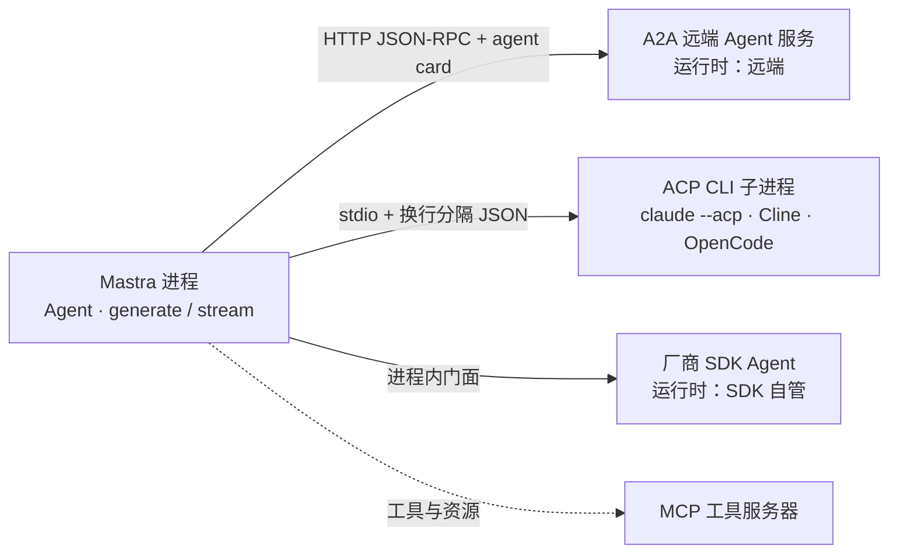

import { Canvas, Controls, Meta } from '@storybook/addon-docs/blocks';
import * as Stories from './connections.stories';

<Meta of={Stories} name="Docs" />

# A2A 与 ACP

让 Mastra Agent 与「别人家的 agent」协作时，先回答两个问题：**agent 运行时归谁拥有**、**要交换什么**。Mastra Connections 家族按这两个答案分四条路：A2A（跨服务开放协议）、ACP（外部编码代理进程）、SDK agents（厂商 SDK 进程内封装）、MCP（工具与资源互通）。本课给出选型判断，并展开 A2A、ACP、SDK agents 三条路的最小用法与坑；MCP 的工具互通在 6.1.1 已讲。



| 场景 | 用哪条路 | 包 | 核心入口 | 运行时归属 | 交换什么 |
| --- | --- | --- | --- | --- | --- |
| 跨服务 / 跨框架 / 跨厂商调用 agent | A2A | `@mastra/core/a2a` | `A2AAgent`、`MastraClient.getA2A()` | 远端服务 | 消息、任务、工件 |
| 驱动本机编码代理 CLI | ACP | `@mastra/acp` | `AcpAgent`、`createACPTool()` | 子进程 | 会话消息、权限请求 |
| 注册厂商 SDK agent | SDK agents | `@mastra/openai` 等 | `OpenAISDKAgent` 等 | 厂商 SDK | 统一 `generate` / `stream` 门面 |
| 只借外部工具与资源 | MCP | `@mastra/mcp` | `MCPClient` | 工具服务器（非 agent） | 工具、资源 |

选型口诀：**跨服务边界用 A2A，外部 CLI 进程用 ACP，厂商 SDK 进程内用 SDK agents，仅工具互通用 MCP。**

## 互联边界怎么选

每条路都由同一对问题定位。「运行时归属」决定谁能控制 agent loop、工具与权限——归属在远端就是黑盒服务，在子进程就要管进程生命周期，在厂商 SDK 就别指望注入自己的工具。「交换内容」决定协议形态：HTTP JSON-RPC、stdio 行式 JSON，或干脆是进程内函数调用。注意 MCP 交换的是**工具**，A2A 委托的是**整个 agent**——这是 6.1.1 与本课的分界；同进程的子代理委派走 6.1.2，不需要任何协议。

<Canvas of={Stories.Interactive} />
<Controls of={Stories.Interactive} />

| 读者操作 | 可观察证据 |
| --- | --- |
| 切换「互联场景」 | 两侧进程框、边界连线与读数（推荐协议 / 运行时归属 / 交换内容）同步变化 |
| A2A 场景下切换「任务需跨重启恢复」 | 读数「暂停任务跨重启」在丢失与可恢复之间切换 |
| 打开 Show code | 看到该 Canvas 实际执行的 `example.ts` |

### A2A：跨服务远程代理

A2A 是跨网络、跨框架、跨厂商的开放 HTTP 协议：远端 agent 是黑盒服务，你靠 agent card 发现它，用消息和有状态的任务与它协作。Mastra 服务端自动暴露两个端点——默认 `apiPrefix` 为 `/api` 时，agent `weather-agent` 的卡片在 `/api/.well-known/weather-agent/agent-card.json`，执行端点在 `/api/a2a/weather-agent`。客户端两种用法：把远端包成子代理（`A2AAgent`），或用 `MastraClient.getA2A()` 直连端点。

最小代码——远端 agent 作为子代理参与委派：

```ts
import { Agent } from '@mastra/core/agent';
import { A2AAgent } from '@mastra/core/a2a';

const remote = new A2AAgent({
  url: 'https://weather.example.com/api/.well-known/weather-agent/agent-card.json',
});

export const supportAgent = new Agent({
  id: 'support-agent',
  name: 'Support Agent',
  instructions: '回答用户问题，天气问题委托远端代理。',
  model: 'openai/gpt-5.6-sol',
  agents: { remote },
});
```

卡片包含 name、description、端点 URL、capabilities、security、skills、`protocolVersion` 等字段，`A2AAgent` 在执行时抓取并缓存；传裸域名默认取 `/.well-known/agent-card.json`，多 agent 服务器要传完整卡片 URL。`A2AAgent` 其余选项：`headers`、`credentials`、`protocolVersion`（`'1.0'` 显式开启，默认 v0.3）、`timeoutMs`、`retries` / `backoffMs` / `maxBackoffMs`、`fetch`、`abortSignal`。

协议版本与卡片签名：服务端同一批 URL 同时支持 v0.3 与 v1.0，由请求头 `A2A-Version` 协商——缺省按 v0.3，传 `1.0` 走 v1.0（多出 `tasks/list`），其他值返回 `VersionNotSupported`。卡片可用 `ES256` 签名（`protectedHeader` 带 `alg` 与 `kid`，产出 `signatures` 数组）；客户端验证是可选项，配置 `verifySignature: { algorithms: ['ES256'], keyProvider }`，未签名卡片原样返回。委派侧另有 `verifyAgentCard.verify(card, context)` 钩子，在委托前检查提供方与端点。

HITL 用 `input-required` 任务状态承载：服务端 agent 在工具审批或 `suspend()` 处暂停，状态消息带文本提示和承载 `suspendPayload` / `resumeSchema` 的 data part。客户端拿到 `finishReason: 'suspended'` 后，用原任务调 `resumeGenerate()` / `resumeStream()` 续跑：

```ts
const result = await agent.generate('Book a flight to Paris', { runId: 'run-1' });
if (result.finishReason === 'suspended') {
  const resumed = await agent.resumeGenerate({ approved: true }, { runId: 'run-1' });
}
```

推送通知需远端卡片声明 `capabilities.pushNotifications: true`，经 `setTaskPushNotificationConfig({ taskId, pushNotificationConfig: { url, token } })` 注册；服务端在终止或暂停态推送任务快照，投递是 best-effort，回调 URL 要自行鉴权并校验 token。

边界：A2A 任务记录只存内存——暂停的任务只能被当初暂停它的那个服务进程恢复，服务重启或无粘性路由的横向扩容都会让续跑报 task-not-found；要恢复挂起运行，还得在 Mastra 服务端配置存储来还原 run state。另外远端卡片若不支持流式，`A2AAgent.stream()` 会自动回退到非流式 generate 并返回缓冲后的流结果。

### ACP：外部编码代理进程

ACP（`@mastra/acp`）让 Mastra 驱动本机已有的编码代理进程——Claude Code、Cline、OpenCode：以 stdio + 换行分隔 JSON 与子进程交换会话消息和权限请求，把整个 CLI 包装成一个 Mastra agent 或一个工具。

最小代码：

```ts
import { AcpAgent } from '@mastra/acp';

const codingAgent = new AcpAgent({
  id: 'coding-agent',
  description: '用本机 Claude Code 审阅项目',
  command: 'claude',
  args: ['--acp'],
  persistSession: true,
});

const result = await codingAgent.generate('Review this project');
```

`AcpAgent` 把子进程包成 agent，可像普通 agent 一样参与委派；`createACPTool()` 把一次编码代理调用包成单个工具，挂给任意 Mastra agent。两者都要求本机装有对应 CLI（`command` 指向可执行文件）。

边界：`persistSession: true` 在调用之间保持子进程，会话上下文与已授权的权限得以延续；设为 `false` 则每次调用冷启动一个新进程。子进程崩溃、CLI 不在 PATH 时调用直接失败——这是真实终端里的运行前提，离线示意无法复现。

### SDK agents：厂商 SDK 进程内封装

SDK agents 把厂商 SDK 的 agent 注册进 Mastra，但运行时、工具、权限和 agent loop 都留在厂商 SDK 手里，Mastra 只提供统一的 `generate` / `stream` 门面和注册表。适合在不替换厂商运行时的前提下，把它纳入统一的 agent 入口。

最小代码：

```ts
import { OpenAISDKAgent } from '@mastra/openai';

const openaiAgent = new OpenAISDKAgent({
  id: 'openai-agent',
  description: '项目助手',
  sdkOptions: { name: 'Project assistant', model: 'gpt-5' },
});

const result = await openaiAgent.generate('Summarize this repo');
```

同族还有 `ClaudeSDKAgent` 与 `CursorSDKAgent`，配置都走各自的 `sdkOptions`，用法与 `OpenAISDKAgent` 一致。

边界：因为 loop 归 SDK，Mastra 的工具、记忆、工作流不会注入其中——厂商侧行为用 `sdkOptions` 配置；需要 Mastra 原生能力就换普通 `Agent`，两者不要混搭预期。与 A2A 的差别是同进程、无网络边界；与 ACP 的差别是无子进程。

## 最佳实践

- 按运行时归属选路，不按功能多少选：跨服务边界用 A2A，外部 CLI 进程用 ACP，厂商 SDK 进程内用 SDK agents，只借工具用 MCP（见 [MCP](?path=/docs/mcp--docs)）。
- 同进程委派不上协议：委派给本地写好的子代理用 `agents: { ... }` 与 supervisor 模式（见 [子代理与监督者](?path=/docs/subagents--docs)）；只有跨网络、跨框架、跨厂商才值得引入 A2A 的发现与任务开销。
- A2A 上生产前先定持久化策略：任务记录在内存，扩容或重启会丢暂停任务。需要 HITL 长任务时，服务端配存储以还原 run state，部署侧保证粘性路由，并把推送通知当 best-effort 设计。
- 工具互通与 agent 委托分开评估：MCP 解决「我的 agent 缺工具」，A2A 解决「别人的 agent 能干活」；两者可叠加——远端 agent 内部也在用 MCP。

## 常见问题

- A2A 续跑挂起任务报 task-not-found
  先确认服务是否重启过或存在多实例：任务记录只在内存，暂停它的进程没了记录就没了。处理：服务端配置存储以还原 run state，部署侧保证粘性路由；推送通知配置同样是内存态，重启后需重新 `setTaskPushNotificationConfig`。
- 远端 agent 卡片没开流式，`stream()` 一次性返回全部内容
  这是预期回退：`A2AAgent.stream()` 在远端不支持流式时自动走非流式 generate，返回缓冲后的流结果；需要逐事件输出时选声明流式能力的远端。
- 给 `OpenAISDKAgent` 挂 Mastra 工具不生效
  SDK agent 的工具、权限与 agent loop 全在厂商 SDK 手里，Mastra 只提供 `generate` / `stream` 门面；厂商侧行为用 `sdkOptions` 配置，需要 Mastra 工具链就改用普通 `Agent`。

## 总结回顾

摘要：

Connections 家族用同一把尺子分四条路——谁拥有 agent 运行时、要交换什么。A2A 是跨服务开放协议：agent card 发现、JSON-RPC 执行端点、有状态任务生命周期，HITL 靠 `input-required` 与 `resumeGenerate` 续跑，但任务记录在内存，恢复依赖同一进程与持久化配置；ACP 用 stdio + 换行分隔 JSON 驱动本机编码代理 CLI，`AcpAgent` / `createACPTool()` 负责包装，`persistSession` 决定会话是否延续；SDK agents 在进程内注册厂商 SDK agent，loop 归 SDK，Mastra 给统一门面。MCP 只交换工具，与 agent 委托是两回事。

一句话：

> 选互联路径先问「运行时归谁、跨什么边界」：跨服务 A2A、外部 CLI 进程 ACP、厂商 SDK 进程内 SDK agents、只借工具 MCP。

知识要点：

- 四类互联边界分别由哪个包、哪个入口承载？
- A2A 的 agent card 与执行端点路径长什么样？协议版本如何协商、卡片如何签名验证？
- A2A 挂起任务如何续跑？为什么服务重启后会丢？
- `persistSession` 对 ACP 子进程意味着什么？
- SDK agents 与普通 `Agent` 的能力边界在哪？

## 参考资料

- [Connections overview](https://mastra.ai/docs/connections/overview)
- [A2A](https://mastra.ai/docs/connections/a2a)
- [ACP](https://mastra.ai/docs/connections/acp)
- [SDK agents](https://mastra.ai/docs/connections/sdk-agents)
