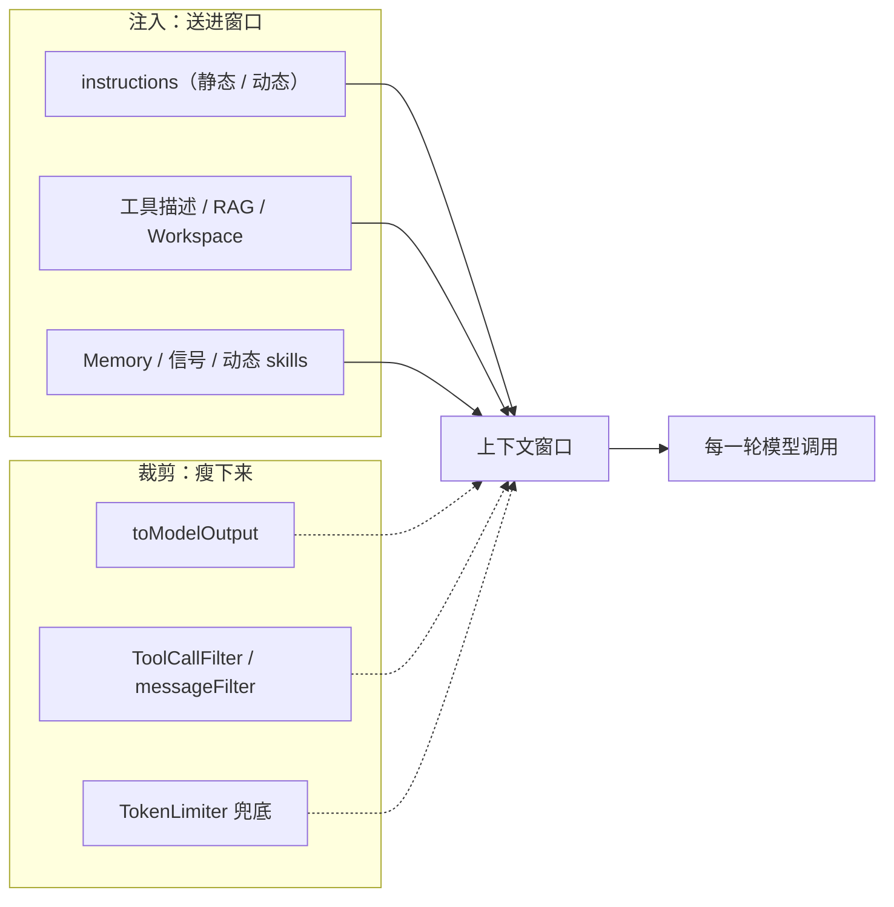

import { Canvas, Controls, Meta } from '@storybook/addon-docs/blocks';
import * as Stories from './context-engineering.stories';

<Meta of={Stories} name="Docs" />

# 上下文工程

模型每一轮只能看到上下文窗口里的信息：没有的工具不会被调用，没检索到的资料等于不存在，塞得太满则成本上升、关键细节被淹没。上下文工程决定的就是「模型每一轮看到什么」，目标是**相关且精简**，而不是窗口越大越好。本课是前面课程的综合取舍框架：注入侧把 instructions、工具、RAG、记忆、信号送进窗口，裁剪侧用 toModelOutput、ToolCallFilter、TokenLimiter 把窗口瘦下来；各机制的完整细节在对应课程展开，这里只回答「放哪、放多少、怎么裁」。



机制清单与默认值回查（详细用法见对应主题小节与相关课程）：

| 机制 | 侧别 | 作用 | 关键默认值 / 回查点 |
| --- | --- | --- | --- |
| instructions（静态 / 动态） | 注入 | 每轮置顶的系统消息，可按请求拼装 | 稳定部分在前，利于 prompt cache |
| 工具描述 | 注入 | 模型据此决定何时调用 | 工具越多，每轮固定开销越大 |
| RAG / Workspace | 注入 | 大知识库与文件按需取用 | 收紧 topK、metadata 过滤、rerank |
| Memory lastMessages | 注入 | 滑动窗口保留最近消息 | 默认 10 条；逐轮膨胀，缓存每轮失效 |
| 观察式记忆 | 注入 | 旧消息压缩为稳定的观察日志 | 替代简单压缩，保住缓存前缀 |
| 信号（Beta） | 注入 | 外部事件投递进运行中的线程 | transient 只进当前调用 |
| toModelOutput | 裁剪 | 工具结果瘦身后再进窗口 | 官方建议的裁剪第一步 |
| ToolCallFilter | 裁剪 | 丢弃历史工具参数与结果 | 存储与 UI 仍保留 |
| ToolSearchProcessor | 裁剪 | 大工具目录换为「搜索再加载」 | 工具目录本身过大时 |
| TokenLimiter | 裁剪 | 按 token 预算裁非系统消息 | 最终兜底 |
| 子代理 messageFilter | 裁剪 | 委派时只传消息子集 | 如 messages.slice(-10) |

## 该放哪：每轮、偶尔、永不

判断一条信息放在哪，先问一个问题：**模型是否每轮都需要它？**

| 信息属性 | 去处 | 例子 |
| --- | --- | --- |
| 每轮需要，内容稳定 | 静态 instructions | 角色、输出规范、安全约束 |
| 每轮需要，随请求变化 | 动态 instructions、内联注入 | 用户身份、当前订阅计划 |
| 偶尔需要 | 工具、RAG、Workspace、动态 skills | 大知识库、文件内容、任务细则 |
| 跨轮对话需要 | Memory：lastMessages 或观察式记忆 | 历史消息、跨轮事实 |
| 外部事件驱动 | 信号 sendSignal / sendStateSignal | 通知、状态快照 |
| 永不需要 | 不注入；历史残留交给裁剪 | 旧工具参数、超预算的旧消息 |

下面的示意图把窗口画成堆叠条：蓝色是每轮注入的常驻上下文，琥珀色是偶尔注入的按需上下文。勾选来源、拖动 lastMessages，读数与建议动作随之变化（token 数字为教学示意，非真实计量）。

<Canvas of={Stories.Interactive} />
<Controls of={Stories.Interactive} />

| 读者操作 | 可观察证据 |
| --- | --- |
| 勾选 RAG / 信号 | 琥珀段进入堆叠条，「偶尔注入」读数上升 |
| 调大 lastMessages | 记忆段逐条增长，超过阈值后建议动作提示观察式记忆 |
| 取消全部来源 | 窗口清空，建议动作提示先注入每轮需要的 instructions |

## 注入：把信息送进窗口

注入分两类：instructions、工具描述、记忆窗口是**每轮必然出现的常驻上下文**，决定每轮固定成本；RAG、Workspace、信号、动态 skills 是**按需出现的按需上下文**，决定成本的方差。工具定义、检索与重排、记忆各组件的完整用法见工具课（`?path=/docs/tools--docs`）、检索与重排课（`?path=/docs/retrieval-and-rerank--docs`）与记忆各课，本节只讲它们作为上下文来源的取舍。

### instructions：静态与动态

这是什么：instructions 是每轮调用前置入的系统消息。静态字符串适合稳定规则；写成函数即动态 instructions，从 RequestContext 按请求拼装用户数据。

```ts
const agent = new Agent({
  name: 'support',
  // 动态 instructions：每次请求执行，从 RequestContext 取请求级数据
  instructions: ({ requestContext }) => {
    const name = requestContext.get('name');
    return `你帮助 ${name} 了解他们的账户。`;
  },
  model: 'openai/gpt-4o',
});
```

边界：稳定内容放在字符串最前、易变内容靠后，长对话才能复用 prompt cache；动态写法不改变「每轮都进窗口」的属性，只放每轮真正需要的字段。一次性给模型看、但不想存进记忆的数据，用内联注入拼进用户消息，或用 context 消息（`generate(prompt, { context: [...] })`，模型当轮可见，但不写入 memory）。

### 工具、RAG 与 Workspace

这是什么：偶尔需要的信息不常驻窗口。工具描述每轮都占 token，但结果只在调用后进入；大而稳定的知识库封装成 RAG 检索工具，模型按问题检索；本地文件交给 Workspace，Agent 通过 read_file、list_files、grep 与 workspace 搜索工具自行取用。

```ts
const knowledgeBase = createVectorQueryTool({
  vectorStoreName: 'knowledgeBase',
  indexName: 'support-docs',
  model: new ModelRouterEmbeddingModel('openai/text-embedding-3-small'),
});

export const workspace = new Workspace({
  filesystem: new LocalFilesystem({ basePath: './knowledge-base' }),
  bm25: true,
  autoIndexPaths: ['**/*.md'],
});
await workspace.init();
```

边界：RAG 用 metadata 过滤、rerank 与保守的 topK 控制注入量；工具目录本身过大时，用 ToolSearchProcessor 把全量工具列表换成「搜索再加载」两个工具（见输入输出处理器课 `?path=/docs/processors--docs`）；工具执行过程的事件流见流式输出课（`?path=/docs/streaming--docs`）。

### 记忆：lastMessages 与观察式记忆

这是什么：对话历史由 Memory 注入。lastMessages 是滑动窗口，只保留最近 N 条消息（默认 10）：随对话逐轮膨胀，且每轮窗口起点移动会让 prompt cache 失效。观察式记忆把旧消息压缩成稳定的观察日志，前缀稳定、缓存可复用，是官方对「简单压缩」的替代方案。

```ts
const memory = new Memory({
  options: {
    lastMessages: 20, // 滑动窗口；或只写 observationalMemory: true
  },
});

await agent.generate('继续上次的任务', {
  memory: { resource: 'user-123', thread: 'project-456' },
});
```

边界：resource / thread 双标识与线程机制见记忆基础课（`?path=/docs/memory-basics--docs`）；观察式记忆的 Observer / Reflector 与 token 预算见观察式记忆课（`?path=/docs/observational-memory--docs`）。官方明确不内置简单压缩（compaction）：延迟高、抹平时间线，长对话优先选观察式记忆。

### 信号与动态 skills

这是什么：信号（Beta）向运行中的线程投递外部事件——sendMessage / queueMessage 送普通消息，sendSignal / sendStateSignal 送信号与状态快照；transient 设 true 时只进当前调用。动态 skills 把任务细则做成按需加载的技能包，而不是全部塞进基础提示词。

```ts
const result = agent.sendSignal(
  {
    type: 'notification',
    contents: 'CI failed on pull request 123: three tests failed.',
    attributes: { source: 'github', pullRequest: 123 },
  },
  { resourceId: 'user-123', threadId: 'project-456' },
);
await result.accepted;
```

边界：信号适合定时、审批、通知等外部事件源驱动的注入，机制见调度与信号课（`?path=/docs/signals-schedules--docs`）；技能包的编写与自动发现见 Skills 技能包课（`?path=/docs/skills--docs`）。

## 裁剪：把窗口瘦下来

裁剪发生在处理器管道里，管道的完整机制（processInput / processOutputStream、持久化语义、按调用覆盖）见输入输出处理器课（`?path=/docs/processors--docs`）。这里记两个作用面：processInput / processInputStep 修改消息列表，可能持久化进记忆；processLLMRequest 只影响当次模型调用。

### toModelOutput：工具结果瘦身

这是什么：工具 execute 返回的完整结果可能很大，模型只需要少数字段。toModelOutput 是工具属性，在结果进入窗口前给出更小的「模型视图」；完整结果仍随调用链交给应用侧。这是官方建议的裁剪第一步——先瘦单条，再谈裁历史。

```ts
const reportTool = createTool({
  id: 'fetch-report',
  description: '获取报表摘要',
  inputSchema: z.object({ reportId: z.string() }),
  execute: async ({ context }) => fetchReport(context.reportId),
  // toModelOutput：模型只看到瘦身后的文本，完整 JSON 仍给应用侧
  toModelOutput: ({ result }) => ({
    content: `状态：${result.status}；摘要：${result.summary}`,
  }),
});
```

边界：toModelOutput 不改变 execute 的真实返回值，只改模型看到的内容；瘦身是语义操作，别把模型完成任务必需的字段裁掉。

### ToolCallFilter 与 TokenLimiter

这是什么：ToolCallFilter 把旧的工具调用参数与结果从下一轮请求里移除——消息仍在 memory 与 UI 中，只是模型不再看到；TokenLimiter 按预算裁掉最旧的非系统消息，是窗口超限时的最终兜底。

```ts
import { ToolCallFilter, TokenLimiter } from '@mastra/core/processors';

const agent = new Agent({
  // ...
  processors: [
    // 保留最近 2 轮工具交互，更早的参数与结果不再发给模型
    new ToolCallFilter({ filterAfterToolSteps: 2 }),
    // 超出预算时按最旧优先裁非 system 消息
    new TokenLimiter({ limit: 8000 }),
  ],
});
```

边界：TokenLimiter 只裁非系统消息，instructions 与 system 消息不受影响；被裁掉的历史不会回来，每轮必需的约定要放进 instructions，不要依赖历史消息承载。

### 子代理 messageFilter

这是什么：supervisor 委派任务给子代理时，用 delegation.messageFilter 只传切过的消息子集，避免整段历史挤进子代理窗口；父代理默认不把子代理的工具结果放进自己的模型上下文（includeSubAgentToolResultsInModelContext 保持关闭，除非父代理确实需要这些细节）。

```ts
await supervisor.generate('排查失败的部署。', {
  delegation: {
    messageFilter: ({ messages }) => messages.slice(-10),
  },
});
```

边界：委派模式、onDelegationStart 等委派钩子与审批冒泡见子代理与监督者课（`?path=/docs/subagents--docs`）。

## 最佳实践

- **裁剪按「先瘦源头、再裁历史、最后兜底」排序。** toModelOutput 缩小单条工具结果，ToolCallFilter / messageFilter 丢历史残留，TokenLimiter 只作预算兜底；前面的手段不丢语义，兜底才真正丢消息。
- **为 prompt cache 排布内容。** 稳定内容（静态 instructions）放最前，易变内容（动态注入、lastMessages 滑窗）靠后；滑动窗口每轮失效缓存是默认行为，观察式记忆是修复手段。
- **一次性上下文别进 instructions。** 只给模型看一轮、不想存进记忆的数据用内联注入或 context 消息；instructions 里的每个字都会被每一轮反复计费。
- **每加一个工具或一类记忆，回看窗口构成。** 用「每轮 / 偶尔 / 永不」三问检查：固定开销涨了多少、方差来自哪里、能否改成按需取用。

## 常见问题

- 对话越长，每轮费用与延迟明显上涨
  滑动窗口在膨胀，且缓存每轮失效。检查 lastMessages（默认 10）是否超过实际需要；长对话改用观察式记忆保持前缀稳定。
- 模型忘了早期说好的规则或工具约定
  被 TokenLimiter 裁掉的历史不会回来。把真正每轮需要的规则移进 instructions，不要依赖历史消息承载长期约定。
- 调整注入内容后，记忆里的历史消息也跟着变了
  processInput / processInputStep 修改的消息列表可能持久化到记忆。只想影响当次调用时用 processLLMRequest；ToolCallFilter 也只改下一轮请求的输入，不动存储与 UI。

## 总结回顾

摘要：

上下文工程把「模型每轮看到什么」拆成注入与裁剪两侧。判断一条信息每轮、偶尔还是永不需要，分别落进静态 / 动态 instructions、工具 / RAG / Workspace、记忆（lastMessages 滑窗或观察式记忆）、信号与动态 skills；留在窗口里的内容再用 toModelOutput 瘦身单条工具结果、ToolCallFilter 与子代理 messageFilter 裁历史、TokenLimiter 按预算兜底。取舍始终围绕「相关且精简」，并保持稳定前缀在前，让 prompt cache 可复用。

一句话：

> 每轮需要的常驻且稳定，偶尔需要的按需注入，永不需要的靠裁剪挡在窗口外。

知识要点：

- 「每轮 / 偶尔 / 永不」三问分别对应哪些去处？
- lastMessages 的默认值是多少？滑动窗口为什么伤 prompt cache？
- toModelOutput、ToolCallFilter、TokenLimiter 的分工与推荐顺序是什么？
- 官方为什么不内置简单压缩（compaction），替代方案是什么？

## 参考资料

- [Context Engineering - Mastra Docs](https://mastra.ai/docs/guides/context-engineering)
