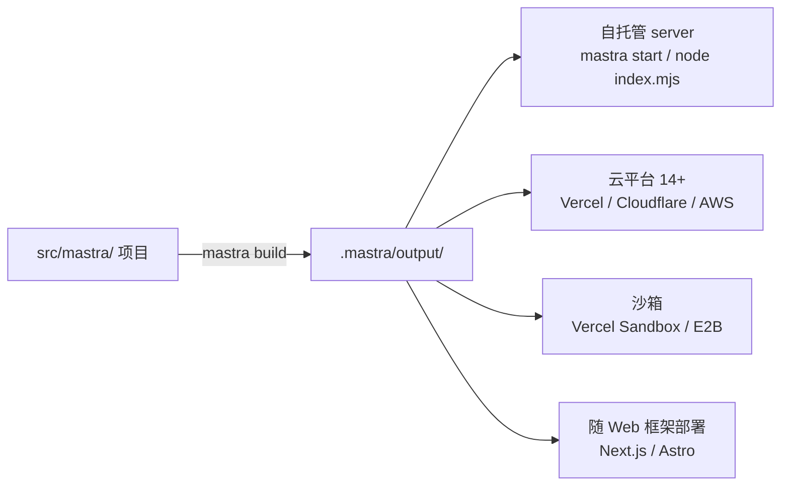

import { Canvas, Controls, Meta } from '@storybook/addon-docs/blocks';
import * as Stories from './deployment.stories';

<Meta of={Stories} name="Docs" />

# 部署概览与自托管

Mastra 应用经 `mastra build` 生成一个自包含的 Hono 服务产物，可以自己运行（自托管），也可以交给云平台或沙箱托管，或随 Next.js / Astro 等框架一起部署。本课先给部署方式全景图，再沿自托管主线走完「构建 → 运行 → 健康检查 → 优雅关闭」。读完你应能预测：换一种部署方式时，产物、启动命令和健康检查入口分别变成什么。



| 回查项 | 值 |
| --- | --- |
| 构建命令 | `mastra build`，产物在 `.mastra/output/` |
| 运行命令 | `mastra start` 或 `node .mastra/output/index.mjs` |
| 默认端口 | `PORT=4111` |
| 健康检查 | `GET /health` 返回 `200 OK` |
| 优雅关闭 | 监听 `SIGINT` / `SIGTERM`，`drainTimeout` 默认 5 秒 |
| 运行时要求 | Node.js ≥ 22.13.0、Bun、Deno、Cloudflare |

## 部署方式地图

四条路径共享同一个构建产物，差别只在产物交给谁运行：

| 方式 | 适用场景 | 入口 |
| --- | --- | --- |
| 自托管 Mastra server | 需要完全控制基础设施、长驻进程、WebSocket | 本课主线 |
| 云平台（14+） | 交给托管平台运行；Vercel / Netlify / Cloudflare 有内置 deployer | [部署到云平台](?path=/docs/cloud-deployment--docs) |
| 沙箱 | 秒级临时环境：即时预览、CI 部署、验证 agent 生成的应用、不可信用户实例 | [沙箱能力](?path=/docs/sandbox--docs) |
| 随 Web 框架部署 | Next.js / Astro 按框架自身流程部署，Mastra 随行 | 云平台课含框架指南 |
| monorepo | 多包仓库部署方式与独立 server 一致 | 同自托管主线 |

切换下方控件，观察同一份构建产物在三种方式下的去向：

<Canvas of={Stories.Interactive} />
<Controls of={Stories.Interactive} />

| 读者操作 | 可观察证据 |
| --- | --- |
| 切换「部署方式」 | 右列运行形态与读数区的产物、启动命令、健康检查同步变化 |
| 调节「drainTimeout」 | 自托管底部优雅关闭时间线中 drain 段伸缩，读数显示毫秒数 |
| 打开 Show code | 看到该 Canvas 实际执行的 `example.ts` |

### Mastra Platform 三产品

托管平台把部署拆成三个可独立组合的产品，细节见 [Platform 入门](?path=/docs/mastra-platform--docs)：

- **Observability**：独立托管服务，提供可搜索的 traces、日志与指标。
- **Studio**：托管可视化环境，测试 agent、运行 workflow、查看 trace。
- **Server**：把应用作为 API server 的生产部署目标。

### Workflow runners 与 Workers 概览

- workflow 默认用 Mastra 内置引擎执行；需要步骤记忆（step memoization）与自动重试时可接 Inngest 或 Temporal，细节见 [运行器与 Workers](?path=/docs/workflow-runners--docs)。
- Workers 是独立于 API server 的进程，承担 workflow 编排、cron 调度与后台工具执行，可独立伸缩、故障隔离。

## 自托管主线

自托管 = 自己保管 `.mastra/output/` 并运行它。Hono 服务、工具、依赖全部打进产物目录，目标机器不需要源码。

### mastra build 产物

在项目根目录执行：

```bash
mastra build
# 产物输出到 .mastra/output/
```

| 产物 | 说明 |
| --- | --- |
| `index.mjs` | 生成的 Hono HTTP 服务入口 |
| `mastra.mjs` | 打包后的 Mastra 实例配置 |
| `tools.mjs` / `tools/` | 聚合的工具导出与逐个工具 bundle |
| `package.json` / `node_modules/` | 依赖清单与安装结果 |
| `.npmrc` / `public/` | 存在才复制；`public/` 来自 `src/mastra/public` |
| `playground/` | Studio UI，构建时加 `--studio` 才生成 |

产物目录自包含：整目录拷贝到任意服务器即可直接运行。

### 构建提取规则（高频坑）

`bundler`、`deployer`、`server` 三组构建期配置，必须是传入 `new Mastra()` 的直接属性才能被构建提取：

```ts
// 有效：键直接写出来，值可以来自变量、导入或函数调用
export const mastra = new Mastra({
  bundler: { externals: ['sharp'] },
  server: { port: 4111, drainTimeout: 240_000 },
});

// 无效：藏在工厂调用或对象展开里，构建提取不到，回退默认构建行为
export const mastra = new Mastra(createMastraOptions());
export const mastra = new Mastra({ ...options });
```

### 运行与健康检查

```bash
mastra start                      # 或
node .mastra/output/index.mjs
```

`mastra start` 会加载 `.env.production` 与 `.env`、对缺失模块给出提示，并接管进程信号做优雅关闭；直接 `node` 运行则跳过这些便利。启动后验证：

```bash
curl http://localhost:4111/health   # 返回 200 OK
```

| 环境变量 | 作用 |
| --- | --- |
| `PORT` | 服务端口，默认 `4111` |
| `MASTRA_STUDIO_PATH` | Studio 构建目录，默认 `./playground` |
| `MASTRA_SKIP_DOTENV` | 设置后跳过 `.env` 加载 |
| `NODE_OPTIONS` | 例如构建 OOM 时用 `--max-old-space-size=4096` |

开启 `server.build.openAPIDocs` / `server.build.swaggerUI` 后，`/api/openapi.json` 与 `/swagger-ui` 可用；全部路由可在 `mastra dev` 的 `http://localhost:4111/swagger-ui` 查看（本地开发入口见 [Studio](?path=/docs/studio--docs)）。

### 优雅关闭

默认信号处理流程：收到 `SIGINT` / `SIGTERM` → 停止接收新连接 → 等待 `server.drainTimeout` 内的活跃请求与流结束 → 执行 `mastra.shutdown()`。

- workflow 运行（含 durable agent 运行）获得同样的 drain 窗口，之后才拆除 workers 与 pub/sub。
- HTTP drain 与 workflow drain 顺序执行，时间预算要覆盖两者加清理。
- 默认窗口 5 秒；期间再次收到信号立即终止进程。
- 平台终止宽限期更长时按毫秒对齐，例如 `server: { drainTimeout: 240_000 }`。
- 手动触发带自定义窗口：`await mastra.shutdown({ drainTimeout: 30_000 })`；要自己管理信号用 `server.handleShutdownSignals`。

### 流式请求的跨进程边界

普通 `agent.stream()` 的流不能跨进程恢复：服务进程退出后，流若没等到终止事件，就把这一轮视为中断，由客户端重试或对账。要求轮次在进程替换后仍存活时，需要 durable agents（见 [Durable Agents](?path=/docs/durable-agents--docs)）。崩溃恢复还依赖共享的持久 run storage 与幂等工具；重启后要重放错过的事件，需接共享持久缓存（如 Redis，默认事件缓存在内存里）。

## 常见问题

- 构建后 `server` / `bundler` 配置不生效，产物总是默认行为
  把 `bundler` / `deployer` / `server` 改成 `new Mastra()` 的直接属性；工厂函数或对象展开里的键无法被构建提取。
- 构建时报 `JavaScript heap out of memory`
  用 `NODE_OPTIONS="--max-old-space-size=4096" mastra build` 提高堆上限后重试。
- 滚动发布时请求被提前掐断
  把 `server.drainTimeout` 对齐平台终止宽限期（毫秒），并记住 HTTP 与 workflow drain 顺序执行、耗时相加。

## 总结回顾

摘要：

Mastra 把 agent 应用构建成自包含的 Hono 服务：`mastra build` 产出 `.mastra/output/`（含 `index.mjs`），这份产物可以自托管（`mastra start` 或 `node index.mjs`，`/health` 探活）、交给 14+ 云平台、放进 Vercel Sandbox / E2B 沙箱，或随 Next.js / Astro 按框架流程部署；Mastra Platform 提供 Observability、Studio、Server 三个托管产品，Inngest / Temporal 运行器与独立 Workers 承担长时任务。自托管的关键是 `bundler` / `deployer` / `server` 三组直接属性、`PORT` 与 `/health`，以及默认 5 秒的 `SIGINT`/`SIGTERM` drain 流程；普通流式请求不跨进程存活，进程替换场景需要 durable agents。

一句话：

> 部署的本质是分发 `.mastra/output/`：自托管自己运行它，平台与沙箱替你运行它，而构建期配置必须写在 `new Mastra()` 的直接属性上。

知识要点：

- `mastra build` 的产物目录里有哪些文件，哪个是服务入口？
- 三种部署方式下，启动命令与健康检查入口分别是什么？
- 为什么 `new Mastra(createMastraOptions())` 里的 `server` 配置会失效？
- 优雅关闭的默认流程是什么？`drainTimeout` 默认几秒、如何对齐平台宽限期？
- 为什么进程重启后拿不到之前的流式响应？用什么能力补足？

## 参考资料

- [Deployment Overview](https://mastra.ai/docs/deployment/overview)
- [Self-Hosting Mastra Server](https://mastra.ai/docs/deployment/mastra-server)

