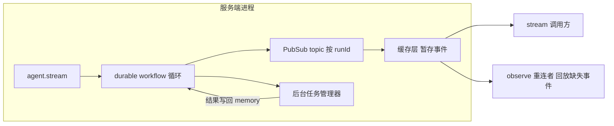

import { Canvas, Controls, Meta } from '@storybook/addon-docs/blocks';
import * as Stories from './durable-agents.stories';

<Meta of={Stories} name="Docs" />

# Durable Agents 与后台任务

普通 Agent 的 `stream()` / `generate()` 活在一次请求里：客户端断开、进程重启，循环就随之中断；工具跑几分钟，循环就干等。Harness 把长时问题拆成两个机制——**Durable Agents**（Beta）把 agent 循环搬进可持久化的工作流运行时，事件经 PubSub 与缓存流转，断线可重连、崩溃可恢复；**后台任务**让慢工具异步派发、结果写回记忆，循环不被阻塞。两者都不替代普通 Agent：短任务、客户端始终在线时，普通 Agent 仍是最简单的选择。



**默认值与版本底线（回查用）：**

| 项 | 默认值 | 说明 |
| --- | --- | --- |
| Durable Agents 成熟度 | Beta，`@mastra/core` ≥ 1.45.0 | API 可能在非大版本变更 |
| durable / evented 缓存后端 | 内存 | 单进程内可回放；生产换 `RedisServerCache` 等 |
| `createInngestAgent` 缓存 | 关闭 | 需显式传 `cache` 或注册 `serverCache` |
| `recovery.durableAgents` | `'off'` | 崩溃后不自动恢复；`'auto'` 启动时重驱动 |
| 后台任务总开关 | 关闭 | `Mastra` 实例 `backgroundTasks.enabled: true` 显式启用 |
| 后台任务引入版本 | `@mastra/core` ≥ 1.29.0 | 必须已配置 storage 后端 |
| 后台并发 / 单 agent 并发 | 10 / 5 | `globalConcurrency` / `perAgentConcurrency` |
| `defaultTimeoutMs` | 300000（5 分钟） | 后台任务超时 |
| eligible 工具默认 disposition | `'deferred'` | 派发后 agent 继续，不等结果 |
| `untilIdle` 空闲超时 | 5 分钟 | 轮次之间计时，可用 `{ maxIdleMs }` 覆盖 |

## Durable Agents：把循环跑进工作流

机制分三层：`stream()` 把消息与选项序列化为 durable workflow 的输入，循环每一步可被记忆化与重放；产出的 chunk 发布到按 runId 为 key 的 PubSub topic，调用方订阅后进入 `ReadableStream`；可选缓存层把已发布事件暂存，让迟到的订阅者也能回放。run 状态持久化到 storage，所以能活过进程重启。

### 三工厂怎么选

三个工厂都返回可注册进 `Mastra` 的 agent（前两者继承 `Agent`，Inngest 返回 Proxy 转发），导入路径分别为 `@mastra/core/agent/durable` 与 `@mastra/inngest`。

| 工厂 | 包 | 适用 |
| --- | --- | --- |
| `createDurableAgent()` | `@mastra/core` | 本地开发 / 单进程，流可直接 await |
| `createEventedAgent()` | `@mastra/core` | 后台执行不阻塞当前请求，经 PubSub 消费 chunk |
| `createInngestAgent()` | `@mastra/inngest` | 生产级：每个工具调用是独立可重试的 memoized step，附监控面板 |

```ts
import { Agent, Mastra } from '@mastra/core';
import { createDurableAgent } from '@mastra/core/agent/durable';
import { RedisServerCache } from '@mastra/redis';
import Redis from 'ioredis';

const agent = new Agent({
  id: 'researcher',
  name: 'Researcher',
  instructions: '你是深度研究助手…',
  model: 'openai/gpt-5',
});

export const durableAgent = createDurableAgent({
  agent,
  // 默认内存缓存只支持单进程回放；生产环境换 Redis 等持久后端
  cache: new RedisServerCache({ client: new Redis('redis://localhost:6379') }),
});

export const mastra = new Mastra({ agents: { durableAgent } });
```

### stream、observe 与断线重连

`stream()` 返回 `` { output, runId, cleanup } ``：`output` 是可正常消费的流，`runId` 是这次 run 的回放钥匙，`cleanup` 释放订阅并删除缓存事件。客户端断线后，任何一方凭 `observe(runId)` 重新接入：先回放断连期间错过的 chunk，再续上实时订阅——下方时间轴演示的正是这条链路。

```ts
const { output, runId, cleanup } = await durableAgent.stream('调研 Solana 近期生态');
// 客户端断线重连：凭 runId 接回，先回放缺失 chunk，再继续实时流
const view = durableAgent.observe(runId);
// view.detach() 可挂到 request 的 abort 事件，客户端离开时停止观察
```

<Canvas of={Stories.Interactive} />
<Controls of={Stories.Interactive} />

| 读者操作 | 可观察证据 |
| --- | --- |
| 调整「断线时刻 / 离线时长」 | 离线区段变灰纹；服务端事件轴照常推进，缓冲区方块累积 |
| 等到重连时刻 | 缓冲事件整段变绿回放给客户端，「离线缓冲事件」读数归零 |
| 切「慢工具执行方式」 | 前台阻塞时 3s→6s 无任何产出；后台任务时 agent 继续输出，run 等到 completed 才结束 |

边界：observe 者不拥有 run——它提前退出只是取消订阅，run 继续跑；`idleTimeoutMs` 超时无 chunk 时按是否提供 `isAlive` 决定续期、报错结束还是清理 run。缓存事件一旦被 `cleanup` 删除就不可再回放；不手动调用时，run 结束后按 `cleanupTimeoutMs` 自动清理，且必须从启动 run 的进程调用。

### 挂起恢复与崩溃恢复

- 工具审批挂起后用 `durableAgent.resume(runId, { approved: true })` 恢复；`stream()` 可配 `requireToolApproval: true` 与 `onSuspended` 回调拿到 `toolCallId` / `toolName` / `args`。
- 崩溃恢复：`recovery.durableAgents: 'auto'` 让部署器启动时调用 `recoverAllDurableAgents()`（返回 `recovered` / `succeeded` / `failed`），也可用 `durableAgent.recoverActiveRuns()` 或指定 `{ runId }` 从最后快照重新驱动。
- 快照策略：`pending` / `paused` / `suspended` 始终持久化；`running` 检查点仅在 `'auto'` 时写入，可用 `shouldPersistSnapshot` 自定义。

恢复会从最后快照**重跑循环**：可能重新发起 LLM 调用（真实成本）与工具调用，子 agent 委托会整体从头重放。开启 `'auto'` 前必须让工具幂等或去重外部副作用；多副本同时 `'auto'` 会竞争恢复同一 run（暂无分布式锁），需自行选主。

## 后台任务：慢工具不阻塞循环

后台任务让 eligible 工具被派发到后台任务管理器：工具立即向 LLM 返回确认，循环继续；任务完成后结果写入 memory，`untilIdle: true` 时管理器自动重新拉起 agent 处理结果。任务持久化在 storage，进程重启后仍在；快速返回的工具仍走前台更简单。

### 启用与两级资格声明

总开关在 `Mastra` 实例上，且启用管理器本身不会让任何工具进后台；资格要在工具级或 Agent 级声明。

```ts
export const mastra = new Mastra({
  storage: new LibSQLStore({ id: 'storage', url: 'file:mastra.db' }),
  backgroundTasks: {
    enabled: true,
    globalConcurrency: 10,     // 默认 10
    perAgentConcurrency: 5,    // 默认 5
    backpressure: 'queue',     // 默认 'queue'
    defaultTimeoutMs: 300_000, // 默认 5 分钟
  },
});
```

| 层级 | 写法 | 关键字段 |
| --- | --- | --- |
| 工具级 | `createTool` 的 `background` 配置 | `enabled`、`defaultDisposition`、`timeoutMs`、`maxRetries`、`onComplete` / `onFailed` |
| Agent 级 | agent 的 `backgroundTasks.tools` | 逐工具 `{ enabled, timeoutMs }`、`tools: 'all'`、`false` 禁用、`waitTimeoutMs`、`onTaskComplete` / `onTaskFailed` |

解析顺序：工具级 + Agent 级决定资格与回退值 → 模型 `_background` 覆盖本次调用 → 管理器默认值补齐剩余 timeout / retries。

### 三种执行方式与 _background

- `foreground`：同步执行，无后台生命周期；`defaultDisposition: 'foreground'` 时资格仅给 LLM 选项。
- `deferred`（默认）：派发后 agent 立即继续；任务附着于 run，`untilIdle` 流会等它 reconcile。
- `awaited`：经管理器派发，但当前分支等待权威结果 reconcile 后再继续。

模型可在工具参数里加 `_background` 覆盖单次调用，字段执行前会被剥离：`{ "topic": "solana", "_background": { "disposition": "awaited", "timeoutMs": 900000 } }`。兼容写法 `_background.enabled` 为 `true` / `false` 等价 `deferred` / `foreground`，显式 `disposition` 优先。`_background` 只能修改已 opting in 的工具——未声明资格的工具即使模型点名后台，仍前台执行。

### 流事件与 untilIdle

`fullStream` 默认只含 agent 侧两个 chunk；`untilIdle: true` 把管理器侧七个 chunk 也汇入同一条流，并保持打开直到所有任务完成、结果注入 memory、agent 跑完收尾轮——直到无运行任务且无排队完成项时才关闭。

| chunk | 时机 |
| --- | --- |
| `background-task-started` / `background-task-progress` | 入队分配 taskId / 运行中数量（agent 流） |
| `background-task-running` / `background-task-output` | worker 拾取 / execute 流式输出（manager 流） |
| `background-task-completed` / `background-task-failed` | 成功（`payload.result` 同最终工具结果）/ 抛错或超时（manager 流） |
| `background-task-cancelled` | 完成前被取消（manager 流） |
| `background-task-suspended` / `background-task-resumed` | execute 内 suspend / resume 后（manager 流） |

不走流时用 `mastra.backgroundTaskManager.getTask(taskId)` 与 `listTasks({ status: 'running', agentId })` 读 storage 查询；`bgManager.stream()` 订阅全系统任务事件（先发运行中快照，再转发实时事件）。注意 `untilIdle` 下 `text`、`toolCalls`、`finishReason` 等聚合属性只解析第一轮 buffer，跨续轮聚合需自行消费 `fullStream` 累积。

### 挂起审批与重启恢复

工具在 `execute` 内调用 `suspend(data)`：状态持久化为 `suspended`、保存 workflow 快照跨重启存活、发出 `background-task-suspended`，并释放并发槽位。恢复走 `mastra.backgroundTaskManager.resume(taskId, resumeData)`；`untilIdle` 流中可用 `agent.resumeStream(resumeData, { runId, toolCallId, untilIdle: true })` 在同一 SSE 连接继续后续轮次。

```ts
execute: async ({ draft }, context) => {
  const { suspend, resumeData } = context.agent;
  if (!resumeData) {
    await suspend?.({ awaiting: 'approval', draft });
    return { approvedBy: '', edits: undefined };
  }
  const { reviewer, edits } = resumeData as { reviewer: string; edits?: string };
  return { approvedBy: reviewer, edits };
},
```

（工作流通用的 suspend / resume 语义见 [挂起与恢复](?path=/docs/suspend-and-resume--docs)。）

边界：工具 executor 存在进程内存——任务 suspended 期间进程重启，`resume` 前必须先 `manager.registerTaskContext(taskId, ...)` 重注册；`manager.cancel(taskId)` 对 suspended / running 均有效。嵌套后台只支持一层：root agent 派发的子 agent 可后台执行 eligible 工具，第二个 delegated-agent 边界在前台运行。

## 最佳实践

- 给 durable / 后台路径上的工具做幂等或副作用去重：自动恢复与重放会重跑 LLM 与工具，子 agent 委托整体重放。
- 缓存与存储按部署形态选：单进程演示用默认内存即可；要跨实例回放就配 `@mastra/redis`（或 valkey）；后台任务必须先有 storage。
- 子代理研究任务在 supervisor 上逐个 opting in 并集中调大 `timeoutMs`（如 900_000）；未列入的子 agent 若自带 eligible 工具，会按其自身 `backgroundTasks` 配置整背后台派发。
- 生命周期回调三层各自独立（工具 `background.onComplete`、agent 级 `onTaskComplete`、管理器级全局回调），按监控需求挂载，不互相替代。

## 常见问题

- 重连后 `observe(runId)` 看不到断连期间的旧事件？
  先查缓存后端：默认内存缓存只在单进程可回放，跨实例要配 `RedisServerCache` 等；若 run 已被 `cleanup`（手动或 `cleanupTimeoutMs` 后自动），缓存事件已删除，无法回放。
- 打开了 `backgroundTasks.enabled` 工具却仍在前台执行？
  总开关只启用管理器；工具要在 `createTool` 的 `background.enabled: true` 或 agent 的 `backgroundTasks.tools` 里声明资格，模型 `_background` 也只对已 opting in 的工具生效。
- 崩溃恢复后工具被执行两次？
  `'auto'` 恢复从最后快照重跑循环，期间的工具调用会重发；开启前保证工具幂等，或对写操作加去重键。
- 进程重启后 `resume(taskId)` 行为异常？
  executor 闭包随进程丢失，先 `registerTaskContext(taskId, ...)` 重注册再恢复；同进程内派发并恢复的任务不需要这一步。

## 总结回顾

摘要：

Durable Agents（Beta）用「durable workflow 循环 + 按 runId 的 PubSub + 可回放缓存」三层，把 agent 循环从单次请求中解放出来：`stream()` 产出 `runId` 与 `cleanup`，`observe(runId)` 支持断线重连回放，`resume()` 处理审批挂起，`recoverActiveRuns()` 在崩溃后从快照重驱动——代价是工具必须幂等。后台任务（默认关闭）通过工具级 / Agent 级两级资格声明，把慢工具派发为持久化的异步任务，三种 disposition 控制等待策略，`untilIdle` 让流等到结果写回记忆并跑完收尾轮；suspend / resume 提供任务级人工审批，进程重启后需 `registerTaskContext` 重注册。

一句话：

> 断线重连靠「工作流持久化 + PubSub + 缓存回放」，慢工具靠「后台派发 + untilIdle 收尾」，两者共同的前提是 storage 与幂等工具。

知识要点：

- 三个 durable 工厂分别适配什么场景？`stream()` / `observe(runId)` / `resume()` / `recoverActiveRuns()` 各解决什么问题？
- 缓存层的默认后端是什么？`cleanup` 之后回放会发生什么？
- 后台任务的两级资格声明、三种 disposition 与 `_background` 覆盖规则是什么？
- `untilIdle` 如何改变 `fullStream` 的 chunk 组成与流关闭时机？
- 任务 suspend 后如何恢复？进程重启后为什么必须 `registerTaskContext`？

## 参考资料

- [Durable Agents - Mastra Docs](https://mastra.ai/docs/harness/durable-agents)
- [Background Tasks - Mastra Docs](https://mastra.ai/docs/harness/background-tasks)
