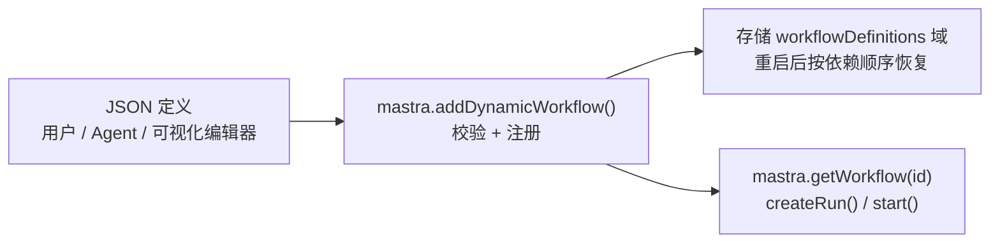

import { Canvas, Controls, Meta } from '@storybook/addon-docs/blocks';
import * as Stories from './dynamic-workflows.stories';

<Meta of={Stories} name="Docs" />

# 动态工作流

动态工作流（官方标注 Beta，API 稳定前可能出现不兼容变更）把工作流写成一份 JSON 文档：`inputSchema` / `outputSchema` 用 JSON Schema 声明，`graph` 描述步骤图。定义经 `mastra.addDynamicWorkflow()` 校验后注册成可运行工作流，并持久化到存储，进程重启后自动恢复。因为定义只是数据、不含 JS 闭包，HTTP 客户端、LLM、可视化编辑器都能生成它——这是低代码编排与 Agent 自主编排的基础。注册之后用与 `createWorkflow()` 代码定义完全相同的 `createRun()` / `start()` 执行；属于应用源码、需要自定义步骤函数的固定流程仍应继续用代码定义。



| API / 对象 | 用途 | 关键点 |
| --- | --- | --- |
| `mastra.addDynamicWorkflow(definition)` | 注册单个定义 | 校验通过才写存储与注册表；同 `id` 再次注册即替换实现版本 |
| `mastra.addDynamicWorkflows([a, b])` | 批量注册一组定义 | 整体校验、自动按依赖排序注册；任一失败则一个都不注册 |
| `mastra.getWorkflow(id)` | 取出已注册工作流 | 与代码定义工作流共用同一套执行 API |
| `client.upsertDynamicWorkflow()` | JS/TS 客户端管理定义 | 应用无需直接访问 `Mastra` 实例 |
| `POST /api/stored/workflows` | HTTP 管理路由 | 需 `stored-workflows:read` / `stored-workflows:write` 权限 |

## JSON 定义

定义是一个普通 JSON 对象，顶层字段为 `id`、`description`、`inputSchema`、`outputSchema` 和 `graph`。因为定义要在客户端、服务器与存储之间做 JSON 往返，schema 一律用 JSON Schema 而不是 zod。最小可运行定义只需一个 `graph` 条目：

```json
{
  "id": "greeting-workflow",
  "description": "Create a greeting for the supplied name",
  "inputSchema": {
    "type": "object",
    "properties": { "name": { "type": "string" } },
    "required": ["name"]
  },
  "outputSchema": {
    "type": "object",
    "properties": { "message": { "type": "string" } },
    "required": ["message"]
  },
  "graph": [
    { "type": "tool", "id": "greet", "toolId": "create-greeting" }
  ]
}
```

`graph` 条目通过 `type` 区分引用方式：`tool` 条目的 `toolId` 写 `Mastra` 实例 `tools` 对象里的键（如 `create-greeting`）；agent 条目与嵌套 workflow 条目写它们各自的固有 ID。当上一步输出与下一步输入对不上时，用 `mapping` 条目做映射，可读取工作流输入、先前步骤结果、workflow state 与 request context。

<Canvas of={Stories.Interactive} />
<Controls of={Stories.Interactive} />

| 读者操作 | 可观察证据 |
| --- | --- |
| 切换「JSON 定义」 | 画布重画节点图，读数「定义 id」与「执行序列」按新图变化 |
| 调整「运行输入 amount」 | 分支定义按 `amount >= 100` 分流，读数「执行序列」改走 vip 或 standard |
| 打开 Show code | 看到 Canvas 实际执行的 `example.ts`（离线示意，执行逻辑与真实定义同构） |

## 注册与执行

注册前先满足两个前置：被引用的工具、Agent、嵌套工作流已注册到同一个 `Mastra` 实例；存储配置了支持 `workflowDefinitions` 域的适配器（示例用 `LibSQLStore`）。缺存储支持时 `addDynamicWorkflow()` 仍会在内存里注册并正常执行，但进程重启后定义丢失。

```typescript
import { Mastra } from '@mastra/core/mastra';
import { LibSQLStore } from '@mastra/libsql';

const mastra = new Mastra({
  storage: new LibSQLStore({ id: 'mastra-storage', url: 'file:./mastra.db' }),
  tools: { 'create-greeting': greetingTool }, // graph 里 toolId 引用的键
});

await mastra.addDynamicWorkflow(definition); // 校验通过才写存储与注册表

const workflow = mastra.getWorkflow('greeting-workflow');
const run = await workflow.createRun();
const result = await run.start({ inputData: { name: 'Ada' } });

if (result.status === 'success') {
  console.log(result.result.message); // Hello, Ada!
}
```

对同一个 `id` 再次注册新定义即为替换实现版本：之后的 `createRun()` 用新图执行，已经开始的 run 沿用启动时的旧图。需要同时注册根工作流和它依赖的 helper 工作流时，用 `mastra.addDynamicWorkflows([rootDefinition, helperDefinition])`：集合作为整体校验并自动按依赖排序注册，任一校验失败则整个集合都不注册。

## 客户端与 HTTP 管理

定义本质是数据，可以完全不接触 `Mastra` 实例来管理：JS/TS 客户端用 `client.upsertDynamicWorkflow()`，服务器暴露 `POST /api/stored/workflows` 路由。自定义服务端只需把请求体交给 `addDynamicWorkflow()`：

```typescript
const definition = await request.json();
await mastra.addDynamicWorkflow(definition);
```

管理操作需要 `stored-workflows:read` 与 `stored-workflows:write` 权限，运行动态工作流需要 `workflows:execute`。可视化编辑器保存定义走的就是这条链路。

## 最佳实践

- 按来源选定义方式：流程要由用户、Agent 或可视化编辑器在不改代码、不重新部署的前提下创建时用动态工作流；流程属于应用源码或步骤需要自定义函数时用 `createWorkflow()`。
- 先注册依赖，再收定义：把 `graph` 会引用的工具、Agent、helper 工作流提前挂到 `Mastra` 实例上，未注册的引用会让校验失败。
- 根工作流与 helper 一起提交：用 `addDynamicWorkflows()` 整体注册，避免「根定义已注册、依赖却缺失」的中间状态。

## 常见问题

- 进程重启后动态工作流不见了
  换用支持 `workflowDefinitions` 存储域的适配器（如 `LibSQLStore`）。不支持该域时定义只存在于内存，重启即丢。
- 同 `id` 重新注册后，进行中的运行行为没变（或担心它变）
  替换只影响之后新建的 run，已开始的 run 沿用启动时的旧图。需要新图全量生效时等旧 run 结束或显式取消。
- 批量注册后一个工作流都没有
  `addDynamicWorkflows()` 是整体校验、整体注册：集合中任一定义失败，全部不注册。逐个单独注册可定位失败项。

## 总结回顾

摘要：

动态工作流用 JSON 文档表达工作流：`inputSchema` / `outputSchema` 是 JSON Schema，`graph` 用条目引用预注册的 tool、agent 与嵌套 workflow，步骤输出对不上时用 `mapping` 条目桥接。定义经 `mastra.addDynamicWorkflow()` 校验后注册进 `Mastra` 实例并持久化到 `workflowDefinitions` 存储域，重启自动恢复；`addDynamicWorkflows()` 把根定义和 helper 定义作为整体校验、按依赖排序注册。注册后与代码定义工作流共用 `getWorkflow()` / `createRun()` / `start()` 执行链路，同 `id` 重新注册即替换实现版本且只影响新 run。客户端 `upsertDynamicWorkflow()` 与 `POST /api/stored/workflows` 让应用不接触 `Mastra` 实例即可管理定义。

一句话：

> 当工作流要在运行时由用户、Agent 或可视化编辑器生成时，把它写成 JSON 定义交给 `addDynamicWorkflow()`，而不是写进代码。

知识要点：

- JSON 定义的五个顶层字段是什么？`graph` 条目如何分别引用 tool、agent 与嵌套 workflow？
- 注册动态工作流前要满足哪两个前置条件（依赖预注册、支持 `workflowDefinitions` 域的存储）？
- 同 `id` 替换后，新旧 run 各用哪张图？批量注册的失败语义是什么？
- 不接触 `Mastra` 实例时，客户端与 HTTP 分别用什么 API 管理定义、需要什么权限？

## 参考资料

- [Dynamic Workflows - Mastra Docs](https://mastra.ai/docs/workflows/dynamic-workflows)
