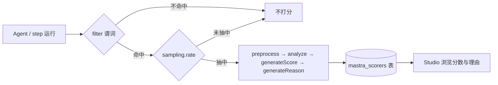

import { Canvas, Controls, Meta } from '@storybook/addon-docs/blocks';
import * as Stories from './evals-basics.stories';

<Meta of={Stories} name="Docs" />

# 评估基础与 Scorer

Scorer 是给 Agent 输出打分的"自动测试"：用模型评分（model-graded）、规则（rule-based）或统计方法，对一次输入/输出算出 0 到 1 之间的分数并附上理由。把 scorer 挂到 Agent 或 workflow step 的 `scorers` 配置上就是实时评估——每次运行先过 `filter` 谓词、再按 `sampling.rate` 抽样，抽中的进入流水线打分，结果自动落到 `mastra_scorers` 表并在 Studio 里浏览；配合数据集批量跑则是 `runEvals()` 的事（入口：`?path=/docs/evals-datasets--docs`）。本课建立内置 scorer 的分类地图与 `createScorer()` 四步流水线模型；下方实例可切换内置/自定义流水线、开关各步骤，观察得分与 judge 调用如何变化。

| 关键项 | 值 | 回查要点 |
| --- | --- | --- |
| 分数形式 | 0 ~ 1 数值 + 理由字符串 | `generateScore` 必选，`generateReason` 可选 |
| 采样 rate | 1 = 全部，0.1 = 10%，0 = 关闭 | 判定由 traceId 确定性推导，重放同一判定 |
| 结果存储 | `mastra_scorers` 表 | 需配置 `storage` 且 scorer 已注册，否则仅告警不落库 |
| 自定义工厂 | `createScorer()`（`@mastra/core/evals`） | 四步流水线，只有 `generateScore` 必选 |
| 内置导入 | `@mastra/evals` 系列包 | 如 `createAnswerRelevancyScorer`、`createToxicityScorer` |



## 内置 Scorer

官方把内置 scorer 分为三类，按"要评估什么"选类，再按名字取用：

| 类别 | 成员 | 评估什么 |
| --- | --- | --- |
| 准确与可靠 | answer-relevancy、faithfulness、hallucination、tool-call-accuracy、multi-turn-judge | 回答是否切题、是否忠于上下文、有无幻觉、工具调用是否正确、多轮表现 |
| 上下文质量 | context-precision、context-relevance | 检索给模型的上下文本身好不好，面向 RAG 流水线 |
| 输出质量 | tone-consistency、toxicity、bias | 语气一致性、毒性、偏见等内容安全维度 |

内置 scorer 以工厂函数创建，judge 模型用 `provider/model` 字符串传入（保持 provider 可替换）：

```ts
import {
  createAnswerRelevancyScorer,
  createToxicityScorer,
} from '@mastra/evals/scorers/prebuilt';

const relevancy = createAnswerRelevancyScorer({ model: 'openai/gpt-5-mini' });
const safety = createToxicityScorer({ model: 'openai/gpt-5-mini' });
```

边界：内置 scorer 只覆盖通用维度；完整成员名单与各自的输入要求以[官方 built-in-scorers 文档](https://mastra.ai/docs/evals/built-in-scorers)为准。"回答必须附带来源"这类业务规则，走下方自定义 Scorer。

## 实时评估挂载与采样

挂载即实时评估：Agent 与 workflow step 都有 `scorers` 配置项，每个条目由 `scorer` 实例、`sampling` 采样和可选 `filter` 组成；step 上的 scorer 拿到的是该步骤自己的输入与输出。

```ts
export const evaluatedAgent = new Agent({
  id: 'evaluated-agent',
  scorers: {
    relevancy: {
      scorer: createAnswerRelevancyScorer({ model: 'openai/gpt-5-mini' }),
      sampling: { type: 'ratio', rate: 0.5 }, // 抽 50% 的运行
    },
    safety: {
      scorer: createToxicityScorer({ model: 'openai/gpt-5-mini' }),
      sampling: { type: 'ratio', rate: 1 }, // 全部评估
    },
  },
});
```

挂到 workflow step 时，`createStep` 直接接受同样的 `scorers` 键：

```ts
const contentStep = createStep({
  id: 'content-step',
  scorers: {
    customStepScorer: {
      scorer: quoteSourcesScorer,
      sampling: { type: 'ratio', rate: 1 },
    },
  },
  // inputSchema / execute 等照常
});
```

采样判定是确定性的：由 trace ID（无 trace 时退回 run ID）推导，不是运行时掷随机数，所以同一次运行重放得到同一判定。`filter` 是声明式 JSON 谓词，在采样之前执行，不命中的运行直接不打分：

```ts
filter: {
  op: 'eq',
  left: { path: 'requestContext.plan' },
  right: { literal: 'enterprise' }, // 只评估企业版流量
}
```

支持的谓词根路径包括 `requestContext.*`、`entity.*`、`threadId`、`resourceId` 等，操作符有 `eq`、`in`、`exists`、`and`、`or`、`not` 等；未知根路径在构造时即报错。

分数与理由自动写入 `mastra_scorers` 表——前提是 Mastra 实例配置了 `storage`，且 scorer 已注册（挂在 Agent/step 上，或在 `Mastra` 类的 `scorers` 选项里注册；落库只比对 scorer ID，本地与线上的配置可以不同）。Studio 的 Observability 区可浏览分数值、理由、judge 提示词与输入输出，并对历史 trace 补打分。

## 自定义 Scorer

`createScorer()` 用四步流水线表达一次评估：`preprocess`（预处理输入）→ `analyze`（提取判定依据）→ `generateScore`（必选，算出 0~1 分数）→ `generateReason`（生成理由）。每一步既可以是普通 JS 函数（如 `({ results }) => number`），也可以是交给 judge 模型的 prompt 对象——prompt 对象用 `description` + `createPrompt` 描述任务，配 `outputSchema`（zod）拿结构化结果，落在 `results.<step>StepResult`；`judge.model` + `judge.instructions` 提供默认裁判模型，单步可覆盖。用实例拆解两条流水线（generateScore 必选，开关不可调）：

<Canvas of={Stories.Interactive} />
<Controls of={Stories.Interactive} />

| 读者操作 | 可观察证据 |
| --- | --- |
| 切换「流水线类型」 | 内置 answer-relevancy 与自定义 quote-sources 两套步骤与说明切换 |
| 关闭 preprocess | 内置流水线输入未清洗，得分 0.86 → 0.72 |
| 关闭 analyze | 自定义 generateScore 退回函数启发式，judge 调用次数减少 |
| 关闭 generateReason | 只出分，理由读数变为"未生成" |

最小可运行的自定义 scorer（改写自官方示例）：`analyze` 用 prompt 对象加 zod 提取引用，`generateScore` 用纯函数算分——全部用函数步骤时 judge 从未被调用：

```ts
import { createScorer } from '@mastra/core/evals';
import { z } from 'zod';

const quoteSourcesScorer = createScorer({
  id: 'quote-sources',
  description: '检查回答是否附带来源',
  judge: { model: 'openai/gpt-5-mini', instructions: '你是严格的评估者。' },
})
  .analyze({
    description: '检测回答中的来源',
    outputSchema: z.object({ hasSources: z.boolean(), sources: z.array(z.string()) }),
    createPrompt: ({ run }) => `回答里是否包含来源？逐条列出。\n\n回答：\n${run.output}`,
  })
  .generateScore(({ results }) => (results.analyzeStepResult.hasSources ? 1 : 0));

const result = await quoteSourcesScorer.run({ input: '…', output: '… [1] Source: [1] Wikipedia' });
// result.score === 1
// result.analyzeStepResult === { hasSources: true, sources: ['Wikipedia'] }
```

类型与裁剪边界：

- `type: 'agent'` 把 `run.input` / `run.output` 类型化为 Agent 的输入输出结构；`outputSchema` 让步骤结果结构化、可被后续步骤读取。
- `judge` 只在流水线含 prompt 对象步骤时被调用；全函数流水线零 judge 成本、结果确定。
- `prepareRun: filterRun({ partTypes, toolNames, maxRememberedMessages, ... })` 声明式裁剪 scorer 看到的消息（系统消息始终保留）；也可传自定义函数改写 run。
- 需要看过内容后放弃评分时，在函数步骤里返回 `notScorable('原因')`：其余步骤跳过、该运行不计入聚合。尽量放在 `preprocess`，抢在 judge 调用之前。

## 最佳实践

- judge 模型选便宜档：评分是高频内部调用，`openai/gpt-5-mini` 这类小模型足以承载多数内置 scorer 与 prompt 对象步骤。
- 先 filter 后采样再省 judge：确定"这批流量不用评"用 `filter`（采样前），确定"这条内容不可评"用 `notScorable()`（流水线内、越早越好），别让 judge 白跑。
- 业务规则写成函数步骤：内置三类只覆盖通用维度；包含来源、格式、禁词等规则用函数实现，零 judge 成本且结果可复现。

## 常见问题

- 分数没有落进 `mastra_scorers` 表，日志反复出现 "Scorer with id ... not found"
  给 Mastra 实例配置 `storage`，并确认 scorer 已注册（挂在 Agent/step 上，或在 `Mastra` 的 `scorers` 选项注册）。落库只按 scorer ID 解析元数据，本地与线上配置不同不影响存储。
- 采样"看起来随机"，重放后判定却又一样
  这是设计行为：`sampling.rate` 的判定从 trace ID 确定性推导，不是运行时掷骰；想看到不同抽样结果，调整 `sampling.rate` 或换一次新的运行（新 traceId）。
- `filter`、`filterRun()`、`notScorable()` 三者分不清
  `filter` 在采样前按请求元数据（`requestContext`、`resourceId` 等）决定要不要评；`filterRun()` 只裁剪 scorer 看到的消息内容，不影响是否评分；`notScorable()` 在流水线内检查输入输出后放弃本次评分。

## 总结回顾

摘要：

Scorer 用模型评分、规则或统计方法把一次 Agent 输出量化为 0~1 分数并生成理由。内置 scorer 按准确与可靠、上下文质量、输出质量三类取用，工厂函数以 `provider/model` 字符串指定 judge 模型。挂到 Agent 或 workflow step 的 `scorers` 配置即成为实时评估：`filter` 谓词先于 `sampling.rate` 的确定性抽样，结果落在 `mastra_scorers` 表并在 Studio 浏览。自定义 scorer 用 `createScorer()` 的四步流水线表达：preprocess 与 analyze 准备判定依据，generateScore 必选出分，generateReason 补充理由；步骤用函数或 prompt 对象实现，`filterRun()` 与 `notScorable()` 处理不可评运行。

一句话：

> 评估 = 按维度选 scorer + 挂载采样落库 + 四步流水线出分给理由；函数步骤零 judge 成本，prompt 对象步骤才有裁判模型参与。

知识要点：

- 三类内置 scorer 各解决什么问题，分别有哪些成员？
- `sampling.rate` 取值怎么读？为什么同一运行重放的采样判定不变？
- 分数落库 `mastra_scorers` 需要哪两个前提？缺了会看到什么现象？
- `createScorer()` 四步中哪步必选？函数步骤与 prompt 对象步骤的区别是什么？
- `filter`、`filterRun()`、`notScorable()` 分别在哪个环节起作用？

## 参考资料

- [Evals Overview](https://mastra.ai/docs/evals/overview)
- [Custom Scorers](https://mastra.ai/docs/evals/custom-scorers)
